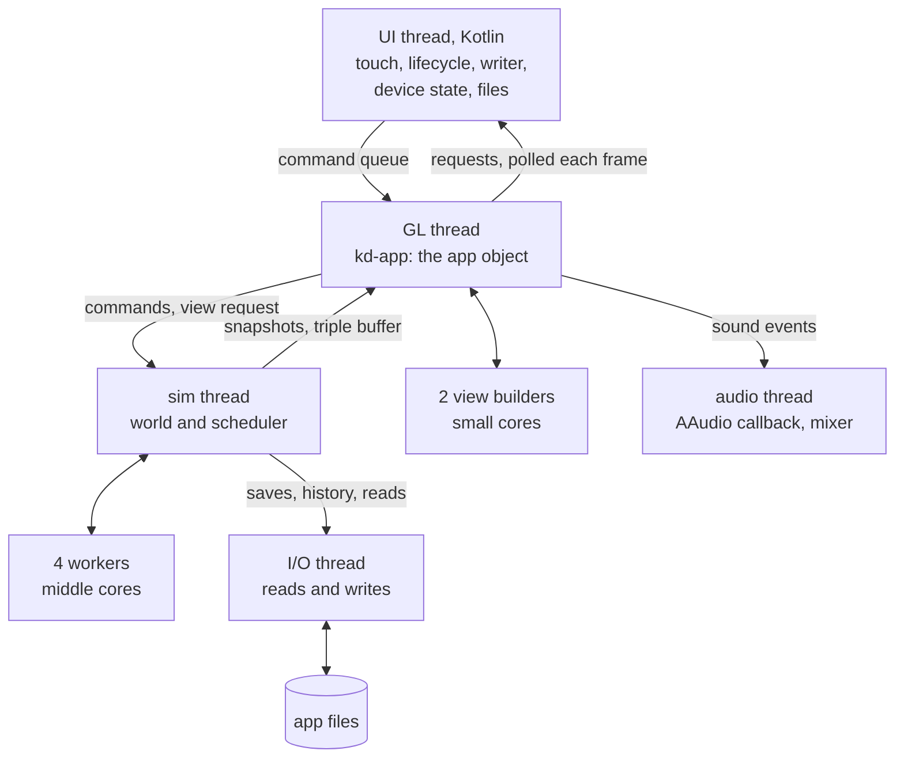

# Kindling: architecture

How Kindling is built: its parts, their data and rules, the threads they run on, the files they keep, what each costs, and why each choice was made.
It serves `PROJECT.md`, which says what the game must be, and is served by `IMPLEMENTATION.md`, which says in what order to build it.
Every part names the `PROJECT.md` items it serves by ID (`TIM-17`); the implementation plan cites this file by section (`A4.2`).
The results of the pre-tests that settled the technology are kept here for good (A1.4); the pre-test code stays in the git history before the commit that deleted the `pretests` folder.

Written for the AI agents who build from it, and readable by the owner on a phone: where a builder would otherwise guess, there is a number; where a choice was made, there is a reason and a fallback.
A **Decision:** line marks a choice this document makes where the plan leaves room; a **Conflict:** line marks where a part had to depart from the brief it was written from, with the alternative used.

## Status (2 October 2026): frozen

- Written in nine parts against the settled `PROJECT.md`, then reviewed adversarially in two passes: an independent review of every part, with every finding applied, an integration pass that made the parts agree on names and numbers, and a second review of the whole document against the settled plan, with its findings applied.
- The technology in A1.3 is approved under the owner's grant of full autonomy on 1 October 2026, and stays open to the owner's overrule (`PRC-03`).
- Owner decisions folded in: Revelation (`GOD-13`); the stage speed budgets of `PLT-04`; simple burial (`SCP-21`, `MAT-08`); saves every 10 real minutes in overnight mode (`PLT-07`).
- From now on it changes only through the implementation: an alpha that finds a part unworkable writes a **Conflict:** note in its section of `IMPLEMENTATION.md` and changes this file in the same branch, naming the section.
- On 3 October 2026 the owner asked for the renderer to be designed anew, lit like Minecraft's Vibrant Visuals (A11, `PRE-30`), and for the codebase to be deleted and rebuilt from scratch; A11.13 says how the renderer's code is organised.

## Contents

- A1. Overview
- A2. Code layout and targets
- A3. Foundations
- A4. Time and the simulation core
- A5. The world
- A6. Things and blueprints
- A7. Living things
- A8. People
- A9. Culture and society
- A10. The player
- A11. Drawing
- A12. Screens, views and text
- A13. Sound
- A14. Saving and storage
- A15. Building, delivery and testing
- A16. Budgets
- A17. Technical risks and fallbacks
- A18. Traceability

## A1. Overview

What it covers: what the architecture must deliver, the system at a glance, the settled technical choices with the pre-test evidence behind them, and the technical terms used throughout.
Serves: `PRN-16`, `PRC-03`, `PRC-04`, `PRC-08`, `PLT-01`, `PLT-04`, `PLT-05`.

### A1.1 What the architecture must deliver

Kindling is one game for one phone, built and tested by AI agents in cloud sessions and delivered as playable alphas.
Every later section serves some of these constraints from `PROJECT.md`.

| Constraint | IDs | What it forces |
|---|---|---|
| One phone, offline, installed by download | `PLT-01`, `PLT-03`, `PLT-06`, `SCP-02`, `SCP-10` | an arm64-only APK for the Pixel 11 Pro XL; no network in play; no store, accounts or analytics |
| A smooth screen; time slows when the phone can't keep up | `PRN-11`, `VIS-14`, `PLT-04` | drawing never waits for the simulation; frames within 8.3 ms at 120 Hz; speed adapts, detail never does |
| Same state, same result; looking changes nothing | `TIM-16`, `TIM-17`, `WLD-13`, `RES-05` | the determinism contract (A3.1); data flows only from the world to the view |
| History is kept, not re-run | `PRN-15`, `PLT-07`, `PLT-10` | the present state, the book of ages and the record of your acts, saved atomically every 30 real seconds (A14) |
| Language models only describe | `PRN-06`, `SCP-06`, `MND-01`, `PRE-17`, `PRE-41` | the writer sits in the shell and front end, out of the simulation's reach (A2.3) |
| Believable rules, no script, score or real map | `PRN-02`, `SCP-05`, `SCP-07`, `SCP-11`, `SCP-18` | simple rules on catalogue characteristics (A3.6, A6); one human species in the catalogue; worlds only from the generator (A5.7); no goal or score in any view (A12.4); stories only from the rules, named by the recognisers (A12.5) |
| Readers never write | `TIM-03`, `PRE-39`, `WLD-13` | director, recognisers and snapshot builder read a world without interior mutability (A2.3) |
| Modular, generic content | `PRN-14`, `PRN-07`, `MAT-13`, `MAT-14` | catalogue data (A3.6); rules match characteristics, never names; crates without cycles |
| Everything kept can be seen and explained | `PRN-04`, `PRN-13`, `PRN-10` | `kd-view` carries every record a card or view needs |
| Pace by tuning only; switches only in tests | `PRN-12`, `PRN-17`, `RES-10`, `RES-16` | tuned numbers in catalogues; switches recorded in the world (A3.9) |
| Budgets | `TIM-07`, `MND-15`, `PLT-01`, `WLD-11` | 1,000 people at 1 game year or more a real minute; about 1 ms per person per game day, counted at about 1.05 ms with their animals and 1.15 ms with making areas (A8.21, A16.3); up to about 7,000 people by Year 500 (`BIO-04`); about 8 GiB (A16) |
| Worlds survive small updates and move by export | `PLT-08`, `PLT-09` | a rules version in every world and in the catalogue blob (A3.6) |
| Built and tested in cloud sessions | `PRC-01`, `PRC-02`, `SCP-15`, `PLT-05`, `PRC-09`, `PRC-10`, `PRC-11`, `PRC-12` | AI agents write, test and review; you play, review stages and approve plan changes; a headless build; `tools/check.sh` and an independent review before every merge; an APK every alpha (A15) |
| Both orientations | `PLT-02`, `PRE-34` | rotation never restarts the app; the art pixel keeps its size (A2.5) |

### A1.2 The big picture

Three thin shells wrap one Rust core: the Kotlin shell and the browser glue host a drawing surface, pass touches in and offer services the core can't reach, and the headless command line runs the same core without picture or sound.
The crates and their layers are in A2.2 and A2.3.
On the phone the work runs on seven kinds of thread (A4 details the hand-offs):



- The app object lives on the GL thread; the UI thread reaches it only through a command queue (A2.5).
- The world publishes snapshots of what is in view and never reads the camera, the frame or the speed (`WLD-13`); powers take effect at a stated game time (A4), and camera moves never reach the world.
- Written text comes back only to be shown and stored beside its record; no rule reads it (`MND-01`).
- In the browser one thread does it all, frame by frame (A2.6).

### A1.3 Settled choices (the technology proposal)

This table is the technology proposal of `PRC-03`; the evidence behind each row is in A1.4.
**Owner approval:** approved on 1 October 2026 under the owner's grant of full autonomy, and open to the owner's overrule at any time (`PRC-03`).

| Choice | Decision (evidence) | Fallback |
|---|---|---|
| Core language | Rust stable (1.97.0) for simulation, drawing, sound mixing and UI (B01) | a C++ kernel only where a measured gain exceeds 10% |
| Numbers | `f32`; transcendental maths through the pure-Rust `libm`; no fused multiply-add; fixed-order sums; no `usize` or −0.0 in saved data (A3.2; B01) | `f64` locally, under the same rules |
| Chance | keyed draws from a guarded wyhash of (world, system, purpose, subject, moment); a fortune retry flips one key bit (A3.3; B02) | keyed splitmix64 (also passed) |
| App | Kotlin shell, Rust core `libkindling.so` over JNI, arm64 only, minSdk 31, targetSdk 36 (A2.5; B78) | a pure Rust shell with hand-written JNI per service |
| Toolchain | NDK r30, Gradle 8.14.3, AGP 8.13.2, Kotlin 2.3.21 and the rest of A2.8; Google's mirror of Maven Central first (B78) | refetch with `tools/setup.sh` |
| Drawing | OpenGL ES 3.0 and WebGL2 through `glow`; GLSL ES 3.00 shaders written for the renderer's own design (A11.1); one art pixel is 4 screen pixels (B66) | fewer passes or art pixels; no Vulkan |
| Crawling pixels | a slot in the renderer for the fix chosen at the first visual review (`PRE-22`, `PRE-31`; B66) | Fade, tuned with the owner |
| Memory layout | struct of arrays per kind, generational handles, permanent uids (A3.4; B04) | none needed |
| Saves | chunks in a new pack per save, committed by a manifest (A14.4), zstd level 1 per chunk, temporary file, flush, rename, hash checked on load; every 30 real seconds, through a `Storage` trait with a file and an IndexedDB version (A14; B04) | uncompressed chunks |
| History | present state, book of ages and record of your acts; a zstd log keeping every event for 50 game years, then thinned (`PRN-15`, `PLT-10`; B04) | thin harder |
| Map cells | square cells nesting as a quadtree on the torus (A3.7; B10) | none needed |
| Terrain | height map plus 3D pieces; plates then erosion (A5; B11) | erosion on warped noise plus pit filling |
| Writer | Gemini Nano through ML Kit's GenAI Prompt API, Android only; dark events stated as plain facts (A12; B73) | template text (`PRE-41`) |
| Text checker | rule-based, no AI; on failure the template text is shown (A12; B73) | template text |
| Sound out | AAudio; at most 32 sounds at once; a last stage lifts deep sounds on the speaker, off with headphones (A13; B74) | shared mode; a lower cap |
| Sound making | impacts as material-shaped noise; instruments from their shapes; drums parked (A13; B74) | ringing notes plus noise |
| Speech | murmur only (`SND-03`): syllables rendered once in the cloud with a neural voice, strung together on the phone and the web (A13; B76) | none needed |
| Phone budget | plan on the held speed (43% of a burst), about 8 GiB, about 3 W (B79) | slow time sooner (`PRN-11`) |
| Cloud runs | one process per world, four per session, a checkpoint every simulated month on the session's disk; small compressed ones pushed to the `runs` branch (A15; B80) | longer runs or fewer worlds (`RES-13`) |
| Catalogues | Markdown, one entry per heading, a TOML block as the single source, generated tables, one binary blob (A3.6; B09) | plain TOML files |
| Delivery | an APK every alpha, at most 50 MB, in `dist/`; one key derived from the passphrase secret with scrypt, rotated if ever needed by APK Signature Scheme v3 (A15; B78) | none needed |
| Web build | `wasm32` with `wasm-bindgen`, WebGL2, AudioWorklet, IndexedDB, one thread; a private page once the probe shows WebAssembly runs there (A2.6; B66) | the APK alone |

### A1.4 The pre-test record

The pre-tests ran on 1 October 2026, in the cloud and on the owner's phone; this record keeps their results for good, since `pretests/` is deleted once this architecture exists (`PRC-08`).
The code and raw results stay in git history in the commit before the deletion, found by `git log --diff-filter=D -1 -- pretests/BUILDING-BLOCKS.md` (in a shallow clone, after `git fetch --unshallow origin`); A2.9 says how they serve: as evidence, never as code to copy.

**The phone (B79 and both test apps)**
- Pixel 11 Pro XL, Tensor G6, Android 17 (SDK 37), 4 KB pages, 15,655 MiB of memory, 512 GB storage, 5,340 mAh battery.
- Cores: 2 small (cpu 0–1, 2.65 GHz), 4 middle (cpu 2–5, 3.38 GHz), 1 fastest (cpu 6, 4.11 GHz), readable in `cpuinfo_max_freq`.
- Heat kernel (Rust, `f32`), billion updates a second: one small core 2.15, middle 2.87, fastest 4.89; all 7 in a burst 15.6, then about 6.8 (43%) held from minute 2 to 10, at about 3 W, battery 35.1 to 37.6 °C, thermal status "light" at most, 14.6% of the battery an hour.
- Energy per update, net of 0.84 W idle: middle about 0.7 nJ, small 1.0, fastest 1.3, so the middle cores do the most work per joule.
- Thermal headroom (`getThermalHeadroom(10)`, at most once a second) read on 100% of samples: 0.63 idle, 0.78–0.86 under the held load; thresholds light 0.80, moderate 0.93, severe 1.00, critical 1.05; so headroom is the signal for slowing time before heat (`PRN-11`).
- Display 1080 × 2404 at 120 Hz (modes 60 and 120) via `Surface.setFrameRate`; full screen in portrait is about 270 × 601 art pixels.
- At 120 Hz a plain OpenGL ES scene missed 0.21% of frames (99% under 10.6 ms) on "ANGLE (Imagination Technologies, Vulkan … PowerVR)", so native GLES runs on ANGLE here as the browser does; B66's test scene in a web view missed 1.4%, drawing in about 2 ms (99% under 4.4 ms).
- Memory: the app used the full 10 GiB allowed with no warning, but at most 8.4 GiB stayed resident and free memory fell from 7.5 to 0.4 GB: plan on about 8 GiB.
- Java ran at 18–21% of Rust's speed (25–32% on a desktop JVM): fine for the shell only.

**Numbers and languages (B01)**
- Million heat updates a second on one cloud thread: `f32` Rust 2,508, C++ 2,515, `f64` 1,218, Q16.16 1,768; Rust against C++ over 52 pairs, geometric mean 1.00.
- Phone: Rust 16% faster than C++ on the middle cores, 47% on the fastest; Q16.16 at 72–100% of `f32` on one core, 65–112% on all.
- All 87 combinations repeated exactly across runs and 1–4 threads; on the phone all 47 runs repeated and all 45 cloud predictions matched bit for bit.
- C++ differed between x86 and ARM in 4 of 26 cases, where clang fused `a*b+c` (20 fused instructions in heat, 112 in learning); Rust fused none; platform maths (`exp`, `sin`) may differ, so only basic arithmetic is proven identical.
- Summing the test values (exactly 3,057,372.846): a fixed `f32` tree gave 3,057,371.0 at 4.0–4.2 billion values a second, a plain loop 3,057,589.5 at 1.4 billion.

**Random draws (B02)**
- Six keyed generators passed PractRand to 2^34 bytes per stream (one key's moments, neighbouring beings), and to 2^32 for first draws beside their fortune retries.
- Plain wyhash was fastest (1,152 million draws a second on a cloud thread), but in about one stream in 8 million every being draws the same at one moment; the guarded version keeps 81% of its speed in the walk kernel (110 against 136 million steps a second; splitmix64 96).
- Phone: 1.04 billion guarded draws a second on the fastest core, 3.25 billion on all.

**Storing data (B04)**
- Synthetic world of 403 MB: 10,000 people (3.2 KB each), 100,000 animals and 1,000,000 things (32 bytes each), 1 km cells, 256 m patches.
- ns per record per pass, one record per thing against one array per field: animals 2.12 against 0.45, things 1.77 against 0.66, people 7.9 against 1.4; `hecs` 48 bytes a record, 96 ns per random update (arrays 11.6).
- Saved moment, cloud: zstd custom 263 MB (two thirds of it the 256 m patches), written in 1.77 s, read in 1.09 s, a region in 7.8 ms; raw 403 MB; SQLite 438 MB, read in 2.88 s; FlatBuffers 95 ms a region.
- Phone, quarter world: 75.6 MB written in 409 ms (305 encoding, 63 flushing), read in 240 ms, a region in 11.4 ms; a full moment would open in about 0.8 s.
- History log at 10 events per person per day: 12.8 bytes an event, 47 GB per 1,000 years for 1,000 people (SQLite 64 bytes, appends 20 times slower); phone appends: 4 KB flushed in 0.07 ms, a day's events for 1,000 people in 0.36 ms.
- 1,000 kills mid-write never loaded a damaged file; SQLite alone caught 75 of 300 damaged files, the content hash all 300.

**Catalogue format (B09)**
- YAML, TOML and Markdown with a data block loaded the same 34 values without error; phone readability chose Markdown with a generated table; YAML loaders read `2.5e3` as text, hence TOML blocks.
- A checker caught 168 of 168 planted errors, but no value from the wrong column of the right table: meaning needs a reviewer.
- Sourcing was measured (3 minutes an entry), then dropped: values are plausible estimates (`PRN-05`).

**Map cells (B10)**
- Hexagons misplace 7.2% (aperture 7) to 44% (aperture 3) of an area per level; squares none, and roll up 4.5 times faster.
- Paths on 8-neighbour squares: 6.3% too long raw, 1.03% after one smoothing pass, 1 in 20 still about 4% long; hexagons 10.5% and 1.31%.
- Wrapping passed every check on both seams; with the ice blocked, no path crossed it.
- Globe: columns to longitude, rows to latitude, east–west scale cos(latitude); the third of the map beyond 60° fills 13% of the globe.

**Terrain (B11)**
- 1 km² of metre detail with a cliff, overhangs and caves: height map with 3D pieces 10.8 MB (plain ground 3 MB), cubes 22.4 MB; built in 1.15 s on one cloud thread, 0.42 s on four, and on the phone 0.59 s on one core, 0.31 s on four, bit-identical either way.
- 400 camps would need 1.2–4.3 GB, so detail is rebuilt, not kept.
- Whole world at 1 km: plates then erosion in 3.28 s on one cloud thread, every river reaching the sea; warped noise alone, 29% (one pit-filling pass, 0.1 s, fixes it).
- Phone: plates at 1024 × 512 in 0.45 s (a cloud core 0.90 s), with the cloud's exact hashes (`895e636495687a48`; metre detail `5e3b0c482d789a49`).
- The continents came out flat with straight edges: the generator needs tuning.

**Drawing (B66)**
- B66's test scene at 270 × 489 art pixels in a phone web view: 97–100% of 120 Hz at every zoom, at most 3.1% late frames (the full turn), 0.4–3.8 ms of processor time a frame (rule: at least 90%, at most 5% late).
- Crawl at camp zoom: 5.8% of art pixels per frame in a slow turn, 9.9% in a slow zoom; Fade cut both by over 99%, Steps only the turn.
- A native renderer reusing the shaders: about 4 agent-days.
- Gestures passed an automated check and felt fine; Android owns a strip at the bottom edge, so swipes start a finger's width above it.

**Writer AI (B73)**
- Gemini Nano (`nano-v4-full`, 8,192-token limit, ML Kit `genai-prompt:1.0.0-beta4`): 0.26 s to the first word, 77 words a second, outside the app's memory; Gemma 4 E2B: 0.86 s, 14 words a second, 2–2.7 GiB, a 2.6 GB download.
- Of 20 texts, Gemini Nano added or changed facts in 3 (1 minor) and softened 2 of 6 dark events, Gemma 1 and 1; both mixed up who did what and copied 65–71% of their four-word runs from the data (hand-written texts 35%).
- The owner rated 3 of 6 texts acceptable for each; the documentary voice was acceptable or good in 5 of 6, the tradition voice poor in 5 of 6.
- The rule-based checker caught 94% of planted errors blind, missing one left-out dark event and who-did-what errors.
- ML Kit writes only while the app is on screen and has per-app quotas; the settings used are A12.7's.

**Sound and speech (B74, B76)**
- AAudio: exclusive, low latency, 48 kHz float stereo, 96-frame bursts (2 ms), 24 ms delay, no dropouts; mixing on the small cores took 3%, 11% and 44% of each burst at 8, 32 and 128 sounds, so the cap is 32 (rule: at most 25%).
- One cloud core mixes about 3,000 impact sounds, or 1,150 flutes.
- Material-shaped noise beat ringing modes by ear; flute notes came within 3.3 cents of their shape's pitch; drums are parked.
- A phone speaker loses almost everything below about 350 Hz; a last stage lifted deep sounds by 4–17 dB.
- Speech: the synthetic voice (0.16% of a core) was judged terrible; neural voices (9.1%, 64–79 MB each plus their runtime) lost 2–7 of 20 invented sounds; speech is now a murmur.

**Building the app (B78)**
- Four shells built from the cloud: clean builds 18.1–36.5 s, one-line rebuilds 1.3–1.9 s, APKs 44–742 KB, downloads 1.08–1.41 GB (the NDK 739 MB); Kotlin + Rust took 32.6 s and 1.7 s, with 118 glue lines and a 338 KB APK.
- An app holding only ML Kit came to 1.7 MB; the second test app, with Gemma's runtime, 28.6 MB.

**Cloud runner (B80)**
- Four cores per session; the slowest of 20 minutes kept 93.7% of the first (1.5% lost to other machines): plan on 3.4 effective cores.
- Four worlds as four processes ran 3.7–3.9 times as fast as one, never slower than four threads in one process; one world on four threads gained 1.1–3.4 times.
- A 375 KB checkpoint took 2.0 ms, and above 1 MB about 2.8 ms per MB, so monthly checkpoints cost under 1% while a world's state stays under about 10 MB at 1 ms per person per game day (50 MB at 5 ms).
- 10 trials, each killed twice and resumed with a changed thread count, all ended bit-identical; damaged checkpoints were never loaded.
- What made it exact: keyed draws, fixed read-then-write phases, whole-number counts, a fixed order for births, deaths and saving, scratch buffers rebuilt daily, the full state saved in a fixed layout with a hash.
- Cost: 300 worlds of 500 years at about 100 people (5.5 billion person-days) need 1,521 CPU-hours at 1 ms per person per game day, 7,604 at 5 ms, 76,042 at 50 ms; a session busy all week gives about 506.
- A detached process ran until the machine restarted (just under 3 hours), and its files survived; a fresh session starts on an empty machine.

### A1.5 Glossary

Game terms are in `PROJECT.md`'s glossary; technical terms are defined where first used, except these:

- **AAudio:** Android's low-latency audio output, called from Rust.
- **ANGLE:** a layer that runs OpenGL ES and WebGL on Vulkan; this phone uses it for both.
- **Barrier, window:** every 5 game minutes the clusters re-form (a barrier); the time between two barriers is a window; batch work, glances and talk keep quarter-hour barriers (A4.8).
- **Cluster:** beings close enough to affect each other before the next barrier, processed together (A4).
- **`glow`:** a Rust crate that calls OpenGL ES and WebGL2 through one interface.
- **`libm`:** a pure-Rust maths library giving the same bits on every target.
- **Snapshot, triple buffer:** a copy of what is in view, passed from the simulation to drawing and sound through three alternating slots.

## A2. Code layout and targets

What it covers: where files live, what each crate does and may depend on, how the three targets differ, the Android, web and headless entry points, the toolchain, and how the pre-tests serve as evidence.
Serves: `PRN-14`, `PRC-04`, `PRC-08`, `PRC-09`, `PRC-11`, `PLT-01`, `PLT-02`, `PLT-03`, `PLT-05`, `PLT-06`, `PLT-08`, `SCP-15`.

### A2.1 Repository layout

```
Cargo.toml            workspace; [workspace.dependencies] pins every outside crate; profiles fast and release (A15.1)
Cargo.lock            committed
rust-toolchain.toml   Rust 1.97.0, clippy, rustfmt, the extra targets
clippy.toml           banned types and methods (A2.3, A3.2, A3.5)
.cargo/config.toml    16 KB page alignment for Android; qemu runner for arm64 Linux tests
PROJECT.md  ARCHITECTURE.md  IMPLEMENTATION.md  CLAUDE.md
crates/kd-*/          the Rust crates (A2.2), each with src/ and tests/
data/                 catalogues, tuning, ids.lock, VERSION.toml (A3.6)
assets/               binary inputs: pixel font, free-licence recordings, the murmur's syllables, LICENSES.md
scenes/               sandbox scene files (A15)
tests/banned/         the clippy fixture, outside the workspace (A2.3)
android/              Gradle project, Kotlin shell (A2.5); keys/release-cert.der, public (A15.5)
web/                  index.html, glue.js, audio-worklet.js (A2.6)
tools/                scripts (A2.8, A15)
reports/              copies of stage reports (RES-06)
dist/                 kindling.apk of every alpha (at most 50 MB), its note and links (A15)
```

- **Decision:** `assets/` and `reports/` are added to the planned layout: binary inputs don't belong among Markdown catalogues, and `RES-06` keeps a copy of each stage report in the repository.
- **Branches:** each alpha's work branch carries its APK and joins `main` through the merge gate (`PRC-09`, A15); the `runs` branch holds small compressed checkpoints of long cloud runs, each under 50 MB (A15.8).
- Never committed: `target/`, `web/pkg/`, `dist/web/` (the published page holds it), Gradle `build/` and `.gradle/`, downloaded toolchains, any secret.
- Each crate's `lib.rs` opens with the architecture sections and `PROJECT.md` IDs it implements (`PRC-04`).

### A2.2 Crates

| Crate | Owns | Depends on | Section | First needed |
|---|---|---|---|---|
| `kd-core` | game time, uids, handles, stores, keyed chance, maths, coordinates, the sky, collections, errors, switches; the `Pool` trait, with `Serial` and, behind feature `threads`, `Workers`; shared pure parts of A4, A8 and A14 (`time`, `act`, `smooth`, `motion`, `probe`, `mind`, `persist`) | none | A3 | `MIL-01` |
| `kd-data` | catalogue schemas, the blob loader; the compiler behind feature `compile` | `kd-core` | A3.6 | `MIL-01` |
| `kd-world` | world cells, areas, terrain, water, weather, generation, paths | `kd-core`, `kd-data` | A5 | `MIL-01` (one area), `MIL-04` |
| `kd-things` | items, blueprints, matching, fire, timers, containers, discovery, the content checks | `kd-core`, `kd-data` | A6 | `MIL-01`, `MIL-02` |
| `kd-life` | plants, animals and herds, taming, illness | `kd-core`, `kd-data` | A7 | `MIL-01` (plants), `MIL-02` (the first region's animals), `MIL-03` (everyday illness), `MIL-04` |
| `kd-people` | bodies and minds | the three above | A8 | `MIL-01` |
| `kd-culture` | language, passing things on, beliefs, groups, trade, conflict, expression | `kd-people` | A9 | `MIL-01` (language, names, families, sharing), `MIL-02`, `MIL-05` |
| `kd-player` | modules `powers`, `record` (your acts), `book` (A12.5's recognisers) and `director` (A10.7's `Director`, the one director interface); the read-only `PlayerView` trait | `kd-culture` | A10, A12.5 | `MIL-02`, `MIL-03` |
| `kd-sim` | the `World`, scheduler, activities, clusters, barriers, snapshots, `kept_view` (A5.4), `scene` (a world built from a compiled setting, A15.7); implements the lower crates' traits, `PlayerView` included | all above, `kd-view` | A4 | `MIL-01` |
| `kd-save` | saves (packs and manifests), history log, export, import; the `Storage` trait, with `FileStorage` behind feature `files` | `kd-sim` | A14 | `MIL-01` |
| `kd-view` | snapshot, command and view-request types, UI draw lists, sound events, text records | `kd-core` | A4, A11–A13 | `MIL-01` |
| `kd-render` | the renderer | `kd-view`, `kd-data` | A11 | `MIL-01` |
| `kd-ui` | pixel UI, views, cards, gestures | `kd-view`, `kd-data` | A12 | `MIL-01` |
| `kd-audio` | mixer, sound blueprints, ambience, murmur, music, speaker stage | `kd-view`, `kd-data` | A13 | `MIL-03` |
| `kd-text` | templates, writer requests, fact checker | `kd-view`, `kd-data` | A12 | `MIL-01` (card lines and labels), `MIL-02` (book entries), `MIL-05` (writer) |
| `kd-app` | the app object: frame loop, the simulation and I/O threads and two view builders (A11.5), snapshot hand-off, input to commands, settings | `kd-sim`, `kd-save`, `kd-world`, the front-end crates; on native targets with features `threads` and `files` | A2.4, A4 | `MIL-01` |
| `kd-android` | `libkindling.so`: JNI, AAudio, EGL loading, worker pinning, logcat | `kd-app` | A2.5 | `MIL-01` |
| `kd-web` | the WebAssembly entry: exports, WebGL2, `IdbStorage`, audio blocks | `kd-app` | A2.6 | `MIL-01` |
| `kd-tools` | the `kd` command line | `kd-sim`, `kd-save` (`files`), `kd-core` (`threads`), `kd-data` (`compile`), `kd-things`, `kd-world`, `kd-text`, `kd-audio` | A2.7, A15 | `MIL-01` |

**Outside crates**, pinned in `[workspace.dependencies]`, each allowed only where listed: `libm`, `serde`, `log` (all); `bytemuck` (store columns and saved types); `xxhash-rust` (`kd-core`, for `num::hash64`); `rayon` (`kd-core` with `threads`); `postcard` (`kd-data`); `toml` (`kd-data` with `compile`; `kd-tools`, which reads `tools/layers.toml`); `zstd` (`kd-save`, native); `ruzstd` (`kd-save`, `wasm32`); `glow` (`kd-render`, `kd-app`, and the two shells, which make its context from EGL or the canvas, A2.5, A2.6); `rtrb` (`kd-audio`, its command rings, A13.2); `jni` 0.21 and `libc` (`kd-android`); `serde_json` (`kd-android`; `kd-tools`, which reads `cargo metadata`); `wasm-bindgen`, `js-sys`, `web-sys`, `console_error_panic_hook` (`kd-web`); `png` (`kd-tools`).
A new one needs a one-line reason in `Cargo.toml` and the reviewer's OK (`PRC-09`); none may need the operating system's randomness (`getrandom`).

**Interfaces**, sketched (the owning sections refine them):

```rust
// kd-core
pub struct GameTime(pub u64);                      // game seconds since the world began (A4)
pub struct Uid(pub u64);                           // permanent identity (A3.4)
pub struct Id<K> { pub index: u32, pub gen: u32 }  // slot handle (A3.4)
// modules: chance m num geo sky coll kinds switches (A3); time act smooth motion probe (A4); mind (A8.1);
//          persist (A14.12): Persist, BlockReader and the other save traits, no I/O
pub trait Pool: Sync {                             // never a trait object: callers take `P: Pool` (A2.3)
    fn workers(&self) -> usize;
    fn run<R: Send>(&self, jobs: usize, job: impl Fn(usize) -> R + Sync) -> Vec<R>; // results in job order
}
pub struct Serial;                                 // runs jobs in order on the calling thread (web, tests)
#[cfg(feature = "threads")] pub struct Workers;    // Workers::new(cpus: &[u32], pin: fn(u32)): one thread per CPU

// kd-app
pub trait Platform: Send + Sync {
    fn now_ns(&self) -> u64;                        // monotonic: CLOCK_MONOTONIC, performance.now()
    fn storage(&self) -> Arc<dyn kd_save::Storage>; // FileStorage, or kd-web's IdbStorage (A14.12)
    fn post(&self, r: Request);                     // into the shell's outbox
    fn cores(&self) -> CoreLayout;                  // workers and their CPUs; none on the web
}
pub enum Request { Write { id: u32, prompt: String, max_tokens: u16 },
    KeepScreenOn(bool), Brightness(Option<f32>), RenderMode(RenderMode), Export { path: String },
    Import, Share { path: String }, Copy(String),
    ShowCode { title: String, prefix: String, json: String } }  // the code dialog: the shell gzips json, base64s it after prefix, shows it with Copy (A15.4)
pub enum AppMsg { Input(InputEvent), Insets(Insets), Pause, Resume, Back, TrimMemory(u8),
    Device(DeviceState), AudioRoute { speaker: bool }, Reply(Reply), Link(String) }  // Reply: writer and file results; Link: kindling://open
impl App {                                           // Send, not Sync: owned by the GL thread
    pub fn new(p: Arc<dyn Platform>, cfg: AppConfig) -> App; // starts the sim thread; loads the last world
    pub fn handle(&mut self, m: AppMsg);             // the next message from the UI thread's command queue
    pub fn gl_ready(&mut self, gl: glow::Context);   // (re)build GPU resources
    pub fn resize(&mut self, w: u32, h: u32);
    pub fn frame(&mut self, now_ns: u64) -> u16;     // one frame; returns how many cards or views Back would close
    pub fn audio(&mut self) -> AudioHandle;          // moved once to the audio thread: render(&mut [f32])
}
```

- `Storage` (`read`, `write_atomic`, `append_flush`, `list`, `remove`, `free_bytes`) is A14.12's: `FileStorage` on Android and Linux, `IdbStorage` on the web (A2.6); on the phone only kd-app's I/O thread calls it, so the world never waits on a disk.
- `Workers` wraps a `rayon` thread pool whose start handler calls `pin` (the shell's, `sched_setaffinity` on Android); `run` is an indexed parallel map, so jobs may borrow the caller's data and results come back in job order.
  Why: no unsafe code in the pool (the simulation's one `unsafe` block is `kd_sim::cluster::split`, A4.8); fallback: a hand-written pool with a job counter and a latch.
- The domain crates own their data and pure functions over it and ask the world through traits that `kd-sim` implements: `ThingWorld` (A6.1), `LifeWorld` (A7), `PeopleWorld` (A8.15), `PlayerView` (A10, A12.5); `kd-sim` runs them through `World::advance_to<P: Pool>` (A4.10).

### A2.3 Layering rules

1. **Arrows point down, no cycles:** `kd-core` ← `kd-data` ← {`kd-world`, `kd-things`, `kd-life`} ← `kd-people` ← `kd-culture` ← `kd-player` ← `kd-sim` ← `kd-save`; `kd-view` depends only on `kd-core`; the four front-end crates depend on `kd-view` and `kd-data`, never on `kd-sim`; `kd-app` joins them; the shells and `kd-tools` sit on top.
   A lower crate declares a trait for what it needs from the world, and `kd-sim` implements it over `World`.
   Why: modules stay separate (`PRN-14`), and the front end can't touch the world (`WLD-13`).
2. **The writer is out of reach:** no crate from `kd-core` to `kd-save` depends on `kd-text`, `kd-app` or a shell (`MND-01`).
   A test runs a world with all stored texts and with none; the state hashes, texts excluded, must match.
3. **No interior mutability in world state:** `Cell`, `RefCell`, `OnceCell`, `Mutex`, `RwLock` and atomics are banned in every type reachable from `kd_sim::World`.
   So the snapshot builder, which takes `&World`, and the director and recognisers, which read the world only through `kd-player`'s `PlayerView` (`&self` methods, implemented by `kd-sim` over `&World`), cannot change it (`TIM-03`, `PRE-39`).
4. **Simulation crates touch nothing outside the world:** from `kd-core` to `kd-save` there is no `std::time`, `std::thread`, `std::env`, `std::fs`, `std::net`, `HashMap`, `HashSet`, standard float maths (A3.2) or `rand`, except behind three features that only `kd-tools`, build scripts and native builds of `kd-app` enable: `kd-data`'s `compile`, `kd-save`'s `files` (`FileStorage`) and `kd-core`'s `threads` (`Workers`).
   Files come only through `Storage` (A14.12), and threads only through `Pool`, a concrete type passed by generic parameter, never a trait object: `World::advance_to<P: Pool>(.., pool: &P, ..)` takes `Workers` on the phone and in `kd`, `Serial` on the web and in tests.
   Why generic: no dynamic dispatch in the hottest calls, and `run` stays generic over its results.
   `kd-app` starts the only other threads: simulation, I/O and the two view builders (A11.5).
5. **Rules never name content:** no catalogue id or English name appears as a string in simulation crates (`PRN-07`, `MAT-13`); only `data/`, tests and scenes name entries.
6. **Enforced** by `kd check layers` (`cargo metadata` against `tools/layers.toml`), `clippy.toml` bans on the simulation crates, and `kd check names`, which also scans `kd-player`'s `book` and `director` modules (A10.9), all run by `tools/check.sh` before any merge (`PRC-10`).
   The fixture crate `tests/banned/`, outside the workspace, uses each banned type and method once, and clippy must fail on it once per ban, so a mistyped path in `clippy.toml` can't silently ban nothing.

### A2.4 The three targets

| | Android (the product) | Web (alphas, screenshots) | Headless Linux (tests, long runs) |
|---|---|---|---|
| Rust target | `aarch64-linux-android`, API 31 | `wasm32-unknown-unknown`, `simd128` | `x86_64-unknown-linux-gnu`; `aarch64-unknown-linux-gnu` under qemu |
| Entry | `kd-android` → `libkindling.so` | `kd-web` → `kd_web_bg.wasm` and glue | `kd-tools` → `kd` |
| Threads | Java UI and GL threads; a simulation thread; 4 workers pinned to cpu 2–5 (the middle cores, found from `cpuinfo_max_freq`); an I/O thread; two view builders on the small cores (A11.5); the AAudio callback | one: each frame runs a budgeted simulation step, with view areas and saving in slices | one simulation thread per world, four world processes per session (B80); `--threads n` workers |
| Pool, storage | `Workers`; `FileStorage` under `filesDir/worlds/` | `Serial`; `IdbStorage` (A2.6) | `Workers`; `FileStorage` under `--dir` |
| Drawing | OpenGL ES 3.0 on a `GLSurfaceView` via `glow` | WebGL2 via `glow` | none; map previews as PNG |
| Audio | AAudio, 48 kHz float stereo, 96-frame bursts, mixing in its callback | AudioWorklet at 48 kHz, fed 128-frame blocks mixed ahead | none; the mixer is tested offline |
| Writer | Gemini Nano via ML Kit, called by Kotlin | template text | template text |
| Compression | `zstd` (C library), level 1 | `ruzstd` (pure Rust), same format | `zstd`, level 1 |
| Input, device | touches; thermal headroom and status, battery, charging, audio route | pointer events; no device state, no overnight mode | commands from scene files |

- One saved world gives the same state hash on all three targets (A3.1): state hashes cover the uncompressed encoding and chunk integrity hashes the stored bytes (A14.3), so the two zstd libraries can't change a state hash.
- **Decision:** the web compresses with `ruzstd`, because the C library would need a C compiler aimed at WebAssembly; if its compressor falls short, the web writes uncompressed chunks, which every target reads.
- `std::time::Instant` and `std::thread::spawn` panic on `wasm32`, so `kd-app` takes time from `Platform::now_ns` and starts threads only on native targets.
- For the web, a simulation step must be able to stop at any event boundary when its budget runs out and continue next frame without changing results; pauses, saves and acts wait for the step to end (A4).

### A2.5 The Android shell

**Files** (package `dev.kindling.app`; about 700 lines of Kotlin):
- Gradle files (B78 built this set from the cloud): `compileSdk 36`, `minSdk 31`, `targetSdk 36`, `ndkVersion "30.0.16248370"`, `abiFilters arm64-v8a`, `packaging.jniLibs.useLegacyPackaging = false`, R8 in release, `android.useAndroidX=true` (ML Kit needs it), and an `Exec` task before `preBuild` running `cargo ndk -t arm64-v8a -P 31 -o build/rustJniLibs build --release -p kd-android`.
- `MainActivity.kt`: lifecycle, immersive full screen, insets, Back, keep-screen-on, brightness.
- `GameView.kt`: a `GLSurfaceView` (ES 3.0, RGBA 8888, no depth, stencil or multisampling on the window, since 3D passes draw into A11's art-resolution targets; `preserveEGLContextOnPause`; continuous rendering unless `Request::RenderMode` asks for on-demand, A11.11) that queues touches and requests 120 Hz with `setFrameRate(120f, FRAME_RATE_COMPATIBILITY_DEFAULT, CHANGE_FRAME_RATE_ALWAYS)` (B79).
- `Native.kt`: the functions below.
- `Writer.kt`: calls Gemini Nano with A12.7's settings (B73 measured this path) (temperature 0.3, top-k 20, at most 256 new tokens), one request at a time; errors passed on as codes.
- `Device.kt`: battery and charging (B79 measured each reading), thermal status by listener, headroom once a second, the audio route.
- `Files.kt`: export, import and share through the system pickers and a `FileProvider`, copying via `cacheDir`.
- Manifest: one activity with `configChanges="orientation|screenSize|screenLayout|smallestScreenSize|keyboard|keyboardHidden|navigation|uiMode|density|fontScale|layoutDirection|locale"`, no fixed orientation (`PLT-02`), an intent filter for `kindling://open` links from stage reports (A12.4, A15.14), `allowBackup="false"` (`PLT-08`), and ML Kit's usage upload removed as in the second test app.

**Permissions:** the merged manifest holds exactly `android.permission.ACCESS_NETWORK_STATE` and `com.google.android.apps.aicore.service.BIND_SERVICE` (added by ML Kit), and `dev.kindling.app.DYNAMIC_RECEIVER_NOT_EXPORTED_PERMISSION` (added by AndroidX); the app declares none itself, since vibration is not part of the launch (A13.12).
`android.permission.INTERNET` must not be in it (`PLT-03`, `SCP-10`) and is removed with `tools:node="remove"` if a library brings it.
Fallback: if Gemini Nano won't run without it (checked at the first writer alpha, `MIL-05`), it is kept for ML Kit alone, the upload stays removed, and a check confirms no app code opens a connection.

**Threads and the JNI surface.**
The app object (A2.2) lives on the GL thread: every native call but `create` and `destroy` runs there, GL callbacks directly and UI-thread calls through `GameView.queueEvent`, a command queue that runs in order even while drawing is paused, each followed by `requestRender()` so on-demand mode draws a frame.
`create` runs before the view starts its GL thread; `destroy` runs in `GameView.onDetachedFromWindow`, after that thread has ended.
Back needs an answer at once: each `glDraw` returns how many cards or views Back would close, and Kotlin's `OnBackPressedCallback` queues `back` when that is above 0, else calls `moveTaskToBack(true)`.
Why: no Rust state is shared between threads, so there are no locks and no data races.
Rust never calls Java: its requests wait in an outbox Kotlin polls each frame (`takeRequests`), so no Rust thread needs the Java VM; every entry point catches panics, logs them and returns a safe value (A3.8).

| `object Native` function (`h: Long` is the app) | Does |
|---|---|
| `create(filesDir, cacheDir, device: String): Long` | builds the app, starts the simulation thread, loads the last world in the background |
| `destroy(h)` | waits up to 2 s for a running save, frees everything |
| `onResume(h)`; `onPause(h)` | opens audio, time runs again (`TIM-05`); stops time, closes audio, starts a save (`PLT-07`), within 100 ms |
| `onTrimMemory(h, level: Int)` | drops caches (view areas, sound buffers) |
| `back(h)` | closes the top card or view |
| `glCreated(h)` | builds the `glow` context (`dlsym` on `libGLESv3.so`, then `eglGetProcAddress`) and GPU resources; again after a lost context |
| `glResized(h, width, height: Int)` | new viewport; an art pixel stays 4 screen pixels (`PRE-22`) |
| `glDraw(h, frameNanos: Long): Int` | one frame; returns how many cards or views Back would close |
| `touch(h, action, index: Int, ids: IntArray, xs, ys: FloatArray, timeNanos: Long)` | one touch event |
| `insets(h, left, top, right, bottom: Int)` | system bars and the bottom gesture strip, kept free of controls |
| `device(h, charging: Boolean, battery, thermalStatus: Int, headroom, batteryC: Float)` | once a second and on change |
| `audioRoute(h, speaker: Boolean)` | the speaker stage runs only on the phone's own speaker (`SND-06`) |
| `takeRequests(h): String?` | a JSON array of `Request`s (A2.2), or null |
| `writerStatus(h, status: Int)`; `writerResult(h, id, code: Int, text: String?)` | Gemini Nano available, downloadable, downloading or unavailable; a written text or an error code |
| `fileResult(h, kind: Int, ok: Boolean, path: String?)` | export done, import ready, share done |
| `openLink(h, uri: String)` | a `kindling://open` link the activity was started or resumed with (A12.4) |

**Lifecycle:** rotation never restarts the activity, only `glResized` follows; `onPause` is queued before `GameView.onPause()`, which returns only after the GL thread has run it; a process killed mid-save keeps its previous save, and the next `create` opens it and runs forward to the end of the journal (`PLT-07`, A14); nothing runs in the background (`TIM-05`).
**Signing** (A15.5): one key, derived from the passphrase secret with scrypt; a later change rotates it with APK Signature Scheme v3, with no reinstall.
**Checks:** `tools/verify-apk.sh` confirms a v3 signature, 16 KB alignment of zip entries and native segments, arm64 only, uncompressed native libraries, kept JNI names and the exact permission set above.

### A2.6 The web shell

**Files:** `web/index.html` (a full-window canvas, no scrolling, a dark background, a one-line status); `web/glue.js` (about 250 lines: loads the wasm, reads saves from IndexedDB, forwards pointer events, runs the frame loop, writes saves, feeds audio, pauses when the page is hidden); `web/audio-worklet.js` (about 60 lines: plays queued 128-frame stereo blocks, counts underruns); generated `web/pkg/` (`wasm-bindgen --target web`).
The build goes to `dist/web/` and is published as a private page, where WebAssembly and WebGL2 ran from the first build; if that ever stops, the APK is the only route, and it ships with every alpha either way (`PRC-11`, A15.4, A17.3).

```rust
#[wasm_bindgen] impl WebApp {   // holds the App; one thread, so every call is direct
    pub fn new(canvas: HtmlCanvasElement, files: js_sys::Map) -> Result<WebApp, JsValue>;
    pub fn frame(&mut self, now_ms: f64);   // input, simulation within budget, snapshot, draw, audio
    pub fn pointer(&mut self, kind: u8, id: i32, x: f32, y: f32, t_ms: f64);
    pub fn resize(&mut self, w_px: u32, h_px: u32);              // the canvas in device pixels
    pub fn pause(&mut self); pub fn resume(&mut self);
    pub fn take_writes(&mut self) -> js_sys::Array;               // (path, bytes or null) pairs: one transaction
    pub fn take_audio(&mut self) -> Option<js_sys::Float32Array>; // blocks for the worklet
    pub fn take_requests(&mut self) -> Option<String>;            // export, import, copy
    pub fn file_result(&mut self, kind: u8, bytes: Option<js_sys::Uint8Array>);
    pub fn storage_estimate(&mut self, free_bytes: f64);          // from navigator.storage.estimate()
}
```

- **Loop:** each `requestAnimationFrame` calls `frame`, which gives the simulation A4.12's budget, about 3–6 ms at 120 Hz on the phone (B66); the speed shown is the real one (`TIM-01`).
- **WebGL2:** `alpha: false, antialias: false, depth: false, stencil: false, powerPreference: "high-performance"`; backing size = the canvas's size in device pixels (`devicePixelContentBoxSize` when it agrees with CSS size × `devicePixelRatio`, else that product rounded), so an art pixel is exactly 4 device pixels; a lost context pauses drawing until `gl_ready` runs again; the GLSL ES 3.00 shaders are shared with the phone unchanged.
- **Audio:** an `AudioContext` at 48 kHz starts on the first touch (browsers block sound before one); about 80 ms of blocks stay queued; an underrun plays silence.
- **Storage:** `IdbStorage` (A14.11, A14.12) keeps the world's files in memory, filled at start from IndexedDB (database `kindling`, store `files`, key = path) with the last world and the settings; the glue commits each frame's writes as one transaction, in order (`take_writes`), and a save lands whole because its manifest goes last; `free_bytes` is the browser's last estimate.
  Without IndexedDB the game runs in memory and says so.
- **Panics** abort the WebAssembly instance, since `wasm32-unknown-unknown` can't unwind: the panic hook shows the error line, and the glue offers to reopen the last save (A3.8).

### A2.7 The headless build

`kd-tools` builds one binary, `kd` (`PLT-05`, `SCP-15`):

```
kd catalog build|check|tables|pairs|trials   catalogues (A3.6, A6.14)
kd scene run <file | --quick | --stage MIL-0n> [--runs 20] [--seed-base n] [--switch name=off] [--threads n]   (A15.7)
kd scene gen                            each blueprint's scene (A15.7)
kd world new --seed n --out <dir>       (A5)
kd world run <dir> --until "Year 500" [--checkpoint month]   resumes after a kill (A15)
kd world cut <dir> <window> --out <file>   a land preset from a generated world (A5.6)
kd bench <worlds> [--zoom world]        (A16)
kd map preview <dir> --layer height --png <file>             (A5)
kd sound render|bench|pack|page|check   (A13.14)
kd det <scene or world>                 the determinism checks (A3.1)
kd diverge <a> <b>                      the first barrier, store and column that differ (A15.9)
kd check layers|names|ids|file          (A2.3, A15); ids --merge|--stage, file --note (A15.12)
kd fixtures write                       the core's probes stored as the bits every target must give (A15.9)
kd report --stage MIL-0n | --run <id>   stage and run reports (A15.14)
kd tune <system> --values <file>        tuning runs, never counted as passes (A3.9)
```

One world per process, four processes per session (B80); results never depend on `--threads`; saves are the files the phone opens (`PLT-05`); the catalogue is compiled from `data/` (or `KD_DATA`) at start.
A large test world is never shipped: it is remade from its seed and command line (A15).

### A2.8 Toolchain and a fresh cloud session

| Tool | Version | Source |
|---|---|---|
| Rust | 1.97.0 stable, pinned by `rust-toolchain.toml` | rustup, in the session image |
| Rust targets | `aarch64-linux-android`, `wasm32-unknown-unknown`, `aarch64-unknown-linux-gnu` | `rustup target add` |
| `cargo-ndk` | 4.1.2 | `cargo install --locked` |
| Android NDK | r30 (`30.0.16248370`), 739 MB | dl.google.com |
| SDK | command-line tools `16111833`; `platform-tools`, `build-tools;36.1.0`, `platforms;android-36` | dl.google.com, `sdkmanager` |
| CMake | 3.31.6, only if C++ is ever added | `sdkmanager` |
| JDK, Gradle | 21 (Java 17 bytecode), 8.14.3 | session image |
| AGP, Kotlin | 8.13.2, 2.3.21 | Google Maven, Google's mirror of Maven Central |
| ML Kit | `com.google.mlkit:genai-prompt:1.0.0-beta4` | Google Maven |
| `wasm-bindgen` CLI | the exact version in `Cargo.lock` | `cargo install --locked` |
| Node, Playwright, Chromium | 22, preinstalled | session image |
| qemu, arm64 linker | `qemu-aarch64-static`, `gcc-aarch64-linux-gnu` | apt |

- Gradle repositories, in order: `google()`, `https://maven-central.storage-download.googleapis.com/maven2/`, `mavenCentral()`, `gradlePluginPortal()`; `gradle.properties` sets 8 retries with a 1 s initial back-off.
- `.cargo/config.toml`: `-C link-arg=-Wl,-z,max-page-size=16384` for `aarch64-linux-android`; `linker = "aarch64-linux-gnu-gcc"` and `runner = "qemu-aarch64-static -L /usr/aarch64-linux-gnu"` for arm64 Linux tests; no `target-cpu` or fast-math flags (A3.2).
- **A fresh session** starts on an empty machine (B80): the cloud environment's setup script, set once by the owner, runs `tools/setup.sh`, which installs only what is missing into `$KD_CACHE` (default `~/.cache/kindling`, never the repository; sizes in A15.2).
  Without it, `tools/build-apk.sh` runs the script before its first build; `tools/env.sh` then sets `ANDROID_HOME`, `ANDROID_NDK_HOME` and `GRADLE_USER_HOME`.
- **Limits:** no session can make GitHub releases or set commit statuses, so the merge gate is `tools/check.sh` plus the independent review recorded in the pull request description, and long runs keep their checkpoints on the session's disk, pushing small compressed ones (under 50 MB each, oldest pruned) to the `runs` branch (A15).

### A2.9 Pre-tests as evidence

The pre-tests measured how each building block is best built; what they found is recorded in A1.4, and each design in this architecture cites the measurement it rests on (B01 to B80).
Their code stays in git history (`git show <commit>^:pretests/<path>`, `<commit>` being the deletion, A1.4) and may be read to understand a measured result, but is never copied: every part is built from this architecture's reasoning, with its own tests (the owner's instruction of 3 October 2026).
A measured result a part must match (a speed, a latency, a pass rate, a sound within 25% of a recording) is stated in the part's own section, never as a pre-test's code or hash to reproduce.

## A3. Foundations

What it covers: the rules every crate follows for determinism, numbers, chance, identity, collections, catalogues, coordinates and the sky, errors and test switches.
Serves: `TIM-16`, `WLD-13`, `WLD-01`, `WLD-03`, `WLD-07`, `WLD-12`, `RES-05`, `RES-10`, `PRN-07`, `PRN-12`, `PLT-07`, `PLT-09`, `MAT-13`, `MAT-14`, `MAT-16`, `MAT-17`.

### A3.1 The determinism contract

**Promise:** the same build, saved state and commands at the same game times give the same state, bit for bit, on the phone, in the browser and in the cloud, with any thread count, frame rate, speed or camera (`TIM-16`, `TIM-17`, `WLD-13`, `RES-05`).
**Why:** tests repeat, failures replay, a world recovers exactly after a crash (`PLT-07`), and cloud runs stand in for the phone (`PLT-05`); B01 and B80 showed it costs no speed.

1. The world reads only its saved state, the catalogue blob, commands (each applied at a stated game time) and its recorded switches; never the wall clock, camera, frame rate, thread count, memory addresses, hash order or environment (A2.3).
2. Chance comes only from keyed draws (A3.3).
3. Floats follow A3.2: no platform maths, no fused multiply-add, no `f32::min` or `max`, and no NaN or −0.0 stored or hashed.
4. Iteration whose order can change a result runs in slot or uid order, and ties break by uid (A3.5).
5. Parallel work uses fixed partitions and read-then-write phases; each job writes only its own outputs, merged in job order (A4).
6. Counted things (animals in a herd, items in a heap, people) are integers.
7. New entities get uids and slots by A3.4, never from a counter two threads share.
8. Caches hold only results of pure functions of their full key, so hit and miss agree; caches are never saved.
9. The whole state is saved in a fixed little-endian layout of fixed-width types (A3.2) with a hash; loading restores slots, generations and iteration order exactly (A14).

**Tested by** `kd det` (A15.9), each pair giving one state hash (the hash of the uncompressed save): at every merge (`PRC-10`) the repeat check, 1 worker against 4 with a stop and resume, and one fixed short scene on x86-64, arm64 (qemu) and wasm32 (headless Chromium); in the background every short scene and the benchmark worlds across thread counts, saves and reloads, the director on and off (`TIM-03`), camera paths and the three targets.

**First needed:** `MIL-01`.

### A3.2 Numbers

- **Format:** `f32` for continuous quantities; integers for counts, ids and time (`GameTime`: `u64` game seconds); characteristics `u8` on 0–5 (A3.6).
  Why: fastest in every kernel, bit-identical across targets (B01).
  Fallback: `f64` locally where a test shows `f32` error matters, under the same rules.
- **Units:** metres, kilograms, litres, °C, game seconds, radians.
- **Allowed anywhere:** `+ − × ÷`, comparisons, `abs`, `clamp`, `floor`, `ceil`, `round`, `trunc`, `sqrt`, `copysign`, `rem_euclid`, `div_euclid`, `total_cmp`, `as` casts: all exactly specified.
- **Minimum and maximum** only through `num::min` and `num::max` (`if a < b { a } else { b }`, and the same with `>`).
  Why: for −0.0 against +0.0, `f32::min` and `max` may return either (x86's `minss` returns its second operand, ARM's `fminnm` −0.0), splitting stored bits, hashes and sort orders between targets.
- **Only through `kd_core::m`** (wrappers on `libm`): `sin`, `cos`, `tan`, `asin`, `acos`, `atan`, `atan2`, `exp`, `exp2`, `ln`, `log2`, `log10`, `powf`, `hypot`, `cbrt`, `tanh`.
  Why: the standard library calls each platform's maths library, whose last bits differ (B01); hot loops may use polynomial approximations in plain arithmetic instead.
- **Banned in simulation crates** (clippy `disallowed-methods`): the standard versions of those functions, `f32::min`, `max`, `minimum` and `maximum`, `mul_add` (fused only on some targets), `powi` (precision unspecified), and `f64` outside `kd-tools` and test statistics.
  `minimum` and `maximum` are unstable on Rust 1.97.0, so stable code cannot call them at all; they join `clippy.toml` when they become stable, since its fixture must trip every entry (A2.3).
  Rust never fuses `a*b+c` on its own (B01 found none), and no fast-math option may be used or imitated.
- **Sums:** `num::sum_f32` uses B01's fixed tree: blocks of 4,096 values, each halved repeatedly (element `i` plus element `i + h`), then the block results the same way, padded with zeros to a power of two; `num::dot_f32` keeps 8 fixed lanes; sums of up to 64 terms may run in index order; parallel sums combine per-chunk partials with the same tree.
- **Draw to float:** `(draw >> 40) as f32 * (1.0 / 16_777_216.0)`, exact, in [0, 1).
- **Never stored or hashed:** NaN, infinity or −0.0.
  Every store write and every float fed to a hash adds 0.0, which turns −0.0 into +0.0 and changes nothing else.
  NaN and infinity assert in debug and test builds; release builds store 0 and log once per field.
  Why: x86 and ARM make NaNs with different bits, and a signed zero would split hashes and sort orders.
- **Saved and hashed types** hold only fixed-width integers and `f32`, never `usize` or `isize` (4 bytes on `wasm32`, 8 elsewhere).
  Each is declared with `fixed!(Type, bytes)`, which implements the marker trait `Fixed` on top of `bytemuck::Pod` and asserts the size at compile time, so a `usize` field fails the `wasm32` or the native build, and the checks build both (A15).
- **Hashes:** `num::hash64(&[u8])` is XXH3-64, for state hashes, chunk integrity and the catalogue; `num::hash2(a, b)` is `mix64(a ^ mix64(b ^ GOLDEN))` (A3.3), for pairs and stable looks.
- **Integer overflow** is checked in test builds; intended wrapping says so (`wrapping_add`).

**Tested by:** each `m` function at 1,000 fixed inputs against stored bit patterns, equal on all three targets; the clippy bans and their fixture (A2.3); a world saved on `wasm32` opens on x86-64 with the same state hash; `kd det`.
**First needed:** `MIL-01`.

### A3.3 Keyed chance

Every chance event is a pure function of its key, with no generator position, so threads, work order and skipped draws never change another draw (`TIM-16`, B02).

| Key field | Bits | Contents |
|---|---|---|
| world | 64 | the world's seed |
| system | 32 (1–65,535) | which system draws, from the one list `kd_core::chance::systems` |
| purpose | 32 (1–65,535; bit 31 = fortune retry) | the registered reason within that system |
| subject | 64 | the uid of what the draw is about: a being, thing, plant, herd, group or place (A3.4) |
| moment | 64 | `(game_second << 16) + slot`; the slot (0–65,535) separates several draws by one subject for one purpose in one second |

A guarded wyhash (B02 measured its speed and quality):

```rust
const GOLDEN: u64 = 0x9e37_79b9_7f4a_7c15;
const P0: u64 = 0xa076_1d64_78bd_642f;
const P1: u64 = 0xe703_7ed1_a0b4_28db;
fn mix64(mut z: u64) -> u64 {
    z = (z ^ (z >> 30)).wrapping_mul(0xbf58_476d_1ce4_e5b9);
    z = (z ^ (z >> 27)).wrapping_mul(0x94d0_49bb_1331_11eb);
    z ^ (z >> 31)
}
fn wymum(a: u64, b: u64) -> (u64, u64) { let r = a as u128 * b as u128; (r as u64, (r >> 64) as u64) }
fn wymum_safe(a: u64, b: u64) -> (u64, u64) { let (lo, hi) = wymum(a, b); (a ^ lo, b ^ hi) }
pub fn stream_seed(world: u64, system: u32, purpose: u32) -> u64 {   // once per stream, cached
    let mut h = mix64(world.wrapping_add(GOLDEN));
    h = mix64(h ^ (system as u64).wrapping_add(GOLDEN.wrapping_mul(2)));
    h = mix64(h ^ (purpose as u64).wrapping_add(GOLDEN.wrapping_mul(3)));
    let (lo, hi) = wymum(h ^ P0, P1);
    h ^ (lo ^ hi)
}
pub fn draw(seed: u64, subject: u64, moment: u64) -> u64 {          // about 1 ns on the fastest core
    let (a, b) = wymum_safe(subject ^ P1, moment ^ seed);
    let (c, d) = wymum_safe(a ^ P0 ^ 16, b ^ P1);
    c ^ d
}
```

Why: the fastest generator that passed every test, with plain wyhash's flaw removed (B02); fallback: keyed splitmix64.

**Helpers** on a `Stream` (a purpose's cached seed): `unit()` (24-bit float), `chance(p)`, `below(n)` (`((draw >> 32) * n) >> 32`), `range(lo, hi)`, `pick_weighted(&[f32])` (cumulative, in index order), and `normal()`: the four 16-bit quarters of one draw summed, minus 2, times 1.732, giving mean 0 and spread 1 within ±3.46.

**Registry, so no two systems share draws:**
- `kd_core::chance::systems` numbers every system: 1 world generation, 2 weather, 3 water and land events, 4 plants, 5 animals and herds, 6 illness, 7 fire, 8 things, blueprints and timers, 9 bodies, 10 minds, 11 culture, 12 powers, 13 set-up; new systems take the next number.
- Each crate declares its purposes in `purposes.rs` with a macro, for example `purposes! { system THINGS; 1 BLUEPRINT_TRY "a try at a blueprint succeeds" subject Person fortune Good; }`, giving a number, a name (`things.blueprint_try`), a subject kind, and a fortune polarity: `Good`, `Bad` or `None`.
- Numbers are permanent; a removed purpose joins its system's `RETIRED` list and its number is never reused.
- A test in `kd-sim` joins every crate's list and fails on a repeated number or name or a reused retired number; debug builds check the subject's kind at each draw.
- With one stream per purpose, adding a purpose or switching a mechanism off leaves every other draw unchanged.

**Fortune** (`GOD-04`): the context's `roll(purpose, subject, p) -> bool` and `roll_outcome(purpose, subject, weights, best_first) -> usize` (A10.4) read the subject's entry in `kd_core::chance::FortuneBook` and return only the outcome, so no rule learns that fortune acted.
- The retry is the same key with bit 31 of the purpose flipped (B02 found no link to the first draw).
- Blessed, when the first roll goes against the subject: the retry decides; 10% becomes 19%, 50% becomes 75%.
- Cursed, when the first roll goes the subject's way: if the retry draw's lowest bit is 1, its top 24 bits decide; 10% becomes 5.5%, 50% becomes 37.5%.
- A changed outcome is noted (subject, purpose, second) in the cluster's `kd_core::chance::TurnedLog`, which only `kd-player` drains, for `GOD-09`; a pair purpose touching two people with fortune uses neither, as they cancel; A10 decides which purposes fortune touches.

**Other draws:**
- Generation keys each draw on the place uid of what it is making (a cell, an area, or a spot or patch in it, A5.3) at moment 0, so an area made twice from the same cell values comes out the same (`WLD-13`).
- A draw about two beings keys on the actor; where the other must count, the subject is `num::hash2(actor, other)`, registered as a pair purpose.
- The front end never uses world streams: stable looks (`PRE-43`) come from `num::hash2(uid, salt)`, sound variation (`SND-06`) from a local generator in `kd-audio`.

**Tested by:** known answers of the functions above and 10,000 stored draws, equal on all targets; one million units in 64 bins (chi-square, p > 0.001) along moments and along neighbouring subjects; the registry test; fortune over one million rolls within 0.003 of 0.19 and 0.055 at p = 0.1.
**First needed:** `MIL-01`; purposes grow with each system.

### A3.4 Identity and entity stores

Every entity has a **uid**, its permanent identity, and an **`Id`**, a fast handle to its current slot.

**Uids** (`Uid(u64)`) are never reused and are made without any counter two threads share; the top two bits pick the space:

| Space | Layout after the tag | Made by |
|---|---|---|
| `00` play | window (32 bits: game time ÷ `WINDOW`, 300 s, read from the world header, A4.8) · lane (12) · ordinal (18) | beings and batch systems during play |
| `01` area | area index (25) · epoch (12) · ordinal (25) | area processes and catch-ups, such as plants spreading; seed contents are place uids (A5.3) |
| `10` place | place kind (6) · index (56) | world cells, areas, weather cells, regions, rivers, caves, faults, and the spots and patches in areas (A5.3) |
| `11` set-up | stage (14) · ordinal (48) | world settling, the bands' life before history, scene set-up, run on one thread |

- **Lanes** 0–4,031 are clusters, ranked in each window by their smallest member's uid; 4,032–4,095 are barrier lanes, one per batch system; the ordinal counts creations per window and lane (up to 262,144).
- **Area ordinals** count from 0 in a kept area's record and are saved with it; the epoch, a `u16` in the sparse `SortedMap<AreaId, u16>`, rises each time the record is deleted, so a record made afresh never reuses a uid; at epoch 4,095 an emptied record is kept instead of deleted.
- **Rule:** a being in a cluster makes uids in its cluster's lane, an area process from its area's counter, a world-level batch in its barrier lane, all through `ctx.new_uid()`.
- Uids are the chance subjects (A3.3), the keys in saves and history, and the only references allowed in anything that may outlive its target's stay in memory: memories, records, history.

**Handles** (`Id<K> { index: u32, gen: u32 }`, typed by kind) are refused once the slot's generation moves on; hot data and short-lived references (an activity's target, a carried thing) use them.

**Stores** are struct-of-arrays per kind (one array per field): people, animals, things, plants, fires, structures, herds (B04).
Each kind's crate keeps its columns as `Vec`s of `Fixed` types (A3.2) beside a shared `Slots<K>`:

```rust
pub struct Slots<K> { alive: BitVec, gen: Vec<u32>, uid: Vec<Uid>,
                      by_uid: LookupMap<Uid, u32>, free: FreePool }   // by_uid and free change only at barriers
impl<K> Slots<K> {
    pub fn reserve(&mut self, n: u32) -> Reservation<K>;  // at a barrier: the n lowest free slots; grows the columns
    pub fn alloc(&mut self, r: &mut Reservation<K>, uid: Uid) -> Option<Id<K>>; // None: used up, so the entity spills (A4.8)
    pub fn place_spill(&mut self, uid: Uid) -> Id<K>;     // at the barrier merge: a spilled entity's slot, lowest free first
    pub fn free_later(&mut self, id: Id<K>);              // generation +1 now; slot returns at the next barrier
    pub fn end_window(&mut self, unused: Vec<Reservation<K>>);
    pub fn find(&self, uid: Uid) -> Option<Id<K>>;
    pub fn iter(&self) -> impl Iterator<Item = Id<K>>;    // ascending slot order
}
```

- **Free slots:** lowest index first, so the layout is a pure function of history.
- **Parallel creation:** at each barrier every cluster gets, in rank order, a reservation per kind; starting sizes, tuned in A4: people 2 + members ÷ 20, animals 4 + members ÷ 4, things 64 + 16 per member, fires 4, structures 4 + members ÷ 10.
  Inside a window a cluster touches only its reserved and member slots.
  A cluster whose reservation runs out never stops: each further new entity goes into the cluster's spill list (its full record, found by uid, its handle's generation marked `SPILL`), and the barrier merge gives spilled entities slots with `place_spill` in rank, then ordinal, order and rewrites the handles to them in one pass (A4.8), so serial and parallel runs give the same slots.
  Batch jobs return creation requests, which the barrier merge creates in job order.
- **Iteration** is ascending slot order, skipping dead slots.
- **Saving** writes every column as it is, dead slots and generations included, so handles and order survive a load.
  A dormant area's entities leave their slots and get new ones when it returns, found again by uid (A5).
- A kind living only inside areas (A5 and A7 decide; plants likely) may keep one `Slots` per area with area-space uids.
- **Costs:** a pass over a column 0.45–0.66 ns a record, a random access about 12 ns (B04); 12 bytes per slot plus columns, about 16 bytes per live entity in `by_uid`.

**Tested by:** lowest-first allocation; stale handles refused; identical slots with clusters run in 100 shuffled orders; save and load keep handles and order; uids unique over a 10-year scene, and over an area record deleted and remade 5,000 times; `kd det`.
**First needed:** `MIL-01`.

### A3.5 Fixed-order collections

A hash map's order depends on its hasher and history, so one loop over it can make a result depend on them; the simulation never iterates one.

| Type | Use | Iteration |
|---|---|---|
| `Vec`, `IndexVec<I, T>` | columns, lists, per-cell arrays | index order |
| `SortedMap`, `SortedSet` (sorted `Vec`) | small maps: relationships, memories, epochs | key order |
| `BTreeMap`, `BTreeSet` | larger ordered maps | key order |
| `BitVec`, `SmallVec<[T; N]>` | flags, short lists | index order |
| `LookupMap<K, V>` | uid to slot, other lookups | none: `get`, `get_mut`, `insert`, `remove`, `contains_key`, `len` only |
| event queue (A4) | `BinaryHeap` on (time, phase, uid, sequence) | a total order |

- `LookupMap` hashes with a fixed multiply (FxHash style), never a random seed.
- `HashMap` and `HashSet` are banned in simulation crates (clippy `disallowed-types`); front-end crates may use them for caches.
- Sorting ends with a uid tie-break (`sort_by_key(|e| (key, e.uid))`), floats sort with `total_cmp`; choosing the best of several options breaks ties by lowest uid, or lowest index where there is no uid.

**Tested by:** the clippy bans; a test that `LookupMap` has no iterator; `kd det`.
**First needed:** `MIL-01`.

### A3.6 Catalogues

The game's content is data: items, blueprints, plants, animals, illnesses, and the prepared lists of other sections (belief templates, art motifs, dance moves, story shapes), plus sound blueprints, models and tuned numbers (`MAT-13`, `CUL-07`).
Each entry stands alone, in plain words, with all its values and the checks it supports.
Why Markdown with a TOML block: readable on a phone, one source of truth, no type traps (B09).

```
data/VERSION.toml          rules version (major, minor) and generator version
data/ids.lock              permanent numbers for every entry, per kind
data/INDEX.md              generated index of all entries
data/items/<class>.md      items (A6.2)
data/blueprints/<sector>.md  blueprints (A6.7)
data/plants/  animals/  illnesses/  culture/  sounds/  models/
data/palette/              fixed colours, looks and the air (A11.3, A11.4)
data/tuning/<system>.md    tuned numbers (PRN-17)
data/TUNING-LOG.md         each tuned value, what it was tuned against, the tuning seeds (RES-16)
data/writer/               voice instructions (PRE-19)
```

**Entry format:**
- A file holds one kind of entry, chosen by its folder, and starts with a `#` title and a short introduction.
- An entry is a `##` heading (its English name), a few plain sentences, a generated table, and exactly one fenced `toml` block, the single source.
- Every block has `id` (permanent, `snake_case`), `name` (equal to the heading), `stage` (the milestone that first needs it, `MAT-16`) and `checks` (the IDs it supports, never empty, `MAT-17`).
- Entries name others only by `id` and only as results (made items, yields, timer results), never as inputs (`MAT-13`, `PRN-07`).
- Characteristics are integers 0–5, all 18 written out, so a forgotten one can't hide as a default (`MAT-17`).
- Sizes and amounts are strings with units, single or ranges (`"8-30 cm"`, `"6+ cm"`): mm, cm, m, km, g, kg, l, C.
- Durations are written as their length in life (`"30 s"`, `"3 d"`, `"9 mo"`, `"2 y"`: s, min, h, d, w, mo, and y of 365 days), and the compiler turns them into game time by A4.2's one rule (`TIM-18`); rates name `/d` or `/y` (A4.2); each distance set by world scale carries `scaled_from` with its Earth value (`WLD-30`).

**Example item**, in `data/items/stone.md`; A6 owns the meaning of every item and blueprint field (`MAT-04`'s blueprint example is in A6.7) and wins where it differs from this example; items name no sound, since action and class choose it (A13):

````markdown
## Flint nodule

A lump of flint as it comes out of chalk: hard, glassy inside, and it breaks into sharp flakes.

<!-- table: generated by `kd catalog tables`; edit the block, not the table -->
| | |
|---|---|
| Class, form, size | stone, lump, 8–30 cm |
| Seen | hardness 5, edge 1, weight 4 |
| Learned by use | toughness 2, flaking 5, waterproof 5 |
| Timers, breaks | buried under a fire at heat 2 for 12 h: heat-treated flint nodule; breaks into flint chunks |
<!-- end table -->

```toml
id = "flint_nodule"
name = "Flint nodule"
stage = "MIL-02"
checks = ["RCK-01", "RCK-10", "MAT-17"]
class = "stone"
form = "lump"
material = "flint"
size = "8-30 cm"
main = "flaking"
fits = ["flake_by_striking"]
tags = ["flaking_stone"]

[characteristics]
hardness = 5
edge = 1
toughness = 2
flaking = 5
flexibility = 0
weight = 4
burn = 0
fuel = 0
food = 0
water = 0
poison = 0
medicine = 0
warmth = 0
fibre = 0
stickiness = 0
plasticity = 0
waterproof = 5
pigment = 0

[[timers]]
kind = "firing"
heat = "2"
time = "12 h"
needs = ["buried_under_fire"]
becomes = "heat_treated_flint_nodule"

[breaks]
into = "flint_chunks"

[look]
colour = "#3d3b40"
```
````

**The compiler** (`kd_data::compile`, run by `kd catalog build`, by `kd-tools` at start, and by `kd-app`'s build script, which embeds the blob):
1. Read every `data/**/*.md` in sorted path order and split at `##` headings; each entry must hold exactly one `toml` block.
2. Parse with the `toml` crate into the schema structs with `deny_unknown_fields`; convert units to base units and durations to game time; check ranges.
3. Resolve each `id` to its number in `data/ids.lock`; a new entry fails until `kd catalog build --assign` has added it and the lock is committed.
4. Build indexes (blueprints by action, items by class) and the name table.
5. Encode with `postcard` behind a header: magic `KDCAT`, blob format version, rules version, generator version, content hash (`num::hash64` of the body).

Budgets: about 500 entries compile in under 2 s; the blob stays under 1 MB and loads in under 10 ms on the phone (`Catalogue::load(&[u8])` checks magic, format and hash).

**Numbers and versions:**
- Numeric ids (`ItemKind(u16)` and the rest, in `kd_core::kinds`) come from `ids.lock` and never change; a removed entry keeps its number, marked retired, because saves and snapshots store numbers (`PLT-09`).
- `data/VERSION.toml` holds `major` (a big update: generation changes, or new kinds of plant, animal or material in the land), `minor` (a small update) and `generator`; the check fails if such a change comes without a new `major` (`PLT-09`).
- Each world records the rules version and catalogue hash it runs under: a newer minor carries it on and marks the book of ages; a newer major leaves its book of ages readable and needs a new world to play on (`PLT-09`, A14).

**Validation** (`kd catalog check`, before any merge: `PRC-10`, `MAT-17`):
1. One block per entry; no unknown or missing fields; all 18 characteristics written.
2. Ids unique, `snake_case`, in the lock, never a retired number; `name` equals the heading.
3. Characteristics 0–5, difficulties 1–10, failure shares summing to 1, sizes above 0, units known.
4. References resolve; named items appear only as results (`MAT-13`).
5. Durations convert by A4.2's rule; scaled values carry `scaled_from` (`WLD-30`).
6. Every entry names its checks; every generated table matches its block.
7. Then A6.14's content checks: complete, reachable (`MAT-17`), discoverable, possible (`MAT-18`), expected fits (`MAT-14`, `RSK-06`), mass, reality rules (`RES-23`) and blueprint trials (`RES-24`).

**Human tables:** `kd catalog tables` rewrites the table between each entry's markers from its block: two columns, about 8 rows at most, characteristics split into seen and learned by use as `MAT-03` lists, zeros left out; it also writes `data/INDEX.md`, one short table per catalogue.
Tables are never edited by hand; a stale one fails the check.

**Built so far:** kinds `Colour`, `Look`, `Air` (α01a) and `Surface` (α01b: one to three looks, resolved to their numbers under rule 4, a split noise of falling periods with one rising take-over value fewer than its looks, and `rock = true` for a surface drawn as rock, a flag rather than a word, since `kd check names` refuses a catalogue name such as `rock` written in the compiler); the blob's format 2 since surfaces joined it, and rules 1.1.
**Tested by:** compiler tests with one planted error per validation rule (B09 caught 168 of 168); `kd catalog check` before every merge.
**First needed:** `MIL-01`, with only the wild foods and water (`MAT-16`).

### A3.7 Coordinates on the wrap-around world, and the sky

**Decision:** a world cell is 1,024 m on a side, not 1,000, because areas of 256 m, 16 to a cell, and every level below nest exactly only with powers of two (B10).
The grid stays 2,000 × 1,000 cells, so the world is 2,048 km around and 1,024 km pole to pole, within the "about" of `WLD-03` and `WLD-12`; latitude changes a degree every 5.69 km (`WLD-16`).

| Level | Size | Grid over the world | Name | Use |
|---|---|---|---|---|
| 0 | 1 m | 2,048,000 × 1,024,000 | metre | area detail; heights at 257 × 257 points per area |
| 4 | 16 m | 128,000 × 64,000 | bucket | lookups of plants, things and structures in an area |
| 8 | 256 m | 8,000 × 4,000 | area | detail where people are (`WLD-12`) |
| 10 | 1,024 m | 2,000 × 1,000 | world cell | the coarse layer (`WLD-12`) |
| 11–13 | 2,048–8,192 m | 1,000 × 500 to 250 × 125 | block | drawing levels for the map look (A11) |
| | 10 × 10 cells, 10.24 km | 200 × 100 | weather cell | weather (`WLD-16`) |
| | 100 × 100 cells, 102.4 km | 20 × 10 | region | save chunks (A14.3), batch jobs (A4.9) |

Levels 0 to 13 are B10's quadtree; above the world cell the grid nests by whole numbers.
**Decision:** regions are 100 × 100 cells, not B04's 128 km tiles, so each holds exactly 10 × 10 weather cells; at 64% of B04's area, one should load in about 7 ms on the phone (B04: 11.4 ms).

**Positions:** `Pos { x: i32, y: i32, z: i32 }` in **ticks** of 1/256 m: `x` runs east in [0, 524,288,000), `y` from the north pole (0) to the south pole (262,144,000), `z` is height above sea level.
Why: cell, area, bucket and metre indices become shifts; 3.9 mm is finer than anything drawn; `i32` holds the world with 4 times headroom; `f32` metres would resolve only 0.125 m at 2,000 km.
`Vec2 { x: f32, y: f32 }` in metres serves offsets, speeds and local maths.
Things inside containers or carried have no position of their own (A6).

```rust
pub const W: i32 = 2_000 * 1_024 * 256;  // 524,288,000 ticks around
pub const H: i32 = 1_000 * 1_024 * 256;  // 262,144,000 ticks pole to pole
fn wrap(d: i32, p: i32) -> i32 { (d + p / 2).rem_euclid(p) - p / 2 }  // in [-p/2, p/2)
pub fn delta(a: Pos, b: Pos) -> Vec2 {   // the short way from a to b, across either seam
    Vec2 { x: wrap(b.x - a.x, W) as f32 / 256.0, y: wrap(b.y - a.y, H) as f32 / 256.0 }
}
pub fn dist(a: Pos, b: Pos) -> f32 { let v = delta(a, b); (v.x * v.x + v.y * v.y).sqrt() } // horizontal
pub fn offset(p: Pos, v: Vec2) -> Pos;   // rounds v to ticks, adds, wraps
pub fn lat_deg(y: i32) -> f32 { 90.0 - 180.0 * y as f32 / H as f32 }
pub fn lon_deg(x: i32) -> f32 { 360.0 * x as f32 / W as f32 }
```

Movement along a leg is computed in `f32` metres from its start and placed with `offset` (A4); `dist3` adds height.

| Index | Value | From a position |
|---|---|---|
| `CellIx(u32)` | `cy * 2,000 + cx` | `cx = x >> 18` |
| `AreaId(u32)` | `ay * 8,000 + ax` | `ax = x >> 16` |
| bucket in its area (`u8`) | `by * 16 + bx` | `bx = (x >> 12) & 15` |
| metre in its area (`u16`) | `my * 256 + mx` | `mx = (x >> 8) & 255` |
| `WeatherIx(u16)` | `wy * 200 + wx` | `wx = cx / 10` |
| `RegionIx(u8)` | `ry * 20 + rx` | `rx = cx / 100` |

- `kd_core::geo` also gives conversions both ways (`AreaId::cell`, `CellIx::areas() -> [AreaId; 16]`, `AreaId::origin`) and wrapped neighbours in B10's 8 directions, counter-clockwise from east; place uids (A3.4) are these indices tagged with their kind.
- **The seam:** `y = 0` is the middle of the polar ice cap (`WLD-01`); maths wraps across it, but paths treat the seam row as blocked, so nothing crosses (B10).
- **The globe** (`WLD-02`, A11): longitude from `x`, latitude from `y`, radius 2,048 km ÷ 2π = 326 km; east–west shrinks by cos(latitude) in the picture only.

**The sky** (`WLD-07`): `kd_core::sky::sun_moon` is the one sun-and-moon function, shared by A5's daylight and weather, A9's calendars and A11's light.

```rust
pub fn sun_moon(t: GameTime, lat: f32, lon: f32, sky: &Sky) -> SkyState;  // pure; degrees in
pub struct Sky { pub tilt_deg: f32, pub moon_start: u32, pub node_period: u32, pub node_start: u32 } // the world's, drawn by A5
pub struct SkyState { pub sun_dir: [f32; 3], pub sun_height_deg: f32, pub day_hours: f32,   // directions: east, north, up
    pub moon_dir: [f32; 3], pub moon_phase: f32, pub moon_lit: f32, pub eclipse: f32 }
```

- **Sun:** spring day 1 is the northern spring equinox: with `f = (t mod YEAR) / YEAR`, declination `δ = asin(sin tilt · sin 2πf)`; hour angle `h = 2π (t mod DAY) / DAY + lon − π`, so local noon comes 4 minutes earlier per degree east; at latitude φ the direction is (−cos δ sin h, cos φ sin δ − sin φ cos δ cos h, sin φ sin δ + cos φ cos δ cos h).
- **Day length:** 24 h × acos(clamp(−tan φ tan δ, −1, 1)) ÷ π, with φ held within ±89.9°, giving midnight sun and polar night near the ice.
- **Moon:** phase `p = frac((t + moon_start) / SEASON)` (0 new, 0.5 full), one cycle a season; declination `asin(sin tilt · sin(2πf + 2πp))`, hour angle `h − 2πp`, lit share (1 − cos 2πp) ÷ 2.
- **Eclipses:** `eclipse` is the share of the sun (at a new moon) or the moon (at a full moon) hidden, by A5's rule on the node cycle, tuned so each place sees a few in 70 game years.
- All maths through `kd_core::m`; about 0.5 µs a call, cached by its callers (A5 per row and day, A11 per frame).

**Tested by:** wrap tests across both seams (`delta` symmetric, `offset` then `delta` round trips, triangle rule on 1 million random triples); every index conversion round-trips at the world's corners; area-to-cell nesting exact for all 32 million areas; the sky gives 12-hour days at the equinoxes, the standard formula's day lengths at the world's tilt, midnight sun and polar night beyond 90° minus the tilt, and one full moon a season, with the same bits on all three targets.
**First needed:** `MIL-01` (one area in its cell; day, night and seasons); the whole grid, the moon and eclipses `MIL-04`.

### A3.8 Errors and logging

**Errors:**
- Each crate has a plain error enum with a one-line `Display` in plain words, and returns `Result` wherever a call can fail for outside reasons: storage, a damaged save, the catalogue blob, the writer.
- Rules never fail on world data: every reachable state is handled (a vanished target ends the activity); broken invariants are `debug_assert!`s.
- Storage errors reach the screen as one plain sentence ("Couldn't save: the phone's storage is full") and are retried (`PLT-10`); a damaged save is never loaded (A14); a writer error shows the template text (`PRE-41`).

**Panics:**
- Runs replay exactly, so a panicking bug would crash a world at the same moment every time it reopens.
  So on the phone and headless, release builds run each event inside `catch_unwind` (`panic = "unwind"`): the panic is logged with its event, the event is skipped, the activity it ended is cut short as an interruption, and the world counts one repair; in tests any caught panic fails the run.
- Each JNI entry and the audio callback catch panics; the audio callback then plays silence.
- On the web a panic aborts the instance (`wasm32-unknown-unknown` can't unwind): the hook shows the error line, and the glue offers to reopen the last save (A2.6).
- A panic on the GL thread skips the frame; after 3 in a row the game shows an error card and keeps the world safe.
- A panic hook writes the message, file, line, game time and event to `logs/crash-<n>.txt` (last 5 kept); the next start mentions it in one line, and A15 says how logs reach a cloud session.

**Logging:** the `log` crate's macros, one target per crate (`kd::sim`, `kd::save`, …), at level `info` by default and `debug` or below on hot paths, at most 100 lines per target per game day to the file; sinks: logcat plus `files/logs/kindling.log` (2 rolling files of 1 MiB) on Android, the console on the web, standard error plus one file per run headless.
No rule depends on whether a line was written; headless runs can trace every draw of one purpose (`KD_TRACE=things.blueprint_try`) to replay a failure step by step (`RES-05`).

**Tested by:** a scene that injects a panicking event in a test build and checks the skip, the repair count and the failed report; the crash-file round trip.
**First needed:** `MIL-01`.

### A3.9 Configuration and test switches

- **App settings** (`PRE-40`): content level, live-moment level, the volumes of music, voices and the world, kept by `kd-app` in `settings.toml`; they change only what is shown and heard.
- **World header:** seed, generator version, rules version, catalogue hash, switches (`WLD-08`, `TIM-08`).
- **Tuned numbers** live in `data/tuning/<system>.md`, compiled like any catalogue (`PRN-17`); every change is logged in `data/TUNING-LOG.md` with what it was tuned against and on which tuning seeds, never the pace tests' seeds (`RES-16`).
  `kd tune` can try other values from a file; such runs are marked and never count as passes (`RES-18`).
- **Switches** (`RES-10`) turn one mechanism off: teaching, copying, experimenting, dreams, one personality trait.
  Each system declares its switches beside its purposes (A3.3); `SwitchSet` is the sorted list of those that are off.
  Only `kd-tools` can set them, through a constructor that exists only with the feature `test-switches`; the Android and web builds compile without it, so play has no rule-bending settings (`PRN-12`).
  Every build honours the switches saved in a world: such a world opens on the phone marked as a test world, its switches listed on screen, and carries on exactly as in the test (`PLT-05`).
- **Build features:** `test-switches` (`kd-tools` only) and `compile` (`kd-tools` and build scripts); no other feature may change what the world does.
- **Environment variables** (headless only): `KD_THREADS`, `KD_LOG`, `KD_TRACE`, `KD_DATA`, `KD_CACHE`.

**Tested by:** a test that the Android and web builds hold no switch setter; a scene run with `teaching=off` whose world reports the switch when reopened.
**First needed:** `MIL-01` for settings and the header; switches with the first switch-off run (`MIL-02`).

## A4. Time and the simulation core

What it covers: the world clock, the 60-day year in code, events, activities, smooth values, movement, noticing, clusters and barriers, the one batch schedule, advancing time, speed control, threads, snapshots, the director's interface, cost accounting and the speed model, and how it is all tested.
Serves: `TIM-01`, `TIM-02`, `TIM-03`, `TIM-04`, `TIM-05`, `TIM-07`, `TIM-09`, `TIM-10`, `TIM-11`, `TIM-12`, `TIM-14`, `TIM-15`, `TIM-16`, `TIM-17`, `TIM-18`, `WLD-12`, `WLD-13`, `WLD-32`, `PRN-11`, `PRN-12`, `MND-03`, `MND-14`, `MND-15`, `PLT-04`, `PLT-07`.

Code: `kd_core::{time, act, smooth, motion, probe}` (pure parts, which the renderer may share), `kd_sim::{queue, activity, notice, cluster, barrier, batch, timed, step, snapshot}` and `kd_app::{pace, threads, triple}`.
Nothing in this part changes a rule with speed, zoom or load: no range, cap, step or pace depends on them (`PRN-11`, `PRN-12`, `MND-14`).

### A4.1 The world clock and the calendar

- **Game time** is `GameTime(u64)`, whole game seconds since the world began (A2.2).
  Why: whole numbers order exactly and never drift.
- One clock runs everything; speed is only how fast kd-app advances it (`TIM-17`, A4.11).

| Unit | Game seconds | Note |
|---|---|---|
| window | 300 | between two barriers (A4.8), 288 a day; A3.4's uid window is `t ÷ 300` |
| quarter hour | 900 | every third barrier: glances, talk, batch slots, the director's moments |
| hour | 3,600 | one weather step |
| day | 86,400 | |
| season | 1,296,000 | 15 days |
| year | 5,184,000 | 60 days, 17,280 windows (`TIM-18`) |

- **History start:** time 0 starts settling (`WLD-08`), a whole number `k` of game years with no people: 10, as `WLD-08` says, tuned there.
  History starts at `history_start = k × YEAR`: Year 1, spring, day 1, 00:00 (`TIM-14`).
  Why: settling uses the play clock and batch schedule, and every date is a plain division.
- **Dates:** `year = (t − history_start) / YEAR + 1`, `season = (t mod YEAR) / SEASON`, `day = (t mod SEASON) / DAY + 1`, shown as "Year 112, autumn, day 6" (`TIM-14`); the other half's season names in the book are A12's.

```rust
impl GameTime {
    pub fn window(self) -> u32;            // t / WINDOW, the uid window of A3.4
    pub fn next_barrier(self) -> GameTime; // the next multiple of WINDOW after t
    pub fn date(self, history_start: GameTime) -> Date; // Date { year, season, day, second }
}
```

**Tested by:** date round trips at every season and year edge; barrier arithmetic at 0 and near 2^40 s.
**First needed:** `MIL-01`.

### A4.2 The 60-day year in code

`TIM-18`'s rule lives in one function, `kd_core::time::game_length`, which the catalogue compiler (A3.6) applies to every duration; nothing in the simulation squeezes a time itself.
Why: one rule in one place can't drift, and the catalogue check proves every entry follows it.

**Durations** are written as their length in life (`"3 d"`, `"6 w"`, `"9 mo"`, `"40 y"`; a `mo` is a twelfth of a year, a `y` 365 days):

| Length in life | Class | Length in the game |
|---|---|---|
| up to 14 days | real | the same |
| 85 days or more | squeezed | life × 60 / 365, so a year becomes a game year |
| in between | between | given by the entry, `{ life = "6 w", game = "10 d" }`, from 7 days up to the life length; a missing one fails the build |

- **Decision:** squeezing starts at 85 days, where the squeezed length comes within an hour of two weeks, the longest real one, so the two classes meet with no gap.
  With the exact factor 60/365, rounded down to the second, 85 days gives 13.97 days (1,207,232 s), 40 minutes under two weeks, so from 85 to 85.2 days a squeezed length is a little shorter than the longest real one; from 85.2 days on, it is two weeks or more (measured at α00b).
- In-between items are `TIM-18`'s, each tuned: healing, starving, scurvy, long illness waits and courses (`BIO-05`, `BIO-09`, `BIO-13`); pregnancy becomes 45 game days (`BIO-15`).

**Rates:** `"/d"` keeps the real chance or amount per day (eating, tiring, work, weather, accidents); `"/y"`, for what comes a few times a year in life (births, crops, outbreaks, droughts, floods, wildfires, quakes), comes as often per game year; deaths before old age come through tuned illness and birth risks (`BIO-04`), never more accidents.
The simulation sees only `Dur { game_s: u64 }` and `Freq { per_game_s: f32 }`; life lengths stay in the compiler's report and tables.
**The check** (rule 5 of A3.6): every duration falls in a row above, an explicit game length on a real or squeezed one equals the rule's, and every rate names `/d` or `/y`.

**Tested by:** `game_length` at 14, 15, 84, 85 and 365 days; one planted error per row; a child born in Year 1 is an adult in Year 15.
**First needed:** `MIL-01`.

### A4.3 The event queue and its total order

Everything that happens at a moment is an event; nothing is checked every tick (`TIM-17`, `MND-14`).

```rust
#[repr(C)]
pub struct Event {       // 40 bytes
    pub time: u64,       // game second
    pub subject: Uid,    // whose state it is about (A3.4)
    pub source: u64,     // the other party's or a storm's uid, or an act's number; 0 if none
    pub seq: u32,        // (kind << 16) | index: which of the subject's events
    pub stamp: u32,      // the subject's version it was scheduled against
    pub payload: u32,    // a small argument, a side-table index, or the source's stamp
    pub kind: EvKind,    // u16
    pub phase: Phase,    // u8
    pub _pad: u8,
}
// Order: (time, phase, subject, seq, source); each cluster keeps a binary heap and pops the least.
```

| Phase | Within one second |
|---|---|
| 0 Barrier | barrier work (A4.8), outside every cluster |
| 1 Window | barrier seconds only: the window phase, then talk (A4.7) |
| 2 Act | your acts reaching what they touch (A4.8) |
| 3 World | timed world events, a herd meeting people, fire steps, timers ending |
| 4 End | activity ends and repeat ends: results land |
| 5 Body | a being's threshold event (A4.5) |
| 6 Notice | danger in range, loud events, calls, a plan's time |
| 7 Choose | a choice for each being left without an activity |

Why this order: the world's doings land before the beings', results before the needs and notices they change are judged, and each choice sees everything else in its second.

- **Unique keys:** `seq` names the kind and which one (the need, the timer, the repeat) and `source` the other party, so two wolves coming into range, or a shout and a call reaching one person, in one second have different keys, fixed by who they are.
  A subject has at most one live event per (`seq`, `source`), asserted in debug builds.
  Why: a counter depends on the order events were made, and a tie pops in heap order, which a reload changes.
- **Cancelling by stamp:** each schedulable thing (activity, smooth value, timer, movement) has a `u32` stamp raised at every change; a popped event with an old stamp is dropped, and a pair event (a danger, a herd met) also if the source's stamp in its payload is old.
  When stale events pass half a heap at a barrier, it is rebuilt without them.
- **Only forward:** a handler schedules only for a later second, or the same second in a later phase; same-phase effects on others apply directly (debug-asserted), so a run split between any two seconds handles the same events in the same order.
- **Costs:** about 0.1 µs a push or pop; about 150,000 events a second at 1,000 people at a game day a real second (A8.21's 100 a person, with things' and animals'), about 1% of the budget; at most 1 million pending, 40 MB (A16.4); fallback, a timing wheel with the same keys.

**Tested by:** the same events pushed in 100 shuffled orders pop in one sequence; stale events dropped; split-anywhere (A4.16).
**First needed:** `MIL-01`.

### A4.4 Activities

Everything people, and animals near people, do is an activity with a start and an end, whose results land at its end (`TIM-17`).
Each being holds, as store columns (A3.4, about 48 bytes, plus A8.15's 24-byte `Reasons`): its activity kind (`MAT-06`, `BIO-21`), the blueprint tried (`MAT-04`), start, planned end, stamp, target, repeats done and allowed, its path (A4.6), and its choice's three reasons (`MND-09`, `PRN-13`).

```rust
// kd_core::act, with Being, Activity and Plan, so each domain crate writes rules for its own kinds
pub enum Target { None, Thing(Id<Thing>), Being(Uid), Place(Pos), Shared(u32) }
pub enum Partial { Position, Share, OnThing, Nothing }  // what an interruption keeps
pub trait ActRules<C> {  // C: the crate's context trait, implemented by kd-sim's ClusterCx (A2.2)
    fn finish(&self, cx: &mut C, who: Being, a: &Activity);
    fn partial(&self, cx: &mut C, who: Being, a: &Activity, share: f32);
    fn go_on(&self, cx: &mut C, who: Being, a: &Activity) -> bool; // after each repeat
}
pub fn start(cx: &mut ClusterCx, who: Being, p: Plan);      // kd_sim::activity
pub fn interrupt(cx: &mut ClusterCx, who: Being, why: Why); // partial results, then Choose
```

- **Length** as in life (`TIM-18`), from the kind or blueprint (`MAT-04`): a strike 30 s, a meal 15–30 min, sleep about 8 h, a walk as long as its path; about 10–30 a day.
- **Results at the end:** the End event calls `finish`, then Choose.
  Each repeat has its own End event, so each strike lands as it ends (A6.9); `go_on` decides on the next with no new choice, and others notice the activity once (`MND-03`).
  Work with one blueprint repeats until the aim its choice was for is met (the flakes a task needs) or about an hour has passed (tuned), so each unknown blueprint it fits is rolled once, at its end (`TIM-17`, `MND-11`).
- **Can't go on** (`TIM-17`): an activity also ends, keeping what it reached by its `Partial`, when its tool breaks, its inputs or the thing it works run out or are taken, its fire dies, what it seeks is found or lost from sight, or a shared one falls below its fewest.
- **What an interruption keeps** (`TIM-17`):

| `Partial` | Rule | Examples |
|---|---|---|
| `Position` | stands where they had got to | walking, carrying, fleeing |
| `Share` | the share reached, `(now − start) / (end − start)`, of the result | eating, drinking, sleep, warming, talk, teaching, watching |
| `OnThing` | the work done stays on the thing | scraping a hide, building a hut |
| `Nothing` | nothing | a strike, a throw |

- **Unfinished work** stays on the thing as its `WorkRow` (A6.7: hours done and needed, the best level so far and its holder); whoever takes it up needs only the hours left, and the result is settled once, at the end, at the most skilled worker's level (`MAT-04`).
- **Work and waiting:** a blueprint's time is work, waiting (a timer, `MAT-19`) or both, settled when the last part ends; tending is short activities while the timer runs (A6).
- **Shared activities** (`TIM-17`, `MAT-04`): a `Shared` record holds the kind, host, place, start time, planned end, the fewest needed and its members (8 inline), each with a part (drive, strike, lead, sing, follow) that picks its animation (`PRE-44`).
  Its host sets its place and time, now or within about a day (`CUL-22`, `CUL-34`), and tells or calls the others; each who joins by choosing it (`MND-09`) holds it as a plan step for that time (A8.16, `MND-22`), and members leave by the usual rules.
  It begins once its fewest are there (two for a talk, a plan's own number, `CUL-22`), and fails if they aren't within about an hour of its time (tuned), each then choosing again; latecomers may join, except for a rite or dance, which all start and end together (`CUL-34`).
  It goes on while the fewest remain, results landing for each as they leave or as it ends, in uid order; a member over `R` (1.5 km) from its place leaves, so it lies within one cluster.
- **Talk alongside work** is an overlay that ends no activity (`MND-33`); what passes in it is A8's and A9's (`CUL-24`), at quarter hours (A4.7).
- **Chases and fights** are activities of 2–10 s (tuned), chosen again as the other moves, so a pursuer follows a turning quarry; a blow, a fall or death ends the activity at once, inside the event that caused it.

**Costs:** starting or ending one, choice excluded, at most 2 µs.
**Tested by** `TIM-17`'s scenes: an interrupted walk, a sleeper woken early, a half-scraped hide finished by another in the time left, a meal cut short halfway, a learner called away.
**First needed:** `MIL-01`; shared activities `MIL-02` (teaching); parts `MIL-04` (hunting together).

### A4.5 Needs and other smooth values

Needs are never ticked: a smooth value keeps where it was, when, and how fast it changes, and is worked out when read (`MND-14`).

```rust
pub struct Smooth { v0: f32, t0: GameTime, rate: f32 /* per s */, lo: f32, hi: f32, stamp: u32 }
impl Smooth {
    pub fn at(&self, t: GameTime) -> f32;                    // clamp(v0 + rate × (t − t0), lo, hi)
    pub fn rebase(&mut self, t: GameTime, rate: f32);        // v0 = at(t), t0 = t, stamp + 1
    pub fn crossing(&self, level: f32) -> Option<GameTime>;  // first whole second at or past it
}
```

- A value is re-based whenever its rate changes: an activity starts or ends, the weather changes (on the hour), shelter or fire comes or goes, or the being eats, drinks or warms.
  Why: rates are constant in between, so straight segments solve exactly, one curving toward a target taking a new segment each hour; fallback, an exponential form through `kd_core::m::exp` (A3.2).
- **Thresholds:** each being has one Body event, at the earliest crossing among its values and wounds that triggers something (A8.3): a need below 20, an interruption (`TIM-17`, `MND-07`); harm at condition 0 and at the limits of thirst and cold (`BIO-09`, `BIO-11`, `BIO-14`); any level A8 names.
  A re-base bringing the crossing forward replaces the event (by stamp); one moving it later leaves it to fire, find nothing and re-arm, about 20 pushes a person a day.
- Mood, thoughts and choices read values when needed; slow mind values (mood, feelings, fading, drifting opinions) settle once a game hour in the window phase (A4.7).
- `t − t0` stays under a few game days, which `f32` holds to the second; values never hold NaN (A3.2).

**Costs:** a read about 0.01 µs; a re-base with its crossing about 0.05 µs.
**Tested by:** crossings against second-by-second stepping on 100,000 random values; someone without food dies in about the stated time at every speed (`BIO-09`).
**First needed:** `MIL-01`.

### A4.6 Movement along paths

Movement is analytic: a moving being keeps its path and timing, and its position at any moment is worked out, never stepped (`TIM-17`).

```rust
pub struct Path { t0: GameTime, pts: SmallVec<[Pos; 8]>, at: SmallVec<[f32; 8]> } // seconds after t0 at each point
pub fn pos_at(p: &Path, t: GameTime, frac: f32) -> Pos; // binary search for the leg, then offset along it (A3.7)
```

- The route finder (A5) gives the points and each leg's speed from ground, slope, load and walker (`BIO-21`); the walk ends at `ceil(at[last])`; height is the ground's.
- **The window cap:** no being moves more than `M = 1.25 km` in one window.
  A person running at three times walking pace (A8.3) covers about that, so the cap binds only on a long downhill run or an animal galloping over about 80 s; then the window's remaining legs are slowed so the total ends at the cap.
  Why: the cap keeps clusters apart (A4.8).
- An interrupted walk keeps `pos_at(now)`; the renderer calls the same `pos_at` at a fractional display time (A4.13), so figures move smoothly at every speed with no extra steps.

**Costs:** `pos_at` at most 0.03 µs.
**Tested by:** positions continuous across legs and both seams; the cap asserted over a 10-year scene.
**First needed:** `MIL-01`.

### A4.7 Noticing and interruptions

Only danger and a herd meeting people are timed to the second; everything else waits for a glance (`MND-03`).

**Danger, worked out from both ways:**
- A danger pair is a perceiver and what it fears: a predator (by kind), an enemy (by relationship), or people for a wary animal (`WLD-32`); a herd out near people perceives through its lead (`MND-16`).
- The range is the perceiver's sight, hearing or smell of that source (`BIO-18`), from the senses, the source's size and noise, the hour's light and weather, and cover; smell's disc lies up to half its radius downwind, so every range is a circle, capped at `R = 1.5 km`.
- In the window phase, and whenever either side starts or changes a movement, the first second in the window when their paths come within range is solved (a quadratic per pair of overlapping legs, its range from the thinnest cover along both) and scheduled as a Notice for the perceiver, with both movements' stamps (A4.3).
  Why: exact at every speed, with no hidden second clock (`TIM-17`); fallback, if pair checks pass 5% of the profile, a herd checks only the 8 nearest people.
- **Hidden:** a Notice that finds sight blocked (A8's `sight_blocked`) solves again from the next leg change or 60 s later, whichever is first, while they stay in range, so a stalker stepping out from behind a ridge is seen within a minute.
- World dangers (a fire front, flood water) arrive as World events at their seconds (A4.8), giving members in range a Notice.

**Herds meeting people** (`WLD-32`, A7.8): a counted herd lets its animals out at the first second a person comes within about 1 km of it.
- At each barrier, a herd a person could reach in the window (its spread within 1 km + 2`M` of one) is pending: clustered like a being, linked at `L` plus its spread, so one cluster owns it.
- That cluster solves, like a danger pair, the first second a member comes within 1 km of the herd's leg, and then lets the animals out (uids in its lane, its reservation, A7.8's draws); `out` merges at the barrier, and each animal counts the herd's move since the barrier against its cap.
- Folding back stays at barriers, a game day after nobody is near; fallback, herds let out at barriers within 1 km + `M`, about 5 times the animals, costed within each person's budget (`MND-15`).

**Loud events** (a shout, an attack, a fire flaring) give a Notice at that second to every member within range, capped at `R`; thunder, shaking and eruption warnings come from the `TimedList` (A4.8).

**The window phase,** at each barrier before the clusters run, is one parallel pass over every member of every cluster, in jobs of about 64 by uid: each member's danger and herd pairs, at quarter hours its glance and, while contagious, its near counts (A7.13), on the hour its hourly settle.
Each reads the world as at the barrier and writes only that member's columns and new events, pushed into its cluster's heap in uid order; talk alongside work (A8.18) touches two people, so it runs first inside each cluster at quarter hours.
Why: about a seventh of a person's cost never waits behind the largest cluster (A4.15).

**Glances:** at each quarter-hour barrier, each awake person takes in, beyond their task and talk to them, at most one new thing, the most salient in range not yet known (A8 scores it): about 64 a day, at most 2.3 µs each.

**Interruptions** (`TIM-17` holds the list; `MND-09` cites it): danger; pain or a blow; a call to them; a need below 20 (the Body event); a plan's time (a Notice the plan set, `MND-22`).
On each, the mind (A8) answers `worth_interrupting(cx, who, why) -> bool`; if yes, `interrupt` runs and a Choose follows that second; a blow ends the activity at once, anything else noticed waits for the next choice, and talk ends nothing (`MND-33`).

**Costs:** about 0.05 µs a pair of legs; about 25 µs a person a game day in a camp with herds near, plus a solve a minute per hidden pair.
**Tested by:** `TIM-17`'s check, every walker meeting, seeing and fleeing at the same game second at real and at top speed; the solver against brute force; a stalker leaving cover seen within a minute; a hunter running at a herd meets animals, never a count, at one second at every speed.
**First needed:** interruptions by need and pain, calls (a baby's cry, a name, a request for help) and talk alongside work `MIL-01`; glances `MIL-02`; danger pairs and herds meeting people `MIL-02` on the first region (`SCP-16`), everywhere `MIL-04`.

### A4.8 Clusters and barriers

The simulation runs in windows of 5 game minutes; at each barrier, beings near each other are grouped into clusters, and between barriers each cluster runs alone, on any thread, with the same result.

| Name | Value | Meaning |
|---|---|---|
| `WINDOW` | 300 s | between two barriers (A4.1) |
| `M` | 1.25 km | the most a being moves in one window (A4.6) |
| `R` | 1.5 km | the longest reach of one being on another in a window (A4.7) |
| `L` | 4.0 km | beings within `L` at a barrier, directly or through a chain, share a cluster: `L = 2M + R` |

They are constants in `kd_sim::cluster`, kept in the world header, where A3.4's uid window reads `WINDOW`; changing one is a rules update (A14.9).

**Conflict:** brief 3.2's 15-minute windows, 2.5 km cap and 5 km link let beings in different clusters see each other, and the 6.5 km link that fixes this chains whole regions onto one core.
Alternative used: 5-minute windows, a 1.25 km cap and `L = 4.0 km`; barrier work keeps its quarter-hour and hourly times (A4.7, A4.9).
Why: in a scratch run of 40 bands by day with herds near them, the largest cluster held 16–99% of the people at 6.5 km as camps closed from 17 to 10 km apart (`WLD-04`'s density), and 4–28% at 4 km; villages whose people meet share one at any link; the `MIL-02` and `MIL-04` benches check it (A4.15).

**Forming clusters** at barrier B:
1. Positions at B of every being and pending herd (A4.7), on the workers.
2. Union-find over a grid of 2,048 m squares on the torus (one square joins at once; squares up to 2 apart pair by pair after a bounding-box test) gives the clusters, whatever the order of joining.
3. Clusters are ranked by smallest member uid; ranks are the uid lanes (A3.4), and from rank 4,031 on, clusters share lane 4,031 and run as one job; reservations go out in rank order.
4. Each area within `M + 50 m` of a member, and each pending herd, is owned by that cluster for the window; owned areas of different clusters lie at least 0.6 km apart.
5. A kept area is live while a person is within about 1 km (`WLD-12`'s "near"), brought up to date to B (A5.4), its timers and fires running in its cluster; one leaving every reach rests, its timers stored as progress (A6.12) and a spreading fire passed to the wildfire layer (A5.9).
6. Every pending event moves, key unchanged, to its subject's new owner: a being's to its cluster; an area's, thing's or fire's to its area's owner; a carried thing's timer group to its carrier's; a shared activity's to its place's owner; a cluster with unchanged members keeps its heap.

**Spills, never stalls:** a cluster that uses up a reservation puts each further new entity in its own spill list (the full record, found by uid, its handle marked `SPILL`) and runs on.
The barrier merge gives spilled entities slots in rank, then ordinal, order and rewrites in one pass the handles to them, which only that cluster's members, areas and things can hold; events name entities by uid.
Reservations are tuned to spill in under one window in 1,000; A3.4 follows this rule.
Why not stop and resume: a stopped cluster would freeze, and an act or pause could land in its past (`TIM-16`).

**Cost:** about 0.05 ms a barrier plus 20 ns a being: 0.2 ms at 1,000 people and 6,000 animals, 58 ms a game day; fallback, each herd out near people clustered as one disc of its spread.

**Inside a window**, a cluster's events may write its members, owned areas and herds and their things, its heap and its buffers (logged events, culture outbox, sign outbox); they read the world layers (cells, weather, herd counts, the `TimedList`) as at B plus their own deltas, the culture records through `&dyn GroupView` as they stood at B (A9.1), the catalogue, chance streams and acts delivered.
`ClusterCx` offers nothing else; the stores are split by an owner table built at B (`kd_sim::cluster::split`, the simulation's only `unsafe` code), checked on every access in debug and test builds.

**Timed world events** (A5.1): the batch steps put each strike, fire front entering a cell, flood water, lava or ash reaching a cell, strong gust, shaking and eruption warning in the world's saved `TimedList` (second, place, kind, strength, source).
At each barrier the window's entries go to clusters as World events: to the owner of the place's area, and thunder, shaking and warnings to every cluster with a member within their range plus `M`.
The handler chooses at that second, from positions then, between metre detail (an owned area with a person within about 1 km) and a change to the cell merged at the barrier; an entry in no owned area applies to its cell at the next barrier, with its own second.

**The barrier** at B, once every cluster has handled every event before B:
1. **Merge** in rank order: spills, world-layer deltas (cover gathered, small animals caught, ground changed), herd losses and `out` changes, requests crossing a reach (a fire spreading out, a thing thrown out), and logged events in (time, uid, seq) order (A14.8); then the culture outboxes, in the same order (A9.1).
2. `end_window` for every store (A3.4).
3. **Batch systems** due at B (A4.9).
4. **Herds near people:** those out fold back; pending herds found (A4.7).
5. **Clusters** formed; acts waiting for B and the window's timed world events delivered.
6. **Your acts' links, the recognisers and the director,** at quarter hours, in that order (A4.14, A10.6).
7. **The window phase** (A4.7).
8. **Clusters run** in parallel from (B, Window), largest first (A4.15), to the step's end (A4.10).

**Your acts.**
**Conflict:** brief 3.4, A14.7 and A14.8 apply an act at the next barrier, minutes after you confirm it at real speed.
Alternative used: choosing a power pauses time (`TIM-15`, `GOD-10`) at a finished step, with every cluster at T (A4.10), and the act applies at T + 1, phase Act, or at that barrier if T + 1 is one (A10.1): a dream or revelation is an event in the person's cluster; fortune enters `FortuneBook`, read by rolls from T + 1; weather, flood and land acts record a start for the next hourly step (A5.8); lightning re-aims the storm's next strike, withdrawn by its key from any cluster holding it and handed to the owner of the new spot's area at its own second.
An act's event has what it touches as subject and the act's number as source, so acts confirmed in one pause keep their order; `acts.log` records its number and T + 1.
An act applied at T is in any save made at T, so the save keeps the number of the last act applied (`PlayerState::last_act`, A10.1), and the catch-up applies only acts numbered above it, each at its second, never one twice (A14.7).

**Saving between barriers** (A14.4): a save at a paused T, as most are with saves every 30 real seconds (A14.6), holds the clusters (members, ranks, owned areas and herds, reservations, spills), every heap with full keys, the unmerged buffers and the `TimedList`; logged events merge at the pause, world-layer deltas only at the barrier.

**Why results don't depend on speed, frame rate, threads, pausing or reloading** (`WLD-13`, `TIM-16`, `TIM-17`):
1. The world reads only its state, the catalogue, your acts at their seconds and its switches (A3.1), never camera, speed, frame times, thread count or the director; the partition at B is a pure function of the state at B.
2. Beings in different clusters start more than `L` apart and each moves at most `M`, so they stay more than `R` apart all window, and owned areas and herds are disjoint: a cluster's window depends only on its state at B, the read-only layers, its timed world events and its acts.
3. In a cluster, events run in strictly increasing key order, live keys are unique, and handlers schedule only forward, so where a step stops changes nothing.
4. Clusters write only their own data and buffers, merged in rank order, barrier jobs in job order, adding in a fixed order (A3.2) with integer counts and no hash-map iteration (A3.5); uids and slots follow ranks, ordinals and spills, never timing.
5. Pauses, saves and acts happen only at a finished step, and a save holds the exact state between barriers.
6. Caches (paths, area parts, fits, minds) are keyed only on saved state, such as the versions saved with what they describe (A5.3, A5.12, A6.8's buckets) and the day, so a hit equals a fresh answer after a reload, with the cache dropped, or on another worker (A3.1 rule 8).

**First needed:** one cluster, spills and the window phase with the hourly settle `MIL-01`; parallel clusters (3–4 bands) and herds meeting people on the first region `MIL-02`; acts at their second and timed world events `MIL-03`.

### A4.9 Batch systems and their schedule

Shared systems change in steps of set length on the same clock, at barriers (`WLD-12`, `TIM-17`); this table is the one schedule, which A5 and A7 cite.
Systems due at one barrier run in the table's order, each as one round of jobs on the workers.

| System | When | Jobs | Owner | Budget, one middle core |
|---|---|---|---|---|
| Weather, sea included: starts taken up (A5.8's natural-event functions, quakes and eruptions too), storms, cells, the day's sums, strikes into the `TimedList` | hourly, :00 | 4, by rows of weather cells | A5.8 | ≤ 4 ms an hour |
| Burning cells, each cell lit a timed entry | hourly, :00, while any burns | 1, in time order | A5.9 | ≤ 5 µs a cell-hour |
| Rivers and lakes: routing with quick runoff, floods | daily, 00:00; hourly in a flooding basin | 1, in drainage order | A5.10 | ≤ 2 ms a game day |
| Daily cells (snow and ice, fuel dryness, soil and ground water, streams, warmth, carcasses gone from `kills`), then herds (A7.7) and the quake and eruption draws | region `r` at quarter hour `(37 r) mod 96` of each day | 4 per due region, of 25 rows; herds 1 a region | A5.9, A7.7 | ≤ 30, 10 and 0.1 ms a game day |
| Active kept areas' daily pass: lived-in wear, planted plants, the yearly burial merge | its region's daily slot, after the cells | 1 per due region, areas in id order, writing only those areas' things, plants and marks | A6.1 | ≤ 25 µs an area (people's share, A16.3) |
| Plant cover, small animals' counts, sea cells, soils | region `r` at quarter hour `(37 r) mod 480` of each 5-day cycle | 4 per due region | A5.9, A7.4 | ≤ 15 ms a game day |
| Herds near people: folding back, pending herds | every barrier | in clustering | A7.8, A4.7 | in A4.8's cost |
| Illness: contact rolls, then starts | daily, 02:00 | 1, contagious beings in uid order, then bands in uid order | A7.13 | ≤ 1 ms a game day at 2,000 people |
| Culture: band batch; people and yearly batches | 03:00 daily; 03:00 on a season's and on a year's first day | over bands; one | A9.1 | ≤ 12 ms a game day at 2,000 people (A9.17) |

In all about 155 ms a game day for the world's layers (A5.9), over A3.7's 200 regions; dormant kept areas have no batch, being brought up to date when someone comes near (A5.4), and the two people-side rows count in each person's share (A16.3).
- **Spread:** each quarter hour gets about 2 regions' daily work and 0.4 regions' cover, so a barrier's batches are 4–8 jobs wide, take at most about 2 ms of the four workers, and leave the world alone no serial tail.
- **Jobs** write only their own cells and read neighbours from the previous state; what crosses an edge (a herd leaving) is exported and applied by the merge in job order.
  Rivers and burning cells run as single jobs over the whole world, so water and fire cross region edges within a step and every system equals its one-job run.
- People's takings are merged first (A4.8), and a batch applies its output as a change to the current value, never an overwrite.
- **Pace:** a coarser pace for a layer over its `PLT-04` share (cover weekly, herds every other day) is a tuned constant in `data/tuning/world.md`, changed only by a rules update, never at run time from measured cost (`WLD-12`, `PRN-12`).
- **Settling** (`WLD-08`) runs this table to `history_start` at full duty with no drawing, about 25 s on the phone (`WLD-11`); a world with nobody left runs only this table, at 10 game years a real minute or more (`TIM-07`, `TIM-09`).

**Tested by:** each system equal on 1 and 4 workers and to its one-job run; a herd crossing a region edge stepped once that day; the world-alone benchmark (A4.15).
**First needed:** the schedule, plant cover on the first region and the kept areas' daily pass `MIL-01`; herds on the first region `MIL-02`; weather, rivers, snow and fire there, and illness, `MIL-03`; the whole world, quakes and eruptions `MIL-04`.

### A4.10 Advancing the world

```rust
impl World {
    pub fn advance_to<P: Pool>(&mut self, t: GameTime, pool: &P, blocks: &dyn BlockReader,
                               stop: &dyn Fn() -> bool) -> Advance;
    pub fn finish_step<P: Pool>(&mut self, pool: &P, blocks: &dyn BlockReader); // every cluster to the step's end
    pub fn apply_act(&mut self, act: &ActRecord) -> GameTime; // at a finished step only: the second it applies
    pub fn now(&self) -> GameTime;
}
pub enum Advance { Reached, Stopped }  // Stopped: `stop` said so mid-step
```

- `advance_to(t)` handles every event at or before second `t`, running each barrier it reaches; advancing to 100 then 200 equals advancing to 200.
- `pool` is a concrete type passed by generic parameter, never a trait object (A2.3): `Workers` on the phone and in `kd`, `Serial` on the web and in tests; `blocks` reads dormant blocks (A14.12), and a late one makes a cluster wait, never changes it.
- A step runs the clusters to the earlier of `t` and the next barrier; steps expected under 0.2 ms run on the calling thread.
- **Stopping:** only the web passes a live `stop`, polled every 64 events, to hand back a frame mid-step; each cluster keeps its place for the next call.
- **Finished steps:** `now()` is the second every cluster reached at the last finished step; pauses, saves, acts and snapshots happen only there.
  After `Stopped`, a pause, save or act first calls `finish_step`, at most one window's work; the phone and `kd` never stop mid-step, so a pause waits at most one step.
  Why: an act or save at a second some clusters had passed would land in their past (`TIM-16`).

**First needed:** `MIL-01`.

### A4.11 Speed control

The world never knows its speed: kd-app decides how far to advance it (`WLD-13`).

**Asked speed by zoom** (`TIM-01`; stops of `PRE-03`):

| Stop | View width | Game time per real second |
|---|---|---|
| person | about 8 m | 1 s, real (`TIM-10`) |
| close camp | 20–50 m | 60 s, an hour a minute |
| camp | a few hundred metres | 8 min, a day in 3 minutes |
| valley | about 10 km | 6 h, a season a minute |
| region | about 100 km | 72 h, 3 years a minute |
| world map, globe | the world | top speed |

- Between stops, the logarithm of the asked speed follows the logarithm of the view width in a straight line; above the region it rises toward top speed.
- **Who sets the speed** (`TIM-15`), the first active of: (1) pause, yours, while you choose a power, or a system pause; (2) overnight mode; (3) skip; (4) the dial or lock (`TIM-04`); (5) the director (A4.14); (6) zoom.
  When skip reaches its moment, the director's speed for it holds even over the dial or lock until you tap or it passes (`TIM-11`).
- **System pauses:** the app off screen (`TIM-05`), the memory limit, storage full (A14.11), overnight's safeguards, an error card (A3.8).
- **Real speed** is the asked speed or what the phone holds, whichever is lower (`PRN-11`); the speed shown is the real one over the last real second.

**Pacing** (sim thread): display time `T_d` advances by real time × real speed, and the world is advanced to `ceil(T_d + lead)`, the lead being 3 frames of game time, so the snapshot is always at or ahead of what is drawn.
If the world falls behind, `T_d` stops gaining on it: time slows smoothly, with no backlog (`PRN-11`).
Top speed runs the workers at 75% duty in play (A16.3); at a 10-second headroom forecast of 0.95 or status "moderate", duty falls a quarter every 10 s, rising after 30 s under 0.85 (A16.6).

**Overnight mode** (`TIM-12`): top speed, a dim picture every 2 s, the night's moments kept for the summary; it stops when you stop it, after 10, 50 or 100 game years, at a step of the arc you pick, such as the first village (`TIM-19`), or at the next new age (`PRE-39`).
It saves on entering and every 30 real seconds, as in play (A14.6, `PLT-07`); it pauses when unplugged, slows as the battery passes 38 °C, and pauses above 40 °C, at "severe" or at headroom 1.0, until under 38 °C.

**Population** (`MND-15`): nothing caps births; past about 2,000 people time simply slows, and the speed line says how many people there are.
**Memory-limit pause** (`MND-15`): kd-app reads the process's memory each second (`/proc/self/statm`; on the web, `heap_bytes`); at 6 GiB it drops every cache that can go without changing results (A16.4) and warns; at 7 GiB the world pauses, offering to read its history or start a new world.
Why 7 GiB: B79 held 8.4 GiB at the edge, and the driver and AICore need the rest; fallback, lower it if exit reasons show low-memory kills.

**Tested by:** `TIM-15`'s check, each pair of controls giving the stated order; skip's hand-back; a fake-clock pacing test where real speed never passes asked and `T_d` never passes the world.
**First needed:** zoom speeds, pause, dial and lock `MIL-01`; skip `MIL-02`; the memory pause `MIL-04`; overnight and the population line `MIL-06`.

### A4.12 Threads and the frame loop

| Thread (phone) | Does | Never |
|---|---|---|
| UI (Kotlin) | touches into kd-app's input queue; lifecycle; device state each second | touches the world |
| GL | `App::frame`: input, camera, UI; asked speed and view into `SimControl`; the newest snapshot at display time; drawing; sound to the audio ring | waits for the simulation |
| Sim | owns the `World`: reads `SimControl`, records acts, paces, advances, runs barriers and the director, builds snapshots, autosaves | draws |
| 4 workers | `Pool::run` jobs (clusters, the window phase, batches, positions, save copies), pinned to cpu 2–5 (A2.4) | keep data between jobs |
| I/O | steps `SaveJob`, appends the journal and `acts.log`, answers history queries, serves `BlockReader` (A14.12) | touches the world |
| 2 view builders | view areas and their meshes, on the small cores (A11.5) | touch world state |
| Audio | the AAudio callback, mixing only (A13) | allocates |

- `SimControl` (asked speed, pauses, view, selection, confirmed acts, and the `held` list of kept-area versions the renderer holds, A11.9) is written by the GL thread with `try_lock`, skipping a frame rather than wait.
- The sim thread sleeps while ahead of the pacing target; it isn't pinned, and the fastest core stays free in play (A17.1 may use it overnight).
- **Web** (one thread, A2.6): each frame handles input, advances the world with `stop` at `max(1 ms, frame interval − last drawing time − 1.5 ms)`, builds a snapshot only if the step finished, then draws and mixes; a pause, save or act first finishes the step (A4.10).
- **Headless** (A2.7): one sim thread per world, `--threads n` workers or none, advancing straight to the target.

**First needed:** `MIL-01`.

### A4.13 Snapshots for drawing and sound

- **Triple buffer:** three `Snapshot` slots and one atomic index word; the sim thread fills the free slot and swaps it into "ready", and the GL thread takes "ready" when newer; slots are reused, so publishing allocates nothing, and neither thread waits for the other (`PRN-11`).
- **When:** after each finished step, at most once a display frame, at most 1 ms of the sim thread (A16.2).
- **Contents** (`kd-view`, refined by A11–A13): the world's time `T_w`, date, speeds, view, light, sky and weather; each being in view with its look, current and previous activity and their times, the count of strikes or steps (1 unless repeated work), and its path near `T_w`; things, fires, structures and marks in view with the seconds they appeared, changed or went, a kept area's only when its version differs from `SimControl`'s `held` list; changed 100 × 100-cell tiles for the cell mirror and wide views, herds as counts drawn from the seed (`WLD-13`); a `SoundView` (A13.6) for the hearing range, wider than the view (near sounds to 300 m, loud events 3 km, lightning 20 km), with each sound event's second; new book entries, moments, talk and overlays; the selected card; about 200 KB at camp zoom.
- **Queries** (A12.3) are answered by the sim thread between steps, from `&World`, within 1 ms each (2 ms for `Query::PowersAt`, A10.1).
- **Display time:** the GL thread draws at `T_d`, never past `T_w`: positions from `pos_at` at `T_d`, the previous activity until `T_d` passes the current one's start; at real speed a flake comes off exactly as the strike ends (`TIM-10`, `PRE-44`).
- **The world doesn't know the camera:** handlers write every audible happening and change to an output ring whatever the view, and the snapshot builder filters by the view (`WLD-13`).

**Tested by:** a reader and a writer swapping 1,000,000 times with no torn snapshot; a scene drawn at different frame rates giving the same positions at the same display times.
**First needed:** `MIL-01`.

### A4.14 The story director's interface

A10.7's `Director` runs on the sim thread beside the world, outside it (in the frame loop on the web), called at two points.
- **Signs, at their second** (`TIM-02`): the event that starts a sign (a predator's stalk on a person, a hostile sighting, a hunch tried a third time in a day, someone followed badly wounded or ill) posts a `SignEvent { kind, second, subject, place, people }` to its cluster's sign outbox; the hourly weather step posts a storm forming over a camp.
  After every step, barrier or not, the sim thread merges the outboxes in (time, uid, seq) order and calls `on_step(&signs, &env) -> Out`; a `SpeedAsk` in it applies from its `from` second, which display time hasn't reached, as the world leads it only by A4.11's lead, so a stalk starting mid-window slows the picture at its own second.
- **Moments, at quarter-hour barriers:** after the merge, `record::on_barrier` and the recognisers (A12.5), `on_barrier(&notables, &events, &view, &env) -> Out`.
- Signs are output only, like sound: no rule reads them, and each step's are merged at its end, so none wait in a save.
- The director reads the world only through `PlayerView` over `&World`, which has no interior mutability, so it can change nothing (`TIM-03`, A2.3); its state lives outside the world (A10.9).
- **The budget** (a slowdown at most about every 3 real minutes, never over a fifth of the time, ending untapped after about 10 real seconds) and skip are A10.8's, kept in real time outside the world (`TIM-02`, `TIM-11`, `PRE-08`).
- **Cost:** at most 5 µs a step and 0.1 ms a quarter-hour barrier (A10.10), within A16.3's 20 ms a game day.

**Tested by:** the director on and off giving one state hash (`TIM-03`); a check that it reaches the world only through `PlayerView`; a stalk starting mid-window slows the picture at its second at the camp stop.
**First needed:** moments, skip and the sign queue, with the hunch, stalk and badly-wounded signs, `MIL-02`; the storm sign `MIL-03`; hostile sightings `MIL-06`; the kinds of moment grow with each stage (`SCP-16`, A10.10).

### A4.15 Cost accounting and the speed model

- `kd_core::probe::Probe` (implemented by kd-app and kd-tools) has `begin() -> Mark` and `end(mark, sys: SysId, beings: u32)`, with a `SysId` for every handler, batch and phase; the simulation hands marks back unread, so timing never reaches a rule; per-worker counters cost at most 1%.
- **Reports:** µs per person per game day by system, with each person's share of the animals near people, in a camp of 30 and a village of 300 (`MND-15`); `PLT-04`'s shares; per step, the largest cluster's share and the critical path below; events a second, spills, pool idle time.
- **Job order:** each step starts its clusters largest first, by last window's event count, so the rest fill the other workers; the order changes only speed.

**The speed model** (`TIM-07`, `PLT-04`; A16.3's table follows it): a game day takes `S + max(P ÷ 3, C ÷ 0.75)` ms of real time, and game years a real minute equal game days a real second.
`S` is serial: 288 barriers (A4.8) and 20 ms of recognisers and director.
`P` runs on 4 workers at 75% duty: about 1.15 ms a person (A8.21's 1.05 with animals, 0.1 for making areas, A5.3) and the world layers' 155 ms (A4.9).
`C` is the largest cluster's own work, about 1.0 ms a member, on one worker.

| People | none | 100 | 300 | 1,000 | 2,000 | 7,000 |
|---|---|---|---|---|---|---|
| A game day, real ms | 55 | 128 | 213 | 510 | 933 | 3,050 |
| Game years a real minute | ~18 | ~7.8 | ~4.7 | ~1.95 | ~1.07 | ~0.33 |
| `TIM-07` | ≥ 10 | ≥ 5 | ≥ 5 | ≥ 1, aim 2–3 | ≥ ½ | ≥ ⅙ |
| Largest cluster for that speed / for `TIM-07` | — | ~65 / all | ~125 / — | ~330 / ~700 | ~620 / ~1,400 | ~2,050 / ~4,300 |

- The speeds hold while the largest cluster keeps under about a quarter of the people, which `L = 4 km` gives at forager density (A4.8); a bigger one slows time (`PRN-11`) and shows in the report.
- **Gaps** at A8.21's figure: 300 people make about 4.7, not 5 (5 holds to about 260, or at 300 with about 1.0 ms a person in all), and the aim of 2 at 1,000 needs about 1.1 ms in all; A16.3 carries both to you (`PLT-04`).
- **Stage budgets** (`PLT-04`): A16.3's stage table gives, for each stage close, what runs, its cost a person and the speed this model reaches at 1,000 people, against `PLT-04`'s 3, 2, 2, 1.7, 1.7, 1.5 and 1 game years a minute.
- **Overnight,** at full duty on 3.4 effective cores (A16.3), 1,000 people make about 1,050 game years in 8 hours (`TIM-12`).
- Fallback, if a bench world's largest cluster passes its bound: 3-minute windows (`M` 0.75 km, `L` 3.0 km), a rules update.

**The speed target** (`TIM-07`, `PLT-04`): game years a real minute at the world view at top speed, over 90 s after a 3-minute warm-up at held speed (A15.10), on `PLT-04`'s bench worlds, in the cloud every alpha (`PLT-05`) against `bench/budgets.toml`.
Before `MIL-04`, the 1,000-person world stands on A5.6's bench lands: the first region's island repeated, about 10 km² of land a person (`WLD-34`), its bands' camps at least 10 km apart (A15.10), never 1,000 people crowded onto one island, which would be one cluster.

**Tested by:** removing the probe leaves every state hash unchanged; the cloud benchmark each alpha, with the largest cluster's share.
**First needed:** `MIL-01` (the first phone benchmark).

### A4.16 How this part is tested

Short forms gate every merge, long forms run in the background (A15.9), all headless in the cloud (`PLT-05`).
1. **Determinism** (`kd det`, A3.1): 1 worker against 4; serial clusters (web) against parallel; save, load and carry on at 3 random paused seconds per quick scene, mid-window included, once with every cache dropped; director on and off; two camera paths; x86-64, arm64 and wasm32 (`RES-05`).
2. **Split anywhere:** one call, random steps from 1 s to a game day, `stop` firing at random event counts, and pauses with saves at random seconds all give equal hashes at fixed times (`TIM-17`, `WLD-13`); a scene run twice gives one hash.
3. **Cluster audit:** a debug build fails on any store access outside the owner table, over all quick scenes and one long world in each long run.
4. **Clusters:** union-find against brute force across both seams; the caps asserted; the proof's inequality on random paths; reservations of 1, so every window spills, against normal sizes.
5. **Acts:** an act at a random paused second, then a kill and catch-up, ends equal to the run never killed (A14.13), also with the power chosen mid-step on the web and in a window where a cluster spills; and an act confirmed, a save at that same paused second, a kill and reopening end on the state hash of the run never killed, the act applied once.
6. **Keys:** shuffled pushes pop in one order (A4.3), and no two live events share a key over all quick scenes.

### A4.17 Which alpha first needs each piece

| Piece | First needed |
|---|---|
| A4.1–A4.3, A4.5, A4.6, A4.10, A4.12, A4.13, A4.15; repeats; need and pain interruptions; calls; talk alongside work; one cluster and spills; the window phase with the hourly settle; the batch schedule; plant cover on the first region; the kept areas' daily pass; zoom speeds, pause, dial, lock; determinism tests | `MIL-01` |
| Glances; shared activities (teaching); parallel clusters (3–4 bands); danger pairs, herds meeting people and the herd batch on the first region; moments, skip and the sign queue with the hunch, stalk and badly-wounded signs | `MIL-02` |
| Acts at their second; timed world events; the storm sign; weather, rivers, snow and fire batches on the first region; the illness batch | `MIL-03` |
| The whole world's batches; parts in shared activities; the memory pause | `MIL-04` |
| Hostile sightings; overnight mode; the population line | `MIL-06` |

## A5. The world

What it covers: the map layers, how areas are made, kept and drawn, the first region, world generation, weather, natural events, the sky, the always-running layers, water, soils, paths, and the land's scaled numbers.
Serves: `WLD-01`, `WLD-02`, `WLD-03`, `WLD-04`, `WLD-06`, `WLD-07`, `WLD-08`, `WLD-09`, `WLD-10`, `WLD-11`, `WLD-12`, `WLD-13`, `WLD-14`, `WLD-15`, `WLD-16`, `WLD-17`, `WLD-22`, `WLD-24`, `WLD-26`, `WLD-27`, `WLD-28`, `WLD-30`, `WLD-34`, `GOD-02`, `GOD-05`, `TIM-16`, `TIM-17`, `MAT-08`, `PLT-04`, `PRE-03`, `PRE-23`, `PRE-24`, `PRE-26`, `PRN-10`, `SCP-12`, `SCP-21`.
Plants and animals themselves (`WLD-18`, `WLD-31`, `WLD-32`, `WLD-33`) are A7's; this section gives them cells, a place in areas, a pace and placement at generation.

### A5.1 Layers, modules and paces

| Layer | Grid | Count | In memory | Code |
|---|---|---|---|---|
| World cells | 1,024 m | 2,000 × 1,000 | always, all | `kd-world`; cover, small animals and herd lists in `kd-life` (A7) |
| Weather cells | 10 × 10 world cells | 200 × 100 | always, all | `kd_world::weather` |
| Areas | 256 m, detail 1 m | 8,000 × 4,000 | parts where rules read; records where changed | `kd_world::area` |
| Things and creatures | in areas, or on the cells' ground | | their stores | A6 to A8 |

Paces are A5.9's, scheduled by A4.9.
Modules of `kd-world`, each named in its subsection: `cells`, `plants`, `area` (relief, A5.3), `lands`, `gen`, `timed`, `weather`, `ground`, `fire`, `water`, `soil`, `path`, and `purposes`, the draws of systems 1, 2, 3 and 7 (A3.3).

Rules for the whole section:
- Every result is a pure function of the seed, the generator version, the catalogue, the fixed layers, the changing state and keyed draws (A3.1, A3.3); generation and area draws use place uids at moment 0.
- `kd-world` never reads beings: `kd-sim` passes in what a rule needs (beings' positions near a place).
- Acts reach the world only through A5.8's natural-event functions, and no world record holds an act's id.
- "Near" always means near a person, never near the camera (`WLD-13`).
- **Timed happenings:** batches never decide who meets what: each step puts every timed happening (a strike, a fire front entering a cell, flood water, lava or ash reaching a cell, a gust over about 15 m/s, shaking, an eruption's warning) in the world's saved `TimedList`.
  A4.8 hands each window's entries to clusters, whose handler decides at the entry's second, from positions then, between settling it in areas (A5.3) and a change to its cell merged at the barrier; an entry no cluster takes changes its cell at the next barrier, at its own second.

```rust
pub struct Timed { pub at: GameTime, pub place: Pos, pub kind: TimedKind, pub strength: u16, pub source: Uid } // 32 bytes; source: storm, fire or feature
pub fn apply_at_cell(l: &WorldLayers, e: &Timed) -> CellDelta;  // what it does where nobody meets it
```

### A5.2 World cells

Each cell has fixed layers, made by generation and never changed, and a changing state, all struct-of-arrays columns indexed by `CellIx` (A3.7).
The fixed layers sit in one `Arc<FixedCells>`, shared read-only by the simulation and the picture (A5.5).

| Fixed layers, 32 bytes | Type | Meaning |
|---|---|---|
| `height`, `rough` | `i16`, `u8` | mean height (m, sea floor below 0); height spread inside the cell (4 m steps), an area's relief |
| `rock`, `layer_m` | `[u8; 3]`, `[u8; 2]` | surface rock and two layers below (A5.7); thickness of the top two (2 m steps) |
| `geo`, `cliff`, `caves` | `u8` × 3 | geology class; escarpment direction and height; caves: count 0–3, size, kind (cave, lava tube, shelter), dry |
| `soil`, `soil_base`, `biome` | `u8` × 3 | soil kind (A5.11); base fertility 0–5 in 1/40; 11 land biomes, shore, sea, ice |
| `water`, `flow` | `u8` × 2 | flags (sea, lake, river, stream, marsh, spring, glacier); steepest-descent neighbour or none |
| `river`, `lake`, `feature` | `u32`, `u16`, `u16` | river-cell row, or a stream cell's drainage in km² (A5.10); lake; fault or volcano (0 for none) |
| `deposits` | `[u8; 4]` | two (kind, richness) pairs; a rare third in a side table |
| `clim`, `hollow`, `sea_warm` | `[i8; 2]`, `u8`, `i8` | temperature offset from its weather cell (0.25 °C) and rain factor; cold-air pooling and aspect; current offset (`WLD-26`) |

Fixed side tables, about 2 MB: river cells (about 70,000: stretch, entry and exit points on the cell's edges, bankfull width and depth), stretches (about 6,000), lakes (about 2,000: sill, area by level, outlet), faults and volcanoes (at most 1,000), and the runoff table (A5.10).

| Changing state, 34 bytes | Type | Meaning | Changed |
|---|---|---|---|
| `cover`, `tree_age` | `[u8; 5]`, `u8` | trees, bushes, grass and herbs, reeds, bare (sum 255); mean tree age | every 5 game days; at once by fire, flood, lava |
| `since`, `warmth`, `taken` | `u8`, `u16`, `[u8; 5]` | game years since fire or flood; degree-days this year (season timing, A7); shares of the season's food people took, by group, and of graze herds ate (A7) | at events; daily; at each take |
| `dry`, `snow`, `ice` | `u8` × 3 | dryness of litter and of logs (4 bits each); snow (2 cm steps); ice (cm) | daily |
| `soil_w`, `ground_w`, `stream` | `u8` × 3 | soil water share; ground water store; a stream's flow (A5.10) | daily |
| `fertility`, `ash` | `u8` × 2 | fertility now (0–5 in 1/40); ash and fresh silt | at events; every 5 game days |
| `fire`, `herds`, `small` | `u16`, `u32`, `[u16; 3]` | burning-list row + 1; first herd here (A7); small animals on the ground, in the air, in the water (A7) | hourly while burning; as herds move; every 5 game days |

**Species:** each group's mix, up to about 4 species with shares (`WLD-31`), is a keyed draw from the seed among those the fixed layers suit, worked out when read, never stored.
**Read by areas,** so mirrored for the picture (A5.5): `cover`, `tree_age`, `warmth`, `taken`, `snow`, `ice`, `stream`, `ash` and `fire` (19 bytes a cell), the stretches' flows, the lakes' levels, the burning list, `rock_over` and `land_events`.
Sparse maps (`SortedMap<CellIx, SmallVec<…>>`, A3.5): `people_cover` (cover changed by marks, A5.4), `land_events` (fires, floods, lava, ash and quakes some kept area there has yet to take, A5.4), `foul` (fouled water, A5.10), `rock_over` (fresh lava rock, `WLD-15`), `worn` (paths worn on cells, A5.12), `kills` (carcasses of counted kills: species, spot, second, mass left; 16 bytes each, A7.7 step 6).
A `kills` entry is written by its herd's daily step and dropped by the daily cells step once its mass, worked out when read by A7.7's curve, is gone; when a person or an animal comes to act on it, its area is made and it becomes a carcass thing at its spot (`spawn_thing`), by the cluster owning that area, its leaving the map a world-layer delta merged at the barrier (A4.8).
**Memory:** 2 million × 66 bytes = 132 MB, plus about 18 MB of side tables and maps, inside A16.4's 160 MB (the brief's "about 40" bytes counted only the changing state).
**Saving:** fixed layers once (`world.fixed`, per region, A14.1), a preset world's too (A5.6); the state at every save (`world.cells`); sparse maps, starts and the timed list in `world.sparse`.

```rust
impl WorldCells {
    pub fn notable(&self, c: CellIx, t: GameTime) -> CellNotice; // water, stone showing, ripe food, herds, carcasses (MND-03)
    pub fn within(&self, p: Pos, r_m: f32) -> CellsWithin;       // wrap-aware, never across the seam (A3.7)
    pub fn surface_z(&self, p: Pos) -> f32;                      // the cells' ground with escarpment steps, for walks
}
```

`CellNotice` reports a `kills` entry from its second while mass is left: birds over it by day, seen to 1 km, and rot smelled to 300 m downwind (A8.9), so foragers find carcasses to scavenge (`BIO-02`, `WLD-18`).

**Tested by:** round trips of every column; `within` across both seams; the A16.4 total from `heap_bytes`; a `kills` entry read on any day gives the mass A7.7's curve gives, and turned into a thing keeps it.
**First needed:** `MIL-01` (the first region's cells); `kills` `MIL-02` (`SCP-16`); all 2 million at `MIL-04`.

### A5.3 Areas

An area is 256 m square with detail to the metre (`WLD-12`): heights at 257 × 257 points (`u16` decimetres above its base), a surface material per square metre (`u8`), 3D pieces for cliffs, caves and overhangs (`PRE-23`, `PRE-24`); and its contents, single trees and bushes, 4 m patches of ground cover and of stones, found by 16 m bucket (A3.7).
An area is `f(seed, generator version, catalogue, its cell's and the 4 × 4 nearest cells' fixed layers and state, date)`, plus its record if kept (A5.4); unchanged, it is exactly that and runs no rules (`WLD-13`).
It is made in parts, each a pure function:

1. **Skeleton:** what crosses it: rivers (each river cell's fixed entry and exit points) and streams (a crossing on the edge toward the `flow` neighbour, keyed on the pair of cells, so both sides agree), joined by a keyed meander about 10 widths long; lake and sea shores; the escarpment (its edge a line wandering by 4 octaves of the relief noise, below) with gaps, at least one a cell at its lowest point (A5.12); caves from the cave record; springs; exposures (banks, scree, cliff foot).
2. **Ground:** bicubic blend of the cells' heights + detail (7 octaves of periodic gradient noise, 256 m down to 4 m, each half the last's height) scaled by `rough` + the escarpment step + river beds + the record's pits, heaps and plots, rounded to decimetres; material from the rock layer at that height, soil by slope, sand, gravel and silt by water, scree under cliffs.
3. **3D pieces**, in buckets the skeleton marks: solid rock except soft layers cut back up to 6 m under a hard cap (overhangs and shelters, as B11 made them) and caves of 2–6 ellipsoid chambers joined by passages, sized by the cave record; the chambers' volume and surface give A13.8 its cave echo.
   **Decision:** sized chambers, not B11's crossing-noise caves, so each band finds a cave big enough (`WLD-24`; fallback: B11's caves where two noise surfaces cross, kept when big enough); a piece stores each column's air gaps (pairs of `u16` decimetres), under 1 KB, not B11's 4 KB cube blocks (fallback: cube blocks).
4. **Contents** per bucket (`WLD-31`, `WLD-14`): 64 spots on a jittered 2 m grid; a spot holds a tree or bush when its keyed value is under its group's density (`plants::density`, blended between cell centres), species by keyed weight from the cell's species mix (A5.2), size from `tree_age`.
   So a small change of cover adds or removes only the marginal plants, and a known wood stays put; densities are capped at about 5,000 single plants an area.
   Ground cover: 16 patches a bucket, up to 2 kinds each, with density, and from the date and `warmth` their season state and yields: fruit and seed when ripe; roots, reeds, bark, fibre and a stand's dead wood standing, regrowing at their rates (A7).
   Stone patches likewise, from deposits showing in banks, scree and cliffs, river gravel and bare rock; deeper deposits are found only by digging (`MAT-06`), from the rock layer and deposit at that depth.
5. **Water and snow now:** from the stretch's or stream's flow or the lake's level, and the cell's snow.

**The relief noise** (`kd_world::area::relief`, for the ground's detail and the escarpment's line): gradient noise on a square lattice, each lattice point's gradient one of 8 directions chosen by `relief::key(seed, i, j)`, the low bits of `num::hash2(seed, (i << 32) | j)` (A3.2), blended by the quintic fade 6t⁵ − 15t⁴ + 10t³ so heights and slopes are smooth; `relief::fbm` sums octaves, each half the last's period and height, scaled to ±1; lattice indices wrap at the world's size, so the noise runs on unbroken round the torus (A3.7); plain `f32` arithmetic only (A3.2), so every target makes the same ground.
Built at α01b: lattice positions come from integer ticks, so the noise keeps its precision at the world's large coordinates; octaves take seeds of their own from `num::hash2`.
**The demo area** (`kd_world::area::demo`, α01b, the stand-in until α02b): area 7,988 × 1,533, at 21° N, where the strip's hours are seen from, and 3 km west of the seam at longitude 0, so the world's large coordinates and its wrap are met from the first area; its corners 310, 342, 365 and 330 m (north-west, north-east, south-west, south-east), 7 octaves from 256 m at ±11 m, and a 30 m escarpment, its high side west so the face looks east and the late afternoon throws its shadow across the valley floor (α01c), rising over 4 m across a line wandering by 4 octaves from 512 m; beds with floors 3.75 m apart moved by up to 1.125 m, so 1.5–6 m thick, a quarter soft; a square's material (`area::Material`: soil, dirt, scree, hard or soft rock) from its slope by its four corners, the bed at its middle's height, and its distance past the cliff's foot; its ground's hash (`demo::HASH`) is equal on x86-64, on arm64 under qemu, in the browser and by the phone's self-check, and making it takes about 24 ms on a cloud core and 34 ms as wasm in Chromium.
`kd-app` maps the demo's materials to surfaces (soil grass, the beds rock, dirt and scree their namesakes) until α02a's rocks and soils name their own.
**Seams:** neighbouring areas share edge points, which are the same world points, so heights agree exactly; rivers, streams and cliffs follow lines fixed per cell, so they run on unbroken (`PRE-26`).
**Identity:** seed contents have no store entries; each spot or patch is a place uid (area index 25 bits, spot 16 bits; A3.4), the subject of draws about it.
Taken, cut, dug or planted, it becomes a thing or plant with a new uid, its size and quality drawn with the spot's uid, the same whoever takes it (`MAT-20`).

**Where the simulation makes areas** (`WLD-12`): where people stop to act, where what they act on stands, within a search's reach (about 30 m, A8), and where a handler settles a timed happening near people (A5.1); walks between follow the cells' ground (A5.12), noticing what cells hold (`CellNotice`).
**Decision:** an area made for people holds only what rules read, its skeleton and the contents of the buckets read; rules read the ground by points (`height_at`, `material_at`, `slope_at`, and `solid_at` from the skeleton's chambers and cut-backs), equal to the picture's grids, which with 3D pieces are made only for the picture (A5.5).
Why: a stop reads a few dozen of 256 buckets, and no rule needs the metre shape; fallback: a bucket's ground grid for digging and building.
Clusters make parts in their own sets for the areas they own in a window, those within `M + 50 m` (1.3 km) of a member (A4.8), joined at the barrier in cluster order; held parts are a cache keyed by all they read, so dropping one changes nothing (A3.1 rule 8): a skeleton by its area; a bucket's contents by (area, bucket, the cover versions of the 4 × 4 cells read), a cover version rising at each 5-day cover step and at each event that changes cover (fire, flood, lava, `people_cover`).
The day's part of the contents, season states and ripe yields from the date, `warmth` and `taken`, is worked out when read, as water and snow are, and so are a kept area's marks (A5.4), so a held bucket serves every day until its cells' cover changes.
**Decision:** contents keyed by cover version rather than by day, and the parts a band's members read held while the band camps there, the rest dropped least recently read first; why: a band's stops repeat day after day, so making areas falls from about 0.2 to about 0.1 ms a person a game day, inside `PLT-04`'s tenth of the simulation (A4.15, A16.3); fallback: day-keyed contents, with the larger share carried to the owner beside the stage budgets (A16.3).

```rust
pub struct AreaCtx<'a> { seed: u64, cat: &'a Catalogue, cells: CellBlock<'a>, record: Option<RecordView<'a>>, date: GameTime }
pub struct RecordView<'a> { marks: &'a [Mark], patch_sets: &'a [PatchSet], layers: &'a [Layer], version: u32 } // A5.4
// AreaRecord::view() and KeptView::record() both give one, so every reader applies a record by one rule
pub fn skeleton(cx: &AreaCtx, a: AreaId) -> Skeleton;
pub fn contents(cx: &AreaCtx, sk: &Skeleton, b: Bucket) -> Contents;    // plants, cover and stone patches
pub fn height_at(cx: &AreaCtx, sk: &Skeleton, p: Pos) -> f32;           // also material_at, slope_at, solid_at
pub fn sight_blocked(l: &WorldLayers, from: Pos, to: Pos) -> bool;      // beyond 50 m: 16 samples of the ground between (A8.9)
```

**What A6 reads,** through `ThingWorld`, which `kd-sim` implements from A5 (A6.1): `conditions` from `local(cell, t)` (A5.8), the hour's rain, shelter where `solid_at` is overhead, standing water and daylight (A3.7); `buried_cm` from a cave floor rising a few centimetres a century and the dated layers of flood silt, ash and lava in the kept area's record (A5.4) since a thing came to rest (`MAT-08`); a drifting thing's speed from its stretch's flow (A5.10).
A6.5's `topple_check(area)` runs in the owning cluster at the second of a timed gust over about 15 m/s or of a quake's shaking (A5.1, A5.8).

**Costs** (held middle core): skeleton ≤ 0.2 ms, 1–4 KB; bucket contents ≤ 10 µs, about 0.5 KB, the day's part ≤ 0.5 µs a read; a point read ≤ 1 µs, ≤ 5 µs in a cave or under an overhang; making areas in all about 0.1 ms a person a game day (A16.3).
**Tested by:** an unchanged area made, dropped and remade on any day is identical; it holds its cell's species in about their shares (`WLD-31`); held parts equal fresh ones after random state changes; edge heights match exactly, and rivers and streams run unbroken through 1,000 areas; no area over 5,000 single plants; the relief noise periodic on its lattice, each octave within ±1, and a fixed patch's heights hashing the same on all three targets.
**First needed:** `MIL-01`.

### A5.4 Kept areas

A kept area holds only what people and their tame animals changed (`WLD-12`): things not from the seed (made, moved or left, carcasses) and marks.
Its record exists only while something is kept: `AreaRecord { id, next_ordinal, updated, marks, patch_sets, layers }`, `layers` holding the dated depths of silt, ash and lava laid since its oldest kept thing came to rest (A5.3's `buried_cm`); its epoch is A3.4's.
`AreaRecord::view()` gives the `RecordView` every reader uses (A5.3), point reads and the picture alike.
**Burial** (`MAT-08`, `SCP-21`, by the owner's decision of 2 October 2026): burial is a formula only, a rate per place plus the dated event layers above, read by `buried_cm`, shown in the cut-away (`PRE-25`); no sediment is carried and no land is reshaped.

| Mark (24 bytes; a patch set is a 512-byte mask of 4 m patches) | Fades | Meanwhile |
|---|---|---|
| Stump or gap: a plant felled or dug out whole | when a regrowing or spreading plant reaches the seed's size: ≤ 30 game years for a tree, 3 for a bush, a season for ground cover (A7) | stump or gap, then young plant |
| Taken yield: fruit, nuts, seed, roots, reeds, bark, fibre, a stand's dead wood | as that yield regrows at its rate; fruit at its next ripening | less of that yield |
| Pit, trench, grave | fills in 5–20 game years, by soil | ground lowered, spoil beside |
| Heap (rubbish, ash, dung) | about 20 game years | rich ground (`WLD-27`, `RCK-23`) |
| Trodden camp ground | a few game years after last use (`MAT-08`) | bare, packed |
| Plot | 5 game years after last tending | own fertility, no seed plants |
| Planted plant: put in the ground by people, or sprouted from their seed (A7.3) | when it dies, or 5 game years after it is grown and untended | that plant, growing by its species |
| Soot on rock above a fire under an overhang or in a cave | never under rock; a few game years where rain reaches it (tuned) | blackened rock (`PRE-23`) |
| Burned ground | grass back within the season | bare, ash |
| Spared ground: patches a fire left in a burned cell | when the cell's cover regrows past them | the cover from before the fire |
| Struck tree | as a stump | split or burned |
| Dug-out bed | clay 5 game years; stone never | that spot poorer |

Paths between places are worn on cells, not kept in areas (A5.12).
**Decision:** a strike settled near people (A5.8) and a front crossing an area people are in (A5.9) leave marks too, because people saw them and a remade whole tree would be false (`PRN-10`).
When the last mark fades and no kept thing remains, the record is deleted and the epoch rises (A3.4): the area is the seed's again.
**The layers agree** (`MAT-09`, `WLD-12`): a grove cut or a field cleared comes off its cell's cover when it happens, as the cell's `people_cover` (group, share, start, end), which shrinks as the marks regrow and which area contents add back, so unchanged areas keep their plants; gathered food adds to `taken`, so herds find less; growth, grazing, wildfire, floods and snow act on the cell.

**Bringing up to date:** marks fade by formula and timers have known ends, so a kept area is worked out when read.
Its catch-up runs day by day: in time order its things' timers on the cell's usual weather for each season (A6.12), its planted plants by A7.3's rules, their spreading raising the cell's `people_cover` each season, and the cell's land events since `updated` (fire heat, flood depth, lava, ash, shaking), thing by thing by A6's rules, each chance drawn for its day (`TIM-16`).
It runs when a person comes within about 1 km and ends the same however late or often; there is no seasonal catch-up, so `land_events` keeps a cell's events (about 16 bytes each) until every kept area there has taken them.

**Live and dormant:** live while a person is within about 1 km; a game day after the last leaves, its things leave their slots (A3.4) and it is packed into its block's chunks.
Blocks within 2 km of people are read ahead on the I/O thread through `BlockReader` (A14.12); a late read makes the world wait, never changes it.
**Seen while dormant:** `kept_view(rec, things, structures, plants, events, at) -> KeptView` runs the catch-up on copies (in `kd-sim`, as it runs A6's and A7's rules), and `KeptView::record()` gives its `RecordView` (A5.3); kd-app's view builders read dormant blocks themselves through kd-save's read-only `Blocks`, the reader behind `BlockReader` (A14.12), so old camps, graves and heaps are drawn with their marks (`MAT-08`, `PRN-10`) and looking wakes nothing (`WLD-13`).
**Saving** (for A14): `area.head` and `area.marks`, beside A6's and A7's `area.things`, `area.structures`, `area.plants`, keyed by block of 8 × 8 areas (2 km), so saves rewrite only dirty blocks; skeletons, contents, ground and pieces are never saved, because every area can be remade exactly.

**Memory:** at 2,000 people (about 80 bands) the simulation holds about 3,000 skeletons and 150,000 bucket contents, about 100 MB, and about 350 MB at 7,000 people, inside A16.4's 1,000 MB line, dropping the least recently read above 800 MB.
Records: 32 bytes plus 24 a mark live; dormant at most 2 KB a kept area on disk on average (target), at most about 1 GiB in a full pace-test world at Year 500 (`PLT-04`).
**Tested by:** a faded area equals the seed's; a kept camp brought up to date daily or once after a season ends the same; a block saved, dropped and read back equals the live one; a camera parked over 100 dormant kept areas leaves the state hash unchanged, each view equalling what a person arriving finds; held memory under its line in the 2,000-person benchmark.
**First needed:** `MIL-01` (taken yields, things left, kept views, saving); pits and heaps `MIL-02`; burned and spared ground, soot `MIL-03`; plots `MIL-07`.

### A5.5 Picture functions

What the picture reads of the land, as pure functions; A11.5 owns the builders, their threads and the meshes.
**Bounds** (`PRE-03`, `WLD-12`): full areas within about 300 m of where the camera looks, from camp zoom inward; coarse ground out to about 10 km; beyond, and from region zoom out, the world cells; people, herds, camps and buildings show at every distance (A11).

```rust
// area: the seed, the cell and its neighbours and the date travel in AreaCtx (A5.3), with the catalogue and the record
pub fn make_for_picture(cx: &AreaCtx, a: AreaId, order: &[Bucket], out: &mut AreaPicture) -> Progress;
// cells: CellCtx holds the seed, the shared Arc<FixedCells> and the mirrored columns (A5.2)
pub fn coarse_ground(cx: &CellCtx, c: CellIx) -> Ground;
// plants
pub fn density(st: &CellState, group: PlantGroup, date: GameTime) -> f32;
```

- `make_for_picture` fills 257 × 257 heights, materials, 3D pieces and contents bucket by bucket in the order given, nearest the view centre first, returning after each so a builder can stop and go on; its grids equal the simulation's point reads.
- **One rule for a record:** `make_for_picture` applies the record it is given (marks, patch sets, layers) exactly as the simulation's point reads do, through `AreaCtx`'s `RecordView` (A5.3), so a pit is lowered once, by A5; A11.5 lays on only things, figures, fires and marks newer than the record version the picture was made from.
  An `AreaPicture` holds the heights (decimetres), a material per square metre, the 3D pieces as column air gaps, the contents and 4 m patches, river and stream lines (a point every 1–2 m with half-width, depth and flow), water and snow surfaces, and loose rocks; the cut-away reads rock layers, soil and ground water from the cell (A5.2, A12.3).
- `coarse_ground` gives 33 × 33 heights every 32 m, equal to the unchanged ground's `height_at` there, with material and water surfaces, so full areas meet it with no step (`PRE-03`).
- `density` is the share of a plant group that contents test spots against, so coarse woods match the areas they dissolve into; a kept area's coarse ground takes its own cover from its record's patch sets (`PRE-03`).
- The record is the snapshot's live one (A4.13) or a dormant area's `KeptView` (A5.4), each read as a `RecordView`; beings, things, fires and marks newer than that record's version come in the snapshot; nothing in the world reads the picture (A2.3).

**Costs** (held middle core, cloud × 1.5 per A16.1; B11 made a hard cliff km² in 1.15 s on a cloud core): plain bucket ≤ 0.15 ms, 0.8 KB; cliff or cave bucket ≤ 6 ms (about 0.6 ms a piece), plus 1–8 KB; a whole area ≤ 40 ms plain, ≤ 400 ms by a cliff, 196 KB of grids plus pieces and contents; coarse ground about 1 ms a cell.
So the 9 buckets around the view centre are ready within about 0.1 s even by a cliff (`PLT-04`), and a 300 m view needs at most about 16 areas, inside a 40 MB cap.
**Tested by:** a picture's grids equal point reads at 10,000 points for the same date and record; coarse ground equals `height_at` at all its points; `density` equals what contents use; looking changes nothing (A5.14).
**First needed:** `MIL-01`.

### A5.6 The first region (`WLD-34`)

Until `MIL-04`, play and scenes run on a land preset: an island about 60 × 60 km (tuned) meeting `WLD-24`, in a sea about 50 km wide on every side that nobody can cross (no boats exist; swimming tires and drowns, `BIO-21`).
Its fixed layers, herds, small game and seasonal climate come from about 25 numbers; areas are made from them by A5.3 unchanged, so nothing is thrown away when the generator arrives (`PRN-09`).

**Files:** `data/lands/first-region.md` (one TOML block, A3.6's format); scene and bench lands in `scenes/lands/*.toml` use the same schema (A15.7).

```toml
id = "first_region"
centre_cell = [1000, 244]           # about 46° N; place uids are a real world's
island_km = 60
sea_km = 50
base_height = "220 m"
relief = "120 m"
valley = { flow = "8 m3/s", width = "18 m", floodplain = "800 m", from = "north" }  # flow until routing runs
escarpment = { side = "north", height = "30 m", rocks = ["chalk", "sandstone", "granite"], caves = 6, shelters = 4 }
soil = { kind = "loam", fertility = 3 }
cover = { biome = "broadleaf_forest", trees = 0.55, bushes = 0.15, grass = 0.25, reeds = 0.02, bare = 0.03 }
climate = { mean = ["9 C", "19 C", "11 C", "3 C"], range = "9 C", rain = ["170 mm", "140 mm", "180 mm", "160 mm"],
            storm_days = [4, 3, 4, 5], thunder_days = [1, 3, 1, 0], wind = "west" }
herds = [{ kind = "red_deer", count = 300 }, { kind = "wild_boar", count = 120 }, { kind = "wolf", count = 15 }]
small = { hare = 6, birds = 20, fish = 30 }   # per km² of habitat
```

- `lands::build(&Preset) -> PresetWorld` fills the island and its sea: heights from base, relief, valley and escarpment plus noise, the coast from shelf noise; rock columns from the list; rivers, deposits and soils by generation's rules (A5.7 steps 5, 8, 9), so flint lies in the chalk; caves and shelters from its numbers, along the escarpment; cover, climate, herds (placed by A7) and small game as given.
- Beyond its sea the cells are void (lifeless, drawn as haze); the grid keeps its full size, so every code path is the real one.
- Weather: until `MIL-03` each day follows the preset's mean seasonal and daily cycle; from `MIL-03` A5.8 runs in full on its climate over the island and its sea, storms born over the sea upwind (`WLD-16`).
- It settles as a generated world does (A5.7), and its fixed layers are saved like one's (about 820 KB for 160 × 160 cells), so retuning generation never moves land under its people (`PLT-09`).
- A preset may list every cell's values instead (`form = "cells"`); `kd world cut` writes one from a window of a generated world, with that world's seed and place.
- **Bench lands** (`PLT-04`): the island repeated as a grid of islands, each at its own place and so with its own draws, about 10 km² of land a person, for worlds of 100 to 7,000 people until `MIL-04` (A15.8).
- **Tested by** (`WLD-34`): a cut window with its source's seed and place gives areas with the same hashes as the world's own, at least 2 cells inside the window; in 20 runs to Year 60 the bands still find food in their home ranges; no path leaves the island.
- **First needed:** `MIL-01`, bench lands included; herds and small game `MIL-02`; cut presets `MIL-04`.

### A5.7 World generation

`gen::generate(seed, version, cat, res) -> GenWorld` runs `WLD-09`'s stages in order, each a pure function of the seed and the stages before (`WLD-08`, `SCP-12`), at 1 km (2,000 × 1,000) or, for first-pass candidates, 2 km (1,000 × 500).
The generator is built from this section's design, not from B11's code (A2.9); B11 showed the approach works, its plates and erosion running at 1024 × 512 on the phone in the times below.
A candidate runs on one worker; row-parallel steps use fixed partitions and priority floods run alone, so the thread count never changes results (B11: same bits on 1 and 4 threads).

| # | Step | Method | 1 km: cloud core; held phone core |
|---|---|---|---|
| 0 | World numbers | keyed: tilt 15–30°, land 25–50%, 6–12 plates, the sky (`Sky`, A3.7: moon start, node cycle), stars (`WLD-06`, `WLD-07`) | — |
| 1 | Plates | Voronoi on the torus, edges warped at two scales; each plate a keyed velocity and a crust; continents built of 3–6 older blocks (below) | 2.3; 3.5 s with step 3 (B11) |
| 2 | Rock layers | by geology class, below | 0.1; 0.15 s |
| 3 | Uplift | the plate rule below: continents +300 m, ocean −3,200 m, meeting plates up to +4,200 m, volcano lines by trenches, rifts −900 m, ridge and detail noise; peaks held to 3,000–4,500 m, most land under 1,000 m (`WLD-30`); sea level at the land share; faults and volcanoes on plate edges | in step 1 |
| 4 | Erosion | 3 rounds of priority-flood fill, steepest descent, drainage and implicit stream power (Braun and Willett 2013; k = 0.004 × rock softness 0.5–2 × rain from a rough climate by latitude, sea distance and height, `WLD-09`), 2 hillslope passes, a last fill that marks lakes instead of raising them (below) | 1.0; 1.5 s (B11) |
| 5 | Waters and landforms | rivers where drainage ≥ 50 km², with fixed entry and exit points per cell, in stretches ≤ 10 km; streams below, with their drainage; lakes to their outlets; floodplains, fans, deltas and glacial valleys by simple rules; caves in limestone and chalk, tubes in lava, shelters under hard caps; lower rock exposed where cut | ~0.5; 0.8 s |
| 6 | Seas and ice | polar ice within about 100 km of the seam (`WLD-01`); depth, shelves, shores; currents warm poleward on each ocean's western side, cold on its eastern, upwelling off eastern coasts (`WLD-26`) | ~0.2; 0.3 s |
| 7 | Climate | per weather cell and season: warmth from sunlight (latitude, tilt, day), inland swing, 6 °C per 1,000 m, currents; wind belts moving with the season; rain from a moisture march along the wind (gained over sea, dropped where air rises) times belt factors; climate record, storm calibration, runoff table (A5.8, A5.10) | ~0.3; 0.5 s |
| 8 | Soils | A5.11 | 0.1; 0.15 s |
| 9 | Deposits | `WLD-14`'s rules; river gravel carried downstream in one pass, each stone's share falling by a set factor every 10 km | ~0.2; 0.3 s |
| 10 | Biomes, cover | biome from warmth, rain, dry season, soil, wetness, height; cover = the biome's regrowth at an age drawn from the climate's fire and flood interval (A7) | ~0.3; 0.5 s |
| 11 | Herds | A7's placement at `WLD-30`'s densities, with seasonal ranges | ~0.2; 0.3 s |
| 12 | Start region | below | ≤ 0.2; 0.3 s |

About 5 s on a cloud core and 8 s on a held middle core at 1 km, a quarter of that at 2 km; beyond B11's steps 1, 3 and 4 all are estimates (B11 ran plates and erosion at 1024 × 512 on the phone in 0.45 s, same bits as the cloud).
**Rock by geology class**, top first (12 kinds, with lava and ash, river gravel, silt): old worn land, sandstone or quartzite on granite or slate; basins where seas lay, chalk or limestone, shale, sandstone; folded ranges, slate, quartzite and folded limestone, granite in the cores; volcanic lines, lava and ash, glassy lava by sticky-lava volcanoes, basalt, granite; rifts and sea floor, basalt and sandstone.

**Plates, uplift and erosion** (steps 1, 3 and 4; B11 tried this method and met the numbers under "Tested by"):
- **Plates:** a cell's position is first warped by fbm offsets at two scales (period 256 km, ±64 km; period 64 km, ±16 km); its plate is the nearest keyed site by wrapped distance (A3.7), the second nearest is the plate across its edge, and its edge distance e is half the difference of the two distances.
- **Motion:** each plate gets a keyed direction (through `kd_core::m`, A3.2) times 1–5 cm a year; a cell's convergence c is the two plates' relative velocity along the line from its plate's site to the other's, in units of 5 cm a year (−2 to 2), positive when they close.
- **Uplift:** with b = 1 ÷ (1 + (e ÷ 48 km)²), a cell's base (+300 m continental, −3,200 m oceanic) is blended toward the other plate's by 0.5 ÷ (1 + 2e ÷ 48 km), half-way at the edge; closing plates add c × 4,200 m × b (× 0.7 unless both are continental), parting ones c × 900 m × b, a rift's trough; then detail fbm (period 256 km, ±900 m), ridged fbm (period 64 km) × b × 1,500 m, the older blocks and the broad relief below; sea level is set at the land share's quantile.
- **Erosion,** 3 rounds: a priority-flood fill from the sea (queued by height, then cell index; each cell raised to at least 1 cm per cell step above the one it was reached from, so every land cell drains, and the settling order kept); each cell's receiver, its steepest neighbour of 8 by drop over distance; drainage area summed from the highest cell down; then, in settling order, z ← (z + f z_r) ÷ (1 + f) with f = k √(area in km²) ÷ (the step's length in km), Braun and Willett's implicit stream-power step, stable at any k.
  Then 2 hillslope passes on land (z ← 0.6 z + 0.1 × the 4 neighbours' sum) and a last fill that marks lake cells instead of raising them.

**Flat continents with straight edges**, B11's fault, are fixed by older blocks inside continents (worn ranges +300–800 m on their joins, basins −100–300 m), two-scale edge warping, coasts from shelf noise and broad inland relief (±400 m), checked by `WLD-08`'s numbers and your look at 20 globes at `MIL-04`; fallback: erosion over domain-warped noise without plates, which passed every number in B11.

**Candidates and the best three** (`WLD-10`, `WLD-11`):
- Candidate `i` has seed `mix64(session ^ i)`, one per worker in index order.
- **Pass 1** (2 km): steps 0–7, 9, a rough 10, and 12; must-haves: a start region that qualifies and, on its landmass, stone that flakes, clay, wild grains, wolves, a herd animal with a domestic kind, and copper ore (A7's habitats on rough biomes).
- **Score:** a tuned weighted sum of variety (biomes, heights), barriers (landmasses over 50,000 km²; ranges or deserts cutting the start landmass into at least 3 basins), unevenness (flint, clay and copper 50–300 km apart) and the start region's rank.
- 20 candidates (tuned), up to 40 while fewer than 3 qualify; at least 1 in 4 qualifies over 100 seeds.
- **Pass 2** (1 km): the best 5 through every step, scored again; the best 3 still qualifying are offered as 64 × 32 globes with a one-line summary; failing that, pass 1's next ones; after 40, whatever qualifies.
- **Time:** about 20 × 2 s plus 5 × 8 s of held middle core, 20 s on 4 workers; a guard offers the best so far after 150 s (logged).
- A typed seed goes straight to pass 2 and finds its start region or says it has none; a world is offered as made, never edited.

**Settling** (`WLD-08`): after you pick, the world layers run 10 game years (tuned) with no people at the world-alone speed (`TIM-07`), at full duty with no drawing, about a minute; the bands are made (`BIO-03`, A8) and history begins on Year 1, spring, day 1 (`TIM-14`), within `WLD-11`'s times.

**The start region** (`WLD-24`): windows of 40 × 40 cells every 10 km over land, judged on what settling doesn't change (climate, biome, soil, caves, water, stone; food estimated from biome and soil), and kept after settling.
A window qualifies when its coldest season averages 2–10 °C with frost on a few nights (tuned with `BIO-11`); it has a dry cave or overhang big enough for each of 3–4 bands; water lasts all year within 2 km of each; food the starting kit can get (`BIO-02`) is enough within 10 km in every season with a margin, from at least 3 kinds; and stone that flakes lies within that reach.
Ranked by food margin, kinds of food, shelters and water (summed-area tables make each window a few lookups); each band gets one of the best shelters, at least 5 km apart (tuned), the land around it its home range (`BIO-03`).

**Tested by** (`WLD-08`, `WLD-10`): over 20 worlds, at least 95% of rivers draining 50 km² reach the sea or a lake, median land slope 0.5–5°, under 1% of land over 30°, no coast straight for more than about 20 km, lakes 1–3% of land; every offered world has its must-haves (100 seeds); A14.9's golden test; candidate timings in the phone benchmark.
**First needed:** `MIL-04`.

### A5.8 Weather, natural events and the sky

**Climate record** (`WLD-16`), per weather cell and season, made at generation and never changed (`SCP-21`): mean warmth, daily range, record low and high, rain, snow share, storm and thunder days, the longest usual dry spell, cold-outbreak days, wind, humidity, cloud, plus a reference height, a storm birth rate and the rain a storm-hour brings, and its worst year (most storms, wettest season, longest dry spell, deepest cold) for `GOD-05`'s check and `GOD-02`'s cap on your rain (A10.2, A10.5); about 100 bytes a weather cell, 2 MB.
**State**, set each game hour and constant through it: temperature, humidity, cloud, wind, rain or snow rate, strongest storm, flags (thunder, fog, drought, cold snap); 12 bytes a weather cell, plus the day's sums of rain, snowfall and degree-hours (12 bytes), which the daily step reads and clears.

**Storms:** `Storm { uid, kind: Front | Shower, centre: Pos, radius_m, strength, thunder, born, ends, held }`, `held` keeping it over one place.
Fronts are about 50 km across and last 12–48 hours; showers about 10 km and 1–4 hours, thundery in warm, moist air; each moves hourly with the prevailing wind at its centre, at real speed (`WLD-30`), unless held, and ends on reaching the polar ice's middle, where weather stops (`WLD-01`); about 400 exist at once.
**Spells:** `Spell { kind: Drought | ColdSnap, stretch, from, until }`, the stretch a shape of up to 32 points and about 50 km across, applied by world cell.
Storms decide when and where rain falls; each place's climate decides how much a storm-hour brings, so wet slopes and rain shadows come from the climate.
**Calibration** (generation, about 0.2 s): trace every weather cell's mean storm path, add up the hours its storms spend over each cell, scale birth rates by (target ÷ traced storm-hours)^½, 8 rounds; then rain per storm-hour = season's rain ÷ traced storm-hours, so long-run rain matches each place's climate; fallback: rain per place from its climate alone, storms only for timing.

**Natural events:** each kind starts only through its one function, called by the world's own draws and by A10's powers with the same arguments; it draws strength, length and timing inside, keyed on place and second, as for a natural event (`GOD-05`).
It records a start in the world's saved `Starts`, taken up by the next hourly step, so no act writes a world layer inside a window; acts apply at T + 1 (A4.8), and kd-player links each to what followed by time and place (`GOD-08`, `GOD-09`).

| Function | Starts, drawn as for a natural one | Natural caller |
|---|---|---|
| `weather::start_storm(s: &mut Starts, at: GameTime, place: Pos, kind: StormKind)` | a front born upwind, reaching `place` in 2–6 hours, or a shower over it; strength from that place's season | hourly births |
| `weather::start_rain(s, at, cell: WeatherIx)` | a shower held over the weather cell 1–24 hours by its moisture; snow if cold | showers held in calm, moist air |
| `weather::start_drought(s, at, stretch: &Stretch, days: u8)` | a blocking high: no rain from storms over the stretch for up to 15 days | dry spells, at the climate's rate |
| `weather::start_cold_snap(s, at, stretch: &Stretch, days: u8)` | up to 3 days at the season's record low; frost only where that season has frost | cold outbreaks, likewise |
| `water::start_flood(s, at, stretch: StretchId)` | a front held a day over the stretch's upper valley, as strong as a natural stall; routing floods the valley below (A5.10) | stalls, likewise |
| `weather::lightning_strike(t: &mut TimedList, at, storm: Uid, spot: Pos)` | at once: the storm's next strike from `at` falls at `spot`, at its own second | every strike drawn |
| `ground::quake(s, at, fault: FeatureId)` | a quake sized by its fault's kind, then its quiet time | daily draws against each feature's yearly chance |
| `ground::eruption(s, at, volcano: FeatureId)` | warnings from now, the eruption a few days on (2–10), sized by its kind, then its quiet time | likewise |

- `weather::end_spell(s, at, kind, place, since)` ends a drought or cold snap early, as when its length runs out (`GOD-10`).
- A10's ring reads A5's facts through `PlayerView` (`storm_over`, `moist`, `climate_allows`, `storms_this_season`, `stormiest`, `faults_near`, `quiet_until`, A10.2); rests and limits are A10's.

**Hourly step**, target ≤ 4 ms a game hour, so the world alone can run 10 game years a minute (`TIM-07`):
1. Natural births drawn (a keyed draw per weather cell against its rate), then the starts due this hour taken up, in (second, kind, place) order.
2. Storms moved, held or ended, and stamped on the cells they cover; spells begun and ended.
3. Every weather cell set, sea included (about 1 ms): temperature = the season's mean, blended by day, + a 24-hour shape on local solar time times the daily range (less under cloud) + the year's anomaly + storms + any cold snap; humidity, cloud and wind alike; rain = rain per storm-hour × strength.
4. The hour's rain, snowfall and degree-hours added to the day's sums.
5. Thunderstorms draw the hour's strikes, each placed by `lightning_strike` into the timed list.

**Local weather** (`local(cell, t)`, worked out when read): 6 °C colder per 1,000 m above the reference height (`clim`), −1 to −4 °C in hollows on clear, calm nights, wetter on slopes facing the wind; no rain from storms inside a drought's stretch, and a cold snap's cold inside its own.
**Snow** (daily per cell): falls at a local 1 °C or less, melts about 4 mm of water per degree-day (tuned), faster in rain, into A5.10.
**Good and bad years** (`WLD-22`): per region and season, warmth and wetness anomalies with a persistence of about 0.8 a season, spread by climate, blended between regions; a drought is wetness 1.5 spreads below normal, a harsh winter warmth 1.5 below, at Earth's yearly rates per game year (`WLD-30`).
**Lightning** (`WLD-28`): a thunderstorm strikes every few minutes at keyed times and places, each strike a timed entry (A5.1).
At its second, a strike within 1 km of a person is settled against the struck bucket's contents, hitting the tallest thing within about 5 m (A6.11, A8) and leaving its mark; a fire it lights crosses patches only in an area people are in (A5.9); elsewhere it is a chance to light its cell from fuel dryness (raised per `WLD-30`).
**Quakes and eruptions** (`WLD-15`, `kd_world::ground`): each fault and volcano draws daily against its yearly chance (Earth's, `WLD-30`), then rests for a time set by its kind.
A quake's shaking falls with distance, a timed entry per cell; shelters and stacks fall (A6.5's `topple_check`) and rocks drop (`MAT-11`) in areas people are in and live kept areas at its second, in other kept areas at catch-up.
An eruption's warnings (small quakes, rumbling, warm springs) are timed entries within 20 km (`BIO-18`).
Its lava runs downhill 5–30 km, burning cover, burying things and leaving fresh lava rock (`rock_over`), heights unchanged and no new obsidian; its ash smothers cover and fouls water downwind for a season, later enriching soil (`WLD-27`).

**The sky** (`WLD-07`): sun and moon come from `kd_core::sky::sun_moon` (A3.7), the one function A5's weather shares with A9's calendars and A11's light.
A5 draws the world's `Sky` at generation step 0 and caches only day length per row and day; the temperature's daily shape runs on local solar time, so noon follows longitude.
The moon is full once a season (15 days); eclipses come where new or full moons meet the node cycle, a few in a lifetime at a place.
The picture may average a day's light at speed (A11); the world's rules always use the true hour.

**Tested by:** over 20 worlds and 20 game years, rain within 10%, warmth within 1 °C and storm days within 20% of each place's climate; a ridge scene, wet windward and dry lee; droughts and harsh winters at Earth's yearly rates (`RES-13`); each natural-event function gives the same event called by a power and by nature (`GOD-05`).
**First needed:** the preset's mean cycle `MIL-01`; storms, lightning, snow and `lightning_strike` `MIL-03`; the whole world, quakes, eruptions and the other natural-event functions `MIL-04`.

### A5.9 The always-running layers

The world cells live on whether anyone is near or not (`WLD-12`).
A4.9 holds the one schedule (times of day, jobs, their order); here are each layer's pace and cost on one held middle core, with 0.5–1 million land cells.

| Layer | Pace | Target |
|---|---|---|
| Weather (A5.8), sea included | every game hour | ≤ 4 ms an hour |
| Snow and ice, fuel dryness, soil and ground water, streams, `warmth` | daily, each land cell | ≤ 30 ms a game day |
| River and lake routing, with quick runoff (A5.10) | daily, hourly in a flooding basin; one job over the world, in drainage order | ≤ 2 ms a game day |
| Plant cover and small animals' counts (A7's rules), sea cells, soils | every 5 game days, each cell | ≤ 15 ms a game day |
| Fire | hourly, burning cells only; one job over the world, in time order | ≤ 5 µs a cell-hour |
| Herds (A7); quakes and eruptions | daily | ≤ 10 ms (A16.3); ≤ 0.1 ms a game day |

In all about 155 ms a game day (A16.3), inside `PLT-04`'s 0.2 s, so the world alone at `TIM-07`'s 10 game days a second needs about 1.6 core-seconds a second, two cores' worth, spread by A4.9's jobs.
Routing and fire run as single jobs, so water and fire cross region edges within a step; the other layers read columns as the barrier found them and write per-region slots merged in region order.
Paces are `WLD-12`'s, not brief 3.1's 6-hourly cells, and fixed per version: a coarser one is a tuned constant in `data/tuning/world.md`, changed only in a later version, never during play or from measured cost (`PRN-12`).

**Wildfire** (`WLD-28`): a burning cell keeps its front's entry side and time, speed, progress and heat.
Each hour the front advances at a speed from fuel (cover, `dry`), wind and slope, up to about 5 km an hour in dry grass with wind and about 0.5 in forest litter (tuned); it lights each neighbour when it reaches their edge, in time order within the hour, and embers may light a cell 1–2 downwind; water, bare rock, snow, burned ground and rain stop it.
Each cell it lights is a timed entry with its side and second (A5.1).
Only in an area people are in does the front cross patch by patch, by A6's fire rules from that side and moment (`MAT-18`); what stops it there stops it, the patches left are spared ground (A5.4), and the cell counts only what burned.
Every other area follows its cell: a kept one takes the fire at catch-up, a live one at the front's second; no fire rule reads whether an area is made (`WLD-13`).
A fire people start spreads to its cell when it reaches its area's edge.
After it, cover burns by heat, `ash` rises for a few years, `since` resets, and A7 regrows the cover; lightning, lava and people start fires at `WLD-30`'s rates.
**Tested by:** grassland burns every 2–5 game years and dry forest every 20–50 over 20 worlds; a fire stops at a river, and a cleared camp is spared; 100 game years of the world alone within budget; one state hash on 1 and 4 workers and against a one-job run (A3.1).
**First needed:** over the first region `MIL-03`; the whole world `MIL-04`.

### A5.10 Fresh water and seas

**Soil and ground water** (daily, `WLD-17`): rain and melt soak in up to the soil's intake (less on clay and frozen ground), the rest runs off; excess soil water sinks to ground water, which seeps out as springs at slope feet and in limestone, keeping streams running in dry spells; evaporation follows warmth, wind and dry air.
**Quick runoff** from the hours' rain enters the stretches at each routing step, through a fixed weather-cell-to-stretch table and the soil water as it stood, whatever a region's number.
**Rivers:** each fixed stretch is a store releasing water by its length and speed (about 0.2 hours a km), solved in drainage order so it never overshoots, daily and hourly in a basin above bankfull; so a storm's water reaches the lower valley about a day per 100 km later; width and depth come from flow by each stretch's rating, and areas read their water surface from it (`PRE-26`).
**Streams:** a stream cell's flow (`stream`, daily) is its drainage times the day's runoff and spring water per km² of its catchment, so in a dry spell a small stream dries while a spring-fed one runs.
In a dry spell, ground water, springs, streams and lakes fall about six times as fast a day as in life (`TIM-18`).
**Lakes** rise with inflow and fall by their sill and evaporation; one with no outlet in a dry land settles below its sill, turns salty and leaves salt as it dries (`WLD-14`).
**Floods:** above bankfull, water spreads over the floodplain cells along the stretch, each a timed entry; in areas people are in it is settled there (drowning, things carried off, `MAT-11`), in live kept areas at its second, in other kept areas at catch-up; afterwards silt raises `fertility` and buries things (`MAT-08`).
**Marshes** are marked at generation on flat, badly drained ground and below springs.
**Ice** thickens with frost (its square with the sum of frost degree-days), melts with warmth, and bears a person from about 10 cm (tuned); glaciers stay as generated and feed rivers in summer.
**Fouled water** (`BIO-05`): `foul` marks running water within about 1 km downstream of a camp, a herd's crossing or a carcass in it, until a few days after; still pools under about 50 m across are foul in warm weather.
**Seas** (`WLD-26`): every 5 game days sea cells take their warmth by season (climate plus current), ice where cold (in places thick enough to walk on; the polar ice never melts, `WLD-01`), and fish and sea mammals (A7), richest where cold water wells up and in shallow seas; the weather over them is hourly (A5.8); shellfish beds are gathered like plants (A7); one sea level, no tides.
**Tested by:** in scenes, a storm upstream raises the lower valley about a day later, whatever the regions' numbers; a season without rain dries small streams as a dry summer would in life (`TIM-18`), while a spring-fed one runs; ice bears a person only when thick enough; drinkers below a camp fall ill at `BIO-05`'s chance for fouled water, those at the spring above don't; warm and cold coasts lie on opposite sides of each ocean; water conserved to 0.1% over a year.
**First needed:** the first region's river at a fixed level `MIL-01`; rain, routing, streams, springs, ice and fouled water `MIL-03`, with everyday illness (`SCP-16`, `BIO-05`); floods, lakes and seas `MIL-04`.

### A5.11 Soils

Each soil kind (sand, loam, clay, silt, peat, ash, stony, thin) has a water capacity (sand 50, loam 150, clay 200, peat 300 mm), an intake, a digging difficulty (`MAT-06`), and what it keeps (`MAT-08`): acid soils on granite and sand eat bone within a few centuries, peat keeps wood and hide, lime-rich soils keep bone.
At generation the kind comes from what lies beneath (rock, river silt, wind-blown dust downwind of deserts and ice, volcanic ash, peat), and base fertility is high on silt, dust, ash and old grassland and low on sand, steep slopes, peat, and where heavy rain in hot lands washes it out (`WLD-27`).
In play, `fertility` drifts back toward base over about 3 game years; fresh ash adds about 1, a flood's silt about 0.5, volcanic ash about 1 after its first year; harvests carried away lower it by their yield (A7, `RCK-23`).
Fields and rich heaps keep their own fertility as marks in their area (A5.4).
**Tested by:** a field cropped every year yields less each year, recovers after a few years' rest and rises after ash or dung (scene, `WLD-27`).
**First needed:** kinds and base fertility `MIL-01`; changes by fire and flood `MIL-04`; fields `MIL-07`.

### A5.12 Paths

**Across world cells** (walks between places, `TIM-17`): A* on the 8-neighbour cell grid; a step's time from slope by Tobler's hiking rule (about 5 km an hour on the flat), cover (dense wood × 1.3, marsh × 2), snow, worn paths, fords (closed above a depth-times-speed limit) and ice that bears; sea, deep lakes and the seam rows closed (A3.7); a step across an escarpment over 3 m closed except at the skeleton's gaps (A5.3), where walks pass; ties to the lower cell index.
**Worn paths** (`WLD-12`, `MAT-08`): each walk adds wear to the cell edges it crosses (`worn`: wear and last day per edge); a worn edge is walked about a fifth quicker (tuned) and fades 3 game years after its last use; walks along worn edges pass through their cells' keyed path points, where the picture draws the path (A11).
**Bounds:** a landmass label per cell, rebuilt when ice or fords change, refuses unreachable ends at once; a search stops at 100,000 expansions as "too far"; trips over 50 km are planned first on the 8 km block grid (A3.7 level 13).
**Smoothing:** one pass skipping ahead while the next point is in sight, keeping worn paths' points; B10 on 8-neighbour squares: raw paths 6.3% too long, 1.03% after, 1 in 20 still about 4%; fallback if that ever shows: any-angle search (Theta*).
**Inside areas:** A* on the 4 m patches of the areas being read (16 times fewer nodes than metres; the last metres are walked straight), closed at cliff lines, water too deep to wade, thickets, structures (A6) and slopes over 35° (point reads, A5.3), then smoothed; in caves, the skeleton's chamber graph; positions along a path follow from time (A4).
**Costs:** a 20 km world path visits about 2,000 cells, ≤ 0.3 ms; one inside an area ≤ 50 µs; A16.3's 100 µs average relies on the cache; per-worker scratch about 14 MB (7 bytes a cell), the cache at most 32 MB (A16.4).
**Cache:** world paths keyed by (start cell, end cell, walker class), valid only while no region meeting the bounding box of the path's ellipse {x : h(s, x) + h(x, e) ≤ its cost} (h: flat walking time) has a newer cost version, which rises when a cell's cost class there changes (snow, river, ice, fire, wear); so a hit equals a new search (A3.1 rule 8); clusters read it in a window and add paths at the barrier in cluster order; 65,536 paths, oldest dropped.
**Tested by:** B10's numbers on the real grid (smoothed mean ≤ 1.5%, 95th percentile ≤ 5%); no path crosses the seam, or an escarpment outside a gap; hits equal fresh searches after random cost changes anywhere, over 10,000 queries; a reload mid-run equals the unbroken run.
**First needed:** `MIL-01` (inside the first region, worn paths); across the world `MIL-04`.

### A5.13 The land's numbers (`WLD-30`)

| What | In the game | Because |
|---|---|---|
| Distances set by the land: storms, climate belts, migrations | about 1/20 of Earth's: storms about 50 km across, belts about 100 km wide, migrations tens of km | the small world (`WLD-03`, `WLD-16`) |
| Heights (A5.7 step 3), winds, walking, a day's weather | real | cold uplands and snowy peaks stay; `TIM-18` |
| Plant yields per game year (fruit, nuts, seeds, roots, reeds, bark, fibre, a stand's dead wood), a field's harvest | about 1/6 of a real year's; only felling or digging out takes a plant whole | food and wood per game day as on Earth |
| Wild animals | each eats a real day's food a game day, so each kind is held to at most about 1/6 of its real numbers per cell (`WLD-18`); breeding once a game year | meat per game day as on Earth |
| Wildfires, floods, droughts, harsh winters, quakes, eruptions | as often per game year as on Earth per year | lightning fires and storm floods get a raised chance per storm to match |

- The factors live once, in `data/tuning/world.md`; every scaled value in a catalogue carries `scaled_from` with its Earth value, and the catalogue check fails one without it (A3.6).
- So the land feeds about as many people per km² as on Earth (`WLD-04`), which whole-world runs measure (A15.8).
- **Tested by:** in a scene, a band of 25 on good temperate land needs about 100–300 km² to live all year by foraging (tuned); event rates per game year over 20 worlds within Earth's yearly ranges (`WLD-22`, `RES-13`), each event traced to the state of its system.
- **First needed:** yields `MIL-01`; animal numbers on the first region `MIL-02` (`SCP-16`); lightning and storm rates there `MIL-03`; the whole world's numbers and event rates `MIL-04`.

### A5.14 How the world is tested

Beyond each subsection's tests:
- **Looking changes nothing** (`WLD-13`): a saved world run with and without the picture, along two camera paths over live and dormant kept areas, on 1 and 4 workers and on x86, arm64 and wasm32 gives one state hash (A3.1, `kd det`).
- **No act in the world:** a check over every saved world type finds no act id.
- **Golden hashes** (A14.9): 20 areas and, from `MIL-04`, a whole world from fixed seeds; any change to generation, the area rules or the values that place and size land, plants and stones needs a new `generator` version and `major` in `data/VERSION.toml` (A3.6), a big update, while tuning yields, timings or chances does not (`WLD-08`, `PLT-09`).
- **Scenes** run on land presets in seconds; whole worlds confirm them in the background (`RES-21`).
- **Budgets** (A16, `PLT-04`): weather hour, daily cell work, bucket contents, pictures, generation, settling and held memory, in the cloud benchmark every alpha and on the phone every stage; `kd map preview` draws any layer as a picture (A2.7).

## A6. Things and blueprints

What it covers: items, states and things; containers, carrying and simple physics; wear and quality; blueprints, matching and settling work; discovery; fire; timers; nothing from nothing; the catalogue checks and trials; writing the content.
Serves: `MAT-01`, `MAT-02`, `MAT-03`, `MAT-04`, `MAT-05`, `MAT-06`, `MAT-07`, `MAT-08`, `MAT-09`, `MAT-10`, `MAT-11`, `MAT-12`, `MAT-13`, `MAT-14`, `MAT-16`, `MAT-17`, `MAT-18`, `MAT-19`, `MAT-20`, `MAT-21`, `MAT-22`, `MAT-23`, `RCK-01`, `RCK-02`, `RCK-03`, `RCK-04`, `RCK-06`, `RCK-07`, `RCK-08`, `RCK-10`, `RCK-11`, `RCK-12`, `RCK-13`, `RCK-14`, `RCK-15`, `RCK-16`, `RCK-21`, `RCK-22`, `RCK-25`, `RCK-26`, `PRN-01`, `PRN-07`, `MND-02`, `MND-04`, `MND-11`, `TIM-17`, `TIM-18`, `RES-23`, `RES-24`, `RSK-06`, `RSK-25`.

### A6.1 The crate

`kd-things` owns the item, state and blueprint tables, the things and fires stores with their bucket index, timers, matching, settling work, discovery rolls and `kd catalog`'s checks (A3.6).
It knows nothing of minds or bodies, places things only by A3.7's coordinates, and asks the world through one trait `kd-sim` implements (A2.2):

```rust
pub trait ThingWorld {
    fn conditions(&self, at: &Place, t: GameTime) -> Conditions; // temperature band, rain, shelter, water, smoke, light, season (A5)
    fn doer(&self, who: Uid, bp: Option<BlueprintId>) -> Doer;   // level, penalty, hands, strength, owner, style (A8)
    fn buried_cm(&self, at: Pos, since: u32, now: GameTime) -> f32; // cave floors, silt, lava, ash (A5)
    fn take_yield(&mut self, spot: SpotId, part: Part, amount: u32) -> Taken; // off the cell's ripe pool (A7.3)
    fn take_young(&mut self, animal: Uid) -> Option<Uid>;        // one that can't get away (A7.11)
    fn ground(&mut self, at: Pos, c: GroundChange);              // holes, pits, plots, burned ground (A5, A7.3)
    fn body(&mut self, who: Uid, c: BodyChange);                 // dressings, splints, paint, tethers (A8.6's `treat`, A7.8)
}
```

`kd-sim` runs each active kept area's daily pass (lived-in wear, planted plants, the yearly burial merge) as A4.9's row says: at its region's daily slot, after the cells, one job per due region, its active areas in id order, writing only those areas' things, plants and marks, at most 25 µs an area.
It runs at the barrier, when no cluster runs, so no owner table is crossed (A4.8); a dormant area takes the same steps at its catch-up (A5.4).

### A6.2 Item kinds

One entry per item in `data/items/<class>.md`, about 90 raw and 100 made (`MAT-10`), with A3.6's common fields and:
- `class` (nine, `MAT-01`), `form` (13, `MAT-02`), `size` (a typical piece);
- raw items: the 18 `[characteristics]` (`MAT-03`) and `main`, the one quality and wear move (never food or water, `MAT-20`); made items: `[made] parts`, one per model part, values and `main` from their blueprint (A6.7);
- `[[timers]]` (A6.12), `[breaks] into`, and where needed `cover` (body share covered, `BIO-11`), `capacity` (litres), `burning` (an ember starts as a level-1 fire), `mild_taste` (a poison that isn't bitter, `MND-21`);
- `[look]`: raw items use their form's model in their own colours, made items their own kit model (`PRE-42`, `PRE-46`); sound comes from action and class (`SND-06`), `sound` only overriding;
- check-only `fits` (blueprints it is meant to fit) and `tags` (such as `flaking_stone`), read by no rule (A2.3).

- **Food group**, `food_group(kind)` (A8.4), comes from the species part yielding the item, or a made food's main input (`BIO-10`).
- **Weight** of a piece is density × shape × size³: density 100, 500, 1,000, 2,000, 2,700 and 9,000 kg/m³ for weight 0–5; shapes lump 0.5, flake 0.03, blade and point 0.01, rod 0.0015, pole 0.0005, sheet 0.003, strand 0.0002, container walls 0.05; powders, pastes and liquids count grams or millilitres.
- **In memory** the values are `Chars(u64)`, 18 values of 3 bits in `MAT-03`'s order, read with a shift and a mask: 8 bytes a thing, about 1 ns a read; fallback: `[u8; 18]`.

**First needed:** `MIL-01`, then each stage's entries (`MAT-16`).

### A6.3 States

About 18 flags, `StateSet(u16)`, in `data/states.md`: wet, dried, cooked, burnt, smoked, rotten, leached, fermented, set, treated, tanned, scraped, greased, softened, crushed, cut, pierced, hot (`MAT-19`).
Each gives its classes, value shifts by class, states it clears, timer factors, how it shows on the same model (`PRE-42`), and a name and icon if a named result, as leather is tanned hide (`MAT-21`); an item may override a shift.
A shift pushing `main` past 5 raises quality a step instead (`RCK-10`).
Only five timers change a material instead: to fired clay, red ochre, charcoal, tar and copper; a made thing keeps its kind and recomputes its values (A6.12).
**First needed:** `MIL-01` (wet, dried, rotten); the rest with their timers and blueprints.

### A6.4 Things in the world

A thing is one item in the world: one piece, or a heap with an amount (`MAT-10`).
Untouched stones and plants belong to their area, from the seed, and become things only when taken (`WLD-12`, A5, A7.3).

```rust
pub struct Things {                          // struct of arrays, about 96 bytes a live thing
    slots: Slots<Thing>,
    kind: Vec<ItemKind>, material: Vec<ItemKind>,  // material: the raw item of its main input
    states: Vec<StateSet>, quality: Vec<u8>, flags: Vec<u8>,  // flags: busy, keep, handled, structure
    wear: Vec<u16>,                          // 0–50,000 ten-thousandths of a step
    chars: Vec<Chars>,                       // states applied; quality's and wear's steps on `main` added when outcomes read it
    size_mm: Vec<u16>, amount: Vec<u32>,     // pieces, grams or millilitres by form
    at: Vec<Place>, since: Vec<u32>,         // game day made or come to rest
    owner: Vec<Uid>,                         // a person or family; none for untouched things
    made: Vec<u32>, timer: Vec<u32>, work: Vec<u32>, // rows, 0 for none: Made (maker, maker's people, blueprint, style version, up to 4 drawn parts' input kind, material, amount band), TimerRow, WorkRow
}
pub enum Place { Ground(Pos), In(Id<Thing>), Fire(Id<Fire>, Spot), Held(Uid, CarrySlot), Work(Id<Thing>) }
```

- **Operations:** `spawn`, `split`, `put`, `remove`, `mass_kg`, `chars`; `put` merges like things (kind, material, states, quality, owner) within 0.5 m or in one container into a heap, keeping the lower uid and the amount-weighted timer progress; every change updates A6.8's bucket index.
- **Owner:** made, gathered or given things take their holder as owner, for choosing, stealing, gifts and families (`MND-26`, A8, A9); kept animals carry theirs (A7.8).
- **Side maps** hold structures (footprint, roofed, enclosed, covering part, fire) and food-handled marks (handler and day, A7.13).
- **Instruments** keep their shape in a side map, set by their blueprint at the maker's level: a flute's length, bore radius, wall and holes (position and radius), placed for the maker's people's scale (A9.13) with an error that shrinks with skill; a drum's radius, hide mass per area and tension; a rattle's parts (A13.10, `SND-02`).
- **Live and packed:** things in active areas (someone within about 1 km) and carried things are live; a dormant kept area's things are packed (A3.4, A5), returning with new slots, the same uids and timers caught up (A6.12).
- **Burial** depth is `buried_cm(at, since, now)`, worked out when read; digging reaches it (`MAT-08`, `MOM-09`).
- **Burial merging** (`MAT-08`): at each kept area's catch-up, and yearly while active, loose things on the ground over a game year old and buried over 2 cm merge per 4 m patch, made things by (kind, material), others by (class, form, material), into one heap of their summed amount and mass, of the kind with most mass, keeping the lowest uid.
  Things flagged `keep` (made things of quality 3 or more, art and music, grave goods, things a record names) keep their identity, so an old camp shrinks to a few heaps a patch.
- **Memory:** about 1 million live things at 2,000 people, about 112 MB with the bucket index; A16.4's 256 MB holds about 2.3 million, and its 512 MB at about 7,000 people the about 3.5 million expected there (about 390 MB).

**Tested by:** merge and split keep amounts and mass; packing round-trips; in the Year-500 pace worlds, dormant kept areas average under 2 KB; `kd det`.
**First needed:** `MIL-01`; burial merging `MIL-04`.

### A6.5 Containers, carrying and simple physics

The rules are `MAT-11`'s and `MAT-18`'s; A6 adds:
- **Containers** hold up to `capacity`, liquids only at waterproof 3 or more, and share their conditions with their contents (A6.12); a lid seals one; beyond a 0.3 kg handful, pieces under 3 cm and powders travel only in one.
- **Boiling with hot stones** takes one fist-sized stone from a level-3 fire per 2 litres every 10 minutes.
- **Carrying:** two hands, worn clothing and the back; `load_kg(being)` feeds A8's speed and effort (`BIO-21`).
- **Falling:** the chance to break is 0 below a safe height, rising evenly to 0.9 at twice it; safe heights 0.2, 0.5, 1.5, 4 and 10 m for toughness 0–4, none for toughness 5, stone or metal.
- **Floating** things drift with the current (A5.10) a keyed 50 m to 2 km, or to the next lake, as one leg with one event, slowed so no window carries them past the window cap (A4.6, `RCK-21`).
- **Toppling:** a structure of quality 0 at wear 3 falls in a gust of about 15 m/s, one of quality 5 unworn at about 35 m/s, in proportion between (tuned); A5's timed gusts and shaking call `topple_check(area)` in the owning cluster (A5.1, A5.3).
- **Throwing:** reach and harm come from the thrower's strength and the thing's weight and edge, within its catalogue range (`MAT-11`); hits are fights (`BIO-21`), and traps take from the counts (A7.10).

**Tested by:** `MAT-11`'s Done when.
**First needed:** containers and carrying `MIL-01`; falling, floating and throwing `MIL-02`; toppling `MIL-04`.

### A6.6 Wear and quality

- **Quality** is set by `MAT-20` when a thing is made, its chance step drawn once (1 in 4 up, 1 in 4 down); raw things take theirs from the seed when taken (`WLD-14`).
- **Wear** counts whole ten-thousandths of a step, so 0.0005 a strike adds up exactly: a tool gains its role's `wear_per_try` × `MAT-20`'s toughness factor, then, for a made thing, × 2 at quality 0–1 or × 0.5 at 4–5, a raw thing's quality moving none of its values and counting only as a fine or poor input (`MAT-20`, `MAT-04`); worn, lived-in and carried things gain theirs in the daily pass; organic things outdoors wear with their slow rotting timer (A6.12).
- A thing loses a step of its `main` characteristic per whole step of wear (`MAT-20`); at wear 5 it becomes what it breaks into.

**Tested by:** `MAT-20`'s Done when.
**First needed:** `MIL-02`.

### A6.7 Blueprints

One entry per blueprint in `data/blueprints/<sector>.md`, about 140 (`MAT-23`).

| Field | Contents |
|---|---|
| `action` | exactly one base action (`MAT-04`, `MAT-06`); longer work is a chain through states (`MAT-22`) |
| `[[inputs]]` | `role` (worked, tool, binding, fuel, container, body, ground), `use`, `class` and `form` where needed, `ranges`, `states` needed or refused, `size`, `amount`, the result `part` it becomes, `wear_per_try`, check-only `meant` |
| `place` | `fire_min`, `water`, `sheltered`, `pit`, `smoke`, `covered`, `season`, `light_min` |
| `sector`, `difficulty` | the craft it practises (`MND-06`); 1–10 |
| `[time]` | `per_try`, `quicker_with` (a tenth faster per step above the range's lowest, at most a third), `max_repeats`, or `work` in person-hours; `heavy` (time ÷ relative strength, `MAT-12`); the `timer` it starts, with any tending |
| `[result]` | `item` with `amount`, `size`, `main`, `material_from` (the main input) and `set`; or `state`; or `yields` (the worked thing's own, as a carcass's); or `ground`; or `body` (wash, dress, splint, medicine, paint, tether: a closed list, `BIO-23`, `WLD-33`) |
| `leftovers` | items taking the rest of the used-up mass, such as chips |
| `failures` | shares of failed tries: `nothing`, `spoiled`, `poor`, `hurt` (a wound to a part, `BIO-13`), each with an optional `hint` sign |
| `hinted_by`, `means` | outcomes that hint at it (A6.10); the timer it makes happen on purpose (A6.12) |
| `named`, `step` | a named discovery (`MAT-21`); the arc step it counts for (`TIM-19`, `MAT-23`) |
| `lasting_house` | marks a structure whose families count toward a village (pit and post houses, `CUL-28`, A9.4) |

- **Values of a made thing** (`MAT-03`): the main input's current values (states in, quality and wear out), then each `set` entry in order: a number, `"<input>.<char>"`, `"+n"` or `"-n"` on the main input's value, or `min(...)` or `max(...)` over inputs, clamped to 0–5; other parts keep their own materials for drawing and breaking (`PRE-42`); every route to one item names the same `main`.
  Why: chert, obsidian and jasper flakes take their own values from one entry (`MAT-14`).
- **Working together** (`MAT-04`): a `work` result collects person-hours in its `WorkRow`, A4.4's unfinished work (hours done and needed, the best level so far and its holder), settled once, at the end, at the level of the most skilled worker, who is credited with any discovery.

`MAT-04`'s example as A6 writes it, abridged (A3.6 points here):

```toml
id = "flake_by_striking"
action = "strike"
sector = "stone"
difficulty = 2
named = true
step = "flakes"
failures = [{ share = 0.89, gives = "nothing" },
            { share = 0.10, gives = "spoiled", input = "core", becomes = "breaks" },
            { share = 0.01, gives = "hurt", part = "holding_arm", wound = "cut", size = 5 }]
[[inputs]]
name = "core"
role = "worked"
use = "partly"
class = ["stone"]
ranges = { hardness = "4-5", flaking = "3-5" }
size = "8-30 cm"
part = "body"
[[inputs]]
name = "striker"
role = "tool"
use = "kept"
ranges = { hardness = "3-5", toughness = "3-5" }
size = "6+ cm"
wear_per_try = 0.0005
[result]
item = "sharp_flake"
main = "edge"
material_from = "core"
set = { edge = "core.flaking", toughness = 1 }
leftovers = [{ item = "stone_chips", from = "core" }]
```

```rust
pub fn chance(level: f32, difficulty: u8, inputs_quality: f32, penalty: f32, factor: f32) -> f32 {
    let base = (0.5 + 0.1 * (level - difficulty as f32)).clamp(0.05, 0.95);
    let q = if inputs_quality >= 4.0 { 0.1 } else if inputs_quality <= 1.0 { -0.1 } else { 0.0 };
    (base + q - penalty).clamp(0.01, 0.99) * factor
}
```

- `level` averages skill and sector experience, fractions kept (`MAT-04`).
- `penalty`, from A8 (`MAT-04`): 0.1 per 20 pain (`BIO-13`); 0.1 each for tiredness (the rest need below 20), clumsy cold (about 10 °C below their limit, `BIO-11`), darkness beyond firelight, and an arm below half health (`MAT-12`); sickness acts as `BIO-05` says (A8.6).
- **Slower work** (`MAT-04`): each of those four makes the work a quarter slower, so `plan` (A6.9) multiplies a try's length by 4/3 for each, beside pain's and illness's slowing (`BIO-13`, `BIO-05`); `Doer` carries the count.
- `factor` is 1 when known or taught, else A6.10's; the roll goes through `roll` with fortune (A3.3).

**Tested by:** `chance` against `MAT-04`'s 30%, 50% and 90%; the trials (A6.14).
**First needed:** `MIL-02`; working together `MIL-04`.

### A6.8 Matching and the bucket index

An action's things are what the doer holds and works, plus what the worked thing rests on (the largest thing within 0.5 m under it, else the ground); a blueprint fits when each role takes a different one (`MAT-04`).

`MatchIndex`, built at catalogue load in under 5 ms, holds blueprints by action, roles' masks, states, ranges and sizes, the kinds that truly fill each role (`kinds`, `by_kind`, world side only), and what each outcome hints.

```rust
pub fn assign(bp: BlueprintId, things: &[ThingView]) -> Option<SmallVec<[u8; 4]>>; // true values; roles in entry order, things in order, backtracking
pub fn find_inputs(bp: BlueprintId, pool: &InReach) -> Option<InputSet>;           // believed values (A8.15)
impl Things {
    pub fn near(&self, at: Pos, r_m: f32, out: &mut Vec<Id<Thing>>); // ascending uid
    pub fn bucket(&self, area: AreaId, b: Bucket) -> BucketView<'_>;  // version; per (kind, material, states): count, amount, things by uid
}
```

- **Two views** (`MND-02`, `PRN-07`): the world matches true values, for each try's outcome, side fits and accidents; a person matches beliefs.
  `find_inputs` reads hidden characteristics only from `InReach`'s believed values (A8.15's `in_reach`; an untried kind passes for its nearest known look-alike, A8.13) and prunes by the catalogue only on what shows (class, form, size, states, characteristics seen at a glance, `MAT-03`), never by `kinds` or `by_kind`; so a look-alike is tried, true values decide, and a failure teaches (A6.9).
- `find_inputs` fills the roles from `InReach`'s kinds (at most 64), backtracking as `assign` does: ≤ 1 µs a blueprint.
- Places beyond reach enter choosing only as map facts, made when someone notices a cell (A5.2's `notable`) or visits it (`MND-28`); nothing in A6 reads a place's true contents for a mind.
- A fit depends on item, material, states and size; quality and wear move only `main`, so `chars` is matched as stored (`MAT-04`).
- At an activity's end its action's blueprints, about 7 and at most 25, are checked against its things on true values: about 2 µs.
- **Bucket index:** each live area keeps its things on the ground, and in containers there, per 16 m bucket (A3.7) as a kind summary, about 16 bytes a thing; `in_reach` takes the nearest of a kind from it.
  Any change to a thing there, rain starting or stopping on it, or the area coming live sets the bucket's `u32` version to the area's next change count, saved with its things, so no version repeats.
  A8 keys what it keeps on the versions read (A8.15), so a hit equals a fresh look, even after a mid-window save and reload (A3.1 rule 8); nothing is snapshotted per window, and the index is rebuilt on load.

Why: action, masks, then a few ranges: a few compares a check; fallback: a per-worker cache of fits keyed by (kind, material, states), pure (A3.1).

**Tested by:** `MAT-14`'s made-up stone; swapping two materials' names leaves the state hash unchanged (`PRN-07`); `assign` agrees with brute force on 10,000 random sets; the bucket index equals a rebuild after random changes, a save and a reload; A8's scene where a look-alike stone is struck, fails, and is then left alone.
**First needed:** the bucket index `MIL-01`; matching `MIL-02`.

### A6.9 Settling work

Work is an activity (`TIM-17`, A4.4) with an action, its things, an intent (a known blueprint or a plain use), a mode (normal, experimenting with or without a hunch, taught), the doer and any co-workers; its rules are A4.4's `ActRules`.

```rust
pub fn plan(w: &impl ThingWorld, t: &Things, job: &Job, now: GameTime) -> Result<Plan, NoFit>; // A4.4's Plan: length a try, repeats, Partial
impl ActRules<ThingCx> for Work { fn finish(..); fn partial(..); fn go_on(..) -> bool; }
```

1. **Start:** `plan` checks only what the doer could see (class, form, size, states, characteristics seen at a glance), the place, hands and strength (`MAT-12`), and marks the inputs busy; these change between choosing and starting only if the world did, so a refusal never repeats.
2. **Each try** is one End event (A4.4), so each strike lands as it ends (`TIM-17`): `finish` rolls `things.try`, keyed on the doer and the try's end second (A3.3), at the doer's state then and on true values, settling that try (result, failure, leftovers, wear, used-up mass, quality, skill gain for A8); `go_on` continues while inputs remain, the tool is whole, nobody was hurt, repeats are left and the fit was true.
3. **A wrong belief** (`MND-02`, `PRN-01`): a hidden characteristic outside a role's range fails the try as `nothing`, its time and the tool's wear spent, and stops the work.
   It reports `Seen::Wrong { who, kind, role, chars }`, the true value of each characteristic out of range, whatever the action shows; A8 sets them as learned and makes a memory of the failed try (A8.13, A8.12), so that wrong try is not chosen again.
   Every try also reports the values its action shows (`MND-04`).
4. **Side fits:** at the last try, every other blueprint under the action that the things truly fit rolls once, at chance × A6.10's factor for the mode, known or not; a success makes its result where the things allow (the cobble cracking a nut loses a flake, `MAT-04`), but an unknown `work` or timer blueprint never finishes at once: if noticed it is learned at skill 1, and its `WorkRow` or timer opens with this activity's hours.
5. **Work** (`work` in person-hours): each session's hours land in the `WorkRow` as it ends, or the share done if interrupted (`Partial::OnThing`), so anyone can finish in the time left (`TIM-17`); the result settles when the hours are done (A6.7).
6. **Out:** new things, `Seen` reports (A6.10), sound events by action and class (`SND-06`), wounds, logged events.

**Plain uses** (`MAT-06`): gather picks up, plucks ripe yields (`take_yield`), fills a container with water, or takes a young animal (`take_young`); dig takes earth, clay, stones or roots, leaving a hole (A5); throw, stack, soak and dry move things, starting or stopping timers (A6.12); feed gives food or fuel; heat puts things in, on or by a fire, or blows on it; apply puts one thing on another, and earth or water smothers a fire.

**Tested by:** a run settled try by try equals one interrupted at any try, for the tries before it; a half-scraped hide is finished by another in the time left (`TIM-17`); `MAT-12`'s Done when; `MAT-22`'s chain in a scene (`RES-23`); two or more routes each to fire and huts in the pace tests (`MAT-07`).
**First needed:** plain uses `MIL-01`; blueprints `MIL-02`.

### A6.10 Discovery

Minds choose what to try and whether they notice (`MND-03`, `MND-10`, `MND-11`, A8); `kd-things` rolls every try and reports.
An unknown blueprint whose action, inputs and place the ended activity fits gets a maker's chance at the doer's level (skill 0 plus sector experience, halved), × about 1/20 by accident (a side fit), 1/5 experimenting, or 1/2 with a hunch whose blueprint the things fit, × the blueprint's own discovery factor (1 unless tuned, `MAT-04`), rolled once per activity; beside a teacher, × 1 (`MND-11`, `MND-13`); all starting values, tuned for pace (`PRN-17`).
- **Reports** go to A8, which decides who noticed and who lacks the blueprint: `Seen::Made` and `Seen::Accident` (who, blueprint, result, route, inputs), `Seen::Hint` (where, blueprint, sign), `Seen::Wrong` (A6.9); a noticed accidental success teaches the blueprint at skill 1 (A8.19's `learn`).
- **Hints:** a failure with a `hint` sign, or a timer result or state named by a `hinted_by` (a hide dried stiff, copper specks in a blown kiln), reports `Seen::Hint`; A8 makes a noticed one a hunch, keeping the blueprint id for the engine only (`PRN-07`).
- **Timers a blueprint `means`,** started without it, come out at its chance at level 0, noticed like accidents: copper from a blown kiln (`MAT-19`, `MOM-12`).
- **Copying:** `made_marks(thing)` gives a made thing's blueprint, action and input classes, for A8's weak hunch (`MOM-09`).

**Tested by:** `RES-02` and `RES-03` (A15.7); `MAT-21`'s Done when; each factor over 10,000 rolls; the `MOM-01` and `MOM-12` scenes (`RES-17`).
**First needed:** `MIL-02`.

### A6.11 Fire

Fires are a store (A3.4), 48 bytes each: position, `setting` (open, ring, pit, kiln, enclosed), `level`, `cap`, `fuel_kg`, `fuel_value`, `thin_only`, `pipes`, `blowers`, `banked`, `roofed`, `smoky`, `host`, `ash_kg`, last change.
Levels, caps, lighting, rain and putting out follow `MAT-18`; a furnace is an enclosed fire burning fuel of value 5 (`fuel_value` 4.5 or more) blown the whole time through at least 2 pipes (tuned) or a hide bellows, a blower at each, falling to 4 within 3 minutes when blowing stops (`RCK-08`, `RCK-22`).
A6 adds:
- **Burning rate:** 0.3, 2, 5, 8 and 12 kg of dry wood an hour at levels 1–5, ÷ the fuel's energy per kilogram: 0.3, 0.5, 0.8, 1.0 and 1.8 for fuel 1–5.
- **Rising** a level every 3 minutes to the cap; embers die 3 hours after the fuel is spent, 12 if banked.
- **Lighting:** an ember in dry tinder (burn 4–5) flares into a small fire within a minute 9 times in 10 while blown, and unblown 1 time in 2, else it dies within minutes (tuned; `MAT-18`, `RCK-22`'s 150 and 120 of 200).
- **Spreading to things** at level 2 or more: within 1 m, after 2, 10, 30 or 120 minutes for burn 5, 4, 3 or 2; in wind over 6 m/s, sparks light burn 4 or more up to 3 m downwind at 0.2 an hour (tuned); a caught thing feeds the nearest fire or starts its own, leaving 5% of its mass as ash.
- **Into the land:** an `open` fire of level 2 or more lights its 4 m patch, if covered, after the cover's catch time by burn × A7.5's dryness factor; a ring stops this; the patch starts A7.5's front, which hands over to A5.9's cell fire at the area's edge.
- **Lightning** near beings (A5.8, natural or by `weather::lightning_strike`): a thing it hits catches at burn 2 or more, and its patch lights if covered.
- **Events:** each fire holds one pending event, its next level step, fuel end or catch, recomputed when fed, blown, rained on or smothered; a stale one is dropped by its stamp (A4.3).
- **Others read** warmth within 2 m (`BIO-11`), light to 1, 3 and 6 m at levels 1–3, animals' fear within 20 m (A7.9), and burns (`BIO-13`).

**Tested by:** `MAT-18`'s Done when; `RCK-08` and `RCK-22` (A6.14); an open campfire in dry grass and wind reaches its area's edge in some runs, a ringed one never (`WLD-28`).
**First needed:** `MIL-03`; carried and banked embers `MIL-01` (`BIO-20`); furnaces `MIL-07`.

### A6.12 Timers

Kinds, times and results are `MAT-19`'s, in each item's `[[timers]]`: `kind`, `needs`, `heat`, `time` (real or game, by `TIM-18`) and `becomes` (`state:<state>`, `material:<raw item>` or `breaks`), with an optional chance.
- **Factors:** rotting by temperature band (frozen 0, cold 0.25, mild 0.5, warm 1, hot 1.5), states (dried and smoked ×0.2, so meat keeps about 15 game days in summer and through the winter in the cold; tanned 0; wet ×1.5), ×0.1 in a dry store for things with water 0–1, so dry nuts and grain keep about a year (`RCK-14`, `MAT-19`), none in waterlogged, frozen or very dry ground (`MAT-08`); drying stops in rain or water, ×0.25 in shade or at night, ×1.5 by a fire.
- **Mass kept:** fired clay 0.85 of its input, charcoal 0.25, tar 0.1, copper 0.3.
- **Groups and clocks:** timers sharing conditions (an area's open ground, a shelter, a container, a fire spot, a carrier) form a group with one clock per timer kind, G(t) = ∫ condition factor dt, advanced in O(1) at each condition step (rain starting or stopping, frost, a fire changing; `MAT-19`).
  A row (24 bytes) holds its own factor, from item and states, and the G it is due at (G at start + time ÷ own factor), in a heap per kind; a condition step changes only a clock's rate and the group's one pending event, and a row is re-inserted only when its own thing changes.
  A group lives while it holds rows, about 16 bytes a kind; clocks are state, saved with the things (A6.16).
  Rain wets a group as a condition; a thing takes `wet` when it leaves the group or an outcome reads it.
  Why: a shower costs one step per group, not one per thing; fallback: one event per timer.
- **Traps and lines** are rows of a ninth kind, catching, due nightly (a set snare, net or fish trap) or hourly (a baited line), each roll keyed on (trap uid, night or hour), rolled in order at a dormant area's catch-up until it holds a catch or its bait or cord rots (A7.10).
- **Outcome:** a timer a blueprint started is that blueprint's try at the starter's level; one a blueprint `means`, started without it, follows A6.10; any other simply applies.
- **Tending:** a firing whose heat falls short before its time, unfed or unblown, ends as its blueprint's failure (underfired or cracked); other timers pause until their conditions return.
- **Dormant kept areas** run no timers: at A5.4's catch-up, day by day as a person comes within about 1 km, or on copies through `kept_view` for the picture, rows advance over the gap on the cell's usual weather for each season, in due order, so no difference shows (`WLD-13`).

**Tested by:** `MAT-19`'s Done when; the timer rules of A6.14; a clock-driven group equals one event per timer over 10,000 random condition steps.
**First needed:** rotting and drying `MIL-01`; cooking, smoking, setting, charcoal and tar `MIL-03`; soaking, fermenting and traps `MIL-04`; ochre `MIL-05`; clay `MIL-06`; copper `MIL-07`.

### A6.13 Nothing from nothing

Growth of plants and animals is the only place new matter enters (`MAT-09`, `WLD-31`, `WLD-32`).
- Settling removes the used-up share of every input before it makes anything; a result weighs at most that, plus water soaked up, and leftovers take the rest; timers keep or lower mass.
- Gathering takes from a plant's yield and its cell's pool (A7.3), butchering from the carcass, digging from the ground, whose taken pieces become a kept mark (A5).
- Every creation event names its source; test builds sum the mass into and out of each settle and timer and fail on any gain; whole-world runs flag a thing with no source (`RES-12`).

**Tested by:** a million random action sequences never gain mass or panic.
**First needed:** `MIL-01`.

### A6.14 Catalogue checks and blueprint trials

`kd catalog check` runs before every merge, and on each stage's subset alone (`MAT-16`, `MAT-17`, `PRC-10`); after A3.6's schema and reference rules it checks:
1. **Complete:** raw items have 18 values, size, class and look; made items form, parts, breaks and model; blueprints A6.7's fields, inputs as roles (`PRN-07`).
2. **Reachable:** a closure over plain uses, timers and blueprints on (item, material, states), from the first region's materials (`WLD-34`), later each world's, and the starting blueprints (`BIO-20`), reaches every named result, no chain needing its own result first; about 3,000 variants, under a second.
3. **Discoverable** (`MAT-04`, `MND-11`): from the starting blueprints and plain uses, a blueprint joins when a route of play, as A6.9 and A8.17 run it, reaches it at a reachable place, each role a different thing (A6.8):
   - accident: an activity with its action, of a joined blueprint or a plain use, holds inputs and what the worked one rests on that fill every role;
   - experiment: one or two things that can be in reach together, plus what the worked one rests on, fill every role (`MND-11`; `MOM-01`'s drill);
   - hint: `hinted_by` names a reachable outcome, and one thing per hinted input kind or class, at most 4, plus the tool in hand and what the worked one rests on, fill every role (A8.17's hunch try);
   - timer: one it `means` runs on reachable things in a reachable setting (`MOM-12`).
   The closure runs to a fixed point, listing each blueprint's first route; one with none fails, since play could never find it.
4. **Possible:** each heat needed is reached with a catalogue fuel and setting, and every input size exists (`MAT-18`).
5. **Expected fits:** every fit of a reachable item variant to a role is named by the item's `fits`, the role's `meant` or a reason line, or it fails: an axe of bark fails, and adding jasper names only jasper's fits (`MAT-14`, `RSK-06`); `kd catalog pairs` lists a change's new fits.
6. **Mass** (A6.13), **times** (`TIM-18`) and **scaled values** (`WLD-30`).
   **Worth in reach** (`MAT-17`): every launch result has a direct use as `MND-09` lists them, or is at most three blueprints from one that has; a longer gap fails.
7. **Reality rules:** each rule's check as worded, scanned over every item in every state it can take, new and worn, at quality 0 and 5, and every timer and blueprint, with check-only tags `flaking_stone` (`RCK-01`) and `tar_bark` (`RCK-12`); chance-based parts run as trials (`RCK-02`, `RCK-06`, `RCK-08`, `RCK-10`, `RCK-12`, `RCK-16`, `RCK-22`); `RCK-23` and `RCK-24` are A7.14's.
   Every check also runs on the fallback set alone (`RSK-25`), and on each illness entry its start rate, carriers' share or chance per raw meal (`BIO-05`).
8. **Blueprint trials** (`RES-24`): each blueprint tried 200 times at levels 1 and 8, inputs from `meant`, no mind choosing: successes where 200 tries of that chance land 99 times in 100 (100–140 at 60%, 3–19 at 5%), times within 10%, results as written, failure shares over 1,000 failures by `RES-13`'s rule; about a second, never in play (`RES-18`).

**Tested by:** compiler tests with one planted error per rule.
**First needed:** Complete and mass `MIL-01`; the rest `MIL-02`.

### A6.15 Writing the content

AI agents write the catalogues in hour-sized batches of at most about 15 entries, one milestone's results to a file (`MAT-16`, `MAT-23`, `PRN-09`), in the real order of things (`PRN-05`, `MAT-05`), with `checks`, `meant` and `fits`, running `kd catalog build --assign`, `check`, `pairs`, `trials` and `tables` until clean.
Each new made item gets a kit model on a contact sheet beside a second material (`PRE-46`, `PRE-31`, A11), and a reviewer agent checks meaning against a checklist, as no checker catches a value in the wrong field (B09).

About 440 entries in about 30 batches, about 100 models; a fallback two thirds, marked `core = true`, passes every check alone (`RSK-25`).
**First needed:** `MIL-01`, then every stage.

### A6.16 Saving, events and costs

- **Chunks** (A14): `things.live` per region (carried things rewritten at every save), with timer groups, clocks and live areas' change counts; `things.area` per dormant kept area, with its change count; `fires`.
- **Logged:** nothing of its own; from A6's reports A8 logs learning and keeps who knows what (`MND-06`, `MND-23`), A9 each people's named discoveries (`MAT-21`) and lost fires, A12 the world's firsts (A14.8).
- **Purposes** (A3.3): system 8 `things`: `try`, `fail_kind`, `quality`, `side_fit`, `timer_outcome`, `catch`, `fall_break`, `drift`; system 7 `fire`: `light`, `spark`; fortune helps tries and harms hurts.
- **Costs** (A16.3): a try ≤ 1 µs plus 0.1 µs of heap work (A4.3); side fits ≤ 4 µs an activity; a bucket index change ≤ 1 µs; a timer group step ≤ 0.5 µs, a row insert ≤ 1 µs, a timer end ≤ 1 µs; a fire event ≤ 5 µs; burial merging about 0.2 µs a thing; loading the catalogue < 10 ms.

## A7. Living things

What it covers: plants, fire in the landscape, herds and animals near people, animal minds, small animals and catches, taming, ecology, and illness.
Serves: `WLD-18`, `WLD-28`, `WLD-30`, `WLD-31`, `WLD-32`, `WLD-33`, `MND-16`, `BIO-05`, `BIO-19`, `RCK-23`, `RCK-24`, `GOD-12`, `MOM-06`, `MOM-08`.

### A7.1 The crate

`kd-life` owns the plant and animal tables and the rules of plant cover, planted plants and plots, herds, small-animal counts, animals near people and their minds, wildfire and illness.
Its cell columns sit in A5's world-cell table, and areas' plants and marks in A5's area making and records (A5.3, A5.4); batch jobs get them as per-region slices, the rest through a trait `kd-sim` implements (A2.2):

```rust
pub trait LifeWorld {
    fn weather(&self, cell: CellIx, t: GameTime) -> CellWeather;               // and climate normals (A5)
    fn people_within(&self, at: Pos, r_m: f32) -> bool;                       // animals out and back (A7.8)
    fn spawn_thing(&mut self, kind: ItemKind, at: Pos, amount: u32, source: Source) -> Uid; // carcasses, catches, dung, eggs
    fn burn_things(&mut self, patch: PatchId, heat: u8, t: GameTime);         // a front's patch (A6.11)
    fn sleep_groups(&self, day: u32) -> &[SleepGroup];                        // A8.6
    fn carers(&self, who: Uid) -> &[Uid];                                     // A8.6
    fn ate_handled_by(&self, who: Uid, day: u32) -> SmallVec<[Uid; 4]>;       // A6.4's handled marks
    fn risk(&self, who: Uid, t: GameTime) -> RiskFactors;                    // A8.6's `risk_factors`
    fn band_of(&self, who: Uid) -> Option<Uid>;                               // A9's `band_of`
}
```

The land's numbers are A5.13's (`WLD-30`): entries give Earth yields and animals per km², and the compiler scales them by `data/tuning/world.md`'s factor (1/6), keeping `scaled_from`.
Why one factor: the land feeds about as many people per km² as Earth (`WLD-04`); fallback: factors per species, logged (`RES-16`).
**First needed:** `MIL-01`.

### A7.2 Plant species

About 60 entries in `data/plants/` (`WLD-31`): `group`, `biomes`, `needs` (monthly °C range, wetness, soil, shade), `seasons` (days 1–60 for bud, leaf, flower, fruit and bare, moved up to 3 days by a warm or cold spell), `growth` (game years per stage), `size`, `yields` (item, part, Earth amount a year, ripe window), `spread`, `fire` (killed, resprouts or seeds after fire), `graze`, `sprout` (season and ground, `RCK-23`), `look`.
Each biome of `WLD-31` has at least 6 plants and 4 animals.
**First needed:** `MIL-01` (the first region's species); the rest `MIL-04`.

### A7.3 Plants in areas

A5 makes an area's plants from the seed, its cell and the date, and keeps people's marks with their fade times (A5.3, A5.4); an area nobody changed runs no plant rules (`WLD-12`, `WLD-13`).
A7 gives the rules those steps read:
- **Season and yield:** `season_state(species, day, warmth)` and `ripe(species, size, day, warmth, pool)`, from the species' `seasons` and `yields`, shifted up to 3 days by the cell's `warmth`, scaled to its ripe pool (A7.4).
- **Taking** (`take_yield`): the part becomes a thing with size and quality from its spot's seed (A6.4) and adds to the cell's `taken`, so herds and gatherers find less (`MAT-09`).
- **Planted plants:** only what people put in the ground, or what sprouts from their seed, is a mark, at most 256 an area; it grows daily by its species' `growth` and can die of drought, frost beyond its limits, fire, deep shade, grazing by kept animals or old age.
  The mark fades when the plant dies, or 5 game years after it is grown and untended, its spot then following the seed and the cell's cover (a row A5.4 gains); at most 25 µs an active area a game day (A16.3).
- **Spreading** from planted plants makes no marks: each season it raises the cell's `people_cover` share of that species (A5.4), which the cover step grows by its own rules (`WLD-31`).
- **Sprouting:** seed things on rich, damp ground (a heap, `WLD-27`) when the growing season starts sprout by their species' `sprout` rule, a share becoming planted plants within the cap, the rest rotting (`RCK-23`, `MOM-08`).
- **Plots** (`RCK-23`): A5's plot mark carries crop, m², sown day, density and days tended; the crop grows by its species' squeezed season (`TIM-18`) and yields its scaled harvest × the plot's fertility × weather, halved unless tended on half its days or more; each harvest lowers fertility (`WLD-27`).
- **Catch-up:** a dormant kept area applies these, season by season, when A5 brings it up to date (A5.4).

**Tested by:** `WLD-31`'s Done when; a heap of thrown seeds never grows past 256 marks, and their marks are gone within 5 game years of the plants being grown and left untended.
**First needed:** `MIL-01`; plots `MIL-07`.

### A7.4 Plant cover on world cells

A7 rules A5's living-thing columns of each world cell (`cover`, `tree_age`, `since`, `warmth`, `taken`, `dry`, `fire`, `herds`, `small`), the cover every 5 game days, a fifth of the land each day (`WLD-31`); no species is stored: each group's mix of up to about 4 species is A5.2's keyed draw among those the cell suits, worked out when read.
- Cover grows toward its biome's at each group's pace (grass within a season, bushes over a few game years, trees over decades), leaving the share people changed to A5's `people_cover`; fire, flood and lava reset it at once (A7.5).
- Ripe pools are not stored: they are a pure function of cover, species, season, `warmth` and climate, times one minus `taken`, which resets as each group ripens.
- Herds' daily eating adds to the graze taken; more than 0.8 of a season's graze eaten thins grass by a tenth.
- `taken` is five shares in A5.2 (four food groups and graze), so taking nuts leaves the fruit.
- About 75 ns a cell, inside A5's 15 ms a game day for cover and small animals (A16.3).

**Tested by:** cells burned, grazed and left alone return to their biome's cover at their species' paces; over 100 cells, their areas' yields stay within 5% of the pools.
**First needed:** `MIL-01` in the first region (`WLD-34`); everywhere `MIL-04`.

### A7.5 Fire in the landscape

Cells burn and spread by A5.9 (`WLD-28`); A7 gives the fuel, the after, and the front inside an area:
- **Fuel** load comes from cover and `since`; `dry` (litter and logs) follows A5's daily weather: litter dries in a day of sun, logs over weeks.
- **Speed** for A5.9: the fuel's own (dry grass about 2 km an hour in still air, litter 0.5) × dryness × (1 + wind ÷ 4 m/s downwind) × slope (doubled per 20° uphill), at most about 5 km an hour (tuned).
- **Lightning:** a strike A5.8 settles far from beings lights its cell at chance base × litter dryness × load, the base set so fires come per game year as on Earth per year (A5.13); a near one lights its patch (A6.11).
- **After:** cover burns by heat, trees die unless they resprout, `since` resets, ash raises fertility for about 3 game years (A5), fire-seeding species gain share, and grazers' food rises by half for a season.
- **In a made area** near beings the front starts at its entry edge, or at an inner patch a people's fire or lightning lit (A6.11); each 4 m patch burns at its shortest-path time from there, by its own speed, recomputed when a block appears (water, rock, cleared ground, beaten flames; about 0.5 ms).
  Things there burn by A6.11 (`burn_things`), people by A8; burned ground stays as A5's marks, the cell counting only what burned; at the area's edge A5.9's cell fire takes over; a kept area with nobody near gets the fire from A5's land events at catch-up (A5.4).

**Tested by:** `WLD-28`'s Done when.
**First needed:** `MIL-03` in the first region, so a band can take fire after lightning (`BIO-02`); everywhere `MIL-04`.

### A7.6 Animal species

About 30 wild species and their 5 domestic kinds in `data/animals/` (`WLD-32`): `kind`, `body` (`BIO-19`), `mass`, `group`, `lead` (`matriarch`, `pair` or `dominant`), `diet`, `food_per_day`, `water`, `speed` (walk, run, run length), `senses`, `danger`, `flight` (metres from people at wariness 50), `boldness`, `breeding`, `socialising` (days from birth when taming is fast, default 15), `habitat`, `density` (Earth per km²), `migrates`, `yields` (with eggs, milk, dung), `domestic`, `illnesses` (with carrier shares), `counted`, `calls`, `look`.
Each species yields a generated carcass item, outside `MAT-10`'s count, butchered into its yields by size and condition.
**First needed:** the first region's species, its predators and small game included, `MIL-02` (`SCP-16`); the rest `MIL-04`; domestic kinds `MIL-06` and `MIL-07`.

### A7.7 Herds on world cells

```rust
pub struct Herds {                         // struct of arrays, about 60 bytes a herd
    slots: Slots<Herd>, species: Vec<SpeciesId>,
    cell: Vec<CellIx>, next: Vec<u32>,     // the cell's list (A5's `herds` column)
    counts: Vec<[u16; 5]>,                 // young, juveniles, adult females, adult males, old
    condition: Vec<u8>, wariness: Vec<u8>, // 0–100
    range: Vec<u32>,                       // summer and winter range: centre, radius
    leg: Vec<Leg>,                         // today's move (A4.6)
    out: Vec<u16>, last_day: Vec<u32>,     // animals out (A7.8); last day stepped
}
```

Once a game day, at the slot of the region holding its cell (A4.9), never twice (`last_day`), and a day missed by crossing into a region whose slot had passed is stepped first; in parallel by region, merged in uid order (A4):
1. **Eat:** the counts × food a day (young 0.3, juveniles 0.6, adults 1, old 0.9), as far as the cell's food for its diet allows, into `taken` (`WLD-18`).
2. **Condition:** +2 when fed fully, −1 at three quarters, −3 at half, −6 below a quarter, −2 more in deep snow (tuned).
3. **Deaths** by keyed binomial draws on counts: hunger below condition 20, at (20 − condition) ÷ 200 a day, young and old first; old age at one over the remaining span.
4. **Births** once a game year in season: adult females × young a year × fertility (0 at condition 30, 1 at 80), never taking its kind past the cell's cap for its cover, a sixth of what such land holds on Earth (A5.13, `WLD-18`); classes move up that day.
5. **Moving:** stay, or one of 8 neighbours in the season's range, scored by food, water and cover against people (camps within 2 cells, by wariness) and hunters, migrants pulled to the next range; rechosen when underfed, in danger or every third day; the move is a leg, so the herd's place is known and drawn at any moment (`WLD-13`).
6. **Hunters** take prey in their cell by a daily chance from prey per km², more often young, old and thin, never more than they eat; a kill is a whole animal, taken from the counts.
   Each counted kill gets a keyed spot in its cell and a keyed second in the coming game day, and an entry in A5.2's sparse map `kills` (species, spot, second, mass left; 16 bytes), so its carcass feeds scavengers (`WLD-18`) and foragers (`BIO-02`).
   The mass left falls by a fixed curve, worked out when read: the killers and scavengers eat most of it in 1–3 days, by the killers' kind, and the rest rots at A6.12's rate; the daily cells step drops an entry with nothing left (A4.9).
   `notable` reports it from its second (A5.2): birds over it by day, seen to 1 km, and rot smelled to 300 m downwind (A8.9).
   When a person or an animal comes to act on it, its area is made and the entry becomes a carcass thing at its spot with the mass left (`spawn_thing`), kept like any carcass (A5.4).
7. **Splitting and spreading:** a herd too big splits, one too small joins its kind; each birth season a thriving herd may send a group into an empty, suitable neighbour.

- **Animals out:** while `out` is above 0, the step skips the out animals' eating, deaths and births and doesn't move the herd; its cell and leg follow its lead individual, and it folds back where the lead is (A7.8).
- **Wariness** rises 15 per animal lost to people and 5 per chase, falls 8 a game year unharmed, and the young share it.
- **Timed modifier** (`GOD-12`): an animal dream (A10.3) sets one on an animal or herd, holding no sender: a place to steer toward, or calmer or bolder, for 3 game days; on a herd far from people, calmer or bolder moves its wariness of people by 20 (tuned) while it lasts.
- About 30 ns a herd a day on average: 300,000 herds fit A16.3's 10 ms, in 18 MB.

**Tested by:** `WLD-32`'s Done when; a herd moving between regions steps exactly once each game day; wolves on the first region leave carcasses that foragers find by the birds over them within a season, and an entry turned into a thing keeps its mass.
**First needed:** `MIL-02` on the first region, its herds and carcasses included, from A5.6's numbers (`SCP-16`); everywhere `MIL-04`.

### A7.8 Animals near people

- **Out:** a herd lets its animals out as individuals at the first second a person comes within about 1 km of it (tuned): at each barrier a herd a person could reach in the window is pending, owned by one cluster, which solves that second like a danger pair (A4.7).
  Each animal gets an age in its class, a sex, a condition near the herd's, an inborn boldness of 0.6–1.4 and its kind's illness at the carrier share, keyed on the herd's uid, uids in the cluster's lane (A3.4), and counts the herd's move since the barrier against its window cap `M` (A4.6) (`WLD-32`).
- **Offsets:** a counted animal stands at the herd leg's place plus `kd_core::motion::herd_offset(herd: Uid, ordinal: u16, spread_m: f32, t: GameTime) -> Vec2`, a pure function the renderer calls too (A11.8), so an animal let out appears where it was drawn.
- **Back:** at a barrier, after a game day with nobody within about 1 km, they fold into the counts where their lead is, the dead removed, wounds lowering condition, frights raising wariness; tameness 1 or more, or being kept, keeps an animal an individual for good, with its `owner` (`WLD-33`).
- **Record,** at most about 1 KB (A16.4 allows 2): a body on `BIO-19`'s pattern with `BIO-13`'s wound rules, needs, a mind (A7.9), tameness and generation (A7.11), owner, its herd's uid, a few memories.
- It walks the cells' ground; dying, fighting or handling things makes its area (A5); a dead one becomes its carcass (`spawn_thing`).

**Decision:** `BIO-13`'s wound, blood and healing arithmetic is `kd_life::body`, pure functions used by A8 for people and here for animals, as `BIO-19`'s wounds work as for people and `kd-life` sits below `kd-people`.

**Tested by:** totals and ages kept out and back; `BIO-19`'s Done when.
**First needed:** `MIL-02` on the first region (`SCP-16`); everywhere `MIL-04`.

### A7.9 Animal minds

Each big animal near people has its own mind (`MND-16`):
- **Needs** (hunger, thirst, warmth, rest, safety, its kind's urges) are values with rates that cross thresholds as events (A4).
- **Herds choose as one** through their lead, by the species' `lead` (`matriarch`: the oldest adult female; `pair`: the breeding pair; `dominant`: the strongest adult); an animal chooses alone only when apart, hurt, cornered, hunting alone, tame or kept, at most about hourly, or at once for danger.
- **Followers** hold no activity events of their own: their activity and place are the lead's at their offset, worked out when read, with events only for their own body thresholds and for leaving the herd.
- **Choosing** scores at most 9 options (graze, hunt, drink, rest, flee, follow, fight, play, approach) by needs, fear, memory, boldness and tameness, with the scoring A8 shares in `kd_core::mind`, keeping the top 3 reasons (`MND-09`, `PRN-13`).
- **Fear:** flight distance = `flight` × (0.3 + 1.4 × wariness ÷ 100) × boldness × (1 − tameness ÷ 5), moved by your dreams (`GOD-12`); A4's noticing fires when a person comes within it by sight, hearing or downwind smell; one alarm moves the herd; cornered or guarding young, it fights; fire within 20 m, three or more people, or shouting keep hunters off (`WLD-32`).
- **Memory:** up to 8 beings with a feeling and 4 places, one replayed as each night's dream.
- **Predators** pick the weakest prey they sense, stalk to their charge distance and chase, worked out from both speeds and run lengths; contact kills by size and danger (tuned); a hungry, cornered or guarding hunter may attack a person, and a mad one fears nothing (`BIO-05`).
  A stalk's start logs `stalk_started { predator, prey }` and, when the prey is a person, posts it to its cluster's sign outbox at that second (A4.14, A10.7).
  A meat-eater's hunt option also takes a carcass it senses, a thing or a `kills` entry (A7.7), before live prey when hungry.
- **Calls** (alarm, gathering, breeding season, wolves at dusk) go to A13 as sound events.
- **Cost:** a lead makes about 24 choices a game day at about 2 µs, plus its activities (A4.4); a follower about 1 µs a day; tame and kept animals, choosing alone, about 50 µs a day (A16.3).

**Tested by:** a herd near a camp grazes, drinks and flees together; a hunted herd flees sooner; wolves take stragglers more often than healthy adults.
**First needed:** `MIL-02` on the first region, predators and their stalks included (`SCP-16`); everywhere `MIL-04`.

### A7.10 Small animals and catches

Hares, small birds and most fish are counts in A5's `small` column (on the ground, in the air, in the water), updated every 5 game days toward what the cell's cover can hold and breeding once a game year; fish runs multiply a river's fish in season (`WLD-32`).
Which species make up a count is a keyed draw among those the cell's biome and season suit, worked out when read like a plant group's mix (A5.2), so A13's bird slot gets each species' song season and hours from its entry.
A throw, snare, net, trap or hook takes one from the count (`MAT-11`) with chance = its base at hunting experience 4 where the kind is at its usual numbers (a set snare, net or trap 1 in 10 a night, a baited hook 1 in 20 an hour, a throw 1 in 4; tuned) × count ÷ the kind's usual count there × (1 + 0.1 × (the setter's or thrower's hunting level − 4)) × 1.1 for fine gear or 0.9 for poor (quality 4–5 or 0–1), at most 0.95; a set trap or line rolls as A6.12's timer row, a throw once.
A catch becomes a small carcass (`spawn_thing`), sick at its kind's catch share (`BIO-05`).

**Tested by:** `MAT-11`'s snares catch at their stated chance; catches fall as counts fall, and a hard-trapped cell recovers within a few game years.
**First needed:** throws `MIL-02` (`BIO-02`); traps `MIL-04`.

### A7.11 Taming, domestic kinds, milk, eggs and dung

- **Tameness** (`WLD-33`): a day fed by people without harm adds 0.35 in the species' `socialising` days from birth, 0.1 to other juveniles and 0.02 to adults, who stop at 2 until fed for a game year; a day near a camp unharmed adds 0.01, up to 1; a wound takes 1, a fright 0.2, and a season apart from people a step (tuned); so pups fed daily from birth reach 5.25 in a season (`RCK-24`).
- **Tame animals** (3 or more) follow their feeders, can be penned or tethered (A6.7), breed when kept together, and graze the cover around them.
- **Generations, domestic kinds and kept herds** follow `WLD-33`, generation 5 (tuned) being born as the domestic kind; the world's first kept herd is logged for `TIM-19`, each people's first domestic kind for the book of ages.
- **Young** that can't get away are taken by gather (`take_young`) and count as raised by people.
- **Milk:** a tame nursing female holds up to a day's milk (wild kinds a quarter of domestic ones, tuned), taken by the blueprint "milk" as food 3 and water 4, souring within a day (`MAT-23`).
- **Eggs** lie in nests placed in suitable areas in season, from the seed and the cell's birds; eggs taken lower that year's young.
- **Dung:** kept animals add about 1% of body mass a day to a heap where they rest; wild herds leave gatherable dung on cells they graze; dried, it is fuel 3.

**Tested by:** `RCK-24` (A7.14); `WLD-33`'s Done when; `MOM-06`'s scene (`RES-17`).
**First needed:** eggs and wild herds' dung `MIL-02` on the first region (`WLD-32`), everywhere `MIL-04`; taming and dogs `MIL-06`; kept herds and milk `MIL-07`.

### A7.12 Ecology

Limits come only from the rules above, never a script (`WLD-18`): a cell feeds what its cover grows, and food per animal sets condition, births and survival, below each kind's cap for the cell's cover (A7.7 step 4); hunters kill only what they eat, and their kills feed scavengers (A7.7 step 6); thriving herds spread each birth season.
A new world runs these rules for 10 game years without people (`WLD-08`, A5); the first region's counts come from its set numbers (`WLD-34`).

**Tested by:** `WLD-18`'s Done when, about 10 real minutes a world at `TIM-07`'s 10 game years a minute.
**First needed:** `MIL-02` on the first region (`SCP-16`); whole worlds `MIL-04`.

### A7.13 Illness

About 15 entries in `data/illnesses/` hold `BIO-05`'s list as data (`MAT-13`): `routes`, `incubation`, `course`, `contact_chance` (a day, per contact, tuned), `death` (for an untreated healthy adult), `slow`, `immunity`, `starts` (a rate per game year in a band of about 30, by season), `carriers` (the share of a kind's animals that are sick), `raw_meal` (a chance per raw meal: worms about 1 in 100), `follows` (what turns into it, at `BIO-05`'s chances), `crowd`, `effects` (worms, scarred eyes) and `signs` for noticing (`MND-03`); every time is a game value under `TIM-18`, and `MAT-17`'s check requires the start rate, carriers' share or raw-meal chance (A6.14).
- **Only the sick are followed:** the `Infections` table, a row per infected being (illness, caught, shows, worst day, end, and the day's near counts: up to 16 others, each with its quarter-hour barriers within 3 m) and a short `Immunity` list per being, keyed by uid and saved, so a mid-day save keeps the counts.
  `Infections` is written only at barriers, never by a cluster in a window, so no write crosses A4.8's owner table.
- **Near counts:** in each quarter-hour barrier's window phase (A4.7), a contagious being looks up those within about 3 m in its cluster's index of positions and counts them in its own row, the only row it writes; anyone that near is in its cluster (A4.8).
- **The daily job** (A4.9's illness row, 02:00, one job), so a contact now in another cluster over 4 km away is reached safely at the barrier:
  1. contagious beings in uid order find their contacts: by breath, the sleep group (`sleep_groups`) and those counted at 4 or more of the day's 96 quarter-hour barriers; by touch, `carers`, bed-sharers and those who ate food it handled (`ate_handled_by`); each rolls once a day, a keyed pair draw at the contact chance (A3.3);
  2. bands in uid order roll starts: each everyday illness at its yearly rate × band size ÷ 30 ÷ 60 a day (`band_of`, A9), by season, breath ones most in winter, in one keyed member (`TIM-18`);
  3. it creates the new `Infections` rows, ends those past their end (immunity added) and removes the dead's.
- **Other routes,** met inside a cluster (a drink of fouled water as A5 marks it, at 1 in 20 a day, `WLD-17`; a raw meal of a carrier kind, worms at 1 in 100; a sick carcass or catch; a bite; raw milk of an infected kept animal; an infected wound or a birth), roll there and post the new infection to the cluster's buffer, which the barrier merge adds to `Infections` in (time, uid, sequence) order (A4.8); animal illnesses come only from sick animals near people.
- **Onset:** each new row's days (shows, worst day, end) become Body events for that being, placed in its cluster with the barrier's moved events (A4.8), so the onset runs when its cluster next runs.
- **Crowd illnesses** start only in a village of about 200 or more that keeps herds (`CUL-28`), at about 15% a game year once a quarter lacks immunity (tuned), or when carried in, so they return every 10–20 years and burn out in a band.
- **Who dies,** stated once here: on the worst day, about a third through the course, a Body event rolls min(0.9, `death` × 5 (under 1 or over 60) × 2 for each of hunger (condition under 30), real cold (10 °C or more below their limit) and other wounds (pain 20 or more from wounds other than the one the illness came from) × (1 + (average − resistance) ÷ average)), then × (0.5 − 0.025 × the carer's healing experience) if cared for that day, × (1 − 0.1 × medicine taken that day) (`BIO-05`).
  `risk` (A8.6's `risk_factors`) supplies these inputs, resistance included; rolled with fortune `Bad`; survivors recover at the end, immune for the entry's time.
  Why once: the shares hold by construction; fallback: a daily fight, tuned per illness.
- Reported to A8 for looks, slowness, pain and the cause of any death (`BIO-14`).
- Near counts about 1 µs per contagious being per quarter-hour barrier; the daily job ≤ 1 ms a game day at 2,000 people.

**Tested by:** `BIO-05`'s Done when, with shares over at least 1,000 cases (`RES-13`); a mad wolf passes foaming madness by a bite (`BIO-19`); a contact who walked over 4 km off before 02:00 catches it at the same rate, and the cluster audit passes (A4.16).
**First needed:** the everyday illnesses caught from each other, water, food and wounds (cold, coughing and chest fever, gut sickness, worms, wound fever, lockjaw, sore eyes), with fouled water and the death roll, `MIL-03` (`SCP-16`); illnesses from animals and the healing blueprints `MIL-04`; crowd illnesses `MIL-07`.

### A7.14 Saving, events and rules

- **Chunks** (A14): `life.herds` per region, `life.animals`, `life.illness`; the cell columns and area marks save with A5's chunks.
- **Logged** (* kept forever): the first kept herd*, a people's first domestic kind*, wildfire touching people*, outbreaks*, a crowd illness reaching a village*, kills by people, stalks started (`stalk_started`), illness caught, shown and ended.
- **Purposes:** system 4 `plants`: `spread`, `sprout`, `die` (placement draws are A5's); system 5 `animals`: `births`, `deaths`, `out`, `choose`, `kill`, `chase`; system 6 `illness`: `contact` (a pair), `start`, `turn`, `death`.
  Fortune (A10.4): a hunt's hit or kill and a catch are `Good` for the hunter; catching, turning and dying of an illness are `Bad` for the sick; the rest are `None`.
- **Rules:** `RCK-23` is a scan (each food plant's `sprout` names season and ground) and a scene (thrown seeds sprout on a heap in some runs; a tended plot yields at least twice an untended one); `RCK-24` a scene (pups fed from their first days reach tameness 5 within a season; grown wolves fed a season stay at 2 or below in most runs).

## A8. People

What it covers: the person store; bodies; minds, from noticing and needs to beliefs, choosing, plans, discovery, social life and learning; what animal minds share; the cost of a person; tests and stages.
Serves: every live `BIO` item, `BIO-01` to `BIO-23` (illness, `BIO-05`, on the body's side only); every `MND` item, `MND-01` to `MND-33`; and `TIM-17`, `TIM-18`, `PRN-01`, `PRN-04`, `PRN-13`, `GOD-03`, `GOD-06`, `CUL-24`, `RES-23`, `PLT-04`.

### A8.1 Shape and ownership

`kd-people` owns the person store and every rule below as pure functions in small modules (`PRN-14`): `store`, `body`, `life`, `sense`, `mind`, `choose`, `plan`, `discover`, `social`; it reads the world only through `trait PeopleWorld` (A8.15), which `kd-sim` implements (A2.3).
**Decision:** what animals share (curves, scoring, the keyed pick, reasons) lives in `kd_core::mind`, about 300 lines of pure maths; why: `MND-16` gives animals the same scoring and `kd-life` sits below `kd-people`; fallback: a copy in `kd-life`.
Nothing ticks: people's rules run only at events and barriers, inside clusters (A4), as A8.21 counts.
**Rules every module keeps:**
1. A mind reads only its own records and what its senses give it now (`MND-02`, `PRN-01`), enforced by types and an audit (A8.15).
2. Lazy values settle only at simulation points (activity starts and ends, threshold events, the hourly settle); the snapshot evaluates without settling, so looking never changes rounding (`WLD-13`).
3. Every mind record is a `Fixed` type (A3.2), so no text can be stored; words come from `kd-text`, never read back (`MND-01`).
4. Draws use systems 9 (bodies) and 10 (minds) (A3.3); body harms are fortune `Bad` as A10.4 lists them, and every mind draw, noticing included, is `None`, so fortune never touches choosing (`GOD-04`).
5. A cache is kept only where a hit equals a fresh answer, keyed on the versions it read and never saved (A3.1); no choice reads a snapshot taken earlier in the window.

**What A8 takes from other parts,** which meet it only here:
- **A4:** `Smooth` and `crossing`, with one Body event per person (A4.5, A8.3); activities with repeats, `ActRules`, and columns holding the 24-byte `Reasons` (A4.4); interruptions, `worth_interrupting`, danger pairs, loud events, calls, and A4.7's window phase for the glance (quarter hours) and the hourly settle, each writing only the person's own columns, with talk first inside each cluster at quarter hours (A4.7); `Probe` and its `SysId`s (A4.15).
- **A5:** routes and their cache (A5.12), `CellNotice` (A5.2), `sight_blocked`, and what A8.5 reads.
- **A6:** `find_inputs(bp, &InReach)` on believed values only, ≤ 1 µs a blueprint (A6.8); after each try, the values its action showed and a `Seen` report (A6.9, A6.10); `made_marks`; `load_kg` (A6.5); `owner` (A6.4); per 16 m bucket, a kind summary (kind, states, count, amount, nearest thing) kept by every `put` and `remove`, with a `u32` version, for `in_reach`.
  A8 answers `ThingWorld::doer` (level, penalty, hands, strength, owner, style) and applies `ThingWorld::body` (dressings, splints, paint, medicine).
- **A7:** `kd_life::body`, built to A8.6's numbers (A7.8); the illness death roll, stated once in A7.13; A8 answers `LifeWorld::sleep_groups`, `carers` and `risk` (A8.6).
- **A9:** `GroupView`, which holds each person's band (A9.4); `template_for(&StrongOutcome)` (A9.10); `CUL-24`'s 11 topic kinds, and the songs, myths and plans talk passes; names (A9.3).
- **A10:** the dream slot's content (A10.3) and each draw's fortune polarity (A10.4).

**What A8 gives the snapshot** (A4.13, for A11.8 and A13.6): per person, the strongest feeling with its strength 0–1, feeling cold, health per body part, skill level in the current work's sector, the act and where the work is (standing or ground), body mass and size for steps, and the needs, pain and wounds from which the builder derives a vocal state (laugh, cry, call, scream).

### A8.2 The person store

Struct of arrays (A3.4): hot columns in `People` and one `Box<MindLists>` per person; times in records are `u32` game minutes (49,000 game years) or days.

- **Hot columns for the body,** in bytes: identity 12 (slot, `gen: u32`, `uid`; +16 in `by_uid`); life 35 (`born: GameTime`, `sex`, `stage`, `drawn: u8`, `mother`, `father`, `partner: Uid`); name and flags 6 (`name: NameId`, `flags: u16`; the band is A9's); body numbers 11 (`inborn: [u8; 8]`, 128 the human average, `stunt: u8`, `child_hunger: u16`); looks 10 (`[[u8; 2]; 5]`); levels 256 (`[Smooth; 9]`, 28 each, `use_mult: f32`); food 21 (`last_group_day: [u32; 4]`, `last_fresh_day: u32`, `scurvy: u8`); harm 74 (`lasting: [u8; 6]`, `wounds: SmallVec<[Wound; 2]>`, `poisoned: Option<Poisoning>`); worn and carried 36 (`worn: [Id<Thing>; 4]`, `carry: ContainerRef`); children 36 (`pregnancy: Option<Pregnancy>`, `nursing: Uid`, `nursing_since: u32`).
- **Hot columns for the mind:** personality 25 (`traits_inborn`, `traits: [i8; 12]` in tenths, `nudges: u8`); mind levels 156 (`needs: [Smooth; 5]`, `mood`, `mood_target: f32`, `inspired_until`, `last_breakdown: u32`); feelings 80 (5 × intensity `f32`, since `u32`, about `Uid`); skill 60 (`experience`, `exp_best: [u16; 15]` in thousandths); purpose 36 (`ambition`, `dream_slot` of content only, A10.3, `last_glance: u32`); `Box<MindLists>` 8; about 860 bytes in all, beside A4's activity columns.
- **Lists** (`MindLists`, cap × bytes): memories 200 × 80; live thoughts 32 × 16; relations 150 × 48; peoples known 8 × 8; places 300 × 24 and facts 1,200 × 12; tellers of recent facts 64 × 16; seasons remembered 8 × 16; kinds known 160 × 12; blueprints known 150 × 32; watched uses 8 × 8; hunches 5 × 32; links 40 × 48, spirits 5 × 32 and their own dead 5 × 32 (`MND-14`), expectations 8 × 16; recent log 48 × 12; familiarity 160 × 12; habits 32 × 8; plans 5 × 32; recent talk 10 × 16; worth table 64 × 8; close ones 8 × 8; last way 1 × 176; with 24 headers, at most about 60 KB.
- **Totals:** a typical adult about 28 KB (memories 9.6, places 9), a child 6–10 KB, at most about 61 KB; about 20 KB on average, so 2,000 people take about 40 MB, at most 122 MB, inside A16.4's 128 MB, and the about 7,000 of Year 500 at most about 430 MB, A16.4's line for them; about 12 KB compressed.
- **Saving:** `people.hot` at every save, `people.lists` (parts of 256 people) when dirty, the worth table included; `heap_bytes` counts both (A14.12).
- **The dead** leave the store at the next barrier, living on in the history log and in others' memories.

### A8.3 The body's levels

Each changing quantity of the body is an A4.5 `Smooth`, evaluated on read (`BIO-09`, `BIO-21`); one moving toward a target is a rate clamped at the target, re-based when the target changes, at least hourly with the weather.
A person has one Body event, at the earliest crossing among their values and wounds: a re-base bringing it forward replaces it (by stamp, A4.3), one moving it later leaves it to fire, find nothing crossed and re-arm, about 20 pushes a person a day.

| Value | Moves | Thresholds |
|---|---|---|
| belly, day's food 0–1.5 | −use ÷ 24 an hour; meals add | hunger need = 100 × min(1, belly ÷ 0.75) |
| condition 0–100 | +5 × use a day while belly > 1, −5 × use while belly is 0 | below 30: strength, stamina ×0.8, worse healing and resistance, no conception; 0: death by hunger (20 days from 100) |
| water, day's water 0–1 (3 l) | −use_w ÷ 24 an hour, use_w 1–2 by heat and work | thirst need = 100 × min(1, water ÷ 0.75) |
| dry, days 0–3 | +use_w a day while water is 0; drinking repays it first | 1 weak; 2 confused (work ×0.5, no blueprints); 3 death by thirst |
| rest, hours awake left −20 to 16 | −1 an hour awake (×1.3 heavy work); asleep +2, children +1.4 (×0.5 cold, hungry or hurting) | need = 100 × clamp(rest ÷ 16); need below 20 tired: tries −0.1, work a quarter slower (`MAT-04`); −20: asleep where they stand |
| breath 0–100 | −20 a minute running or fighting, −5 heavy work, +30 resting | 0: running and fighting stop |
| chill 0–100 | toward 4 × the gap (A8.5) at 40 an hour, 60 for children and the over-60s | above 0 shivering; 40 (about 10 °C below the limit) clumsy: tries −0.1, work a quarter slower (`MAT-04`, `BIO-11`), and real cold for illness (A7.13); 80 freezing, death after 3 hours (2 at a gap of 30) |
| heat 0–100 | toward 5 × (felt − 32 °C), doubled in heavy work, at 40 an hour | 80 faints; 100 heatstroke, death 1 in 5 an hour |
| blood lost 0–100 | the one value not a `Smooth`: a closed form over bleeding wounds (A8.6), its crossings scheduled the same way; back at 10 a day | 25 weak, 35 collapse, 50 death |

- The warmth need is 100 − max(chill, heat).
- **Food use** = 1 day's food a day × (mass ÷ average adult mass)^0.75 × activity (rest 0.9, light work 1.1, walking 1.2, heavy work 1.5), + 0.25 chilled, + 0.2 growing, + 0.2 pregnant, + 0.25 nursing; **Decision:** the three-quarter power ties food to size as in life; fallback: mass.
- **Everyday activities** (`BIO-21`): A8 writes A4.4's `ActRules` for walk, carry, eat, drink, sleep, play, fight, flee, care, teach, watch, sing and dance.
  `walk_speed(p)` is 4–5 km an hour for a fit adult on open flat ground, × age, hurt legs, late pregnancy, and `load_kg` beyond a quarter of body weight (A6.5); A5 applies ground and slope.
  Running is 3 times walking until breath runs out; people wade to the waist and swim beyond, tiring; 3 minutes under water drowns; sleepers wake to loud sounds, pain, cold or a touch.
  Sleep's `finish` runs the **wake job:** the night's dream (A8.17), the daily body checks (variety, scurvy, setback days), memory pruning (A8.12), plan-making (A8.16) and, after a day with learning, the worth table (A8.15).

### A8.4 Food, poison and medicine

- **Food value** (`BIO-10`): a kilogram gives 2^(food − 4) of an adult's day: 4 kg at food 2, 2 at 3, 1 at 4, 0.5 at 5; quality never changes it (`MAT-20`); water 0.2 l a kilogram per point.
- **Meals** of 15–30 minutes (a drink a minute) fill the belly's room from carried food or a store; cut short, a meal gives its share (`TIM-17`).
- **Groups,** from the source that yields an item (A6.2): meat with fish, eggs and milk; fruit and greens with shoots and mushrooms; nuts and seeds with grain; roots; a made food takes its main input's.
- **Variety:** one group only for 10 days (tuned) gives strength, stamina, healing and resistance ×0.8 until two groups are eaten within 10 days.
- **Scurvy:** 15 days without fresh fruit or greens (not dried, smoked or cooked) bring bleeding gums and stop healing; 3 days of them cure it.
- **Taste** (`MND-21`): poison or medicine of 2 or more tastes bitter, except fruit and entries marked mild-tasting; bitter is spat out unless hunger is below 20.
- **Poison** (`BIO-12`) is decided once, at its worst about 6 hours after eating; dose = kilograms × 60 kg ÷ body mass, against a meal of 0.5 kg (20 g for poison 5).
  Poison 1–2: cramps for a day; 3: ill 2–4 days, kills 1 child in 10 who eats a meal; 4: kills 1 adult in 3; 5: kills 9 in 10 who eat a mouthful.
  The chance scales with min(1, dose ÷ meal) and takes A7.13's multipliers for age, hunger, cold, wounds and resistance, at most 19 in 20; the cause reads "poison, from (kind), eaten while (activity)".
- **Medicine:** 10 × value off pain for 4 hours; a tenth off that day's illness death chance per point (A7.13); infection clears a fifth faster per point; 3 or more on 3 days running clears worms; a thing with both helps up to one dose a day and poisons beyond.

### A8.5 Warmth

`BIO-11`.
- **Felt** = air (A5) − wind up to 10 °C − 5 if wet + sun up to 5 + shelter (2 °C per point of wall warmth; a cave 4) + 15 within 2 m of a fire of heat 2 or more (`MAT-18`).
- **Comfort limit** = 24 °C − 6 × clothing points − 10 working − 6 × bedding asleep − 6 huddled.
- **Clothing points** = Σ warmth × cover (cloak or tunic 0.5, leggings 0.25, shoes, hood 0.125 each; an item value, `MAT-10`); wet counts half (`RCK-26`).
- **Gap** = limit − felt, driving chill and heat; a bare part at a felt −5 °C or below for 2 hours takes a burn of 15 (frostbite).
- Recomputed at the hourly weather barrier, activity starts and ends, dressing, shelter, and a fire lit or dying within 2 m (A6 tells them); about 0.2 µs each.

### A8.6 Wounds, care and illness

`BIO-13`, `BIO-23`, `BIO-14`, the body side of `BIO-05`; these numbers are the spec of `kd_life::body` (A7.8), and a `Wound` (24 bytes) holds part, kind, flags (pressed, washed, dressed, splinted, infected, dirty), size, heal rate, flow, and made and bleed-start minutes.

```rust
pub fn wound(&mut self, p: PersonId, w: WoundSpec, now: GameTime);   // kind, size, part?, dirty, cause
pub fn treat(&mut self, p: PersonId, wound: u8, t: Treatment, by: Uid, now: GameTime); // pressing, and A6's BodyChange
pub fn risk_factors(&self, p: PersonId, now: GameTime) -> RiskFactors; // LifeWorld::risk, for A7.13's roll
pub fn sleep_groups(&self, day: u32) -> &[SleepGroup];                 // one roof or one hearth each night
pub fn carers(&self, who: Uid) -> &[Uid];                              // who gave them an hour of care today
```

- **Part,** unless the event decides: torso 40%, each arm 15%, each leg 12%, head 6%; falls hit the legs, 10 a metre beyond the first (`MAT-11`); over 25 on a limb breaks it.
- **Bleeding** (cuts, bites, a hard birth): flow starts at a tenth of the size a minute and halves every 10 minutes, so loss has a closed form, 1.44 × size left alone; pressing quarters the flow and stops a wound under 30 within 10 minutes; a dressing stops any; several wounds take 8 bisection steps.
- **Infection:** for a wound of 10 or more, half the size in percent for a cut, the size for a bite or burn, ×2 dirty, ½ washed, ½ again dressed, ×0.8 in a strong body; smaller wounds heal clean (`BIO-13`); one draw at the wound's making, compared at a moment drawn in its first 2 days, so early washing counts; infected, it stops healing until cleared, and 1 in 3 becomes wound fever (A7.13).
- **Healing** shrinks a wound 7 a day (bruises 15; breaks mend in 10 days), ×1.2 resting, ×1.1 fed, ×1.1 warm, ×0.6 condition under 30, ×0.7 chilled, ×0 scurvy, −2% a year past 45.
- **Pain** = Σ sizes, at most 100: work and walking slower by pain ÷ 2 percent, tries −0.1 per 20 (`MAT-04`, `MAT-12`).
- Head below 50 dazes (half speed, no blueprints), below 25 knocks out for an hour; head or torso at 0 kills; a limb at 0 is useless for life; a broken leg hobbles at a quarter speed, a broken arm stops two-handed actions.
- **Lasting:** wounds over 30 scar; a break heals crooked 1 in 2, 1 in 10 splinted (`PRE-27`).
- **Care:** plain care is an everyday activity drawn by the caring leaning (`MND-26`); healing blueprints set treatment flags as their result (`MAT-04`); a day with an hour of care counts as cared for, at that carer's healing experience.
- **Illness:** A7's daily job rolls contacts on `sleep_groups` and `carers` at the barrier (A7.13, A4.9); courses and the death roll, stated once in A7.13, run on `risk_factors`' inputs (age, condition under 30, real cold, pain 20 or more from other wounds, care and the carer's healing experience, medicine that day, resistance); A8 applies the looks, slowness (half speed with a fever, three quarters otherwise, `BIO-05`), pain and death A7 reports.
- **Sign:** a wound or illness reaching its worst grade posts a `SignEvent` to the cluster's sign outbox at that second, which the director keeps only for people you follow (A4.14, A10.7).
- **Death** comes only through limits: condition 0, dry 3, blood lost 50, freezing, heatstroke, head or torso 0, deadly illness or poison, drowning (`BIO-21`), birth, giving out (A8.7); each makes `Death { cause, how, place, age }`, with no "unknown" (`BIO-14`); the body becomes a corpse (A6), those present notice, others learn by talk.
- **Logged forever** (A14.8): deaths, births (mother, father, date, place) and pairings (`PRE-10`).

### A8.7 A life

`BIO-04`, `BIO-15`, `BIO-16`, `BIO-17`; customs from A9 (`CUL-27`).
- **Stages** in game years: a baby to 1 (carried, on milk, feeling only body needs, safety and love, crying to call its carer); walking at 1, talking at 2, weaned at about 3, helping from 5, other needs weighing (age − 1) ÷ 13 of an adult's; adult at 14, a woman fertile from about 18 to 38 (`BIO-15`, `BIO-16`), old from 45.
- **Growth:** height fraction 0.3 at birth, 0.5 at 2, 0.75 at 9, 0.95 at 14, 1 at 16; mass with height cubed × build.
- **Ageing** (`BIO-16`): strength, stamina, resistance, sight and hearing −2% a year from 45, and healing slower (A8.6); age takes no knowledge or skill.
- **Courting** (`MND-33`): an unpartnered adult's love need stops at 70 (`MND-07`), pulling toward courting the one they are drawn to (`drawn`, below) and like most, at an opinion above about +40, never someone raised with them; courting is time together, shared food and help, each moving the other's opinion as `MND-24` says (A8.18).
- **Pairing** (`BIO-15`, `MND-33`): when each one's opinion of the other has stayed above about +60 for about 10 days (the relation keeps the day it last rose past +60), they pair, unless a custom forbids it or a parent's opinion of the partner is below −20 (`CUL-27`, A9.6).
- **Raised together** (`MND-26`): one band for 3 years while both were under 6, or while one was under 6 and the other its parent or main carer.
  **Decision:** carers count; why: the aversion grows from early closeness, and without it a widowed parent could court a grown child before customs form; fallback: a fixed bar between parent and child.
- **Attraction** (`BIO-17`, `MND-33`): whom one is drawn to is an inborn leaning, `drawn`, a keyed draw at birth, not inherited: most to the other sex, about 1 in 20 (tuned) to their own or either, half each; fallback: courting ignores sex and conception is tuned up.
- **Conception** (`BIO-15`): a woman of about 18–38 with a male partner in her band, condition 30 or more, not pregnant and not nursing, at 1 in 30 a day, half that from about 33, so within about 30 days on average; one exponential draw, redrawn when a condition changes; never shown.
- **Pregnancy:** 45 days; food +0.2; in the last 15 days stamina ×0.7, walking ×0.8; 1 in 6 ends early (×1.5 each hungry, ill, from 33), drawn at conception.
- **Birth:** hard 1 in 10 (×1.5 first child, ×1.5 under 20 or from 33, ×1.3 small, ×1.3 hungry); a hard birth bleeds, its death one roll at 1 in 20, shown through the blood level; wound fever follows 1 birth in 70; 1 hard birth in 5 loses the baby; twins 1 in 80; so about 1 birth in 100 kills the mother.
  These risks are for a birth with a helper: alone they double, and the helper's healing experience multiplies them by (1 − 0.05 × experience), to half at 10 (`BIO-15`, `BIO-23`).
- **Nursing:** milk alone about 30 game days, then soft food to weaning at about 3; the baby's belly fills while with its mother, × min(1, her condition ÷ 40); a motherless baby lives only if another nursing woman feeds it (an option, A8.15) or, from 6 months, on soft food.
  With conception only once nursing ends, births come about every 4 years in bands, sooner where porridge or animal milk lets babies wean early (`BIO-15`, `CUL-28`, `WLD-33`).
- **Giving out:** at each birthday from 55, chance 1 − e^(−h), h = 0.02 × 2^((age − 55) ÷ 7); its day is drawn and the death scheduled.
- **Numbers** (`BIO-04`): about 5 children per woman and 0.8% growth a year come from these rules, tuned only through conception, birth risks and illness; nothing caps births (`MND-15`).
- **`BIO-17`:** `sex` and `drawn` are private to `body::numbers`, `life::birth`, `life::pairing` and `looks`; `kd check` fails on any other reader.

### A8.8 Inheritance and the first people

- **Body numbers and traits** (`BIO-06`): child = μ + ½ × (parents' mean − μ) + σ × √(7/8) × `normal()`, from inborn values, never current ones, so the spread stays σ; σ as a share of the average: height 0.04, build 0.10, strength, stamina, resistance, learning speed 0.15, sight, hearing 0.10 (`BIO-08`); traits 1 level, clamped to ±3; men ×1.035 height, ×1.15 strength, women ×0.965, ×0.87 (`BIO-17`).
- **Looks** (`BIO-22`): skin tone, hair colour, hair form, eye colour, face shape, two copies each, shown as their mean; a child takes one copy from each parent by a keyed draw; no mutation, so peoples drift by their founders.
- **Setback:** days before 14 with condition under 30 or serious illness count in `child_hunger`; at 14, min(0.15, 0.1 × days ÷ 60) comes off height and strength for life.
- **Nudges:** big events move a trait one step, three times a life at most, from `data/minds/nudges.md` (surviving a predator: cautious +1) (`MND-20`).
- **The first people** (`BIO-03`, `SCP-01`), made in the set-up uid space (A3.4): per band 3–6 couples aged 18–45, children born about 4 years apart to mothers aged 18–38, a few grandparents over 45, orphans and widowed people, a sibling elsewhere for 1 adult in 3, an old scar, limp or crooked arm for 1 in 10; about two in five under 14, men and women about equal; traits and looks from made-up grandparents.
- **Starting knowledge** (`BIO-20`): the five start blueprints at skill 3 (children by age); experience gathering 3, hunting 2, fire 1, +1 per 15 years over 20; their home range within about 10 km of their shelter as about 40 places at world-cell scale or larger (valleys, ridges, springs, caves, stone), with water, food by season and dangers read from the cells, and where the other bands camp (`MND-28`); the 10 commonest plants and 5 commonest animals as kinds known, with true poison links (strength 80); kin and band relations, couples paired; no memories; one band with fire from `MIL-03` (`BIO-02`).

### A8.9 Senses and noticing

`BIO-18`, `MND-03`, `TIM-17`.

| Sense | Range by day, open, clear | Cut by |
|---|---|---|
| Sight: all not behind rock or walls | 50 m | dark ×0.4 |
| Sight: people, big animals, fire, smoke | 1 km open, 200 m open woods, 50 m thick (cover, A5) | night ×0.1, fog ×0.15, rain or snow ×0.4, smoke ×0.3, still and crouched ×0.5 |
| Sight: small things | 30 m, searching, gathering or new | dark ×0.3 |
| Hearing: shout; talk; footsteps | 1 km; 50 m; 20 m (big animals 50 m) | wind to ×0.5, rain ×0.6, rushing water ×0.3 |
| Smell: smoke, rot | 300 m downwind, 30 m upwind | rain ×0.5 |

- Ranges × the person's sight or hearing (`BIO-08`), age, a scarred eye ×0.8; asleep, sight 0 and hearing ×0.3.
- Every range stays inside A4.7's 1.5 km cap, so noticing never crosses clusters (A4.8).
- **Line of sight:** within 50 m only walls and rock block; beyond, A5's `sight_blocked` samples the height map 16 times, cached by (from bucket, to bucket, area record version) under rule 5.
- **Danger** is timed to the game second by A4.7's pairs (a person and an animal A7 marks dangerous, or an enemy or raider), with ranges from this table and the hour's light, weather and cover; a danger Notice that finds sight blocked is solved again from the next leg change or 60 s later, whichever is first (A4.7).
- **Hostile sightings:** noticing a member of a people one's own rates below −20, or of a family at feud with one's own, calls A9.9's hostile-sighting hook, which logs it and posts the sign (A10.7).
- **Loud events** (a shout, an attack, a fire catching) reach everyone within hearing at once and wake sleepers.
- **Glance,** at each quarter-hour barrier while awake, in A4.7's window phase: own task results and talk to them always arrive; one more thing at most is taken in, so about four an hour.
  Candidates: the 16 nearest new people, animals, things and results in the cluster's index of what is new, built at that barrier and used only then; salience = (3 never met, 2 not in two days, 1 not in the hour, else 0) + 4 if it breaks an expectation + 1 moving + 2 × the urgency of a need it serves + 1.5 a known arrival or 2 a stranger, all ÷ (1 + distance ÷ 20 m) × (1 + 0.15 × curious).
  Taken at chance 0.9 × (0.6 at a blueprint, 0.8 walking) × (0.7 rest below 20) × (0.5 fear over 50) × (1 + 0.1 × curious); it gives a map fact, a kind's visible values, a who-knows-what bit, a watched use, a thought, a memory or a surprise.
- **Interruptions** (`TIM-17`): `worth_interrupting(cx, who, why) -> bool` (A4.7) says yes for danger not already being fled or fought, pain or a blow, a collapse or faint, a call to them (a baby's cry, their name, a request), a need below 20 unless the activity serves it, and a plan's time; anything else waits.

### A8.10 Needs and personality

`MND-07`, `MND-20`, `MND-21`, `MND-26`.
Needs run 0–100; discomfort D(L) = 100 × ((100 − L) ÷ 100)^k; below 20 a need is urgent, interrupts and brings a strong bad thought.

| Need | Moves (per game hour, or as said; settled hourly) | k; weight | Trait |
|---|---|---|---|
| hunger, thirst, warmth, rest | body (A8.3) | 2; 1.2, 1.4, 1.2, 1.0 | hard-working: rest −10% |
| safety | toward 70 at 50: +15 sheltered, +10 by fire, +5 a companion within 20 m (to +15), − fear, − danger believed here | 1.5; 1.3 | cautious +15%, brave −15% |
| belonging | about −10 a game day unmet: alone (no band member within 200 m) or shunned; +10 for a shared task or a day's talk together; a rite +10 (`CUL-34`) (`MND-07`) | 1.5; 0.7 | sociable +20% |
| status | toward 50 (leader 80, shaman 70) at 1; praised +5, followed +3, gift +2, insulted −8, failing before others −4 | 1.5; 0.6 | proud +20% |
| curiosity | about −10 a game day with nothing new; +10 for something new: a place, a thing, a story, an experiment; a surprise +15 (`MND-07`, `MND-10`) | 1.5; 0.5 | curious +25% |
| love | about −10 a game day apart from partner, children, close friends or a young animal they feed (children, the playful and the kind, `MOM-06`), +10 a day with them (`MND-07`); 70 at most unpartnered; a baby −20 away from its mother | 1.5; 0.8 | none |

**Traits,** −3 to +3, the low end the opposite; each factor is 1 + a × level:
curious: curiosity 0.25, take-in 0.1, noticing results and surprises 1/6 (`MND-10`); brave: risk cost −0.25, fear −0.25, safety −0.15; cautious: risk cost +0.25, new foods, places and experiments −0.1, customs, warnings, taboos +0.25; patient: future needs keep half weight at 1 + 0.25 × level seasons, long tasks' effort −0.1; hard-working: work +0.1, idling −0.1; playful: play, music, dance +0.2, play becoming experiment +0.1; sociable: belonging 0.2, social options +0.15; kind: anyone's relief counts 0.1 a level, share, help, comfort, teach +0.15; greedy: owned things' worth +0.15, sharing −0.15, stealing likelier; hot-tempered: anger rises and lasts +0.25, quarrel and fight +0.15, others' opinion of them a point a week down while together (`MND-24`); proud: status 0.2, insults double at +2, wants to lead; spiritual: unseen-being links +0.25, rites +0.15.
**Leanings** are rules, not records: taste (A8.4), ready fears and a hidden someone (A8.14), parent and baby love starting at 80, copying and shared attention (A8.19), kin, caring and favours (A8.15), own group (A8.18), raised together (A8.7), a beat (A9), and ownership: what one made, found or was given is theirs (A6.4's `owner`), and taking it angers.

### A8.11 Thoughts, mood, feelings and breakdowns

`MND-29`, `MND-19`, `MND-30`.
**Thought catalogue** `data/minds/thoughts.md`: about 100 TOML entries (A3.6) with `size`, `lasts` (by `TIM-18`'s rule), `stack` (each repeat adds half the last, up to n), trait multipliers and `about`, such as insulted −5 for 3 days (proud ×2).
- **Live thoughts:** up to 32; when full, the smallest goes.
- **The hourly settle,** in A4.7's window phase on the hour, writing only the person's own columns: mind needs re-rated, expired thoughts dropped, mood moved, faded feelings dropped, breakdown and inspiration rolled.
- **Mood** (0–100) moves toward 50 + Σ live thoughts with a half-life of 3 hours; work speed × (0.8 + 0.4 × mood ÷ 100); above 85, a 1-in-24 chance an hour of 3 days' inspiration (experimenting ×2, quality +1, `MAT-20`).

| Feeling | Set off by, at a size (`data/minds/feelings.md`) | Half-life | Pushes toward |
|---|---|---|---|
| fear | danger seen: 40 + 50 × (1 − distance ÷ range), + a wound's size; an attack 80; ×1.5 a ready fear | 30 min | fleeing, avoiding, company |
| anger | harm: its size; an insult 30; a blocked goal 20 | 8 h | quarrel, fight, revenge |
| joy | a success 30, a birth 60, a feast 40 | 12 h | company, play |
| shame | a held rule broken, failing before others: 30 | 36 h | hiding |
| awe | something vast or unexplained: 60 | 36 h | rites, art, telling |
| love, grief | per person, in relations (A8.18) | love fades 0.5% a day apart; grief 15 days, squeezed (`TIM-18`) | staying close; stillness |

Feelings run 0–100, scaled by traits; a new set-off keeps the larger of old and new.
At 50 or more a feeling brings its thought (fear −8, anger −5, joy +6, shame −6, awe +3, grief − love ÷ 5), strengthens memories and shows in faces (`PRE-27`).
- **Breakdowns,** rolled hourly: below mood 20, 1 in 10 a day, below 10, 1 in 3, at most one a season; by the highest trait, the hot-tempered rage 1–3 hours at whoever angered them, the proud or brave run off 1–3 days to a far known place (to return, join another band or die), the rest despair 1–2 days, refusing food and work; forced, not scored; then +15 for a day; witnesses remember and may comfort or shun.

### A8.12 Memories

`MND-18`, `MND-08`.
**Record** (80 bytes): `when`, `renewed: u32` minutes; `kind: u16` (`data/minds/memories.md`); `feeling`, `importance: u8`; `place: AreaId`; `subject: u32`; `event: u64`, its history log event (A14.8); `who: [Uid; 5]` who mattered most, `others: u16`; `src: u8` (own, told, dream); `told: u8`; `teller: Uid`.
- **Kept** at importance 5 or more: base by kind (a meal 5, a failed try 20, a first 25, a hunt 40, a birth 60, a kin's death 80, a child's death 100) + feeling strength ÷ 2 (`MND-08`).
- **Fading:** vividness = importance × 0.5^(days since renewed ÷ H), H = 2 × 2^(importance ÷ 12) days: a meal goes in about 6 days, a child's death keeps a quarter after 20 game years; the wake job drops those below 1; at 200 the least vivid goes.
- **Recall:** at a place, or meeting a person or animal kind, each matching memory of vividness 10 or more returns at chance min(1, vividness ÷ 25), bringing half its thought for a day and renewing it.
- **Fear's ties:** fear of 50 or more marks the place feared on the map and the person or animal kind in relations (`MND-08`).
- **Retelling hooks:** `tellable(p, listener)` gives A9 the most vivid memories the listener wasn't part of; `hear_story(p, rec, teller, trust)` stores one at importance × 0.5 × trust ÷ 100; drift and shared stories are A9's (`CUL-11`).

### A8.13 Knowledge: things, places, blueprints and experience

- **Kinds known** (`MND-04`, 12 bytes): kind, which hidden values are learned, and their values; visible values are read on sight.
  **By use:** each try teaches the values its action shows (A6.9): eating, food; striking, flaking and toughness; burning, burn and fuel; wearing, warmth; holding water, waterproofing; poison and medicine come only through links (A8.14).
  An untried kind takes the hidden values of the known kind of its class and form nearest in visible values, so chert passes for flint; choosing matches against these believed values, and true values decide outcomes in A6.
  **A wrong belief** (`Seen::Wrong`): the try fails, the values it showed replace the belief, and a memory of the failed try is made, so `find_inputs` never offers that wrong try again (`PRN-01`).
- **Mental map** (`MND-28`): up to 300 places, a spot (one an area) or a stretch (one or more world cells), with up to 8 facts each from a pool of 1,200.
  A place holds its key, kind, flags (home, secret, feared, sacred), name (A9) and days first and last used; a fact holds what (item, animal, water or danger kind), place, seasons, amount, sureness, flags and day seen, sorted by what for binary search.
  Facts come from their own task (`MND-03`): on arrival and at each activity's end at a place, what they came for and what is in reach there; from glances and `CellNotice` along walks; and from talk; a fact found wrong is corrected at once, and the least used places go first.
  **The year remembered:** for the last 8 seasons, how hungry, cold and endangered they were and what was plentiful where; they expect the same again, elders' told memories counting too.
- **Blueprints known** (`MND-06`, 32 bytes): skill and best, tries, successes, last used, learned day, from whom and how.
  After h hours of work in it, skill = 10.4 − (10.4 − skill) × e^(−0.0068 × h × m × L × a), m = 1 + 0.5 × share of successes (×4 taught), L learning speed, a = 1.5 children, 0.7 over 45; starting at 1, an hour on most days reaches 5 in about 2 game years and 10 in about 10.
  **Experience** in each of 15 sectors rises the same way at half the rate from any work there, counting only through the try's level (`MAT-04`).
  Unused over 30 days, both fall 0.01 a day, never below half their best; a blueprint goes with its last holder (`CUL-02`).

### A8.14 Beliefs

`MND-27`, `MND-05`, `MND-31`; the one belief rule, stated in `MND-05` and cited by `CUL-05` and `CUL-20`.
**Link** (48 bytes): cause (a kind done or met: an activity with the kind of thing used, a place, a person, someone sick, a kind of animal or weather, `MND-05`), outcome (kind, good or bad), strength 0–100, hits, misses, source and teller, dates, up to 2 memories.
1. **Strong outcome:** what befalls them, or kin and friends they see (a hunt or a find, a hurt, an illness, a birth, a death, a storm, flood or fire, or the end of days of hunger, cold, pain, illness or storms), as big as its worst thought, strong at 8 or more either way (`MND-29`); a need falling or their own act is not an outcome; one seen happening to kin or a friend is linked to what they were seen doing.
2. **Explained:** if a held link whose cause is in the last 2 days of the recent log predicts it, that link is tested, only the stronger of two gaining; nothing new forms.
3. **Otherwise** the most unusual cause of the day or two before is linked if met on fewer than 1 day in 10 of the past year (familiarity below 6) or not in the 10 days before, a first time most, at 3 × the thought's size, at most 50; a person in their usual state causes harm only if a stranger or disliked below −20, and someone sick or dying is linked by that state.
   **At a place:** a surprise links only there (`MND-10`), to what they usually do or leave at that place, or once did there however long ago, at strength 20 (`MOM-08`).
4. **The unseen:** when nothing was unusual enough, or the outcome came from sky or land (lightning, storm, flood, drought, quake), or was a sudden death, an unseen being forms at chance 1 in 3 × (1 + 0.25 × spiritual) × (1 + fear ÷ 100), at most 0.9, and A9's `template_for(&StrongOutcome)` picks which (`CUL-05`); after a lightning death both can form.
   A being starts at 20; each later event of its kind is put down to it and adds 10, and each dream of it or rite held for it 5; it never fades by time alone; an act linked to a good outcome of its kind is held to please it (`MND-31`).
5. **Testing:** the cause recurring sets a 2-day expectation; the outcome adds 15 and its absence takes 5, or 10 each for an outcome that comes on more than one day in 10; below 5 the link is forgotten.
6. **Room:** 40 links, 3 per outcome kind, 5 spirits and 5 of their own dead (`MND-14`); the weakest, new or old, goes.
7. **Ready fears:** pain's cause, snakes, heights, the dark and big predators link as harm after one fright.
8. **In choosing:** harm costs strength ÷ 5 × (1 + 0.25 × cautious), so strong hunger eats the forbidden food, with shame, and a miss weakens it; luck adds strength ÷ 10; a being's wants score like plan steps, and doing them gives a good thought and safety.
9. **Reasons** stay while their memories last; then the belief stands without them (`PRE-14`).
10. **Shared:** A9 reads links for a band's lore, taboos and rites (`CUL-05`, `CUL-20`); told links arrive at strength × trust ÷ 100 (`MND-27`).
11. **Sudden knowing** (`GOD-13`, A8.19): a revealed blueprint is a good outcome, `knew_how`, with a thought of +10, so strong, felt when granted, or at the wake job if asleep.
    Rules 2–4 explain it with one cause kind only, the night's dream: rule 3 links it to that dream if it was kept (a nightmare, the dead, a hint or a sent dream, `MND-12`), which comes on fewer than one day in ten; otherwise rule 4 forms an unseen giver at its usual chance; otherwise it leaves a memory marked `own_idea`, with no link.
    **Decision:** for `knew_how` only a kept dream can be a cause, so the explanations are the three `GOD-13` names (a dream, a spirit's gift, their own cleverness); why: a link from sudden knowing to a food or a place is one no later outcome could test.

**Familiarity** (160): each day a cause is met, count = count × 2^(−days since last ÷ 60) + 1, with the day last met; the **recent log** holds the last 48 things done, eaten, met or seen done by close ones, and the night's dream if kept (`dreamt`).

### A8.15 Choosing

`MND-09`, `MND-02`, `PRN-01`, `PRN-13`.

```rust
pub trait PeopleWorld {
    fn in_reach(&self, p: PersonId, now: GameTime) -> InReach;    // carried, theirs or their family's, the band's shared stores (CUL-21), A6's bucket summaries to 30 m
    fn find_inputs(&self, bp: BlueprintId, pool: &InReach) -> Option<InputSet>; // A6.8, believed values only
    fn felt(&self, p: PersonId) -> Felt;
    fn groups(&self) -> &dyn GroupView;   // A9.4, as it stood at the last barrier
    fn emit(&mut self, ev: LoggedEvent, payload: &[u8]);          // A14.12
}
pub fn choose(v: &MindView, rules: &MindRules, w: &impl PeopleWorld, why: Trigger) -> Choice; // activity, way, Reasons; ≤ 19 µs average
pub fn mind_report(v: &MindView, now: GameTime) -> MindReport;  // records for A12's Query::Mind, never sentences (PRE-14)
```

`MindView` borrows only the person's records, their `InReach` and the band's norms; known blueprints come through `KnownBp::get(id)`, empty for an unknown one, so `MND-02` is a type rule.
`InReach`, built afresh at each choice and never cached, holds at most 64 kinds, nearest first, with visible values and the person's believed hidden ones, never the catalogue's; a trip's inputs are matched on a pool made the same way from one place's facts.

**Options,** at most 30 (`MND-09`), from these sources and caps, the lowest quick estimates dropping when they give more ("in reach" is defined here, and `MAT-04` cites it):
- for each of the 3 most pressing needs: what is carried, the camp's stores, sleep, warmth or water at hand, and the 2 best known places by amount × sureness × season ÷ travel time (9);
- blueprints serving those needs or a plan step, the 8 best by a quick estimate of their result's worth, `find_inputs` running in that order until 3 fit, on what is in reach or at a known place, trip included (8);
- each plan's next step whose preconditions hold (5);
- social acts toward the 6 nearest within about 20 m, or one person sought (6);
- a group plan or request heard, weighed by its use, trust in who asks, what most do and what it displaces (`CUL-22`) (2);
- rest, sleep, play, explore, experiment, watch, follow, care for someone hurt nearby, tend a kept animal, a due rite, flee or fight (6);
- only under their conditions (`CUL-08`, A9.9): leaving a newborn, by a mother below condition 30 still nursing a child under 2; eating the dead, below condition 15 with no other food known within a day's walk; a captive's life as an offering, where most adults hold an angry spirit at 70 or more after a second disaster put down to it within a year (1).

**Worth table** (64 kinds, saved, rebuilt only by the wake job after a day with learning, never dropped): direct relief from believed values (eaten, worn, burned, slept on, stored), or 0.7 a step × the worth of what known blueprints make from it, 3 steps back at most, shared among inputs; × 1 ÷ (1 + have ÷ enough); a kept animal is worth what it gives once used.

**Score,** in need-relief points:

```
score = p × ( Σ_needs w·τ·[D(L) − D(min(100, L + Δ))] + K + F ) + B − C
```

- **p:** their own record, (successes + 1) ÷ (tries + 2) for a blueprint; a fact's sureness for a place.
- **K:** each affected person's relief × kin weight (parent, child, partner 0.5, sibling 0.35, grandparent or grandchild 0.25, other kin 0.12) + 0.1 × kind for anyone (`MND-26`).
- **F:** foreseen needs × 0.5^(days ahead ÷ (15 × (1 + 0.25 × patient))) (`MND-22`).
- **B:** plan step 10–30; ambition up to 10; links (A8.14); custom +3 × (1 + 0.25 × cautious), the one custom bonus (`CUL-06`, cited by A9.6); habit up to 3; a dream's pull for 3 game days, at most a tenth of a typical option and none against hunger, danger or a plan under way (`GOD-03`); feelings up to intensity ÷ 5; trait affinities.
- **C:** 4 a game hour; effort 2 an hour light, 6 heavy, × (1 + tiredness); risk 60 × harm chance × (1 + 0.25 × cautious − 0.25 × brave + fear ÷ 100); harm links; travel from the map's rough times.
- **Band route:** an option making a result by the route its band uses most (`GroupView::band_route`, A9.5) scores 10% higher (tuned, `CUL-01`).

**Ways,** so most walks need no search: a trip is searched by A5.12, for the option chosen only; going back to where the last walk began, from within 30 m of its end, takes it reversed (`last way`) while every region and area it crossed keeps its cost version; walking together (a shared activity on the move, a led child, a follower) takes the leader's path a few seconds behind, re-aimed when the leader's movement changes.

**Picking:** options at 0.9 × the best or more, weighted by score − 0.8 × best, one drawn by `minds.choice_pick`, which fortune never changes; ties by option key; nothing above 0 means rest.
**Reasons** (24 bytes, `PRN-13`): the three score parts that most put the winner ahead of the best option it beat, each a kind (need, trait, belief, plan, memory, dream, custom, kin) with a 32-bit lasting id, and the kinds of the two best options beaten.
- A close second drawn by chance has "chance among close options" as its first reason, the others comparing it with the best; a forced activity (a breakdown, a flight, sleep where they stand) keeps its cause as its one reason.
- They sit in the activity's columns (A4.4) for the card and details view (`PRE-35`, `PRE-14`), and are logged with each event a choice caused: its activity's end in the journal, and events kept forever (A14.8 counts them).
**Audit** (`PRN-01`, `RSK-07`): `audit(p, &ChoiceRecord)` checks that every blueprint, place, value, person and belief used is in that person's records; scenes audit every choice (A15.7); unknown blueprints are tried only by accident or experiment (A8.17).

### A8.16 Plans and ambitions

`MND-22`, `MND-32`.
**Templates** (`data/minds/plans.md`, about 15, such as store food for a hard season, make warm clothes, make a tool for a task, fetch a material, learn from someone, court, avenge, keep animals), each with a trigger, goal test, steps, preconditions, deadline, priority and failure rules.
- **Made** at the wake job, at most one a day, from a season remembered as hard ahead, a goal's chain (searched backwards over known blueprints, at most 4 deep and 3 wide), the ambition, or a dream's pull; joining a request or group plan adds it too, its steps the group's (`CUL-22`, A9.7); at most 5 held, the lowest priority making way.
- **Steps** score the plan's priority (A8.15); a step can have a time and place, such as dawn at the ford or a group plan's start (`CUL-22`), whose due time sets a Notice (A4.7) that interrupts what they do when it is time to go (`TIM-17`); preconditions: inputs in reach or at a known place, the skill to try, the season, enough companions.
- **Failure:** a timed step missed by over an hour (`MND-22`), the deadline passes, a step fails 3 times, a precondition is false for 2 days, or the goal becomes impossible; −4 for a day, and that template rests 5 days.

**Ambitions,** chosen at 14 from traits and life, changed by big events; each reached at, and favouring:
master a craft (experience 8 in a sector; practice, the best teacher); lead (followed as leader, `CUL-22`; generosity, success, challenges); a big family (four children grown; courting, care, food); great hunter (hunting 8; big game); heal (healing 7 or ten nursed back; caring); know the unseen (asked about spirits, `CUL-26`; rites, dreams); new land (camping beyond any place the band knew; exploring, splits, `CUL-30`); rich (owning most in the band, `CUL-21`; making, trading, keeping); avenge (the killer or kin harmed or paying, `CUL-31`).
How close shows as a share (`PRE-35`); it is lost when unreachable or after 20 game years without progress.

### A8.17 Discovery: surprises, hunches, experiments and dreams

`MND-10`, `MND-11`, `MND-12`, `GOD-03`, `GOD-06`.
- **Hunches** (32 bytes, at most 5): one action, as a blueprint has (`MAT-04`), up to 4 input kinds or classes from the hinting event's things or `made_marks`, a hinted result or need, strength, source, failed tries, dates, and the blueprint's id if one fits, for A6's roll only (`PRN-07`); dropped after 10 failed tries or a game year unused.
  Each hunch try is logged with the hunch it tests; the third try of one hunch in a game day posts a `SignEvent` to the cluster's sign outbox at its second (A4.14, A10.7).
  A hunch try brings one thing in reach for each kind or class, plus the held tool and what the worked thing rests on (A6.8), as A6.14's hint route counts it.
- **Accidents:** A6 rolls each unknown blueprint an ended activity fits, at a maker's chance × about 1 in 20, and reports `Seen::Accident` or `Seen::Hint` (A6.10, `MND-11`); the doer notices at 0.5 × (1 + curious ÷ 6), from 1 in 4 for the least curious to 3 in 4 for the most, halved when busy, tired or frightened (`MND-10`): a noticed success teaches at skill 1 (a `work` or timer blueprint opens its work, A6.9), a noticed hint gives a hunch (30).
- **Surprises:** a result or sight never met, or one breaking an expectation, noticed at the same chance, gives a memory (importance 40), curiosity +15, a link at its place to what they usually do, leave or remember doing there, however long ago (A8.14 rule 3, `MOM-08`), and a hunch when it is a hint (`MND-10`).
- **Experimenting** is an option pulled by curiosity, the curious and the playful, stronger with mood above 50 and nothing pressing, or with a need below 20 and no known way, then aimed at that need, trying things whose known characteristics bear on it (food for hunger, warmth or burn for cold, `MND-11`); tuned to about once a day for a curious adult in good times, once a week for an average one.
  The try: a hunch; else a known action on a thing like what it works on; else any base action, likelier a familiar one, on one or two things in reach, where they stand; A6 rolls fits at × 1 in 5, 1 in 2 with a hunch; a failure still teaches the things' values.
- **Copying:** a made thing shows its materials and the actions its marks show (`made_marks`, A6.10), a weak hunch (15); seeing it made gives 50; being told how gives the teller's trust ÷ 2.
- **Route** of a discovery: its hunch's source, or experimenting (`MAT-21`); a revealed blueprint's first success takes the learner's own explanation as its route (A8.19).
- **Dreams,** one a night at the wake job, from the last 3 days' most vivid memories, 1 in 5 with an older one; the feeling lingers half a day and the memories renew (`MND-12`).
  A hint, about 1 dream in 60, 1 in 20 while a need is below 20, joins a thing, an action and a needed result from different memories into a hunch, pointing 1 time in 3 to a real blueprint they don't know, chosen as for an idea dream (A10.3, `GOD-03`), and otherwise to nothing.
  A dream is kept as a memory only if a nightmare, of the dead (`CUL-19`), a hint, or sent, and a kept one enters the recent log (A8.14).
- **Sent dreams:** A10 puts a dream's content in the sleeper's `dream_slot` at a barrier (A10.3); the wake job dreams it instead, with the same pull (A8.15), and an idea gives a hunch whose blueprint A10 chose (`GOD-03`); the slot holds no sender, and your act's mark lives in A10's records (`GOD-06`).
- **Pace knobs,** the same in every world (`PRN-17`): the discovery factors, the noticing chance, how often people experiment, the dream-hint chance, blueprint difficulty.

### A8.18 Life together

`MND-24`, `MND-33`, `MND-23`; topics are A9's (`CUL-24`).
**Relations** (48 bytes, at most 150; kin stay while alive, else the weakest by opinion and recency goes): who (person or kept animal), kinship as believed, opinion −100 to +100, trust, respect, love 0–100, the day opinion last rose past +60, favours, grief, last met, flags (partner, friend, rival, enemy, raised together), who-knows-what bits.
- **Opinion** (`MND-24`): a day with chats together +1, shared food or help +3, a gift +5, help in danger +10; an insult −5, theft or a broken promise −15, a blow −20, killing kin −80; apart, a point a week back toward 0; together, a point a week up between like personalities (likeness above 0.5) and down toward a hot-tempered one.
- **Trust** starts at 70 kin, 50 band, 40 own people, 20 strangers, rises 2 each time their word proves true and falls 10 when it proves false (`MND-24`); respect follows the band's custom (`CUL-06`); love grows while opinion stays above +60 and fades 0.5% a day apart (`MND-19`); a friend after 10 days at 60 or more, a rival competing below −20, an enemy after harm below −60; also an opinion of each people known (`CUL-23`).
- **Likeness** = 1 − mean |trait difference| ÷ 6, so like personalities get on.

| Act | Runs as | Effect (starting values, `data/minds/acts.md`) |
|---|---|---|
| chat, tell, ask, gossip | talk alongside | belonging as A8.10; opinion of each talker +1 for a day with chats together; gossip moves the listener's opinion a quarter of the way to the speaker's, × trust |
| share; help; give a gift | activity; shared activity; activity | relief, opinion +3, +3, +5 (+10 for help in danger), a favour owed |
| comfort; play; court | activity | grief, fear or anger −20%, opinion +4; belonging +5; courting as A8.7 |
| teach; trade; ask to make | shared activity; activity; talk | A8.19, respect +3; a swap both value more; a request with a gift |
| insult; quarrel | talk; activity | target opinion −5 (proud ×2), status −8; both −5, anger +30 |
| fight | activities of seconds, rechosen as the other moves | wounds, opinion −20 a blow, −80 for killing kin; others step in, take sides or remember |
| steal | activity | if seen, opinion −15 |

**Talk alongside work** runs at each quarter-hour barrier, after the window phase, first inside each cluster (A4.7), with no events of its own; A4.4's talk overlay only marks the talkers for drawing and sound.
- People within 4 m, walking, gathering, at seated work, eating or resting and not in danger, form talk groups of up to 8.
- A group passes one topic at each quarter-hour barrier, so a chat moves at `CUL-24`'s pace of about one topic every 10–15 minutes: each member's best candidate scores its weight in `data/minds/topics.md` × the listeners who lack it (who knows what), + 10 for a plan request, × (1 + 0.15 × sociable), skipping the teller's last 10, and the highest is told, ties by uid; candidates are what the teller holds, feels and plans, and the songs and myths they know (A9).
- Nobody takes part in more than 60 topics a game day (`CUL-24`); past that they neither tell nor hear until the next day.
- Its content is read once for the group; `hear(p, topic, teller, now)` gives each listener news and place facts at the teller's sureness × trust ÷ 100, told memories and links, how-to hunches, gossip's opinion move, and requests as options; talk ends no activity.
- Each person keeps their last 10 topics told and heard for the card (`PRE-45`).
- **Plain talk** (`MIL-01`) carries news of food, water, danger or a death, places and questions, beside the share, help and court acts; how-to joins at `MIL-02`, plans and requests at `MIL-04`, the rest of `CUL-24`'s 11 at `MIL-05`.

**Who knows what** (from age 4): per relation, a `u128` over their first 128 known blueprints and a `u64` over their 64 valued places, set by seeing use, going together, telling or teaching; others' needs and feelings are read from what is seen now.
- **Secrets:** a valued place is kept from non-kin at chance 0.2 × (1 + greedy + proud), as is their own theft or broken taboo (`MND-23`).
- **Following:** the curious, or someone suspicious of fresh finds, may follow a minute behind on the followed person's path (A8.15), about 50–100 m back.

### A8.19 Learning and teaching

`MND-13` owns how one person learns from another; `CUL-01` keeps the group parts.
- **Watching** an unknown blueprint on purpose (the watch activity): the first use gives a hunch, 5 uses teach it at skill 1; a use seen while busy counts a quarter, one pointed out by kin 1.5 (`MND-26`); the watch option scores the most skilled, the respected and kin higher, so they are watched most (`MND-13`); a known blueprint watched in more skilled hands adds 0.02 skill a use, up to that skill − 1.
- **Taught:** a teacher who knows it, believes the learner lacks it and wants to (kin, friends, the kind, or for a gift) starts a shared activity; the learner tries at the full chance (`MAT-04`), gains skill ×4 × (1 + 0.05 × the gap), and knows it at the first success.
- **Told:** how-to gives a hunch (A8.17); children learn 1.5 times as fast.
- **One way in:** every new blueprint enters through `learn(p, bp, how, from, now)`, `how` being taught, watched, discovered (by a route of A8.17) or sudden, at skill 1, and choosing then treats it like any known blueprint.
- **Sudden** (`GOD-13`): `learn(p, bp, Sudden, None, t)` gives the route A10.3 chose at skill 1; the knowing is a strong good outcome, `knew_how`, which A8.14's rule 11 explains as the night's kept dream, an unseen giver (rule 4) or their own idea, with a memory either way.
  The learning record keeps that explanation as how they learned (`Dream`, `SpiritGift` or `OwnIdea`), never the act, so their first success shows it as its route (A12.5) and the act's mark stays only in A10's records (`GOD-06`, `GOD-07`).
- **Who taught whom:** each known blueprint keeps from whom, how and when, and each first learning is logged with teacher or route and kept forever (A14.8), giving lines of teaching (`PRE-10`, `PRN-04`, `GOD-09`).

### A8.20 Animal minds near people

`MND-16`, `BIO-19`: animal minds are A7.9's, on `kd_core::mind`'s curves, scoring, pick and reasons (`PRN-13`); A8 keeps kept animals in relations, with feeding, playing and tending as options, their worth (A8.15), and love for a young animal fed (A8.10).

### A8.21 The cost of a person

`MND-15`, `MND-14`, `PLT-04`: about 1 ms of one middle core at held speed per person per game day, with their share of the animals near people.
A8 owns this split, counted from each part's per-call costs; A16.3 cites it.

| Mechanism (`SysId`, A4.15) | A day | Each | µs |
|---|---|---|---|
| Choosing (choose): `InReach` 4, options 4, `find_inputs` 4, 30 scores 6, pick and reasons 1 | ~15 | ≤ 19 µs | 285 |
| Trips (paths: A5.12, cached) | ~3 | ≤ 100 µs | 300 |
| Moves within 30 m (paths) | ~10 | ≤ 3 µs | 30 |
| Glances (glance; A4.7: 2.3 at most) | ~64 | ≤ 1.5 µs | 96 |
| Topics told; heard (talk, one a group a quarter hour, A8.18) | ~8; ~30 | ≤ 1.5; 0.4 µs | 24 |
| Activity starts and ends (results; A4.4: 2 at most) | ~40 | ≤ 1 µs | 40 |
| Tries; side fits (results; A6.16) | ~30; ~4 | ≤ 1.1; 4 µs | 49 |
| Body re-bases, crossings, warmth (needs) | ~70 | ≤ 0.5 µs | 35 |
| Hourly settle (needs) | 24 | ≤ 1.5 µs | 36 |
| Danger pairs and notices (danger pairs, A4.7) | | | 25 |
| Wake job (needs, memory) | 1 | ≤ 20 µs | 20 |
| Memory, belief, learning, social updates | ~40 | ≤ 0.5 µs | 20 |
| Worth table and plans, amortised (learning) | | | 10 |
| A person | | | ~970 |
| Their animals near people (animals, A7.9) | | | ~50–100 |
| In all | | | ~1.05 ms |

- **Cut** from the first recount (about 1.35 ms before animals): `InReach` from A6's bucket summaries and `find_inputs` on at most 8 blueprints at ≤ 1 µs, usually 3 (choosing 495 → 285 µs); the way back reversed and one path for people walking together (paths 500 → 330 µs); one Body event a person, so about 100 events a person a day, inside A4.3's 150,000 a second at 1,000 people; talk at `CUL-24`'s pace, one topic a group a quarter hour (81 → 24 µs); tries, body re-bases, activity starts and ends and talk heard are counted in full.
- **The real figure:** about 0.97 ms a person, 1.05 ms with their animals (a lead or an animal choosing alone 50–100 µs a day, a follower about 1 µs, A7.9; within each person's budget, `MND-15`, `PLT-04`); 1,000 people at a game day a real second (1 game year a minute, `TIM-07`) take about 1.05 middle cores, and A4.15's speed model and A16.3 use 1.05 ms, plus about 0.1 ms for making areas (A5.3).
- **By stage:** a term whose records are still empty costs nothing, so a person costs less in early stages; A16.3's stage table sums these rows for what each stage runs (A8.23).
- **Bounded** by the caps and `InReach`'s 64 kinds, so a villager costs at most about twice a camper (`MND-15`); benchmarks time each row with A4.15's `Probe`, which never reaches a rule, in a camp of 30 and a village of 300 against `bench/budgets.toml` (A15.10).
- **Over budget:** the same results more cheaply (caches under rule 5, layouts), never smaller caps, a cheaper mind or rules that change with load (`PRN-11`, `MND-14`); then A17.1.

### A8.22 How minds and bodies are tested

- **Unit tests:** crossing times; bleeding against numerical integration (0.1 points); inheritance spread and the 1 in 20 leaning over 100,000 births; memory half-lives; links and caps; the pick (the best wins about 2 in 3 against one at 0.9); worth; skill curves; a reversed way only while its versions hold; a follower behind the leader through every turn.
- **Scenes** (A15.7, `RES-23`): one per Done-when line of the `BIO` and `MND` items, staged with their feature (A8.23), 20 runs where chance matters, judged as `RES-13` says; blueprints alone go to trials (`RES-24`).
- **Beliefs meet the world:** a look-alike stone is struck, fails, and is left alone after (`MND-04`, `PRN-01`); someone told of a spring goes there when thirsty and stops once it is dry (`MND-28`); nobody pairs with someone they were raised with, a parent and the child they raised included (`MND-26`).
- **Explainability:** every activity has reasons and the options it beat, the same when replayed from a save; every record kind has a view (`PRN-04`, `PRE-14`).
- **No unknown blueprint used:** `MindView`'s types and the audit of every choice in every scene; no record marks your acts (`GOD-06`).
- **Oddities** (`RES-12`, `RSK-27`): nobody idle 6 hours while urgently hungry with known food within 1 km; nobody starving beside a forbidden food; nobody changing activity over 6 times an hour for an hour.
- **Determinism** (A3.1): the same choices with the camera elsewhere and at any speed (`MND-14`), on all three targets.
- **Switches** declared here (`RES-10`): `teaching`, `copying`, `experimenting`, `dreams`, and `trait.<name>` for each trait (read as 0).

### A8.23 Stages

The milestone order (`SCP-16`): a minimal mind with plain talk, sharing, help and courting in `MIL-01`; the parts discovery and teaching need, with their own dreams and beliefs about causes, in `MIL-02`; everyday illness in `MIL-03`; plans with their times in `MIL-04`; the rest of the minds in `MIL-05`.
Every rule is built once in its final form; a later piece only fills records it already reads, and a term whose records are still empty adds nothing, so nothing built is thrown away.

| Stage | First needs |
|---|---|
| `MIL-01` | the store, all columns and lists; body levels, food, taste and poison, warmth from weather, rock and huddling; walk, carry, eat, drink, sleep, play; senses; all nine needs; choosing with the whole score, ways, reasons and audit; interruptions by need and pain, and calls (a baby's cry, a name, a request for help); the map and kinds known, facts from arrivals and activity ends; starting links in choosing; direct worth; relations in full; plain talk; sharing food and help (A8.18's share and help acts); courting, the leaning and pairing; conception to death; inheritance (traits stored, acting from `MIL-02`), looks, the first people; a minimal details view from `mind_report` (needs, reasons and options beaten, relations, places, kinds); the probe rows |
| `MIL-02` | noticing: glances, loud events, `CellNotice`; memories; surprises, accidents, hunches, experiments, copying, wrong beliefs corrected; natural dreams (A8.17); beliefs about causes (A8.14 rules 1–3 and 5–9); traits acting, thoughts, mood; kin weights, friends; who knows what; skill, experience, learning, teaching, how-to talk; the blueprint chain in worth; wounds and plain care; danger pairs and fleeing, with animal minds near people, on the first region; the 3–4 bands |
| `MIL-03` | warmth by fire; cooked food; variety and scurvy; everyday illness with A7 (A7.13); sent dreams |
| `MIL-04` | hunting fights; clothing and built shelter; illnesses from animals and healing blueprints; the year remembered and foreseen needs; plan templates with step times (A8.16); the plan record for joined group plans, whose requests come by talk and by calls within hearing |
| `MIL-05` | feelings and breakdowns; nudges; beliefs about the unseen (A8.14 rule 4), shared links (rule 10) and sudden knowing (rule 11); ambitions; the other social acts and topics (gifts, gossip, comfort, quarrels, fights and stealing), all 11 topics, secrets, following; inspiration; `mind_report` in full |
| `MIL-06` | trade; revenge; tame animals and love for them; the dark options (`CUL-08`) |
| `MIL-07` | kept herds' worth at scale; the village benchmark |

Until `MIL-02`, poisonous wild foods appear only among starting knowledge (`MAT-16`), since links form only then.

## A9. Culture and society

What it covers: the language and names, the group side of passing things on, groups as facts people act on, customs, roles and group plans, exchange, conflict, shared beliefs and rites, art, music, stories, festivals, the culture pace windows, and costs.
Serves: every live `CUL` item, `CUL-01` to `CUL-34`; `MOM-02`, `MOM-03`, `MOM-04`, `MOM-07`, `MOM-11`, `SND-02`, `SND-03`, `PRE-35`, `RSK-19`.

### A9.1 Shape and timing

`kd-culture` owns the group side; the person side (learning, memories, beliefs, opinions, talk, choosing) is A8's.
**Decision:** minds decide; culture keeps the group facts and offers options; why: groups are facts people act on (decision 6), and choosing stays in one place (`MND-09`).
`Culture`, in the world state, holds every record below (a village is a band with a village mark), per-person columns (band, family, roles, captive mark, ornament; the band column lives only here) and one outbox of requests per cluster.

| When | What runs | What it writes |
|---|---|---|
| in a window, on a person's event | hooks A8 calls | its cluster's beings and outbox, logged events |
| every barrier | the merge (A4.8 step 1): outboxes after the logged events, in (time, uid, sequence) order | culture records |
| 03:00 daily (A4.9's culture row) | band batch, parallel over bands | its own band; anything else as requests merged in band order |
| 03:00 on a season's first day; on a year's | people batch; yearly batch | peoples, links, relations, alliances, territories; villages, style, forgetting |

- **Cluster rule:** group records change only at barriers, and minds read them through `GroupView` as they stood at the barrier (`ClusterCx`, A4.8), so every cluster sees the same values (A3.1); people learn of plans, rites, names and songs only in talk (A8).
  Why: a record written mid-window would make results depend on thread order.
- Records begun in a window (plans, songs, dances, stories, artworks) take `ctx.new_uid()` in their cluster's lane (A3.4) and are created at the merge; batch records take uids from the culture barrier lane.
- Chance: system 11; every culture purpose has fortune polarity `None` (A10.4).
- Catalogues live in `data/culture/`, tuning in `data/tuning/culture.md`; they are checked like the others (`MAT-17`), may depend on beliefs, and never name a date, era, people, person or place (`CUL-07`).
- A9 only logs; the recognisers (A12.5) choose book entries (`CUL-07`, `MAT-21`).
- Chunk kinds (A14.3): `cul.lang` (once), `cul.names`, `cul.groups`, `cul.peoples`, `cul.beliefs`, `cul.conflict`, `cul.expr`, `cul.outbox`.

### A9.2 The language

Made once at generation, never changed (`CUL-17`, `SCP-20`), in under 5 ms, from system 11 draws on the world's place uid at moment 0.
- `sounds.md`: about 40 sounds, each with IPA, a 1–2 letter Latin spelling that reads back unambiguously (`ng`, `lh`, `'`), a class, commonness 1–5, and `voice_kept`, set by A13 for the sounds the murmur's voice keeps (`SND-03`).
- `words.md`: about 340 concepts with an English gloss and a class: A (80, 1–2 syllables), B (160, 2), C (100, 2–3), covering every plant, animal and raw material, actions and characteristics, colours, landforms, weather, feelings and name parts.
- `banned.md`: about 3,000 common English words that no word or murmur phrase may spell.

1. Pick 12–20 consonants and 4–7 vowels from the kept sounds by commonness, with at least 2 stops, 2 nasals, a fricative, a liquid or glide, and 3 spread vowels; why: B76's neural voices kept only 13–18 of 20 invented sounds.
2. Syllables are CV, plus V (chance 0.5), CVC (0.7), CCV ending in a liquid or glide (0.3) and VC (0.2); 2–6 consonants may end a syllable.
3. Stress falls first (40%), last (25%) or second-last (35%); compounds are modifier-first (60%) or head-first.
4. Each concept gets a word, redrawn up to 20 times if it repeats a word or a syllable three times, or spells a banned word.

```rust
pub fn make_language(seed: u64, cat: &Catalogue) -> Language;  // sounds, shapes, stress, words ([u8; 12] each), murmur
pub fn spell(l: &Language, w: &Word) -> SmallString<24>;       // Latin letters for cards and the book (PRE-35)
```

About 18 KB with the murmur inputs; until `MIL-03` sets the voice's marks, every sound counts as kept.
Tested by: one seed gives one language on every target; over 1,000 seeds, no repeated or banned word or phrase, no unkept sound, and at least 990 distinct inventories (`CUL-17`).

### A9.3 Names, new words and the murmur's inputs

A name is 1–4 word parts and a pattern, 20 bytes, with its English meaning built from the parts' glosses (`CUL-18`, `PRE-35`); a coined word (28 bytes) belongs to the people that coined it.

| Kind | Named when | Built from |
|---|---|---|
| person | at birth, by the mother | a visible trait (50%), the season's sign or weather (30%), or a dead ancestor's name where the dead are held to live on (20%, `CUL-19`) |
| second name | when 3 people have told a deed: a dangerous kill, a first, a grave wound survived, a raid won | object and doer: "Bear-killer" |
| place | the first time it is talked of | an event there of importance 60 or more, "Where the Boar Died"; else its spirit; else colour, plant or animal with landform, "Red Cliff"; start places at set-up (`BIO-20`) |
| people; spirit | when it forms; when it is shared | home place, founder or greatest spirit with "people"; domain with "the one in" |
| named result | at the people's first success | 60%: the main input's material with the main characteristic or action, "bite stone"; else a new 2-syllable word |
| custom, rite, festival, song, dance, sign | when it forms | its act, topic or sign with "keeping", "gathering", "song", "dance" or "when" |

- Names follow `CUL-17`: a people's members all use its names, other peoples coin their own, and a craft learned from another people keeps their word.
- **Decision:** plants, animals and raw materials keep their base words in every people; why: `CUL-17`'s everyday words include them, and only new things are coined.
- Two coinages for one thing in a window: the earlier wins at the merge, then the lower uid.
- About 100,000 names after 500 years at 2,000 people take 2 MB.
- **Murmur inputs** (`SND-03`), its only phrase plan: for a woman's and a man's base voice, 200 phrases each of 2–6 base words (3–14 syllables), tagged statement (50%), question (20%), call (15%), soothing (10%) or sharp (5%); A13.9 voices them once per world, shifted per speaker, sharp for anger and soothing for love and grief; talk plays phrases, never meanings.
Tested by: in the pace-test worlds, every person, place, spirit and discovery has a name, used by all its people, that parses into its world's words (`CUL-17`, `CUL-18`); coinage clashes resolve the same over 100 shuffled cluster orders.

### A9.4 Groups as facts

Families, bands, peoples, villages, roles and alliances are facts people know and act on; religions, gods, wars and ages are names the recognisers give for you only (decision 6, `PRE-39`).
Sizes: a family about 100 bytes, a band 1–4 KB, a people 10–60 KB (lexicon, style history, calendar, relations, holders, territory).
- **Family** (`CUL-30`): a couple or lone parent with children under 14, plus a partnerless parent over 45, who joins their eldest child's family; its head is its adult whom the band respects most.
- **Membership:** a child joins its parents' band; at marriage the couple lives where question 4's custom names, or, until there is one, with the band holding more of their kin (`CUL-27`, `CUL-30`).
- **Split** (`CUL-30`), checked daily: a moving band over 40 or a village over 300, or either over 20 after a season most adults spent below condition 30 (`BIO-09`), a fight between heads of families, or a failed challenge (`CUL-22`).
  Families are offered leaving, lowest head's opinion of the leader first, up to about half the band and always leaving at least 10, each with its adult children's and parents' families; heads weigh it for 3 game days (`MND-09`), and the offer comes again each season while the band stays past its size.
  If families of 6 or more people accept, their most respected adult chooses between founding a band, with a plan to move 20 km (a day's walk, tuned) or more, and joining a village of their people within a day's walk; they take their things and embers, and a new band copies its parent's custom answers, case rings and kept rites.
- **Join:** in a band under 10 (tuned) each adult may, for 10 days, join the band or village holding most of their kin; a band of 2 or fewer ends.
- **New peoples** (`CUL-23`): two bands are linked while they have camped together at a gathering (A9.15, `CUL-29`) or shared a marriage in the last 25 years; each season a union-find in band uid order splits each people into linked parts; a part other than the largest that stays apart 50 years (tuned; the latest of its bands' clocks) becomes a new people, with its parent's style and scale (`CUL-12`).
- **Merging:** when over 50 years more than half of a smaller people's marriages (at least 5) were with one bigger people, its bands join that people; a people with no band ends.
- **Relations:** adults' opinions of the peoples they know of are A8's (`MND-24`); a people's relation to another is the average opinion of its adults who know of it, each season (`CUL-23`).
- **Alliances** (`CUL-31`): while both relations exceed +40 (tuned) and a marriage or gathering joined the two in the last 10 years; it ends below +20; allies share hunting grounds and help defend.
- **Territory:** the cells its bands camped in, hunted or gathered in 3 or more times, or that hold its graves and sacred places; dropped after 10 unused years (50 for graves and sacred places).
- **Villages** (`CUL-28`, decision 5): a band's settled years rise by 1 for each year its camp stayed within 1 km all year, whatever trips its members made, and half its families slept in houses members built from `lasting_house` blueprints (pit and post houses, `MAT-23`), and otherwise return to 0.
  At 5 the camp is a village, while a cave or hut camp lived in all year is a home; from about 60 people it is a large village, where chiefs and priests can arise (`CUL-22`, `CUL-26`); a village ends when its band moves camp or ends.
- **Fires held:** recounted on fire and ember events; at 0, with nobody in the band knowing fire-making, the merge logs `band_fire_lost` (A10.7).
`GroupView` (A8 declares it; kd-sim implements it over `Culture`): `band_of`, `people_of`, `family_of`, `roles`, `leader`, `relation`, `allied`, `territory_at(cell)`, `captive_of`, `norms`, `band_route`, `plan_options`, `template_for`, `rite_due`.
Tested by: the Done-when scenes of `CUL-30`, `CUL-28` and `CUL-23`, as stated (in `CUL-23`'s, links lapse at Year 26 and the new people forms about Year 76); union-find results equal over shuffled orders.

### A9.5 Passing things on, the group side

How one person learns from another, and who taught whom, are A8's (`MND-13`); here are counts, firsts, losses and band routes (`CUL-01`, `CUL-02`, `CUL-03`, `CUL-16`).
- Each people counts living holders of each blueprint and marks results any member ever made, from A8's learned, died, joined and left events.
- A count reaching 0 logs `craft_lost`; a craft known again logs `craft_regained` with its route (`MND-11`).
- A first success at a result the people never made logs `people_first`, coins its word (or takes the teacher's people's word if it was learned), and becomes a named discovery (A12, `MAT-21`); a craft first held through another people's member logs `craft_reached`.
- Songs, stories and rites count holders the same way and are lost at 0.
- **Band routes** (`CUL-01`): where members make a result by more than one route (`MAT-07`), the band batch marks the one most used in the last year, which scores 10% higher (tuned) for members (`MND-09`).
- Specialists take apprentices aged 10–16 from their band, besides their own children (`CUL-32`).
- Talk, with `CUL-24`'s 11 topics and card lines by fixed patterns (`PRE-45`), is A8's (`MND-33`).
- **Marks** (`CUL-03`): tallies change no choice; an artwork's meaning is read only by its maker's people and by peoples that split from it afterwards (`PRE-15`).
- Every transfer is between two people in one place, so things spread only where people meet (`CUL-16`).
Tested by: a fever killing the last two knappers logs `craft_lost`; holder counts equal a full recount after 10 game years; the scenes of `MOM-02`, `CUL-01`, `CUL-16` and `CUL-03`, as stated.

### A9.6 Customs, norms and punishments

| # | Question (`customs.md`) | Answers | A case is |
|---|---|---|---|
| 1 | how the dead are treated | left, covered with stones, buried, buried with things | a member's body, 2 days after death |
| 2 | who shares a big kill | the hunter's family, the whole band | a kill of 20 kg of meat or more: the whole band if half the families ate of it |
| 3 | who may not marry | close family; also cousins; also the whole band | a marriage: the widest of these it kept |
| 4 | where couples live | with the man's kin, the woman's, either | a marriage, 30 days on |
| 5 | what is given at a marriage | nothing, gifts, a feast | a marriage; a feast is a shared meal of 10 or more |
| 6 | whether a marriage can end | yes, no | a couple whose opinion of each other fell below −40: parted within a year or not |
| 7 | who does each sector's work | men, women, anyone, per sector | one sex doing over 80% of the sector's last 20 or more activities |
| 8 | who leads after a leader dies | the most respected, the leader's child | a succession |
| 9 | who punishes | the wronged's kin, the leader, the council | a punishment |
| 10 | how strangers are met | welcomed, watched, driven off | the first act toward another people met in own territory |
| 11 | what is done with captives | killed, kept, taken in | a captor's first choice for a captive (A9.9) |
| 12 | what earns most respect | weights over skill, generosity, success, age | not counted |

- **Forming and keeping** (`CUL-06`): once a band has had 3 cases of one of questions 1–11, its answer is the way at least two thirds of its cases went, counting the last 5 years or, where fewer than 5 came in them, its last 5; with no way at two thirds, it is the mixed answer (either, anyone) where the question has one, else none.
  Question 3 forbids each kind of match none of those marriages made, and question 6 answers yes once a marriage has ended; an answer changing logs `custom_formed` and is named (`CUL-18`).
- **Holding:** members hold their band's answers, and a newcomer (spouse, joiner, captive) their old band's for a year (tuned), so customs travel (`CUL-16`); a new band starts with its parent's (A9.4); a people's customs are those most of its bands hold.
- Question 12's weights start at 1/4 each; each new leader's biggest source of respect gains 0.05 (tuned), and the weights are rescaled; A8's respect uses them (`MND-24`).
- **Norms:** an option that follows a custom one holds gets A8.15's one custom bonus, +3 × (1 + 0.25 × cautious) (tuned, `CUL-06`); each member who sees it broken loses 10 opinion (tuned) of the breaker.
- **Marriage** (`CUL-27`): a pair (`BIO-15`) is married once each living parent accepts, which they do unless their opinion of the partner is below −20 (tuned) or the match breaks a custom they hold.
- **Offences:** breaking a custom or band taboo one holds, theft (`MND-26`), harm to a band member.
- **Punishments,** by question 9's punisher, by the breach (`CUL-06`): scorn for a broken custom; left out of sharing for 10 days (tuned) for theft or a broken taboo; gifts to the wronged or a beating for a wound; driving out (a plan, `CUL-22`) for a killing in the band or a third breach in a year; and a chief may punish a killing with death (`CUL-08`); where the breach allows two, the punisher picks one as an option scored by the opinion lost, their anger and temper (`MND-19`) and past cases.
- A taboo weighs heavily, but the starving break a food taboo, with shame (`CUL-20`, A8).
Data: 12 rings of the last 16 cases per band, 2 KB.
Tested by: the Done-when scenes of `CUL-06` and `CUL-27`, as stated; an answer stays through 10 years without cases, and a split band starts with its parent's; where question 8 answers "the leader's child", leaders' children succeed.

### A9.7 Roles and group plans

Roles (7): leader, head of family, council member, chief, shaman, priest, specialist; every band member knows who holds them (`CUL-22`).
- **Leader:** each day the band batch sums, for each adult, the trust and respect the other adults hold for them (`MND-24`); a new band's top sum leads, and question 8 picks a successor (with no answer yet, the top sum).
  A rival whose sum passes the leader's by a fifth (tuned) may then challenge, if their pride is 0.6 or more or they have the ambition to lead (`MND-32`): each adult backs the one they trust more, the majority wins, the loser may fight (`MND-33`), and the loser's kin and friends above 50 opinion may leave; leaders change only by a won challenge, death or leaving.
- **Council:** in a village without a chief when a head proposes a plan (once a day at most), and at a gathering for a shared rite, hunt or feud: the heads present meet for an hour, each backs the plan they score best, and the plan whose backers the others respect most, in sum, wins (`CUL-22`).
- **Chief:** in a large village (A9.4, `CUL-28`), a leader of 10 years becomes chief for life and alone sets group plans, rules on feuds (`CUL-31`) and punishes (`CUL-06`).

| Plan (`plans.md`) | Set by | Offered when | Fewest who must come |
|---|---|---|---|
| move camp | leader, chief, council | a new season, food short within a day's walk, danger, a split | one family |
| hunt together | leader, chief, any adult | game over 100 kg known in range, and meat short | 4 for game over 200 kg, else 2 (tuned) |
| gather together | leader, any adult | a ripe patch worth more than one family can carry | 2 |
| build together | leader, chief, a head | a structure needing more than one worker (`MAT-04`) | as its blueprint asks |
| hold a rite | shaman or priest, else leader, else its first doer | its occasion (A9.11) | 3 |
| go to a gathering | leader, chief, council | other bands' pull in a season of plenty (A9.15) | half the band |
| raid | leader, chief, council | A9.9's rule | 4 (tuned) |
| defend | leader or chief; any adult if both are away | a raid or predator noticed at camp | 1 |
| drive someone out | leader, chief, council | a punishment (A9.6) | 3 |
| settle a feud | council, chief, a head | an open feud with gifts to offer (A9.9) | one from each side |

- A decider's choosing gets the plans they may set, whose conditions hold, as options (`plan_options(setter, minds) -> SmallVec<[PlanOption; 4]>`, ≤ 5 µs); choosing one sets its time and place to meet, most often the next dawn (`CUL-22`), adds it to their plans and sends a request.
- Members hear it in talk or by a call within hearing (A8.18, from `MIL-04`) and weigh joining like any option: their needs, trust in the setter, belonging, custom, and the share of those they heard of who joined (`MND-09`); joining adds it to their plans (`MND-22`).
- At its time the setter's start event counts holders at the place: enough, and it runs as a shared activity whose members do parts (drive, wait, strike; lead, sing, follow; A4, `TIM-17`); too few, and it fails.
- Members leave by the usual interruptions; leaving a hunt of dangerous game, a raid or a defence early costs 5 respect (tuned) with each member who saw.
- A band has at most 3 plans set; the merge refuses a fourth and sends `PlanRefused` to its setter at that barrier, which drops it; an unstarted plan lapses after a day (hunts, gathering) or 3 days.
Costs: the leader sums take about 5 µs a band and 0.4 ms a village of 180 adults, a day.
Tested by: `CUL-22`'s Done-when scenes, as stated; a rival past the fifth challenges, and without a won challenge the leader stays.

### A9.8 Sharing, gifts, trade and specialists

- **Sharing** (`CUL-21`): from `MIL-01`, before any custom, people share food and help by A8.18's acts, and the band's shared stores are in reach of every member (`MND-09`); once customs form, a big kill is shared as question 2 says, its owner getting a strong option to share; shared food leaves a favour owed (`MND-24`).
- **Gifts** (`MND-33`) raise the receiver's opinion by 5 (`MND-24`) and leave a favour owed.
- **Value,** never a price: the need the thing serves (A8's score of its best known use) × 1 / (1 + how many they have), × 0.2 for kinds they can't use; there is no money.
- **Trade,** at gatherings and festivals: `best_swap(a, b)` tries each side's 5 most plentiful kinds against the other's 5 most wanted, amounts 1–4, and returns a swap both value 10% (tuned) above what they give (≤ 20 µs); 2 trades in 5 years make trade partners, a bond in A8 that brings trust and hosting.
- **Ownership** is A8's (`MND-26`); in a village, houses, stores, fields and herds belong to families, and a people's territory is its land.
- **Specialists** (`CUL-32`): in each band, whoever spent most working days of the last year on one sector's work for others, paid with gifts (`MND-33`), is its specialist, recounted by the yearly batch; those who want such work ask them first, and they teach for gifts (`MND-13`); full time comes from choosing alone, once gifts meet most of their food; a priest lives the same way (A9.11).
Tested by: the Done-when scenes of `CUL-21` and `CUL-32`, as stated.

### A9.9 Feuds, raids, captives and dark history

- **Feuds** (`CUL-31`): a killing or bad wound (`BIO-13`) by a member of another family opens a feud, unless the band punished the doer within 10 days; the victim's kin get a revenge plan or ambition (A8), and an answering killing logs `feud_answered`.
  It ends with gifts the victim's kin value above their wish for revenge ("settle a feud"), a marriage between the families, a council's or chief's ruling, or a year camped more than 2 days' walk apart.
- **Raids:** offered to a decider when half the band is hungry, their greed is 0.6 or more, or a feud is open, against a band they know within 2 days' walk at odds of at least 1.5, or 1.0 at dawn on a camp believed unwatched; the odds are their able adults (16–45, unhurt) times their best weapon's harm over the target's defenders as last seen times theirs.
  Of these, the target scores most on known food, stores and herds × odds ÷ distance × (1 − the share who are their kin), × 1.5 if its people is below −20; so raids are rare between kin and drawn by villages (`CUL-31`).
  Parts: walk to arrive at dawn; fight; take food, stores, animals, things or captives (defenders hurt or under 14); walk home; it ends at home or when fewer than half can fight; defenders get "defend" at the first attack heard (`MND-03`), and allies within 5 km may join.
- **Captives** live as `CUL-31` says, fleeing while their opinion of the captors is below −20 (tuned).
  A year after capture, and yearly while kept, the captor family's head chooses (`MND-09`): take in (opinion of the captive, a marriage to a member, the band's need for hands), kill (anger, revenge, hunger; dark-tagged, `CUL-08`) or keep, question 11's answer scoring higher; the first choice is its case, and taking in clears the mark.
- **Hostile sightings:** someone noticing (A8.9) a member of a people their own people rates below −20, or of a family at feud with theirs, logs `hostile_sighting { band, other }`, at most once per band pair a day, posted as a sign (A10.7).
- **Wars** are names for you: raids are logged with both peoples, and the recognisers name a war after three raids each way in 10 years.
- **Dark history** comes only from `CUL-08`'s named options, each only in its condition: leaving a newborn, by a mother below condition 30 still nursing a child under 2; eating the dead, below condition 15 with no other food known within a day's walk; a captive's life as an offering, only where most of the band's adults hold an angry spirit at 70 or more after a second disaster put down to it within a year; captivity and killing captives come from raids.
  Infanticide, cannibalism and sacrifice are possible, not promised (`RES-19`); no action exists for sexual violence, which a catalogue check confirms.
  Their event kinds carry `PRE-17`'s dark tags, for A12's pattern sentences and content setting (`PRE-18`).
Tested by: the Done-when scenes of `CUL-31` and `CUL-08`, as stated; `MOM-11`'s scene; over 20 worlds, captors' choices take all three answers somewhere.

### A9.10 Shared beliefs

A person's rule for explaining an outcome, a link's numbers, and the caps of 40 links, 5 spirits and 5 of their own dead are A8's (`MND-05`, `MND-31`, `MND-14`); here are the templates, which fits, and what bands share (`CUL-05`, `CUL-19`, `CUL-20`).

| Template (`beliefs.md`) | Set off by | Makes | In choices |
|---|---|---|---|
| place spirit | an unexplained strong outcome at a place | a spirit of that place, kind or angry as the outcome | avoid an angry one's place; leave gifts |
| animal spirit | an unexplained great or deadly hunt | a spirit of that kind | rites before hunting it |
| sky spirit | an unexplained outcome from the sky: lightning, storm, flood, drought, hard winter | a spirit of that weather | gifts and rites when it threatens |
| the dead | a loved one dead, then dreamt of (`MND-12`) | an ancestor | graves with things, rites and gifts at graves, children named after them (`CUL-19`) |
| taboo | harm after an act | a taboo on the act and its object | avoid the act |
| rite | a good outcome after an act | a rite before that task (A9.11) | hold it before the task |
| offering | a bad time ending after something given or left | an offering | give when bad times come |

- Each template has the five parts of `CUL-07`; A8 calls `template_for(&StrongOutcome) -> TemplateMatch` when its rule makes an unseen being or a link.
- **Which template:** `CUL-05`'s rule, by the event's most unusual part, an event like one already put down to a spirit the person holds going to that spirit (`MND-31`).
- A spirit's key is its template with its place, animal kind, weather or dead person, so everyone's beliefs about one hill are one spirit.
- **Shared:** daily, a spirit or link held at strength 20 or more (`MND-27`) by more than half of a band's adults is the band's, logged and named (`CUL-18`), and below a third it is dropped; a band shares at most about 5 spirits (`CUL-05`), a new one pushing out the least held.
- Your acts come as weather, luck and dreams and feed the same templates (`GOD-06`); nothing outside minds reads a spirit, so nothing in nature answers one (`SCP-19`).
Costs: ≤ 20 µs a band a day.
Tested by: `CUL-07`'s template scenes (each template in at least 5 of 20 runs after its triggers, in none without them); the scenes of `MOM-03`, `CUL-19` and `CUL-20`, as stated; `RSK-19`'s sign in whole worlds.

### A9.11 Rites, sacred places, shamans and priests

- **A rite** (`CUL-34`): one shared activity of about an hour (tuned), made of 1–3 of its six forms, each an existing activity done together, so nothing new is drawn or heard.
- **Where from:** a shared rite link becomes a rite in the matching form (`CUL-34`): singing or dancing as itself, eating as a shared meal, anything put in a fire as burning a gift, applying as painting, any other act as leaving a gift; the burial custom becomes a rite at a death; festivals add theirs.
- **Held:** its occasion (`rite_due(band, occasion)`) offers "hold a rite" to the shaman or priest, else the leader, else its first doer; others join as for any plan; gifts are real things left or used up (`MAT-09`).
- **Effects** are `CUL-34`'s (`MND-29`, `MND-31`); it costs the time and the gifts.
- **Custom:** held 3 or more times over 2 years or more, with more than half the adults joining at least once, a rite becomes a named custom; unheld for 5 years, it is forgotten.
- **Sacred places:** where a shared spirit's event happened, or where the band held rites 3 times (tuned); members mark them in their mental maps, avoid an angry spirit's, and leave gifts and paint there.
- **Shaman** (`CUL-26`): once a band shares 2 spirits (tuned), its adult highest on 50 × spiritual + 30 × respect (0–1 within the band) + 20 for a remembered vivid dream or grave illness survived, until death or leaving; others weigh the shaman's word on spirits as if from their closest kin (`CUL-24`), believers' respect rises 10 (tuned), and the shaman leads rites and heals with rites and herbs (`BIO-23`).
- **Priest:** in a large village, about 60 people or more (`CUL-28`), the shaman becomes a priest, fed by the gifts rites and healing earn as help (`MND-26`), as a specialist is (A9.8), holding rites on the calendar (`CUL-29`) in a house within 200 m of the sacred place set aside for them.
  The successor is whoever joined most of their rites, the priest's child first on ties (`CUL-26`).
Tested by: the Done-when scenes of `CUL-34` and `CUL-26`, as stated; a band with 2 shared spirits gets the expected shaman.

### A9.12 Art and style

- A thing made by an art blueprint (`MAT-23`) gets an artwork record, keyed by the thing's uid, at the merge (`CUL-09`, `MAT-10`): maker, people, date, what it shows (an event id or a myth), up to 8 placed motifs, style version and skill, about 72 bytes.
- **What it shows:** the maker's strongest memory of the last 10 days with importance 60 or more, else their strongest memory, else a myth they know; the event id lets you read what really happened (`PRN-15`).
- **Composition,** keyed on the thing's uid: a motif per animal kind, per person role (hunting, dancing, carrying, lying dead), per tool or weapon, and weather, fire, water, tree or hut where the event had them, counts shown as 1, 2 or 3; at most 1 + 7 × skill / 10 motifs (`MND-06`), the subject first; in a row, ring or scatter as the style says; 1 colour below skill 4, 2 up to 7, 3 above, from the pigments at hand, ground green ore among them (`RCK-15`, `MAT-19`).
- **Motifs** are drawn from the model kit (`CUL-09`, `PRE-46`): each is a kit model (an animal's body pattern, the person figure in a pose of its role, a thing's layout, a tree, a hut, fire, water or weather) seen from the side and drawn flat by A11.7's icon splatter in the people's style; only about 12 signs, the patterns of `PRE-43`, are drawn by hand (`PRE-46`).
- **Style** (`CUL-12`), 8 bytes: proportions (5 steps), lean (5), favourite pattern (1 of 12), two colours, how motifs are drawn (outline or filled, thin or bold), amount of ornament (0–4), plus the musical style; a new people starts with its parent's (A9.4).
  Each year, with chance 1/25, one of these seven parts shifts a step, toward a people its bands are linked with where they differ (A9.4, `CUL-23`), else at random.
  Each change adds a version, and each made thing records its maker's people and version (A6, `PRE-43`).
- **Ornament:** the people's pattern on pots, clothes, tools, beads and bodies, as much as its style says; a band's most respected fifth wear one step more; carved figures reuse body models at small size (A11).
- **Why made:** after a strong event, at a painting rite, for respect or at play, more by the playful and the spiritual (A8, `MND-20`); a viewer who can read it recalls what it shows.
Tested by: `CUL-09`'s and `CUL-12`'s Done when, as stated (peoples apart 75 years or more); every artwork in a whole world links to a saved event or myth (`CUL-09`, `PRE-15`).

### A9.13 Music and dance

- **Musical style** (`CUL-10`): a scale of 4–6 notes within an octave, 2–3 of the 20 rhythms in `rhythms.md` (8 or 16 steps with accents), and 60–140 beats a minute.
  The first people's scale has steps of 150–450 cents and a note within 30 cents of a fourth or fifth (why: singable tunes, yet distinct peoples); a new people starts with its parent's, and a musical shift (A9.12) moves one note 50–100 cents, swaps a rhythm, or moves the pace 10 beats.
- **Instruments carry the scale:** a flute is bored to its maker's people's scale at its recorded style version and pitched by its length (A13; B74's model came within 3.3 cents); drums and rattles give the rhythm (`CUL-10`).
- **Songs:** someone with music experience 2 or more now and then (at most once a year, tuned) makes one about what matters to them: 8–16 notes from the scale, starting and ending on its first note, moving 0, ±1 or ±2 steps (weights 0.15, 0.5, 0.25) or ±3–4 (0.1) within 1.5 octaves, on one of the people's rhythms; named and wordless (`SND-02`).
  Its record (about 40 bytes) holds maker, date, subject (an event id, chosen as for art, or a spirit or person), scale version, rhythm, pace and tune; a people keeps at most 64 (tuned), dropping the least held.
  `scale(people, version) -> &[i16]` gives A13 the cents to play it, repeated with small changes for up to a minute, sung on the murmur's syllables, or hummed if that fails review (`SND-02`), on whatever instruments are there; before a people has songs, voices chant on its scale.
- **Passing on:** singing together teaches joiners with A8's chance of learning by watching (`MND-13`); a song passing to another people changes one note with chance 0.5; one nobody alive knows is lost.
- **Effects** are `CUL-10`'s, through A8's mood and grief (`MND-07`).
- **Dances:** made by someone with music experience 3 or more at a rite, gathering or play: 4–8 of `PRE-44`'s 8 dance moves in `moves.md` (each 1–4 beats with its animation, A11), in a ring or a line, on the beat; its record names maker, date and subject too; a people keeps at most 6.
Tested by: 1,000 generated songs stay in scale and range; a song reaches most of its band within 5 years of singing together; `CUL-10`'s Done when, as stated; every song and dance names a maker and a saved subject (`MND-18`).

### A9.14 Stories, myths and legends

Memories and their fading are A8's (`MND-18`); retelling, drift, stories, myths and legends are here (`CUL-11`, `CUL-19`).
- **Story:** an event told to 3 different people of a band (tuned) becomes a story keyed by its event and people, with up to 4 versions; hearers' memories point to it and to the version they heard.
- **Drift:** a telling changes one detail with chance 0.2 (tuned), its kind drawn among those that apply: a count grows × 1.5, rounded up; the teller joins the deed's doers; a deed moves to the most respected person, living or remembered, tied to the event; a spirit in the story becomes the deed's doer; or the cause becomes the teller's strongest spirit belief of that kind (`MND-31`).
  `retell(story, version, teller, hearer, time) -> u8` is pure, so a hearer's version is known in the cluster; a fifth version replaces the least held, and the band's version is the most held.
- **Myth or legend:** 10 years (tuned) after its event, a story about a spirit, the people's beginnings or a first becomes a myth if the band's version is held by more than half its adults and was told in the last year; one about a person becomes a legend the same way, once they have died (`CUL-11`).
- **Shapes:** `CUL-11`'s 12, in `myths.md`; the source event picks the shape, and its roles (hero, spirit, gift, place, foe) come from the version.
- **Images** come only from the shape and the shared beliefs the myth lists (`PRE-41`); text follows `PRE-37` (A12).
- Kept and lost as `CUL-11` says; at most 400 a people, about 200 bytes each.
Tested by: `CUL-11`'s Done when, as stated (the fire myth); `MOM-11`'s two sides keep different versions; every legend links to the life behind it (`CUL-11`).

### A9.15 Calendar, gatherings and festivals

- **Signs** (`CUL-29`, `signs.md`): first frost, first snow, herds passing, fish running, nuts falling, birds arriving, the river rising, the longest and shortest days and the full moon (one a season, `WLD-07`), these two read from `kd_core::sky::sun_moon`, the one sun-and-moon function (A3.7); a member who sees one 2 years running within 3 days of the same date knows it (`MND-28`), and it is named for their people when first talked of (`CUL-18`), its expected day kept; at most 12; plans and festivals keep to them (`MND-22`).
- **Gatherings** (`CUL-29`): two or more bands camped within about 2 km of each other for a day or more, a settled band coming as a trip of those who join (`TIM-17`); a decider's choice of camp weighs how many members wish to meet kin, friends or partners in another band, pulling toward where their mental maps say that band was last met in that season.
- **Festival:** a gathering at the same place (within about 5 km) and season 3 years running, with a rite held together, becomes a festival, named and in the book of ages.
  It keeps the known sign whose expected day falls nearest the gathering's usual first day, the full moon counting 3 days nearer (tuned) so most keep it, or the full moon if none is known (`CUL-29`); the plan to go is timed by it (`MND-22`).
  It lasts about 3 days (tuned), `CUL-29`'s doings each an ordinary option weighted up, and is forgotten after 3 years unheld (tuned).
Tested by: the Done-when scenes of `CUL-29`, as stated.

### A9.16 The pace of culture

Each `CUL-33` window is read from the book of ages as the first event of its kind anywhere, in game years: `spirit_shared` within 5; `rite_custom` 5–20; `myth_formed` 10–40; `band_split` 10–50; `festival_formed` 10–60; `feud_answered` 20–100; `people_formed` 80–150; `raid` 60–200; `chief_made` 150–350, after the first villages.
- **Keeps going** is read from the state at checkpoints; the levers `CUL-33` names are tuned the same for every world (`PRN-17`), on tuning seeds only (`RES-16`).
- **Tested by** decision 24's pace tests (`RES-07`): after a change, 20 worlds to Year 60; 20 worlds to Year 150 at the close of `MIL-06`; 10 worlds to Year 500 before `MIL-07` closes (at least 5 in each window, at most 2 before it); the others pass as `TIM-19` does, and failures rerun as `RES-13` says.
  Late windows are tuned in scenes set where they become possible (a village region for chiefs); whole worlds confirm.
- **Different peoples** (`CUL-07`): at Year 150, at most 2 of 20 worlds share all 12 custom answers in their oldest people, and at least 3 different sets of shared spirits appear.
- **Switches** (`RES-10`): `templates=off` (no template makes a belief, for `RSK-19`) and `gatherings=off`.

### A9.17 Costs and first alphas

At 2,000 people (about 80 bands, 25 peoples) on one middle core: hooks fit A8's per-person budget (A16.3); the merge takes ≤ 0.5 µs a request, about 3,000 a game day; the band batch ≤ 50 µs a band and ≤ 0.5 ms a village; the people batch ≤ 2 ms a season; the yearly batch ≤ 5 ms.
In all ≤ 12 ms a game day (A4.9's culture row), about 0.5% of the 2,450 core-ms a game day of 2,000 people takes (A4.15, A16.3); memory ≤ 24 MB after 500 years (A16.4), and ≤ 84 MB for a world of about 7,000; saved ≤ 10 MB compressed, ≤ 35 MB at 7,000.

| Piece | First alpha |
|---|---|
| language, person and place names, families, one band, the first people; sharing food and help in the band, with its shared stores (`SCP-16`, `CUL-21`) | `MIL-01` |
| coined words, holders, crafts lost and regained, band routes, 3–4 bands | `MIL-02` |
| murmur inputs | `MIL-03` |
| leaders, plans to move, hunt, gather, build and defend, splits and joins | `MIL-04` |
| customs, norms, punishments, templates, shared spirits, taboos, rites, sacred places, shamans, gifts, art, style, music, dance, stories, myths | `MIL-05` |
| new peoples, relations, territories, alliances, trade, feuds, raids, captives, hostile sightings, marriage customs, calendar, gatherings, festivals, councils | `MIL-06` |
| villages, chiefs, priests, specialists | `MIL-07` |

## A10. The player

What it covers: your powers as calls to the world's own natural-event functions, or for revelation to teaching's, with conditions, limits and rests; how they stay natural and unknown; the hidden record of your acts and what came of them; and the story director, with its scores, signs, single budget, camera hints and skip.
Serves: every `GOD` item, `GOD-01` to `GOD-13`; `TIM-02`, `TIM-03`, `TIM-11`, `TIM-12`, `TIM-15`, `PRE-08`, `PRN-03`, `PRN-10`, `PRN-12`, `SCP-08`, `SCP-17`, `RSK-03`, `MOM-01`, `MOM-03`, `MOM-06`.

### A10.1 Shape and how an act travels

`kd-player` has four modules, `powers`, `record`, `book` (A12.5's recognisers) and `director`, and reads the world only through `PlayerView`, a read-only trait it declares and kd-sim implements over `&World`.
`PlayerState` (world state, chunk `player`) holds every act and its result, the links to what followed, acts under way, rests, waiting dreams and recent dream times: the only record of what an act made (`GOD-08`).
It also holds `last_act`, the number of the last act applied, saved with every save, so the catch-up after a crash applies only acts numbered above it and none twice (A4.8, A14.7).
- **Hidden:** the crates below `kd-player` can't name its types (A2.3), so nothing in the world can read an act (`GOD-06`); acts reach the world only through the functions natural events or teaching use, filling slots that carry no sender (A10.5); no power touches a choice (`GOD-01`, `SCP-17`).

1. **Ring** (`GOD-10`, `GOD-11`): a long-press sends `Query::PowersAt { target, zoom }` while time is paused (`TIM-15`), answered between steps within 2 ms (A12.3): each power possible or not, with a reason in a few words ("no storm overhead", "she is awake: it will come tonight"), and `GOD-10`'s marks.
2. **Confirm:** `Command::Act` at the paused second T is checked again, numbered, written to `acts.log` with T + 1 and flushed before time runs (A14.8), or refused if it can't be recorded (A14.11).
3. **Apply** at T + 1, phase Act (A4.8): `apply` returns effects that kd-sim runs, and sets `last_act` to the act's number: lightning re-aims the storm's next strike; a dream enters a sleeper's slot or waits for an awake target's next sleep; fortune enters `FortuneBook`; a quake or eruption is set off; rain, storm, drought, cold snap and flood join the next hourly weather step; a revelation grants its blueprint (A10.3).
   Nothing is checked again, so the world carries out every act the ring offers (`GOD-11`).
4. **Results** are linked by time and place as the world's events come (A10.6).

```rust
pub fn possible(q: &PowerQuery, st: &PlayerState, v: &dyn PlayerView) -> Vec<(Power, Possible)>;  // the ring
pub fn apply(a: &ActRecord, st: &mut PlayerState, v: &dyn PlayerView) -> SmallVec<[Effect; 2]>;   // at T + 1
pub fn on_barrier(st: &mut PlayerState, ev: &[LoggedEvent], turned: &[TurnedRoll], v: &dyn PlayerView)
    -> SmallVec<[Effect; 4]>;  // links, fortune_turned, waiting dreams
// Effect: an A5.8 natural-event call with its arguments, a dream for a slot, an animal modifier, a fortune entry, a grant
```

### A10.2 Weather and land powers

You choose where and when, and for a drought or cold snap the stretch (up to 50 km across, drawn with up to 32 points) and length; each act calls exactly its row's A5.8 function with a natural event's arguments, so the world sets the rest as for a natural event there and then (`GOD-02`, `GOD-05`).

| Power: A5.8 function | Offered only if | The world sets | Rest and caps |
|---|---|---|---|
| lightning: `weather::lightning_strike` | a thunderstorm is over the spot; aimed at camp zoom or closer | the moment (the storm's next strike), what it hits (the tallest thing near the spot) and what follows: splitting, fire, wounds or death (`MAT-18`, `BIO-13`) | your lightning rests a game day within 10 km; the storm's other strikes fall where the weather puts them |
| rain: `weather::start_rain` | cloud over the weather cell (`WLD-16`) | a shower born over the cell and stalled up to a game day, its amount from the cell's moisture; snow if cold | one rain of yours at a time; that cell not again for a day; never more rain in a place's season than its climate's wettest season gives |
| storm: `weather::start_storm` | storms there that season, fewer so far than in its stormiest | a front born upwind, its strength drawn as a natural one's, arriving in 2–6 game hours and moving on with the wind (`WLD-16`) | one storm of yours, floods included, at a time; then none within 50 km for 3 game days (tuned) |
| drought, 1–15 days: `weather::start_drought` | dry spells that long there that season | a blocking high over the stretch; how dry, through the land's own water, plants and fire (`WLD-17`, `WLD-28`) | one at a time; a place not again within a game year of its end |
| cold snap, 1–3 days: `weather::start_cold_snap` | cold outbreaks there that season | an outbreak at the season's record low (`GOD-02`); frost only where that season has frost | one at a time; a place not again within a season |
| flood: `water::start_flood` | a river's upper valley with storms that season | a front stalled there a day, its strength drawn as a natural stall's; the river rises over the next 1–2 days, as far as its valley allows (`WLD-17`) | counts as your storm |
| quake: `ground::quake`; eruption: `ground::eruption` | a fault or volcano not in its quiet time (`WLD-15`) | its size from that fault's or volcano's natural sizes, and its quiet time after | one quake or eruption of yours at a time in the world, none within a game year of your last (tuned); the fault or volcano then rests as after a natural one |

- You supply only place, time and, for a drought or cold snap, stretch and length; the rest is drawn inside the function (A5.8).
- `PlayerView` gives the ring A5.8's facts: `storm_over(pos)`, `moist(cell)`, `climate_allows(kind, pos, season)`, `storms_this_season(cell)`, `stormiest(cell, season)`, `faults_near(pos)`, `quiet_until(fault)`.
- A drought, cold snap or fortune can be ended early from its page, which is an act too (a spell then ends through `weather::end_spell`, as when its length runs out, A5.8); a storm runs its course (`GOD-10`).
- So `GOD-05`'s limits hold by construction; no power changes the climate, reshapes land or adds species (`SCP-09`).
Tested by: `GOD-02`'s Done-when scenes: each power offered only where its conditions hold and refused elsewhere with its reason, and every offered act bringing its event within the stated time (a storm in 6 hours, a flood in 2 days) in at least 19 of 20 runs.

### A10.3 Dreams, animal dreams and revelation

**Dreams** (`GOD-03`):
- Kinds as `GOD-03` lists (place, animal, person, fear, idea); each offers at most 8 subjects, strongest and most recent first.
- **Idea:** you pick a memory of something they did or handled; a blueprint fits when its action is the memory's, a thing in the memory fits one of its inputs, they don't know it, and they have handled kinds fitting each input (`MND-04`); of several, the one in their most experienced sector, then the one most likely to succeed for them (`MAT-04`).
  The picker marks which memories can become an idea, the only hint of hidden blueprints, never what they make (`SCP-04`); finding them takes ≤ 0.5 ms.
- **Delivery** at T + 1 (A4.8) into a sleeper's dream slot (A8), which holds no sender, or for someone awake at the first barrier of their next sleep, dropped if its subject is gone by then; A8 makes each night's dream as the sleep ends, so yours replaces that night's own and any hint it would have brought (`MND-12`); an idea that no longer fits replays the memory without a hint.
- **Effect,** as for a natural dream with that content (A8): a pull for 3 game days (tuned), at most 10% of a typical option's score, none against hunger, danger or a plan under way; a fear acts as a nightmare's; an idea gives a hunch (`MND-11`).
- **Caps:** one per sleeper per sleep; at most 3 dreams of any kind in any 24 game hours; repeating a dream refreshes it but never adds to it.
  **Decision:** "three a night" is counted over any 24 game hours; why: night falls at different world times across a 2,048 km world, and a rolling window is the same everywhere.

**Animal dreams** (`GOD-12`), on an animal living as an individual while it rests (for a herd near people, its lead, which the ring marks, as the herd follows it, `MND-16`), or a herd far from people at night (`WLD-32`); near people calmer or bolder changes only the animal dreamt:
- toward a place in its range, a pull for 3 game days, never out of its range for the season;
- calmer: for 3 days it startles and fights 30% less and flees later (tuned); bolder: it comes 30% closer to people and camps and stands its ground, but fights more when cornered;
- for a herd far from people, calmer or bolder lowers or raises its wariness of people by 20 (tuned) for 3 days.
They go at T + 1 into A7's timed modifier, which holds no sender; one per animal or herd a night, within the 3.
Tested by: the Done-when scenes of `GOD-03` (an idea dream of drilling dry wood brings new tries within 3 days, as in `MOM-01`) and `GOD-12` (a herd reaches the place within 3 days, never leaving its range), each in at least 15 of 20 runs (`RES-13`); `MOM-06`'s scene.

**Revelation** (`GOD-13`), the stated exception to `PRN-01` and `GOD-05`:
- **Pick:** from a person's ring, or from the powers screen for everyone, you pick a named result from the whole launch catalogue, grouped by sector, with those already found somewhere in the world marked (`MAT-21`), and a scope: that person, if they know no route to it, or everyone.
  **Decision:** the whole catalogue is listed, by the owner's choice; `SCP-04` names this list as its one exception, and people themselves never choose from a list.
- **Which blueprint** (`MAT-07`): a named result may have several routes, such as an ember by drilling or by ploughing, so each person is granted one: the route whose inputs' kinds they have handled on the most days of the past year (A8.14's familiarity, summed over each input's best-matching kind, A8.13); on a tie, the one whose inputs their `InReach` fills best (the most inputs `find_inputs` matches, A8.15); then the lowest blueprint id.
  For everyone, each living person who knows no route to it gets their own, in uid order, so one band may come to know different routes.
- **Grant** at T + 1 (A4.8): kd-sim calls teaching's own `learn(p, bp, Sudden, None, t)` (A8.19) for each, so they know it at skill 1, the lowest, and still need the things, place and practice to succeed (`MAT-04`, `MND-06`).
- **Explained their own way** (`MND-05`, `CUL-05`): the knowing is a strong good outcome, `knew_how`, which A8.14's rule 11 puts down to the night's kept dream, else an unseen giver (a spirit's gift), else their own idea, felt at once, or on waking for a sleeper; the learning record keeps that explanation, never the act (A8.19).
- **The book:** their first success is a discovery in the book of ages as usual, its route the learner's explanation, never `Sudden` (A12.5); only the act's record (the result, the route granted to each, scope, minds granted; A10.6) shows it was you (`GOD-07`, `GOD-08`).
- **Rests** (tuned): after a revelation to one person, none to one person for about a game year; after one to everyone, none to everyone for about a game century; pace tests (`RES-07`) never use it (`TIM-19`).
Tested by: where the blueprint serves the person's needs and its inputs are in reach, they use it within 5 game days in at least 18 of 20 runs; the everyone scope reaches every living person; over 1,000 random people the route granted follows the rule; over a band, the explanations take all three forms; no world record or book entry names `Sudden` or the act; each rest refuses with its reason.

### A10.4 Fortune

- You bless or curse a person for a day, a season (15 days) or a year (60 days); one fortune per person at a time, none on them again until as long has passed as it lasted (from its end, early or not), and at most 3 people at once; it can be ended early (`GOD-04`).
  `PlayerState` keeps each person's rest end; the ring refuses with its reason until then.
- It lives in `kd_core::chance::FortuneBook` (at most 3 entries); only `kd-player` writes it, at T + 1, and only the context's roll reads it (A3.3, A4).
- It touches draws by purpose polarity (A3.3): `Good`, the success of their own attempts (a blueprint try, an accidental discovery, a hunt's hit or kill, a find, a throw); `Bad`, harm to them (an accident, a wound's severity, infection, catching or dying of an illness, dying of a wound, birth complications); `None`, everything in a mind, every culture batch, and draws about places, weather, plants and herds, so fortune never touches a choice.
  **Decision:** no mind or culture draw has a polarity; why: `GOD-04` keeps fortune off their choices, and the registry test can then prove it.
- **Strength:** for the blessed, a roll is made twice and the better outcome kept; for the cursed, half the time twice and the worse kept; better and worse follow the rule's own order of outcomes for that person, and the second draw uses the retry key (A3.3).
  So 10% becomes 19% or 5.5%, and 0% and 100% never move.
- Where one roll matters to two people with your fortune (a pair purpose), their fortunes cancel.
- **Turned rolls** (`GOD-09`): the rule that rolled gets only the outcome; the context notes each roll fortune changed (subject, purpose, second) in its cluster's `kd_core::chance::TurnedLog`, gathered at each barrier's merge and drained only by `kd-player` at quarter-hour barriers, which logs `fortune_turned` into `PlayerState` and `acts.log`, kept forever.

```rust
pub fn roll_outcome(&mut self, purpose: Purpose, subject: Uid, w: &[f32], best_first: &[u8]) -> usize;  // the context's (A3.3)
```

Tested by: over 1 million rolls the rule holds within 0.003 (A3.3); a fortune on someone whose last one ended less than its length ago is refused; a world with and without a blessing gives the blessed person the same choices up to the first roll fortune changed; the registry test fails any polarity in systems 10 (minds) and 11 (culture); `kd check names` finds no reader of `FortuneBook` but the roll, nor of `TurnedLog` but `kd-player`.

### A10.5 Staying natural and never known

- **Natural** (`GOD-05`): every effect but a revelation (A10.3) is an A5.8 natural-event call with a natural event's arguments, so its size comes from the same distribution there and then; a power is offered only on the world's own conditions plus the rests.
  Check: per power, 1,000 random places, seasons and targets offer it exactly where an independent test of its conditions holds; 1,000 acted and 1,000 natural events of each kind agree in size (two-sample test, p > 0.01); a game year using every power as often as allowed never gives a place more storms or rain, longer dry spells or deeper cold than its climate's worst year, kept per weather cell (A5.8).
- **Never known** (`GOD-06`, `SCP-08`):
  1. twins: an act other than a revelation, and the same call made by the world's code at that second, leave every store but `PlayerState` with equal hashes 10 game days later; so do a sent dream and the dream generator made by a test hook to produce it;
  2. no world record holds an act id: lower crates can't name `ActId`, `kd check names` finds it in no kd-sim world type but `PlayerState`, dream and animal slots hold content only, and a revelation leaves in A8's records only the learner's own explanation (A8.19), never a mark of the act;
  3. beliefs form only from events (A9.10), and no event names you: `act_result` and `fortune_turned` go only to `acts.log` and the `player` chunk, never to the event stream that minds, culture and recognisers read (A14.8).
- **No trace in the story** (`GOD-07`): entries, live moments and texts come from world events, which have no act field, through modules that can't reach the record (A10.9); acts show only as separate marked lines (`PRE-05`); a world run with 200 acts finds no act kind in the event stream and no act id in any entry, moment or writer prompt.

### A10.6 The record and what came of it

```rust
pub struct ActRecord { pub id: ActId, pub confirmed: GameTime, pub applies: GameTime /* T + 1 */, pub power: Power /* every choice */ }
pub struct ActResult { pub act: ActId, pub came: Came, pub made: SmallVec<[Uid; 4]>, pub ended: Option<GameTime> }
```

- A record encodes to at most 1 KB (the largest, a 32-point drought, about 300 bytes); it is kept in `acts.log` and the `player` chunk and never thinned (`GOD-08`, A14.8).
- **Links** (`GOD-09`) go by time and place, never by a mark on a world record, and only to what the world records with its cause, never a guess: an act's direct result is what its call made at its second and place; at each quarter-hour barrier `on_barrier` links, one step further, events in the act's footprint (spot, weather cell, stretch, valley, fault, person or herd): for weather and land, the deaths, wounds, fires, floods and fallen shelters whose recorded cause is that event (`BIO-14`), in the land it covered, while it lasted and a day after; a dream's tries at its subject and any discovery; where an animal dream's animal or herd went while it lasted; each roll fortune turned; each granted mind's first success with a revealed blueprint.
  Each link is an `act_result` in `PlayerState` and `acts.log`, kept forever; at most 64 an act.
- **Pages** (A12) come from the record, its results and history queries (A14.12): what the lightning hit and lit; for weather and land, those deaths, wounds, fires, floods and fallen shelters; each roll fortune turned; the dreamer's tries at the dream's subject and any discovery, with its line of teaching (`MND-13`); where an animal dream's animal or herd went; who used a revealed blueprint first and who learned it from them.
  They open from the act's marked line, from a touched person's details (`PRE-14`), or from its mark in the world.
Tested by: every power's record round-trips within its size bound; A14.13's kill and catch-up with acts; each power's page lists its direct results; `GOD-09`'s Done when: an idea dream leads to a discovery, and its page shows the discovery and every learner since, and a cold snap's page lists exactly the deaths by cold in its stretch while it lasted and a day after.

### A10.7 The story director

The director sets the speed around important moments and nothing else (`TIM-02`, `TIM-03`).
It runs on the sim thread beside the world, outside it (on the web, in the frame loop); this is its one interface, cited by A2.2 and A4.14.

```rust
impl Director {
    pub fn on_step(&mut self, signs: &[SignEvent], env: &Env) -> Out;  // after every step
    pub fn on_barrier(&mut self, n: &[Notable], ev: &[LoggedEvent], v: &dyn PlayerView, env: &Env) -> Out;
    pub fn on_frame(&mut self, env: &Env) -> Option<SpeedAsk>;  // ends slowdowns; keeps the budget's clock
    pub fn tapped(&mut self, m: MomentId);
    pub fn skip(&mut self, on: bool);
}
// Env: real time, display time, zoom, followed people, content and live-moment levels, overnight, speed asked
// SignEvent: kind, second, subject, place, people touched; SpeedAsk { from: GameTime, speed, why: Skip | Slow }
// Notable (A12.5): kind, time, place, people, peoples, dark tags, entry; Out: live moments, camera hints, a SpeedAsk
```

- `on_step` gets each step's signs, in (time, uid, sequence) order, beside its sound events (A4.13); `on_barrier`, at each quarter-hour barrier after `record::on_barrier` and the recognisers (A4.14), gets the notables, the barrier's events and facts through `PlayerView`, including `act_linked(event)`.
- It never looks ahead: a sign is scored only from its own fields at its own second; kd-app applies a `SpeedAsk` when display time reaches `from`, and the world leads the display only by A4.11's lead, so a slowdown starts on screen before the outcome (`TIM-02`).

| Moment (`data/director/moments.md`) | Base | Lasts about |
|---|---|---|
| named discovery that is a major entry (`MAT-21`) | 90 | 10 min |
| a people's first of something others make | 25 | 10 min |
| other first anywhere (`PRE-39`) | 60 | 10 min |
| a craft reaching a new people, or lost with its last holder | 45 | 10 min |
| birth to, or death of, someone you follow (`PRE-06`) | 70; 90 | 1 h; 10 min |
| death of a leader, chief, shaman or priest | 45 | 10 min |
| a band losing its last fire | 70 | 1 h |
| fight between groups, raid, feud killing | 65 | 30 min |
| disaster touching people (`WLD-22`) | 60 | 1 min (quake) to 5 days (drought) |
| a people forming, splitting or dying out; a village founded | 70 | 1 day |
| a people's first festival or chief | 50 | 1 day |
| what follows your act (`GOD-09`) | 60 | its event's |

- **Camera hint** (`CameraHint { target, zoom, follow }`): close camp on the person for one person's moment, camp for a band's, valley for weather and land, region for a people's.
- **Score:** base × (1 + 0.25 × log2(1 + people touched), at most 2.5) × 2 if someone you follow is in it (1.3 for their kin) × 0.5 if the same kind came in that people within the last game year, capped at 100; at the Gentle level a moment with any dark tag scores 0 (`PRE-18`); one that follows your act is scored and shown as its event only (`GOD-07`).
- **Decision:** a people's first of something others make scores 25, so from the world view it counts only for someone you follow, and `TIM-02`'s "every named discovery" is read as every major entry, as `PRE-08` says; why: late in the arc there are dozens a game year; fallback: raise it once the owner has watched a whole world.

**Signs**, the closed list of `TIM-02`: the event that starts one posts a `SignEvent` to the director queue at its own second, as output only, like sound (`TIM-03`); signs are scored like moments, at most one per subject a game day.

| Sign | Posted by, at its second | Base | Lasts about |
|---|---|---|---|
| someone trying the same hunch 3 times in a game day (tuned) | the third try of one hunch that day (A8.17) | 55 | 2 h |
| a predator stalking a person | `stalk_started { predator, prey }`, prey a person (A7.9) | 55 | 2 min |
| a storm forming over a camp | the hourly weather step, as a storm first comes within 5 km of a band's camp (kd-sim) | 40 | 2 h |
| two groups on bad terms within sight | `hostile_sighting { band, other }` (A9.9) | 55 | 10 min |
| someone you follow badly wounded or gravely ill | a wound or illness reaching its worst grade (A8.6); kept only for people you follow | 60 | 1 h |

### A10.8 One budget, slowdowns and skip

- **Bar** (`PRE-08`): a moment counts only above the bar for your zoom, higher the closer you watch: person 90, close camp 80, camp 70, valley 55, region 45, world map and globe 40 (tuned); the live-moment setting moves it +15, 0 or −15 (`PRE-40`).
- **One budget** (decision 23): a moment above the bar slows time and appears as a live moment only if no slowdown began in the last 180 real seconds and slowdowns took at most a fifth of the last 15 minutes of running time; otherwise it waits in the list.
- **Slowdown:** time slows so the moment would last about 30 real seconds (tuned), its length ÷ 30 game seconds per real second, never faster than the speed asked nor slower than real speed (`TIM-01`), as in `TIM-02`'s examples; a higher score makes a slowdown likelier, never slower.
- **Untapped,** it ends after 10 real seconds (tuned) and the moment waits in the list; a tap ends it and flies the camera to the hint (A12); the director never moves the camera.
- **The list,** a tab of the book of ages, holds at most 50 moments, the lowest score dropped first (`TIM-02`).
- So slowdowns take at most 10 s in 180 s, about 6%, and an hour watched from the globe keeps four fifths of top speed (`TIM-02`'s Done when).
- **Decision:** the budget's clock is real running time from `Platform::now_ns` (A2.2), passed in `Env`; why: the limit is on your attention, and reading a clock is safe because the director never touches the world (A10.9).
- **Skip** works as `TIM-11` says: its stop is outside the budget (`TIM-02`), ignoring the 180-second spacing and the fifth and not counted in them, and its slowdown holds, even over the dial or the lock, until you tap or the moment passes, then hands the speed back, or skip stops after a game year with no such moment.
- **Overnight** (`TIM-12`): no slowdowns; moments go to the book of ages and the top 20 by score to the morning summary (A12), not to the list.
- **Order** (`TIM-15`), applied by A4's speed controller: pause, overnight, skip, dial or lock, director, zoom; the director's `SpeedAsk` says whether it comes from skip or a slowdown, and from which second.

### A10.9 Proof the director never touches events

1. Its inputs are signs, notables, logged events, `PlayerView` (`&self` methods over `&World` only) and `Env`; its outputs are speed asks, live moments and camera hints; no signature reaches `&mut World`, a command, an act or the record (`TIM-03`).
2. `World` has no interior mutability (A2.3), so a shared reference can't change it.
3. Its state lives outside `World` and the state hash, in `ui.bin` with the other view state (A12.4, A14.2), whose loss changes nothing.
4. Signs are output, like sound, and speed changes no result (A3.1, A4), so its one output can't change history (`PRN-10`).
5. Checks: `kd check names` (A2.3) scans the files of the `book` and `director` modules and fails on any path but `kd_core`, `kd_data`, `kd_view`, their own and `PlayerView`; on `kd_core::chance` (`FortuneBook`, `TurnedLog`), `Command` or `Stream`; on `&mut` but `&mut self`; and on `act_linked` in `book`.
   It is a scan because `cargo metadata` sees crates, not modules; `kd det` runs every short scene with the director on and off and requires equal state hashes (A15.9).

### A10.10 Costs, tests and first alphas

- **Costs:** the ring ≤ 2 ms while paused; applying an act ≤ 1 ms; links ≤ 0.2 µs per barrier event; fortune adds ≤ 10 ns to a touched roll, and nothing when nobody carries it; a revelation to everyone ≤ 6 ms; the director ≤ 5 µs a step and ≤ 0.1 ms a quarter-hour barrier, within A16.3's 20 ms a game day for recognisers and director; `PlayerState` ≤ 1 MB after 10,000 acts; the director ≤ 64 KB.
- **Tests,** besides each section's: director unit tests on a fake clock (spacing, the fifth, the 10 seconds, bars, Gentle, skip over the dial, overnight, a sign's slowdown starting at its second); `TIM-02`'s Done when on test worlds watched from the globe, as stated, with "named discovery" read as A10.7 says.

| Piece | First alpha |
|---|---|
| live moments, bars, the budget, the list, camera hints, skip; the sign queue with the hunch, stalk and badly-wounded signs | `MIL-02` |
| the record of acts, the ring, lightning, dreams, act pages; the storm sign; gravely ill joins the wounded sign | `MIL-03` |
| rain, storm, drought, cold snap, flood, quakes and eruptions, animal dreams | `MIL-04` |
| fortune; revelation, explained by A8.14's rule 11 | `MIL-05` |
| hostile sightings; overnight | `MIL-06` |

The director has no later "full" form: its kinds of moment grow with each stage as their events come (`SCP-16`), and its scores are tuned with you at each stage review.

## A11. Drawing

What it covers: the renderer (`kd-render`): passes and targets, palette, light and seasons, the ground at each zoom stop, water, the model kit, figures and herds, what the simulation hands over, the crawling-pixel slot, budgets, tests, and how its code is organised.
Serves: `PRE-01`, `PRE-02`, `PRE-03`, `PRE-20`, `PRE-21`, `PRE-22`, `PRE-23`, `PRE-24`, `PRE-25`, `PRE-26`, `PRE-27`, `PRE-28`, `PRE-29`, `PRE-30`, `PRE-31`, `PRE-42`, `PRE-43`, `PRE-44`, `PRE-46`, `WLD-02`, `WLD-07`, `WLD-13`, `TIM-10`, `VIS-14`, `PLT-02`, `PLT-04`.

### A11.1 The renderer at a glance

- `kd-render` runs on the GL thread only and draws through `glow`: OpenGL ES 3.0 on the phone, WebGL2 in browsers, one code path.
- **Designed, not ported** (the owner's instruction of 3 October 2026): every part is built from the reasoning in this chapter.
  The light follows the owner's request of the same day, to look like Minecraft's Vibrant Visuals: direct sun with real shadows, a sky-coloured fill in shade, darker hollows, air that hazes the distance and warms toward the sun, and, as their things arrive, reflections and glints on water and glow round fires (A11.4, A11.6).
- **Four rules hold in every part,** and each part below says how it keeps them; A11.12 tests them:
  1. **Decided in the world, drawn on the grid.** Every choice of colour (material, light step, dither, shadow, haze) is a function of world quantities: position, normal, material, light and real distance.
     Only the pixel grid and the width of a dither band depend on the screen, so a pan moves the picture by whole pixels and a turn or zoom only resamples it.
  2. **No detail finer than two art pixels.** A pattern, wobble or shape smaller than about two art pixels fades to its average, octave by octave, before it can alias; detail of any size shows fully once it spans four.
  3. **No visible switch.** Mesh detail morphs continuously; light never reads the mesh (normals, shadows and sky light come from 1 m fields of each area); small things drop out one by one by a seeded importance, never all at once.
  4. **Light from a model.** The sun's and the sky's colours come from the sun's height through the air (A11.4), and each material's ladder is its colour under that light, so the palette's rows, the shade's tint and the haze's colour all follow from one model.
  Why: without them the first renderer switched mesh spacings, shadow texels and stone sizes at fixed art-pixel sizes, hazed a fixed fraction of the screen, outlined steep slopes and wobbled edges finer than a pixel, so the picture changed as the owner zoomed; each rule removes one of those causes.
- It reads only the newest snapshot (A11.9), meshes and fields from `kd-app`'s view builders (A11.5), the compiled catalogue and the UI draw list (A12.1); it never sees the world (`WLD-13`).

```rust
impl Renderer {                                                   // A2.2 takes these signatures
    pub fn new(gl: glow::Context, cat: &Catalogue, assets: &Assets) -> Result<Renderer, RenderError>;
    pub fn resize(&mut self, w_px: u32, h_px: u32, scale: u32);  // screen pixels per art pixel: 4
    pub fn upload_area(&mut self, m: AreaMeshes);                  // queued; ≤ 0.2 ms of uploads a frame
    pub fn draw(&mut self, f: &Frame, snap: &Snapshot, ui: &UiDrawList) -> FrameStats;
    pub fn pick(&mut self, at_px: [f32; 2]);                       // take_pick answers 1–2 frames later
    pub fn take_pick(&mut self) -> Option<Pick>;
}
pub struct Frame { pub t_d: f64, pub real_s: f64, pub speed: f32, pub cam: CameraPose, pub sky: SkyView, pub set: DrawSettings }
// t_d: A4.11's display time; real_s: unpaused real seconds; speed: game seconds a real second;
// sky: the sun's and moon's directions, the moon's phase and the air's haze, from kd_core::sky (A11.4)
pub struct CameraPose { pub target: Pos, pub yaw: f32, pub zoom: f32 }  // zoom 0 person … 1 globe
pub enum Pick { Being(Uid), Herd(Uid), Thing(Uid), Plant(Uid), Ground(Pos), Nothing }
```

### A11.2 Passes, targets and the camera

| # | Pass (`Renderer.render`'s order) | Target |
|---|---|---|
| 0 | Light fields, on the CPU when the sun moves or areas arrive (A11.5) | per-area textures |
| 1 | Object shadows, while the sun or moon is up and things or plants stand in view | 2048² 24-bit depth texture, 16 MB |
| 2 | Scene | art target: colours 0 and 1 RGBA8, depth 24 and stencil 8 |
| 3 | Post: outlines, lit edges, haze and glow, selection, the palette row | art-size RGBA8 |
| 4 | Crawl fix (A11.10) | art-size RGBA8 |
| 5 | Upscale: nearest, whole-number scale, sub-pixel shift | window |
| 6 | UI (A12.1) | window, same 4-pixel grid |

- **Object shadows** (from the first things, plants and figures): their meshes under `#define SHADOW` into a depth texture whose texels are a power of two in metres, counted from the world's corner, chosen at most as large as half an art pixel and changed only when the art pixel doubles or halves, so a zoom within an octave keeps every shadow texel where it was (A11.1's rules 1 and 3); the ground casts and takes its own shadows from its fields (A11.5), not this map.
- **Art target:** `ceil(W/s) + 3` by `ceil(H/s) + 3`, with `s` 4 screen pixels on the phone and 4 device pixels on the web (`PRE-22`): 273 × 604 in portrait on 1080 × 2404, 0.66 MB a surface; the border carries the upscale's shift, which spans two art pixels as the view snaps to even ones.
  From α01b the camera sets that shift, so the art grid moves against the UI's grid, which stays on the screen's top-left corner (A12.1), by whole screen pixels as the view pans; the light card's golden scenes keep the art grid on that corner (α01a), and the smoke test finds the ground's grid where it lies.
- **Colour 0:** R the palette index of the lit surface before outlines, haze and glow (0 void); G the category (bits 0–2), sunlit (3), the haze level 0–3 (4–5), firelit (6) and glowing (7); B and A the view depth in 16 bits.
  The scene decides the haze level, since only it knows each pixel's air (A11.4); post applies it after the outline, so an outline hazes like what it outlines.
- **Colour 1:** a 24-bit index into the frame's pick table and an 8-bit kind (ground 0).
  A tap reads 13 × 13 art pixels through a pixel-pack buffer and a fence, without stalling; the nearest id wins, figure before herd before thing before plant; with none, the centre's depth gives a ground position.
  Why: exact picking of whatever is drawn; fallback: rays against figure boxes and the height field.
- **Outlines** (`PRE-21`): a pixel is on a silhouette where a neighbour lies farther than the plane through the pixel and its opposite neighbour predicts, by more than its category's gap (figures 0.25 m, things 0.3 m, plants 1 m, rock 1.5 m, ground 6 m); it takes its look two steps darker (figures: ink).
  Why: a plain depth jump also flags steep slopes seen edge-on, which drew the first renderer's black streaks down the cliff; predicting the slope flags only real occlusion.
- **Lit edges:** a silhouette pixel that is sunlit and whose far neighbour lies toward the sun on screen takes its look's top step; toward a fire, the warm table instead.
- **Measured (α01c):** built as above, water's gap 6 m; a void neighbour lies farther than anything and a void opposite one leaves the plane flat, so a land's edge against the void is outlined, or lit where it faces the light; the lit test sums the ways to every farther neighbour and lights the edge where that sum points toward the light on the screen; colour 0's depth spans the view's depth range in 16 bits (the light card's, 8 m), and the probe's top third checks the plane test and the haze level against their twins on every device (A11.13).
- **Post** then applies the haze table of the pixel's level, the glow tables (A11.4), the selection's one-pixel edge, and the palette row.
- **Upscale** samples `floor(off + fragCoord/s)`, so panning moves in whole screen pixels while the art grid stays locked to the world.

**Camera:**
- Orthographic: every art pixel spans the same ground, which whole-pixel panning needs.
- `texel(zoom)` is log-linear between A11.5's stops, each stop's art pixel being its view's width (`PRE-03`) over the 273 art pixels of a portrait screen; the globe fits 0.84 of the shorter side (`texelMax`), so both orientations share one scale.
- **Pitch:** a monotone cubic in the log of the art pixel's size through four knots chosen for what each stop must show: 30° at 0.03 m (the person stop: faces and the fronts of figures), 38° at 0.13 m (close camp: work, groups and the ground between them), 52° at 1.1 m (camp: a vertical face keeps cos 52°, about two thirds, of its height, so cliffs still read while the layout shows), 90° from 37 m (the valley's map look, `PRE-29`).
  Monotone, so a zoom never tilts back; one cubic, so the tilt has no plateaus at the knots.
- The view snaps to even art pixels, counted from the world's corner; the remainder is the upscale shift, and `dith = (sx − W/2) mod 4` keeps the dither pattern fixed to surfaces while panning (`PRE-20`); snapping by two keeps the GPU's 2 × 2 pixel groups, over which `fwidth` sets the dither band, on the same ground.
- **Decision:** a floating origin at the area corner nearest the ground in the middle of the view's block (below), with GPU positions in `f32` metres from it, each area's vertices from its own corner plus the corner's offset (`uAreaOff`); why: `f32` world metres resolve only 0.125–0.25 m at 2,000 km; fallback: none needed.
- **Blocks:** within a block of 512 art pixels every frame draws with the same projection, over the art target plus a block, and the art target's viewport moves by whole pixels instead, so a pan moves the picture by whole pixels exactly; a projection moved by the pan would round differently and flip pixels on edges. The viewport stays within OpenGL ES 3.0's least size on the phone (its screen's 2,404 pixels).
- **Measured (α01b):** each area is projected from its own corner: its place on the screen, in art pixels counted from the world's corner, is split on the CPU in `f64` into a fraction, which the vertex shader adds before rounding the place to 1/256 of an art pixel, and whole pixels from the viewport's corner, added after; the viewport is 2,048 pixels square, a power of two, so from there to the window the GPU's arithmetic is exact, and a pan moves the picture by whole pixels exactly inside a block and across a block's edge where the floating origin moves (the smoke test's `pan stays crisp`, at the close camp stop); the origin enters no projection, and serves the world positions α01c's fields and haze read.
  `texel(zoom)` takes A11.5's table's art pixels at the stops (0.03, 0.13, 1.1 and 37 m), so the pitch's knots fall on them; the one cubic is monotone, its least slope 5.3° per unit of the log; the zoom in reach is 0 to 0.34 (2.2 m art pixels) until α02a.
- Drags and glides keep the target's height, and the first turn or zoom after them slides the target along the view's centre line onto the ground, so turns and zooms pivot on the ground in the middle of the screen while the picture stays still.
- The depth range spans the block's footprint from the lowest to the highest ground in view, ± 30 m; the ground's patterns read positions from the corner of the block of 8,192 m of the world that holds the drawn area (`uWorldOff`, the area's corner within its block less `uAreaOff`), so they never depend on where the origin lies, and a block's edge is their only seam.

Tested by: a one-art-pixel pan moves the picture exactly 4 screen pixels, both where the origin stays put and where the pan moves it; a slope seen edge-on draws no outline, a ridge in front of lower ground does; the pitch rises monotonically through its knots; a tap on each kind of thing in a fixed scene picks it.
First needed: `MIL-01`.

### A11.3 Palette, looks and tables

- **The palette is computed, not picked.** Index 0 is `void`; then the **fixed colours** (`data/palette/colours.md`): ink, and the UI's colours, chosen for contrast (body text at least 7:1 on its panel); then the **looks** (`data/palette/looks.md`), look `j`'s step `k` at index `base_j + k`.
  A look is a material's colour under white light (`MAT-10`, its sRGB value taken to linear albedo), its number of steps (4–7, `PRE-20`) and, where it has them, a sheen for wet or smooth surfaces and a glow for flames.
  At most 255 entries besides `void`; when looks outgrow that, steps whose colours stay within 0.02 of each other in OKLab under every light of a day (A11.4) are merged, and `kd catalog check` fails a catalogue that still does not fit.
- **Light steps.** Under the current light (A11.4: the sky's light on level ground `E_sky` and the sun's light facing it `E_sun`, both RGB), a surface receives `σ E_sky + τ E_sun`: `σ`, its **sky factor**, is how much of the sky it sees (its field's sky visibility times `(1 + n_y)/2`); `τ`, its **sun factor**, is its sunlit share times `n·l`.
  A look's steps lie on one path through that light: from deep shade (`σ` 0.3, `τ` 0) to open shade (`σ` 1, `τ` 0) to full sun (`σ` 1, `τ` 1), at equal steps of lightness (the cube root of luminance, as OKLab's L for greys) between its ends.
  A step's colour is the look's albedo times its light, exposed, tone-mapped (A11.4) and put in sRGB.
  So shade steps take the sky's colour and lit steps the sun's: the cool shade and warm light a pixel artist paints by hand come from the light itself, and change with the hour; and the steps of every ladder look evenly spaced at every hour.
- **The light picks the step** (`PRE-20`): the shader computes the pixel's light luminance `Y = σ Y_sky + τ Y_sun` and compares its lightness with the thresholds midway between the steps, which are the same for every look and set as uniforms; within a band about two art pixels wide round a threshold (from `fwidth` of the lightness), a 4 × 4 Bayer pattern fixed to the world grid mixes the two steps, and nowhere else.
- **Tables** (index to index), computed on the CPU whenever the palette row changes (about 0.3 ms):
  - outline: the look two steps down (ink for figures); lit edge: the look's top step;
  - haze 1–3: the nearest palette colour to the colour mixed toward the frame's haze colour (A11.4) by 0.15, 0.33 and 0.55;
  - warm 1–3: the look relit with a fire's light added (A11.4), so warming is exact, never a guess from the colour; never a flame colour;
  - glow 1–2: toward a glow's colour, for the rings round fires and glints (A11.4).
  - Until fire comes (α14a), the warm and glow rows leave every colour as it is (α01a).
- **The row in use** is computed on the CPU from the light whenever one of its colours would move by a whole 1/255 (a few times a minute while the sun moves at real time; held while light is averaged at speed, A11.4) and uploaded (1 KB); a frame uses one row, and no palette is ever dithered between rows (`PRE-01`).
- **Textures:** palette 256 × 1, tables 256 × 16, under 20 KB; the step thresholds are uniforms.

Tested by: every step of every look a palette index inside its look; the steps' lightness evenly spaced within 0.01 at dawn, noon, dusk and night; shade steps bluer than lit steps whenever the sun is up; tables never leave the palette and warming never gives a flame colour; the outline step two below and the lit edge the top of the pixel's own look.
First needed: `MIL-01`.

### A11.4 Light: sun, sky, air and time

- **Sun and moon** come from `kd_core::sky::sun_moon(game_time, lat, lon, &sky) -> SkyState` (sun and moon directions, the moon's phase; `sky` the world's tilt and moon cycles, A3.7), the one sun-and-moon function, which A5's weather and A9's calendars share (`WLD-07`); until the clock arrives (`MIL-01`'s time alpha), the app sets the hour.
- **The air model** (`kd-render`'s `light` module), from the sun's height `h`, per colour channel at 680, 550 and 440 nm:
  - the air mass `m(h)` by Kasten and Young's formula (1 overhead, 37.9 at the horizon);
  - zenith optical depths: Rayleigh scattering 0.041, 0.097 and 0.243; the haze aerosol `β λ^−1.3` with `β` the air's turbidity (0.04 clear, 0.12 hazy; 0.08, a fine summer day's, until weather comes, `WLD-16`, which the owner chose on 3 October 2026 from an example picture, since 0.04 made shade too dark and too blue), 0.066, 0.087 and 0.116 when clear; ozone's Chappuis band 0.031, 0.027 and 0.002, each averaged over its channel's band (tuned at α01a: red at 680 nm alone, 0.020, left twilight purple);
  - the **sun's light** facing it: `exp(−m τ)` of the sun's white: near white at noon, golden at 15°, red near the horizon;
  - the **sky's light** on level ground: `sin h` × (half of what Rayleigh scattering takes from the beam, and 0.7 of what the aerosol takes), blue by day and paler and brighter round a low sun;
  - **twilight**, from the horizon to −12°: no sun; the sky's light falls by `e` every 1.2° and turns toward blue (ozone);
  - **night:** the moon as a second sun of its own colour (white tinged blue) and phase, weakened 400,000 times against the sun, and starlight; until the moon comes (`MIL-04`) a half moon.
  Why: one model gives every hour, season and latitude its own colours, as `PRE-30`'s palette versions and shadows by hour, season and latitude need; presets per time of day could not blend or follow latitude.
- **Exposure** follows the light partly, as eyes do: the scene's light is scaled by the inverse of the global light on level ground raised to 0.85, so night stays darker than day but readable; under a ten-thousandth of noon's light (deep twilight), colours lose saturation toward blue-grey (rod vision), fully by a ten-millionth (a moonless night).
- **Tone:** per channel, a filmic curve (Narkowicz's fit of ACES) after exposure, then sRGB, which keeps sunlit colours saturated and rolls bright ones off without clipping.
- **Grade: vivid** (the owner's choice, 3 October 2026): after the curve, each colour's chroma in OKLab is raised by a tuned factor (1.2 to start, in `data/palette/light.md`) at unchanged lightness, so sunlit colour is rich and shade clearly blue, as in Vibrant Visuals pictures, while a look's steps stay evenly spaced (A11.3); a colour pushed outside sRGB keeps its hue and lightness and loses chroma until it fits.
- **Palette versions** (`PRE-30`): the model at dawn, day, dusk and night in each season and latitude is the "master palette with versions"; the row in use is the model at the displayed time (A11.3).
- **Day and night at speed** (`VIS-14`): from the region stop outward, and whenever a game day passes in under about 10 real seconds, light is averaged over the day, so nothing flashes: the model's sun and sky light averaged over the place's day, shadows held at the season's noon sun, cloud and fog averaged over the same day.
  Closer in and slower, light follows `T_d`; a switch between the two eases over 1 real second.
  Seasons blend over a season's first two game days, and hold a steady mix of all four when one passes in under 10 real seconds.
- **Shadows** (`PRE-30`): the ground's from its sun field (A11.5), things' and figures' from pass 1.
  A shadow's edge softens with its caster's distance as the sun's disc (0.53°) makes it: the field keeps each point's horizon toward the light, and the sunlit share is the share of the disc above it, which on the ground ramps over about `d × 0.0093` m at a caster `d` metres off; the step bands draw it as dither where that spans pixels and as a hard edge where it does not.
- **Sky light** reaches a point by the share of the sky its horizon leaves open (A11.5's sky field), so hollows, gullies and a cliff's foot are darker and cooler than open ground.
- **Air** (`PRE-30`: distance adds haze): the view is given an eye at the distance where a 40° perspective view would span the same width (1.37 times the view's width); each pixel's ray runs from its point to that eye's plane, and its optical depth integrates the air's density, falling with height (aerosol over 1.2 km, Rayleigh over 8 km), in closed form.
  Its haze, `1 − exp(−depth)`, is quantised into levels 0–3 at 0.1, 0.25 and 0.45 with the same narrow dither bands, and post maps each level through its table.
  The haze's colour is the light the air scatters toward the eye: the sky's light, plus the sun's by the angle between the view and the sun (Rayleigh's phase, and Henyey and Greenstein's with `g` 0.7 for the aerosol), so looking toward a low sun warms the distance and looking away cools it; it is one colour a frame, since every ray of an orthographic view is parallel.
  **Measured (α01c):** the haze tables follow the camera's view, made again when the shown haze colour moves by a 255th; within α01c's reach (art pixels up to 2.2 m over the demo area, 310 to 365 m up) the haze stays under 0.078, below the first level, so it first shows from α02a's farther zoom; the probe reaches every level with air of its own.
  So at the camp stop air is all but clear, at the valley stop it gives depth, and at the region stop it veils the land, as from a mountain or a plane.
- **Light shafts** (with mist and smoke, `MIL-03`): where mist or smoke thickens the air, the scene marches each pixel's ray through the sun field in 8 steps and adds the lit air's share as haze toward the sun's colour, so shafts fall through gaps in cliffs and trees; in clear air they stay invisible, as in life (`PRN-10`).
- **Glow** (fires `MIL-03`, glints on water `MIL-04`): an emissive pixel sets the glow flag; post steps the colours within 1 and 3 art pixels of glowing pixels through glow tables 2 and 1, in hard rings, never blurred (`PRE-01`).
- **Fires** (`MAT-18`): up to 8 fire lights a frame, the strongest by heat and nearness to the view centre, of strength by heat (embers 0.25, small 0.6, campfire 0.95, kiln or furnace 0.6 through its openings) times the fire column above, flickering by three seeded sines in steps of a twelfth; each adds its warm light to the sun factor's lightness and takes the warm tables (A11.3); flames, smoke and puffs are emissive and translucent sprites, embers one-pixel points; green wood smokes thicker.
- **Inside** caves and overhangs, sky light falls as `exp(−d / 3 m)` with distance from open air (`PRE-24`).
- **Weather** at the camera: cloud dims the sun's light and widens the penumbra, and ends shadows above 0.8 cover; fog thickens the air (above), adding light shafts; rain and snow are falling one-pixel points, up to 1,500 a frame, placed by a hash of the weather cell and time step, below 2 m art pixels.
- **Lightning** is a jagged bolt line for two frames; the picture flashes (one frame of the glow table) only at speeds up to a game hour a real second and at most once a real second, so the screen never strobes.
- **Decision:** no sky is drawn as a backdrop, since the camera looks down at every stop; the sun and moon act through light, shadow, air and reflections (A11.6), an eclipse dims the light, and stars and comets (`WLD-07`) show round the globe; why: a sky band needs a second camera model; fallback: a sky strip at the person stop.

Tested by: the sun's colour at 60°, 15° and 3° and the sky's at noon match the model's formula; no light value jumps over 0.05 across the twilight's borders; mean brightness at dusk below day's and at night below dusk's; at the valley's speed, and paused at the region stop, mean brightness varies under 2% over 10 real seconds, while at the camp's speed it follows the hour; haze grows with the air's path and is warmer toward the sun; one place at dawn, noon, dusk and night, in summer and winter, shows each palette and its shadows (`PRE-30`).
First needed: day and night `MIL-01`; seasons, fire and weather `MIL-03`; moon, eclipses and comets `MIL-04`.

### A11.5 The ground at every zoom stop

| Stop (`PRE-03`) | Zoom | Art pixel | Across, portrait | Ground from | Beings (`PRE-28`) |
|---|---|---|---|---|---|
| person | 0.00 | 0.03 m | 8 m | view areas | full figures, double resolution |
| close camp | 0.14 | 0.13 m | 35 m (20–50) | view areas | full figures |
| camp | 0.30 | 1.1 m | 300 m | view areas | tiny figures |
| valley | 0.50 | 37 m | 10 km | coarse ground, map look | group and herd marks, camp points |
| region | 0.68 | 370 m | 100 km | world cells | camp points |
| world map | 0.84 | 7.6 km | whole width | map texture | camp points |
| globe | 1.00 | about 2.9 km | the sphere | map texture on a sphere | camp points |

Tiny figures are full figures enlarged to at least 6 art pixels tall up to 1.6 m art pixels; then groups and herds become 5 × 5 marks, and camps 1–3 pixel points that glow with a fire, down to the globe.
Every change of form is a dissolve by seeded importance over 12% of the art pixel's size, each item changing on its own (A11.1's rule 3).

**View areas** (camp stop inward, within about 300 m of where the camera looks, A5.5's bounds; `WLD-12`):
- `kd-app`'s **view builders** make each area with A5's picture function `area::make_for_picture(cx: &AreaCtx, a: AreaId, order: &[Bucket], out: &mut AreaPicture) -> Progress`, its `AreaCtx` carrying the seed, the cell and its neighbours, the date and any kept record as a `RecordView` (A5.3, A5.5), bucket by bucket nearest the view centre first.
  Its cells come from the fixed layers, shared read-only with the simulation (`Arc<FixedCells>`, A5.2), and a **cell mirror** of exactly the changing fields it reads (A5.2: 19 bytes a cell, plus the stretches' flows, lakes' levels, the burning list, `rock_over` and `land_events`), kept from A4.13's cell tiles, so an unchanged area's picture is exactly what people will find (`WLD-13`).
  A picture is made again, nearest first as the builders have time, when the mirror fields it read change or a game day has passed; the old one shows until then.
- **Decision:** `make_for_picture` applies a kept area's record (marks, patch sets, layers) exactly as the simulation's point reads do, reading the snapshot's live record or a dormant area's `KeptView` through the same `RecordView` (A5.5); the builders lay on only things, figures and fires, plus marks newer than the record version the picture was made from, by their own shapes (a pit or grave lowers the ground, a heap raises it, a path, plot or burn sets surface flags, a stump replaces its plant, soot darkens the rock above a fire), until the picture is remade; why: one rule applies a record, so a pit is lowered once, never twice or not at all; fallback: none needed.
- A dormant kept area is drawn from its block, which the builders read through kd-save's read-only `Blocks` and bring to `T_d` with `kd-sim`'s `kept_view` on copies (A5.4), so old camps, graves and heaps show their marks and looking wakes nothing (`WLD-13`).
- **Decision:** two builder threads, one per small core, below the audio thread's priority, never touching world state; why: an area by a cliff takes up to 0.55 s on a small core; fallback: 2 ms slices on the GL thread, as always on the web, where A2.6's simulation budget subtracts them.
- Costs on a small core (A5.5 × 1.33): an area's picture ≤ 55 ms, or ≤ 0.55 s by a cliff or cave; its meshes and fields, by 16 m bucket nearest the view centre first, ≤ 0.07 ms a bucket as height field, ≤ 3 ms of 3D pieces at 1 m, ≤ 12 ms at 0.5 m, and its sky field ≤ 20 ms (estimates, measured at `MIL-01` by a pan along the cliff at camp zoom).
  So the view centre's detail lands within about 0.1 s, or 0.6 s by a cliff, and a camp view (about 12 areas, a quarter by the cliff) within about 1.5 s.
  A pinch inward starts the area under the view centre as the zoom nears the camp stop, so a pinch to one person has its detail within about a second (`PRE-03`).
- **Fallback from `MIL-01`:** until an area's picture and meshes are ready, or whenever the builders fall behind, its land is coarse ground (below), never void, and the detail dissolves in when ready (`PRE-03`); no frame waits for a builder.
- View areas and their meshes stay within A11.11's memory lines, dropped beyond 1.5 km, never saved (A14.1).

**The height field** (A11.1's rule 3): each area's heights are a 257 × 257 `R32F` texture, 1 m apart.
- **Mesh:** one shared grid patch of 16 × 16 quads is drawn over each 16-quad square of the loaded ground at spacing `s = 2^k` m, the smallest with `s ≥ 1.25 × texel` and `s ≥ 1`, so triangles stay one to two art pixels across; every vertex reads its height from the texture.
  Over the upper half of each spacing's range, the odd vertices slide onto the line between their even neighbours, which is the next spacing's mesh, so at a switch the two meshes coincide and nothing jumps (continuous level of detail, as Strugar's CDLOD; one spacing serves the whole view, since every art pixel spans the same ground).
  Why: the first renderer switched fixed 1, 2, 4 and 8 m meshes, and each switch reshaped the cliff and reshaded every slope.
- **Normals per pixel:** the fragment shader takes the normal from the height texture (central differences of bilinear heights), plus the look's micro-relief (below), so light never follows the mesh's spacing.
  Built (α01b): each point's central differences are worked out once on the CPU as an area loads (`RG32F`), and the shader blends the four round its pixel, which equals the central differences of the blended heights, in 4 reads rather than 16.
- 4 m skirts hang from the loaded ground's outer edge.
- **Measured (α01b):** the patch is made from the vertex and instance numbers, with no vertex buffer, and drawn over the patches the view's footprint between the area's lowest and highest points may show; the odd vertices slide onto the midpoint of their even neighbours along a row, a column or the quads' diagonal from the north-west, which the next spacing's quads share; on the demo area at the phone's size the ground draws 12,288 triangles at the person stop, 30,720 at close camp and 33,792 at the camp stop, and an area's textures upload in about 3 ms in Chromium (SwiftShader).

**Light fields** (pass 0; `kd-render`'s `field` module, on the CPU, deterministic and unit-tested), covering the view areas' ground, with neighbours' heights read across area edges and coarse ground's beyond:
- **Sun field:** for the light's azimuth, each 1 m point's horizon toward it as a slope `m`, the tangent of the highest angle at which the ground rises between the point and the light.
  The ground shader's sunlit share is `clamp((tan e − m) / (0.00925 (1 + m tan e)) + 0.5, 0, 1)`, `tan e` the light's slope: the share of the sun's disc (0.53°) above the horizon, its fraction the tangent of the angle between them; so a shadow's edge is sharp near its caster and widens with the caster's distance (A11.4).
  Each point reads its horizon from its own place and height: along its own ray exactly for its first 4 m, from where the ray crosses the grid's lines (between which the ground along it is a quadratic) and the top of any hump between, worked out once for every point as offsets from it; beyond, from the upper convex hulls of the ground along rows turned to the azimuth, 1 m apart, the two either side of the point weighted by nearness, each hull's steepest tangent by halving.
  Recomputed when the azimuth moves by 0.1° or areas arrive, never within a frame; the light's height is a uniform, so the field follows the azimuth alone; why: a fixed 1 m field compared per pixel draws shadow edges as smooth world-fixed curves at every zoom, which a shadow map, re-fitted to each view, did not (A11.1's rules 1 and 3).
  **Measured (α01c):** a sun field takes 12 to 18 ms an area on one of the cloud's cores, over A11.11's 2 ms, so it is a job worked a row at a time (rows' ground and far horizons, then lines of points' near rays, each piece a few hundredths of a millisecond): made at once for an area's first field or a jump of the azimuth of 1° or more, as a tap of the strip's hours makes, and over frames, at most 2 ms a frame, for smaller moves, as the clock will make (α03a), the old field drawn until the new one is whole (the fallback of the builders' decision above).
  **Conflict (α01c):** the plan's field kept the highest shadow line `H` along rows and its caster's distance `d`, resampled from the rows; in the lit half of a soft edge the nearest ground's line lies above a far cliff's, so it cut the edge short (2.1 m of 2.6 m behind a 20 m wall at 15°), and resampling gave a cliff's sunlit rim its face's values; a horizon read from each point's own place has neither fault.
- **Sky field:** for each point the share of the sky dome its horizon leaves open, `V`, the mean of `cos² (horizon height)`, `1 / (1 + m²)`, over 16 directions, each direction's horizons read as the sun field's are; once per area, in its view builder.
  **Measured (α01c):** about 200 ms an area on one of the cloud's cores and 240 ms in the browser, ten times the 20 ms estimated above, made when an area is taken, on the GL thread until builders exist (flagged for `MIL-01`'s measure); and a risk carried to the clock (α03a): the penumbra's dither may shimmer as the sun moves, which the field's 0.1° steps and the clock's pacing are to keep down.
- Until neighbours come (α02b), the ground runs on 2 m beyond an area's edge, its edge's heights carried straight out, then open air.
- Textures: the sun field `R32F` (`m`), the sky field `R8`, both 1 m.

**Surfaces** (`PRE-20`, A11.1's rule 2): each area's surfaces as coverage: per surface, its share of each square metre, four surfaces to an `RGBA8` texture, mipmapped; the shader reads them at the art pixel's footprint (mip level `log2(texel / 1 m)`) and takes the surface with the largest share, its edge wobbling by world-fixed noise whose octaves fade below four art pixels, so edges run smooth at every zoom and never shimmer.
Each surface in `data/models/surfaces.md` names one to three looks: grass its lush and dry looks, split by a world-fixed noise of 24 m and 6 m octaves, so patches stay put and keep their edges; dirt, rock and scree their own.
Until α01d's coverage (α01b): the surface is the one the four nearest squares vote for by their bilinear weights, at the pixel's place moved by the edges' wobble, up to 0.45 m by octaves of 4 m and 1 m faded below four art pixels; grass is dry where its split noise is above 0.25; the surfaces' looks, splits and rock flags reach the shader as uniforms, 16 surfaces of 3 looks.
- **Micro-relief** (the "texture" of a look): band-limited noise added to the normal: grass clumps of 0.4–1.6 m, rock facets of 0.2–2 m, dirt clods of 0.3–1 m; each octave's strength times `smoothstep(2, 4, wavelength / texel)`.
- **Stones and tufts** (`PRE-46`'s ground cover): each area's seeded list, by its surfaces' densities, of instanced meshes: stones as eight-faced rocks 0.05–0.6 m across, lit by the stone look; tufts as 3–5 blades at least an art pixel wide (the vertex shader widens them), lit by the grass's look; each has a seeded importance `u` and shows while it spans at least `1.5 + 2u` art pixels, so as the camera rises they thin out one by one; their footprint darkens the sky factor beneath them (contact shade).
  Why: the first renderer stamped them as 2D shapes sized by the art pixel and rounded each frame, so they reshuffled as the camera zoomed.

**Cliffs, overhangs and caves** (`PRE-23`, `PRE-24`):
- A bucket with 3D pieces, or a height step over 1.5 m, drops its height-field quads and is meshed by **surface nets** on the picture's pieces: z crossings exact from their decimetre air gaps (A5.3), x and y crossings at midpoints, then one relaxation pass; corners every 1 m, 0.5 m at the two closest stops.
  Why: one method gives rims, ledges, overhangs and caves without a 1 m staircase; fallback: a cliff-following grid and face fed with A5's escarpment line.
- Faces over 50° take the **face looks**: beds, partings, lips, joints and fissures from a strata row per area, the cell's rock layers (A5.2) split into beds 0.3–3 m thick by a hash of cell and layer, each rock with its own look (`WLD-09`); water stains; soot from A5.4's soot marks; lichen; grass over grassy rims; the sunlit lip.
  Each face vertex carries its foot, rim, kind and cave depth, computed while meshing, the cave depth by a flood fill through air up to 40 m.
- Loose rocks are instanced meshes; roofs in front of the view centre dissolve at the two closest stops, as trees do, so you see into huts (`PRE-24`).

**Coarse ground** (out to about 10 km, A5.5's bounds; the valley stop, and from `MIL-01` the placeholder nearer in): A5's `cells::coarse_ground(cx: &CellCtx, c: CellIx) -> Ground` gives a cell's ground as 33 × 33 heights every 32 m, equal to its areas' heights at those points, and `plants::density(st: &CellState, group: PlantGroup, date: GameTime) -> f32` its cover by plant group.
It is batched in 4 km tiles and drawn by the ground's shader with the same light, fields and rules: cover as looks (forest as single crowns on a 5 m grid, kept where a hash of the point is under the trees' density, while they span a few pixels, then flat cover); the map look takes over between 1.2 and 4.5 m art pixels as the camera tilts toward straight down (`PRE-29`).
**World cells** (region stop): tiles of 32 × 32 cells, coloured by cover, rock, wetness and water; before `MIL-04`, the void cells beyond the first region's sea are drawn as haze here and on the map and globe (A5.6).

**World map and globe** (`WLD-02`): a 2,000 × 1,000 RGBA8 **map texture** (16-bit height, cover class, water flags, forest density) with A3.7's block levels 11–13, keeping cover by dominant class and water flags by any, chosen so a texel covers at least an art pixel.
One lat–long mesh (256 × 128 quads) puts each vertex at `mix(flat, sphere, g)`; map and sphere share the equator's 2,048 km (radius 326 km), so the map wraps onto the globe as `g` goes from 0 to 1, with no cut (`PRE-03`); its shader draws cover, relief against the season's noon sun, polar ice over the seam, a rim, stars and comets, each latitude lit by its day's average light (A11.4) in place of a moving night side.
Rivers draining about 1,000 km² or more (tuned) are lines at least one art pixel wide at the region, map and globe stops, from A5's river table (`PRE-26`, `PRE-29`).

**Cut-away** (`PRE-25`): along a line you draw (A12.2), a vertical section runs from 20 m below the lowest ground to the surface; scene shaders discard the camera's side, and figures there are left out whole.
It shows beds, soil (`WLD-27`), the water table (`WLD-17`) and burial layers from a section query (A12.3), with buried things near the plane as side-view icons at their depths (`MAT-08`).

Tested by: builders against fixed areas (counts, hashes, matching chunk edges); the mesh's morph keeps every vertex's height continuous across a spacing switch; the sun field agrees with each point's own march on where the sun's centre shows at all but a thousandth of points, its horizon within 0.05° at half of them and 2° at 99 in 100 (the rest where the light grazes a cliff's face), at six lights from 3° to 60° high on ground like the demo area's, and the sky field a 64-direction march within 0.02; surface nets watertight on 100 random pieces; an unchanged area's picture hashes equal to the simulation's area on that date, and coarse ground equals its areas' heights at its points (A5.5); the builders never write world state (layer check); A11.12's zoom and turn counts; A11.11's pinch from globe to person never stalls and has full detail within a second (`PRE-03`).
First needed: view areas, cliffs, caves and coarse ground `MIL-01`; cells, map, globe and cut-away `MIL-04`.

### A11.6 Water

- **Rivers** (`PRE-26`, `WLD-17`): ribbons four vertices across along A5's river lines: in view areas a point every 1–2 m with half-widths, depth and flow, beyond them the cells' river table.
  A river is widened to at least 0.95 art pixel each side and lifted 1.2 m while widened, so every river is at least one art pixel wide from the valley stop inward, and farther out those draining about 1,000 km² or more (tuned, `PRE-26`), the rest left out there.
- **The water's colour** (A11.4's light): what lies below, the bed's look darkened by depth (each metre keeps 0.80, 0.90 and 0.93 of the light) with a little of the water's own colour scattered back, mixed by Fresnel's term (Schlick's, 0.02 looking straight down) with what the surface reflects: the model's sky light in the mirrored direction, and things above the water (banks, cliffs, trees, figures) found by marching the mirrored ray through the scene's depth, 16 steps at art resolution.
  The surface's normal comes from ripples carried by the flow, band-limited by A11.1's rule 2, with riffles where it runs under 0.3 m deep (fords) and lines that follow the current; the sun's glint shows where the half-vector meets the ripples' normal, as one or two glowing pixels (A11.4's glow).
  The result takes the nearest step of the water's look, so water stays palette pixel art.
- **Lakes, floods and sea:** a water grid per chunk (4 m) at the water level with depth per vertex; ice takes the ice look; floods raise the level from the cells.
- **Reeds:** blades never narrower than an art pixel, nodding in 8 steps a second.

Tested by: minimum width at every stop, for every river from the valley stop inward and for those draining about 1,000 km² or more beyond; flow lines run downhill; a cliff beside still water shows in it, upside down; the glint lies on the sun's side.
First needed: rivers and reeds `MIL-01`; lakes, sea, floods and ice `MIL-04`.

### A11.7 The model kit

Everything is drawn from one fixed kit, so the content stays countable (`PRE-46`, `PRE-42`, `PRE-43`, `RSK-25`); models are catalogue entries in `data/models/` (A3.6).

- **Voxel models** are built from boxes, ellipsoids and lines painted with material slots, and meshed into exposed faces only, keeping faces between bones; voxels are 0.073 m, about 2.4 art pixels at the person stop, and 0.0365 m for things under 0.5 m and for people at the person stop (refined).
- **Low-poly generators** make seeded rocks and blocks, shrubs, and trees from ellipsoids, tubes and tiers.
- **Vertex**, 8 bytes: position, face or normal, a **material slot** 0–3 with a tone offset, a bone; an instance supplies four looks (A11.3), so one mesh serves every material; a person's own mesh bakes its looks.

| Kit part | What | Made from | Count |
|---|---|---|---|
| Shared shapes | one per form of `MAT-02`, sized and coloured by the thing | seeded rocks and blocks, ellipsoids, lines, logs, bones, flakes | 12 |
| Layouts | one per named result (`MAT-21`) | the layout format's primitives (below) | about 100 |
| Plant forms | the 8 of `PRE-46` | trunks, tiers and crowns; blades for grass and reeds | 8 |
| Body patterns | the 6 of `PRE-46` | voxel bodies on at most 12 bones | 6 |
| People | one figure, about 8 garment kinds, hair, beads, paint | a voxel body on 11 bones, refined at the person stop | 1 |

**Layout format:** at most 4 drawn parts, each `{ role, slot, primitive, params, count, decorated }`, the role being an input role of the result's blueprint (`MAT-04`).
- Primitives: `line`, `ring`, `sheet_between` (a skin between two lines, with sag), `cone`, `dome`, `box`, `heap`, `hang`; params in voxels, scaled by the size band; `count` a function of the amount band.
- The fill follows the input's form: a pole or rod a solid line, a sheet a one-voxel skin, a strand thatch rows on surfaces and wraps on lines, a lump stacked ellipsoids, flakes and powder points, paste a smear.
- `custom = "name"` calls a registered Rust builder, only for parts no primitive fits, such as a pot's body or a blade's outline; the catalogue check builds every layout for every form its roles allow.

**A made thing's model** (`PRE-42`):
1. The thing's record (A6) carries, per drawn part, the input's item kind, material and amount band; the form follows from the item.
2. Each part fills its primitive by that form, its count from the amount (more poles, a bigger hut) and its ladder from the material, so huts of hides and of reeds share one layout.
3. Wear removes edge voxels by a seeded pattern (chips, frayed bindings); quality 0–1 makes jitter uneven, 4–5 even (`MAT-20`); states shift colour within the ladder, as drying meat darkens (`MAT-19`).
4. Style (`CUL-12`, `PRE-43`): the maker people's style stretches the model squat or tall (±15%), sets its lean (±6°), shifts colours a step toward its favourites, and paints its favourite pattern (one of 12) on decorated parts, as much as its ornament says.
5. Each thing's own differences (proportions ±8%, lean ±4°, a tone step on 1 voxel in 8) come from `num::hash2(uid, salt)` (A3.3), so it looks the same every time; trees, bushes and rocks vary likewise, without style.

- **Mesh cache:** key = model, each part's form and count band, size band, wear, quality band, style, variant 0–3; materials stay out of the key, and scale, lean, turn and tone vary per instance in the vertex shader, so 4 variants a key suffice; 128 MB, least recently used dropped.
- **Batching:** things still for 10 game minutes are baked into their chunk's mesh by a view builder, keeping each thing's pick index per vertex; others are instanced by cache key; heaps of chips, ash and bones are one-pixel points, one per about 20 items, at most 64.
- **Plants** (`WLD-31`): a species is numbers on its form (height, crown, trunk, ladders by season state and growth stage).
  Trees are instanced by form, variant and level (per instance: form, variant, level, turn, scale and four looks): two levels swap at 0.22 m art pixels, a third of 20–30 triangles serves trees under about 12 art pixels tall, and all dissolve into the map canopy at 1.25 m, each by its seeded importance (A11.1's rule 3); a tree in front of the view's subject fades out whole, its shadow staying; herbs and flowers are tiny instanced models below 0.2 m.
  **Decision:** an outer limit of 16,000 trees and bushes drawn as models, by bucket nearest the view centre, the rest as coarse ground's crowns; why: a dense forest at the camp stop holds up to about 18,000 in view; fallback: a lower limit, tuned at `MIL-01` by the dense-forest run (A11.11).
- **Animals** (`WLD-32`, `BIO-19`): a species is its pattern's proportions, coat ladders (back, belly, pale patch) and antlers, horns or tusks as parametric lines (as `deer`); domestic kinds have their own look (`WLD-33`).
- **People** (`PRE-27`): `human` builds each from height, build, age and sex, and `refine` doubles the resolution at the person stop (a face and hair); garments are worn in the materials used; hair, beads and paint follow the people's style; carved and clay figures reuse the person or animal shown, small, in their material (`PRE-46`).
- **Icons** (`MAT-21`): **Decision:** a CPU voxel splatter draws each voxel's top and front faces at a fixed three-quarter view into 16 × 16 or 8 × 8 palette indices, outlined and cached; set to side faces only, the same splatter draws art motifs (A9.12, `PRE-46`); why: deterministic and testable byte for byte; fallback: render to texture.
- **Art on surfaces** (`PRE-15`, `CUL-09`): an artwork (A9.12's record) is drawn once on the CPU from its motifs, each a kit model seen from the side and drawn flat by the icon splatter above in its people's style (A9.12, `PRE-46`), into a decal of palette indices, at most 64 × 64 texels at about 2 cm, in a 1024² atlas (256 decals, 1 MB, least recently drawn dropped).
  Its anchor and size come from the painted thing (A6), its normal from the surface there; the face, ground and object shaders test each fragment against the 16 decal boxes nearest the view centre, painted texels taking the decal's index and carved ones a ladder step darker, lit like the rock round it (`PRE-24`).
- **Model sheet** (`PRE-46`): pedestals with every model in two materials and every movement, at close camp and person zoom (A11.12).

Tested by: every layout built for every allowed form (catalogue check); two routes to one result in different materials differ in at least 30% of their art pixels, huts at close camp zoom (`PRE-42`); one uid gives one look on every target; icon bytes against stored ones; `MOM-07`'s scene shows its painting on the wall at person and close camp zoom, matching its card (`PRE-15`).
First needed: shapes, the first region's plants, people `MIL-01`; first layouts and the first region's animals' body patterns `MIL-02` (`SCP-16`); the other patterns, garments, huts `MIL-04`; art on surfaces `MIL-05`; style drift `MIL-06`; houses, fields, copper `MIL-07`.

### A11.8 Figures, herds and movements

- **Bones:** people have 11 (hips, torso, head, upper and lower arms and legs), and every pattern at most 12; a pose (a rotation per bone and a lift) becomes bone matrices by walking the bones from the hips outward; held things hang on the lower arm or back.
- **Poses:** key poses are blended and stepped 10 times a second (`PRE-27`), plus one step on the frame a mark falls, showing that mark's key pose; a finished activity's last mark pose holds one step past its end.
- **The clock** is one `kd-view` function, `loop_phase(uid, act, shared, t_d, real_s, speed) -> f32`, which A13 also uses as its `AnimClock`.
  While the display speed is at most 4 times real, the phase follows display time: repeated work plays one loop per strike or step, each landing as it ends (`TIM-17`), shifted so its contact or stroke mark falls on that landing; other activities fit a whole number of loops into their planned length.
  So the strike pose, the flake and its tap share one frame (`TIM-10`, `SND-07`).
  Faster, the phase runs on unpaused real time plus an offset from `num::hash2(uid, salt)` (A3.3), so a crowd never moves in step, while dancers and singers in one shared activity take its uid's offset and keep one beat (`MND-26`, `PRE-44`); a change between the two carries the phase over and eases the rate over 0.5 s.
- A movement plays on the whole body, or on the upper body over a posture (standing, kneeling, sitting) set by where the work is; its marks (contact, stroke, step), fractions of its loop, are where A13 plays sounds (`SND-07`).
- **The closed list** (`data/models/movements.md`) is `PRE-44`'s: 21 base actions (`MAT-06`, blowing as heat's variant), 14 everyday activities (`BIO-21`), 8 others (wade, swim, climb, rage, despair, nurse or carry a baby, lie hurt, lie dead), 8 gestures over talking (`MND-33`), the 8 dance moves (step, stamp, turn, sway, crouch, leap, clap, arms raised) that A9's `data/culture/moves.md` strings into dances (`CUL-10`), and about 11 per animal body pattern.
  Rites are listed movements done together (`CUL-34`); running off is walking (`MND-30`); the catalogue check fails any act without a movement.

| Variant rule (`PRE-44`) | When | Effect on the blended pose |
|---|---|---|
| child | under 12 | child sizes; pace × 1.25 |
| elder | over 55 | torso forward 12°, head down 6°; pace × 0.8 |
| limp | a leg under 60 health or broken (`BIO-13`) | its swing × 0.4, a one-voxel dip on its steps; pace × 0.8 |
| arm still | an arm under 40 or broken | in a sling across the body |
| grief, fear, anger | the strongest feeling (`MND-19`) | grief: torso −12°, head −15°, raises × 0.7; fear: pace × 1.3, the head turning 15° every 2 s; anger: head and free arm × 0.5, strokes 20% sharper |
| cold | feeling cold (`BIO-11`) | upper arms 15° in, torso −8°, half a voxel lower |
| skill | level 0–5 in the sector (`MND-06`) | key poses jittered ±(5 − level) × 2°; timing uneven up to 15% at 0 |

- **Body signs**, and nothing else of the body (`PRE-27`): build (thin, average or stout), age (grey hair, the elder's stoop), a limp or a sling, a pale dressing or splint on the hurt part, scars or pox marks as a few darker voxels, and at the Show level wound marks and blood (A12.8); bodies never have sexual detail (`PRE-18`).
- **Faces** show the strongest feeling: brow and mouth voxels are tagged when the head is built, and the shader moves them for one of 6 expressions (calm, joy, grief, fear, anger, pain), with no new mesh.
- **Placement:** from the path at `T_d` (`pos_at`, A4.13), heading from path or target, on the drawn ground above water.
- **All figures in 1–2 calls a pass:** every figure mesh lives in one shared vertex buffer (32-bit indices) with a figure slot per vertex, and one RGBA32F texture holds each figure's model and 12 bone matrices (39 texels; 1,024 figures, 640 KB), its row uploaded when its pose steps or it moves; a view builder rebuilds the index list of figures in view when that set changes.
  Past 1,024 figures in view, the farthest show as their group's mark (`PRE-28`).
  The 0.073 m mesh serves from close camp outward and the refined one only at the person stop, within 400,000 figure faces a frame; tiny figures share a coarse mesh per pattern, coloured from the same texture.
- **Herds kept as counts** (A4.13, A7.7): each `HerdView` is drawn as its animals, each at the leg's place at `T_d` plus A7.8's `kd_core::motion::herd_offset(herd, ordinal, spread, t)`, keyed on the herd's uid and the animal's ordinal, wandering slowly by seed.
  They take no figure slots: each species and age class is one instanced mesh with 8 shared pose rows in the figure texture (graze, walk and rest at staggered phases), so a herd of any size costs one call per class in view; a tap gives `Pick::Herd`, and at the valley stop a herd is one 5 × 5 mark.

Tested by: bone matrices within 1e-6 of their composition written out by hand for three poses; at real speed, in a run of strikes, each frame where a flake first shows also shows the contact pose; 1,000 figures at close camp draw in 2 calls a pass; each rule changes the movements it applies to; two figures out of step, two dancers in step; a herd coming within 1 km of a person shows no jump as its animals become individuals; on the model sheet at close camp, standing work, ground work, carrying, walking, resting, fighting and dancing are told apart (`PRE-44`).
First needed: walk, carry, eat, drink, sleep, talk, play, care, nursing, lying dead, gather `MIL-01`; other base actions, body signs, faces, and the first region's animals and herds `MIL-02` (`SCP-16`); heat and blowing `MIL-03`; hunting, swim, climb, and animals everywhere `MIL-04`; dances, gestures, rage, despair `MIL-05`.

### A11.9 What the simulation hands the renderer

A4.13 owns the snapshot, its triple buffer and its contents; drawing refines them in `kd-view`:

```rust
pub struct FigureView {                        // each being in view (A4.13)
    pub uid: Uid, pub body: BodyLook,          // pattern or species, size, age, sex, looks, body signs
    pub worn: SmallVec<[Worn; 6]>, pub held: [Option<Held>; 3],   // garments; right, left, back
    pub acts: [ActView; 2],                    // previous and current: act, start, planned end, strikes, posture
    pub shared: Option<Uid>, pub path: SmallVec<[PathPoint; 4]>,  // shared activity; path near world time
    pub mods: VariantFlags, pub feeling: Expression, pub style: StyleId,
}
pub struct ThingView { pub uid: Uid, pub item: ItemKind, pub at: Pos, pub turn: u8, pub size_cm: u16,
    pub parts: [PartUse; 4], pub amount: u16, pub wear: u8, pub quality: u8, pub style: StyleId,
    pub state: u8, pub shown: (GameTime, GameTime) }  // appeared or changed, went (A4.13)
pub struct HerdView { pub uid: Uid, pub species: SpeciesId, pub counts: [u16; 5], pub leg: Leg, pub wariness: u8 }
```

- **Display time** is A4.11's `T_d`, never past the snapshot's world time, used as A4.13 says: positions by `kd_core::motion::pos_at`, the previous activity until the current one starts, things only between their seconds.
- **Only changes travel:** a kept area's marks and things come only when its version differs from the one `SimControl`'s `held` list says the renderer holds (A4.12); cell fields come as A4.13's 100 × 100-cell tiles, which update the cell mirror (A11.5); new book entries and moments come too (A12.3).

Tested by: identical frames whether the world ran on 1, 2 or 4 threads; different view rectangles give the same state hash (A15.9).
First needed: `MIL-01`.

### A11.10 The crawling-pixel slot

Pixels still crawl while the camera turns or zooms; the fix is chosen with the owner at the first visual review, on a real world (`PRE-22`, `PRE-31`).

```rust
pub enum CrawlFix { Base, Steps, Fade { turn_deg: f32, zoom_frac: f32, fade_ms: u16 }, Majority, Sticky }
trait CrawlSlot {
    fn quantise(&mut self, want: CameraPose) -> CameraPose;  // Steps, Fade: snap turn and zoom
    fn samples(&self) -> u32;                                 // 2 per axis for Majority, Sticky
    fn resolve(&mut self, gl: &glow::Context, post: &Target, prev: &Target, out: &Target, now_ms: f32);
}
```

- B66's candidates, at its camp view, where Base crawled on 5.8% of art pixels a frame turning and 9.9% zooming: Fade (1.5° and 4% steps, an 80 ms dithered crossfade) cut both by over 99%, but the owner disliked its look; Steps (turn and zoom steps that move the view's edge by one art pixel) cut the turn's by 69%; Majority (twice the resolution, each art pixel its samples' majority) and Sticky (keeping last frame's index while half agree) barely helped, at 4 times the cost.
- The four are built from these descriptions when the review needs them (A2.9: B66's code is evidence, not a source).
- **Crawl** is an art pixel whose palette index changes between two frames while the surface it shows, re-projected through the depth buffer, moved less than one art pixel; every other change is the picture really moving.
- `window.kd.crawl({ motion, rate, frames, fix })` freezes animation, captures each frame's indices and depth, and returns the crawl and all changed pixels; `tools/screens/crawl.mjs` runs it every alpha over 60 frames of a slow turn (0.11° a frame) and a slow zoom (0.3% a frame), with a slow pan as the control, which must count almost none.
- The slot holds `Base` until the review, where the Tests screen offers all five; the choice becomes a tuned value in `data/tuning/render.md` (`PRN-17`).
- **Measured (α01c):** `Base` on the demo area at 16:30, at the phone's 270 × 601 art pixels: a slow turn crawls 3.3% of art pixels a frame at the camp stop and 1.8% at close camp, a slow zoom 3.2% and 2.0%, the slow pan (0.37 art pixels a frame) none. The counter puts each art pixel's middle back through its depth and the last frame's view; a change is counted where the colour at the same place on the screen differs, read at the art pixels' middles, so a pan's shift of under half a pixel changes nothing. The zoom strip (`window.kd.zoomstrip({ from, to, step })`) at the camp's place changes 6% to 40% of art pixels a 0.01 step and crawls under 0.01%.

First needed: `Base` at `MIL-01`; the fix at `MIL-01`'s stage review.

### A11.11 Budgets and how they are measured

| Budget | Target | Split |
|---|---|---|
| GPU (A16.2) | ≤ 4 ms | object shadows 0.6, scene 2.4 (ground 1.0 with its fields, the rest 1.4), post 0.3, crawl 0.2, upscale 0.2, UI 0.3 |
| GL thread CPU | ≤ 2 ms | snapshot and poses 0.4, culling and draws 0.9, UI 0.4, uploads 0.2, palette row and tables 0.1 (when the light moves) |
| Light fields (CPU, pass 0) | sun field ≤ 2 ms an area when the sun moves 0.1°, off the GL thread where builders exist | sky field ≤ 20 ms an area, once, in its builder |
| Triangles | scene ≤ 1.0 million, shadow ≤ 0.5 million | figures ≤ 400,000 faces; trees ≤ 500,000, at most 16,000 as models (A11.7); at the camp stop only trees within 300 m of the view centre cast shadows |
| Draw calls | scene ≤ 250, shadow ≤ 150 | ground 100, water 10, things 60, trees 32, figures 2, herds 12 |
| Late frames | ≤ 1%, none over 50 ms (`PLT-04`) | late = over 1.5 refresh periods |
| Touch to screen | ≤ 2 frames | input read at each frame's start |
| Memory (A16.4's 384 MB) | 375 MB | model meshes 128, person meshes 40, view-area data 40, their meshes 64, cell mirror 64, map texture 11, shadow 16, targets, atlases and decals 12 |

- **Measured** into a ring of the last 1,024 frames: CPU by `Platform::now_ns` round each stage; GPU per pass by timer queries (`EXT_disjoint_timer_query`), reported unknown where missing; intervals from the shell's vsync time.
- **The phone benchmark** (A15.10) needs: each of the seven stops for 10 s while turning; a pinch from the globe to one person over unvisited land (no frame over 50 ms, detail within 1 s); a village of about 300 at close camp; a dense forest at the camp stop, turning (below); a pan along the cliff at camp zoom; a world of 2,000 at the globe; each with its worst frame and GPU time per pass (`PRE-02`, `PLT-04`).
- **The camp stop** (1.1 m art pixels, about 300 × 810 m of ground) was never measured, as B66 stopped at 0.5 m: its numbers above are budgets until the forest run at `MIL-01`, and if it misses them, the tree limit and then the shadow radius are lowered (`data/tuning/render.md`).
- **Drawing less** (A16.6): a full frame only when the camera moves, input arrives or the picture changes; otherwise the last image is re-presented by the upscale alone (0.1 ms).
  Paused and untouched for 2 s, `kd-app` posts `Request::RenderMode(OnDemand)` (A2.2), which `GameView.setRenderMode` follows (A2.5); a touch or resume posts `Continuous`; overnight mode (`TIM-12`) draws a frame every 2 s, dimmed.
- Over budget the frame stays whole and time slows (`PRN-11`); inside drawing the only fallback is a 1,024 object shadow map after 2 s over the GPU budget, reported.

First needed: `MIL-01`.

### A11.12 Tests and screenshots

- **CPU tests**, no GPU: snapping and pitch, the light model, palette steps and tables, the light fields against brute-force marches, the mesh's morph, meshers, layouts, poses and variants, `loop_phase`, icons, decals, pick tables.
- **Golden scenes** in headless Chromium (Playwright with SwiftShader, as B66): at `?test=1`, `window.kd` (A12.4) loads fixed scenes (a palette card per row, the valley at several hours, a cliff with a cave, a turning figure, a ford, the model sheet), compared exactly with stored PNGs for that Chromium version.
  From α01a, `tools/screens/golden.mjs` draws them at the phone's 270 × 601 art pixels, one pixel an art pixel, with time frozen and the strip hidden, against `tests/golden/`: the light card (each look's swatches and a turning block of limestone) at five hours and the block alone; and `tests/golden/palette.txt` holds the cloud's palette row at each of the app's hours, which the smoke test checks the browser makes byte for byte.
  From α01b, the demo area at 16:30: `valley-camp` (the camp stop, north up, the area's middle), `valley-close` (the close camp stop at the cliff's foot, looking west-north-west at the face) and `valley-near` (zoom 0.05 on the scree and grass below it); the smoke test pans one art pixel at a time, drives every gesture by synthetic touches through `window.kd.touch`, and keeps the ground under two fingers through a pinch and a twist to 0.01 device pixels (`groundAt`, `screenOf`).
  From α01c, `valley-camp` also at 06:30, 12:00, 18:30 and 23:00; `tools/screens/crawl.mjs` and `zoomstrip.mjs` run in the check's step 9, the crawl's pan control failing above 0.05% of art pixels a frame and checked to have moved the picture its 22.2 art pixels; with `--bench` both write their numbers to the alpha's bench file.
- **Steadiness counts** (A11.1's rules), every alpha, with the crawl counter (A11.10) and `tools/screens/zoomstrip.mjs`, which counts the art pixels each 1% zoom step changes: a pan changes no pixel but by whole-pixel moves; a slow turn and a slow zoom at the camp and close camp stops change at most the share of art pixels the alpha's note records, and never more than the previous alpha's by over a tenth without a note; each zoom step of 1% keeps every art pixel's look and step except along boundaries the resampled grid crosses.
- **Screenshot set** (A15.11): each stop at dawn, noon, dusk and night, portrait and landscape, from the review worlds, every alpha, flagging shots over 5% changed; the owner's contact sheet (`PRE-31`) takes its shots from this set, plus the model sheet and three clips of people at work (30 frames at 10 a second).

First needed: `MIL-01`.

### A11.13 The renderer's code

How `kd-render` is organised, so that each part is written once, from this chapter's reasoning, and tested without a GPU wherever it can be.
The codebase was deleted on 3 October 2026 at the owner's instruction and is rebuilt to this design from an empty crate.

**Rules for the code:**
1. **Decide on the CPU, interpolate on the GPU.** Everything chosen per frame (camera, light, palette row, step thresholds, tables, haze colour) or per area (heights, fields, coverage, the cover's instances) is a pure Rust function of its inputs, with no GL, unit-tested; shaders only sample, interpolate and compare per pixel.
2. **Every per-pixel formula has a twin.** The few that shaders compute (the sky and sun factors, the light's lightness and its step, the band's dither, the haze level, the coverage vote, the outline's plane test) are written in GLSL and again in Rust in `pixel`, under the same names and with the same constants; tests use the twins, and the **probe scene** renders fixed inputs into a small target whose read-back indices must equal the twins' exactly (headless Chromium every alpha; the phone in its self-check); each of its 256 light inputs lies at least 1e-4 of lightness from where its step flips, so a GPU's rounding cannot flip one (all 256 equal in Chromium at α01a); from α01b 256 more check the surface vote at a place the edges' noise moved and the split noise's look, each at least 1e-3 from deciding otherwise (all 512 equal in Chromium); from α01c 256 more check the outline's plane test, at least 0.01 m from its gap, and the haze level under air of the probe's own that reaches every level, at least 1e-4 from its threshold (all 768 equal in Chromium).
3. **One thin GL layer.** Only the `gl` module calls `glow`: typed programs (uniform locations looked up once at link; texture units from one table), 2D textures in the formats used (`RGBA8`, `R8`, `R32F`, `RG32F`; float textures nearest-sampled, since WebGL2 cannot filter them, so shaders interpolate themselves), targets with their attachments, meshes with declared layouts, and the pipeline state each pass sets in full rather than inherits.
4. **No hidden state between frames** but what this chapter names: the camera's block and origin, the light's last row, each area's field versions; every cache is keyed by all its inputs, so a hit equals a recompute.
5. **GPU resources are disposable.** The CPU side keeps every loaded area's heights, fields, coverage and cover lists, so after a lost context `gl_ready` rebuilds the GPU side from them alone.
6. **Numbers live once.** Shader constants (categories, texture units, palette size, table rows) are generated as `#define` lines from the Rust constants; tuned numbers come from the catalogue (`data/palette/`, `data/tuning/render.md`), never from either code.

| Module | Owns | GL |
|---|---|---|
| `camera` | `texel(zoom)`, the pitch, the view: orientation, snapping, blocks, floating origin, projection and depth range (A11.2) | no |
| `light` | the air model: sun and sky light, twilight, night, exposure, grade, tone, the haze colour (A11.4) | no |
| `looks` | the palette row from the looks under the light, the step thresholds, the tables (A11.3) | no |
| `field` | an area's sun and sky fields (A11.5) | no |
| `pixel` | the Rust twins of the shaders' per-pixel formulas (rule 2) | no |
| `ground` | the CPU store of loaded areas (heights, fields, coverage, cover lists), their textures, the morphing patch, the ground's draw (A11.5) | yes |
| `passes` | the object shadows (from the first things), scene, post, crawl slot, upscale and UI passes, each a struct holding its program and targets (A11.2, A11.10, A12.1) | yes |
| `frame` | one frame's plan from its inputs (camera, light, row, field jobs, the frame's uniform block), then the passes in A11.2's order | both |
| `gl` | the GL layer (rule 3) | yes |
| `probe` | test hooks: the palette row, captures for the crawl counter (A11.10), the probe scene | yes |
| `shaders/` | `lib.glsl` (shared: categories, packing, Bayer, steps, haze levels) and one file per program | GPU |

**A frame:** `frame::plan` runs on the CPU first: the camera from the pose (A11.2); the light at the displayed time, kept while the sun moves under 0.01°; the palette row and tables when one of the row's colours would move by a whole 1/255 (A11.3); field jobs for the areas whose sun field is older than 0.1° of the light's azimuth; the frame's values in one `std140` uniform block.
Then uploads (at most 0.2 ms a frame, A11.1), then the passes: object shadows (once things stand in view), scene (ground, then things), post, crawl slot, upscale, UI.
**Measured (α01c):** the field jobs run in the renderer's store as a frame's draw begins, within the frame's share (`Frame::field_ns`, 2 ms; none in golden scenes and test hooks, which finish at once) by the app's clock (`Renderer::set_clock`); a new area and a jump of the light of 1° or more are made at once (A11.5).

**What it reads:** the frame (A11.1), the snapshot (A11.9), areas from `kd-app`'s builders (A11.5), and from the catalogue the fixed colours (kind `Colour`, `data/palette/colours.md`), the looks (`Look`, `data/palette/looks.md`), the air's numbers (`Air`, `data/palette/light.md`) and the surfaces (`Surface`, `data/models/surfaces.md`).

**Tested by:** CPU tests of `camera`, `light`, `looks`, `field`, `pixel` and the patch's morph; the probe scene; the golden scenes and steadiness counts (A11.12).
First needed: `MIL-01`.

## A12. Screens, views and text

What it covers: the pixel UI and gestures, every screen and view and what it reads, the recognisers that fill the book of ages, pattern text, the writer AI and its checks, and the content setting.
Serves: `PRE-05`, `PRE-06`, `PRE-07`, `PRE-08`, `PRE-09`, `PRE-10`, `PRE-13`, `PRE-14`, `PRE-15`, `PRE-16`, `PRE-17`, `PRE-18`, `PRE-19`, `PRE-32`, `PRE-33`, `PRE-34`, `PRE-35`, `PRE-37`, `PRE-39`, `PRE-40`, `PRE-41`, `PRE-45`, `GOD-07`, `GOD-09`, `GOD-10`, `GOD-11`, `GOD-13`, `TIM-01`, `TIM-04`, `TIM-11`, `TIM-12`, `TIM-14`, `MND-01`, `CUL-08`, `PRN-04`, `PRN-06`, `PRN-13`, `PLT-02`, `RSK-08`.

### A12.1 The pixel UI

- `kd-ui` is immediate-mode: each frame it turns the open views and their data into a `UiDrawList` (rectangles, one-pixel lines, glyph runs, icons, world-anchored marks), drawn in one or two calls after the upscale.
  The list's types live in `kd-view`, since `kd-render` draws them and may not depend on `kd-ui` (A2.3); `kd-ui` owns the font and hands the renderer its atlas (`kd_view::FontAtlas`) through `Assets`.
- A **UI pixel is an art pixel**, 4 screen pixels on the same grid, so the UI is the world's pixel art (`PRE-01`); every size below is in UI pixels.
  Colours are fixed palette entries (A11.3: panels `ui_panel`, lines `ui_line`, text `ui_text` and `ui_text_dim`, their words `ui_word`, links `ui_link`, selection `ui_select`); panels are opaque, and the world behind a modal sheet is dimmed by a 2 × 2 checker of `ink`.
- **Font:** **Decision:** a proportional pixel font with a 7-pixel cap height and 2-pixel descenders, about 48 characters a line in portrait, from a CC0 or OFL proportional font checked at import (Pixel Operator is the candidate), credited in `assets/LICENSES.md` and on the credits screen; why: the cap is about 1.8 mm, like 16 sp body text; fallback: glyphs drawn in-house as text art (`assets/font/glyphs-7.txt`: 150 glyphs, every printable ASCII character, the middle dot and the accented letters, in 11-pixel cells with room for the accents of capitals; CC0, drawn at α01a), which the game uses now, since a session cannot rely on fetching the font; importing it later into the same format stays possible.
- **Line spacing:** lists and labels on an 11-pixel line, card lines on 13, and long texts (entries, life stories, myths, the details of a mind) on 15, about one and a half times the type's size, with 6 pixels between paragraphs.
  A second font, a 9-pixel cap with every line 4 pixels taller, is kept ready; the owner picks the default from the `MIL-02` contact sheet, which shows a 150-word entry and a long card.
  Pixel fonts have no italics, so words in their language are set in ochre, with the meaning in quotes (`PRE-35`).
- **Layout** (`PRE-34`): one column of panels, full width at the bottom in portrait (a card opens at 120 and expands to 85% of the height), beside the world in landscape (200 of 601, or 300 for the book and the details of a mind); nothing goes under the insets or the bottom gesture strip.
  Portrait controls sit in the bottom third (200 of 601): an expanded card keeps its tabs and buttons in a bar at its foot, and only text and pictures fill the space above.
- **Touch targets** are at least 24 × 24 (about 6.5 mm); lists scroll by drag and fling; wrapped text is cached per block.
- **Rotation** (`PLT-02`): the same views are laid out again; camera target, zoom and art pixel stay.

Cost ≤ 0.4 ms a frame.
Tested by: every view in both orientations at the phone's size and three web sizes, with nothing off screen or under insets, no target under 24, no overflowing text, portrait controls in the bottom third.
First needed: `MIL-01`.

### A12.2 Gestures

Raw touches (`InputEvent`: down, move, up or cancel, with pointer, position and time) come from Kotlin's `touch` and the browser's pointer events; recognisers in `Ui::input` turn them into commands (A2.2).

| Gesture (`PRE-33`) | Recognised when | Does |
|---|---|---|
| Drag | one finger moves over 6 UI pixels | moves the camera; a fling eases to rest (τ 0.3 s) |
| Twist | two fingers turn over 6° | turns, easing to rest (`PRE-22`) |
| Pinch | finger distance changes over 6% | the land scales by the fingers' distance ratio about their midpoint, so it stays under both fingers; can join a twist |
| Double tap, drag | a second touch within 300 ms and 12 pixels of a tap, then moving | zoom by 0.8 a screen height; down zooms in |
| Tap | lifted within 300 ms and 6 pixels | a panel's control, or on the world a pick (A11.2) opening the card |
| Long press | 450 ms still | the powers ring there (`GOD-10`) |
| Handle | a tap or upward swipe on the 24-pixel handle just above the gesture strip | the views panel |
| Any touch | always | the date, real speed and time control for 3 s (`PRE-32`) |
| Back | Android's back | closes the top card or view (A2.5) |

- A touch starting on a panel belongs to the UI; a second finger within 150 ms, before any claim, starts two-finger gestures; an open drawing tool (an area for a power, a line for the cut-away) takes one-finger drags.
- **Zoom asks for a speed** (`TIM-01`): the zoom (0–1) goes into `SimControl` (A4.12), and A4.11 turns it into the asked speed by zoom, not view width, since the globe's view is narrower than the map's, then applies `TIM-15`'s order.
- **Time control** (`TIM-04`, `TIM-11`, `TIM-12`): the date (`TIM-14`), the real speed in words, pause and play, the dial, the lock, skip, and overnight mode while charging.

- **Built (α01b):** `kd-ui::gestures` measures each gesture from the fingers' places when it is taken up, and each part of a two-finger gesture starts again from where the fingers are when it passes its own threshold, so the land never jumps by a threshold; `kd-app::camera` solves the art pixel (through the pitch's curve), the heading and the target so both fingers' ground stays under them, a part not taken up keeping its value exactly and the middle of the two ground points held under the fingers' midpoint; a fling glides at the finger's speed over its last 80 ms and a twist turns on at the least-squares rate of its last 80 ms, both easing to rest (τ 0.3 s), and any touch stops them.
Tested by: scripted traces where no gesture is read as another, and zoom, select, views and time each work with one thumb (`PRE-33`); B66's smoke test (`tools/screens/smoke.mjs`) on the web build.
First needed: `MIL-01`; long press and drawing tools `MIL-03`.

### A12.3 Where views get their data

- **Snapshots and mirrors:** the selected being's card comes in every snapshot (A4.13); `kd-app` keeps the cell mirror (A11.5), the book of ages (it only grows) and the waiting moments from snapshot deltas.
- **Queries** go to the simulation thread, which answers between steps from `&World` (`TIM-03`) within 1 ms each; the powers ring, its dream and revelation pickers come from A10.1's `Query::PowersAt`, answered while paused within 2 ms; history queries go to the I/O thread (`query_history`, A14.12); an open card is asked again every 0.5 s.

```rust
pub enum Query {
    Card(Target), Mind(Uid), Family { uid: Uid, generations: u8 }, Legends(Uid), Species(SpeciesKind),
    Craft { kind: BlueprintKind, people: Option<Uid> }, Overlay(OverlayAsk), Section { from: Pos, to: Pos },
    ActPage(ActId), History(HistoryQuery), Text(TextKey), PowersAt { target: Pos, zoom: f32 },
}
pub struct Reply { pub id: u32, pub at: GameTime, pub body: ReplyBody }  // records, never sentences (MND-01)
```

Tested by: a world queried at every barrier and one never queried end with the same state hash.
First needed: `MIL-01`.

### A12.4 Screens and views

Nothing stays on screen unless called up, apart from a live moment's banner and talk bubbles (`PRE-32`); every kind of record shows on at least one card or view, as each stage review confirms (`PRE-13`, `PRN-04`).

| View | From | Shows (from its query or mirror) | First |
|---|---|---|---|
| Person card (`PRE-35`) | tap | name and meaning, age, people, mood, what they do and why with the options it beat (`MND-09`, `PRN-13`), their ambition and how close they are (`MND-32`), body words, each part's health, wounds, illnesses, condition (`BIO-08`, `BIO-09`, `BIO-13`), recent talk as pattern lines (`PRE-45`) | `MIL-01` |
| Plant, place cards | tap | species, stage, season state, ripe yields; a place's name and meaning, land, book entries | `MIL-01` |
| Thing card | tap | the lines `PRE-35` lists, and style (`MAT-20`) | `MIL-02` |
| Craft card | a thing, a people | who holds it, each people's word, the line of teaching back to its first maker (`MND-13`) | `MIL-02` |
| Band, people card | person, map | name, numbers, territory, crafts and holders, customs (`CUL-06`), beliefs, rites, myths, songs, art, calendar, festivals, leaders, how it stands with other peoples (`CUL-23`) | `MIL-02` |
| Animal, herd card | tap, `Pick::Herd` | species, age, sex, condition, tameness (`WLD-33`), count, activity (`MND-16`) | `MIL-02` (`SCP-16`) |
| Details of a mind (`PRE-14`) | person card | every part `PRE-14` lists, from the mind's records through `Query::Mind` and A8.15's `mind_report`, beliefs with their events or "reason forgotten", reasons with the options beaten; a summary written afresh (A12.7); your acts marked (`GOD-09`) | minimal `MIL-01` (needs, reasons and options beaten, relations, places, kinds); full `MIL-05` |
| Book of ages (`PRE-05`) | views | entries worded by A12.6, by date and by people, tabbed: people followed (`PRE-06`), waiting moments (`PRE-08`), graves, old camps (`PRE-09`), your acts (`GOD-09`); marked lines for your acts if chosen (`GOD-07`) and for rule changes (A14.9) | `MIL-02` |
| Live moment (`PRE-08`) | director (`TIM-02`) | a banner with an icon and a pattern line while its slowdown lasts (about 10 s, A10); a tap flies the camera to its hint | `MIL-02` |
| Follow (`PRE-06`) | person card | the camera keeps them in view; their moments come live; at a death, those closest are offered (`MND-24`) | `MIL-01` |
| Family tree, legends (`PRE-10`) | person card | four generations of births and marriages (`BIO-15`, `CUL-27`); kin as believed (`MND-24`), ancestors (`CUL-19`) and legends (`CUL-11`) beside true events | `MIL-02`, `MIL-05` |
| Overlays (`PRE-07`) | views | the six of `PRE-07` over the map look, each from its query and the cell mirror | `MIL-04` to `MIL-06` |
| Grave | tap | the dead person's card, cause of death (`BIO-14`), life story, burial, grave goods | `MIL-04` |
| Bestiary (`PRE-16`) | views | species cards as `PRE-16` lists, with each people's name and beliefs once known (`CUL-18`) | `MIL-04` |
| Cut-away (`PRE-25`) | views, a drawn line | A11.5 | `MIL-04` |
| Art card (`PRE-15`) | tap | the picture from its motifs (`CUL-09`), maker, subject, a link to what happened (`PRN-15`) | `MIL-05` |
| Talk bubbles (`PRE-45`) | talk in view | while figures are full: a topic picture (`CUL-24`), the subject's icon or a face; at speed 2 s each, at most 4, nearest first | `MIL-05` |
| Powers (`GOD-10`, `GOD-11`) | long press | A10.1's ring: powers possible there, impossible ones with their reason, an area drawn up to about 50 km, how long, dream pickers, fortune; the revelation picker (`GOD-13`, A10.3): every named result of the launch catalogue by sector, name and icon, those found somewhere marked, with the two scopes and their rests; confirm or cancel, time paused meanwhile; faint marks of your acts nearby | `MIL-03` to `MIL-05` |
| Act page (`GOD-09`) | its marked line, the acts tab, a touched person's details, its mark | date, place, target, what followed (A10.6) | `MIL-03` |
| First launch (`PRE-40`) | first start | the best three candidates as small globes with a line each, or a seed (`WLD-10`); before `MIL-04`, the first region (`WLD-34`) | `MIL-01` |
| Worlds, storage | views | name, date, people, sizes (present state, kept areas, history, safety copy; A14.11), marks for damaged, read-only and test worlds (A14); open, delete, export, import (`PLT-08`); the storage sheet when space is low (A14.11, `PLT-10`) | `MIL-01` |
| Settings, credits | views | content level (`PRE-18`), live-moment level (`PRE-08`), the volumes of music, voices and the world (`PRE-40`), on the web only the speaker-stage switch (A13.4); the writer's state; credits for every recording with its source (`SND-06`), the murmur's voice and the font; the version line | `MIL-01` |
| Help cards | first use | one short card per control, shown once (`SCP-02`) | `MIL-01` |
| Overnight (`TIM-12`) | time control | a dim picture, the date, years run; then the morning summary of the night's top entries | `MIL-06` |
| Catch-up line | after a crash | where the world stopped, while it catches up (A14.7) | `MIL-01` |
| Self-check | the first launch of a new version | nothing if it passes; else a card with a `KDS1:` code and Copy (A15.4, `PRC-11`) | `MIL-01` |
| Tests screen | long press on the version | benchmark (A15.10), review (A15.11), make test world from a `KDW1:` code (A15.4), pixel fix (A11.10), writer check (A12.7), frame times | `MIL-01` |

- **Deep links** (A15.14, A2.5): `kindling://open?world=<id>&entry=<id>` opens that entry, or names the file to import.
- **Web test hook** (A15.11): at `?test=1`, `window.kd` offers `load`, `camera`, `time`, `orient`, `frame`, `ready`, `shot` and `crawl` (A11.10).
- **View state:** the camera, people followed, place in the book and the director's state (A10.9) go in `ui.bin` beside `meta.bin`, saved with each save but outside the state hash, so the world opens as you left it (`PRE-32`).

Tested by: A12.1's layout checks on every view; in a test world each kind of card fills every line above from the records (`PRE-35`), and each overlay matches the records at 20 sampled places (`PRE-07`); at each stage review, every kind of record the world keeps is listed with the card or view showing it (`PRE-13`).

### A12.5 Recognisers

- `PRE-39`'s recognisers live in `kd-player`'s `book` module beside the story director (A10.1); `kd-sim` calls them at each quarter-hour barrier (A4.8) with its merged logged events (A14.8) and `PlayerView`, the world read only, so the book is deterministic, saved, and has no path back into the world.
- Their trackers (kinds of first already recorded by each people and the world, holders of each blueprint by people, the current age, war counts) are saved with the book.

| Recognised | Rule (thresholds tuned, listed in stage reports) |
|---|---|
| Named discovery (`MAT-21`) | a people's first success with a blueprint, and the world's; major if a step of the arc (`TIM-19`) or a world first, else short; its route is the learner's (`MND-11`), and for a revealed blueprint the learner's own explanation (a dream, a spirit's gift, their own idea, A8.19), never `Sudden` (`GOD-13`, `GOD-07`) |
| Lost, found again (`CUL-02`) | a craft's last holder in a people dies; a later first success there is marked found again |
| Other firsts | a kind marked first-able in the event-kind table, never yet recorded by the world or a people, such as a burial |
| Peoples, villages, leaders and chiefs, named spirits, festivals, myths, feuds, alliances | recorded when the culture rules make them (A9; `CUL-23`, `CUL-28`, `CUL-22`, `CUL-31`); world facts (`CUL-07`) |
| Disaster | a wildfire, flood, drought, harsh winter, quake or eruption that killed someone or emptied a camp |
| Religion, god (names for you) | as `CUL-26` defines them: a religion named after its greatest spirit, a god a spirit most of a people's adults hold with a rite, a myth and a sacred place |
| War (a name for you) | three raids each way between two peoples within 10 game years (A9) |
| Age (a name for you) | only at a step of the arc first reached, a new people, the first village or a war, at least 20 game years after the last |

- An entry (A14.8, ≤ 256 bytes) holds date, kind, size, darkness tags by `CUL-08`'s list, up to 8 people, a place, up to 8 events, its age, and the names and facts it shows; each also goes to the director as a notable, which A10 scores (`TIM-02`).
- Cost with the director ≤ 20 ms a game day (A16.3).

Tested by scenes: a first flake gives one discovery per people and one world first; the last knapper's death marks the craft lost; in the pace tests every age starts at a listed turning point, never within 20 years of the last; the book is identical across thread counts.
First needed: discoveries and firsts `MIL-02`; disasters on the first region `MIL-03`, with its weather and lightning, and everywhere `MIL-04`; religions and gods `MIL-05`; peoples, wars and ages `MIL-06`; villages `MIL-07`.

### A12.6 Pattern text

Every text is first built from pattern sentences (`PRE-37`); labels, card lines and dark events never leave them (`PRE-45`, `PRE-17`).

```rust
pub struct TextRecord { pub key: TextKey, pub kind: TextKind, pub facts: SmallVec<[Fact; 12]>, pub names: Vec<Name> }
pub enum TextKind { Entry, LifeStory, Myth, Dream, Summary, Mind, CardLine, Label }
pub struct Fact {
    pub event: EventKind, pub when: GameTime, pub place: Option<u8>,   // u8: index into names
    pub roles: SmallVec<[(Role, u8); 4]>,                               // Doer, DoneTo, With, Witness, Teller
    pub things: SmallVec<[ThingWord; 3]>,                               // item, material, their word
    pub number: Option<i32>, pub cause: Option<u8>, pub belief_of: Option<u8>,
    pub dark: DarkTags, pub importance: u8, pub seed: u64,
}
pub struct Name { pub uid: Uid, pub name: String, pub meaning: Option<String>, pub sex: Sex, pub desc: Desc }
```

- **Built from** a book entry, a query reply or the history log; at most 12 facts, so at most about 150 words.
- **Patterns:** `data/text/<area>.md`, one entry per event kind texts use (the event-kind table, A14.8): at least 5 phrasings, a short form, slots `{doer}`, `{done_to}`, `{with}`, `{thing}`, `{place}`, `{date}`, `{number}`, `{cause}`, `{teller}`, and helpers for "a" or "an", plurals, and pronouns only when one person could be meant; about 100 kinds and 500 phrasings at launch, a closed catalogue (`MAT-13`, `PRE-37`): `PRE-39`'s entries, a life story's memories, `CUL-11`'s story shapes, `CUL-24`'s topics and a mind's summary; card lines and labels at `MIL-01`, about 15 entry kinds at `MIL-02`.
- **Synonyms:** each kind lists the words its sentences may swap; the catalogue check fails a set holding a converse or broader verb from a fixed list (give, trade or receive; teach or learn; kill or die; take or receive; lead or follow).
- **Choosing:** phrasing `seed % n`, fixed by the event, so a text reads the same every time; a name carries its meaning at its first mention in each text (`PRE-35`).
- **Building:** the 12 most important facts, told in date order; a long life in parts; a myth as what a people tells (`PRE-19`), its images only from its story shape and its tellers' beliefs (`CUL-11`, `MND-27`).
- **Catalogue checks** (A3.6): each kind's 5 phrasings and short form; every slot valid for its kind; the doer before the one acted on; dark kinds active, naming who did it, keeping their forcing words ("made", "took captive", "left behind").

Tested by: every phrasing of every kind filled from 1,000 random fact sets, with no empty slot and the doer first; one record gives one text on every target; in a test world of 100 years every kind shows 5 phrasings and no text passes about 150 words (`PRE-37`).
First needed: card lines and labels, the person card's reasons and talk included, `MIL-01` (`SCP-16`, `PRE-35`, `PRE-45`); book entries `MIL-02` (`PRE-37`).

### A12.7 The writer AI

From `MIL-05`, on Android only, the phone's built-in model rewords the pattern sentences one for one, in order (`PRE-41`, `PRE-17`, `PRN-06`, B73); the web and every failure show patterns.

- **Flow:** `kd-text` sends only the numbered pattern sentences of the facts that are not dark, under the voice's prompt (`PRE-17`); names, meanings and a myth's images are already in them (A12.6).
  A request holds at most 6 sentences and about 80 tokens of patterns (counted at 1.4 tokens a word), so a 150-word text goes in three, and the longest reply check 1 allows fits B73's cap of 256 new tokens.
  `kd-app` posts `Request::Write` (A2.2); Kotlin's `Writer.kt` calls Gemini Nano through ML Kit's Prompt API (temperature 0.3, top-k 20, at most 256 new tokens, a seed from the record and a new one for a rewrite, one request at a time); `writerResult` brings the reply.
- **Prompt:** `data/writer/documentary.txt`, written for rewording in the documentary voice (`PRE-19`), which the owner rated best in B73: the same numbers, one sentence each, the one who acts first, nothing added.
- **Checks,** per sentence, rule-based (`kd_text::check`, built from these rules; B73's checker measured them):
  1. shape: as many numbered sentences, in order, each under twice its pattern's length plus 8 words;
  2. names: its pattern's names and words in their language, letter for letter, or a pronoun for the previous sentence's doer when it matches their sex and nobody else of that sex is named in either sentence (a request's first sentence keeps its names);
  3. roles: the doer's name before that of the one acted on, with no passive turn ("was … by") between;
  4. numbers: the same, as digits or words;
  5. words: each content word comes from its pattern sentence (or is a form of one), the kind's synonym set (A12.6) or the voice's closed list of neutral words (`data/writer/neutral.md`, no verbs), and each content word of the pattern is kept or swapped within that set;
  6. no hedges or softeners (the voice's closed list in `data/writer/softeners.md`, such as "perhaps" and "passed away", and an agentless "were taken"), and every forcing word kept.

  A failing sentence is replaced by its pattern sentence; the rest stand.
- **Dark events never reach the writer** (`PRE-17`, `RSK-08`): their facts are not sent, and each one's pattern sentence is put back in date order, which the check confirms.
- **When** (`PRE-41`): history texts (entries, life stories, myths, the morning summary) are worded only while the app is open, overnight mode included (`TIM-12`): the page you open first, then the newest, at most one request every 10 s.
  A page shows its pattern text at once, and each checked sentence replaces its pattern as it arrives; once every sentence has its result, the text is stored in `texts.log` (A14.8), each failed sentence as its pattern, marked as such, and a stored text is never silently rewritten, only on your asking, and is re-checked only against its record's hash, with the checker version it was stored with, so it reads the same each time.
  Present texts, such as a living person's summary (`PRE-14`), are written afresh when opened if their records changed, and not kept.
- **Limits:** ML Kit writes only while the app is on screen; `BUSY` backs off 10 s; the battery quota stops writing for the session; a missing or changed model leaves the patterns (`RSK-08`).
- **Your choice** (`PRE-37`, `RSK-08`): at the minds stage you compare both texts in each view; the choice per view is kept in `data/writer/views.md`.
- **Trap set** (`PRE-17`): about 50 trap records (opposite roles, a teacher and a learner, a dark event beside a happy one, a myth with a belief's image, give turned to trade, teach turned to learn, pronouns, and two of 12 facts), each with expected names and role order.
  In the cloud, each has 3–5 planted bad rewordings, and the checks must reject every role swap, converse verb and dropped event, and at least 94% of the rest (B73's rate), while passing every faithful one.
  On the phone, the Tests screen's writer check sends every trap through Gemini Nano and passes only if no swapped role, softened fact or missing event would reach the screen, giving a `KDT1:` code to paste back (`KDW1:` is A15.4's test-world code); it runs whenever `data/writer/` changes and at each stage close (`PRC-10`).
- No rule reads a written text (`MND-01`): runs with every text and with none end with one state hash (A2.3).

First needed: `MIL-05`.

### A12.8 The content setting

| Level (`PRE-18`) | Picture (A11.8) | Sound (A13) | Text and moments |
|---|---|---|---|
| Show | wound marks and blood on figures and ground; the dead lie where they fell until buried | screams | dark events as plain pattern sentences, as at every level |
| Plain | no blood or wound marks; the dead lie still, unmarked | a call instead of a scream (A13.9) | as Show |
| Gentle | as Plain | as Plain | dark events make no live moment and the director does not slow for them (`TIM-02`); the book gives each one short line |

The recognisers tag dark events by `CUL-08`'s list, and the setting changes only what you see and hear, never the world (`CUL-08`).
Tested by: a test raid watched at each level looks and sounds as listed and leaves the same state hash (`PRE-18`).
First needed: wounds `MIL-02`; the full table with raids `MIL-06`.

## A13. Sound

What it covers: the audio engine, shares of the 32 sounds and their work, sound blueprints, the camp and the land, space and distance, the murmur, music, silence, the snapshot sound reads, costs, tests and the owner's review.
Serves: `SND-01`, `SND-02`, `SND-03`, `SND-06`, `SND-07`, `SND-08`, `SND-11`, `SND-12`, `CUL-10`, `CUL-17`, `CUL-24`, `PRN-10`, `PRE-18`, `PRE-40`, `PLT-03`, `SCP-16`, `RSK-28`.

### A13.1 How sound flows

- The snapshot carries what can be heard (A13.6); a planner on the GL thread turns it, the live camera and the animation clock into commands; a mixer on the audio thread plays them.
- Sound is front end only: `kd-audio` reads `kd-view` and `kd-data`, and the world never reads sound (`WLD-13`).
- Every sound starts from something in the snapshot: an activity, an event, a fire, a talk, a performance or the place itself (`PRN-10`).
- Variation comes from a local generator in `kd-audio`, seeded per sound (A3.3), never from world chance.
- Modules: `mixer/`, `dsp/`, `gen/`, `instr/`, `murmur/`, `plan/`, `speaker.rs` (A2.9 lists their pre-test code); each generator sits behind one interface, so sounds are added without touching the mixer (`PRN-14`).

### A13.2 The audio engine

**Output**
- Android: AAudio from `kd-android`: exclusive, low latency, 48 kHz float stereo, 96-frame bursts (2 ms), a 960-frame buffer, usage "game"; B74: 24 ms to the speaker, no dropouts up to 128 sounds.
  Fallback: shared mode if exclusive is refused, at a cap of 24 (A13.3).
- Web: an AudioWorklet at 48 kHz, fed 128-frame blocks mixed each frame with about 80 ms queued (A2.6); under 30 ms, mixing comes before simulating.
- Headless: the same mixer writes WAV files; another device rate (44.1 kHz on some headsets) runs the mixer at that rate.

**Lifecycle**
- The stream opens in `onResume`, closes in `onPause` (A2.5) and in overnight mode (`TIM-12`), and reopens on the next GL frame after headphones come or go, since AAudio forbids reopening inside its callbacks.
- Kotlin holds audio focus while the game is on screen; critical `onTrimMemory` drops the recordings and phrases (about 35 MB) until the next resume reloads and restrings them (A13.9).

**The mixer**
- 32 slots, each a fixed state of at most 4 KB: a generator, a gain ramp, a one-pole distance low-pass, a pan, a reverb send.
- A callback renders in passes of up to 128 frames; a sound starts at its exact frame.
- Buses: world, voices and music, each with its volume (`PRE-40`); the cave reverb (A13.8); the snow shelf (A13.7); the speaker stage or headphone limiter (A13.4); last, B74's soft clip `x / sqrt(1 + x²)`.

**Commands**
- A single-producer, single-consumer ring of 1,024 entries of at most 128 bytes carries `Start` (at an audio frame), `Update` (gain, pan, filter, send, glided), `Release`, `Song`, `Bus` and `AddSample`; a second ring answers with ended slots, frames played, work times and dropouts.
- Samples arrive as `Arc<[i16]>` in a 2,048-entry table made at start; a freed `Arc` returns on the answer ring, so the audio thread never frees memory.
- **Decision:** the ring is the `rtrb` crate (A2.2); why: tested and wait-free; fallback: our own of about 100 lines.
- A full ring drops the lowest-ranked new starts and counts them; benchmark scenes must count none.

**Timing:** a predictable sound (a mark, a phrase, a note) is scheduled at its presentation time plus the measured output delay plus 10 ms, at most 300 ms ahead, so it is heard with its frame, even over Bluetooth; a scream in a new snapshot plays at once.
Target: a mark is heard within 40 ms of the frame that shows it.

**Safety:** the callback runs inside `catch_unwind` and plays silence after a panic until the stream reopens (A3.8); test builds fail any allocation on the audio thread, which never locks, logs or waits.

```rust
pub fn new(cat: &Catalogue, tune: &SoundTuning, rate_hz: u32) -> (Planner, Mixer);
impl Planner {  // GL thread, once a frame
    pub fn frame(&mut self, s: &SoundView, anim: &AnimClock, ear: &Listener,  // anim: A11's loop_phase
                 ground: &dyn SoundGround, now_ns: u64);
    pub fn route(&mut self, speaker: bool);  // from audioRoute (A2.5)
    pub fn volumes(&mut self, world: f32, voices: f32, music: f32);
    pub fn paused(&mut self, paused: bool);
    pub fn murmur(&mut self, voices: [Phrases; 2]);  // as AddSample, 64 a frame (A13.9)
}
impl Mixer { pub fn render(&mut self, out: &mut [f32]); }  // audio thread, via App::audio() (A2.2)
pub trait SoundGround {  // kd-app, from its view cache (not A5.5's Ground)
    fn height(&self, p: Pos) -> f32;
    fn space(&self, p: Pos) -> Space;  // Open | Shelter | Cave { volume_m3, surface_m2 }
}
```

### A13.3 Shares, work and priorities

The 32 slots, and the work they may take, are shared by layer, so a storm over a festival always loses the same things and a scream always has room (`SND-01`, `SND-08`).
Work is counted in units of one B74 shaped-noise strike, about 0.35% of a small core live.

| Layer | Slots | Units | Cap 24 | Cap 16 | Holds |
|---|---|---|---|---|---|
| Place and weather | 6 | 6 | 5 | 3 | wind, leaves, rain, two waters, birds |
| Voices | 4 | 4 | 3 | 2 | the nearest talkers, laughs, cries, calls |
| Music | 8 | 18 | 6 | 4 | players, singers, a chorus, a percussion bed |
| Sudden loud | 2 | 2 | 2 | 2 | screams, thunder, rockfalls, roars, falling trees |
| Camp | 12 | 20 | 8 | 5 | work, fire, steps, animals, the camp's beds |
| Always on | – | 5 | | | the cave reverb 2, the speaker stage 3 |

- Units by kind (`data/tuning/sound.md`): a strike, step, cut, thunderclap, recording, phrase or place sound 1; a bed 3, however many it holds (A13.7); a flute, drum or sung voice 2; the chorus 3 (A13.10).
- The shares add up to 55 units, within a cap of 56 (A13.13); at caps 24 and 16, each layer's units shrink with its slots.
- At any stage, more people, animals or players only fill beds, so the busiest scene costs no more than the shares allow.

1. Each candidate gets its level at the ear (A13.8); below −60 dBFS it is dropped.
2. In each layer the loudest at the ear play singly (talkers nearest first, `SND-03`), ties to the lowest uid; the rest join their kind's bed (A13.7).
3. Crowds become beds: a layer with overflow keeps a slot per bed, at most 4 in the camp (the murmur bed among them), a chorus and a percussion bed in music, so any crowd costs only its beds.
4. A layer over its units drops its quietest flutes to 4 harmonics (1 unit), then sends its quietest singles to their beds, or stops those with none, until it fits; no layer uses another's units.
5. A new single takes its layer's quietest single's slot only if at least 3 dB louder, so two sounds never trade places every frame; the old one fades in 20 ms and joins its bed.
6. A loud event (95 dB or more at 1 m) uses the sudden-loud slots, or else the quietest camp slot; nothing else borrows, and place slots are never taken.
7. The planner ranks at 30 Hz and places marks every frame.

Why fixed shares: the outcome is predictable and testable, by count and by work.
Fallback: if a phone check (A13.13) is over budget, the cap falls to 24, then 16.

### A13.4 The speaker stage and headphones

`speaker.rs` runs on the whole mix when the phone's own speaker plays (B74 measured this stage):
1. A high-pass at 150 Hz (two second-order sections), since the speaker can't play lower.
2. Phone bass: overtones 2–5 of the band below 200 Hz (the band over its own envelope, through Chebyshev polynomials), kept to 250–1,500 Hz, mixed in at 0.7.
3. A gain of +6 dB, then a limiter looking 2 ms ahead and letting go over 80 ms, ceiling −1 dBFS, at most 12 dB of limiting.

- The owner tunes the phone bass at the first review, since in B74 it alone added only 3.9–5.4 dB on the large drum, short of its 6 dB rule.
- Any other output, wired or wireless: no stage, only a master limiter at −1 dBFS.
- Detection: Kotlin asks `AudioManager.getAudioDevicesForAttributes` (API 33; the phone has 37) where game audio goes, at start and on each device change, and calls `audioRoute` (A2.5); the stage crossfades over 200 ms.
- Web: browsers can't tell, so a setting switches the stage, on by default.
- Cost 3 units (A13.3); why one stage: cheap, and it serves every deep sound (B74); fallback: a bass lift per layer, if the mix pumps.

### A13.5 Sound blueprints

**Base sounds made in code** (`SND-06`): about 44 entries in `data/sounds/base.md`, each a generator with its settings: nine work sounds, each on hard things (stone, bone, metal), woody things (wood, plant) or soft things (earth, hide, flesh, water), and a rustle; eight kinds of step; fire, wind, rain, flowing water and thunder; flutes, drums and rattles.

| Generator | How | Base sounds |
|---|---|---|
| `impact` | B74's shaped noise: a contact click (Hertz law), noise at the strongest ring (beam or plate law), crunch if grainy, a splash on water | striking, chopping, dropping, stacking, each on hard, woody or soft things (12) |
| `friction` | noise band and stick-slip grains per stroke | cutting, scraping, grinding, drilling, digging, each on hard, woody or soft things (15); a rustle (1) |
| `steps` | a thud plus the ground's grains | rock, earth, grass, sand, mud, water, snow, ice (8) |
| `fire`, `wind`, `rain`, `flow`, `thunder` | crackle and roar by heat; gusts; drops by surface; river and sea; crack and rumble | 5 |
| `flute`, `drum`, `rattle` | A13.10's instrument models; tiny impacts | flute, drum, rattle (3) |

As B74 advised, metal keeps a few ringing notes under its noise, and each base sound sets its number of noise bands.

**Recordings** (at most 120, `data/sounds/recordings.md`, files in `assets/sounds/`), for what code can't make: about 40 animal calls (2 per calling species), 36 human sounds (laughing, crying, calling and screaming for a child, woman, man and elder, plus babies' cries, never a word) and 24 bird songs.
- **Decision:** public domain, CC0 or CC BY 4.0 only; why: the files sit in a public repository, and these need at most a credit, shown with the voice's on the credits screen (`PRE-40`, drawn by A12).
- Each entry keeps file, author, source, licence, credit, level at 1 m and, for animals, the body size it stands for.
- Files: 32 kHz mono 16-bit WAV, at most 6 s; `kd sound pack` makes 4-bit IMA ADPCM (about 4 MB, decoded at start to about 15 MB).
- Fallback: with no clearly licensed recording, the nearest code-made sound stands in, and the stage report says so.

**How a sound is chosen**
- An activity sounds at its movement's marks (contact, stroke, step), which A11's movement entries name as fractions of each loop.
- A sound blueprint for (action, class of the sounding thing) picks the base sound, the class sounding as its group, hard, woody or soft (`MAT-06`, `MAT-01`); the sounding thing is the input it names (worked, tool, ground or body), the other body in a contact the striker.
- Base actions with no work sound borrow one (`SND-06`): throwing, feeding and gathering sound as dropping, planting as digging, soaking as flowing water, heating as fire, the rest as the rustle.
- A crafting blueprint has no sound of its own: each result's sound is its action's (`MAT-21`), found from its action and inputs, so a new route to a known result needs no new sound (`MAT-07`).
- Items carry no sound field, since action and class choose the sound, as A3.6's example item shows; only instruments name one (`sound = "flute"`).
- Simulation events sound by their kind (breaking, falling, landing, a splash, a blow, a falling tree or rock, thunder); dry, heat, watch and sleep are silent, and carrying sounds only through steps.

**The general law** (`SND-06`, `MAT-03`), written once in code, its numbers in `data/tuning/sound.md`:

| Rule | Impacts | Other generators |
|---|---|---|
| Harder is brighter | contact stiffness for hardness 0–5: 0.001, 0.1, 1, 10, 40, 70 GPa, into the Hertz law | band top 1.5 kHz × 2^(0.6 × hardness) |
| Heavier and bigger is deeper | strongest ring by the beam or plate law from size, form, density by weight (0.05, 0.5, 1, 2, 2.7, 9 times water) and a bending stiffness per class | band centre × (0.2 m ÷ size)^0.5; steps × (70 kg ÷ mass)^0.25 |
| Heavier and bigger is longer | ring decay π × f × η plus the hold: 5 a second in a hand, 40 on the ground | tails × (size ÷ 0.2 m)^0.5 |
| Wetter is duller (`MAT-19`) | contact stiffness × 0.3, η × 2, crunch × 0.3 | low-pass × 0.5, −3 dB |

- η (energy lost per cycle) and crunch come from the class; crunch is × (1 − 0.18 × flaking), so flint barely crunches and granite does, and η × (1 + 0.5 × flexibility).
- Form sets the shape: lumps, flakes, blades and points are slabs; rods, poles and strands rods; sheets and containers plates.
- Calibration, each struck by a 350 g quartzite hammerstone: a 16 cm flint slab, a 30 cm granite stone on the ground, a 50 cm dry stick held in one hand and a 24 cm hollow long bone, made this way, come within 25% of B74's strongest ring, ring time and contact: flint 4.2 kHz, 0.53 s, 249 µs; granite 3.1 kHz, 0.07 s, 196 µs; dry wood 473 Hz, 0.36 s, 634 µs; bone 1.3 kHz, 0.12 s, 247 µs.

**Random variation** (`SND-06`), seeded by source and mark: strike speed × 0.6–1.4 and each ring's share 0.25–1 (as B74); pitch × 0.97–1.03; level ±2 dB; a fresh noise seed; steps and grains ±10 ms.

**Catalogue entries** follow A3.6: a base sound holds `generator`, `class`, `level_1m` (dB, an estimate, `PRN-05`), `bands` and `[vary]` ranges; a sound blueprint holds `action`, the sounding thing's `class` and role (`sounding`), `striker`, `base`, `mark` (A11) and `law` weights.
`data/sounds/` also holds `ambience.md`, `instruments.md` and `voice.md`.
`kd catalog check` adds: every blueprint's action and sounding class has a sound blueprint or is marked silent; every base sound is used; every recording has an allowed licence, its credit and a file within limits; each voice bank holds every kept sound.

### A13.6 The snapshot of sound sources

Each snapshot (A4) carries a `SoundView` for the hearing range around the camera; the planner reads nothing else of the world.

```rust
pub struct SoundView {
    pub at: GameTime,
    pub place: PlaceSound,  // at the focus: cover, water, snow, weather, sun, season, birds
    pub actors: Vec<ActorSound>,  // within the near radius, at most 300
    pub crowds: Vec<CrowdSound>,  // groups beyond it: counts by sound kind; herds
    pub fires: Vec<FireSound>, pub talks: Vec<TalkView>, pub shows: Vec<ShowView>,
    pub events: Vec<SoundEvent>,  // since the last snapshot, with game time and place
}
pub struct ActorSound {
    pub uid: Uid, pub motion: MotionRef, pub body: BodyKind,  // age, sex, height, mass; or species, size
    pub act: ActKind, pub act_start: GameTime, pub ground: GroundKind,
    pub sounding: Option<ThingRef>, pub striker: Option<ThingRef>,
    pub feeling: (Feeling, f32), pub vocal: Option<Vocal>,  // laugh, cry, call, scream; animal calls
}
pub struct ThingRef { pub kind: ItemKind, pub size_m: f32, pub wet: bool }
```

- Fires carry heat 0–5, size, wet fuel and roof; talks their speakers, topic and times (`CUL-24`); shows their song and performers (A13.10); `motion` gives a position at any time, as the renderer computes it.
- Near radius: 0.75 × the view's width plus 30 m, at most 300 m; loud events to 3 km; lightning to 20 km.
- Characteristics come from the catalogue by item kind; only size and wetness travel.
- Supplied by: A4 the range and events; A5 ground, snow, water, caves; A6 instrument shapes; A7 animal calls (`MND-16`) and small birds by species; A8 feelings, needs, pain and wounds; A9 talks, songs, performances and the murmur plan; A11 movement marks, the shared animation clock, group markers.
- A person's `vocal` adds no world state; the snapshot builder derives it: a wound or a blow, a scream; a shout or call (A4.7's loud events), a call; play, or joy of at least 0.6, laughter, spaced by `kd-audio`'s own generator; a baby's need below 20, or grief or pain of at least 0.6, crying.

### A13.7 The lively camp and ambience

**Singles and beds** (`SND-01`)
- A single is one sound from one source; a bed is many sources of one kind in one slot of 3 units: a wash shaped like its kind (speech-shaped for the murmur, the base sound's band for work) plus up to 2 grains, real base sounds or phrases at random members' places.
- A bed's level is the power sum of its members'; grains come at their natural rate, at most 8 a second; the wash's share is n ÷ (n + 4), so a few are heard one by one and many become a hum.
- From camp zoom inward, beds go by camp and kind (murmur, work, life: steps, play, animals); from the valley out, each camp is one hum, placed at its members' loudness-weighted centre.
- Only figures drawn in full (`PRE-28`) and loud events play singly; tiny figures feed beds.

**Ambience** (`SND-11`): the 6 place slots, from the place at the focus.

| Slot | Set by | Shaped by |
|---|---|---|
| Wind | wind speed and gusts (`WLD-16`) | cover: hiss in grass, rush in pines, rustle in leaf, whistle in bare branches (`WLD-31`) |
| Leaves | trees in leaf, wind | season |
| Rain | rain rate | what it falls on: leaves, ground, water, snow |
| Water, two | nearest stream by flow, width, distance; shore or lake, waves by wind (`WLD-17`) | frozen water is silent |
| Birds | the cell's small birds by species and number (`WLD-32`) | each species' habits: × 5 at dawn, × 4 when breeding, silent at night unless it sings then |

- No insects or frogs, so nights have no chorus (`PRN-10`).
- Snow of 10 cm or more at the focus damps the world bus by 6 dB above 2 kHz, and steps crunch (`SND-11`).
- Animals call only as part of what they do: an alarm as they flee, a call as a herd gathers or in the breeding season, wolves at dusk (`MND-16`); a call is a species recording pitched by × (recorded size ÷ animal's size)^0.5.

**Zoom** (`PRE-03`): layer gains in dB, eased between stops.

| | Person | Close camp | Camp | Valley | Region | World map | Globe |
|---|---|---|---|---|---|---|---|
| Singles | all near | figures in full | loud only | loud only | thunder only | none | none |
| Beds | 0 | 0 | 0 | −6 | −18 | off | off |
| Ambience | 0 | 0 | −3 | −9 | −18 | −30 | off |

**Time speed** (`SND-07`, `TIM-01`, `TIM-10`)
1. At natural speed every sound plays at its game time.
2. Faster, while figures are drawn in full, marks follow the animation's steady pace (`PRE-44`), a knapper tapping about once a second, and a talk or song under way plays at natural pace.
3. At most one event sound per source every 0.5 s and one thunderclap every 2 s; the rest feed beds and the storm's rumble.
4. When figures are tiny, beds follow how many sources there are and how loud, and the weather slots each hour's weather, so at valley speed seasons of wind and rain pass by.
5. Beds never count events per game second, so speed changes how fast the mix changes, not how dense it is; beds glide over 0.3 s, weather over 1 s.

**Paused** (**Decision**): singles and music stop with the still picture, and the ambience holds the moment's weather at −6 dB; why: the picture still shows wind and water; fallback: silence.

### A13.8 Space and distance

Serves `SND-08`, from `MIL-03`.
- **Ear:** the live camera's focus raised by 0.35 × the view's width, from 1.6 to 400 m.
- **Level:** L = L1 − 20 × log10(r) − land, r at least 1 m, L1 the level at 1 m from the sound's entry (`PRN-05`); into the mix, dBFS = 0.6 × (L − 100), squeezing the world's range (talk 60 dB, thunder 120) into what a phone plays, tuned by ear.
- **Air:** a low-pass at 18 kHz ÷ (1 + r ÷ 40 m), at least 300 Hz.
- **Land in between:** the line from source (1.2 m above its ground) to ear is tested at 8 points against `SoundGround::height`; blocked means −8 dB and the low-pass × 0.25 (at least 400 Hz), glided over 100 ms; a source in another space than the ear counts as blocked.
- **Direction:** an equal-power pan by bearing from the camera's facing, as B74's mixer; sounds off screen keep their direction, so a scream or thunder draws the eye.
- **Thunder:** heard distance ÷ 343 m/s of game time after the flash; the rumble lasts 1 s plus 1 s per 2 km.
- **Caves** (`PRE-24`): one reverb, a 4-line feedback delay network; RT60 = 0.161 × V ÷ (0.04 × S) from the cave's volume and surface (A5), 0.3–4 s; pre-delay 2 × V^(1/3) ms, 5–40 ms; damping above 5 kHz.
  Sources in the ear's cave send 0.35; a rock shelter gives 0.3 s at 0.15; outdoors, none; cost 2 units; fallback: one fixed 1.5 s reverb.

### A13.9 The murmur

Serves `SND-03`, `CUL-17`, `CUL-24` and `PLT-03`, from `MIL-03`.
A neural voice speaks once in the cloud into a syllable bank shipped on both targets; the phone and the web build alike string each world's phrases from it and voice them per speaker and mood, muffled.
No voice model or ONNX Runtime ships in the app.

**The syllable bank**
- `tools/voices.py` runs the voice in the cloud (Piper's ONNX format, fed IPA as phoneme ids, as B76 did), speaking in carrier phrases every half-syllable of its kept sounds: each onset (none, a consonant, or one plus a liquid or glide) with each vowel, and each vowel with each coda (none or a consonant), stressed and unstressed, two takes each.
- Units are cut at the vowel's midpoint, with pitch marks and level: about 4,000, a broad set covering any language A9.2 can make from the kept sounds.
- **Decision:** half-syllables joined in the vowel; why: whole syllables would need over ten times as many units.
- One file per base voice, `assets/voices/<voice>-<version>.kdv`, 4-bit IMA ADPCM at 16 kHz, about 5 MB, in the APK and beside the web build (under the web host's 15 MB, A15.3); remade only for a new voice, never in play (`PLT-03`).

**Choosing the voice** (`SND-03`)
- Two base voices, a woman's and a man's, possibly two speakers of one model; as no model ships, large multilingual ones that keep more invented sounds qualify too (B76's flag).
- At `MIL-03` the owner picks by ear among candidates whose licence needs at most a credit, each speaking one invented language with a count of the sounds it keeps (B76's method), and hears 10 strung phrases beside the same spoken whole by the model; if none keeps the sounds well enough, the best is used and the choice is made again at `MIL-05`.
- Fallback, if strung phrases fail: whole syllables with the 6 commonest codas, one take, about 6 MB a voice, and A9.2 draws codas only from those.
- The voice sets `voice_kept` in A9.2's `data/culture/sounds.md`, the only list of kept sounds; `data/sounds/voice.md` holds only its settings.

**Stringing each world's phrases**
- The only plan is A9.3's: for each base voice, 200 phrases of 2–6 of the language's words (3–14 syllables), tagged statement, question, call, soothing or sharp; A9's one list, `data/culture/banned.md` (about 3,000 common English words), keeps real words out.
- When a world is made or loaded, or after a memory trim, `kd-app` runs `string_voice(bank: &[u8], plan: &MurmurPlan, voice: BaseVoice, seed: u64) -> Phrases` (`MurmurPlan` in `kd-view`) for each base voice in turn on the I/O thread (A14.4), in under a second (an estimate); on the web, in slices of at most 4 ms a frame, shortest phrases first.
- Each syllable takes its halves by stress and its take by the world's seed; halves meet in the vowel with 15 ms crossfades at matching pitch marks.
- Pitch-synchronous overlap-add, also used for singing (A13.10), sets each tag's contour and length: statements fall, questions rise at the end, calls rise and hold, soothing is lower and slower, sharp is short.
- The 400 phrases are held at 16 kHz, 16-bit (about 20 MB), with syllable and pitch marks, and never saved: they follow from the language and the bank.

**Talk** (`CUL-24`)
- A talk plays as turns of 1–3 phrases with gaps; a question topic takes a question, a call a call, anger and fear sharp phrases, love, grief and shame soothing ones, the rest statements; nobody repeats a phrase twice running.
- Each person uses the base voice of their sex (children the woman's), shifted by resampling: children +3 semitones, elders −1 with a 5 Hz tremor of ±1.5%, ±1.5 by height (`BIO-08`), ±1 by uid; plus a ±2 dB tilt by age and a personal ±2 dB peak at 1.2–2.4 kHz; fallback: a third base voice for children.
- Feelings (`MND-19`) set rate and pitch together, as real angry or grieving speech does, plus level, tone and gaps, scaled by the feeling's strength:

| Feeling | Rate and pitch | Level | Tone | Gaps |
|---|---|---|---|---|
| Anger | × 1.12 | +6 dB | brighter | 0.1–0.3 s |
| Fear | × 1.15 | +3 dB | brighter | 0.1–0.4 s |
| Joy | × 1.06 | +3 dB | as is | 0.2–0.5 s |
| Love, awe | × 0.95 | −3 dB | softer | 0.4–0.9 s |
| Grief, shame | × 0.88 | −6 dB | darker | 0.8–2 s |
| None strong | × 1 | 0 | as is | 0.3–0.8 s |

- Why resampling: cheap, 1 unit a voice, and each phrase stays whole; fallback: overlap-add at play time, rate apart from pitch, at 2 units.
- **Muffled:** each voice passes a low-pass at 4 kHz, and the murmur bed one at 1.5 kHz, before distance (A13.8), so joins and consonants blur while the 1–4 kHz detail that tells age, sex and feeling apart stays (`SND-03`); the owner tunes both at `MIL-03`.
- Up to 4 voices sound singly, nearest first; the rest join the murmur bed; at speed, a talk under way is murmured at natural pace (`SND-07`).
- Laughing, crying, calling and screaming (A13.6) come from the recordings for the person's kind of voice, shifted the same way; at the Plain and Gentle levels a scream plays as a call (`PRE-18`).

### A13.10 Music

**Instruments from their shapes** (`SND-02`, `CUL-10`), each a made thing whose shape A6 keeps:
- **Flute:** a note is the register × the speed of sound (from the air's temperature) ÷ (2 × the bore's acoustic length to the first open hole), corrected for holes and open ends; at most 8 harmonics plus a breath band shaped by the bore, clearer for bone than wood; B74's flutes built this way played within 3.3 cents of their shape's pitch, and the test allows 10.
- A song's note goes to the nearest of the flute's own notes (each hole pattern, two registers); makers place holes for their people's scale, more exactly with skill (A6), so a clumsy flute plays out of tune.
- **Drum:** parked by B74; remade at `MIL-05`, before any drum is heard.
  Its notes are the round hide's: f = j ÷ (2π r) × √(T ÷ σ′), j a zero of the Bessel function J_m, T the hide's tension, σ its mass per area and σ′ = σ + 2 ρ_air r ÷ j, the air it moves on both faces, which lowers the low notes most.
  A note with m lines of stillness across the hide pushes the air both ways and radiates as a multipole: its share of full radiation is x^(2m+2) ÷ (1 + x^(2m+2)) with x = k r ÷ (m + 2), k the air's wavenumber; it decays at π f η plus that share × ρ_air c ÷ (2σ), and its pressure goes with the share's square root.
  Fitted to a 64 cm kettledrum (5,360 N/m, 0.262 kg/m², η 0.002) whose (1,1) to (5,1) notes, at 172, 258, 340, 420 and 501 Hz, ring 0.8, 1.7, 2.7, 1.7 and 2.6 s to −60 dB (Christian and others, 1984), this law gives each within 1.5 times its measured time (B74), the ring time being 6.91 ÷ the decay.
  First try: shaped noise at its strongest notes plus a 1–4 kHz slap band for the hide's many high notes; a bigger drum is lower, a thicker hide duller.
  It passes when, through the speaker stage, a small tight drum (radius 15 cm, 3,500 N/m, 0.6 kg/m²) and a large slack one (30 cm, 1,200 N/m, 0.9 kg/m²) both come within 3 dB of the flutes with at most 12 dB of limiting, then by the owner's ear; fallback: ringing notes plus noise, as the flutes.
- **Rattles:** a base sound (A13.5), voiced by their parts' sizes and materials.

**Songs**
- A9 keeps each song as a record (A9.13): its people's scale (4–6 notes, cents above the tonic, from `scale(people, version)`), a rhythm (one of the 20 patterns of 8 or 16 steps in `data/culture/rhythms.md`), a pace in beats a minute and a tune of 8–16 notes (`CUL-10`).
- A performance in the snapshot names the song, its singers and players with their instruments, and its start; `Song` hands the audio thread the whole song, and its sequencer places each note to the frame.
- The tune repeats while the performance lasts, at most about a minute of natural time; each repeat gets 0–2 small changes (a held note, a neighbour note, an octave leap).
- The tonic is the lowest flute's lowest note, or else the leader's comfortable pitch: child 300 Hz, woman 220 Hz, man 130 Hz.
- Flutes and singers carry the tune, each in their own octave; drums play the rhythm's strong steps, rattles every step; dancers stamp and clap on the beat (`PRE-44`).
- Before a people has songs, singers chant 2–3 pitches around the leader's speaking pitch, wandering on the beat.
- One beat clock in `kd-view`, shared with the renderer, keeps dancers and singers together (`MND-26`, `PRE-44`).
- Past 8 performers, singers join one chorus slot (the leader's line plus two copies through modulated delays, 12 and 23 ms later, ±8 cents), and drums and rattles one percussion bed; beyond the near radius, music joins its camp's hum.

**Singing** (`SND-02`): each note takes a syllable of the strung phrases, its start as spoken, its vowel held at the note's pitch and length by the murmur's overlap-add of two-period grains (A13.9), with a 5.5 Hz vibrato of ±0.4 semitones after 0.3 s; the syllables never form words.
Reviewed at `MIL-05`; if it fails, songs are hummed (nasal syllables, or harmonics low-passed at 700 Hz), played on instruments and clapped on the beat.

There is no background score (`PRN-10`): the world's sounds and its peoples' music are the soundtrack.

### A13.11 Silence

Serves `SND-01`, `SND-07` and `SND-11`, from `MIL-03`.
- Quiet comes from the same rules: sleepers make no sound, birds keep their hours and seasons, snow damps the bus, the zoom table fades everything at the globe, and nothing fills quiet.
- Checks: a camp scene at 2 a.m. renders at least 12 dB quieter than at dusk; the globe stays under −50 dBFS; land with no wind, water, birds or people stays under −70 dBFS.

### A13.12 Vibration (not built)

The plan leaves vibration out of the launch, so nothing vibrates: no haptics module, no vibrate request, no `VIBRATE` permission (A2.5) and no vibration setting (`PRE-40`).
A later layer that adds it would bring all four together.

### A13.13 Costs

| | Budget |
|---|---|
| Mixing, at most 56 units | mean ≤ 20%, 99th percentile ≤ 35% of each 2 ms burst on a small core (A16.2: 25%); by B74 (11.2% and 17.6% at 32 strikes) the dearest mix, 55 units, takes about 19% and 30% |
| Planner; snapshot's sound part | ≤ 0.25 ms a frame on the GL thread; ≤ 0.1 ms on the sim thread |
| Stringing the murmur | under 1 s of one core per world made or loaded (an estimate), holding one 5 MB bank |
| Memory (A16.4: 48 MB) | recordings 15 MB, phrases 20, grains 1, reverb 0.5, slots and rings 0.5 |
| App size (A15.3: 50 MB) | recordings about 4 MB, two syllable banks about 10 MB; no voice model or runtime |
| Battery | mixing about 0.05 W (an estimate), under 0.3% of the battery an hour |

- `kd sound bench` measures each kind's units against a strike; a kind over its units is thinned (fewer harmonics, bands or grains) until it fits.
- B74's live callback cost about 8 times its offline figure, so budgets are judged live: from `MIL-03` the phone check (A15.10) plays each stage's dearest scene, and over budget the cap falls (A13.3).
  The scenes: at `MIL-03` 32 slots with distance, muffling and cave echo (`SND-01`); from `MIL-05` a song by a fire in a storm, the camp at work; from `MIL-06` a festival in a storm.

### A13.14 Testing and the owner's review

**Automated**, before every merge touching `kd-audio` or `data/sounds/` (`PRC-10`), through the new `kd sound render|bench|pack|page|check`:
1. Mixer: 60 s of a busy camp at 32 slots, samples added and freed: no allocation on the audio thread, all samples finite, never above −1 dBFS.
2. Shares: a storm over a festival with screams never breaks a share or a layer's units, seats every loud sound and steals only by rule.
3. The law, for every sound blueprint: brighter with hardness, lower and longer with size, duller when wet; B74's four materials within 25%; flute notes within 10 cents.
4. Variation: no two of 100 renders of one strike or step correlate above 0.98, so 20 flint strikes in a row all differ (`SND-06`).
5. Speaker stage: deep test sounds gain at least 4 dB through a stand-in for the phone's speaker (two second-order high-passes at 300 and 400 Hz and a low-pass at 14 kHz, as B74 modelled the speaker), measured K-weighted as the mean of the loudest fifth of 400 ms windows; with headphones it is bypassed exactly.
6. Murmur: in 100 worlds, every phrase strings from the bank with only kept sounds and no blocked word; at most 4 single voices; anger faster and louder than grief.
7. Ambience (`SND-11`): a test valley differs by at least 6 dB in some octave band between dawn and night and between rain and calm, and the bird slot is silent where the cell has no small birds.
8. Scenes (A15.7): `kd sound render <scene> --camera <path>` writes a WAV and a log of every slot and bed with its source; every sound traces to a snapshot entry (`PRN-10`), and A13.11's checks pass.
9. Cost: `kd sound bench` mixes the dearest mix (55 units) in the cloud each alpha (A16.1's factor); the phone benchmark (A15.10) plays the stage's scene live, counting dropouts.

An alpha that changes a sound links an optional page of before-and-after clips, loudness-matched by test 5's K-weighted measure, without the stand-in (`RSK-28`).

**The owner's review** (`SND-12`, `RES-22`), at each stage that adds sound:
- The Tests screen's Review button (A15.11) plays a reel of about 3 minutes from the fixed review worlds: the close camp at dusk and at night, its hum from camp zoom, a valley in a storm and the globe.
- From `MIL-05` a set-up scene of two bands of two peoples with different scales and rhythms (A15.7) adds a song of each (`SND-02`).
- It plays live and saves WAV files for speaker and headphones, with a log tracing every sound to its source; if capture fails, `kd sound render` makes the reel in the cloud.
- The owner listens once on the speaker and once on headphones for `SND-12`'s three points: sounds match the screen, voices like talk but never real words, nothing harsh.

### A13.15 Stages

Each stage adds the sound blueprints its new blueprints need, which the catalogue check enforces, so the camp and the land grow fuller stage by stage (`SCP-16`).

| Piece | First needed |
|---|---|
| Engine: AAudio, worklet, mixer, rings, shares and units, speaker stage, route switch | `MIL-03` |
| Strikes, cuts, scrapes, drops and steps of the first stages; fire; wind, rain, flowing water, thunder; distance, land in between, cave echo | `MIL-03` |
| Murmur: syllable bank, voice choice, stringing, talk, muffling, murmur bed, people's recordings; the reel; the phone check | `MIL-03` |
| The first region's animals: calls, steps and herds, with its birds, since they live there from `MIL-02` (`SCP-16`) | `MIL-03` |
| Ambience by cover, water and season; sea; snow; animals everywhere; the globe | `MIL-04` |
| Feelings in voices; music: flutes, the remade drum, rattles, songs, singing or its fallback; two peoples' songs in the reel | `MIL-05` |
| Gatherings and festivals; tame dogs | `MIL-06` |
| Copper, pottery, farming and herding sounds; domestic animals | `MIL-07` |

## A14. Saving and storage

Covers what a world keeps, its files, crash-safe writing through `Storage`, when saves happen and their cost, recovery after a crash, the history log, versions, export and import, and storage limits.
Serves `PRN-15`, `PLT-07`, `PLT-08`, `PLT-09`, `PLT-10`, `TIM-05`, `TIM-08`, `TIM-16`, `WLD-08`, `WLD-12`, `GOD-08`, `GOD-09`, `PRE-41`, `PLT-05`, `VIS-14`, `RSK-15`, `RSK-21`.
**Decision:** saving grows in steps on one file format, a full save being a pack that holds every chunk, so no step rewrites another; why: each piece is testable only from its stage.
- `MIL-01` full saves, versions, migrations, fixtures and the kill test; `MIL-02` the journal, history segments and catch-up; `MIL-03` `acts.log`; `MIL-04` dirty chunks, compaction, dormant blocks read on demand, storage warnings.
- Export and import: when the first test worlds reach the phone (`PLT-05`), or at `PLT-08`'s stage in the plan if earlier.

### A14.1 What a world keeps

| Part | Contents | Kept in |
|---|---|---|
| Identity | seed, versions (A14.9), name, test-world marks and switches (`PLT-05`, `RES-10`) | manifest, `meta.bin` |
| Generated world | the world-cell layers A5 fixes at generation (`WLD-08`) | chunks written once |
| Present state | clock, id allocators, pending events and clusters with their spill lists and pending herds (A4.8), the `TimedList`, changing cell fields, weather, herds, people, animals, things, culture, player state | chunks |
| Kept areas | areas people changed (`WLD-12`), in A5.4's blocks | block chunks |
| Book of ages | entries and their dated links (`PRE-05`) | `book` chunks |
| History log | the events the book and the views use, thinned with age (`PLT-10`) | `log/` |
| Your acts | every act with when, where, on whom and every choice (`GOD-08`), and its direct results (`GOD-09`) | `acts.log`, `player` chunk |
| Written texts | each text with its record key and voice (`PRE-41`) | `texts.log` |
| View state | camera, people followed, place in the book (A12.4), outside the state hash | `ui.bin` |

Never saved: unchanged areas (remade from the seed, `WLD-13`), the renderer's areas, snapshots and caches; app settings are one `settings.toml` outside the worlds (A3.9).
**Decision:** with `PLT-10`, the events the book and the views use are kept too, thinned with age, since graves, family trees, art and your acts' pages read them (`PRE-09`, `PRE-10`, `PRE-15`, `GOD-09`).
Rule: nothing in the simulation reads the history log or a text, so thinning or losing them changes nothing that happens (`PRN-06`).

### A14.2 The world folder

```
worlds/w-<16 hex>/          id random at creation, so two worlds from one seed differ
  meta.bin                  ≤ 8 KB, what the world list shows (PRE-40)
  ui.bin                    view state (A12.4)
  manifest-<gen>.kdm        the newest two committed saves, plus one pinned after an update
  pack-<gen>.kdp            the chunks written by save <gen>
  log/journal.kdj, log/seg-<year>.kdl   history log: the open game year, then closed years
  acts.log, texts.log       your acts; written texts
```

Paths are relative to a `Storage` root (A14.12): `filesDir` on the phone, `--dir` in the cloud, IndexedDB keys on the web.
The cloud writes the same folder, so a test world opens on the phone as it stands (`PLT-05`).

### A14.3 Chunks

A chunk is one store's data for one part of the world, compressed and hashed on its own, and loadable alone.
Key: `ChunkKey { kind: u16, schema: u16, area: u32, part: u32 }`: `area` is A5.4's block of 8 × 8 areas (0 if not per block), `part` splits big columns.
Each store owns its chunk kinds and implements `Persist` (A14.12).
Clock, queue heads, weather, player and history head are written at every save, and from `MIL-04` the rest only when dirty (one bit per chunk).
Encoding, checked by the round-trip test:
- little-endian fixed-width fields of `Fixed` types, each declared with `fixed!` (A3.2), written by each store's own `Persist` code: no pointers, padding, `usize` or `isize`; `f32` as bits, −0.0 as +0.0, never NaN, so every target writes the same bytes;
- ids whole, each allocator's free list in order (A3.4); catalogue entries by permanent id (A3.6); maps in key order; at most 8 MiB raw a chunk;
- canonical, so the hash of the uncompressed encoding is the state hash (A15.9).

Compression: zstd level 1 per chunk on the phone and in the cloud, `ruzstd` on the web, one format (A2.4), as B04 chose by rule (263 MB for 403 MB of state; timings in A16.5).
Each chunk names its codec (0 none, 1 zstd), so every target reads every save; fallback: codec 0, about 35% larger.
Integrity: `num::hash64` (XXH3-64, A3.2) over each chunk's stored bytes, so damage is found and chunks verify in parallel.

### A14.4 Writing a save safely

**Decision:** each save writes its chunks into one new pack, then commits a new manifest; why: from `MIL-04` only dirty chunks are written, and rewriting whole region files would copy hundreds of MB of dormant areas; fallback: B04's one file per save, about three times the bytes.
Save number g:
1. The world pauses at a second T where `advance_to` returned `Reached` (A4.10), so the state is complete (A4.8).
2. The 4 workers copy the chunks' raw encodings into the save buffer (sized to the world's largest dirty save, 320 MB up to about 650 MB at 7,000 people, A16.4) and the world resumes; if the buffer fills, it waits for the I/O thread.
3. The I/O thread compresses and hashes each chunk and writes `pack-g.kdp` with `Storage::write_atomic` (chunks by kind, block and area; a table; a trailer hash).
4. It writes `manifest-g.kdm` the same way (versions, T, packs in use, each live chunk's pack, offset, lengths, codec and hash, the log's extents, a trailer hash): that write is the commit.
5. It replaces `meta.bin` and `ui.bin`, then removes packs and manifests named by neither g, g−1 nor a pinned manifest (A14.9).

On files, `write_atomic` is temp file, `fsync`, rename, folder `fsync`; on the web, slices of one IndexedDB transaction each, manifest last (A14.11).
A failed commit marks its chunks dirty again; a save never starts while the last is being written.
Compaction (`MIL-04`): when packs hold over twice the live bytes plus 64 MB, a save copies the emptiest pack's live chunks, as stored, at most 64 MB a save.
Why safe: in B04 and B80, 1,000 kills mid-write never loaded a damaged or half-written file; power loss was untested, but this order survives it, and A14.7 recovers what a lost save held.

### A14.5 Opening a world

1. Remove `*.tmp` leftovers.
2. Take the newest manifest whose trailer hash checks and whose live chunks pass their hashes (one pass on the workers, about 0.25 s for 500 MB), else the previous one, else the pinned one (A14.9), saying which date the world returned to.
3. If none passes, the list marks the world damaged and offers to import an export (`PLT-08`); no chunk whose hash fails is ever loaded.
4. Load every chunk in parallel except dormant blocks, which A5.4 asks for through `BlockReader` (A14.12), checked when read.
5. Rebuild derived data (A4), cut the history back to the save (A14.8), and catch up (A14.7), within A16.5's opening times (`VIS-14`).

### A14.6 When saves happen

- Every 30 real seconds of running in play, at any game speed, and every 10 real minutes in overnight mode, by the owner's decision (`PLT-07`, `TIM-12`).
- When the app leaves the screen (`onPause`, A2.5): the world stops and is saved (`TIM-05`); the call returns within 100 ms, the save finishing in the background.
- On switching worlds, before an export or migration, and on entering overnight mode (`TIM-08`, `PLT-08`, `PLT-09`, `TIM-12`).
- Cloud runs: every 30 game days, or every game year once a checkpoint costs over 1% of the computing between them (B80).

At the end of the arc a save pauses the world at most 100 ms in 30 s (0.33%) and takes about 1 s of the I/O thread (A16.5), and at about 7,000 people about 350 ms (1.2%) and 3–4 s; display time waits for the world as when it falls behind (A4.11), and drawing never does, so the screen stays smooth (`PRN-11`).

### A14.7 After a crash

Your acts are the only outside input (speed, camera and the director change nothing, `TIM-17`, `TIM-03`; text never feeds back, `PRN-06`), so the last save plus determinism recovers everything (`PLT-07`, `TIM-16`):
1. Load the last save, at second T.
2. Read from `acts.log` the acts numbered above the last act applied in the save's `player` chunk (`PlayerState::last_act`, A10.1), whatever their second, and from the journal its last whole block.
   Why by number: an act confirmed at a paused second T is applied at T, so a save at T already holds it (A4.8); chosen by second, it would be applied twice, giving two storms and a repeated event key (`TIM-16`).
3. Run at top speed to that block's end, applying each of those acts at its recorded second (A4.8), under "Catching up to where the world stopped: Year 112, autumn, day 6".
4. Compare each remade block's hash with the one written before the crash; a mismatch is a determinism break, logged to diagnostics and reported by the next phone benchmark (A15.10); the remade state stands.

Nothing after the last whole block is lost: the world goes on from there and makes the same events again, and later acts wait for their seconds.
The catch-up repeats at most one autosave interval, so it takes at most about 30 s; before the journal exists (`MIL-01`), a crash returns the world to its last save, at most 30 s back.

### A14.8 The history log, the book of ages and texts

History log (a custom log, zstd; B04 measured it):
- The simulation hands events to an `EventSink`; clusters buffer them, merged in (time, uid, sequence) order at each barrier and pause (A4.8), the same at any thread count.
- Event core, 32 bytes (`time: u64`, `kind: u16`, `flags: u16`, `place: u32`, `actor: u64`, `target: u64`), with an optional payload such as a choice's 24-byte reasons (`PRN-13`, A8.15), logged only with each activity's end in the journal and with events kept forever, in a side column; a catalogue table (A3) says which kinds are logged and which kept forever.
- Your acts and their results never enter this log, which minds and the recognisers read: `act_result` and `fortune_turned` go only to `acts.log` and the `player` chunk, never through `EventSink`, linked to what followed by time and place (`GOD-06`, `GOD-07`, `GOD-09`).
- The open game year goes to `log/journal.kdj` by `append_flush`, one hashed block per game day or per 10 real seconds, whichever is first (0.07–0.36 ms on the phone, B04); at year end it is sorted by region, person and time into `seg-<year>.kdl` with an index, in blocks of 4,096 events, for queries by person, place and span, or event id (B04: one person's two years in 1.2 ms).
- Thinning (`PLT-10`): when a year turns 50 game years old, its segment keeps only kinds kept forever (births, deaths and causes, marriages, each blueprint's first teaching to each learner, named discoveries and other firsts, burials, art, camps founded and left, fights, disasters that touched people) and events still named by a living memory, a story, an artwork, a song, a dance or a book entry.
- Size, at B04's 10 events a person a game day of 13 bytes: per 1,000 game years about 0.76 GB at 1,000 people (390 MB for the last 50 years, 370 MB at 1 in 20 before) and 1.5 GB at 2,000, against 7.8 and 15.6 GB unthinned (`RSK-15`).
  A world reaching about 7,000 people at Year 500 (`BIO-04`, `TIM-07`) holds about 2.5 GB: about 2.3 GB for its last 50 years, at about 5,800 people on average, and about 0.2 GB thinned before (A16.5, `PLT-10`).
- Each save records the log's extents (journal length, last block hash, segment hashes); on opening, anything past them is cut back and remade by the catch-up.

Book of ages: entries from the recognisers (A12), records of at most 256 bytes (date, kind, importance, darkness tags, up to 8 people, a place, up to 8 event ids, its age) in `book` chunks of one game century, each keeping the names and facts it shows, so the book reads alone.
Written texts go to `texts.log` once checked (`PRE-41`), keyed by record id, voice and writer version, and are never cut back, since their records are remade with the same ids.
A text is re-checked only against its record's hash, with the checker version it was stored with; if the record no longer matches, the pattern shows (`PRE-17`).
Your acts: each is appended to `acts.log` by `append_flush` when you confirm it, with the second it applies (A4.8), at most 1 KB with every choice (`GOD-08`); ending a drought, cold snap or fortune early is an act too (`GOD-10`).
An act applies only once flushed, so a torn last block, dropped for its hash, held an act that never took effect; on opening, each act numbered above the save's last applied act (`PlayerState::last_act`) applies at its recorded second, and none at or below it, which the save already holds (A14.7).
Each act's direct results are kept with it in the `player` chunk, never thinned (`GOD-09`).

### A14.9 Versions, updates and migrations

Each save records `FORMAT_VERSION` (old readers kept forever), a schema version per chunk kind, `data/VERSION.toml`'s rules version (`major`, `minor`) and generator version (A3.6), and the catalogue hash.
An update is big if and only if `major` rises, which A3.6's check forces whenever generation, area-making, their values or the kinds of plants, animals or materials change (`PLT-09`, `WLD-08`).
Guard: a golden test makes 20 areas, and from `MIL-04` a whole world, from fixed seeds (about 30 s); a hash differing from `tests/golden/generator.toml` without a new generator version and `major` fails.
After a small update, on first opening a world:
1. The newest manifest is pinned, with its packs, until the world has run one real hour under the new version (`PLT-09`): `RSK-21`'s safety copy, free because packs never change.
2. Older chunk schemas pass through their kind's migrations in order, each a pure `migrate(kind, from, bytes) -> bytes`.
3. A marked line goes into the book ("The rules changed: alpha 3.07"); stage reports watch for sudden jumps (`RSK-21`).

After a big update the world opens read-only (book, texts, history log, whose formats only grow), and the list offers a new world.
Fixtures: a world of at most 5 MB from every alpha that changed a schema, in `tests/fixtures/worlds/`, each opened, run a game day and checked (`RSK-21`).

### A14.10 Export and import

Export writes one `.kindling` file (`PLT-08`, `TIM-08`): the manifest, the live chunks in one pack, the history log, `acts.log`, `texts.log` and `meta.bin`, in container `KDX1` (a 64-byte header, a table with each file's offset, length and hash, the files, a trailer hash).
Phone: Kotlin's system picker (`ACTION_CREATE_DOCUMENT`, `ACTION_OPEN_DOCUMENT`, no storage permission) hands Rust a file descriptor to stream, with a progress bar; web: a download and a file input.
Import checks every hash and version into a temporary folder, renamed into `worlds/` when complete; a world already present arrives as "(imported)", a newer format is refused ("needs a newer version"), an older generator opens read-only, and a damaged file is refused with a message (`PLT-08`).
A slim export leaves out the fixed generation layers, which import remakes from the seed and checks by hash (for the `runs` branch, A15.8).
Speed: at least 100 MB/s, about 30 s for the largest world of A16.5.

### A14.11 Storage limits and the web

The world list shows each world's sizes (present state, kept areas, history, safety copy); you can delete a world or its safety copy (`PLT-10`, `PRE-40`).
Free space is checked before every save and every 10 minutes: under 5 GB, a notice once a session; under the larger of 1 GB and twice the next save plus 256 MB, the world pauses and a sheet lists what could be deleted, with sizes.
Nothing is deleted without your tap and confirmation; if a save still fails for space, the world stays paused with its last save whole, and an act that cannot be recorded is refused.
Web: `IdbStorage` holds the files in memory and in IndexedDB (database `kindling`); a save's pack goes out in slices of at most 4 ms a frame, one transaction each, and its manifest last, so a save lands whole (A2.6); without IndexedDB (private windows, the artifact viewer) the world runs in memory and says so.
First needed: web `MIL-01`, warnings `MIL-04`.

### A14.12 Interfaces

```rust
// kd_core::persist (no I/O), with ChunkKey (A14.3); used by every store and by kd-sim
pub trait Persist {
    const KINDS: &'static [(ChunkKind, u16)];                     // kinds, schema versions
    fn save_chunks(&self, out: &mut ChunkSink, only_dirty: bool); // raw canonical encodings
    fn load_chunks(src: &mut ChunkSource) -> Result<Self, LoadError> where Self: Sized;
    fn clear_dirty(&mut self);
    fn heap_bytes(&self) -> u64;                                  // A16.4
}
pub trait EventSink { fn log(&mut self, ev: &LoggedEvent, payload: &[u8]); }
pub trait BlockReader {   // dormant blocks (A5.4), passed to advance_to beside the pool (A4.10)
    fn request(&self, k: ChunkKey);                                    // read ahead
    fn take(&self, k: ChunkKey) -> Option<Result<Vec<u8>, LoadError>>; // None: the world waits
}
// kd-save: every file goes through Storage (A2.3 rule 4)
pub trait Storage: Send + Sync {
    fn read(&self, p: &str) -> Result<Vec<u8>, IoError>;
    fn write_atomic(&self, p: &str, b: &[u8]) -> Result<(), IoError>; // whole or not at all
    fn append_flush(&self, p: &str, b: &[u8]) -> Result<(), IoError>; // durable on return
    fn list(&self, dir: &str) -> Result<Vec<String>, IoError>;
    fn remove(&self, p: &str) -> Result<(), IoError>;
    fn free_bytes(&self) -> u64;
}
pub struct FileStorage; // feature `files`: Android and Linux
pub struct MemStorage;  // tests; the base of kd-web's IdbStorage, flushed through take_writes
pub fn open_world(s: &dyn Storage, id: WorldId, progress: &mut dyn FnMut(f32)) -> Result<Opened, OpenError>;
pub fn begin_save<P: Pool>(w: &World, st: &mut SaveStore, pool: &P, why: SaveReason) -> SaveJob; // paused; pool by generic parameter (A3)
impl SaveJob { pub fn step(&mut self, s: &dyn Storage, max_chunks: u32) -> Result<SaveStep, SaveError>; }
// also on &dyn Storage: record_act (flushed), store_text, query_history, export_world(slim),
// import_world, list_worlds (meta.bin only), storage_report (sizes, free space)
```

- `Storage` has the two implementations the reviews decided, `FileStorage` and `IdbStorage`, and is what A2.2's `Platform::storage` returns.
- **Decision:** `FileStorage` sits in `kd-save` behind the feature `files`, its one use of `std::fs`, exempt from A2.3 rule 4 like `kd-data`'s `compile`; why: the crash-safety code stays beside its kill tests, and `kd` needs it without the front end.
- `kd-save` starts no thread: kd-app's I/O thread steps `SaveJob` and serves `BlockReader` through `kd-save`'s `Blocks`; the web steps a few chunks a frame; `kd` steps straight through; the last step returns a `SaveReport` (bytes, chunks, pause, time).

### A14.13 How saving is tested

- Round trip per store on random states, on `MemStorage`; save, load and continue equals the uninterrupted run at random paused seconds (A15.9).
- 100 kills mid-save per format version on `FileStorage` (a child process killed at random), plus kills mid-append: the newest committed save always opens, undamaged (B04's test).
- 100 copies each of a pack and a manifest cut short, with a flipped bit, or with 4 KB zeroed: always rejected, falling back to the previous save.
- A kill after some acts: the catch-up ends equal to the uninterrupted run; an act confirmed, a save at that same paused second, a kill and reopening end on the state hash of the run never killed, the act applied once (A4.16); a save made by the wasm build opens natively with the same state hash.
- Migration fixtures, the golden test, export and import (full and slim) then continue, and a full disk (a size-limited folder) losing nothing.

## A15. Building, delivery and testing

Covers the builds, a fresh cloud session's toolchain, delivering each alpha, signing, the test layers, the checks and the independent review before work joins the main version, and the stage reports.
Serves `PLT-04`, `PLT-05`, `PLT-06`, `SCP-03`, `PRC-09`, `PRC-10`, `PRC-11`, `PRC-12`, `RES-01`, `RES-05`, `RES-06`, `RES-07`, `RES-09`, `RES-13`, `RES-21`, `RES-23`, `RES-24`, `SCP-15`, `RSK-29`.
All of it is first needed at `MIL-01` unless a subsection says otherwise.
No cloud session can create GitHub releases or set commit statuses (the reviews' decision), so nothing here uses them.

### A15.1 Workspace and code rules

- One Cargo workspace (A2), `Cargo.lock` committed, every build `--locked`, Rust pinned (A2.8); a toolchain change must pass the cross-target test (A15.9).
- **Decision:** profile `release` (opt-level 3, thin LTO, `codegen-units = 1`, `panic = "unwind"` so JNI catches panics, symbols kept outside the APK) only for the delivered APK and wasm; profile `fast` (opt-level 3, `codegen-units = 16`, incremental, no LTO) for `kd`, tests and scenes.
  Why: the merge checks must fit about 20 minutes (`PRC-10`), and Rust never reorders or contracts float maths, so both give one state hash, as a long test confirms.
- Determinism: the `clippy.toml` bans of A2.3 and A3.2 in each simulation crate, with `f32::min`, `max`, `minimum` and `maximum` among them; no `target-cpu` or fast-math anywhere; the crate `tests/banned/`, using each banned item once, must fail clippy.
- Layering by `kd check layers` (A2.3); test switches (`RES-10`) only under the feature `test-switches`, which no app build enables (`PRN-12`, A3.9).
- IDs (`PRC-12`): code names what it implements (`` /// Implements `MAT-04`, see A6.2 ``); a test names what it checks on the line above it (`// checks: MAT-04 RES-23`); a scene in its file.

### A15.2 A fresh cloud session

A session starts on an empty machine (B80), so the environment's setup script runs `tools/setup.sh` (A2.8), which installs what is missing into `$KD_CACHE`, qemu and the arm64 linker included.
That is about 1.4 GB downloaded and 4.5 GB on disk (NDK 2.3 GB, SDK 0.7 GB, Gradle cache 1.3 GB), in about 5 minutes (B78).
A shallow clone is enough, so binaries in old history never slow a start (A17.10); if setup fails, the session tells the owner the command and exit code.

### A15.3 Building the three targets

- Cloud and tests: `cargo build --profile fast -p kd-tools` gives `kd` (A2.7).
- Web: `tools/build-web.sh` builds `kd-web` for wasm32 and runs `wasm-bindgen --target web` into `dist/web/` with `index.html`, the glue and the audio worklet; wasm at most 12 MB (the artifact host takes 15 MB a binary file); `dist/web/` is never committed, as the published page holds it.
- Phone: `tools/build-apk.sh release|check` runs Gradle (A2.5: its `Exec` task builds `libkindling.so` into `build/rustJniLibs`), signs with scheme v3, which `apksigner` uses alone at minSdk 31 since every Android that installs the APK reads it (`release` with the release key, A15.5; `check` with a key made in the session and discarded), runs `tools/verify-apk.sh` (A2.5's checks, including exactly its permissions, never `INTERNET`, `PLT-03`), and puts the APK and its SHA-256 in `dist/`.

Package `dev.kindling.app` (A2.5, permanent once registered); `versionCode` = stage × 1000 + alpha × 10 + split (split `a` 1 to `e` 5, none 0: α00 1000, α06b 1062, α13 3130), so each alpha installs over the last; **Decision:** the split digit leaves room for lettered alphas such as α06b, which stage × 1000 + alpha did not.
**Decision:** the APK is at most 50 MB (the reviews' cap; GitHub refuses files over 100 MB), expected about 30–36 MB: `libkindling.so` about 10–15 MB stored uncompressed, ML Kit and AndroidX about 5 MB, recordings about 4 MB, the murmur's two syllable banks about 10 MB (A13.9, A13.13: no voice model or ONNX Runtime), catalogue, font and textures about 2 MB.
Size and build times are measured every alpha; growth over 5 MB is flagged in the note (A16.7).

### A15.4 Delivering each alpha

- APK, every alpha (`PRC-11`, `SCP-03`): `tools/build-apk.sh release`, committed as `dist/kindling.apk` on the work branch and linked as `https://github.com/gunsandsalvi/Project-Nature/raw/<branch>/dist/kindling.apk`; the repository is public, so no sign-in is needed, and nothing secret is committed.
- Installing (`PLT-06`): download in the browser and tap, allowing the browser once; the same key and a higher `versionCode` update in place, and worlds carry on (`PLT-09`).
- Self-check (`PRC-11`): on the first launch of a new `versionCode`, kd-app spends at most 5 s on the catalogue blob's hash, a 10-person scene run one game day against a state hash baked in at build, a save and reopen in `cacheDir`, every shader compiled, AAudio opened and closed, and the writer's status; a failure shows a `KDS1:` code (gzip, base64, ≤ 2 KB) in the code dialog (`Request::ShowCode`: the shell gzips the report into the code and shows it with Copy, so it works before any UI exists and no compression crate enters Rust), decoded by `tools/decode-bench.py`.
- Web: `dist/web/` is published as a private page at every alpha, at one URL kept in `dist/LINKS.md` (WebAssembly and WebGL2 ran in the private page from the first build); if that ever stops, A17.3.
- Note (`PRC-11`): `dist/NOTE.md` (what is new, what to try, what is rough, the IDs delivered, the links), published as a private page with the APK link at its top and reused in the pull request and the owner's message; `kd check file --note` checks it.
- Test worlds (`PLT-05`): a world whose slim export (A14.10) is under 50 MB goes on the `runs` branch, linked in the note; a larger one is made on the phone by a seeded command instead of being shipped.
  The note then carries a `KDW1:` code (seed, versions, compiled setting, switches, end time, state hashes expected on the way); the Tests screen's "Make test world" runs it at top speed under overnight mode's safeguards (`TIM-12`), checks each hash, and shows a test world with its switches (`RES-10`); a Year-500 world takes about a night.

### A15.5 Signing

One key signs every delivered build from the first alpha (`PLT-06`, `RSK-29`); no debug-signed APK is ever delivered, and a release build fails without the key.
The owner set the passphrase secret before α00, so every delivered build has carried the release key and there was never a throwaway key; α00 removed the throwaway-key lines from A15.3 and from α53b's T53b.5 for that reason.
**Decision:** the release key is derived from a passphrase kept as the environment secret `KINDLING_SIGNING_PASSPHRASE`; why: a passphrase is easy to keep and back up on a phone, while a keystore file would have to pass through the chat or the public repository; fallback: a base64 keystore in the secret.
- `tools/signing-key.py` (Python `cryptography`, in the session image): scrypt of the passphrase (n = 2^17, r = 8, p = 1: 128 MiB, about a second; salt `kindling-release-v1`) to 48 bytes, reduced to a P-256 key as FIPS 186-4's extra-random-bits method does (`d = c mod (n − 1) + 1`, `c` the 48 bytes read as a big-endian number, `n` the curve's order), written as PKCS#8 to a temporary file deleted after signing.
  Why scrypt, not HKDF: the certificate is public, so with no work factor a weak passphrase could be guessed offline.
- Only that script reads the secret: cargo, Gradle and npm run under `env -u KINDLING_SIGNING_PASSPHRASE`.
- The certificate is made once and committed at `android/keys/release-cert.der` with its SHA-256 fingerprint; each build checks the derived key against it before `apksigner sign --key <pk8> --cert release-cert.der`, so a mistyped passphrase fails the build.

Owner's steps, once, before the first alpha (`PLT-06`): make a passphrase of at least 7 random words in a password manager (the second copy, `RSK-29`), add it in the cloud environment's settings, start a new session, and register the package and the printed fingerprint in the free hobbyist developer account (`RSK-18`).
A session cannot sign in to the developer console, so the note that first gives the fingerprint asks the owner to register it: the registration asks only for the package name and the certificate's SHA-256 fingerprint, and every Android from minSdk 31 verifies ECDSA P-256 signatures (fallback, if the console refuses it: the base64 RSA keystore, read by `signing-key.py`).
If the key must ever change, it is rotated with APK Signature Scheme v3 (`apksigner rotate`, then `--lineage`; Android 9 and later), so the game updates in place with no reinstall; the new certificate is registered too.

### A15.6 Test layers

| Layer | When |
|---|---|
| Unit tests; catalogue checks with reality rules (`MAT-17`); blueprint trials (`RES-24`); scenes up to 10 game years: behaviour, chains, signature moments (`RES-23`, `RES-17`) | every merge |
| Longer scenes: sharp stone (`RES-02`), long moments, switch-off runs (`RES-10`) | in the background when what they depend on changes, and before a stage closes |
| Whole worlds: pace (`RES-07`), believable outcomes (`RES-14`), oddities (`RES-12`) | in the background after minds, blueprints or catalogues change, and before a stage closes |
| Determinism (A15.9) | short at every merge, long in the background |
| Benchmarks (A15.10) | cloud every alpha, phone every stage (`PLT-04`) |
| Screenshots (A15.11) | every alpha |
| The writer's trap records (`PRE-17`) | on the phone, when its instructions change and every stage (A12.7) |

All but the phone's run in the cloud sessions (`SCP-15`); reports say where each test ran and the computing it used.

### A15.7 Sandbox scenes

A scene is a TOML file in `scenes/` (`RES-21`, `RES-18`):

```toml
id = "sharp-stone"
checks = ["RES-02", "RES-03", "RCK-01", "MND-11"]
stage = "MIL-02"
runs = 20                  # RES-13: run i uses seed base_seed + i
base_seed = 2001
until = "5y"
budget_session_hours = 1   # with the pass rule, fixed before the first run (RES-09)
[setting]                  # only the setting is chosen; land is an A5.6 preset
land = "first_region"      # the island, or a scene land in scenes/lands/
bands = [{ people = 25, home = "cave", knowledge = "start" }]
place = [{ item = "flint_nodule", count = 12, within_m = 200 }]
[[measure]]
name = "first_flake_year"
first = { from = "book", kind = "named_discovery", result = "sharp_flake" }
[pass]
discovery = "count(first_flake_year <= 5) >= 16"
```

Other keys: `quick` (in the merge set) and `switches` (test-only, `RES-10`); measures read `book`, `log` or `state`.
Pass rules use `count(cond) >= n`, `all(cond)`, `none(cond)`, `median(m) in [a, b]`, comparisons, and `missing` for what never happened.
`kd` compiles a scene's setting and `kd_sim::scene` builds the world from it, so the phone, the web and `kd` make the same world from one seed; bench and review scenes go into the catalogue blob.
`kd scene run <file | --quick | --stage MIL-0n>` runs one run per worker, 4 at a time, each from its own seed with play's rules, minds and catalogues, auditing that no choice used an unknown blueprint or an unseen fact (`PRN-01`, A8's hook).
It writes `results/scenes/<id>.json` (each run's seed, measures, pass flags, CPU time, switches) and lines such as "flakes discovered in 18 of 20 runs, typically in year 2 (range 1–4)" (`RES-13`).
`kd scene gen` makes each blueprint's scene: someone who knows it, inputs in reach from items its ranges fit, decoys beside them (`RES-23`).
`scenes/passrules.lock` holds each pass rule's hash as first merged; loosening one needs a `reason` line and the reviewer's OK, or the owner's for a rule the owner approved (`RES-09`); pace windows change only with the owner (`TIM-19`).
First needed: `MIL-01` (everyday behaviour, `RSK-27`).

### A15.8 Whole worlds in the cloud

`kd world new --seed S --out <dir>` makes a world with the play generator, taking the top score (`WLD-10`); before whole worlds exist, the first region's island with its bands stands in (A5.6, `WLD-34`, `RES-21`).
`kd world run <dir> --until "Year 500"` runs one world per process, four per session, planned at 3.4 effective cores; checkpoints are ordinary saves on disk at the cloud cadence (A14.6), and a run resumes from its newest valid one, bit-identical (B80: 10 of 10 after two kills each).
At each, the runner reopens the save in another process (`RES-12`), applies `tests/oddities.toml` and `tests/ranges.toml` (`RES-14`), checks free disk (A16.7), and updates `progress.json` (year, CPU time, each pace step's year, oddities).
Runs start detached (`setsid nohup`) in the building session's background; the builder looks at them at each task's end and restarts any world whose heartbeat stopped from its newest checkpoint, as files survive a machine restart (B80).
**Decision:** a run's progress leaves the machine only as small checkpoints on a `runs` branch, never merged into `main`; why: no session can upload releases (the reviews' decision).
- Runs planned over 4 hours commit each world's slim export (A14.10) every 3 real hours as `runs/<run>/<world>.kindling` if under 50 MB, replacing the last; each run commits `status.json` and its `results/` there too as it ends.
- A world cut off with its session resumes in a later one from its newest pushed checkpoint, or from its seed once past 50 MB, ending identical either way (`PLT-05`, `TIM-16`); runs are sized to finish inside their sessions.
- Background runs (`PLT-05`, `SCP-15`): the building session itself starts the long set as background jobs when a change calls for it (the table above), never another session (the owner's rule of 3 October 2026); each run checkpoints to the `runs` branch, so a restarted session resumes it, and its results are read before the work they cover joins, or at the latest before the stage closes (`PRC-10`).

Computing (`RES-07`; A4.15's 1.15 ms a person in all, A8.21's 1.05 with animals and 0.1 for making areas; cloud = phone-held ÷ 1.5): after a change, 20 worlds to Year 60 (about 130 people) ≈ 8 CPU-hours, about 2 hours on the session's four workers; at `MIL-06`'s close, 20 worlds to Year 150 (about 180 people) ≈ 23 CPU-hours, about 6 hours; the full test, 10 worlds to Year 500 (about 600–1,700 people on average, the largest reaching about 7,000, `BIO-04`) ≈ 50–120 CPU-hours, about 13–30 hours on four workers, spread over the last alphas of `MIL-07` (`RSK-14`), inside `RES-07`'s 20–45 session-hours.
A run that cannot finish in its sessions goes to the owner first (`SCP-15`), and each stage report sets the real cost against these (`RES-06`).
`kd check file` fails if a pace-test seed appears in `data/TUNING-LOG.md` (`RES-16`).
First needed: `MIL-02`; whole worlds from `MIL-04`.

### A15.9 Determinism tests

Short forms at every merge, long forms in the background (`TIM-16`, `RES-05`):
1. Save, load and continue equals the uninterrupted run, at 3 random paused seconds per quick scene.
2. 1, 2 and 4 threads give the same state hash (A4).
3. Speed, zoom and camera change nothing: frame lengths varied, view areas made elsewhere, the story director on and off (`TIM-17`, `WLD-13`, `MND-14`, `TIM-03`).
4. The repeat check (`PRC-10`): one scene and one bench world each run on 1 worker and on 4 with a stop and resume between, ending identical.
5. Across targets: at every merge one fixed short scene gives one state hash on x86-64, on arm64 under qemu and as wasm in headless Chromium (B01: the cloud reproduced the phone's bits); in the background every quick scene, and both profiles.
   Until scenes run (α07c), the core's probes stand in (`kd_core::bits`): each `m` function at 1,000 inputs, 10,000 draws and a few fixed-order sums, stored by `kd fixtures write` with their hashes, compared value by value on x86-64 and on arm64 under qemu, by hash in the browser, and by the phone's self-check, which shows its code when they differ (from α00b to α01a also a block on the test card, green or red).
   Under qemu the tests run on one thread: qemu 8.2 crashed in 3 of 20 runs with several and in none of 20 with one (measured at α00b's review).
   From α01b the relief noise's bits and the demo area's ground (`kd_world::area::demo::HASH`) are compared too: by `kd-world`'s tests on x86-64 and on arm64 under qemu (`tools/check.sh` step 6), and by the self-check in the browser and on the phone.
6. Phone and cloud: the phone benchmark's state hashes after fixed spans equal the cloud's (`RES-05`); a difference blocks the stage until found, and settling for matching ranges needs the owner's OK (A17.6).
7. Kills, damage and catch-up (A14.13).

`kd diverge <a> <b>` replays two differing runs, compares per-store hashes at every barrier, and names the first barrier, store and column that differ.

### A15.10 Benchmarks

Cloud, every alpha (`PLT-04`, `PLT-05`): `kd bench` runs `PLT-04`'s worlds (a camp of about 30 and a village of about 300 at close camp zoom, a camp in thick forest at camp zoom with the camera turning, worlds of about 100, 500, 1,000, 2,000, 3,000 and 7,000 people with about 10 km² each, from `MIL-04` the empty world, and from `MIL-06` the Year-150 and from `MIL-07` the Year-500 pace worlds against new ones of as many people), each to a set game date with its end state hashed (`RES-05`), into `bench/cloud/<version>.json`: game years a minute, µs per person per game day by system, `PLT-04`'s shares, batch costs, memory per layer (`heap_bytes`, checked by a counting allocator), saves, open times and sizes.
Before `MIL-04` these worlds stand on A5.6's bench lands, the island repeated with about 10 km² of land a person (`WLD-34`) and the bands' camps at least 10 km apart, so no bench crowds one island into one cluster (A4.15).
Anything over `bench/budgets.toml` (A16) or 10% slower than the last alpha is flagged in the note.
`TIM-07`'s old world is measured in the cloud: the Year-150 pace worlds from `MIL-06` and the Year-500 ones from `MIL-07` against new ones of as many people, their kept areas read against `PLT-04`'s memory line, converted by A16.1's factor; the 7,000-person world is made by its seeded command, never shipped (A15.8).
Phone, every stage (`PLT-04`, `TIM-07`): the Tests screen (a long press on the version line in settings) has a Benchmark button; one tap, about 20 minutes, unplugged.
- Bench worlds are built on the phone from the compiled bench scenes (A15.7), bit for bit as in the cloud, so nothing is downloaded.
- After a 3-minute warm-up at full load, per world: open time; 90 s at the world view at top speed (game years a minute, µs per person per game day, worker load); a save; state hashes after fixed spans.
- Drawing, as A11.11 lists: each zoom stop for 10 s while turning, a pinch from the globe to one person over unvisited land, the village at close camp, a dense forest at camp, with worst frames and GPU time per pass (`PRE-02`).
- A 5-minute steady phase for battery (fuel-gauge current and voltage) and heat (battery temperature, thermal status and headroom, B79); diagnostics: panics, exit reasons, catch-up mismatches, write volume.
- Result code: compact JSON, gzipped, base64, prefixed `KDB1:`, at most 15.5 KB, with Copy, and "Share results file" beyond that; `tools/decode-bench.py` writes `bench/phone/<version>.json`.

### A15.11 Screenshots and review captures

`tools/screenshots.mjs` serves `dist/web/` to Playwright's Chromium (WebGL through SwiftShader, B66: pixels count, not speed); `?test=1` exposes `window.kd` to load a world and set camera, time of day and orientation, and its `crawl` hook counts crawling pixels (A12.4, A11.10).
Every alpha it saves each zoom stop at dawn, noon, dusk and night, portrait and landscape, from the fixed review worlds; it fails on page errors or blank frames and flags shots changed in over 5% of pixels since the last alpha.
The screen scripts serve the page inside the artifact host's own page skeleton, so a test sees the page as the owner does, and test at screen scales 1 and 2: Chromium's emulated fractional scales, such as the phone's 2.625, misreport a canvas's size in device pixels (measured at α00), so a fractional scale is checked on the phone itself.
On the phone, each stage, the Tests screen's Review button renders the same set and short clips of people at work, and plays A13.14's sound reel, beside the checklists of `PRE-31` and `SND-12`.

### A15.12 Checks before work joins the main version

`tools/check.sh` runs on the `fast` profile and stops at the first failure (`PRC-10`):
1. `cargo fmt --check`; `cargo clippy --workspace --all-targets --locked -- -D warnings` with A15.1's bans (`tests/banned/` failing as it must); `cargo check` for the Android and wasm targets.
2. `kd check layers` and `kd check names` (A2.3).
3. `cargo test --workspace --locked`: unit tests, short determinism tests, save fixtures, the golden test.
4. `kd catalog check` and `kd catalog trials` (`MAT-17`, `RES-24`).
5. `kd scene run --quick`: every scene up to 10 game years, signature moments included (`RES-23`, `RES-17`).
6. The repeat check and the cross-target scene (A15.9, items 4 and 5).
7. `kd check file`: `PRC-10`'s file check on `PROJECT.md` (generated lists current too), every ID and section the architecture and plan cite existing, and the commit check (`PRC-07`): every changed ID named on a `Changed:` line with its reason in brackets, and `owner OK` in the reason of each item made, changed or removed while Decided (spacing aside; a **Proposed change:** beneath a decided item needs only its reason, as it waits for the owner).
8. `kd check ids --merge`: every ID in code and tests live, every new test naming IDs, every changed pass rule with its reason (`PRC-12`, `RES-09`); every live feature and rule served by an alpha still in the plan, kept by every alpha, or implemented in code (an `Implements` line names it); every ID that code implements named by a test, a scene or a catalogue entry, the plan keeping no record of done alphas; and the plan's coverage map current (`map --write` regenerates it).
9. Builds: `kd` always; the release APK and wasm at a delivery, or when `android/`, `web/`, `kd-android` or `kd-web` change.
   At a delivery the APK is rebuilt with a key made for the check, and the committed release APK is checked against its SHA-256 and A2.5's checks, since a release build made after that commit would name a newer commit in its build line and change the file (measured at α00).

**Decision:** `kd check file` and `kd check ids` are the modes `file` and `ids` of `tools/filecheck.py`, Python's standard library alone, since text checks over Markdown and sources are simplest there and every session has it.
Of `PROJECT.md`'s generated lists, the contents are checked word for word, and the open items and the proposals by the IDs they list, in order, since their words are written by hand (α00b), a proposal being a *Proposed* item or a decided one with a **Proposed change:** beneath it; `selftest` plants one fault per message on a clean fixture (`tools/tests/filecheck/clean/`), each of which must fail with that message alone, and makes changes that must pass, such as a proposal with its reason and no owner's OK.
It writes `results/checks/<commit>.json` and prints `Checks: PASS <commit>`; a later commit touching only `results/` keeps that pass.
Over 20 minutes, the scenes of items the change doesn't touch move to the background first; the trials, the scenes of the items it touches, and the catalogue, repeat, file, commit and coverage checks always run before joining (`PRC-10`).
When a background run ends, its results are read before anything else: a check that passed before and now fails is fixed, or the change behind it undone, before other work joins, and a pace target not yet met goes to tuning (`RES-16`), blocking only the stage close.
Merges are merge commits, never squashed, so each commit keeps its `Changed:` line and session trailer.
Before a stage closes, `PRC-10`'s list runs, with `kd check ids --stage` (all of `PRC-12`, with `RES-19`'s promises), and the owner's review (`RES-22`) is recorded in `reports/stage-<n>-review.md`.

### A15.13 The independent review

The gate is `tools/check.sh` plus the review recorded in the pull request's description; no branch protection or commit status is needed (the reviews' decision).
Since the owner's instruction of 3 October 2026 (`PRC-09`), the builder reviews each lettered alpha that a later letter of its number follows (α02a and α02b of α02a to α02c), and a fresh subagent verifies the whole number once, at the alpha that ends it (α02c, or an alpha never split); the plan's status table says which alpha ends a number.
1. The builder's pull request description opens with the alpha's name and holds only facts: IDs delivered, tests added, pass rules changed with reasons, architecture sections touched, its `Checks: PASS` line; none of its reasoning (`PRC-09`).
2. The reviewer re-runs format, clippy, tests and quick scenes, and reverts each new test to see it fail. For an alpha that does not end its number, the reviewer is the builder, in a pass of its own after the delivery; at the number's end, a fresh subagent of the builder's session (or a reviewer in a separate session) given only the number's whole diff, its alphas' sections (as the plan held them when the number began, since each alpha leaves the plan at its delivery) and the items they cite.
3. It checks with `tools/review-checklist.md`: each claimed ID's What, Done when and Check lines; no test weakened or pass rule loosened (`RES-09`); catalogue entries naming their checks (`MAT-17`); the principles, above all `PRN-01`, `PRN-06`, `PRN-07`, `PRN-12` and `PRN-14`; determinism, layering, budget flags; no implementation in `PROJECT.md` (`PRC-04`); and, as the owner asked on 3 October 2026, it looks at the alpha's pictures (goldens, smoke shots, the note's pictures) as a pixel artist and a designer would, judging whether the graphics are as they should be.
4. It adds `Review: APPROVE <commit> <reviewer>` to the description, the reviewer `builder`, `subagent:<label>` or a session, or `Review: CHANGES` with its findings; a later push voids an approval.
5. If a subagent and the builder still disagree after one round of fixes, a second fresh reviewer decides; anything changing what `PROJECT.md` means goes to the owner (`PRC-09`).
6. The builder runs `tools/check.sh --gate <saved description or pull request>`: the head is the approved commit, its checks passed, and the reviewer is the builder for an alpha that does not end its number, or else a subagent or a session that differs from every `Claude-Session` trailer on the branch; it then merges (`merge_pull_request`, a merge commit) with both lines in the message.
7. `kd check ids --stage` confirms every merge into `main` since the last stage carries both lines, and each number's last alpha a reviewer other than the builder; any other is reviewed before the stage closes.

### A15.14 Stage reports

`kd report --stage MIL-0n` builds the report from `results/`, `bench/`, the coverage check, `reports/risks.toml` and `reports/principles.toml` (each principle's Check line with evidence, `PRN-16`), with every part `RES-06` lists, entries and live moments charted per year (`RES-25`), the computing used (`SCP-15`) and the repository's size.
It is one self-contained HTML page with inline SVG charts, checked by an independent reviewer (`PRC-09`), published as a private page with a copy at `reports/stage-<n>.html` (`RES-06`).
Its links use `kindling://open?world=<id>&entry=<id>`, which the app opens, or names the file or `KDW1:` code to use first (A12); the page also shows the world's name and the entry's date, in case the viewer blocks the link.
`kd report --run <id>` makes the same kind of page for any test or run the owner asks for (`PLT-05`).

## A16. Budgets

Covers the numbers every part must fit, how each is measured, and what happens when one is exceeded.
Serves `VIS-14`, `PLT-01`, `PLT-04`, `PLT-10`, `TIM-07`, `TIM-12`, `MND-15`, `PRN-11`, `RSK-02`, `RSK-15`, `SCP-15`.

### A16.1 How budgets work

- `bench/budgets.toml` holds every number here; the cloud benchmark checks it every alpha, the phone benchmark every stage (A15.10).
- Phone times are for one middle core at held speed, read after at least 3 minutes of full load, unplugged (`PLT-04`; B79: about 43% of a burst with every core busy); cloud figures convert by a per-system factor from each phone benchmark, 1.5 until the first.
- Over budget: flagged in the alpha note, naming the owning part (A4 to A13); a stage that misses a budget names what costs most and wins it back before the next stage closes, or brings it to the owner (`PLT-04`, `RES-22`).
- In play, overload always slows time; detail is never cut (`PRN-11`, `MND-14`).

### A16.2 Time per frame (120 Hz, 8.33 ms)

| Budget | Target |
|---|---|
| GL thread CPU, drawing and UI | ≤ 2 ms |
| GPU (timer queries where the driver allows; A11.11 splits it by pass) | ≤ 4 ms |
| Frames on time (within 1.5 periods) while zooming, panning and turning, every zoom | ≥ 99%; under 97% fails (`PLT-04`) |
| Any frame | never more than 50 ms late (`PLT-04`) |
| Snapshot publish, sim thread | ≤ 1 ms |
| Audio mixing | ≤ 25% of a small core (B74: 11% at 32 sounds) |
| Touch to screen | ≤ 2 frames |

Basis: B66's test scene drew in 0.4–3.8 ms of CPU per frame at 97–100% of 120 Hz in a web view.

### A16.3 Simulation cost

A person, body and mind, with their share of the animals near people, is budgeted at about 1 ms of one middle core at held speed a game day (`MND-15`), over the 4 workers; A8.21 owns the split, A7 the animals' (each at most about a twentieth of a person).
A8.21's recount, after its cuts, is about 0.97 ms a person and about 1.05 ms with their animals, within `MND-15`'s "about 1 ms", which the phone benchmark settles (`MND-15` is To test); with about 0.1 ms for making areas (A5.3), the speed table below uses 1.15 ms a person in all.

| Shared budget, one middle core | Target |
|---|---|
| The world's own layers, split in A5.9 (weather ≤ 4 ms a game hour) | ≤ 200 ms a game day, about 155 expected (`PLT-04`) |
| Animals near people | within each person's budget (`MND-15`, `PLT-04`): about 0.05–0.1 ms of A8.21's 1.05 ms (A7.9) |
| Making areas | ≤ 1/10 of the simulation at 1,000 people (`PLT-04`): about 0.1 ms a person a game day, about 7%, with contents held by cover version and per camp (A5.3); a skeleton ≤ 0.2 ms, a bucket's contents ≤ 10 µs; a picture's nearest buckets within about 0.1 s (A5.5) |
| Area plants; timers; fires; history log | ≤ 25 µs per active area a game day; ≤ 1 µs an end; ≤ 5 µs a step; ≤ 0.2 µs an event |
| Culture batches and merge (A9.17) | ≤ 12 ms a game day at 2,000 people |
| Barriers and clustering (A4.8) | about 0.2 ms each at 1,000 people and 6,000 animals, 288 a game day: about 58 ms |
| Recognisers and director, at quarter-hour barriers (A4.14) | ≤ 20 ms a game day |

Speeds follow A4.15's model: a game day takes `S + max(P ÷ 3, C ÷ 0.75)` ms of real time, `S` being the 288 barriers with the recognisers and director, `P` about 1.15 ms a person in all (1.05 with animals, 0.1 for making areas) plus the world's 155 ms on 4 workers at 75% duty, and `C` the largest cluster's own work on one worker:

| People | none | 100 | 300 | 1,000 | 2,000 | 7,000 |
|---|---|---|---|---|---|---|
| Game years a real minute | ~18 | ~7.8 | ~4.7 | ~1.95 | ~1.07 | ~0.33 |
| `TIM-07` | ≥ 10 | ≥ 5 | ≥ 5 | ≥ 1, aim 2–3 | ≥ ½ | ≥ ⅙ |
| Overnight, 8 hours at full duty on 3.4 effective cores (`TIM-12`) | | | | ~1,050 game years | ~570 game years | |

- **Gaps carried to you** in the stage reports (`PLT-04`, `RES-06`): 300 people make about 4.7 game years a minute, not `TIM-07`'s 5 (5 holds to about 260, or at 300 with about 1.0 ms a person in all), and the aim of 2 at 1,000 needs about 1.1 ms a person in all; A17.1 lists the fallbacks.

**Stage budgets** (`PLT-04`): the 1,000-person world, with what the game has so far, at the close of each stage, by the model above; a person's cost sums A8.21's rows for what A8.23 builds by then, a term with empty records costing nothing; `S` holds no recognisers or director at `MIL-01` and few animals out on the first region's bench lands before `MIL-04`, whose world layers cost only a few ms a game day (A5.6).

| Stage close | What runs (A8.23) | A person, µs a game day | `S`; world layers, ms a game day | Expected game years a real minute | `PLT-04` asks |
|---|---|---|---|---|---|
| `MIL-01` | choosing without matching 225; trips and moves 330; plain talk, sharing and courting 20; activities, body, wake job and the rest 145; making areas 100 | ~820 | 20; ~2 | ~3.4 | 3 |
| `MIL-02` | adds glances 96, matching 60, tries 49, danger pairs 25, how-to talk, memories, beliefs and worth 19, the first region's animals near people ~75 | ~1,150 | 45; ~2 | ~2.3 | 2 |
| `MIL-03` | adds fire, cooking and everyday illness, ~15 | ~1,160 | 45; ~5 | ~2.3 | 2 |
| `MIL-04` | the whole world: A8.21 in full with animals, 1,050, and making areas, 100 | ~1,150 | 78; 155 | ~1.95 | 1.7 |
| `MIL-05` | the rest of the minds, filling records A8.21 already counts; culture batches | ~1,150 | 78; 161 | ~1.95 | 1.7 |
| `MIL-06` | peoples, trade, feuds and raids, as records filled | ~1,150 | 78; 161 | ~1.95 | 1.5 |
| `MIL-07` | villages, the largest cluster a village of about 300, inside its bound | ~1,150 | 78; 161 | ~1.95 | 1 |

- **The gap:** by this model every stage close up to `MIL-05` misses `PLT-04`'s budget, `MIL-01` by more than half; `MIL-06` and `MIL-07` meet theirs.
  The cuts are made: making areas from about 0.2 to about 0.1 ms a person with the same results (A5.3), and talk brought to `CUL-24`'s pace of a topic every 10–15 minutes (A8.18).
  Meeting 8 at `MIL-01` would need a person at about 0.3 ms in all, about a third of what A8.21 counts for the first stage's rules, so only a cheaper mind or rules that change with load could reach it, which `PRN-11` and `MND-14` forbid.
- **`PLT-04`'s stage budgets,** set by the owner on 2 October 2026 from this model with a tenth's margin: at least 3, 2, 2, 1.7, 1.7, 1.5 and 1 game years a real minute at the close of `MIL-01` to `MIL-07`.
  Until you answer, each stage report gives the measured speed beside both, and a stage that misses names its biggest cost as `PLT-04` asks.
- The speeds hold while the largest cluster keeps under about a quarter of the people (A4.8); a bigger one slows time (`PRN-11`) and shows in the report.
- The world alone, at ≤ 200 ms a game day, runs at least 10 game years a minute on two cores (`PLT-04`, `TIM-07`), about 18 on the four workers.

### A16.4 Memory

3 GiB for 2,000 people at the end of the arc, and about 4 GiB for the about 7,000 a world holds by Year 500 (`BIO-04`, `TIM-07`), inside the 8 GiB plan of `PLT-01`; the writer runs in AICore, outside the app.

| Layer | 2,000 people | 7,000 people, Year 500 |
|---|---|---|
| World cells (2 million) and fixed generation layers (A5.2) | 160 MB | 160 MB |
| Weather cells (20,000), herds (≤ 64 bytes each) | 24 MB | 24 MB |
| Areas held by the simulation (A5.4's cap; about 100 and 350 MB expected) | 1,000 MB | 1,000 MB |
| People (about 20 KB each on average, at most about 61 KB; A8.2) | 128 MB | 430 MB |
| Animals as individuals (≤ 2 KB each, ≤ 10 a person) | 40 MB | 140 MB |
| Things in held areas and carried (about 96 bytes, plus 16 in the bucket index; about 1 and 3.5 million expected, A6.4) | 256 MB | 512 MB (about 390 expected) |
| Pending events (40 bytes, ≤ 500 a person; A4.3) | 40 MB | 140 MB |
| Paths: the 4 workers' scratch (about 14 MB each) and the path cache (≤ 32 MB; A5.12) | 88 MB | 88 MB |
| Culture (A9.17) | 24 MB | 84 MB |
| History buffers, book of ages, texts | 96 MB | 192 MB |
| Snapshots (triple buffer), UI and text | 80 MB | 80 MB |
| Drawing: meshes, textures, GPU buffers (A11.11) | 384 MB | 384 MB |
| Sound | 48 MB | 48 MB |
| Save buffer (A14.4): the largest dirty save, raw | 320 MB | 650 MB |
| Code, catalogues, allocator slack | 128 MB | 128 MB |
| In all | ~2,820 MB, about 250 MB under 3 GiB | ~4,060 MB, under the 6 GiB line where caches drop and the 7 GiB pause (A4.11) |

- **The save buffer** is sized at opening, and again each game year, to the world's largest dirty save, raw, plus a quarter, at least 320 MB: about 650 MB at 7,000 people, where a save writes about 420 MB compressed (A16.5), so the world never waits on the I/O thread for room.

On disk, compressed: a person ≤ 24 KB (about 12 KB expected, A8.2); a dormant kept area ≤ 2 KB on average (A5.4); a logged event about 13 bytes plus payload (B04).
Measured by each store's `heap_bytes` against the process's counters (PSS, graphics memory); a gap over 10% is itself flagged.
Under memory pressure (`onTrimMemory`) the renderer's caches go first, then held area parts; at 6 GiB all that can go without changing results goes, with a warning, and at 7 GiB the world pauses with a notice (A4.11, `MND-15`).
Memory never changes what happens: nothing is refused, cut or simplified because memory is short (`PRN-11`, `MND-14`).

### A16.5 Saves, opening and storage

| | First camp (`MIL-01`) | Whole world, ~100 people (`MIL-04`) | End of arc, 2,000 people | Year 500, about 7,000 people |
|---|---|---|---|---|
| Present state on disk | ≤ 5 MB | ≤ 60 MB | ≤ 500 MB | ≤ 1.7 GB |
| Kept areas on disk (A5.4) | ≤ 1 MB | ≤ 20 MB | ≤ 1 GiB after 500 game years | ≤ 1 GiB (`PLT-04`) |
| History (A14.8) | — | ≤ 0.1 GB per 1,000 game years | ≤ 1.6 GB per 1,000 game years | about 2.5 GB at Year 500 |
| Autosave every 30 s: world paused / written | ≤ 20 ms / 5 MB | ≤ 50 ms / 30 MB | ≤ 100 ms / 120 MB | ≤ 350 ms / 420 MB |
| Open, tap to first frame | ≤ 0.5 s | ≤ 1.0 s | ≤ 1.5 s | ≤ 2.5 s |
| Launch to world, ready (`PLT-04`, `VIS-14`) | ≤ 3 s | ≤ 3 s | ≤ 3 s | ≤ 3 s |
| Catch-up after a crash; export | ≤ 30 s; ≤ 2 s | ≤ 30 s; ≤ 3 s | ≤ 30 s; ≤ 30 s | ≤ 30 s; ≤ 60 s |

`PLT-10`'s target: a full pace-test world at Year 500 fits its history and kept areas in about 4 GB, measured on the full pace test's worlds in the cloud; at the largest, about 7,000 people, that is about 2.5 GB of history and at most 1 GiB of kept areas, beside a present state of about 1.7 GB.
**Decision:** the 4 GB counts history and kept areas together, as `PLT-10` words it, and the present state apart; why: the present state of a 7,000-person world alone is about 1.7 GB, and counted in, the largest worlds would need about 5.2 GB.
At top speed, saves write at most about 15 GB an hour at 2,000 people, and about 50 GB an hour at 7,000, about 400 GB in one overnight run, reported by the phone benchmark; overnight mode saves every 10 real minutes instead (`PLT-07`), which brings a night at 7,000 people to about 20 GB.
At 7,000 people a save pauses the world about a third of a second every 30 s, about 1%, while drawing goes on (A14.6).
Basis: B04 on the phone saved a quarter-size synthetic world (118 MB of state) in 0.41 s and opened it in 0.24 s on one core.
Measured by `SaveReport`, open times and `storage_report` in both benchmarks; growth past the history budget retunes what thinning keeps, within `PLT-10`'s rule (`RSK-15`).

### A16.6 Battery and heat

| Budget | Target |
|---|---|
| An hour's play, world view, 1,000 people, unplugged | ≤ 28% of the battery (`PLT-04`: 25–30%), ~1,500 mA from 5,340 mAh |
| Dim screen at top speed, as overnight | ≤ 900 mA (B79: every core at full load settled at 650–890 mA) |
| 30 minutes of play | thermal status at most "light", headroom ≤ 0.9, battery ≤ 40 °C |
| Guard in play | time slows when the 10 s headroom forecast reaches 0.95 or the status "moderate" (`PRN-11`) |
| Overnight mode (`TIM-12`) | slows as the battery passes 38 °C; pauses above 40 °C, at "severe" or headroom 1.0, or when unplugged, until under 38 °C (A4.11) |
| Paused and untouched | frames drawn only when something changes |

Measured in the phone benchmark's steady phase; B79 held every core at full load at ~3 W and 14.6% an hour, cool ("light", 37.6 °C); over budget, the workers' duty falls first (time slows), then A17.1 applies.

### A16.7 Builds, tests and cloud computing

| Budget | Target |
|---|---|
| Fresh-session setup | ≤ 6 min |
| Clean build of all targets / after a small change | ≤ 15 min / ≤ 2 min |
| `tools/check.sh` on 4 cores, warm / cold caches | ≤ 20 min / ≤ 30 min (`PRC-10`) |
| Cloud benchmark per alpha | ≤ 10 min |
| Each scene; a pace test | its stated budget in session-hours (`RES-09`, `RES-21`) |
| Disk: toolchain; one `CARGO_TARGET_DIR` | ≤ 5 GB; ≤ 8 GB, pruned by `tools/clean.sh` (old profiles, stale crates) |
| Disk: cloud runs, 4 worlds | ≤ 8 GB: no pinned copy, compaction at 1.25 times the live bytes, history thinned as in play |
| More than the sessions offer | raised with the owner first (`SCP-15`) |

A runner stops cleanly below 3 GB free, saying so in `progress.json`, since a session whose disk fills stops, runs included.

## A17. Technical risks and fallbacks

Covers the technical risks, each with early signs, the fallback and who decides; each has an entry in `reports/risks.toml`, reviewed in every stage report (`RES-06`).
Serves `RSK-02`, `RSK-04`, `RSK-08`, `RSK-09`, `RSK-14`, `RSK-15`, `RSK-18`, `RSK-21`, `RSK-24`, `RSK-29`.

"Agents" means the builder and the reviewer; the owner decides anything that changes `PROJECT.md`, a target, or a settled choice of this architecture.

### A17.1 The phone too slow at scale (`RSK-02`)

- Signs: the converted cloud figure over A16.3's budget per person; a stage under its `PLT-04` budget or making areas over its share (A16.3's stage table); "moderate" heat in the steady phase; overnight runs covering only decades.
- Fallback, in order: fix the system over budget; cheaper forms with the same results, proven by the determinism tests; the fastest core as a fifth worker overnight; a lower population at which time slows (`MND-15`); never simpler minds or rules that change with load (`PRN-11`).
- Decides: agents optimise; the owner sets any changed target (`TIM-07`, `MND-15`).

### A17.2 Memory (`RSK-15`)

- Signs: a layer over A16.4; `onTrimMemory` warnings; low-memory kills in the exit reasons; areas remade too often.
- Fallback: fewer area parts held, dormant lists compressed in memory, smaller drawing caches, then the measured population limit.
- Decides: agents; the owner for a lower limit.

### A17.3 WebAssembly blocked in the artifact page

- Signs: the probe page says "blocked", or an alpha page shows its error line (a failed `WebAssembly.instantiate` is reported, never left blank).
- Fallback: the APK, which every alpha has anyway (`PRC-11`); one cheap try first: a `wasm2js` build (Binaryen), kept if it fits the 16 MB file limit and runs the first camp at 60 frames a second; headless screenshots are unaffected.
- Decides: agents, telling the owner in the note.

### A17.4 The writer unavailable or changed (`RSK-08`)

- Signs: ML Kit reporting the model unavailable, downloadable or downloading (round 2: "downloadable", then "available" after 90 s); quota, busy or safety errors; style changing after a system update.
- Fallback: plain text from fixed patterns at once (`PRE-41`), the writer filling in later when idle; play is the same, since text never feeds back (`PRN-06`), and stored texts never change.
- If ML Kit needed the network to fetch its model, the permission would be added for that alone, the APK check proving nothing else uses it (`PLT-03`); bigger fallback: Gemma 4 E2B run by the app (B73: 2.6 GB download, 2–2.7 GiB of memory).
- Decides: the plain text is automatic; the owner decides any change of writer (`PRE-37`).

### A17.5 Android install rules and the key (`RSK-18`, `RSK-29`)

- Signs: install warnings or blocks once Android's developer verification applies; Google's notices; a build that will not install over the last.
- Fallback: the release key (A15.5) registered in the free hobbyist account, then the one-off advanced unlock, then a USB cable and `adb`; a key that must change is rotated (A15.5); a lost passphrase leaves only export, reinstall and import (`PLT-08`), hence its two copies.
- Decides: the owner, whose account and phone these are; agents prepare the steps.

### A17.6 Determinism breaking (`RSK-04`)

- Signs: a test of A15.9 failing; phone and cloud hashes differing (`RES-05`); a catch-up mismatch on the phone (A14.7).
- Usual causes: hash-map order, a value missing from the save, a cache that changes results, clocks or thread ids read by the simulation, platform maths (fused multiply-add, transcendentals outside `libm`, signed zeros), a toolchain update.
- Fallback: `kd diverge` finds the first differing barrier, store and column, and the breaking change is reverted until fixed; a phone and cloud difference blocks the stage until found (`RES-05`).
- Decides: agents fix; only the owner can accept matching ranges instead.

### A17.7 AI-built code drifting (`RSK-09`)

- Signs: coverage gaps (`PRC-12`); changes in `passrules.lock`; layering failures; merges missing their check or review lines; behaviour against `PROJECT.md` or this architecture; files over 1,500 lines; logic duplicated across crates.
- Fallback: the guide (`PRC-06`), the checks and the review (A15.12, A15.13); at each stage close an agent compares every architecture section with the code and reports the differences, each fixed or proposed as a change.
- Decides: the reviewer blocks; changes to settled choices and to `PROJECT.md` need the owner (`PRC-07`).

### A17.8 Cloud sessions restarting mid-work (`RSK-14`)

- Signs: a heartbeat with a new boot id or none; a session on an empty machine; stopped runs; usage limits reached; a full disk.
- Fallback: commit and push at least hourly; small checkpoints on the `runs` branch (A15.8); runs sized to their sessions; pace tests over more session-hours or fewer worlds, as reported (`RES-13`); GitHub's free runners for a public repository (20 parallel 4-core jobs of up to 6 hours) only with the owner's OK (`SCP-15`).
- Decides: agents; the owner for any more computing.

### A17.9 Saves and updates (`RSK-15`, `RSK-21`)

- Signs: fixtures failing to open; damaged saves when opening; worlds or write volume over A16.5; sudden jumps after a rules change.
- Fallback: the previous save and the pinned safety copy (A14.9), export for the rest (`PLT-08`); thinning retuned within `PLT-10`'s rule; a jump after an update reproduced in a scene; heavy writing goes to the owner, since `PLT-07` fixes the 30 s.
- **Settled by the owner:** overnight mode saves every 10 real minutes and whenever it stops (`PLT-07`), so a night at about 7,000 people writes about 20 GB rather than 400 GB (A16.5).
- Decides: agents; the owner chooses what to delete (`PLT-10`).

### A17.10 Smaller risks

- Repository growth: each alpha's APK adds about 33 MB to `main`'s history (about 2.3 GB over some 70 alphas, A15.3), and the `runs` branch its checkpoints; shallow clones keep sessions fast and each stage report gives the size; past 3 GB the owner chooses between their own GitHub token, so binaries go to releases (the reviews' decision), and deleting old `runs` branches.
- Toolchain downloads failing: `tools/setup.sh` retries with backoff and uses the Maven mirror; versions change only on purpose.
- The phone replaced (`RSK-24`): worlds move by export, and the new model is planned with the owner.

## A18. Traceability

Generated from the parts above: every live item of `PROJECT.md` and the architecture sections that serve it.
Context items (`VIS`, `MIL`, `RSK` and the listed exceptions) need nothing built and may have no section.
An item with no section is a gap the next architecture change must close, unless it is context.

### VIS: Vision

- `VIS-01` In one sentence: none (context)
- `VIS-02` The fantasy: none (context)
- `VIS-03` The arc of a world: none (context)
- `VIS-04` Inspirations: none (context)
- `VIS-05` Quality bar: none (context)
- `VIS-06` In one paragraph: none (context)
- `VIS-07` Wonder: none (context)
- `VIS-08` Curiosity: none (context)
- `VIS-09` Other feelings: none (context)
- `VIS-10` Two rhythms of play: none (context)
- `VIS-11` A session, as a story: none (context)
- `VIS-12` Signature moments: none (context)
- `VIS-14` A joy on the phone: A1.1, A11, A11.4, A14, A14.5, A16, A16.5
- `VIS-15` Histories worth reading: none (context)
- `VIS-16` Name: none (context)
- `VIS-17` Life: none (context)

### MOM: Signature moments (part of the vision)

- `MOM-01` Fire from wood: A6.10, A6.14, A10, A10.3
- `MOM-02` The lost craft: A9, A9.5
- `MOM-03` Your lightning becomes a god: A9, A9.10, A10
- `MOM-04` The song that does nothing: A9
- `MOM-06` The camp wolf: A7, A7.11, A8.10, A10, A10.3
- `MOM-07` A painting that remembers: A9, A11.7
- `MOM-08` Seeds on the rubbish heap: A7, A7.3, A8.14, A8.17
- `MOM-09` The dig: A6.4, A6.10
- `MOM-11` Rivals, then in-laws: A9, A9.9, A9.14
- `MOM-12` Metal from green stone: A6.10, A6.14

### PRN: Principles

- `PRN-01` The world is the only teacher: A6, A6.9, A8, A8.1, A8.13, A8.15, A8.22, A10.3, A15.7, A15.13
- `PRN-02` Believable over exact: A1.1
- `PRN-03` You are nature: A10
- `PRN-04` If the game knows it, you can see it: A1.1, A8, A8.19, A8.22, A12, A12.4
- `PRN-05` Plausible numbers: A1.4, A6.15, A13.5, A13.8
- `PRN-06` AI language models describe, never decide: A1.1, A12, A12.7, A14.1, A14.7, A15.13, A17.4
- `PRN-07` Generic blueprints: A1.1, A2.3, A3, A3.6, A6, A6.8, A6.10, A6.14, A8.17, A15.13
- `PRN-09` Build in playable steps: A5.6, A6.15
- `PRN-10` Nothing is faked: A1.1, A5, A5.4, A10, A10.9, A13, A13.1, A13.7, A13.10, A13.14
- `PRN-11` Time slows, the screen stays smooth: A1.1, A1.3, A1.4, A4, A4.11, A4.13, A4.15, A8.21, A11.11, A14.6, A16, A16.1, A16.3, A16.4, A16.6, A17.1
- `PRN-12` Speed up time, never bend the rules: A1.1, A3, A3.9, A4, A4.9, A5.9, A10, A15.1, A15.13
- `PRN-13` Every choice can be explained: A1.1, A4.4, A7.9, A8, A8.15, A8.20, A12, A12.4, A14.8
- `PRN-14` Modular by design: A1.1, A2, A2.3, A8.1, A13.1, A15.13
- `PRN-15` History is saved, not re-run: A1.1, A1.3, A9.12, A12.4, A14
- `PRN-16` Principles come first: A1, A15.14
- `PRN-17` History at a watchable pace: A1.1, A3.9, A6.10, A8.17, A9.16, A11.10

### SCP: Scope and non-goals

- `SCP-01` Starting point: A8.8
- `SCP-02` Just you: A1.1, A12.4
- `SCP-03` Playable alphas: A15, A15.4
- `SCP-04` No tech tree: A10.3
- `SCP-05` No other human species: A1.1
- `SCP-06` No AI language model making decisions: A1.1
- `SCP-07` No goals, scores, wins or losses: A1.1
- `SCP-08` No worship of the player: A10, A10.5
- `SCP-09` No terraforming: A10.2
- `SCP-10` No shared online world or multiplayer: A1.1, A2.5
- `SCP-11` No real-Earth map: A1.1
- `SCP-12` No simulated planet formation: A5, A5.7
- `SCP-15` Tests run in the AI's cloud sessions: A1.1, A2, A2.7, A15, A15.6, A15.8, A15.14, A16, A16.7, A17.8
- `SCP-16` Milestones: A4.7, A4.14, A5.2, A5.10, A5.13, A7.6, A7.7, A7.8, A7.9, A7.12, A7.13, A8.23, A9.17, A10.10, A11.7, A11.8, A12.4, A12.6, A13, A13.15
- `SCP-17` No direct control: A10, A10.1
- `SCP-18` No scripted story: A1.1
- `SCP-19` No magic in the world: A9.10
- `SCP-20` No borrowed real cultures: A9.2
- `SCP-21` No deep science simulation: A5, A5.4, A5.8

### MIL: Milestones (part of scope)

- `MIL-01` First camp: A2.2, A3.1, A3.2, A3.3, A3.4, A3.5, A3.6, A3.7, A3.8, A3.9, A4.1, A4.2, A4.3, A4.4, A4.5, A4.6, A4.7, A4.8, A4.9, A4.10, A4.11, A4.12, A4.13, A4.15, A4.17, A5.2, A5.3, A5.4, A5.5, A5.6, A5.8, A5.10, A5.11, A5.12, A5.13, A6.2, A6.3, A6.4, A6.5, A6.8, A6.9, A6.11, A6.12, A6.13, A6.14, A6.15, A7.1, A7.2, A7.3, A7.4, A8.18, A8.23, A9.8, A9.17, A11.2, A11.3, A11.4, A11.5, A11.6, A11.7, A11.8, A11.9, A11.10, A11.11, A11.12, A12.1, A12.2, A12.3, A12.4, A12.6, A14, A14.7, A14.11, A15, A15.7, A16.3, A16.5
- `MIL-02` Sharp stone: A2.2, A3.9, A4.4, A4.7, A4.8, A4.9, A4.11, A4.14, A4.17, A5.2, A5.4, A5.6, A5.13, A6.5, A6.6, A6.7, A6.8, A6.9, A6.10, A6.14, A7.6, A7.7, A7.8, A7.9, A7.10, A7.11, A7.12, A8.18, A8.23, A9.17, A10.10, A11.7, A11.8, A12.1, A12.4, A12.5, A12.6, A12.8, A13.15, A14, A15.8, A16.3
- `MIL-03` Fire and the first power: A2.2, A4.8, A4.9, A4.14, A4.17, A5.4, A5.6, A5.8, A5.9, A5.10, A5.13, A6.11, A6.12, A7.5, A7.13, A8.8, A8.23, A9.2, A9.17, A10.10, A11.4, A11.8, A12.2, A12.4, A12.5, A13.8, A13.9, A13.11, A13.13, A13.15, A14, A16.3
- `MIL-04` A living world: A2.2, A3.7, A4.4, A4.7, A4.8, A4.9, A4.11, A4.15, A4.17, A5.2, A5.6, A5.7, A5.8, A5.9, A5.10, A5.11, A5.12, A5.13, A5.14, A6.4, A6.5, A6.7, A6.12, A7.2, A7.4, A7.5, A7.6, A7.7, A7.8, A7.9, A7.10, A7.11, A7.12, A7.13, A8.18, A8.23, A9.7, A9.17, A10.10, A11.4, A11.5, A11.6, A11.7, A11.8, A12.4, A12.5, A13.15, A14, A14.3, A14.4, A14.9, A14.11, A15.8, A15.10, A16.3, A16.5
- `MIL-05` Minds and beliefs: A2.2, A2.5, A6.12, A8.18, A8.23, A9.17, A10.10, A11.7, A11.8, A12.4, A12.5, A12.7, A13.9, A13.10, A13.13, A13.14, A13.15, A16.3
- `MIL-06` Many peoples: A4.11, A4.14, A4.17, A6.12, A7.6, A7.11, A8.23, A9.16, A9.17, A10.10, A11.7, A12.4, A12.5, A12.8, A13.13, A13.15, A15.8, A15.10, A16.3
- `MIL-07` Herds, fields and villages: A5.4, A5.11, A6.11, A6.12, A7.3, A7.6, A7.11, A7.13, A8.23, A9.16, A9.17, A11.7, A12.5, A13.15, A15.10, A16.3

### GOD: The player as god

- `GOD-01` Role: A10, A10.1
- `GOD-02` Weather and disasters: A5, A5.8, A10.2
- `GOD-03` Dreams: A8, A8.15, A8.17, A10.3
- `GOD-04` Fortune: A3.3, A8.1, A10.4
- `GOD-05` Only natural means: A5, A5.8, A10.2, A10.3, A10.5
- `GOD-06` Never known: A8, A8.17, A8.19, A8.22, A9.10, A10.1, A10.5, A14.8
- `GOD-07` No trace in the story: A8.19, A10.3, A10.5, A10.7, A12, A12.4, A12.5, A14.8
- `GOD-08` Recorded behind the scenes: A5.8, A10.1, A10.3, A10.6, A14, A14.1, A14.8
- `GOD-09` What came of your acts: A3.3, A5.8, A8.19, A10.4, A10.6, A10.7, A12, A12.4, A14, A14.1, A14.8
- `GOD-10` Using your powers on the phone: A4.8, A5.8, A10.1, A10.2, A12, A12.2, A12.4, A14.8
- `GOD-11` What's possible here: A10.1, A12, A12.4
- `GOD-12` Animal dreams: A7, A7.7, A7.9, A10.3
- `GOD-13` Revelation: A8.14, A8.19, A10, A10.3, A12, A12.4, A12.5

### TIM: Time and history

- `TIM-01` Time follows zoom: A2.6, A4, A4.11, A10.8, A12, A12.2, A13.7
- `TIM-02` Story director: A4, A4.14, A10, A10.7, A10.8, A10.10, A12.4, A12.5, A12.8
- `TIM-03` The director never touches events: A1.1, A2.3, A3.1, A4, A4.14, A10, A10.7, A10.9, A12.3, A14.7, A15.9
- `TIM-04` Manual control: A4, A4.11, A12, A12.2
- `TIM-05` Pauses when closed: A2.5, A4, A4.11, A14, A14.6
- `TIM-07` Speed target: A1.1, A4, A4.9, A4.15, A5.7, A5.8, A5.9, A7.12, A8.21, A14.8, A15.10, A16, A16.3, A16.4, A17.1
- `TIM-08` Saved worlds: A3.9, A14, A14.6, A14.10
- `TIM-09` If everyone dies: A4, A4.9
- `TIM-10` Natural speed up close: A4, A4.11, A4.13, A11, A11.8, A13.7
- `TIM-11` Skip to the next moment: A4, A4.11, A4.14, A10, A10.8, A12, A12.2
- `TIM-12` Overnight mode: A4, A4.11, A4.15, A10, A10.8, A11.11, A12, A12.2, A12.4, A12.7, A13.2, A14.6, A15.4, A16, A16.3, A16.6
- `TIM-14` Dates: A4, A4.1, A5.7, A12, A12.2
- `TIM-15` Who sets the speed: A4, A4.8, A4.11, A10, A10.1, A10.8, A12.2
- `TIM-16` Chance is local: A1.1, A3, A3.1, A3.3, A4, A4.8, A4.10, A5, A5.4, A14, A14.7, A15.8, A15.9
- `TIM-17` Activities with an end: A1.1, A3.1, A4, A4.1, A4.3, A4.4, A4.5, A4.6, A4.7, A4.8, A4.9, A4.16, A5, A5.12, A6, A6.9, A8, A8.4, A8.9, A8.16, A9.7, A9.15, A11.8, A14.7, A15.9
- `TIM-18` The game year: A3.6, A4, A4.1, A4.2, A4.4, A5.10, A5.13, A6, A6.12, A6.14, A7.3, A7.13, A8, A8.11
- `TIM-19` Pace of discovery: A4.11, A6.7, A7.11, A9.16, A10.3, A12.5, A15.7

### WLD: World

- `WLD-01` Torus with latitude: A3, A3.7, A5, A5.7, A5.8, A5.10
- `WLD-02` Globe view: A3.7, A5, A11, A11.5
- `WLD-03` Size: A3, A3.7, A5, A5.13
- `WLD-04` How many people it can feed: A4.8, A5, A5.13, A7.1
- `WLD-06` Varied within reason: A5, A5.7
- `WLD-07` The sky: A3, A3.7, A5, A5.7, A5.8, A9.15, A11, A11.4
- `WLD-08` Realistic, not from scratch: A3.9, A4.1, A4.9, A5, A5.7, A5.14, A7.12, A14, A14.1, A14.9
- `WLD-09` What generation makes: A5, A5.7, A11.5
- `WLD-10` Generate several, offer the best three: A5, A5.7, A12.4, A15.8
- `WLD-11` Generation time: A1.1, A4.9, A5, A5.7
- `WLD-12` Map layers: A3, A3.7, A4, A4.8, A4.9, A5, A5.3, A5.4, A5.5, A5.9, A5.12, A6.4, A7.3, A11.5, A14, A14.1
- `WLD-13` Looking changes nothing: A1.1, A1.2, A2.3, A3, A3.1, A3.3, A4, A4.8, A4.11, A4.13, A4.16, A5, A5.1, A5.3, A5.4, A5.9, A5.14, A6.12, A7.3, A7.7, A8.1, A11, A11.1, A11.5, A13.1, A14.1, A15.9
- `WLD-14` Deposits placed by geology: A5, A5.3, A5.7, A5.10, A6.6
- `WLD-15` Quakes and eruptions: A5, A5.2, A5.8, A10.2
- `WLD-16` Climate and weather: A3.7, A5, A5.6, A5.8, A5.13, A10.2, A11.5, A13.7
- `WLD-17` Fresh water: A5, A5.10, A7.13, A10.2, A11.5, A11.6, A13.7
- `WLD-18` Ecology: A5, A5.2, A5.13, A7, A7.7, A7.12
- `WLD-22` Natural events: A5, A5.8, A5.13, A10.7
- `WLD-24` Where history begins: A5, A5.3, A5.6, A5.7
- `WLD-26` Seas: A5, A5.2, A5.7, A5.10
- `WLD-27` Soils: A5, A5.4, A5.8, A5.11, A7.3, A11.5
- `WLD-28` Fire in the landscape: A5, A5.8, A5.9, A6.11, A7, A7.5, A10.2
- `WLD-30` What scales with the world: A3.6, A5, A5.7, A5.8, A5.9, A5.13, A6.14, A7, A7.1
- `WLD-31` Plants: A5, A5.2, A5.3, A6.13, A7, A7.2, A7.3, A7.4, A11.7, A13.7
- `WLD-32` Animals: A4, A4.7, A5, A6.13, A7, A7.6, A7.7, A7.8, A7.9, A7.10, A7.11, A10.3, A11.7, A13.7
- `WLD-33` Taming and domestic kinds: A5, A6.7, A7, A7.8, A7.11, A8.7, A11.7, A12.4
- `WLD-34` The first region: A4.15, A5, A5.6, A6.14, A7.4, A7.12, A12.4, A15.8, A15.10

### MAT: Things and blueprints

- `MAT-01` Things are made of materials: A6, A6.2, A13.5
- `MAT-02` Shape and size matter: A6, A6.2, A11.7
- `MAT-03` Characteristics: A3.6, A6, A6.2, A6.7, A6.8, A13.5
- `MAT-04` Blueprints: A3.6, A4.4, A6, A6.6, A6.7, A6.8, A6.9, A6.10, A6.14, A8.3, A8.6, A8.13, A8.15, A8.17, A8.19, A9.7, A10.3, A11.7, A15.1
- `MAT-05` Plausible values: A6, A6.15
- `MAT-06` Base actions: A4.4, A5.3, A5.11, A6, A6.7, A6.9, A11.8, A13.5
- `MAT-07` Several routes: A6, A6.9, A9.5, A10.3, A13.5
- `MAT-08` Traces last: A5, A5.3, A5.4, A5.10, A5.11, A5.12, A6, A6.4, A6.12, A11.5
- `MAT-09` Nothing from nothing: A5.4, A6, A6.13, A7.3, A9.11
- `MAT-10` Items: A6, A6.2, A6.4, A7.6, A8.5, A9.12, A11.3
- `MAT-11` Simple physics: A5.8, A5.10, A6, A6.5, A7.10, A8.6
- `MAT-12` What a body can do: A6, A6.7, A6.9, A8.6
- `MAT-13` The catalogues: A1.1, A2.3, A3, A3.6, A6, A7.13, A12.6
- `MAT-14` Adding without rewriting: A1.1, A3, A3.6, A6, A6.7, A6.8, A6.14
- `MAT-16` The catalogue grows by milestone: A3, A3.6, A6, A6.2, A6.14, A6.15, A8.23
- `MAT-17` How the catalogue checks work: A3, A3.6, A6, A6.14, A7.13, A9.1, A15.6, A15.12, A15.13
- `MAT-18` Fire: A3.6, A5.9, A6, A6.5, A6.11, A6.14, A8.5, A10.2, A11.4
- `MAT-19` Timers: A4.4, A6, A6.3, A6.10, A6.12, A9.12, A11.7, A13.5
- `MAT-20` Wear and quality: A5.3, A6, A6.2, A6.6, A8.4, A8.11, A11.7, A12.4
- `MAT-21` Named discoveries: A6, A6.3, A6.7, A6.10, A6.16, A8.17, A9.1, A9.5, A10.3, A10.7, A11.7, A12.5, A13.5
- `MAT-22` Chains: A6, A6.7, A6.9
- `MAT-23` The launch blueprints: A6, A6.7, A6.15, A7.11, A9.4, A9.12

### RCK: Reality rules

- `RCK-01` Flint flakes, granite doesn't: A6, A6.14
- `RCK-02` Fire by friction: A6, A6.14
- `RCK-03` Cooking helps: A6
- `RCK-04` Pottery needs fire: A6
- `RCK-06` Leather: A6, A6.14
- `RCK-07` Fermenting: A6
- `RCK-08` Copper needs a furnace: A6, A6.11, A6.14
- `RCK-10` Heat-treated stone: A6, A6.3, A6.14
- `RCK-11` Cord: A6
- `RCK-12` Glue from bark: A6, A6.14
- `RCK-13` Leaching: A6
- `RCK-14` Keeping food: A6, A6.12
- `RCK-15` Ochre turns red: A6, A9.12
- `RCK-16` Paint that lasts: A6, A6.14
- `RCK-21` Floating: A6, A6.5
- `RCK-22` Air feeds fire: A6, A6.11, A6.14
- `RCK-23` Seeds grow: A5.4, A5.11, A6.14, A7, A7.2, A7.3, A7.14
- `RCK-24` Young animals grow tame: A6.14, A7, A7.11, A7.14
- `RCK-25` Hafting: A6
- `RCK-26` Warmth from the material: A6, A8.5

### BIO: People: bodies and lives

- `BIO-01` Modern humans: A8
- `BIO-02` Starting kit: A5.2, A5.7, A7.5, A7.7, A7.10, A8.8
- `BIO-03` Starting population: A5.7, A8.8
- `BIO-04` Life cycle: A1.1, A4.2, A8.7, A14.8, A15.8, A16.4
- `BIO-05` Illness: A4.2, A5.10, A6.7, A6.14, A7, A7.9, A7.10, A7.13, A8, A8.6
- `BIO-06` Inherited traits: A8.8
- `BIO-08` Everyone is different: A8.8, A8.9, A12.4, A13.9
- `BIO-09` Needs of the body: A4.2, A4.5, A8.3, A9.4, A12.4
- `BIO-10` Food: A6.2, A8.4
- `BIO-11` Heat and cold: A4.5, A5.7, A6.2, A6.7, A6.11, A8.3, A8.5, A11.8
- `BIO-12` Poison and medicine: A8.4
- `BIO-13` Body parts and wounds: A4.2, A6.7, A6.11, A7.8, A8.6, A9.9, A10.2, A11.8, A12.4
- `BIO-14` Every death has a cause: A4.5, A7.13, A8.6, A10.6, A12.4
- `BIO-15` Pregnancy and birth: A4.2, A8.7, A9.6, A12.4
- `BIO-16` Ageing: A8.7
- `BIO-17` Real biology, culture decides: A8.7, A8.8
- `BIO-18` Senses: A4.7, A5.8, A8.9
- `BIO-19` Animal bodies: A7, A7.6, A7.8, A7.13, A8.20, A11.7
- `BIO-20` Starting knowledge: A6.11, A6.14, A8.8, A9.3
- `BIO-21` Everyday activities: A4.4, A4.6, A5.6, A6.5, A8.3, A8.6, A11.8
- `BIO-22` Looks: A8.8, A11.3
- `BIO-23` Care and healing: A6.7, A8, A8.6, A8.7, A9.11

### MND: Minds

- `MND-01` No AI language model thinks for them: A1.1, A1.2, A2.3, A8, A8.1, A12, A12.7
- `MND-02` Knowledge only from inside the world: A6, A6.8, A6.9, A8.1, A8.15
- `MND-03` Noticing: A4, A4.4, A4.7, A6.10, A7.13, A8.9, A8.13, A9.9
- `MND-04` Knowing things: A6, A6.9, A8.13, A8.22, A10.3
- `MND-05` Beliefs about causes: A8.14, A9.10, A10.3
- `MND-06` Experience and skill: A6.7, A6.16, A8.13, A9.12, A10.3, A11.8
- `MND-07` Needs: A4.5, A8.7, A8.10, A9.13
- `MND-08` Feelings shape memory: A8.12
- `MND-09` Choosing what to do: A4.4, A4.7, A6.14, A7.9, A8.15, A9.1, A9.4, A9.5, A9.7, A9.8, A9.9, A12.4
- `MND-10` Surprises: A6.10, A8.10, A8.14, A8.17
- `MND-11` Four routes to discovery: A4.4, A6, A6.10, A6.14, A8.17, A9.5, A10.3, A12.5
- `MND-12` Dreams: A8.14, A8.17, A9.10, A10.3
- `MND-13` Learning and teaching: A6.10, A8.19, A9.5, A9.8, A9.13, A10.6, A12.4
- `MND-14` Every person has a full mind: A4, A4.3, A4.5, A8.2, A8.14, A8.21, A8.22, A9.10, A15.9, A16.1, A16.3, A16.4
- `MND-15` Population limit: A1.1, A4, A4.7, A4.11, A4.15, A8.7, A8.21, A16, A16.3, A16.4, A17.1
- `MND-16` Animal minds: A4.7, A7, A7.9, A8.1, A8.20, A10.3, A12.4, A13.6, A13.7
- `MND-18` Memories: A8.12, A9.13, A9.14
- `MND-19` Feelings: A8.11, A8.18, A9.6, A11.8, A13.9
- `MND-20` Personality: A8.8, A8.10, A9.12
- `MND-21` Inborn leanings: A6.2, A8.4, A8.10
- `MND-22` Plans: A4.4, A4.7, A8.15, A8.16, A9.7, A9.15
- `MND-23` Who knows what: A6.16, A8.18
- `MND-24` Relationships: A8.7, A8.10, A8.18, A9.4, A9.6, A9.7, A9.8, A12.4
- `MND-26` Social leanings: A6.4, A8.6, A8.7, A8.10, A8.15, A8.19, A8.22, A9.6, A9.8, A9.11, A11.8, A13.10
- `MND-27` Beliefs: A8.14, A9.10, A12.6
- `MND-28` Mental map: A6.8, A8.8, A8.13, A8.22, A9.15
- `MND-29` Mood and thoughts: A8.11, A8.14, A9.11
- `MND-30` Breakdowns: A8.11, A11.8
- `MND-31` Beliefs about the unseen: A8.14, A9.10, A9.11, A9.14
- `MND-32` Ambitions: A8.16, A9.7, A12.4
- `MND-33` Social acts: A4.4, A4.7, A8, A8.7, A8.18, A9.5, A9.7, A9.8, A11.8

### CUL: Culture and society

- `CUL-01` Learning from others: A8.15, A8.19, A9, A9.5
- `CUL-02` Knowledge can be lost: A8.13, A9.5, A12.5
- `CUL-03` Memory outside heads: A9.5
- `CUL-05` Beliefs from events: A8.14, A9.10, A10.3
- `CUL-06` Customs, norms and punishments: A8.15, A8.18, A9.6, A9.7, A12.4
- `CUL-07` Nothing social is scripted: A3.6, A9.1, A9.10, A9.16, A12.5
- `CUL-08` Dark history can happen: A8.15, A8.23, A9.6, A9.9, A12, A12.5, A12.8
- `CUL-09` Visual art: A9.12, A11.7, A12.4
- `CUL-10` Music and dance: A9.13, A11.8, A13, A13.10
- `CUL-11` Myths and stories: A8.12, A9.14, A12.4, A12.6
- `CUL-12` Style and ornament: A9.4, A9.12, A11.7
- `CUL-16` How things spread: A9.5, A9.6
- `CUL-17` A language from the start: A9.2, A9.3, A13, A13.9
- `CUL-18` Names: A9.3, A9.6, A9.10, A9.15, A12.4
- `CUL-19` Ancestors: A8.17, A9.3, A9.10, A9.14, A12.4
- `CUL-20` Taboos: A8.14, A9.6, A9.10
- `CUL-21` Sharing and trade: A8.16, A9.8, A9.17
- `CUL-22` Leaders, councils and chiefs: A4.4, A8.15, A8.16, A9.4, A9.6, A9.7, A12.5
- `CUL-23` Peoples and territories: A8.18, A9.4, A9.12, A12.4, A12.5
- `CUL-24` Conversations: A4.4, A8, A8.1, A8.18, A8.21, A9.5, A9.11, A12.4, A12.6, A13, A13.6, A13.9, A16.3
- `CUL-26` Religion: A8.16, A9.4, A9.11, A12.5
- `CUL-27` Kin and marriage: A8.7, A9.4, A9.6, A12.4
- `CUL-28` Villages: A6.7, A7.13, A8.7, A9.4, A9.7, A9.11, A12.5
- `CUL-29` Gatherings and festivals: A9.4, A9.11, A9.15
- `CUL-30` Bands: A8.16, A9.4
- `CUL-31` Feuds, raids and alliances: A8.16, A9.4, A9.7, A9.9, A12.5
- `CUL-32` Specialists: A9.5, A9.8
- `CUL-33` Pace of culture: A9.16
- `CUL-34` Rites: A4.4, A8.10, A9, A9.11, A11.8

### PRE: Presentation

- `PRE-01` Detailed pixel art: A11, A11.3, A12.1
- `PRE-02` Pixel-rendered 3D: A11, A11.11, A15.10
- `PRE-03` Seamless zoom: A4.11, A5, A5.5, A11, A11.5, A13.7
- `PRE-05` Book of ages: A10.5, A12, A12.4, A14.1
- `PRE-06` Follow a soul: A10.7, A12, A12.4
- `PRE-07` Map overlays: A12, A12.4
- `PRE-08` Live moments: A4.14, A10, A10.7, A10.8, A12, A12.4
- `PRE-09` Graves and old camps: A12, A12.4, A14.1
- `PRE-10` Family trees and legends: A8.6, A8.19, A12, A12.4, A14.1
- `PRE-13` Few screens, everything findable: A12, A12.4
- `PRE-14` Details of a mind: A8.14, A8.15, A8.22, A10.6, A12, A12.4, A12.7
- `PRE-15` Art that remembers: A9.5, A9.12, A11.7, A12, A12.4, A14.1
- `PRE-16` Bestiary: A12, A12.4
- `PRE-17` Descriptions stick to the data: A1.1, A9.9, A12, A12.6, A12.7, A14.8, A15.6
- `PRE-18` Content setting: A9.9, A10.7, A11.8, A12, A12.4, A12.8, A13, A13.9
- `PRE-19` One storytelling voice: A12, A12.6, A12.7
- `PRE-20` Colour in steps: A11, A11.2, A11.3
- `PRE-21` Outlines and lit edges: A11, A11.2
- `PRE-22` Stable pixels: A1.3, A2.5, A11, A11.2, A11.10, A12.2
- `PRE-23` Rock faces: A5, A5.3, A5.4, A11, A11.5
- `PRE-24` Real shapes: A5, A5.3, A11, A11.4, A11.5, A11.7, A13.8
- `PRE-25` Cut-away view: A5.4, A11, A11.5, A12.4
- `PRE-26` Water: A5, A5.3, A5.10, A11, A11.5, A11.6
- `PRE-27` People and animals: A8.6, A8.11, A11, A11.7, A11.8
- `PRE-28` Readable from far away: A11, A11.5, A11.8, A13.7
- `PRE-29` From above: A11, A11.5
- `PRE-30` Light, time and season: A11, A11.3, A11.4
- `PRE-31` Visual review: A1.3, A6.15, A11, A11.10, A11.12, A15.11
- `PRE-32` World first: A12, A12.2, A12.4
- `PRE-33` Gestures: A12, A12.2
- `PRE-34` Both orientations: A1.1, A12, A12.1
- `PRE-35` Cards: A8.15, A8.16, A9, A9.3, A12, A12.1, A12.4, A12.6
- `PRE-37` Patterns first, the writer polishes: A9.14, A12, A12.6, A12.7, A17.4
- `PRE-39` Recognising what emerges: A1.1, A2.3, A4.11, A9.4, A10.7, A12, A12.5, A12.6
- `PRE-40` Screens: A3.9, A10.8, A12, A12.4, A13, A13.2, A13.5, A13.12, A14.11
- `PRE-41` How text is written: A1.1, A1.3, A3.8, A9.14, A12, A12.7, A14, A14.1, A14.8, A17.4
- `PRE-42` Built from their materials: A6.2, A6.3, A6.7, A11, A11.7
- `PRE-43` Variety: A3.3, A9.12, A11, A11.7
- `PRE-44` Animations: A4.4, A4.13, A9.13, A11, A11.8, A13.7, A13.10
- `PRE-45` What they talk about: A8.18, A9.5, A12, A12.4, A12.6
- `PRE-46` The model kit: A6.2, A6.15, A9.12, A11, A11.5, A11.7

### SND: Sound

- `SND-01` A lively camp: A13, A13.3, A13.7, A13.11, A13.13
- `SND-02` Their music: A6.4, A9, A9.13, A13, A13.10, A13.14
- `SND-03` The murmur: A1.3, A9, A9.2, A9.3, A13, A13.3, A13.9
- `SND-06` Sound blueprints: A2.5, A3.3, A6.2, A6.9, A12.4, A13, A13.5, A13.14
- `SND-07` Sound follows time: A11.8, A13, A13.7, A13.9, A13.11
- `SND-08` Space and distance: A13, A13.3, A13.8
- `SND-11` Ambience: A13, A13.7, A13.11, A13.14
- `SND-12` Sound review: A13, A13.14, A15.11

### PLT: Platform and performance

- `PLT-01` One phone: A1, A1.1, A2, A16, A16.4
- `PLT-02` Portrait and landscape: A1.1, A2, A2.5, A11, A12, A12.1
- `PLT-03` Works offline: A1.1, A2, A2.5, A13, A13.9, A15.3, A17.4
- `PLT-04` Measured limits: A1, A1.1, A2.9, A4, A4.9, A4.15, A5, A5.3, A5.4, A5.5, A5.6, A5.9, A5.14, A8, A8.21, A11, A11.11, A15, A15.6, A15.10, A16, A16.1, A16.2, A16.3, A16.5, A16.6, A17.1
- `PLT-05` Tests in the cloud: A1, A1.1, A2, A2.7, A3.1, A3.9, A4.15, A4.16, A14, A14.1, A14.2, A15, A15.4, A15.8, A15.10, A15.14
- `PLT-06` Installing new versions: A1.1, A2, A15, A15.4, A15.5
- `PLT-07` Always saved: A1.1, A2.5, A3, A3.1, A4, A4.11, A14, A14.6, A14.7, A16.5, A17.9
- `PLT-08` Manual export: A1.1, A2, A2.5, A12.4, A14, A14.5, A14.6, A14.10, A17.5, A17.9
- `PLT-09` Worlds across updates: A1.1, A3, A3.6, A5.6, A5.14, A14, A14.6, A14.9, A15.4
- `PLT-10` Storage: A1.1, A1.3, A3.8, A12.4, A14, A14.1, A14.8, A14.11, A16, A16.5, A17.9

### RES: Testing

- `RES-01` Tests lead: A15
- `RES-02` The sharp-stone test: A6.10, A15.6
- `RES-03` Sharp-stone pass rule: A6.10
- `RES-05` Repeatable runs: A1.1, A3, A3.1, A3.8, A4.16, A15, A15.9, A15.10, A17.6
- `RES-06` Stage reports: A2.1, A15, A15.8, A15.14, A16.3, A17
- `RES-07` The pace tests: A9.16, A10.3, A15, A15.6, A15.8
- `RES-09` Pass rules come first: A15, A15.7, A15.12, A15.13, A16.7
- `RES-10` Switch-off runs: A1.1, A3, A3.9, A8.22, A9.16, A14.1, A15.1, A15.4, A15.6, A15.7
- `RES-12` Oddities are flagged: A6.13, A8.22, A15.6, A15.8
- `RES-13` About 20 runs where chance matters: A1.3, A5.8, A5.13, A6.14, A7.13, A8.22, A9.16, A10.3, A15, A15.7, A17.8
- `RES-14` Believable outcomes: A15.6, A15.8
- `RES-16` Tuning the pace: A1.1, A3.9, A7.1, A9.16, A15.8, A15.12
- `RES-17` Signature moments keep happening: A6.10, A7.11, A15.6, A15.12
- `RES-18` Same rules as play: A3.9, A6.14, A15.7
- `RES-19` Every promise has a test: A9.9, A15.12
- `RES-21` Scenes, then whole worlds: A5.14, A15, A15.7, A15.8, A16.7
- `RES-22` Your reviews: A13.14, A15.12, A16.1
- `RES-23` Every chain and behaviour has a scene: A3.6, A6, A6.9, A8, A8.22, A15, A15.6, A15.7, A15.12
- `RES-24` Blueprint trials: A3.6, A6, A6.14, A8.22, A15, A15.6, A15.12
- `RES-25` Something to watch: A15.14

### PRC: Project and process

- `PRC-01` Passion project, built by AI: A1.1
- `PRC-02` Your role: A1.1
- `PRC-03` Technology: A1, A1.3
- `PRC-04` Three documents: A1, A2, A2.1, A15.13
- `PRC-06` A guide for AI agents: A17.7
- `PRC-07` Changes to this file: A15.12, A17.7
- `PRC-08` Next: the architecture and the plan: A1, A1.4, A2
- `PRC-09` Branches, checks and review: A1.1, A2, A2.1, A2.2, A15, A15.13, A15.14
- `PRC-10` The checks: A1.1, A2.3, A3.1, A3.6, A6.14, A12.7, A13.14, A15, A15.1, A15.9, A15.12, A16.7
- `PRC-11` Each alpha reaches your phone: A1.1, A2, A2.6, A12.4, A15, A15.4, A17.3
- `PRC-12` Nothing gets lost: A1.1, A15, A15.1, A15.12, A17.7

### RSK: Risks

- `RSK-01` Discoveries stall: none (context)
- `RSK-02` Too slow at 2,000 people: A16, A17, A17.1
- `RSK-03` Real but dull to watch: A10
- `RSK-04` Runs stop repeating: A17, A17.6
- `RSK-05` The scope never ends: none (context)
- `RSK-06` Blueprints give absurd results: A3.6, A6, A6.14
- `RSK-07` People know what they can't: A8.15
- `RSK-08` The writer falls short: A12, A12.7, A17, A17.4
- `RSK-09` AI-built code drifts: A17, A17.7
- `RSK-11` Pixel look hard to keep clean: none (context)
- `RSK-14` Tests too big for the cloud: A15.8, A17, A17.8
- `RSK-15` Worlds outgrow the phone: A14, A14.8, A16, A16.5, A17, A17.2, A17.9
- `RSK-18` New install rules: A15.5, A17, A17.5
- `RSK-19` Belief fails to emerge: A9, A9.10, A9.16
- `RSK-21` Updates harm worlds: A14, A14.9, A17, A17.9
- `RSK-23` Your time: none (context)
- `RSK-24` The phone ages or is replaced: A17, A17.10
- `RSK-25` Too much content: A6, A6.14, A6.15, A11.7
- `RSK-26` The pace is off: none (context)
- `RSK-27` People act oddly: A8.22, A15.7
- `RSK-28` Sound falls flat: A13, A13.14
- `RSK-29` The signing key is lost: A15, A15.5, A17, A17.5
