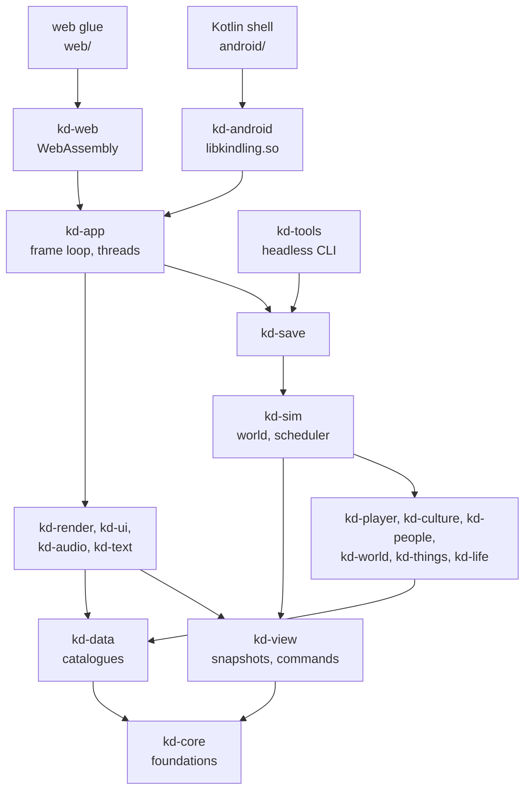
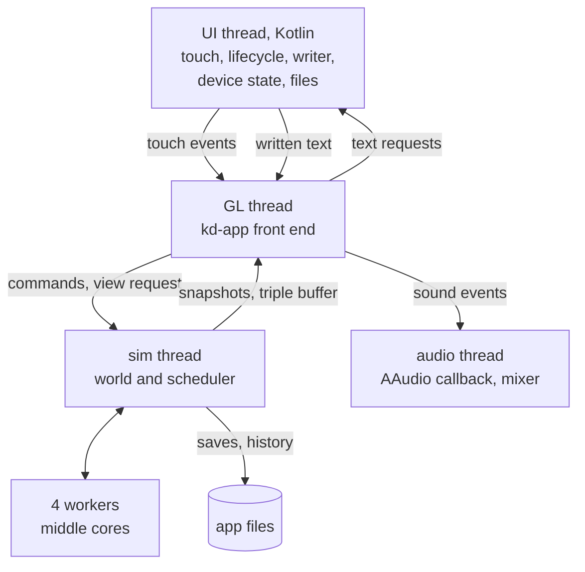

# Kindling: architecture

How Kindling is built: its parts, their data and rules, the threads they run on, the files they keep, what each costs, and why each choice was made.
It serves `PROJECT.md`, which says what the game must be, and is served by `IMPLEMENTATION.md`, which says in what order to build it.
Every part names the `PROJECT.md` items it serves by ID (`TIM-17`); the implementation plan cites this file by section (`A4.2`).
The results of the pre-tests that settled the technology are kept here for good (A1.4); the pre-test code stays in the git history before the commit that deleted the `pretests` folder.

Written for the AI agents who build from it, and readable by the owner on a phone: where a builder would otherwise guess, there is a number; where a choice was made, there is a reason and a fallback.
A **Decision:** line marks a choice this document makes where the plan leaves room; a **Conflict:** line marks where a part had to depart from the brief it was written from, with the alternative used.

## Status (2 October 2026)

- All nine parts are written and joined here; the technology in A1.3 is approved under the owner's grant of full autonomy on 1 October 2026, and stays open to the owner's overrule (`PRC-03`).
- Independent adversarial reviews are done for A1–A3 and A14–A17, for A6–A8, for A9, A10 and A13, and for A11–A12; their findings are only partly applied, because work stopped at a usage limit while the parts were being revised.
  The full findings are kept in `reviews/architecture/` until applied.
  The reviews of A4–A5 and of the joins between parts did not finish and run next.
- Each open finding is fixed before the alpha that first needs its part.
  The ones that change designs:
  1. No cloud session can create GitHub releases or set commit statuses: long runs keep checkpoints on disk and small ones on a `runs` branch, and the merge gate is `tools/check.sh` plus the independent review recorded in the pull request (A15, A17).
  2. Autosave every 30 s (`PLT-07`), history thinned after 50 years (`PLT-10`), an APK with every alpha (`PRC-11`), at most 50 MB.
  3. The signing key is derived with scrypt, not HKDF, and later key changes use APK signature rotation rather than a reinstall (A15.5).
  4. Interfaces: the worker pool, how `kd-player` reads the world under the layering, and the app object shared between the UI and drawing threads need sound designs; signed zeros and `usize` must not reach hashed data; saving needs a storage interface that also works on the web (A2, A3, A14).
  5. People match blueprints against what they believe about things, never against the catalogue's true values (`PRN-01`, `MND-02`), and a wrong belief must lead somewhere: they try, fail and learn (A6, A8).
  6. Each strike of a repeated activity lands as it ends (`TIM-17`), not the whole activity at once (A6).
  7. The cost per person, recounted, is about 1.35 ms a game day before animals, against a 1 ms budget: it is cut or the speed table changes (A8, A16, `TIM-07`).
  8. Rain, drought, cold snap and flood need natural versions in A5 for the powers to use, and no world record may carry the id of one of your acts (A5, A10, `GOD-05`, `GOD-07`).
  9. The story director hears of a sign when it starts, not at the next barrier (A10).
  10. The murmur uses a syllable bank rendered once in the cloud and strung on the phone, not a voice model shipped in the app (A13).
  11. Drawing: the screen must not flash from day to night several times a second at the region stop and beyond, and the calls A11 makes into A5 must exist there (A5, A11).

## Contents

- A1. Overview
- A2. Code layout and targets
- A3. Foundations
- A4. Time and the simulation core
- A5. The world
- A6. Things and blueprints
- A7. Living things
- A8. People
- A9. Culture and society
- A10. The player
- A11. Drawing
- A12. Screens, views and text
- A13. Sound
- A14. Saving and storage
- A15. Building, delivery and testing
- A16. Budgets
- A17. Technical risks and fallbacks
- A18. Traceability

## A1. Overview

What it covers: what the architecture must deliver, the system at a glance, the settled technical choices with the pre-test evidence behind them, and the technical terms used throughout.
Serves: `PRN-16`, `PRC-03`, `PRC-04`, `PRC-08`, `PLT-01`, `PLT-04`, `PLT-05`.

### A1.1 What the architecture must deliver

Kindling is one game for one phone, built and tested by AI agents in cloud sessions and delivered as playable alphas.
Every later section serves some of these constraints from `PROJECT.md`.

| Constraint | IDs | What it forces |
|---|---|---|
| One phone, offline, installed by download | `PLT-01`, `PLT-03`, `PLT-06`, `SCP-02`, `SCP-10` | an arm64-only APK for the Pixel 11 Pro XL; no network use in play; no store, accounts or analytics |
| A smooth screen; time slows when the phone can't keep up | `PRN-11`, `VIS-14`, `PLT-04` | the simulation never blocks drawing; a frame fits in 8.3 ms at 120 Hz; speed adapts, detail never does |
| Same state, same result; looking changes nothing | `TIM-16`, `TIM-17`, `WLD-13`, `RES-05` | the determinism contract (A3.1); data flows one way, from the world to the view |
| History is kept, not re-run | `PRN-15`, `PLT-07`, `PLT-10` | only the present state, the book of ages and the record of your acts are saved, atomically (A14) |
| Language models only describe | `PRN-06`, `MND-01`, `PRE-17`, `PRE-41` | the writer sits in the Kotlin shell and the front end, out of the simulation's reach (A2.3) |
| Readers never write | `TIM-03`, `PRE-39`, `WLD-13` | the director, recognisers and snapshot builder get read-only access to a world with no interior mutability (A2.3) |
| Modular, generic content | `PRN-14`, `PRN-07`, `MAT-13`, `MAT-14` | content is catalogue data (A3.6); rules match characteristics, never names; crates layered without cycles |
| Everything kept can be seen and explained | `PRN-04`, `PRN-13`, `PRN-10` | `kd-view` carries every record a card or view needs |
| Pace by tuning only; switches only in tests | `PRN-12`, `PRN-17`, `RES-10`, `RES-16` | tuned numbers live in catalogues; switches are recorded in the world they touched (A3.9) |
| Budgets | `TIM-07`, `MND-15`, `PLT-01`, `WLD-11` | 1,000 people at 1 game year or more per real minute; about 1 ms per person per game day; about 8 GiB of memory (A16) |
| Worlds survive small updates and move by export | `PLT-08`, `PLT-09` | a rules version in every world and in the catalogue blob (A3.6) |
| Built and tested in cloud sessions | `SCP-15`, `PLT-05`, `PRC-09`, `PRC-10`, `PRC-11`, `PRC-12` | a headless build of the same code; checks before every merge; every alpha reaches the phone (A15) |
| Both orientations | `PLT-02`, `PRE-34` | rotation never restarts the app; the art pixel keeps its size (A2.5) |

### A1.2 The big picture

Three thin shells wrap one Rust core.
The Kotlin shell and the browser glue host a drawing surface, pass touches in and offer services the core can't reach; the headless command line runs the same core without picture or sound.



On the phone the work runs on five kinds of thread (A4 details the hand-offs):



- The world publishes snapshots of what is in view; nothing in the world reads the camera, the frame or the speed (`WLD-13`).
- Commands that change the world (powers) take effect at a stated game time (A4); camera moves never reach the world.
- Written text comes back only to be shown and stored beside its record; no rule reads it (`MND-01`).
- In the browser one thread does it all: each frame handles input, a time-budgeted simulation step, the snapshot, drawing and audio mixing (A2.6).

### A1.3 Settled choices (the technology proposal)

This table is the technology proposal of `PRC-03`.
**Owner approval:** pending; recorded here, with its date, before building starts (`PRC-03`).
Every number behind it is kept in A1.4.

| Choice | Decision | Evidence | Fallback |
|---|---|---|---|
| Core language | Rust stable (1.97.0) for simulation, drawing, sound mixing and UI | B01: as fast as C++ in the cloud, 16–47% faster on the phone; floats bit-identical on x86 and ARM | a C++ kernel only where a measured gain exceeds 10% |
| Numbers | `f32`; transcendental maths through the pure-Rust `libm`; no fused multiply-add; fixed-order sums (A3.2) | B01: fastest format in every kernel; 45 of 45 cloud predictions matched the phone bit for bit | `f64` locally, under the same rules |
| Chance | keyed draws from a guarded wyhash of (world, system, purpose, subject, moment); a fortune retry flips one key bit (A3.3) | B02: 1.04 billion draws a second on the fastest core, 3.25 billion on all | keyed splitmix64 (also passed) |
| App | Kotlin shell, Rust core `libkindling.so` over JNI, arm64 only, minSdk 31, targetSdk 36 (A2.5) | B78: clean builds 18–37 s, one-line rebuilds about 2 s | a pure Rust shell with hand-written JNI per service |
| Toolchain | NDK r30, build-tools 36.1.0, android-36, AGP 8.13.2, Kotlin 2.3.21, Gradle 8.14.3, cargo-ndk 4.1.2; Google's mirror of Maven Central first (A2.8) | B78: Maven Central answered the shared cloud connection with 429 | refetch with `tools/setup-toolchain.sh` |
| Drawing | OpenGL ES 3.0 and WebGL2 through `glow`; the mockup's GLSL ES 3.00 shaders ported; one art pixel is 4 screen pixels | B66: 97–100% of 120 Hz, 0.4–3.8 ms of processor time a frame | fewer passes or art pixels; no Vulkan |
| Crawling pixels | the renderer keeps a slot for the fix chosen at the first visual review (`PRE-22`, `PRE-31`) | B66: only Fade stopped it, and the owner rejected its look | Fade, tuned with the owner |
| Memory layout | struct of arrays per kind, generational handles, permanent uids (A3.4) | B04: 2.7–4.7 times faster than one record per thing | none needed |
| Saves | custom region files, zstd level 1 per chunk, temporary file, flush, rename, hash checked on load (A14) | B04: quarter world written in 0.41 s, read in 0.24 s on the phone; 1,000 kills, no damaged load | uncompressed chunks |
| History | present state, book of ages and record of your acts; a zstd log thinned with age (`PRN-15`, `PLT-10`) | B04: 12.8 bytes an event, still 47 GB per 1,000 years for 1,000 people if all kept | thin harder |
| Map cells | square cells nesting as a quadtree on the torus (A3.7) | B10: exact nesting; hexagons misplace 7–44% | none needed |
| Terrain | height map plus 3D pieces; plates then erosion (A5) | B11: 1 km² of metre detail in 0.31 s on 4 phone cores | erosion on warped noise plus pit filling |
| Writer | Gemini Nano through ML Kit's GenAI Prompt API, Android only; dark events stated as plain facts (A12) | B73: 0.26 s to the first word, 77 words a second | template text (`PRE-41`) |
| Text checker | rule-based, no AI; on failure the template text is shown (A12) | B73: caught 94% of planted errors | template text |
| Sound out | AAudio; at most 32 sounds at once; a last stage lifts deep sounds on the speaker, off with headphones (A13) | B74: 24 ms delay, no dropouts | shared mode; a lower cap |
| Sound making | impacts as material-shaped noise; instruments from their shapes; drums parked (A13) | B74: preferred by ear; flutes within 3.3 cents | ringing notes plus noise |
| Speech | murmur only, never words (`SND-03`) | B76 and the owner's choice | none needed |
| Phone budget | plan on the held speed (43% of a burst), about 8 GiB, about 3 W | B79 | slow time sooner (`PRN-11`) |
| Cloud runs | one process per world, four per session, a checkpoint every simulated month | B80: 3.4 effective cores; resumed runs bit-identical | more nights or fewer worlds (`RES-13`) |
| Catalogues | Markdown, one entry per heading, a TOML block as the single source, generated tables, one binary blob (A3.6) | B09: best read on a phone; TOML avoids YAML's type traps | plain TOML files |
| Web build | `wasm32` with `wasm-bindgen`, WebGL2, AudioWorklet, IndexedDB, one thread (A2.6) | B66: WebGL holds 120 Hz on the phone | the APK only, if the artifact page refuses WebAssembly |

### A1.4 The pre-test record

The pre-tests ran on 1 October 2026, in the cloud and on the owner's phone; this record keeps their results for good, since `pretests/` is deleted once this architecture exists (`PRC-08`).
The code and raw results stay in git history in the commit before the deletion, found by `git log --diff-filter=D -1 -- pretests/BUILDING-BLOCKS.md`; A2.9 lists what to recover.

**The phone (B79, with facts from both test apps)**
- Pixel 11 Pro XL, Tensor G6, Android 17 (SDK 37), 4 KB pages, 15,655 MiB of memory, 512 GB storage, 5,340 mAh battery.
- Cores: 2 small (cpu 0–1, 2.65 GHz), 4 middle (cpu 2–5, 3.38 GHz), 1 fastest (cpu 6, 4.11 GHz); clock files are readable, so clusters show in `cpuinfo_max_freq`.
- Heat kernel (Rust, `f32`) on one core: small 2.15, middle 2.87, fastest 4.89 billion updates a second.
  On all 7: 15.6 billion in a burst, about 6.8 billion (43%) held from minute 2 to minute 10, at about 3 W, battery 35.1 to 37.6 °C, thermal status "light" at most, 14.6% of the battery an hour.
- Energy per update, net of 0.84 W idle: middle about 0.7 nJ, small 1.0, fastest 1.3.
- Thermal headroom (`getThermalHeadroom(10)`, at most once a second) gave a number on 100% of samples: 0.63 idle, 0.78–0.86 under the held load; thresholds light 0.80, moderate 0.93, severe 1.00.
  So headroom is the signal for slowing time before heat (`PRN-11`).
- Display 1080 × 2404 at 120 Hz (modes 60 and 120), reached with `Surface.setFrameRate`; full screen in portrait is about 270 × 601 art pixels.
- A plain OpenGL ES scene missed 0.21% of frames; its renderer was "ANGLE (Imagination Technologies, Vulkan … PowerVR)": native GLES on this phone runs on ANGLE, as the browser does.
- Memory: the app used the full 10 GiB the test allowed, with no warning, but at most 8.4 GiB stayed resident and free memory fell to 0.4 GB: plan on about 8 GiB.
- Java ran at 18–21% of Rust's speed: fine for the shell only.

**Numbers and languages (B01)**
- Cloud, one thread, million updates a second: heat `f32` Rust 2,508, C++ 2,515, `f64` 1,218, Q16.16 1,768; Rust over C++ across 52 pairs, geometric mean 1.00.
- Phone: Rust 16% faster than C++ on the middle cores, 47% on the fastest; Q16.16 at 65–112% of `f32`, never clearly faster.
- All 87 combinations repeated exactly across runs and 1–4 threads; on the phone all 47 runs repeated and all 45 cloud predictions matched bit for bit.
- C++ differed between x86 and ARM in 4 of 26 cases, where clang fused `a*b+c` (20 fused instructions in heat, 112 in learning); Rust fused none.
- The exact sum of the test values is 3,057,372.846: a fixed `f32` tree gave 3,057,371.0, a plain loop 3,057,589.5, and the tree ran faster (4.0–4.2 against 1.4 billion values a second).
- Platform maths (`exp`, `sin`) may differ between platforms; only basic arithmetic was proven identical.

**Random draws (B02)**
- Six keyed generators passed PractRand to 2^34 bytes per stream (one key's moments, neighbouring beings) and 2^32 for first draws beside their fortune retries.
- Plain wyhash was fastest (1,152 million draws a second on a cloud thread), but at the moment equal to a stream's seed every being draws the same: about one stream in 8 million.
  The guarded version fixes it at 81% of the speed in the walk kernel (110 against 136 million steps a second; splitmix64 96).
- Phone: 1.04 billion guarded draws a second on the fastest core, 3.25 billion on all.

**Storing data (B04)**
- Synthetic world of 403 MB: 10,000 people (3.2 KB each), 100,000 animals and 1,000,000 things (32 bytes each), 1 km cells and 256 m patches.
- Time per record per pass, one record per thing against one array per field: animals 2.12 ns against 0.45, things 1.77 against 0.66, people 7.9 against 1.4; `hecs` took 48 bytes a record and 96 ns per random update (arrays 11.6).
- Saved moment, cloud: custom with zstd 263 MB, written in 1.77 s, read in 1.09 s, a region in 7.8 ms; raw 403 MB; SQLite 438 MB read in 2.88 s; FlatBuffers needed 95 ms a region.
- Phone, quarter world: 75.6 MB written in 409 ms (305 encoding, 63 flushing), read in 240 ms, a region in 11.4 ms; a full moment would open in about 0.8 s.
- History log at 10 events per person per day: 12.8 bytes an event, 47 GB per 1,000 years for 1,000 people; SQLite 64 bytes and appends 20 times slower; on the phone a 4 KB append flushed in 0.07 ms.
- 1,000 kills mid-write, no damaged file ever loaded; SQLite alone caught 75 of 300 damaged files, the content hash all of them.

**Catalogue format (B09)**
- YAML, TOML and Markdown with a data block loaded the same 34 values without error; phone readability chose Markdown, with the table generated from the block.
- A YAML loader reads `2.5e3` as text, hence TOML blocks.
- A checker caught 168 of 168 planted errors, but no value from the wrong column of the right table: meaning needs a reviewer.
- Sourcing was measured (3 minutes an entry) and then dropped: values are plausible estimates (`PRN-05`).

**Map cells (B10)**
- Hexagons misplace 7.2% (aperture 7) to 44% (aperture 3) of an area per level; squares none, and roll up 4.5 times faster.
- Paths on 8-neighbour squares: 6.3% too long raw, 1.03% after one smoothing pass, 1 in 20 still about 4% long; hexagons 10.5% and 1.31%.
- Wrapping passed every check on both seams; with the ice blocked, no path crossed it.
- Globe: columns to longitude, rows to latitude, east–west scale cos(latitude); the third of the map beyond 60° fills 13% of the globe.

**Terrain (B11)**
- 1 km² of metre detail with a cliff, overhangs and caves: height map with 3D pieces 10.8 MB (plain ground 3 MB), cubes 22.4 MB.
- Built in 0.59 s on one phone core and 0.31 s on four, bit-identical either way; 400 camps would need 1.2–4.3 GB, so detail is rebuilt, not kept.
- Whole world at 1 km: plates then erosion in 3.28 s on one cloud thread; every river reached the sea; warped noise alone, 29%.
- Phone: plates at 1024 × 512 in 0.45 s; plates and metre detail gave the cloud's exact hashes (`895e636495687a48` and `5e3b0c482d789a49`).
- The continents came out flat with straight edges: the generator needs tuning.

**Drawing (B66)**
- The mockup at 270 × 489 art pixels in a phone web view: 97–100% of 120 Hz at every zoom, at most 3.1% late frames (the full turn), 0.4–3.8 ms of processor time a frame.
- Crawl at camp zoom: 5.8% of art pixels per frame in a slow turn, 9.9% in a slow zoom; Fade cut both by over 99%, Steps only the turn.
- A native renderer reusing the shaders was estimated at about 4 agent-days.
- Gestures passed an automated check and felt fine; Android owns a strip at the bottom edge, so swipes start a finger's width above it.

**Writer AI (B73)**
- Gemini Nano (`nano-v4-full`, 8,192-token limit, ML Kit `genai-prompt:1.0.0-beta4`): 0.26 s to the first word, 77 words a second; Gemma 4 E2B: 0.86 s, 14 words a second, 2–2.7 GiB.
- Both softened forced labour and mixed up who did what; the owner rated 3 of 6 texts acceptable; the documentary voice did best (5 of 6 acceptable or good).
- The rule-based checker caught 94% of planted errors blind, missing one left-out dark event and who-did-what errors.
- Settings: temperature 0.3, top-k 20, a fixed seed, at most 256 new tokens; ML Kit writes only while the app is on screen and has per-app quotas.

**Sound and speech (B74, B76)**
- AAudio: exclusive, low latency, 48 kHz float stereo, 96-frame bursts (2 ms), 24 ms delay, no dropouts; mixing took 3%, 11% and 44% of each burst at 8, 32 and 128 sounds, so the cap is 32.
- Material-shaped noise beat ringing modes by ear; flute notes came within 3.3 cents of their shape's pitch; drums are parked.
- A phone speaker loses almost everything below about 350 Hz; a last stage lifted deep sounds by 4–17 dB.
- Speech: the synthetic voice (0.16% of a core) was judged terrible; neural voices (9.1%) lost 2–7 of 20 invented sounds; speech is now a murmur.

**Building the app (B78)**

| Shell | Clean build | One-line rebuild | Glue lines | APK | Download |
|---|---|---|---|---|---|
| Kotlin + Rust | 32.6 s | 1.7 s | 118 | 338 KB | 1.41 GB |
| Kotlin + C++ | 30.2 s | 1.7 s | 102 | 44 KB | 1.41 GB |
| Rust only | 18.1 s | 1.3 s | 76 | 742 KB | 1.08 GB |
| WebView | 36.5 s | 1.9 s | 135 | 338 KB | 1.41 GB |

- The NDK is 739 MB of the download; an app holding only ML Kit came to 1.7 MB.

**Cloud runner (B80)**
- Four cores per session; the slowest of 20 minutes kept 93.7% of the first: plan on 3.4 effective cores.
- Four worlds as four processes ran 3.7–3.9 times as fast as one; one world on four threads gained 1.1–3.4 times.
- A 375 KB checkpoint took 2.0 ms; above 1 MB, about 2.8 ms per MB.
- 10 trials, each killed twice and resumed with a changed thread count, all ended bit-identical; damaged checkpoints were never loaded.
- What made it exact: keyed draws, fixed read-then-write phases, whole-number counts, a fixed order for births, deaths and saving, scratch buffers rebuilt daily, the full state saved in a fixed layout with a hash.
- A detached process ran until the machine restarted (just under 3 hours); a fresh session starts on an empty machine.

### A1.5 Glossary

Game terms are in `PROJECT.md`'s glossary; these are the technical ones.

- **AAudio:** Android's low-latency audio output, called from Rust.
- **ANGLE:** a layer that runs OpenGL ES and WebGL on Vulkan; this phone uses it for both.
- **Barrier, window:** every 15 game minutes the clusters re-form and batch systems run (a barrier); the time between two barriers is a window (A4).
- **Cluster:** beings close enough to affect each other before the next barrier, processed together (A4).
- **Generational handle (`Id`):** a slot index plus a generation, so a handle to a removed entity is refused (A3.4).
- **`glow`:** a Rust crate that calls OpenGL ES and WebGL2 through one interface.
- **Keyed draw:** a random number computed from a key, never from a running generator (A3.3).
- **`libm`:** a pure-Rust maths library giving the same bits on every target.
- **Purpose:** the registered reason for a draw, part of its key (A3.3).
- **Region:** 100 × 100 world cells, the unit of save files and batch jobs (A3.7).
- **Reservation:** free slots handed to a cluster at a barrier for what it creates (A3.4).
- **Snapshot, triple buffer:** a copy of what is in view, passed from the simulation to drawing and sound through three alternating slots.
- **Struct of arrays:** one array per field instead of one record per entity.
- **Switch:** a test-only setting that turns one mechanism off (A3.9).
- **Tick:** 1/256 of a metre, the unit of positions (A3.7).
- **Uid:** an entity's permanent, never-reused identity (A3.4).

## A2. Code layout and targets

What it covers: where files live, what each crate does and may depend on, how the three targets differ, the Android, web and headless entry points, the toolchain, and what to recover from the pre-tests.
Serves: `PRN-14`, `PRC-04`, `PRC-08`, `PRC-11`, `PLT-01`, `PLT-02`, `PLT-03`, `PLT-05`, `PLT-06`, `PLT-08`, `SCP-15`.

### A2.1 Repository layout

```
Cargo.toml            workspace; [workspace.dependencies] pins every outside crate
Cargo.lock            committed
rust-toolchain.toml   Rust 1.97.0, clippy, rustfmt, the extra targets
clippy.toml           banned types and methods (A2.3, A3.2, A3.5)
.cargo/config.toml    16 KB page alignment for Android; qemu runner for arm64 Linux tests
PROJECT.md  ARCHITECTURE.md  IMPLEMENTATION.md  CLAUDE.md
crates/kd-*/          the Rust crates (A2.2), each with src/ and tests/
data/                 catalogues, tuning, ids.lock, VERSION.toml (A3.6)
assets/               binary inputs: pixel font, free-licence recordings, LICENSES.md
scenes/               sandbox scene files (A15)
android/              Gradle project, Kotlin shell (A2.5); keys/debug.jks (throwaway)
web/                  index.html, glue.js, audio-worklet.js (A2.6)
tools/                scripts (A2.8, A15)
reports/              copies of stage reports (RES-15)
mockups/              visual-style.html, the approved look
dist/                 the latest delivered APK and web build (A15)
```

- **Decision:** `assets/` and `reports/` join the brief's layout: binary inputs don't belong among Markdown catalogues, and `RES-15` keeps report copies in the repository.
- Never committed: `target/`, `web/pkg/`, Gradle `build/` and `.gradle/`, downloaded toolchains.
- Each crate's `lib.rs` opens with the architecture sections and `PROJECT.md` IDs it implements (`PRC-04`).

### A2.2 Crates

| Crate | Owns | Depends on | Section | First needed |
|---|---|---|---|---|
| `kd-core` | game-time type, uids, handles, stores, keyed chance, maths, coordinates, fixed-order collections, errors, switches, the `Pool` trait | none | A3 | `MIL-01` |
| `kd-data` | catalogue schemas, the blob loader; the compiler behind feature `compile` | `kd-core` | A3.6 | `MIL-01` |
| `kd-world` | world cells, areas, terrain, water, weather, generation, paths | `kd-core`, `kd-data` | A5 | `MIL-01` (one area), `MIL-04` |
| `kd-things` | items, blueprints, matching, fire, timers, containers, discovery | `kd-core`, `kd-data` | A6 | `MIL-01`, `MIL-02` |
| `kd-life` | plants, animals and herds, taming, illness | `kd-core`, `kd-data` | A7 | `MIL-01`, `MIL-04` |
| `kd-people` | bodies and minds | the three above | A8 | `MIL-01` |
| `kd-culture` | language, passing things on, beliefs, groups, trade, conflict, expression | `kd-people` | A9 | `MIL-02`, `MIL-05` |
| `kd-player` | powers, record of your acts, story director | `kd-culture` | A10 | `MIL-03`, `MIL-06` |
| `kd-sim` | the `World`, scheduler, activities, clusters, barriers, snapshots; implements the lower crates' traits | all above, `kd-view` | A4 | `MIL-01` |
| `kd-save` | saves, region files, history log, export, import, the `Storage` trait | `kd-sim` | A14 | `MIL-01` |
| `kd-view` | snapshot, command and view-request types, UI draw lists, sound events, text records | `kd-core` | A4, A11–A13 | `MIL-01` |
| `kd-render` | the renderer | `kd-view`, `kd-data` | A11 | `MIL-01` |
| `kd-ui` | pixel UI, views, cards, gestures | `kd-view`, `kd-data` | A12 | `MIL-01` |
| `kd-audio` | mixer, sound blueprints, ambience, murmur, music, speaker stage | `kd-view`, `kd-data` | A13 | `MIL-03` |
| `kd-text` | templates, writer requests, fact checker | `kd-view`, `kd-data` | A12 | `MIL-02`, `MIL-05` |
| `kd-app` | platform-free app: frame loop, threads and pool, snapshot hand-off, input to commands, view-only areas, settings | `kd-sim`, `kd-save`, `kd-world`, the front-end crates | A2.4, A4 | `MIL-01` |
| `kd-android` | `libkindling.so`: JNI, AAudio, EGL loading, files, logcat | `kd-app` | A2.5 | `MIL-01` |
| `kd-web` | the WebAssembly entry: exports, WebGL2, IndexedDB bridge, audio blocks | `kd-app` | A2.6 | `MIL-01` |
| `kd-tools` | the `kd` command line | `kd-sim`, `kd-save`, `kd-data` with `compile`, `kd-text`, `kd-world` | A2.7, A15 | `MIL-01` |

**Outside crates**, pinned in `[workspace.dependencies]`, each allowed only where listed: `libm`, `serde`, `log` (all); `postcard` (`kd-data`); `toml` (`kd-data` with `compile`); `zstd` (`kd-save`, native); `ruzstd` (`kd-save`, `wasm32`); `glow` (`kd-render`, `kd-app`); `jni` 0.21 and `libc` (`kd-android`); `wasm-bindgen`, `js-sys`, `web-sys`, `console_error_panic_hook` (`kd-web`); `png` (`kd-tools`).
A new one needs a one-line reason in `Cargo.toml` and the reviewer's OK (`PRC-09`).
None may need the operating system's randomness (`getrandom`).

**Interfaces**, sketched (the owning sections refine them):

```rust
// kd-core
pub struct GameTime(pub u64);                      // game seconds since the world began (A4)
pub struct Uid(pub u64);                           // permanent identity (A3.4)
pub struct Id<K> { pub index: u32, pub gen: u32 }  // slot handle (A3.4)
pub mod chance; pub mod m; pub mod num; pub mod geo; pub mod coll; pub mod kinds; pub mod switches;
pub trait Pool {   // clusters and batch jobs run through it (A4); results return in job order
    fn run<R: Send>(&self, jobs: usize, job: &(dyn Fn(usize) -> R + Sync)) -> Vec<R>;
}

// kd-data
impl Catalogue {
    pub fn load(blob: &[u8]) -> Result<Catalogue, CatalogueError>; // checks magic, format, hash
    pub fn item(&self, k: ItemKind) -> &ItemDef;                   // one getter per kind
}
#[cfg(feature = "compile")] pub mod compile;  // compile(dir), blob(&Catalogue), rewrite_tables(dir)

// kd-app
pub trait Platform: Send + Sync {
    fn now_ns(&self) -> u64;                        // monotonic real time
    fn storage(&self) -> Arc<dyn kd_save::Storage>; // semantics in A14
    fn post(&self, r: Request);                     // to the shell
    fn cores(&self) -> CoreLayout;                  // workers and their CPU sets; none on the web
}
pub enum Request { Write { id: u32, prompt: String, max_tokens: u16 }, Vibrate(Pattern),
    KeepScreenOn(bool), Brightness(Option<f32>), Export { path: String }, Import,
    Share { path: String }, Copy(String) }
impl App {
    pub fn new(p: Arc<dyn Platform>, cfg: AppConfig) -> App; // loads the last world in the background
    pub fn gl_ready(&mut self, gl: glow::Context);           // (re)build GPU resources
    pub fn resize(&mut self, w: u32, h: u32, insets: Insets);
    pub fn frame(&mut self, now_ns: u64);                     // input, UI, commands, newest snapshot, draw
    pub fn input(&self, e: InputEvent);                       // any thread
    pub fn pause(&self); pub fn resume(&self);                // pause stops time and starts a save
    pub fn back(&self) -> bool;                               // true if a card or view closed
    pub fn device(&self, s: DeviceState);                     // charging, battery, thermal, audio route
    pub fn reply(&self, r: Reply);                            // written text, export done, import ready
    pub fn audio(&self) -> AudioHandle;                       // render(&mut [f32]) on the audio thread
}
```

Key names in the other crates (their sections define them; listed so the layering is clear):

```rust
// kd-world  (A5)  WorldCells, WeatherCells, AreaData; generate(seed) -> WorldGen;
//                 make_area(seed, AreaId, &CellInputs) -> AreaData   (pure: the same inputs give the same area)
// kd-things (A6)  Things and Fires stores; fits(&BlueprintDef, &[InputView]) -> bool; timers
// kd-life   (A7)  Plants, Animals and Herds stores; plant and herd batch steps; illness
// kd-people (A8)  People store; bodies and minds; choose(..) -> Choice, with its reasons
// kd-culture(A9)  groups, beliefs, customs, passing things on
// kd-player (A10) powers, act records, fortune; director(&World) -> SpeedRequest   (read-only)
// kd-sim    (A4)  World, Scheduler; step_until(&mut World, GameTime, budget) -> StepEnd;
//                 apply(Command, at: GameTime); snapshot(&World, &ViewRequest, &mut Snapshot); state_hash(&World) -> u64
// kd-save   (A14) trait Storage; save(&World, &dyn Storage); load(&dyn Storage, WorldId) -> World; export, import
// kd-view         Snapshot, Command, ViewRequest, UiDrawList, SoundEvent, TextRecord
// kd-render (A11) Renderer::new(&glow::Context, &Catalogue); draw(&Snapshot, &Camera, &UiDrawList); upload_area(AreaView)
// kd-ui     (A12) Ui::input(InputEvent) -> Vec<Command>; Ui::layout(&Snapshot, Viewport) -> UiDrawList
// kd-audio  (A13) AudioEngine; AudioHandle::render(&mut [f32]); AudioControl::send(AudioCmd)
// kd-text   (A12) template(&TextRecord) -> String; WriterRequest; check(&TextRecord, &str) -> Verdict
```

The domain crates own their data and pure functions over it, and declare traits for what they need from the rest of the world, which `kd-sim` implements (A4–A10).

### A2.3 Layering rules

1. **Arrows point down, no cycles:** `kd-core` ← `kd-data` ← {`kd-world`, `kd-things`, `kd-life`} ← `kd-people` ← `kd-culture` ← `kd-player` ← `kd-sim` ← `kd-save`; `kd-view` depends only on `kd-core`; the four front-end crates depend on `kd-view` and `kd-data`, never on `kd-sim`; `kd-app` joins them; shells depend on `kd-app`.
   Why: modules stay separate (`PRN-14`), and the front end can't touch the world (`WLD-13`).
2. **The writer is out of reach:** no crate from `kd-core` to `kd-save` depends on `kd-text`, `kd-app` or a shell (`MND-01`).
   A test runs a world with all stored texts and with none; the state hashes, texts excluded, must match.
3. **No interior mutability in world state:** `Cell`, `RefCell`, `OnceCell`, `Mutex`, `RwLock` and atomics are banned in every type reachable from `kd_sim::World`.
   So the director, recognisers and snapshot builder, which take `&World`, cannot change it (`TIM-03`, `PRE-39`).
4. **Simulation crates touch nothing outside the world:** from `kd-core` to `kd-save` there is no `std::time`, `std::thread`, `std::env`, `std::fs` (except `kd-data`'s `compile`), `std::net`, `HashMap`, `HashSet`, standard float maths (A3.2) or `rand`.
   Threads come through `Pool`, which `kd-app` implements; files through `Storage`.
5. **Rules never name content:** no catalogue id or English name appears as a string in simulation crates (`PRN-07`, `MAT-13`); only `data/`, tests and scenes name entries.
6. **Enforced** by `kd check layers` (`cargo metadata` against `tools/layers.toml`), `clippy.toml` bans on the simulation crates, and `kd check names`, all in the file check before any merge (`PRC-10`).

### A2.4 The three targets

| | Android (the product) | Web (alphas, screenshots) | Headless Linux (tests, long runs) |
|---|---|---|---|
| Rust target | `aarch64-linux-android`, API 31 | `wasm32-unknown-unknown`, `simd128` | `x86_64-unknown-linux-gnu`; `aarch64-unknown-linux-gnu` under qemu |
| Entry | `kd-android` → `libkindling.so` | `kd-web` → `kd_web_bg.wasm` and glue | `kd-tools` → `kd` |
| Threads | Java UI and GL threads; a simulation thread; 4 workers pinned to cpu 2–5 (the middle cores, found from `cpuinfo_max_freq`); the AAudio callback | one; the simulation runs inside the frame callback within a budget | one simulation thread per world, four world processes per session (B80); workers optional |
| Drawing | OpenGL ES 3.0 on a `GLSurfaceView` via `glow` | WebGL2 via `glow` | none; map previews as PNG |
| Audio | AAudio, exclusive, low latency, 48 kHz float stereo, 96-frame bursts, mixing in its callback | AudioWorklet at 48 kHz, fed 128-frame blocks mixed ahead on the main thread | none; the mixer is tested offline |
| Storage | files under `filesDir/worlds/`: temporary file, flush, rename, folder flush | IndexedDB, loaded into memory at start; each save one transaction | files under `--dir` |
| Writer | Gemini Nano via ML Kit, called by Kotlin | template text | template text |
| Compression | `zstd` (C library), level 1 | `ruzstd` (pure Rust), same format | `zstd`, level 1 |
| Clock | `CLOCK_MONOTONIC` | `performance.now()` | `CLOCK_MONOTONIC` |
| Input | touches from Kotlin | pointer events | commands from scene files |
| Device state | thermal headroom and status, battery, charging, audio route | none; no overnight mode | none |
| Files, vibration | vibration; export, import and share through Android's pickers | export as a download, import by upload | plain files |
| Logs | logcat and a rolling file | console | standard error and a file per run |

- One saved world gives the same state hash on all three targets (A3.1); integrity hashes cover uncompressed bytes, so the two zstd libraries can't change them.
- **Decision:** the web compresses with `ruzstd`, because the C library would need a C compiler aimed at WebAssembly; if its compressor falls short, the web writes uncompressed chunks, which every target reads.
- `std::time::Instant` and `std::thread::spawn` panic on `wasm32`, so `kd-app` takes time from `Platform::now_ns` and starts threads only when `Platform::cores` names workers.
- For the web, a simulation step must be able to stop at any event boundary when its budget runs out and continue next frame without changing results (A4).

### A2.5 The Android shell

**Files** (package `dev.kindling.app`; about 700 lines of Kotlin):
- Gradle files as in the B78 template (A2.9): `compileSdk 36`, `minSdk 31`, `targetSdk 36`, `ndkVersion "30.0.16248370"`, `abiFilters arm64-v8a`, `packaging.jniLibs.useLegacyPackaging = false`, R8 in release, `android.useAndroidX=true` (ML Kit needs it), and an `Exec` task before `preBuild` running `cargo ndk -t arm64-v8a -P 31 -o build/rustJniLibs build --release -p kd-android`.
- `MainActivity.kt`: lifecycle, immersive full screen, insets, Back, keep-screen-on and brightness.
- `GameView.kt`: a `GLSurfaceView` (ES 3.0, RGBA 8888, no depth or stencil on the window since every 3D pass draws into A11's art-resolution targets, no multisampling, `preserveEGLContextOnPause`, continuous rendering) that forwards touches and requests 120 Hz with `setFrameRate(120f, FRAME_RATE_COMPATIBILITY_DEFAULT, CHANGE_FRAME_RATE_ALWAYS)` (B79).
- `Native.kt`: the functions below.
- `Writer.kt`, started from B73's `WriterTest.kt`: one request at a time; temperature 0.3, top-k 20, at most 256 new tokens, a seed from the request (a rewrite uses a new one, `PRE-41`); errors passed on as codes.
- `Device.kt`, started from B79's `Probe.kt`: battery and charging, thermal status by listener, headroom once a second, the audio route.
- `Files.kt`: export, import and share through the system pickers and a `FileProvider`, copying via `cacheDir`.
- Manifest: one activity with `configChanges="orientation|screenSize|screenLayout|smallestScreenSize|keyboard|keyboardHidden|navigation|uiMode|density|fontScale|layoutDirection|locale"`, no fixed orientation (`PLT-02`), `allowBackup="false"` (`PLT-08`), and ML Kit's usage upload removed as in the second test app.

**Permissions:** the app declares none; ML Kit adds AICore's bind permission and network state, AndroidX one receiver permission.
`INTERNET` must not be in the merged manifest (`PLT-03`, `SCP-10`) and is removed with `tools:node="remove"` if a library brings it.
Fallback: if Gemini Nano then fails (checked at the first writer alpha, `MIL-05`), it stays, the upload stays removed, and a check confirms no app code opens a connection.

**JNI surface.**
Kotlin calls Rust; Rust never calls Java, so no Rust thread needs the Java VM.
What Rust wants from Android waits in an outbox that Kotlin polls each frame.
Every entry point catches panics, logs them and returns a safe value (A3.8).

| `object Native` function | Thread | Does |
|---|---|---|
| `create(filesDir: String, cacheDir: String, device: String): Long` | UI | builds the app, starts the simulation thread, loads the last world in the background |
| `destroy(h: Long)` | UI | waits up to 2 s for a running save, frees everything |
| `onResume(h)` | UI | opens audio; time runs again (`TIM-05`) |
| `onPause(h)` | UI | stops time, closes audio, starts a save (`PLT-07`); returns within 100 ms |
| `onTrimMemory(h, level: Int)` | UI | drops caches (view-only areas, sound buffers) |
| `onBack(h): Boolean` | UI | true if a card or view closed; otherwise Kotlin calls `moveTaskToBack(true)` |
| `glCreated(h)` | GL | builds the `glow` context (`dlsym` on `libGLESv3.so`, then `eglGetProcAddress`) and GPU resources; again after a lost context |
| `glResized(h, width: Int, height: Int)` | GL | new viewport; an art pixel stays 4 screen pixels (`PRE-22`) |
| `glDraw(h, frameNanos: Long)` | GL | one frame |
| `touch(h, action: Int, index: Int, ids: IntArray, xs: FloatArray, ys: FloatArray, timeNanos: Long)` | UI | queues a touch event |
| `insets(h, left: Int, top: Int, right: Int, bottom: Int)` | UI | system bars and the bottom gesture strip, kept free of controls |
| `device(h, charging: Boolean, battery: Int, thermalStatus: Int, headroom: Float, batteryC: Float)` | UI | once a second and on change |
| `audioRoute(h, speaker: Boolean)` | UI | the speaker stage runs only on the phone's own speaker (`SND-06`) |
| `takeRequests(h): String?` | GL | a JSON array of `Request`s (A2.2), or null |
| `writerStatus(h, status: Int)` | UI | Gemini Nano available, downloadable, downloading or unavailable |
| `writerResult(h, id: Int, code: Int, text: String?)` | any | a written text or an error code |
| `fileResult(h, kind: Int, ok: Boolean, path: String?)` | UI | export done, import ready, share done |

**Lifecycle:** rotation never restarts the activity, only `glResized` follows; a process killed mid-save keeps its previous save, and the next `create` opens it and runs forward to the end of the journal (`PLT-07`, A14); nothing runs in the background (`TIM-05`).
The debug key gives way to a release key held as an environment secret (A15); the switch needs one reinstall after exporting worlds.
**Checks:** `tools/verify-apk.sh` (from the second test app) confirms a v3 signature, 16 KB alignment of zip entries and native segments, arm64 only, uncompressed native libraries, kept JNI names and the exact permission set.

### A2.6 The web shell

**Files:** `web/index.html` (a full-window canvas, no scrolling, a dark background, a one-line status); `web/glue.js` (about 250 lines: loads the wasm, reads saves from IndexedDB, forwards pointer events, runs the frame loop, writes saves, feeds audio, pauses when the page is hidden); `web/audio-worklet.js` (about 60 lines: plays queued 128-frame stereo blocks, counts underruns); generated `web/pkg/` (`wasm-bindgen --target web`).
The delivered build goes to `dist/web/` and is published as a private page (A15).

```rust
#[wasm_bindgen] impl WebApp {
    pub fn new(canvas: HtmlCanvasElement, files: js_sys::Map, dpr: f32) -> Result<WebApp, JsValue>;
    pub fn frame(&mut self, now_ms: f64);   // input, simulation within budget, snapshot, draw, audio
    pub fn pointer(&mut self, kind: u8, id: i32, x: f32, y: f32, t_ms: f64);
    pub fn resize(&mut self, css_w: u32, css_h: u32, dpr: f32);
    pub fn pause(&mut self); pub fn resume(&mut self);
    pub fn take_writes(&mut self) -> js_sys::Array;               // (path, bytes or null) pairs: one transaction
    pub fn take_audio(&mut self) -> Option<js_sys::Float32Array>; // blocks for the worklet
    pub fn take_requests(&mut self) -> Option<String>;            // export, import, copy
    pub fn file_result(&mut self, kind: u8, bytes: Option<js_sys::Uint8Array>);
}
```

- **Loop:** each `requestAnimationFrame` calls `frame`, giving the simulation `max(1 ms, frame interval − last drawing time − 1.5 ms)`, about 3–6 ms at 120 Hz on the phone (B66); the speed shown is the real one (`TIM-01`).
- **WebGL2:** `alpha: false, antialias: false, depth: false, stencil: false, powerPreference: "high-performance"`; backing size = CSS size × `devicePixelRatio`; an art pixel is 4 device pixels; a lost context pauses drawing until `gl_ready` runs again; the GLSL ES 3.00 shaders are shared with the phone unchanged.
- **Audio:** an `AudioContext` at 48 kHz starts on the first touch (browsers block sound before one); about 80 ms of blocks stay queued; an underrun plays silence.
- **IndexedDB:** database `kindling`, store `files`, key = path, value = bytes; at start the last world's files and the settings load into a map; each frame's writes go in one transaction, so a save lands whole or not at all.
  If IndexedDB is missing or throws, the game runs without saving and says so.
- **First alpha:** checks whether the artifact page lets WebAssembly run; if not, the APK is the only route (`PRC-11`).

### A2.7 The headless build

`kd-tools` builds one binary, `kd` (`PLT-05`, `SCP-15`):

```
kd catalog build|check|tables|pairs     catalogues (A3.6)
kd scene run <file> [--runs 20] [--seed-base n] [--switch name=off] [--threads n]   (A15)
kd world new --seed n --out <dir>       (A5)
kd world run <dir> --until "Year 500" [--checkpoint month]   resumes after a kill (A15)
kd bench <worlds> [--zoom world]        (A16)
kd map preview <dir> --layer height --png <file>             (A5)
kd det <scene or world>                 the determinism checks (A3.1)
kd check layers|names|ids|file          (A2.3, A15)
kd tune <system> --values <file>        tuning runs, never counted as passes (A3.9)
```

One world per process, four processes per session (B80); results never depend on `--threads`; saves are the files the phone opens (`PLT-05`); the catalogue is compiled from `data/` (or `KD_DATA`) at start.

### A2.8 Toolchain and a fresh cloud session

| Tool | Version | Source |
|---|---|---|
| Rust | 1.97.0 stable, pinned by `rust-toolchain.toml` | rustup, in the session image |
| Rust targets | `aarch64-linux-android`, `wasm32-unknown-unknown`, `aarch64-unknown-linux-gnu` | `rustup target add` |
| `cargo-ndk` | 4.1.2 | `cargo install --locked` |
| Android NDK | r30 (`30.0.16248370`), 739 MB | dl.google.com |
| SDK | command-line tools `16111833`; `platform-tools`, `build-tools;36.1.0`, `platforms;android-36` | dl.google.com, `sdkmanager` |
| CMake | 3.31.6, only if C++ is ever added | `sdkmanager` |
| JDK, Gradle | 21 (Java 17 bytecode), 8.14.3 | session image |
| AGP, Kotlin | 8.13.2, 2.3.21 | Google Maven, Google's mirror of Maven Central |
| ML Kit | `com.google.mlkit:genai-prompt:1.0.0-beta4` | Google Maven |
| `wasm-bindgen` CLI | the exact version in `Cargo.lock` | `cargo install --locked` |
| Node, Playwright, Chromium | 22, preinstalled | session image |
| qemu, arm64 linker | `qemu-aarch64-static`, `gcc-aarch64-linux-gnu` | apt |

- Gradle repositories, in order: `google()`, `https://maven-central.storage-download.googleapis.com/maven2/`, `mavenCentral()`, `gradlePluginPortal()`; `gradle.properties` sets 8 retries with a 1 s initial back-off.
- `.cargo/config.toml`: `-C link-arg=-Wl,-z,max-page-size=16384` for `aarch64-linux-android`; `linker = "aarch64-linux-gnu-gcc"` and `runner = "qemu-aarch64-static -L /usr/aarch64-linux-gnu"` for arm64 Linux tests; no `target-cpu` or fast-math flags (A3.2).
- **A fresh session:** the cloud environment's setup script, set once by the owner in the environment's settings, runs `tools/setup-toolchain.sh`, which installs only what is missing into `$KD_CACHE` (default `~/.cache/kindling`, never the repository): about 1.1–1.4 GB, a few minutes (B78).
  Without it, `tools/build-apk.sh` runs the script before its first build; `tools/env.sh` then sets `ANDROID_HOME`, `ANDROID_NDK_HOME`, `GRADLE_USER_HOME` and the signing variables.
- A session starts on an empty machine (B80): long runs keep their checkpoints where A15 says.

### A2.9 Pre-test files to recover

Recover with `git show <commit>^:pretests/<path> > <destination>`, `<commit>` being the deletion (A1.4); name the source in the commit message.
Recovered code is a starting point, renamed, tested and linked to IDs like new code.

| From `pretests/` | To | Gives |
|---|---|---|
| `b01-b02-numbers-random/kbench/src/rng.rs` (`mix64`, `wymum_safe`, `WySafe`, `Stream::new`, tests) | `crates/kd-core/src/chance/hash.rs` | the measured generator (A3.3) |
| `b01-b02-numbers-random/kbench/src/kernels.rs` (`tree_in_place`, `block_sum`) | `crates/kd-core/src/num/sum.rs` | the fixed-tree sum |
| `b80-cloud-runner/src/ckpt.rs` (`hash_bytes`, atomic save, newest valid load) | `crates/kd-core/src/num/hash.rs`, `crates/kd-save/src/atomic.rs` | content hash, checkpoint pattern |
| `b80-cloud-runner/src/par.rs`, `heartbeat.sh` | reference for A4; `tools/heartbeat.sh` | read-then-write phases; watching long runs |
| `b04-b11-storage-terrain/phone/src/save.rs`, `hist.rs` | `crates/kd-save/src/region.rs`, `log.rs` | region chunks with zstd and hash; yearly log segments |
| `b04-b11-storage-terrain/phone/src/terrain.rs` | `crates/kd-world/src/gen/`, `area/relief.rs` | plates and erosion; height map with 3D pieces; its hashes as a porting check |
| `b10-map/src/sq.rs`, `path.rs` | `crates/kd-core/src/geo/grid.rs`, `crates/kd-world/src/path/smooth.rs` | wrap maths, 8 neighbours, path smoothing |
| `b74-b76-sound-speech/src/mix.rs`, `impact.rs`, `instrument.rs`, `dsp.rs` | `crates/kd-audio/src/` | allocation-free mixer, shaped noise, flute, `drum_modes_v2` |
| `b74-b76-sound-speech/src/android.rs`; `phone_step.py` | `crates/kd-android/src/aaudio.rs`; port to `crates/kd-audio/src/speaker.rs` | the 24 ms stream; the speaker stage |
| `b73-writer/checker.py`; `data/*.json` | port to `crates/kd-text/src/check.rs`; `crates/kd-text/tests/fixtures/` | the fact checker and its regression data |
| `b73-writer/prompts/v2/documentary.txt`; `phone/WriterTest.kt` | `data/writer/documentary.txt`; `android/.../Writer.kt` | the best-rated voice; ML Kit calls |
| `b78-b79-phone/shells/s1-kotlin-rust/` | `android/`, `.cargo/config.toml` | the template that built and ran |
| `b78-b79-phone/tools/setup-toolchain.sh`, `env.sh`; `phone-r2/tools/verify-apk.sh` | `tools/` | toolchain setup; APK checks |
| `phone-r2/app/app/src/main/AndroidManifest.xml` | merged into `android/app/src/main/AndroidManifest.xml` | ML Kit upload removal |
| `b78-b79-phone/app/.../Probe.kt`, `FrameTest.kt`, `Logic.kt`; `tools/decode-result.py` | `android/.../Device.kt`, `GameView.kt`; the phone benchmark (A16); `tools/decode-bench.py` | device readings; the 120 Hz request; a pasted-back result code (`PLT-04`) |
| `b66-drawing/tools/crawl.mjs`, `smoke.mjs` | `tools/screens/` | crawl count for the pixel fix; gesture smoke test |

Not recovered: benchmark kernels, the other generators, SQLite and FlatBuffers code, the sourcing checker, speech scripts, the Gemma code and both test keys.

## A3. Foundations

What it covers: the rules every crate follows for determinism, numbers, chance, identity, collections, catalogues, coordinates, errors and test switches.
Serves: `TIM-16`, `WLD-13`, `WLD-01`, `WLD-03`, `WLD-12`, `RES-05`, `RES-10`, `PRN-07`, `PRN-12`, `PLT-07`, `PLT-09`, `MAT-13`, `MAT-14`, `MAT-15`, `MAT-16`, `MAT-17`.

### A3.1 The determinism contract

**Promise:** the same build, saved state and commands at the same game times give the same state, bit for bit, on the phone, in the browser and in the cloud, with any thread count, frame rate, speed or camera (`TIM-16`, `TIM-17`, `WLD-13`, `RES-05`).
**Why:** tests repeat, failures replay, a world recovers exactly after a crash (`PLT-07`), and cloud runs stand in for the phone (`PLT-05`); B01 and B80 showed it costs no speed.

1. The world reads only its saved state, the catalogue blob, commands (each applied at a stated game time) and its recorded switches; never the wall clock, camera, frame rate, thread count, memory addresses, hash order or environment (A2.3).
2. Chance comes only from keyed draws (A3.3).
3. Floats follow A3.2.
4. Iteration whose order can change a result runs in slot or uid order, and ties break by uid (A3.5).
5. Parallel work uses fixed partitions and read-then-write phases; each job writes only its own outputs, merged in job order (A4).
6. Counted things (animals in a herd, items in a heap, people) are integers.
7. New entities get uids and slots by A3.4, never from a counter two threads share.
8. Caches hold only results of pure functions of their full key, so hit and miss agree; caches are never saved.
9. The whole state is saved in a fixed little-endian layout with a hash; loading restores slots, generations and iteration order exactly (A14).

**Tested by** `kd det` on every short scene before each merge (`PRC-10`) and on the fixed benchmark worlds each stage: 1 worker against 4, a mid-run save and reload against none, the director on and off (`TIM-03`), two camera paths, and x86-64 against arm64 (qemu) and wasm32 (headless Chromium); each pair must give the same state hash (the hash of the uncompressed save).
**First needed:** `MIL-01`.

### A3.2 Numbers

- **Format:** `f32` for continuous quantities; integers for counts, ids and time (`GameTime`: `u64` game seconds); characteristics `u8` on 0–5 (A3.6).
  Why: fastest in every kernel, bit-identical across targets (B01).
  Fallback: `f64` locally where a test shows `f32` error matters, under the same rules.
- **Units:** metres, kilograms, litres, °C, game seconds, radians.
- **Allowed anywhere:** `+ − × ÷`, comparisons, `abs`, `min`, `max`, `clamp`, `floor`, `ceil`, `round`, `trunc`, `sqrt`, `copysign`, `rem_euclid`, `div_euclid`, `as` casts: all exactly specified.
- **Only through `kd_core::m`** (wrappers on `libm`): `sin`, `cos`, `tan`, `asin`, `acos`, `atan`, `atan2`, `exp`, `exp2`, `ln`, `log2`, `log10`, `powf`, `hypot`, `cbrt`, `tanh`.
  Why: the standard library calls each platform's maths library, whose last bits differ (B01); hot loops may use polynomial approximations in plain arithmetic instead.
- **Banned in simulation crates** (clippy `disallowed-methods`): the standard versions of those functions, `mul_add` (fused only on some targets), `powi` (precision unspecified), and `f64` outside `kd-tools` and test statistics.
  Rust never fuses `a*b+c` on its own (B01 found none), and no fast-math option may be used or imitated.
- **Sums:** `num::sum_f32` uses B01's fixed tree: blocks of 4,096 values, each halved repeatedly (element `i` plus element `i + h`), then the block results the same way, padded with zeros to a power of two; `num::dot_f32` keeps 8 fixed lanes; sums of up to 64 terms may run in index order; parallel sums combine per-chunk partials with the same tree.
- **Draw to float:** `(draw >> 40) as f32 * (1.0 / 16_777_216.0)`, exact, in [0, 1).
- **Never stored:** NaN or infinity; debug and test builds assert on every store write, release builds store 0 and log once per field.
  Why: x86 and ARM make NaNs with different bits, which would break cross-target hashes.
- **Integer overflow** is checked in test builds; intended wrapping says so (`wrapping_add`).

**Tested by:** each `m` function at 1,000 fixed inputs against stored bit patterns, equal on all three targets; the clippy bans; `kd det`.
**First needed:** `MIL-01`.

### A3.3 Keyed chance

Every chance event is a pure function of its key, with no generator position, so threads, work order and skipped draws never change another draw (`TIM-16`, B02).

| Key field | Bits | Contents |
|---|---|---|
| world | 64 | the world's seed |
| system | 32 (1–65,535) | which system draws, from the one list `kd_core::chance::systems` |
| purpose | 32 (1–65,535; bit 31 = fortune retry) | the registered reason within that system |
| subject | 64 | the uid of what the draw is about: a being, thing, plant, herd, group or place (A3.4) |
| moment | 64 | `(game_second << 16) + slot`; the slot (0–65,535) separates several draws by one subject for one purpose in one second |

B02's guarded wyhash, ported bit for bit (A2.9):

```rust
const GOLDEN: u64 = 0x9e37_79b9_7f4a_7c15;
const P0: u64 = 0xa076_1d64_78bd_642f;
const P1: u64 = 0xe703_7ed1_a0b4_28db;
fn mix64(mut z: u64) -> u64 {
    z = (z ^ (z >> 30)).wrapping_mul(0xbf58_476d_1ce4_e5b9);
    z = (z ^ (z >> 27)).wrapping_mul(0x94d0_49bb_1331_11eb);
    z ^ (z >> 31)
}
fn wymum(a: u64, b: u64) -> (u64, u64) { let r = a as u128 * b as u128; (r as u64, (r >> 64) as u64) }
fn wymum_safe(a: u64, b: u64) -> (u64, u64) { let (lo, hi) = wymum(a, b); (a ^ lo, b ^ hi) }
pub fn stream_seed(world: u64, system: u32, purpose: u32) -> u64 {   // once per stream, cached
    let mut h = mix64(world.wrapping_add(GOLDEN));
    h = mix64(h ^ (system as u64).wrapping_add(GOLDEN.wrapping_mul(2)));
    h = mix64(h ^ (purpose as u64).wrapping_add(GOLDEN.wrapping_mul(3)));
    let (lo, hi) = wymum(h ^ P0, P1);
    h ^ (lo ^ hi)
}
pub fn draw(seed: u64, subject: u64, moment: u64) -> u64 {          // about 1 ns on the fastest core
    let (a, b) = wymum_safe(subject ^ P1, moment ^ seed);
    let (c, d) = wymum_safe(a ^ P0 ^ 16, b ^ P1);
    c ^ d
}
```

Why: the fastest generator that passed every test, with plain wyhash's flaw removed (B02); fallback: keyed splitmix64.

**Helpers** on a `Stream` (a purpose's cached seed): `unit()` (24-bit float), `chance(p)`, `below(n)` (`((draw >> 32) * n) >> 32`), `range(lo, hi)`, `pick_weighted(&[f32])` (cumulative, in index order), and `normal()`: the four 16-bit quarters of one draw summed, minus 2, times 1.732, giving mean 0 and spread 1 within ±3.46.

**Registry, so no two systems share draws:**
- `kd_core::chance::systems` numbers every system: 1 world generation, 2 weather, 3 water and land events, 4 plants, 5 animals and herds, 6 illness, 7 fire, 8 things, blueprints and timers, 9 bodies, 10 minds, 11 culture, 12 powers, 13 set-up; new systems take the next number.
- Each crate declares its purposes in `purposes.rs` with a macro, for example `purposes! { system THINGS; 1 BLUEPRINT_TRY "a try at a blueprint succeeds" subject Person fortune Good; }`, giving a number, a name (`things.blueprint_try`), a subject kind, and a fortune polarity: `Good`, `Bad` or `None`.
- Numbers are permanent; a removed purpose joins its system's `RETIRED` list and its number is never reused.
- A test in `kd-sim` joins every crate's list and fails on a repeated number or name or a reused retired number; debug builds check the subject's kind at each draw.
- With one stream per purpose, adding a purpose or switching a mechanism off leaves every other draw unchanged.

**Fortune** (`GOD-04`): `roll(stream, subject, moment, p, fortune) -> Roll { happened, turned_by_fortune }`.
- The retry is the same key with bit 31 of the purpose flipped (B02 found no link to the first draw).
- Blessed, when the first roll goes against the subject: the retry decides; 10% becomes 19%, 50% becomes 75%.
- Cursed, when the first roll goes the subject's way: if the retry draw's lowest bit is 1, its top 24 bits decide; 10% becomes 5.5%, 50% becomes 37.5%.
- `turned_by_fortune` marks a changed outcome, recorded for `GOD-09`; A10 decides which purposes fortune touches.

**Other draws:**
- Generation keys each draw on what it is making (a place's uid for that place's values, a generated plant's or stone's area-space uid for its own) at moment 0, so an area made twice from the same cell values comes out the same (`WLD-13`).
- A draw about two beings keys on the actor; where the other must count, the subject is `mix64(actor ^ mix64(other ^ GOLDEN))`, registered as a pair purpose.
- The front end never uses world streams: stable looks (`PRE-43`) come from `num::hash64(uid, salt)`, sound variation (`SND-06`) from a local generator in `kd-audio`.

**Tested by:** B02's known answers and 10,000 stored draws, equal on all targets; one million units in 64 bins (chi-square, p > 0.001) along moments and along neighbouring subjects; the registry test; fortune over one million rolls within 0.003 of 0.19 and 0.055 at p = 0.1.
**First needed:** `MIL-01`; purposes grow with each system.

### A3.4 Identity and entity stores

Every entity has a **uid**, its permanent identity, and an **`Id`**, a fast handle to its current slot.

**Uids** (`Uid(u64)`) are never reused and are made without any counter two threads share; the top two bits pick the space:

| Space | Layout after the tag | Made by |
|---|---|---|
| `00` play | window (32 bits: game time ÷ 900 s) · lane (12) · ordinal (18) | beings and batch systems during play |
| `01` area | area index (25) · epoch (7) · ordinal (30) | area generation and area processes, such as plants spreading |
| `10` place | place kind (6) · index (56) | world cells, areas, weather cells, regions, rivers, caves, faults |
| `11` set-up | stage (14) · ordinal (48) | world settling, the bands' life before history, scene set-up, run on one thread |

- **Lanes** 0–4,031 are clusters, ranked in each window by their smallest member's uid; 4,032–4,095 are barrier lanes, one per batch system; the ordinal counts creations per window and lane (up to 262,144).
- **Area ordinals** start at 0 in generation order, so an area made again from the same cell values gets the same uids; a kept area saves its next ordinal; the epoch counts how often the area was dropped and made afresh, kept in a sparse `SortedMap<AreaId, u8>`.
- **Rule:** a being in a cluster makes uids in its cluster's lane, an area process from its area's counter, a world-level batch in its barrier lane, all through `ctx.new_uid()`.
- Uids are the chance subjects (A3.3), the keys in saves and history, and the only references allowed in anything that may outlive its target's stay in memory: memories, records, history.

**Handles** (`Id<K> { index: u32, gen: u32 }`, typed by kind) are refused once the slot's generation moves on; hot data and short-lived references (an activity's target, a carried thing) use them.

**Stores** are struct-of-arrays per kind: people, animals, things, plants, fires, structures, herds (B04).
Each kind's crate keeps its columns as `Vec`s beside a shared `Slots<K>`:

```rust
pub struct Slots<K> { alive: BitVec, gen: Vec<u32>, uid: Vec<Uid>,
                      by_uid: LookupMap<Uid, u32>, free: FreePool }   // by_uid and free change only at barriers
impl<K> Slots<K> {
    pub fn reserve(&mut self, n: u32) -> Reservation<K>;  // at a barrier: the n lowest free slots; grows the columns
    pub fn alloc(&mut self, r: &mut Reservation<K>, uid: Uid) -> Option<Id<K>>; // None: reservation used up
    pub fn free_later(&mut self, id: Id<K>);              // generation +1 now; slot returns at the next barrier
    pub fn end_window(&mut self, unused: Vec<Reservation<K>>);
    pub fn find(&self, uid: Uid) -> Option<Id<K>>;
    pub fn iter(&self) -> impl Iterator<Item = Id<K>>;    // ascending slot order
}
```

- **Free slots:** lowest index first, so the layout is a pure function of history.
- **Parallel creation:** at each barrier every cluster gets, in rank order, a reservation per kind; starting sizes, tuned in A4: people 2 + members ÷ 20, animals 4 + members ÷ 4, things 64 + 16 per member, fires 4, structures 4 + members ÷ 10.
  Inside a window a cluster touches only its reserved and member slots.
  A cluster whose reservation runs out stops there; when the others finish the window, stopped clusters get new reservations in rank order and finish alone, so serial and parallel runs give the same slots.
  Batch jobs return creation requests, which the barrier merge creates in job order.
- **Iteration** is ascending slot order, skipping dead slots.
- **Saving** writes every column as it is, dead slots and generations included, so handles and order survive a load.
  A dormant area's entities leave their slots and get new ones when it returns, found again by uid (A5).
- A kind living only inside areas (A5 and A7 decide; plants likely) may keep one `Slots` per area with area-space uids.
- **Costs:** a pass over a column 0.45–0.66 ns a record, a random access about 12 ns (B04); 12 bytes per slot plus columns, about 16 bytes per live entity in `by_uid`.

**Tested by:** lowest-first allocation; stale handles refused; identical slots with clusters run in 100 shuffled orders; save and load keep handles and order; uids unique over a 10-year scene; `kd det`.
**First needed:** `MIL-01`.

### A3.5 Fixed-order collections

A hash map's order depends on its hasher and history, so one loop over it can make a result depend on them; the simulation never iterates one.

| Type | Use | Iteration |
|---|---|---|
| `Vec`, `IndexVec<I, T>` | columns, lists, per-cell arrays | index order |
| `SortedMap`, `SortedSet` (sorted `Vec`) | small maps: relationships, memories, epochs | key order |
| `BTreeMap`, `BTreeSet` | larger ordered maps | key order |
| `BitVec`, `SmallVec<[T; N]>` | flags, short lists | index order |
| `LookupMap<K, V>` | uid to slot, other lookups | none: `get`, `get_mut`, `insert`, `remove`, `contains_key`, `len` only |
| event queue (A4) | `BinaryHeap` on (time, phase, uid, sequence) | a total order |

- `LookupMap` hashes with a fixed multiply (FxHash style), never a random seed.
- `HashMap` and `HashSet` are banned in simulation crates (clippy `disallowed-types`); front-end crates may use them for caches.
- Sorting ends with a uid tie-break (`sort_by_key(|e| (key, e.uid))`), floats sort with `total_cmp`; choosing the best of several options breaks ties by lowest uid, or lowest index where there is no uid.

**Tested by:** the clippy bans; a test that `LookupMap` has no iterator; `kd det`.
**First needed:** `MIL-01`.

### A3.6 Catalogues

The game's content is data: items, blueprints, plants, animals, illnesses, and the prepared lists of other sections (belief templates, art motifs, dance moves, story shapes), plus sound blueprints, models and tuned numbers (`MAT-13`, `CUL-07`).
Each entry stands alone, in plain words, with all its values and the checks it supports.
Why Markdown with a TOML block: readable on a phone, one source of truth, no type traps (B09).

```
data/VERSION.toml          rules version (major, minor) and generator version
data/ids.lock              permanent numbers for every entry, per kind
data/INDEX.md              generated index of all entries
data/items/<class>.md      about 200 items (MAT-10)
data/blueprints/<sector>.md  about 150 blueprints (MAT-23)
data/plants/  animals/  illnesses/  culture/  sounds/  models/
data/tuning/<system>.md    tuned numbers (PRN-17)
data/TUNING-LOG.md         each tuned value, what it was tuned against, the tuning seeds (RES-16)
data/writer/               voice instructions (PRE-19)
```

**Entry format:**
- A file holds one kind of entry, chosen by its folder, and starts with a `#` title and a short introduction.
- An entry is a `##` heading (its English name), a few plain sentences, a generated table, and exactly one fenced `toml` block, the single source.
- Every block has `id` (permanent, `snake_case`), `name` (equal to the heading), `stage` (the milestone that first needs it, `MAT-16`) and `checks` (the IDs it supports, never empty, `MAT-15`).
- Entries name others only by `id` and only as results (made items, yields, timer results), never as inputs (`MAT-13`, `PRN-07`).
- Characteristics are integers 0–5, all 18 written out, so a forgotten one can't hide as a default (`MAT-17`).
- Sizes and times are strings with units, single or ranges (`"8-30 cm"`, `"30 s"`, `"3 d"`, `"2 y"`): mm, cm, m, km, g, kg, l, C, s, min, h, d (game days), season, y (game years).
- The schema marks each duration real or squeezed, as `TIM-18` lists; each distance set by world scale carries `scaled_from` with its Earth value (`WLD-30`).

**Example item**, in `data/items/stone.md`:

````markdown
## Flint nodule

A lump of flint as it comes out of chalk: hard, glassy inside, and it breaks into sharp flakes.

<!-- table: generated by `kd catalog tables`; edit the block, not the table -->
| | |
|---|---|
| Class, form, size | stone, lump, 8–30 cm |
| Seen | hardness 5, edge 1, weight 4 |
| Learned by use | toughness 2, flaking 5, waterproof 5 |
| Timers | buried under a fire at heat 2 for 12 h: heat-treated flint nodule; in flames at heat 3–5 for 10 min: flint chunks |
| Breaks into | flint chunks |
<!-- end table -->

```toml
id = "flint_nodule"
name = "Flint nodule"
stage = "MIL-02"
checks = ["RCK-01", "RCK-10", "MAT-17"]
class = "stone"
form = "lump"
material = "flint"
colour = "#3d3b40"
size = "8-30 cm"
quality = "from_source"

[characteristics]
hardness = 5
edge = 1
toughness = 2
flaking = 5
flexibility = 0
weight = 4
burn = 0
fuel = 0
food = 0
water = 0
poison = 0
medicine = 0
warmth = 0
fibre = 0
stickiness = 0
plasticity = 0
waterproof = 5
pigment = 0

[[timers]]
kind = "firing"
heat = "2"
time = "12 h"
needs = ["buried_under_fire"]
becomes = "heat_treated_flint_nodule"

[[timers]]
kind = "firing"
heat = "3-5"
time = "10 min"
needs = ["in_flames"]
becomes = "flint_chunks"

[breaks]
into = "flint_chunks"

[look]
model = "lump_rough"
icon = "from_model"
sound = "stone_hard"
```
````

**Example blueprint**, in `data/blueprints/stone.md` (`MAT-04`'s own example):

````markdown
## Sharp flake by striking

Strike a hard stone that flakes well with a hammerstone, and a sharp flake comes off.

<!-- table: generated by `kd catalog tables`; edit the block, not the table -->
| | |
|---|---|
| Action | strike |
| Core (worked, partly used up) | hardness 4–5, flaking 3–5, 8–30 cm |
| Striker (tool, kept) | hardness 3–5, toughness 3–5, 6–12 cm |
| Result | 1 sharp flake, 3–8 cm, of the core's stone; edge = the core's flaking; toughness 1 |
| Leftovers | stone chips |
| Place | anywhere |
| Sector, difficulty | stone, 2 |
| Time | 30 s a try, quicker with a harder striker; up to 10 flakes a core |
| Failures | 70% crumbs only; 25% the core shatters into chunks; 5% a cut to the holding hand |
<!-- end table -->

```toml
id = "flake_by_striking"
name = "Sharp flake by striking"
stage = "MIL-02"
checks = ["MAT-04", "RCK-01", "RES-02", "RES-23"]
sector = "stone"
difficulty = 2
actions = ["strike"]
place = []

[[inputs]]
name = "core"
role = "worked"
use = "partly"
ranges = { hardness = "4-5", flaking = "3-5" }
size = "8-30 cm"

[[inputs]]
name = "striker"
role = "tool"
use = "kept"
ranges = { hardness = "3-5", toughness = "3-5" }
size = "6-12 cm"
wear_per_try = 0.0005

[result]
item = "sharp_flake"
amount = 1
size = "3-8 cm"
main = "edge"
material_from = "core"
set = { edge = "core.flaking", toughness = 1 }
leftovers = [{ item = "stone_chips", from = "core" }]

[time]
per_try = "30 s"
quicker_with = "striker.hardness"
max_repeats = 10

[[failures]]
share = 0.70
gives = "nothing"

[[failures]]
share = 0.25
gives = "spoiled"
input = "core"
becomes = "stone_chunks"

[[failures]]
share = 0.05
gives = "hurt"
part = "holding_hand"
wound = "cut"
size = 5
```
````

The chance needs no field: it follows `MAT-04`'s rule from the difficulty and the maker's level.
A6 owns the meaning of item and blueprint fields; where it differs from these examples, A6 wins and the examples follow.

**The compiler** (`kd_data::compile`, run by `kd catalog build`, by `kd-tools` at start, and by `kd-app`'s build script, which embeds the blob):
1. Read every `data/**/*.md` in sorted path order and split at `##` headings; each entry must hold exactly one `toml` block.
2. Parse with the `toml` crate into the schema structs with `deny_unknown_fields`; convert units to base units; check ranges.
3. Resolve each `id` to its number in `data/ids.lock`; a new entry fails until `kd catalog build --assign` has added it and the lock is committed.
4. Build indexes (blueprints by action, items by class) and the name table.
5. Encode with `postcard` behind a header: magic `KDCAT`, blob format version, rules version, generator version, content hash (`num::hash64` of the body).

Budgets: about 500 entries compile in under 2 s; the blob stays under 1 MB and loads in under 10 ms on the phone.

**Numbers and versions:**
- Numeric ids (`ItemKind(u16)` and the rest, in `kd_core::kinds`) come from `ids.lock` and never change; a removed entry keeps its number, marked retired, because saves and snapshots store numbers (`PLT-09`).
- `data/VERSION.toml` holds `major` (a big update: generation changes, or new kinds of plant, animal or material in the land), `minor` (a small update) and `generator`; the check fails if such a change comes without a new `major` (`PLT-09`).
- Each world records the rules version and catalogue hash it runs under: a newer minor carries it on and marks the book of ages; a newer major leaves its book of ages readable and needs a new world to play on (`PLT-09`, A14).

**Validation** (`kd catalog check`, before any merge: `PRC-10`, `MAT-15`, `MAT-17`):
1. One block per entry; no unknown or missing fields; all 18 characteristics written.
2. Ids unique, `snake_case`, in the lock, never a retired number; `name` equals the heading.
3. Characteristics 0–5, difficulties 1–10, failure shares summing to 1, sizes above 0, units known.
4. References resolve; named items appear only as results (`MAT-13`).
5. Durations real or squeezed as the schema says (`TIM-18`); scaled values carry `scaled_from` (`WLD-30`).
6. Reachable: from the start region's materials and the five starting blueprints (`BIO-20`), every named result has a route, and no chain needs its own result first (`MAT-17`).
7. Possible: every needed heat reachable with a catalogue fuel and setting; every input size exists (`MAT-18`).
8. Reality rules: one check per `RCK` rule over all blueprints, timers and items, plus its scene where chance matters (`RES-23`, `RES-13`).
9. New pairings: the item–blueprint fits a change adds, listed for the reviewer (`RSK-06`).
10. Every entry names its checks; every generated table matches its block.
11. `MAT-14`: a made-up stone (hardness 5, flaking 4) fits every flaking blueprint with no other entry changed.

**Human tables:** `kd catalog tables` rewrites the table between each entry's markers from its block: two columns, about 8 rows at most, characteristics split into seen and learned by use as `MAT-03` lists, zeros left out; it also writes `data/INDEX.md`, one short table per catalogue.
Tables are never edited by hand; a stale one fails the check.

**Tested by:** compiler tests with one planted error per validation rule (B09 caught 168 of 168); `kd catalog check` before every merge.
**First needed:** `MIL-01`, with only the wild foods and water (`MAT-16`).

### A3.7 Coordinates on the wrap-around world

**Conflict:** brief 3.3 makes world cells 1 km in a 2,000 × 1,000 grid and areas 256 m, 16 to a cell; both can't hold, and only powers of two nest exactly from the metre up (B10).
Alternative, used here: a world cell is 1,024 m (still a 2,000 × 1,000 grid), so the world is 2,048 km around and 1,024 km pole to pole; areas are 256 m, 16 to a cell; weather cells are 10 × 10 world cells (10.24 km, 200 × 100).
All stay within the "about" of `WLD-03` and `WLD-12`; latitude changes a degree every 5.69 km (`WLD-05`).

| Level | Size | Grid over the world | Name | Use |
|---|---|---|---|---|
| 0 | 1 m | 2,048,000 × 1,024,000 | metre | area detail; heights at 257 × 257 points per area |
| 4 | 16 m | 128,000 × 64,000 | bucket | lookups of plants, things and structures in an area |
| 8 | 256 m | 8,000 × 4,000 | area | detail where people are (`WLD-12`) |
| 10 | 1,024 m | 2,000 × 1,000 | world cell | the coarse layer (`WLD-12`) |
| 11–13 | 2,048–8,192 m | 1,000 × 500 to 250 × 125 | block | drawing levels for the map look (A11) |
| | 10 × 10 cells | 200 × 100 | weather cell | weather (`WLD-16`) |
| | 100 × 100 cells, 102.4 km | 20 × 10 | region | save files (A14), batch jobs (A4, A5) |

Levels 0 to 13 are B10's quadtree; above the world cell the grid nests by whole numbers.
**Decision:** regions are 100 × 100 cells, not B04's 128 km tiles, so each holds exactly 10 × 10 weather cells; at 64% of B04's area, one should load in about 7 ms on the phone (B04: 11.4 ms).

**Positions:** `Pos { x: i32, y: i32, z: i32 }` in **ticks** of 1/256 m: `x` runs east in [0, 524,288,000), `y` from the north pole (0) to the south pole (262,144,000), `z` is height above sea level.
Why: cell, area, bucket and metre indices become shifts; 3.9 mm is finer than anything drawn; `i32` holds the world with 4 times headroom; `f32` metres would resolve only 0.125 m at 2,000 km.
`Vec2 { x: f32, y: f32 }` in metres serves offsets, speeds and local maths.
Things inside containers or carried have no position of their own (A6).

```rust
pub const W: i32 = 2_000 * 1_024 * 256;  // 524,288,000 ticks around
pub const H: i32 = 1_000 * 1_024 * 256;  // 262,144,000 ticks pole to pole
fn wrap(d: i32, p: i32) -> i32 { (d + p / 2).rem_euclid(p) - p / 2 }  // in [-p/2, p/2)
pub fn delta(a: Pos, b: Pos) -> Vec2 {   // the short way from a to b, across either seam
    Vec2 { x: wrap(b.x - a.x, W) as f32 / 256.0, y: wrap(b.y - a.y, H) as f32 / 256.0 }
}
pub fn dist(a: Pos, b: Pos) -> f32 { let v = delta(a, b); (v.x * v.x + v.y * v.y).sqrt() } // horizontal
pub fn offset(p: Pos, v: Vec2) -> Pos;   // rounds v to ticks, adds, wraps
pub fn lat_deg(y: i32) -> f32 { 90.0 - 180.0 * y as f32 / H as f32 }
pub fn lon_deg(x: i32) -> f32 { 360.0 * x as f32 / W as f32 }
```

Movement along a leg is computed in `f32` metres from its start and placed with `offset` (A4); `dist3` adds height.

| Index | Value | From a position |
|---|---|---|
| `CellIx(u32)` | `cy * 2,000 + cx` | `cx = x >> 18` |
| `AreaId(u32)` | `ay * 8,000 + ax` | `ax = x >> 16` |
| bucket in its area (`u8`) | `by * 16 + bx` | `bx = (x >> 12) & 15` |
| metre in its area (`u16`) | `my * 256 + mx` | `mx = (x >> 8) & 255` |
| `WeatherIx(u16)` | `wy * 200 + wx` | `wx = cx / 10` |
| `RegionIx(u8)` | `ry * 20 + rx` | `rx = cx / 100` |

- `kd_core::geo` also gives conversions both ways (`AreaId::cell`, `CellIx::areas() -> [AreaId; 16]`, `AreaId::origin`) and wrapped neighbours in B10's 8 directions, counter-clockwise from east; place uids (A3.4) are these indices tagged with their kind.
- **The seam:** `y = 0` is the middle of the polar ice cap (`WLD-01`); maths wraps across it, but paths treat the seam row as blocked, so nothing crosses (B10).
- **The globe** (`WLD-02`, A11): longitude from `x`, latitude from `y`, radius 2,048 km ÷ 2π = 326 km; east–west shrinks by cos(latitude) in the picture only.
- **Paths** (A5): raw 8-neighbour paths run about 6% long; one smoothing pass brings the mean to 1%, with 1 in 20 still about 4% long (B10).

**Tested by:** wrap tests across both seams (`delta` symmetric, `offset` then `delta` round trips, triangle rule on 1 million random triples); every index conversion round-trips at the world's corners; area-to-cell nesting exact for all 32 million areas.
**First needed:** `MIL-01` (one area in its cell); the whole grid `MIL-04`.

### A3.8 Errors and logging

**Errors:**
- Each crate has a plain error enum with a one-line `Display` in plain words, and returns `Result` wherever a call can fail for outside reasons: storage, a damaged save, the catalogue blob, the writer.
- Rules never fail on world data: every reachable state is handled (a vanished target ends the activity); broken invariants are `debug_assert!`s.
- Storage errors reach the screen as one plain sentence ("Couldn't save: the phone's storage is full") and are retried (`PLT-10`); a damaged save is never loaded (A14); a writer error shows the template text (`PRE-41`).

**Panics:**
- Runs replay exactly, so a panicking bug would crash a world at the same moment every time it reopens.
  So release builds run each event inside `catch_unwind` (`panic = "unwind"`): the panic is logged with its event, the event is skipped, the activity it ended is cut short as an interruption, and the world counts one repair; in tests any caught panic fails the run.
- Each JNI entry, web export and the audio callback catch panics; the audio callback then plays silence.
- A panic on the GL thread skips the frame; after 3 in a row the game shows an error card and keeps the world safe.
- A panic hook writes the message, file, line, game time and event to `logs/crash-<n>.txt` (last 5 kept); the next start mentions it in one line, and A15 says how logs reach a cloud session.

**Logging:**
- The `log` crate's macros, one target per crate (`kd::sim`, `kd::save`, …); sinks: logcat plus `files/logs/kindling.log` (2 rolling files of 1 MiB) on Android, the console on the web, standard error plus one file per run headless.
- Default level `info`; hot paths log at `debug` or below; at most 100 lines per target per game day reach the file.
- No rule depends on whether a line was written.
- Headless runs can trace every draw of one purpose (`KD_TRACE=things.blueprint_try`) to replay a failure step by step (`RES-05`).

**Tested by:** a scene that injects a panicking event in a test build and checks the skip, the repair count and the failed report; the crash-file round trip.
**First needed:** `MIL-01`.

### A3.9 Configuration and test switches

- **App settings** (`PRE-40`): content level, live-moment level, volumes, vibration, kept by `kd-app` in `settings.toml`; they change only what is shown and heard.
- **World header:** seed, generator version, rules version, catalogue hash, switches (`WLD-08`, `TIM-08`).
- **Tuned numbers** live in `data/tuning/<system>.md`, compiled like any catalogue (`PRN-17`); every change is logged in `data/TUNING-LOG.md` with what it was tuned against and on which tuning seeds, never the pace tests' seeds (`RES-16`).
  `kd tune` can try other values from a file; such runs are marked and never count as passes (`RES-18`).
- **Switches** (`RES-10`) turn one mechanism off: teaching, copying, experimenting, dreams, one personality trait.
  Each system declares its switches beside its purposes (A3.3); `SwitchSet` is the sorted list of those that are off.
  Only `kd-tools` can set them, through a constructor that exists only with the feature `test-switches`; the Android and web builds compile without it, so play has no rule-bending settings (`PRN-12`).
  Every build honours the switches saved in a world: such a world opens on the phone marked as a test world, its switches listed on screen, and carries on exactly as in the test (`PLT-05`).
- **Build features:** `test-switches` (`kd-tools` only) and `compile` (`kd-tools` and build scripts); no other feature may change what the world does.
- **Environment variables** (headless only): `KD_THREADS`, `KD_LOG`, `KD_TRACE`, `KD_DATA`, `KD_CACHE`.

**Tested by:** a test that the Android and web builds hold no switch setter; a scene run with `teaching=off` whose world reports the switch when reopened.
**First needed:** `MIL-01` for settings and the header; switches with the first switch-off run (`MIL-02`).

## A4. Time and the simulation core

What it covers: the world clock, the 60-day year in code, events, activities, smooth values, movement, noticing, clusters and barriers, batch systems, advancing time, speed control, threads, snapshots, the director's interface, cost accounting and limits, and how it is all tested.
Serves: `TIM-01`, `TIM-02`, `TIM-03`, `TIM-04`, `TIM-05`, `TIM-07`, `TIM-09`, `TIM-10`, `TIM-11`, `TIM-12`, `TIM-14`, `TIM-15`, `TIM-16`, `TIM-17`, `TIM-18`, `WLD-12`, `WLD-13`, `PRN-11`, `PRN-12`, `MND-03`, `MND-14`, `MND-15`, `PLT-04`.

Code: `kd-core::{time, act, smooth, motion, probe}` (pure parts, which the renderer may share), `kd-sim::{queue, activity, notice, cluster, barrier, batch, step, snapshot}` and `kd-app::{pace, threads, triple}`.
Nothing in this part changes a rule with speed, zoom or load: no range, cap, step or pace depends on them (`PRN-11`, `PRN-12`, `MND-14`).

### A4.1 The world clock and the calendar

- **Game time** is `GameTime(u64)`, whole game seconds since the world began (A2.2).
  Why: whole numbers order exactly and never drift.
- One clock runs everything; speed is only how fast kd-app advances it (`TIM-17`, A4.11).

| Unit | Game seconds | Note |
|---|---|---|
| hour | 3,600 | one weather step |
| window | 900 | between two barriers (A4.8); 96 a day |
| day | 86,400 | |
| season | 1,296,000 | 15 days |
| year | 5,184,000 | 60 days, 5,760 windows (`TIM-18`) |

- **History start:** time 0 starts settling (`WLD-08`), which runs a whole number `k` of game years (tuned, about 3) with no people.
  History starts at `history_start = k × YEAR`: Year 1, spring, day 1, 00:00 (`TIM-14`).
  Why: settling uses the play clock and batch schedule, and every date is a plain division.
- **Dates:** `year = (t − history_start) / YEAR + 1`, `season = (t mod YEAR) / SEASON`, `day = (t mod SEASON) / DAY + 1`, shown as "Year 112, autumn, day 6" (`TIM-14`); the other half's season names in the book are A12's.

```rust
impl GameTime {
    pub fn window(self) -> u32;            // t / 900, the uid window of A3.4
    pub fn next_barrier(self) -> GameTime; // the next multiple of 900 after t
    pub fn date(self, history_start: GameTime) -> Date; // Date { year, season, day, second }
}
```

**Tested by:** date round trips at every season and year edge; barrier arithmetic at 0 and near 2^40 s.
**First needed:** `MIL-01`.

### A4.2 The 60-day year in code

`TIM-18`'s rule lives in one function, `kd_core::time::game_length`, which the catalogue compiler (A3.6) applies to every duration; nothing in the simulation squeezes a time itself.
Why: one rule in one place can't drift between systems, and the catalogue check proves every entry follows it.

**Durations** are written as their length in life (`"3 d"`, `"9 mo"`, `"40 y"`); life lengths may also use `w` (7 days) and `mo` (a twelfth of a year), and a `y` in a life length is 365 days.

| Length in life | Class | Length in the game |
|---|---|---|
| up to 14 days | real | the same |
| 85 days or more | squeezed | life × 60 / 365, so a year becomes a game year |
| in between | between | given by the entry, `{ life = "6 w", game = "10 d" }`, from 7 days up to the life length; a missing one fails the build |

- **Decision:** squeezing starts at 85 days, where a sixth of the life length reaches two weeks.
  Why: squeezed lengths then start where real ones end, so no squeezed length is shorter than a real one.
- In-between items are `TIM-18`'s: healing, starving, scurvy, long illness waits and courses (`BIO-05`, `BIO-09`, `BIO-13`), each tuned.
- So a strike, a meal, a night's sleep and meat rotting in 3 days are real; pregnancy becomes 45 game days (`BIO-15`), dried meat keeping 6 months 30 days, and a childhood of 14 years 14 game years.

**Rates:** `"/d"` keeps the real chance or amount per day (eating, drinking, tiring, work, walking, weather, accidents).
`"/y"` is for what comes a few times a year in life, which comes as often per game year (births, crops, a herd's young, outbreaks starting, droughts, floods, wildfires, harsh winters, quakes): the compiler divides by the game year.
Deaths before old age reach real foragers' yearly totals through tuned illness and birth risks (`BIO-04`), never through more accidents.

**What the simulation sees:** `Dur { game_s: u64 }` and `Freq { per_game_s: f32 }`; life lengths stay in the compiler's report and the generated tables, so no rule can read them.
**The check** (rule 5 of A3.6): every duration falls in a row above, an explicit game length on a real or squeezed one equals the rule's, and every rate names `/d` or `/y`.

**Tested by:** `game_length` at 14, 15, 84, 85 and 365 days; one planted error per row; a scene where a child born in Year 1 is an adult in Year 15.
**First needed:** `MIL-01`.

### A4.3 The event queue and its total order

Everything that happens at a moment is an event; nothing is checked every tick (`TIM-17`, `MND-14`).

```rust
#[repr(C)]
pub struct Event {       // 32 bytes
    pub time: u64,       // game second
    pub subject: Uid,    // whose state it is about (A3.4)
    pub seq: u32,        // (kind << 16) | index: which of the subject's events
    pub stamp: u32,      // version of what it was scheduled against
    pub kind: EvKind,    // u16
    pub phase: Phase,    // u8
    pub _pad: u8,
    pub payload: u32,    // a small argument, or an index into a side table
}
// Order: (time, phase, subject, seq); each cluster keeps a binary heap and pops the least.
```

| Phase | Within one second |
|---|---|
| 0 Barrier | world-level barrier work (A4.8), outside every cluster |
| 1 Act | your acts reaching what they touch (A4.8) |
| 2 World | weather events (a strike, a fire front), fire steps, timers ending on things |
| 3 Window | barrier seconds only: each member's window work (A4.7), run in uid order without heap entries |
| 4 End | activity ends and repeat ends: results land |
| 5 Body | smooth values crossing thresholds (A4.5) |
| 6 Notice | danger in range, loud events, calls, a plan's time |
| 7 Choose | a choice for each being left without an activity |

Why this order: the world's doings land before the beings', results land before the needs and notices they change are judged, and each choice sees everything else in its second.

- **Unique keys:** `seq` is not a counter; it names the kind and which one (the need, the timer, the repeat), so a subject has at most one valid event per `seq`.
  Why: a counter would depend on the order events were made, which differs between one cluster and two.
- **Cancelling by stamp:** each schedulable thing (activity, smooth value, timer, movement) has a `u32` stamp raised at every change; a popped event with an old stamp is dropped.
  When stale events pass half a heap at a barrier, it is rebuilt without them, which changes nothing.
- **Only forward:** a handler schedules only for a later second, or the same second in a later phase; same-phase effects on others are applied directly (debug-asserted).
  So a run split between any two seconds handles the same events in the same order (A4.10).
- **Costs:** about 0.1 µs a push or pop; 1,000 people at a game day per real second make about 150,000 events a second, about 1% of A16.3's budget; at most 1 million pending, 32 MB (A16.4).
- **Fallback:** a two-level timing wheel with the same keys, if heap work passes 5% of the profile (A4.15).

**Tested by:** random keys popped in sorted order; stale events dropped; split-anywhere (A4.16).
**First needed:** `MIL-01`.

### A4.4 Activities

Everything people, and animals near people, do is an activity with a start and an end, whose results land at its end (`TIM-17`).
Each being holds, as store columns (A3.4, about 48 bytes): its activity kind (a base action or everyday activity, `MAT-06`, `BIO-21`), the blueprint tried if any (`MAT-04`), start, planned end, stamp, target, repeats done and allowed, its path (A4.6), and its choice's three reasons (`MND-09`, `PRN-13`).

```rust
// kd-core::act (with `Being`, `Activity` and `Plan`), so every domain crate can write rules for its own kinds
pub enum Target { None, Thing(Id<Thing>), Being(Uid), Place(Pos), Shared(u32) }
pub enum Partial { Position, Share, OnThing, Nothing }  // what an interruption keeps
pub trait ActRules<C> {  // C: the crate's own context trait, which kd-sim's ClusterCx implements (A2.2)
    fn finish(&self, cx: &mut C, who: Being, a: &Activity);
    fn partial(&self, cx: &mut C, who: Being, a: &Activity, share: f32);
    fn go_on(&self, cx: &mut C, who: Being, a: &Activity) -> bool; // after each repeat
}
// kd-sim::activity
pub fn start(cx: &mut ClusterCx, who: Being, p: Plan);  // Plan: kind, blueprint, target, length, repeats, path, Partial, shared record to join
pub fn interrupt(cx: &mut ClusterCx, who: Being, why: Why); // partial results, then Choose
```

- **Length** as in life (`TIM-18`), from the kind or the blueprint (`MAT-04`): a strike 30 s, a meal 15–30 min, sleep about 8 h, a walk as long as its path (A4.6); about 10–30 activities a day.
- **Results at the end:** the End event calls `finish`, then Choose.
  Each repeat (flake after flake) has its own End event, its result lands then, and `go_on` decides on the next with no new choice; others notice the activity once, not each repeat (`MND-03`).
- **What an interruption keeps** (`TIM-17`):

| `Partial` | Rule | Examples |
|---|---|---|
| `Position` | stands where they had got to | walking, carrying, fleeing |
| `Share` | the share reached, `(now − start) / (end − start)`, of the result | eating, drinking, sleep, warming, talk, teaching, watching |
| `OnThing` | the work done stays on the thing | scraping a hide, building a hut |
| `Nothing` | nothing | a strike, a throw |

- **Unfinished work:** the thing keeps `Wip { bp: BlueprintId, done: u16 }` (65,536ths) in its store (A6); whoever takes it up needs only `length × (1 − done)`, and success is rolled at the last part's end at the finisher's level (`MAT-04`).
- **Work and waiting:** a blueprint's time is work (an activity), waiting (a timer on the thing, `MAT-19`), or both, and success is settled when the last part ends; tending is short activities while the timer runs, and a wait that needs tending fails untended (A6).
- **Shared activities** (`TIM-17`; shared work on one result follows `MAT-04`): a `Shared` record holds the kind, host, place, planned end, the fewest needed and its members (8 held inline), each with a part (drive, wait, strike; lead, sing, follow) that picks its animation (`PRE-44`).
  - One person starts it and others join by choosing it (`MND-09`); each joins and leaves by the usual rules, so an interruption takes out only the one interrupted, with the share of their own time.
  - It goes on while the fewest remain (two for a talk, a group plan's own number, `CUL-22`); below that it ends for all at that second.
  - Results land for each as they leave or as it ends, in uid order; it counts as one activity for each.
  - A member who goes more than `R` (1.5 km) from its place leaves it, so a shared activity always lies within one cluster (A4.8).
- **Talk alongside work** is an overlay with its own end event and ends no activity (`MND-33`); what passes in it is A9's (`CUL-24`).
- **Chases and fights** are activities of 2–10 s (tuned), chosen again as the other moves, so a pursuer follows a turning quarry (`TIM-17`).
- **A blow, a fall or death** ends the activity at once, inside the event that caused it.

**Costs:** starting or ending one, choice excluded, at most 2 µs.
**Tested by** `TIM-17`'s scenes: an interrupted walk leaves the walker where they had got to; a sleeper woken early keeps the rest they had; someone else finishes a half-scraped hide in the time left; a meal cut short halfway meets about half the hunger; a learner called away keeps the skill reached, and the teacher chooses again.
**First needed:** `MIL-01`; shared activities `MIL-02` (teaching); parts `MIL-04` (hunting together).

### A4.5 Needs and other smooth values

Needs are never ticked: a smooth value keeps where it was, when, and how fast it changes, and is worked out when read (`MND-14`).

```rust
pub struct Smooth { v0: f32, t0: GameTime, rate: f32 /* per s */, lo: f32, hi: f32, stamp: u32 }
impl Smooth {
    pub fn at(&self, t: GameTime) -> f32;                    // clamp(v0 + rate × (t − t0), lo, hi)
    pub fn rebase(&mut self, t: GameTime, rate: f32);        // v0 = at(t), t0 = t, stamp + 1
    pub fn crossing(&self, level: f32) -> Option<GameTime>;  // first whole second at or past it
}
```

- A value is re-based whenever its rate changes: an activity starts or ends, the weather changes (on the hour), shelter or fire comes or goes, or the being eats, drinks or warms.
  Why: rates are constant in between, so straight segments solve exactly and cheaply; a value that curves toward a target (warmth toward the air) gets a new segment each game hour, as often as the weather changes.
  Fallback: an exponential form through `kd_core::m::exp` (A3.2), if a scene shows the steps.
- **Thresholds:** after each re-base, the next crossing that triggers something is scheduled as one Body event per value: a need falling below 20, which is an interruption (`TIM-17`, `MND-07`); harm at condition 0 and at the limits of thirst and cold (`BIO-09`, `BIO-11`, `BIO-14`); any other level A8 names.
  Mood, thoughts and choices read values when needed, with no events.
- **Slow mind values** (mood, feelings, fading, drifting opinions) are settled once a game hour, in each person's Window work (`MND-14`).
- `t − t0` stays under a few game days, which `f32` holds to the second; values never hold NaN (A3.2).

**Costs:** a read about 0.01 µs; a re-base with its crossing about 0.05 µs.
**Tested by:** crossings against second-by-second stepping on 100,000 random values; someone without food dies in about the stated time at every speed (`BIO-09`).
**First needed:** `MIL-01`.

### A4.6 Movement along paths

Movement is analytic: a moving being keeps its path and timing, and its position at any moment is worked out, never stepped (`TIM-17`).

```rust
pub struct Path { t0: GameTime, pts: SmallVec<[Pos; 8]>, at: SmallVec<[f32; 8]> } // seconds after t0 at each point
pub fn pos_at(p: &Path, t: GameTime, frac: f32) -> Pos; // binary search for the leg, then offset along it (A3.7)
```

- The route finder (A5) gives the points and each leg's speed from ground, slope, load and walker (`BIO-21`); the walk ends at `ceil(at[last])`; height is the ground's (A5).
- **The window cap:** no being moves more than `M = 2.5 km` within one window.
  Walking covers about 1.25 km a window and running lasts minutes (`BIO-09`), so the cap rarely binds; when it would, the legs left in that window are slowed so the total ends at the cap, and full speed returns at the next barrier.
  Why: the cap keeps clusters apart (A4.8).
- An interrupted walk keeps `pos_at(now)` as the still position.
- **The renderer** calls the same `pos_at` with a fractional display time (A4.13), so figures move smoothly at every speed with no extra simulation steps; `frac` is used only there.

**Costs:** `pos_at` at most 0.03 µs.
**Tested by:** positions continuous across legs and both seams; the cap asserted over a 10-year scene.
**First needed:** `MIL-01`.

### A4.7 Noticing and interruptions

Only danger is timed to the second; everything else waits for a glance (`MND-03`).

**Danger, worked out from both ways:**
- A danger pair is a perceiver and what it fears: a predator (by kind), an enemy (by relationship), or people for a wary animal (`WLD-32`); a herd near people perceives through its lead animal (`MND-16`).
- The range is the perceiver's sight, hearing or smell of that source (`BIO-18`), from the senses, the source's size and noise, the hour's light and weather, and ground cover, all constant within a window, since windows never cross an hour.
  Smell reaches a disc around the source shifted downwind by up to half its radius, so every range is a circle.
- **Cap:** at most `R = 1.5 km`; anything farther waits for a glance.
- At each window's start, and whenever either side starts or changes a movement, the first second before the window ends when their paths come within range is solved (one quadratic per pair of overlapping legs) and scheduled as a Notice for the perceiver, stamped with both movements.
  Why: exact at every speed, with no hidden second clock (`MND-03`, `TIM-17`).
  Fallback: if pair checks pass 5% of the profile, a herd checks only the 8 people nearest it at the barrier.
- World dangers (a fire front, a rising flood) arrive as World events with their seconds (A5), and members in range get a Notice then.

**Loud events** (a shout, an attack, a fire flaring) give a Notice at that second to every cluster member within range, capped at `R`; thunder comes from the weather and reaches every cluster within hearing (A4.8).

**Glances:** at each barrier, each awake person takes in, beyond their task and talk to them, at most one new thing: the most salient in range not yet known, closest, newest and most surprising first (A8 scores it).
That is about four new things an hour: about 64 glances a day for 16 waking hours, at most 2.3 µs each (A16.3).
A glance reads the cluster and the world layers, where far smoke, fires and herds show, so it runs in the cluster.

**Window work,** per member in uid order at each barrier second: the hourly settle (A4.5), the glance, the danger pairs.

**Interruptions** (`TIM-17` holds the list; `MND-09` cites it): danger (a danger Notice); pain or a blow (a wound, or an attack's End event); a call to them (a loud event addressed to them); a need below 20 (a Body threshold); a plan's time (a Notice the plan set, `MND-22`).
- On each, the mind (A8) answers `worth_interrupting(cx, who, why) -> bool`; if yes, `interrupt` runs and a Choose follows that second.
- A blow ends the activity at once; anything else noticed waits for the next choice, and talk ends nothing (`MND-33`).

**Costs:** about 0.05 µs a pair of legs; about 25 µs a person a game day in a camp with herds near (within A16.3's 50 µs line).
**Tested by:** `TIM-17`'s check, every walker meeting, seeing and fleeing at the same game second at real and at top speed; the solver against brute force; the cap asserted.
**First needed:** interruptions by need and pain `MIL-01`; glances and calls `MIL-02`; danger pairs `MIL-04`.

### A4.8 Clusters and barriers

The simulation runs in windows of 15 game minutes; at each barrier, beings near each other are grouped into clusters, and between barriers each cluster runs alone, on any thread, with the same result.

| Name | Value | Meaning |
|---|---|---|
| `M` | 2.5 km | the most a being moves in one window (A4.6) |
| `R` | 1.5 km | the longest reach of a being on another in a window: danger noticed, a loud event, a call, a throw, a touch, talk (A4.7) |
| `L` | 6.5 km | beings within `L` at a barrier, directly or through a chain, share a cluster: `L = 2M + R` |

**Conflict:** brief 3.2 links beings within 5 km with the 2.5 km cap, which stops beings in different clusters touching but not seeing each other: two beings 5.1 km apart can each walk 2.5 km and end 100 m apart, in sight.
Alternative used: `L = 2M + R = 6.5 km`, with every reach in a window capped at `R = 1.5 km`; farther things are taken in at the next glance.

**Forming clusters** at barrier B:
1. Positions of all beings at B, from their paths, worked out on the workers.
2. A grid of 4,096 m squares on the torus: beings in one square are at most 5.8 km apart and join at once; squares up to 2 apart are compared pair by pair, after a bounding-box test, skipping pairs already joined.
3. Union-find gives the clusters, whatever the order of joining.
4. Clusters are ranked by smallest member uid; ranks are the uid lanes (A3.4), and from rank 4,031 on, clusters share lane 4,031 and run as one job in rank order.
5. Slot reservations go out in rank order (A3.4's sizes, tuned to under 1 stall in 1,000 windows).
   A cluster whose reservation runs out stops at that event; once every other cluster has finished the window, the stopped ones get new reservations in rank order and resume, until none is stopped.
6. Each area within `M + 50 m` of a member is owned by that cluster for the window; reaches of different clusters are over 1 km apart, so no area has two owners.
7. A kept area is active while a being is within about 1 km of it (`WLD-12`'s "near"): it is brought up to date to B (A5), and its timers and fires run as events in its cluster; an owned area that isn't active is brought up to date when a member first reads it.
   An area leaving every reach rests: its timers become stored progress and their events are dropped (A6), and a fire still spreading passes to the wildfire layer (A5).
8. Members' pending events move to their new cluster's heap, keys unchanged.

**Cost:** at most 0.3 ms a barrier at 1,000 people and 6,000 animals.
Fallback: cluster people, and each herd near people as one disc of its spread.

**Inside a window**, a cluster's events may read and write its members, its owned areas and their things, its heap and its output buffers; read the world layers (cells, weather, herd counts) as they stood at B, plus its own changes kept as deltas; and read the catalogue, chance streams and acts delivered to it.
`ClusterCx` offers nothing else; the stores are split by an owner table built at B (`kd-sim::cluster::split`, the simulation's only `unsafe` code), checked on every access in debug and test builds.

**The barrier** at B, once every cluster has handled every event before B:
1. **Merge** the window's outputs in rank order: world-layer deltas (cover gathered, small animals caught, ground changed), herd losses, requests crossing a reach (a fire spreading out, a thing thrown out), and logged events in (time, uid, seq) order (A14.8).
2. `end_window` for every store (A3.4).
3. **Batch systems** due at B (A4.9).
4. **Herds near people:** individuals made within about 1 km of a person and returned to their count a game day after nobody is near (`WLD-32`, A7), as creation requests on the barrier lanes.
5. **Clusters** formed; the window's acts delivered.
6. **Recognisers and the director** read `&World` (A4.14).
7. **Clusters run** in parallel from (B, Act) to the step's end (A4.10): Act and World events at B, then Window work.

Merges add in a fixed order (A3.2), counts are integers, nothing iterates a hash map (A3.5): B80's read-then-write pattern (A2.9).

**Your acts.**
**Conflict:** brief 3.4, A14.7 and A14.8 apply an act at the next barrier, up to 15 real minutes after you confirm it at real speed.
Alternative used: choosing a power pauses time at T (`TIM-15`, `GOD-10`), and the act applies at second T + 1, phase Act.
Every cluster is at T, so the act's effects go straight into the heaps of the clusters they reach, with no re-clustering: a strike into the struck area's owner and every cluster within hearing, a fortune or dream into the person's cluster.
When T + 1 is a barrier second, the act waits and that barrier delivers it to the new clusters (step 5); acts on the weather join its next hourly step (`GOD-02`).
The event's subject is what the act touches and its `seq` holds the act's number, so acts confirmed in one pause keep their order; `acts.log` records T + 1, and the catch-up applies each act at its second (A14.7).

**Saving between barriers** (A14.4): a save at a paused T holds the clusters (members, ranks, owned areas, reservations), every heap with full keys, and the unmerged buffers; logged events merge at the pause, world-layer deltas only at the barrier, so the rest of the window reads what it would have read anyway.

**Why results don't depend on speed, frame rate, threads or pausing** (`WLD-13`, `TIM-16`, `TIM-17`):
1. The world reads only its state, the catalogue, your acts at their seconds and its switches (A3.1); camera, speed, frame times, thread count and the director never enter it.
2. The partition at B is a pure function of the state at B: positions from paths, connected components of a fixed relation.
3. Beings in different clusters start more than `L` apart and each moves at most `M`, so they stay more than `R` apart all window; every reach between beings is at most `R` and owned areas are disjoint, so a cluster's window depends only on its own state at B, the read-only layers and its acts.
4. In a cluster, events run in strictly increasing key order, valid keys are unique, and handlers schedule only forward, so where a step stops changes nothing.
5. Clusters write only their own data and buffers, merged in rank order; uids and slots follow ranks and the stall rule.
6. Barrier work runs in fixed jobs merged in a fixed order (A4.9).
7. A pause is a step boundary, and a save holds the exact state between barriers.
So, window by window, the state at any second is the same however it was reached.

**First needed:** the barrier with one cluster `MIL-01`; parallel clusters `MIL-02` (3–4 bands); acts at their second `MIL-03`.

### A4.9 Batch systems and their schedule

Shared systems change in steps of set length on the same clock, at barriers (`WLD-12`, `TIM-17`), in this order when several fall together:

| System | When | Owner | Budget, one middle core |
|---|---|---|---|
| Weather: 20,000 cells, with each strike's and shower's second for the hour | hourly, :00 | A5, `WLD-16` | 10 ms |
| Wildfire fronts, with the second they reach each cell | hourly while one burns | A5, `WLD-28` | 2 ms |
| Flood water | hourly during a flood | A5, `WLD-17` | 2 ms |
| Water: rivers, lakes, soil | daily, 00:00 | A5, `WLD-17` | 30 ms |
| Snow, fuel dryness | daily, 06:00 | A5 | 20 ms |
| Herd and small-animal counts | daily, 12:00 | A7, `WLD-32` | 10 ms |
| Plant cover | every 5th day, 18:00 | A7, `WLD-31` | 30 ms |
| Kept areas at rest: a fifteenth of those not yet updated this season | daily, 18:00 | A5, `WLD-12` | 10 ms |
| Herds near people | every barrier | A7, `WLD-32` | 0.1 ms |

- **Decision:** daily systems fall at different hours.
  Why: no barrier then costs over about 10 ms of the four workers, which the pacing lead hides (A4.11).
- **Jobs:** one per region with work (A3.7); each writes only its cells, reads neighbours from the previous state, and exports what crosses its edge (a herd leaving, water flowing out), applied by the merge in job order.
- What people took during windows is merged first, and a batch applies its output as a change to the current value, never an overwrite.
- A layer over its share of `PLT-04` grows coarser everywhere alike (plant cover weekly, herds every other day), never fewer cells or less detail near people (`WLD-12`).
- Settling (`WLD-08`) runs this table from time 0 to `history_start`; a world with nobody left runs only this table, at `TIM-07`'s 10 game years a real minute or more (`TIM-09`).

**Tested by:** each system equal on 1 and 4 workers; region-edge cases against a one-job run; the world-alone benchmark (A4.15).
**First needed:** the schedule and kept areas at rest `MIL-01`; weather, water, snow and fire `MIL-03`; herds and plant cover `MIL-04`.

### A4.10 Advancing the world

```rust
impl World {
    pub fn advance_to(&mut self, t: GameTime, pool: &dyn Pool, stop: &dyn Fn() -> bool) -> Advance;
    pub fn apply_act(&mut self, act: Act) -> GameTime; // only while paused; the second it applies (A4.8)
    pub fn now(&self) -> GameTime;
}
pub enum Advance { Reached, Stopped }                  // Stopped: `stop` said so; call again to go on
```

- `advance_to(t)` handles every event at or before second `t`, running each barrier it reaches, and leaves the world at the end of second `t`; advancing to 100 then 200 equals advancing to 200.
- A step runs the clusters to the earlier of `t` and the next barrier, on the pool; steps expected under 0.2 ms run on the calling thread, which changes nothing.
- `stop` is polled every 64 events, so the web build can hand back the frame mid-step; each cluster keeps its place.
- `now()` is the last second every cluster reached; snapshots, saves and pauses happen only there, and pausing is not calling `advance_to`.

**First needed:** `MIL-01`.

### A4.11 Speed control

The world never knows its speed: kd-app decides how far to advance it (`WLD-13`).

**Asked speed by zoom** (`TIM-01`; stops of `PRE-03`):

| Stop | View width | Asked | Game time per real second |
|---|---|---|---|
| person | about 8 m | real (`TIM-10`) | 1 s |
| close camp | 20–50 m | an hour a minute | 60 s |
| camp | a few hundred metres | a day in about 3 minutes | 8 min |
| valley | about 10 km | a season a minute | 6 h |
| region | about 100 km | about 3 years a minute | 72 h |
| world map, globe | the world | top speed | as fast as the phone can |

- Between stops, the logarithm of the asked speed follows the logarithm of the view width in a straight line; above the region it rises toward top speed.
- **Who sets the speed** (`TIM-15`), the first active of: (1) pause, yours, while you choose a power, or a system pause; (2) overnight mode; (3) skip; (4) the dial or lock (`TIM-04`); (5) the director (A4.14); (6) zoom.
  When skip reaches its moment, the director's speed for it holds even over the dial or lock until you tap or it passes (`TIM-11`).
- **System pauses:** the app off screen (`TIM-05`), the memory limit (below), storage full (A14.11), overnight's safeguards, an error card (A3.8).
- **Real speed** is the asked speed or what the phone holds, whichever is lower (`PRN-11`); the speed shown is the real one over the last real second (`TIM-01`).

**Pacing** (sim thread):
- Display time `T_d` advances by real time × real speed, and the world is advanced to `ceil(T_d + lead)`, the lead being 3 frames of game time.
  Why: the snapshot is always at or ahead of what is drawn.
- If the world falls behind, `T_d` stops gaining on it: time slows smoothly, no backlog builds, and frames keep coming (`PRN-11`).
- Top speed advances continuously with the workers held to 75% duty in play (A16.3).
- **Heat** (A16.6): at a 10-second headroom forecast of 0.95 or status "moderate", duty falls by a quarter every 10 s, rising again after 30 s under 0.85.

**Overnight mode** (`TIM-12`): top speed; a dim picture every 2 s; the night's moments kept for the summary.
- You choose where it stops: when you stop it, after 10, 50 or 100 game years, at the next first step of the arc (`TIM-19`), or at the next new age (`PRE-39`), checked at each barrier.
- It saves on entering and every 300 s (A14.6), pauses when unplugged, slows as the battery passes 38 °C, and pauses above 40 °C, at "severe" or at headroom 1.0, until back under 38 °C.

**Population** (`MND-15`): nothing caps births; past about 2,000 people time simply slows, and when real speed falls below asked at the world view the speed line says how many people there are.
**Memory-limit pause** (`MND-15`): kd-app reads the process's memory each second (`/proc/self/statm`; on the web, the stores' `heap_bytes`).
- At 6 GiB it drops every cache that can go without changing results (A16.4) and says the world is near the phone's limit.
- At 7 GiB after dropping, the world pauses with a notice offering to read its history or start a new world, and stays paused while above.
- Why 7 GiB: B79 held 8.4 GiB resident at the edge, and the graphics driver and AICore need the rest; fallback, lower it if exit reasons show low-memory kills (A15.10).

**Tested by:** `TIM-15`'s check, each pair of controls set at once giving the stated order; skip's hand-back; a fake-clock pacing test where real speed never passes asked and `T_d` never passes the world.
**First needed:** zoom speeds, pause, dial and lock `MIL-01`; skip `MIL-02`; the memory pause `MIL-04`; overnight and the population line `MIL-06`.

### A4.12 Threads and the frame loop

| Thread (phone) | Does | Never |
|---|---|---|
| UI (Kotlin) | touches into kd-app's input queue; lifecycle; device state each second | touches the world |
| GL | `App::frame`: input, gestures, camera, UI; asked speed and view into `SimControl`; the newest snapshot; display time; drawing; sound events to the audio ring | waits for the simulation |
| Sim | owns the `World`: reads `SimControl`, records acts, paces, advances, runs barriers and the director, builds snapshots, autosaves | draws |
| 4 workers | `Pool::run` jobs (clusters, batches, positions, save compression), pinned to cpu 2–5 (A2.4) | keep data between jobs |
| Audio | the AAudio callback, mixing only (A13) | allocates |

- `SimControl` (asked speed, pauses, view rectangle, selection, confirmed acts) is written by the GL thread with `try_lock`; it skips a frame rather than wait.
- The sim thread sleeps while ahead of the pacing target; it isn't pinned, and the fastest core stays free in play (A17.1 may use it overnight).
- **Web** (one thread, A2.6): each frame handles input, advances the world with `stop` at `max(1 ms, frame interval − last drawing time − 1.5 ms)`, builds a snapshot only if every cluster reached the step's end (else reuses the last), then draws and mixes; clusters run one after another, with the same results.
- **Headless** (A2.7): one sim thread per world, `--threads n` workers or none, advancing straight to the target.

**First needed:** `MIL-01`.

### A4.13 Snapshots for drawing and sound

- **Triple buffer:** three `Snapshot` slots and one atomic index word; the sim thread fills the free slot and swaps it into "ready", and the GL thread takes "ready" when it is newer.
  Slots and their vectors are reused, so publishing allocates nothing.
  Why: neither thread ever waits for the other (`PRN-11`).
- **When:** after each step that reached its target, at most once a display frame, at most 1 ms of the sim thread (A16.2).
- **Contents** (`kd-view`; A11–A13 refine them):
  - the world's time `T_w`, date, real and asked speeds, view rectangle, light, sky and local weather;
  - each being in view: uid, kind, look (age, sex, build, condition, wounds), current and previous activity with their times, its part in a shared activity, its path near `T_w` (up to 4 points);
  - things, fires, structures and kept areas' marks in view, each with the second it appeared, changed or went; unchanged areas come from kd-app's view-only area maker, from the seed, cell tiles and date (A5, A11);
  - world-cell layers for wide views as shared 100 × 100-cell tiles, rebuilt only when changed; herds as counts and kinds, drawn from the seed (`WLD-13`);
  - sound events since the last snapshot with their seconds; the selected being's card with its smooth values; live moments; notices.
- **Display time:** the GL thread draws at `T_d`, never past `T_w`: positions from `pos_at` at `T_d`, the previous activity until `T_d` passes the current one's start, things only between appearing and going.
  At real speed the two are under a second apart, so a flake comes off exactly as the strike ends (`TIM-10`, `PRE-44`).
- **The world doesn't know the camera:** handlers write every audible happening and change to an output ring whatever the view, and the snapshot builder filters by the view (`WLD-13`).
- **Size:** about 200 KB at camp zoom; tiles are shared; within the 80 MB of A16.4.

**Tested by:** a reader and a writer swapping 1,000,000 times with no torn snapshot; a scene drawn at different frame rates giving the same positions at the same display times.
**First needed:** `MIL-01`.

### A4.14 The story director's interface

- `kd-player` (A10) provides `fn assess(w: &World, at: GameTime) -> DirectorOut`, called by the sim thread at each barrier after the recognisers (A12).
- `DirectorOut { moments: Vec<Moment>, slow: Option<SlowRequest> }`: a moment holds its kind, score, place, people, second and source record; a slow request asks for the speed at which what is about to happen would take about 30 real seconds (`TIM-02`).
- It reads only the world as it is and what has happened (`PRE-39`), never ahead; it takes `&World`, which has no interior mutability, so it can change nothing (`TIM-03`, A2.3).
  Its own memory of moments raised lives outside the world, read by no rule.
- **Budget, kept in real time by kd-app** (`TIM-02`): at most one slowdown about every 3 real minutes, never over a fifth of the time slowed, an untapped one ending after about 10 real seconds; other moments past the bar, and all while you, overnight or skip set the speed, go to the list (`PRE-08`).
  Why in kd-app: the world can't read real time (A2.3).
- Skip (`TIM-11`) runs at top speed until the next moment past the bar or one game year, whichever is first.
- **Cost:** at most 20 ms a game day (A16.3).

**Tested by:** the director on and off giving one state hash (`TIM-03`); a check that it takes only `&World`.
**First needed:** moments and skip `MIL-02`; the full director with signs and budget `MIL-06`.

### A4.15 Cost accounting and the speed target

- `kd_core::probe::Probe` (implemented by kd-app and kd-tools) has `begin() -> Mark` and `end(mark, sys: SysId, beings: u32)`; the simulation hands marks back unread, so timing never reaches a rule.
  Counters are per worker, summed each second, costing at most 1%.
- `SysId` names every handler and batch: choose, glance, danger pairs, paths, needs, results by activity kind, talk, memory, beliefs, learning, animals, timers, fire, making and updating areas, clustering, merge, each batch system, director, snapshots, saves.
- **Reports:** µs per person per game day by system, including each person's share of the animals near people, and in a camp of 30 against a village of 300 (`MND-15`); `PLT-04`'s shares (the world's own layers, animals near people, making areas); events a second, stalls, pool idle time.
- **The speed target** (`TIM-07`, `PLT-04`): game years per real minute at the world view at top speed, over 90 s after a 2-minute warm-up on the phone, at held speed (A15.10), on bench worlds of about 100, 500, 1,000, 2,000 and 3,000 people, the world alone, and a village of about 300 at close camp zoom; the cloud runs the same worlds every alpha (`PLT-05`), against `bench/budgets.toml` (A16).

**Tested by:** removing the probe leaves every state hash unchanged; the cloud benchmark each alpha.
**First needed:** `MIL-01` (the first phone benchmark).

### A4.16 How this part is tested

Short forms gate every merge, long forms run nightly (A15.9), all headless in the cloud (`PLT-05`).
1. **Determinism** (`kd det`, A3.1): 1 worker against 4; serial clusters (web) against parallel; save, load and carry on at 3 random paused seconds per quick scene, mid-window included; director on and off; two camera paths; x86-64, arm64 and wasm32 (`RES-05`).
2. **Split anywhere:** one call, random steps from 1 s to a game day, `stop` firing at random event counts, and pauses with saves at random seconds all give equal state hashes at fixed times (`TIM-17`, `WLD-13`).
3. **Exact repeats:** a scene run twice gives one hash, and each run replays from its seed.
4. **Cluster audit:** a debug build tags every store access with its cluster and fails on any access outside the owner table, over all quick scenes and one long world a night.
5. **Clusters:** union-find against brute force on 1,000 random point sets across both seams; the movement and range caps asserted; the proof's inequality checked on random paths.
6. **Acts:** an act at a random paused second, then a kill and catch-up, ends equal to the run never killed (A14.13).

### A4.17 Which alpha first needs each piece

| Piece | First needed |
|---|---|
| A4.1–A4.3, A4.5, A4.6, A4.10, A4.12, A4.13, A4.15; activities with repeats; interruptions by need and pain; barriers with one cluster; the batch schedule; zoom speeds, pause, dial and lock; determinism tests | `MIL-01` |
| Glances and calls; shared activities (teaching); parallel clusters (3–4 bands); moments and skip | `MIL-02` |
| Acts at their second; weather, water, snow and fire batches | `MIL-03` |
| Danger pairs; herds near people; herd and plant-cover batches; parts in shared activities; the memory pause | `MIL-04` |
| The full director; overnight mode; the population line | `MIL-06` |

## A5. The world

What it covers: the map layers (world cells, areas, weather cells), how areas are made and kept, the first region, world generation, weather and the sky, the always-running world layers, water, seas, soils, paths, and the land's scaled numbers.
Serves: `WLD-01`, `WLD-02`, `WLD-03`, `WLD-04`, `WLD-05`, `WLD-06`, `WLD-07`, `WLD-08`, `WLD-09`, `WLD-10`, `WLD-11`, `WLD-12`, `WLD-13`, `WLD-14`, `WLD-15`, `WLD-16`, `WLD-17`, `WLD-22`, `WLD-24`, `WLD-26`, `WLD-27`, `WLD-28`, `WLD-29`, `WLD-30`, `WLD-34`, `GOD-02`, `GOD-05`, `TIM-16`, `TIM-17`, `PRE-03`, `PRE-23`, `PRE-24`, `PRE-26`, `PRN-10`, `SCP-12`, `SCP-21`.
Plants and animals themselves (`WLD-18`, `WLD-19`, `WLD-23`, `WLD-31`, `WLD-32`, `WLD-33`) are A7's; this section gives them their cells, their place in areas, their schedule and their placement at generation.

### A5.1 Layers, modules and paces

| Layer | Grid | Count | In memory | Pace | Code |
|---|---|---|---|---|---|
| World cells | 1,024 m | 2,000 × 1,000 | always, all | daily; plant cover every 5 game days; fire hourly while burning | `kd-world`; cover, small animals and herd lists in `kd-life` (A7) |
| Weather cells | 10 × 10 world cells | 200 × 100 | always, all | every game hour | `kd-world::weather` |
| Areas | 256 m, detail 1 m | 8,000 × 4,000 | parts made where read; records where changed | no rules unless kept | `kd-world::area` |
| Things and creatures | inside areas | | their stores | their activities (A4) | A6 to A8 |

```
crates/kd-world/src/
  cells.rs     fixed layers and changing state of world cells (A5.2)
  area/        skeleton, ground (relief.rs, from B11), contents, records, marks (A5.3, A5.4)
  lands.rs     land presets: the first region and scene lands (A5.6)
  gen/         generation steps, candidates, start region (A5.7)
  weather/     climate record, storms, hourly step, land events, sky (A5.8)
  fire.rs      wildfire on cells (A5.9)
  water.rs     soil and ground water, rivers, lakes, ice, floods, seas (A5.10)
  soil.rs      soils (A5.11)
  path/        world and local paths, smoothing, cache (A5.12)
  purposes.rs  draws of systems 1 (generation), 2 (weather), 3 (water and land events), 7 (fire) (A3.3)
```

Rules for the whole section:
- Every result is a pure function of the seed, the generator version, the catalogue, the fixed layers, the changing state and keyed draws (A3.1, A3.3); generation and area draws use place uids at moment 0.
- `kd-world` never reads beings; `kd-sim` passes in what a rule needs (beings' positions near a place, acts).
- "Near" always means near a being, never near the camera (`WLD-13`).
- Batches return events for A4 to schedule at their exact second: a fire front reaching an area near beings, a strike within 1 km of a being, flood water reaching their ground, shaking.

### A5.2 World cells

Each cell has fixed layers, made by generation and never changed, and a changing state, all struct-of-arrays columns indexed by `CellIx` (A3.7).

| Fixed layers, 32 bytes | Type | Meaning |
|---|---|---|
| `height`, `rough` | `i16`, `u8` | mean height (m, sea floor below 0); height spread inside the cell (4 m steps), an area's relief |
| `rock`, `layer_m` | `[u8; 3]`, `[u8; 2]` | surface rock and two layers below (A5.7); thickness of the top two (2 m steps) |
| `geo`, `cliff`, `caves` | `u8` × 3 | geology class; escarpment direction and height; caves: count 0–3, size, kind (cave, lava tube, shelter), dry |
| `soil`, `soil_base`, `biome` | `u8` × 3 | soil kind (A5.11); base fertility 0–5 in 1/40; 11 land biomes, shore, sea, ice |
| `water`, `flow` | `u8` × 2 | flags (sea, lake, river, stream, marsh, spring, glacier); steepest-descent neighbour or none |
| `river`, `lake`, `feature` | `u32`, `u16`, `u16` | river-cell row, lake, fault or volcano (0 for none) |
| `deposits` | `[u8; 4]` | two (kind, richness) pairs; a rare third in a side table |
| `clim`, `hollow`, `sea_warm` | `[i8; 2]`, `u8`, `i8` | temperature offset from its weather cell (0.25 °C) and rain factor; cold-air pooling and aspect; current offset (`WLD-26`) |

Fixed side tables, about 2 MB: river cells (about 70,000: stretch, entry and exit points on the cell's edges, bankfull width and depth), stretches (about 6,000), lakes (about 2,000: sill, area by level, outlet), faults and volcanoes (at most 1,000).

| Changing state, 32 bytes | Type | Meaning | Changed |
|---|---|---|---|
| `cover`, `tree_age`, `lead` | `[u8; 5]`, `u8`, `[u8; 2]` | trees, bushes, grass and herbs, reeds, bare (sum 255); mean tree age; two leading species (A7) | every 5 game days; at once by fire, flood, lava |
| `since`, `warmth`, `taken` | `u8`, `u16`, `u8` | game years since fire or flood; degree-days this year (season timing, A7); share of the season's ripe food people took | at events; daily; at each take |
| `dry`, `snow`, `ice` | `[u8; 2]`, `u8`, `u8` | dryness of litter and logs; snow (2 cm steps); ice (cm) | daily |
| `soil_w`, `ground_w` | `u8` × 2 | soil water share; ground water store | daily |
| `fertility`, `ash` | `u8` × 2 | fertility now (0–5 in 1/40); ash and fresh silt | at events; every 5 game days |
| `fire`, `herds`, `small` | `u16`, `u32`, `[u16; 3]` | burning-list row + 1; first herd here (A7); small animals on the ground, in the air, in the water (A7) | hourly while burning; as herds move; every 5 game days |

Sparse maps (`SortedMap<CellIx, SmallVec<…>>`, A3.5): `people_cover` (cover changed by marks, A5.4), `land_events` (this season's fires, floods, lava, ash and quakes, A5.4), `foul` (fouled water, A5.10), `rock_over` (fresh lava rock, `WLD-15`).
**Memory:** 2 million × 64 bytes = 128 MB, plus about 18 MB of side tables and maps, inside A16.4's 160 MB.
**Decision:** 64 bytes a cell rather than the brief's "about 40", which counted only the changing state; one index serves both, within A16.4.
**Saving:** fixed layers once (`world.fixed`, per region, A14.1); the state at every save (`world.cells`); sparse maps in `world.sparse`; a preset world's fixed layers are rebuilt, not saved (A5.6).

```rust
impl WorldCells {
    pub fn notable(&self, c: CellIx, t: GameTime) -> CellNotice; // water, stone showing, ripe food, herds (MND-03)
    pub fn within(&self, p: Pos, r_m: f32) -> CellsWithin;       // wrap-aware, never across the seam (A3.7)
    pub fn surface_z(&self, p: Pos) -> f32;                      // the cells' ground, for walks between areas
}
```

**Tested by:** round trips of every column; `within` across both seams; the A16.4 total from `heap_bytes`.
**First needed:** `MIL-01` (the first region's cells); all 2 million at `MIL-04`.

### A5.3 Areas

An area is 256 m square with detail to the metre (`WLD-12`): heights at 257 × 257 points (`u16` decimetres above its base), a surface material per square metre (`u8`), 3D pieces for cliffs, caves and overhangs (`PRE-23`, `PRE-24`); and its contents, single trees and bushes, 4 m patches of ground cover and of stones, found by 16 m bucket (A3.7).
An area is `f(seed, generator version, catalogue, its cell's and the 4 × 4 nearest cells' fixed layers and state, date)`, plus its record if kept (A5.4); unchanged, it is exactly that and runs no rules (`WLD-13`).
It is made in parts, each a pure function:

1. **Skeleton:** what crosses it: rivers and streams (each river cell's fixed entry and exit points, joined by a keyed meander about 10 widths long), lake and sea shores, the escarpment (B11's noisy edge line), cave entrances and chambers from the cave record, springs, exposures (banks, scree, cliff foot).
2. **Ground:** bicubic blend of the cells' heights + B11's 7-octave detail scaled by `rough` + the escarpment step + river beds + the record's pits, heaps and plots, rounded to decimetres; material from the rock layer at that height, soil by slope, sand, gravel and silt by water, scree under cliffs.
3. **3D pieces**, in buckets the skeleton marks: solid rock except soft layers cut back up to 6 m under a hard cap (B11's overhangs and shelters) and caves, each 2–6 ellipsoid chambers joined by passages, sized by the cave record.
   **Decision:** sized chambers, not B11's crossing-noise caves, because `WLD-24` needs a cave big enough for each band; fallback: B11's caves, kept when big enough.
   **Decision:** a piece stores each column's air gaps (pairs of `u16` decimetres), not B11's 4 KB cube blocks: under 1 KB for the same solid test; fallback: cube blocks.
4. **Contents** per bucket (`WLD-31`, `WLD-14`): 64 spots on a jittered 2 m grid; a spot holds a tree or bush when its keyed value is under its group's density (`cover` blended between cell centres), species by keyed weight from the cell's leading species and habitat list (A7), size from `tree_age`.
   So a small change of cover adds or removes only the marginal plants, and a known wood stays put; densities are capped at about 5,000 single plants an area.
   Ground cover: 16 patches a bucket, up to 2 kinds each, with density, and from the date and `warmth` their season state and ripe yield (A7); stone patches likewise, from deposits showing in banks, scree and cliffs, river gravel and bare rock; deeper deposits are found only by digging (`MAT-06`), from the rock layer and deposit at that depth.
5. **Water and snow now:** from the stretch's flow or the lake's level, and the cell's snow.

**Seams:** neighbouring areas share edge points, which are the same world points, so heights agree exactly; rivers and cliffs follow lines fixed per cell, so they run on unbroken (`PRE-26`).
**Identity:** seed contents have no store entries; each spot or patch is a place uid (area index 25 bits, spot 16 bits; A3.4), the subject of draws about it.
Taken, cut, dug or planted, it becomes a thing or plant with a new uid, its size and quality drawn with the spot's uid, the same whoever takes it (`MAT-20`).

**Where the simulation reads areas** (`WLD-12`): where a being stops to do something (anything but walking through); where an event within 1 km of a being is settled at metre detail (a strike, a fire front, shaking, flood water); within reach of a being's search (about 30 m, `MND-09`).
Walks between follow the cells' ground (A5.12); walkers notice what cells hold (`CellNotice`), and stopping there reads the area.
**Decision:** the simulation makes areas by parts, on demand: the skeleton, the contents of buckets it reads, and a bucket's ground (17 × 17 heights, 256 materials, pieces) only for dense ground reads: digging, building, fire burning through, a path by a cliff; point reads equal the grid exactly.
Why: a stop reads a few dozen of 256 buckets, so whole areas would cost 30–60 times more; fallback: whole areas, within A5.4's cap.
Each cluster makes parts into its own set during a window, joined to the shared set at the barrier in cluster order (A4); held parts are a cache, and dropping one changes nothing (A3.1 rule 8).

```rust
pub struct AreaCtx<'a> { seed: u64, cat: &'a Catalogue, cells: CellBlock<'a>, record: Option<&'a AreaRecord>, date: GameTime }
pub fn skeleton(cx: &AreaCtx, a: AreaId) -> Skeleton;
pub fn contents(cx: &AreaCtx, sk: &Skeleton, b: Bucket) -> Contents;    // plants, cover and stone patches
pub fn ground(cx: &AreaCtx, sk: &Skeleton, b: Bucket) -> BucketGround;  // 17 × 17 heights, 256 materials, pieces
pub fn whole(cx: &AreaCtx, sk: &Skeleton) -> AreaGrids;                 // 257 × 257, for the renderer (A5.5)
pub fn height_at(cx: &AreaCtx, sk: &Skeleton, p: Pos) -> f32;           // also material_at, solid_at
```

**Costs** (held middle core, cloud × 1.5 per A16.1; B11 made a hard cliff km² in 1.15 s on a cloud core): skeleton ≤ 0.2 ms, 1–4 KB; bucket contents ≤ 10 µs, about 0.5 KB; plain bucket ground ≤ 0.15 ms, 0.8 KB; cliff or cave bucket ≤ 6 ms (about 0.6 ms a piece), plus 1–8 KB; whole area for the renderer ≤ 40 ms plain, ≤ 400 ms by a cliff, 196 KB of grids plus pieces and contents.
**Tested by:** an unchanged area made, dropped and remade on any day is identical; point reads equal grids at 10,000 points; edge heights match exactly and rivers run unbroken through 1,000 areas; no area over 5,000 single plants; B11's detail hash `5e3b0c482d789a49` from the ported code first (A2.9).
**First needed:** `MIL-01`.

### A5.4 Kept areas

A kept area holds only what people and their tame animals changed (`WLD-12`): things not from the seed (made, moved or left, carcasses) and marks.
Its record exists only while something is kept: `AreaRecord { id, next_ordinal, updated, marks, patch_sets }`; its epoch is A3.4's.

| Mark (24 bytes; a patch set is a 512-byte mask of 4 m patches) | Fades | Meanwhile |
|---|---|---|
| Stump | when the regrowing plant reaches the seed's size; ≤ 30 game years for a tree, 3 for a bush | stump, then young plant |
| Stripped plant or patch | at its next ripening | no ripe yield |
| Pit, trench, grave | fills in 5–20 game years, by soil | ground lowered, spoil beside |
| Heap (rubbish, ash, dung) | about 20 game years | rich ground (`WLD-27`, `RCK-23`) |
| Trodden path | 3 game years after last use (`MAT-08`) | bare, quicker walking |
| Plot | 5 game years after last tending | own fertility, no seed plants |
| Burned ground | grass back within the season | bare, ash |
| Struck tree | as a stump | split or burned |
| Dug-out bed | clay 5 game years; stone never | that spot poorer |

**Decision:** a strike or fire front settled at metre detail near beings leaves marks too, because people saw it and a remade whole tree would be false (`PRN-10`).
When the last mark fades and no kept thing remains, the record is deleted and the epoch rises (A3.4): the area is the seed's again.
**The layers agree** (`MAT-09`): marks that change cover enter the cell's `people_cover` (group, share, start, end, recovering linearly), which the cover step leaves to people while growing the rest by its rules; gathered food adds to `taken`, so herds find less; growth, grazing, wildfire, floods and snow act on the cell.

**Bringing up to date:** marks fade by formula and timers have known ends, so a kept area is worked out when read.
Its catch-up applies in time order its things' timers (A6), a spreading draw per season for each planted plant (A7), and the cell's land events since `updated` (fire heat, flood depth, lava, ash, shaking) thing by thing by A6's rules.
It runs when a being comes within about 1 km, and at each season's start where a land event touched the cell, so `land_events` keeps one season.
**Decision:** "at least once a season" (`WLD-12`) applies only where a land event struck, since it exists to bound that log and an untouched area's later catch-up gives the same result; tested by one long catch-up equalling ten short ones.

**Live and dormant:** live while a being is within about 1 km; a game day after the last leaves, its things leave their slots (A3.4) and it is packed into its block's chunks.
Blocks within 2 km of beings are read ahead on the I/O thread; a late read makes the world wait, never changes it.
**Saving** (for A14): `area.head` and `area.marks`, beside A6's and A7's `area.things`, `area.structures`, `area.plants`, keyed by block of 8 × 8 areas (2 km), so saves rewrite only dirty blocks; skeletons, contents, ground and pieces are never saved, because every area can be remade exactly.

**Memory:** at 2,000 people (about 80 bands) the simulation should hold about 3,000 skeletons and 150,000 buckets (camps whole, foraging places in part), about 250 MB; capped at 1,000 MB, dropping least recently read unused parts above 800 MB.
Records: 32 bytes plus 24 a mark live; dormant at most 2 KB a kept area on disk on average (target), at most about 1 GiB after 500 game years at 2,000 people.
This settles A16.4's **Conflict**: there is no 2 km activation radius, and areas need about a fifth of A16.4's 1,400 MB.
**Tested by:** a faded area equals the seed's; a block saved, dropped and read back equals the live one; held memory under its cap in the 2,000-person benchmark world.
**First needed:** `MIL-01` (stripped plants, trodden paths, things left; saving); pits and heaps `MIL-02`; burned ground `MIL-03`; plots `MIL-07`.

### A5.5 The renderer's own areas

- `kd-app` keeps view areas: whole areas made by `whole()` from the snapshot's block of cells, the date and the kept records in view (A2.2).
- Which: every area within about 1 km of the camera's ground point, from camp zoom inward (`PRE-03`); nearest first; until one is ready, that land is drawn from its cells.
- Where: one background thread (a small core on the phone; time slices on the web, A2.6).
- Size: at most 96 areas, about 40 MB besides meshes, inside A16.4's drawing line; areas beyond 1.5 km go first.
- Live contents (beings, things, fires, fresh marks) come in the snapshot and are drawn on the view area's ground.
- Nothing in the world can read it: `kd-sim` cannot see `kd-app` (A2.3).
- **Tested by:** a view area's hash equals the simulation's for the same date and record; a world run with the camera sweeping every zoom gives the state hash of a run without drawing (`WLD-13`).
- **First needed:** `MIL-01`.

### A5.6 The first region (`WLD-34`)

Until `MIL-04`, play and scenes run on a land preset: 40 × 40 world cells (41 km) whose fixed layers, starting state and seasonal climate come from about 20 numbers; areas are made from them by A5.3 unchanged, so nothing is thrown away when the generator arrives (`PRN-09`).

**Files:** `data/lands/first-region.md` (one TOML block, A3.6's format); scene lands in `scenes/lands/*.toml` use the same schema (A15.7).

```toml
id = "first_region"
size_cells = 40
latitude = 46.0                     # degrees north, at its centre
base_height = "220 m"
relief = "120 m"
valley = { flow = "25 m3/s", width = "18 m", floodplain = "800 m", from = "west" }
escarpment = { side = "north", height = "30 m", rocks = ["chalk", "sandstone", "granite"], caves = 6, shelters = 4 }
soil = { kind = "loam", fertility = 3 }
cover = { biome = "broadleaf_forest", trees = 0.55, bushes = 0.15, grass = 0.25, reeds = 0.02, bare = 0.03 }
climate = { mean = ["9 C", "19 C", "11 C", "3 C"], range = "9 C", rain = ["170 mm", "140 mm", "180 mm", "160 mm"],
            storm_days = [4, 3, 4, 5], thunder_days = [1, 3, 1, 0], wind = "west" }
```

- `lands::build(&Preset) -> PresetWorld` fills the 1,600 cells: heights from base, relief, valley profile and escarpment step plus noise; rock columns from the list; rivers, caves, deposits and soils by generation's own rules (A5.7 steps 5, 8, 9), so flint lies in the chalk because the rule puts it there; cover and climate as given.
- Cells outside the window are void (impassable, lifeless, drawn as mist); the grid keeps its full size, so every code path is the real one.
- Weather: until `MIL-03` each day follows the preset's mean seasonal and daily cycle, with no storms; from `MIL-03` A5.8 runs in full on the preset's climate (`WLD-16`).
- A save stores the preset's id and hash, and the fixed layers are rebuilt on opening (≤ 50 ms).
- A preset may list every cell's values instead (`form = "cells"`); `kd world cut` writes one from a 40 × 40 window of a generated world.
- **Tested by** (`WLD-34`): a cut window gives areas with the same hashes as the world's own.
- **First needed:** `MIL-01`; cut presets `MIL-04`.

### A5.7 World generation

`gen::generate(seed, version, cat, res) -> GenWorld` runs `WLD-09`'s stages in order, each a pure function of the seed and the stages before (`WLD-08`, `SCP-12`), at 1 km (2,000 × 1,000) or, for first-pass candidates, 2 km (1,000 × 500).
B11's `terrain.rs` is the start (A2.9) and must first reproduce its plate hash `895e636495687a48` at 1024 × 512.
A candidate runs on one worker; row-parallel steps use fixed partitions and priority floods run alone, so the thread count never changes results (B11: same bits on 1 and 4 threads).

| # | Step | Method | 1 km: cloud core; held phone core |
|---|---|---|---|
| 0 | World numbers | keyed: tilt 15–30°, land 25–50%, 6–12 plates, stars, comets (`WLD-06`) | — |
| 1 | Plates | Voronoi on the torus, edges warped at 256 and 64 km; each plate a velocity (B11's, no trigonometry) and a crust; continents built of 3–6 older blocks | 2.3; 3.5 s with step 3 (B11) |
| 2 | Rock layers | table below, by geology class | 0.1; 0.15 s |
| 3 | Uplift | B11's rule: continents +300 m, ocean −3,200 m, meeting plates up to +4,200 m, volcano lines by trenches, rifts −900 m, ridge and detail noise; peaks held to 3,000–4,500 m, most land under 1,000 m (`WLD-30`); sea level at the land share; faults and volcanoes on plate edges | in step 1 |
| 4 | Erosion | 3 rounds of priority-flood fill, steepest descent, drainage and implicit stream power (Braun and Willett 2013; k = 0.004 × rock softness 0.5–2 × rough rain), 2 hillslope passes, a last fill that marks lakes instead of raising them | 1.0; 1.5 s (B11) |
| 5 | Waters and landforms | rivers where drainage ≥ 50 km², with fixed entry and exit points per cell, in stretches ≤ 10 km; lakes to their outlets; floodplains, gravel fans, deltas and wide glacial valleys by simple rules; caves in limestone and chalk, tubes in lava, shelters under hard caps; lower rock exposed where cut | ~0.5; 0.8 s |
| 6 | Seas and ice | the polar cap: permanent ice within about 100 km of the seam (`WLD-01`); depth, shelves, shores; currents by the western-boundary rule: warm poleward on each ocean's western side, cold on its eastern side, upwelling off eastern-side coasts in the trade winds (`WLD-26`) | ~0.2; 0.3 s |
| 7 | Climate | per weather cell and season: warmth from sunlight (latitude, tilt, day), inland swing, 6 °C per 1,000 m, currents; wind belts moving with the season; rain from a moisture march along the wind (gained over sea, dropped where air rises, scarce in the lee) times belt factors; climate record and storm calibration (A5.8) | ~0.3; 0.5 s |
| 8 | Soils | A5.11 | 0.1; 0.15 s |
| 9 | Deposits | `WLD-14`'s rules; river gravel carried downstream in one pass, each stone's share falling by a set factor every 10 km | ~0.2; 0.3 s |
| 10 | Biomes, cover | biome from warmth, rain, dry season, soil, wetness, height; cover = the biome's regrowth at an age drawn from the climate's fire and flood interval (A7) | ~0.3; 0.5 s |
| 11 | Herds | A7's placement at `WLD-30`'s densities, with seasonal ranges | ~0.2; 0.3 s |
| 12 | Start region | below | ≤ 0.2; 0.3 s |

About 5 s on a cloud core and 8 s on a held middle core at 1 km, a quarter of that at 2 km; phone figures are cloud × 1.5 (A16.1), and beyond B11's steps 1, 3 and 4 all are estimates (B11 on the phone: plates and erosion at 1024 × 512 in 0.45 s on the fastest core, same bits as the cloud).
Erosion uses a rough climate from latitude, distance to the sea and height (`WLD-09`).

| Geology class | Rock, top first (12 kinds in all, with lava and ash, river gravel, silt) |
|---|---|
| Old worn land | sandstone or quartzite; granite or slate |
| Basin where seas lay | chalk or limestone; shale; sandstone |
| Folded range | slate, quartzite, folded limestone; granite in the cores |
| Volcanic line | lava and ash, glassy lava by sticky-lava volcanoes, basalt; granite |
| Rift; sea floor | basalt, sandstone; basalt |

**B11's flat continents with straight edges** are fixed by older blocks inside continents (worn ranges +300–800 m on their joins, basins −100–300 m), two-scale edge warping, coasts from shelf noise rather than plate edges, and broad inland relief (±400 m); checked by `WLD-08`'s numbers and your look at 20 globes at `MIL-04`.
Fallback: B11's erosion over warped noise with pit filling, which passed every number, with faults and volcanoes on its ridges.

**Candidates and the best three** (`WLD-10`, `WLD-11`):
- Candidate `i` has seed `mix64(session ^ i)`, one per worker in index order.
- **Pass 1** (2 km): steps 0–7, 9, a rough 10, and 12; must-haves: a start region that qualifies and, on its landmass, stone that flakes, clay, wild grains, wolves, a herd animal with a domestic kind, and copper ore (A7's habitats on rough biomes).
- **Score:** a tuned weighted sum of variety (biomes and heights), barriers (landmasses over 50,000 km²; ranges or deserts cutting the start landmass into at least 3 basins), unevenness (flint, clay and copper 50–300 km apart) and the start region's rank.
- 24 candidates (tuned), up to 40 while fewer than 3 qualify; tuned so at least 1 in 4 qualifies over 100 seeds.
- **Pass 2** (1 km): the best 5 through every step, scored again; the best 3 still qualifying are offered as 64 × 32 globes with a one-line summary; failing that, pass 1's next ones; after 40, whatever qualifies.
- **Time:** about 24 × 2 s plus 5 × 8 s of held middle core, 30 s on 4 workers; a guard offers the best so far after 150 s (logged; not expected on the target phone).
- A typed seed goes straight to pass 2 and finds its start region or says it has none; a world is offered as made, never edited.

**Settling** (`WLD-08`): after you pick, the world layers run 10 game years (tuned) with no people at the world-alone speed (`TIM-07`), about a minute; the bands are made (`BIO-03`, A8) and history begins on Year 1, spring, day 1 (`TIM-14`).
`WLD-11` measures it: three globes within about 3 minutes, settled within about 1 more.

**The start region** (`WLD-24`): windows of 40 × 40 cells every 10 km over land, judged on what settling doesn't change (climate, biome, soil, caves, water, stone; food estimated from biome and soil), and kept after settling.
A window qualifies when its coldest season averages 2–10 °C with frost on a few nights (tuned with `BIO-11`); it has a dry cave or overhang big enough for each of 3–4 bands; water lasts all year within 2 km of each; food the starting kit can get (`BIO-02`) is enough within 10 km in every season with a margin, from at least 3 kinds; and stone that flakes lies within that reach.
Ranked by food margin, kinds of food, shelters and water; summed-area tables make each window a few lookups.
Each band gets one of the best shelters, at least 5 km apart (tuned), with the land around it as its home range (`BIO-03`).

**Tested by** (`WLD-08`, `WLD-10`): over 20 worlds, at least 95% of rivers draining 50 km² reach the sea or a lake, median land slope 0.5–5°, under 1% of land over 30°, no coast straight for more than about 20 km, lakes 1–3% of land; every offered world has its must-haves (100 seeds); A14.9's golden test; candidate timings in the phone benchmark.
**First needed:** `MIL-04`.

### A5.8 Weather and the sky

**Climate record** (`WLD-16`), per weather cell and season, made at generation and never changed (`SCP-21`): mean warmth, daily range, record low and high, rain, snow share, storm and thunder days, wind, humidity, cloud, plus a reference height, a storm birth rate and the rain a storm-hour brings; about 84 bytes a weather cell, 1.7 MB.
**State**, set each game hour and constant through it: temperature, humidity, cloud, wind, rain or snow rate, strongest storm, flags (thunder, fog, drought, cold snap); 12 bytes a weather cell.

**Storms:** `Storm { uid, kind: Front | Shower, centre: Pos, radius_m, strength, thunder, born, ends, cause: Natural | Act(ActId) }`.
Fronts are about 50 km across and last 12–48 hours; showers about 10 km and 1–4 hours, thundery in warm, moist air; each moves hourly with the prevailing wind at its centre, at real speed (`WLD-30`), and ends on reaching the polar ice's middle, where weather stops (`WLD-01`); about 400 exist at once.
Storms decide when and where rain falls; each place's climate decides how much a storm-hour brings, so wet slopes and rain shadows come from the climate.
**Calibration** (generation, about 0.2 s): trace every weather cell's mean storm path, add up the hours its storms spend over each cell, scale birth rates by (target ÷ traced storm-hours)^½, 8 rounds; then rain per storm-hour = season's rain ÷ traced storm-hours, so long-run rain matches the climate.
Why: storms born upwind must still give each place its own climate; fallback: rain per place from its climate alone, storms only for timing.

**Hourly step**, target ≤ 4 ms a game hour (**Decision:** under A16.3's 10 ms, because the world alone must run 10 game years a minute, `TIM-07`):
1. Storms born (a keyed draw per weather cell against its rate), moved, ended, stamped on the cells they cover.
2. Each weather cell over or near land (about half) set: temperature = the season's mean, blended by day, + a fixed 24-hour shape times the daily range (less under cloud, so clear nights are coldest) + the year's anomaly + storms + any cold snap; humidity, cloud and wind alike; rain = rain per storm-hour × strength, none under a drought mask.
   Cells over open sea are set daily.
3. Thunderstorms draw their strikes for the hour.

**Local weather** (`local(cell, t)`, worked out when read): 6 °C colder per 1,000 m above the reference height (`clim`), −1 to −4 °C in hollows on clear, calm nights, wetter on slopes facing the wind.
**Snow** (daily per cell): falls at a local 1 °C or less, melts about 4 mm of water per degree-day (tuned), faster in rain, into A5.10.
**Good and bad years** (`WLD-22`): per region and season, warmth and wetness anomalies with a persistence of about 0.8 a season, spread by climate, blended between regions; a drought is wetness 1.5 spreads below normal, a harsh winter warmth 1.5 below, at Earth's yearly rates per game year (`WLD-30`).
**Lightning** (`WLD-28`): a thunderstorm strikes every few minutes at keyed times and places; a strike over 1 km from every being is settled in the batch as a chance to light its cell from fuel dryness (raised per `WLD-30`); one within 1 km is an event at its second (A4), hitting the tallest thing within about 5 m (A6, A8).
**Quakes and eruptions** (`WLD-15`): each fault and volcano draws daily against its yearly chance (Earth's, `WLD-30`), then rests for a time set by its kind.
A quake's shaking falls with distance; in areas within 1 km of beings, shelters and stacks fall and rocks drop (`MAT-11`); kept areas get it at catch-up.
An eruption is decided 3–30 days ahead, with warnings (small quakes, rumbling, gas, warm springs) as events within 20 km of beings.
Runny lava runs downhill 5–30 km, burning cover, burying things and leaving fresh lava rock (`rock_over`), with heights unchanged and no new obsidian; sticky lava throws ash downwind, smothering cover and fouling water, later enriching soil.
A rare great eruption cools every weather cell by 0.5–1.5 °C for 1–2 game years; there is no sea wave.

**Your powers** (`GOD-02`, `GOD-05`): `can(power, place, t) -> Result<(), Why>` says whether a power is possible; a confirmed act applies at the next barrier (A4):

| Power | Needs | What enters the weather |
|---|---|---|
| Lightning | a thunderstorm overhead | its next strike moves to the spot, at the storm's own time |
| Rain | cloud, or humidity of at least 70% (tuned) | a storm held over that weather cell for up to a day; snow if cold |
| Storm | storms in that season's climate there | a front born upwind, a wind-speed × 2–4 hours away, its strength drawn as a natural one's |
| Drought | — | a mask up to about 50 km across: no rain from storms there, for up to a season |
| Cold snap | — | up to 3 days at the season's record low, with frost only where that season has frost |
| Flood | a river, and storms in that season | a front held over the upper valley for a day, strength from the top of the storm range |
| Quake or eruption | a fault or volcano not resting | the event, its size drawn as a natural one's |

Rests and limits are A10's; what an act makes carries `Act(id)`, so its results are traced (`GOD-09`); ending a drought or cold snap early clears its mask (`GOD-10`).

**The sky** (`WLD-07`): sun height and daylight from latitude, date and tilt (`libm`, cached per row and day); the moon full once a season (15 days); eclipses where new or full moons meet a node cycle drawn from the seed, a few in a lifetime at a place; comets on seeded paths, seen for weeks; meteor showers and auroras are cut.

**Tested by:** over 20 worlds and 20 game years, rain within 10%, warmth within 1 °C and storm days within 20% of each place's climate; a ridge scene, wet windward and dry lee; droughts and harsh winters at Earth's yearly rates (`RES-13`); each power offered only where its conditions hold, over 1,000 places and seasons (`GOD-05`).
**First needed:** the preset's mean cycle `MIL-01`; storms, lightning and snow `MIL-03`; the whole world, quakes, eruptions and the other weather powers `MIL-04`.

### A5.9 The always-running layers

The world cells live on whether anyone is near or not (`WLD-12`, `WLD-29`); costs on one held middle core, with 0.5–1 million land cells:

| Layer | When | Target |
|---|---|---|
| Weather (A5.8) | every game hour | ≤ 4 ms an hour |
| Snow, fuel dryness, soil and ground water, ice, `warmth` | daily, each land cell | ≤ 30 ms a game day |
| River and lake routing (A5.10) | every 6 game hours; hourly in a flooding basin | ≤ 2 ms a game day |
| Plant cover and small animals (A7's rules) | every 5 game days, each land cell | ≤ 15 ms a game day |
| Fire | hourly, burning cells only | ≤ 5 µs a cell-hour |
| Herds (A7); quakes and eruptions | daily | ≤ 10 ms (A16.3); ≤ 0.1 ms a game day |
| Kept areas a land event touched (A5.4) | each season's start | ≤ 20 ms a season |

In all about 155 ms a game day, inside A16.3; the world alone at 10 game days a second (`TIM-07`) uses about 1.6 of A16.3's 2.55 core-seconds a second.
**Decision:** cover every 5 game days and snow and fuel daily, as the revised `WLD-12` sets, not brief 3.1's 6-hourly cells.
**Spreading:** region `r`'s daily work runs at barrier `(37 r) mod 96` of each day and its cover step at `(37 r) mod 480` of each 5-day cycle, about 2 of 200 regions a barrier, because a barrier stalls every cluster until its batches end (A4).
Jobs run in parallel over regions, read columns as the barrier found them, and write per-region slots merged in region order; within a barrier: weather, snow and water, fire, cover, herds.
Over budget, a layer's pace grows coarser everywhere alike (cover weekly, herds every other day), never less detail where people are (`PLT-04`).

**Wildfire** (`WLD-28`): a burning cell keeps its front's entry side and time, speed, progress and heat.
Each hour the front advances at a speed from fuel (cover, `dry`), wind and slope, up to about 5 km an hour in dry grass with wind and about 0.5 in forest litter (tuned); it lights each neighbour when it reaches their edge, in time order within the hour, and embers may light a cell 1–2 downwind; water, bare rock, snow, burned ground and rain stop it.
Entering an area within 1 km of a being, the front becomes an event for A6's fire rules at that side and moment (`MAT-18`); what stops it there stops it, and the cell counts only what burned; a fire people start spreads to its cell at its area's edge.
After it, cover burns by heat, `ash` rises for a few years, `since` resets, and A7 regrows the cover; lightning, lava and people start fires at `WLD-30`'s rates.
**Tested by:** grassland burns every 2–5 game years and dry forest every 20–50 over 20 worlds; a fire stops at a river; 100 game years of the world alone within budget; one state hash on 1 and 4 workers (A3.1).
**First needed:** over the first region `MIL-03`; the whole world `MIL-04`.

### A5.10 Fresh water and seas

**Soil and ground water** (daily, `WLD-17`): rain and melt soak in up to the soil's intake (less on clay and frozen ground), the rest runs off; excess soil water sinks to ground water, which seeps out as springs at slope feet and in limestone, keeping streams running in dry spells; evaporation follows warmth, wind and dry air.
**Rivers:** each fixed stretch is a store releasing water by its length and speed (about 0.2 hours a km), solved in drainage order so it never overshoots, every 6 game hours and hourly in a basin above bankfull; so a storm's water reaches the lower valley about a day per 100 km later; width and depth come from flow by each stretch's rating, and areas read their water surface from it (`PRE-26`).
**Lakes** rise with inflow and fall by their sill and evaporation; one with no outlet in a dry land settles below its sill, turns salty and leaves salt as it dries (`WLD-14`).
**Floods:** above bankfull, water spreads over the floodplain cells along the stretch; reaching beings' ground within 1 km, it becomes events (drowning, things carried off, `MAT-11`); afterwards silt raises `fertility` and buries things (`MAT-08`); kept areas get it at catch-up.
**Marshes** are marked at generation on flat, badly drained ground and below springs.
**Ice** thickens with frost (its square with the sum of frost degree-days), melts with warmth, and bears a person from about 10 cm (tuned); glaciers stay as generated and feed rivers in summer.
**Fouled water** (`BIO-05`): `foul` marks running water within about 1 km downstream of a camp, a herd's crossing or a carcass in it, until a few days after; still pools under about 50 m across are foul in warm weather.
**Seas** (`WLD-26`): sea cells keep their warmth by season (climate plus current), ice where cold (the polar ice never melts, `WLD-01`), and fish and sea mammals (A7), richest where cold water wells up and in shallow seas; shellfish beds are gathered like plants (A7); one sea level, no tides; strong onshore storms flood shores less than about 2 m above the sea.
**Tested by:** in scenes, a storm upstream raises the lower valley about a day later; in a dry spell a small stream dries while a spring-fed one runs; ice bears a person only when thick enough; drinkers below a camp fall ill at the illness's rate, those at the spring above don't; warm and cold coasts lie on opposite sides of each ocean; water conserved to 0.1% over a year.
**First needed:** the first region's river at a fixed level `MIL-01`; rain, routing, springs and ice `MIL-03`; floods, lakes, seas and fouled water `MIL-04`.

### A5.11 Soils

Each soil kind (sand, loam, clay, silt, peat, ash, stony, thin) has a water capacity (sand 50, loam 150, clay 200, peat 300 mm), an intake, a digging difficulty (`MAT-06`), and what it keeps (`MAT-08`): acid soils on granite and sand eat bone within a few centuries, peat keeps wood and hide, lime-rich soils keep bone.
At generation the kind comes from what lies beneath (rock, river silt, wind-blown dust downwind of deserts and ice, volcanic ash, peat), and base fertility is high on silt, dust, ash and old grassland and low on sand, steep slopes, peat, and where heavy rain in hot lands washes it out (`WLD-27`).
In play, `fertility` drifts back toward base over about 3 game years; fresh ash adds about 1, a flood's silt about 0.5, volcanic ash about 1 after its first year; harvests carried away lower it by their yield (A7, `RCK-23`).
Fields and rich heaps keep their own fertility as marks in their area (A5.4).
**Tested by:** a field cropped every year yields less each year, recovers after a few years' rest and rises after ash or dung (scene, `WLD-27`).
**First needed:** kinds and base fertility `MIL-01`; changes by fire and flood `MIL-04`; fields `MIL-07`.

### A5.12 Paths

**Across world cells** (walks between places, `TIM-17`): A* on the 8-neighbour cell grid; a step's time from slope by Tobler's hiking rule (about 5 km an hour on the flat), cover (dense wood × 1.3, marsh × 2), snow, fords (closed above a depth-times-speed limit) and ice that bears; sea, deep lakes and the seam rows closed (A3.7); ties to the lower cell index.
**Smoothing:** one pass skipping ahead while the next point is in sight; B10 on 8-neighbour squares: raw paths 6.3% too long, 1.03% after, 1 in 20 still about 4% (hexagons 10.5% and 1.31%); fallback if that ever shows: any-angle search (Theta*).
**Inside areas:** A* on the 4 m patches of the areas being read (16 times fewer nodes than metres; the last metres are walked straight), closed at cliff lines, water too deep to wade, thickets, structures (A6) and slopes over 35°, then smoothed; in caves, the skeleton's chamber graph; positions along a path follow from time (A4).
**Costs:** a 20 km world path visits about 2,000 cells, ≤ 0.3 ms; one inside an area ≤ 50 µs; A16.3's 100 µs average relies on the cache.
**Cache:** world paths keyed by (start, end, walker class), valid while every region crossed keeps its cost version, which rises when any cell's cost class changes (snow, river, ice, fire), so a hit equals a new search (A3.1 rule 8); clusters read it in a window and add paths at the barrier in cluster order; 65,536 paths, oldest dropped.
**Tested by:** B10's numbers on the real grid (smoothed mean ≤ 1.5%, 95th percentile ≤ 5%); no path crosses the seam; hits equal fresh searches over 10,000 queries.
**First needed:** `MIL-01` (inside the first region); across the world `MIL-04`.

### A5.13 The land's numbers (`WLD-30`)

| What | In the game | Because |
|---|---|---|
| Distances set by the land: storms, climate belts, migrations | about 1/20 of Earth's: storms about 50 km across, belts about 100 km wide, migrations tens of km | the small world (`WLD-03`, `WLD-05`) |
| Heights | real: peaks 3,000–4,500 m, most land under 1,000 m, ranges a few tens of km across | cold uplands and snowy peaks stay |
| Winds, walking, a day's weather | real | `TIM-18` |
| Plant yields per game year, a field's harvest | about 1/6 of a real year's | food per game day as on Earth |
| Wild animals per km² | about 1/6 of real, breeding once a game year | the same |
| Wildfires, floods, droughts, harsh winters, quakes, eruptions | as often per game year as on Earth per year | lightning fires and storm floods get a raised chance per storm to match |

- The factors live once, in `data/tuning/world.md`; every scaled value in a catalogue carries `scaled_from` with its Earth value, and the catalogue check fails one without it (A3.6).
- So the land feeds about as many people per km² as on Earth (`WLD-04`), which whole-world runs measure (A15.8).
- **Tested by:** in a scene, a band of 25 on good temperate land needs about 100–300 km² to live all year by foraging (tuned); event rates per game year over 20 worlds within Earth's yearly ranges (`WLD-22`, `RES-13`), each event traced to the state of its system.
- **First needed:** yields `MIL-01`; animal numbers and event rates `MIL-04`.

### A5.14 How the world is tested

Beyond each subsection's tests:
- **Looking changes nothing** (`WLD-13`): a saved world run with and without view areas, along two camera paths, on 1 and 4 workers and on x86, arm64 and wasm32 gives one state hash (A3.1, `kd det`).
- **Golden hashes** (A14.9): 20 areas and, from `MIL-04`, a whole world from fixed seeds; any change to generation, the area rules or the plant, animal and rock values they use needs a new `GENERATOR_VERSION`, a big update (`PLT-09`).
- **Scenes** run on land presets in seconds; whole worlds confirm them overnight (`RES-21`).
- **Budgets** (A16, `PLT-04`): weather hour, daily cell work, bucket and area making, generation, settling and held memory, in the cloud benchmark every alpha and on the phone every stage.
- **Previews:** `kd map preview <dir> --layer height|rock|biome|cover|rain|rivers --png <file>` (A2.7).

### A5.15 First needed

| Piece | Stage |
|---|---|
| First-region preset, world cells for it, areas made by parts, view areas, kept areas and saving them, paths inside the region, soils, the preset's mean climate cycle, the sky's sun and moon | `MIL-01` |
| Deposits taken as things, digging, pits and heaps | `MIL-02` |
| Storms, lightning, snow, soil and ground water, river routing, wildfire on cells, the lightning power | `MIL-03` |
| Generation and the best three, start region, settling, the whole world's layers, floods, lakes, seas, quakes and eruptions, eclipses and comets, world paths, the other weather powers | `MIL-04` |
| Fields and their fertility | `MIL-07` |

## A6. Things and blueprints

What it covers: items, states and things; containers, carrying and simple physics; wear and quality; blueprints, matching and settling work; discovery; fire; timers; nothing from nothing; the catalogue checks and trials; writing the content.
Serves: `MAT-01`, `MAT-02`, `MAT-03`, `MAT-04`, `MAT-05`, `MAT-06`, `MAT-07`, `MAT-08`, `MAT-09`, `MAT-10`, `MAT-11`, `MAT-12`, `MAT-13`, `MAT-14`, `MAT-15`, `MAT-16`, `MAT-17`, `MAT-18`, `MAT-19`, `MAT-20`, `MAT-21`, `MAT-22`, `MAT-23`, `RCK-01`, `RCK-02`, `RCK-03`, `RCK-04`, `RCK-06`, `RCK-07`, `RCK-08`, `RCK-09`, `RCK-10`, `RCK-11`, `RCK-12`, `RCK-13`, `RCK-14`, `RCK-15`, `RCK-16`, `RCK-21`, `RCK-22`, `RCK-25`, `RCK-26`, `PRN-01`, `PRN-07`, `MND-04`, `MND-11`, `TIM-17`, `TIM-18`, `RES-23`, `RES-24`, `RSK-06`, `RSK-25`.

### A6.1 The crate

`kd-things` owns the compiled item, state and blueprint tables, the things and fires stores, timers, the matching index, the settling of work, the discovery rolls, and the catalogue checks that `kd catalog` runs (A3.6).
It knows nothing of minds, bodies or areas, and asks the world through one trait that `kd-sim` implements (A2.2):

```rust
pub trait ThingWorld {
    fn conditions(&self, at: &Place, t: GameTime) -> Conditions; // temperature band, rain, shelter, water, smoke, light, season (A5)
    fn doer(&self, who: Uid, bp: Option<BlueprintId>) -> Doer;   // level, penalty, hands, strength, owner, style (A8)
    fn near(&self, at: Pos, r_m: f32, out: &mut Vec<Id<Thing>>); // area buckets (A5), ascending uid
    fn take_yield(&mut self, spot: SpotId, part: Part, amount: u32) -> Taken; // a plant's ripe yield, off its cell's pool (A7.3)
    fn take_young(&mut self, animal: Uid) -> Option<Uid>;        // a young animal that can't get away (A7.11)
    fn ground(&mut self, at: Pos, c: GroundChange);              // holes, pits, plots, burned ground (A5, A7.3)
    fn body(&mut self, who: Uid, c: BodyChange);                 // dressings, splints, paint, tethers (A8, A7.8)
}
```

`kd-sim` runs each active area's daily pass (lived-in wear, planted plants) at its region's slot (A5.9).

### A6.2 Item kinds

One entry per item in `data/items/<class>.md`, about 90 raw and 100 made (`MAT-10`), with A3.6's common fields and these:
- `class` (nine, `MAT-01`), `form` (13, `MAT-02`), `size` (a typical piece);
- raw items: all 18 `[characteristics]` (`MAT-03`) and `main`, the characteristic quality and wear move (never food or water, `MAT-20`); made items: `[made] parts`, one per part of their model, their values and `main` coming from their blueprint (A6.7);
- `[[timers]]` (A6.12), `[breaks] into`, and where needed `cover` (the share of the body a garment covers, `BIO-11`), `capacity` (litres), `burning` (an ember starts as a level-1 fire), `mild_taste` (a poison that isn't bitter, `MND-21`);
- `[look]`: raw items use their form's shared model in their own colours, made items their own model from the kit (`PRE-42`, `PRE-46`); sound comes from action and class (`SND-06`), `sound` only overriding;
- check-only `fits` (blueprints it is meant to fit) and `tags` (such as `flaking_stone`), which no rule reads (A2.3).

- **Food group** is derived: the compiler reads it from the species part that yields the item, and a made food takes its main input's (`BIO-10`).
- **Weight** of a piece is density × shape × size³, with density 100, 500, 1,000, 2,000, 2,700 and 9,000 kg/m³ for weight 0–5 and default shapes lump 0.5, flake 0.03, blade and point 0.01, rod 0.0015, pole 0.0005, sheet 0.003, strand 0.0002, container walls 0.05; powders, pastes and liquids count grams or millilitres.
- **In memory** the values are `Chars(u64)`: 18 values of 3 bits in `MAT-03`'s order, read with a shift and a mask.
  Why: 8 bytes a thing and about 1 ns a read; fallback: `[u8; 18]`.
- **Units:** A6 adds open ranges to A3.6's, written `"6+ cm"`.

**First needed:** `MIL-01`, then each stage's entries (`MAT-16`).

### A6.3 States

About 18 flags, `StateSet(u16)`, defined in `data/states.md`: wet, dried, cooked, burnt, smoked, rotten, leached, fermented, set, treated, tanned, scraped, greased, softened, crushed, cut, pierced, hot (`MAT-19`).
Each gives its classes, value shifts by class, the states it clears, its timer factors, how it shows on the same model (`PRE-42`), and a name and icon when it is a named result, as leather is tanned hide (`MAT-21`); an item may override a shift for itself.
A shift that would push `main` past 5 raises quality a step instead (`RCK-10`).
Only five timers change a material instead: to fired clay, red ochre, charcoal, tar and copper; a made thing keeps its kind and recomputes its values (A6.12).
Why: 18 flags replace an item per food, hide or stone per condition, which would triple the item count (`RSK-25`); fallback: none needed.
**First needed:** `MIL-01` (wet, dried, rotten); the rest with their timers and blueprints.

### A6.4 Things in the world

A thing is one item in the world: one piece, or a heap with an amount (`MAT-10`).
Untouched stones and plants belong to their area, made from the seed, and become things only when taken (`WLD-12`, A5, A7.3).

```rust
pub struct Things {                          // struct of arrays; about 96 bytes a live thing with Slots and by_uid
    slots: Slots<Thing>,
    kind: Vec<ItemKind>, material: Vec<ItemKind>,  // material: the raw item of its main input
    states: Vec<StateSet>, quality: Vec<u8>, flags: Vec<u8>,  // flags: busy, keep, handled, structure
    wear: Vec<u16>,                          // 0–50,000 ten-thousandths of a step
    chars: Vec<Chars>,                       // states applied; quality's and wear's steps on `main` are added when outcomes read it
    size_mm: Vec<u16>, amount: Vec<u32>,     // pieces, grams or millilitres by form
    at: Vec<Place>, since: Vec<u32>,         // game day made or come to rest
    owner: Vec<Uid>,                         // a person or family; none for untouched things
    made: Vec<u32>, timer: Vec<u32>, work: Vec<u32>, // rows in Made (maker, blueprint, style, part materials), TimerRow, WorkRow; 0 for none
}
pub enum Place { Ground(Pos), In(Id<Thing>), Fire(Id<Fire>, Spot), Held(Uid, CarrySlot), Work(Id<Thing>) }
```

- **Operations:** `spawn`, `split`, `put`, `remove`, `mass_kg`, `chars`; `put` merges like things (kind, material, states, quality, owner) within 0.5 m or in one container into a heap, keeping the lower uid and the amount-weighted timer progress.
- **Owner:** made, gathered or given things take their holder as owner, which choosing, stealing, gifts and families read (`MND-26`, A8, A9); kept animals carry theirs in A7.8.
- **Side maps** keyed by the thing hold structures (footprint, roofed, enclosed, covering part, fire) and food-handled marks (handler uid and day, for A7.13).
- **Live and packed:** things in active areas (someone within about 1 km) and carried things are live; a dormant kept area's things leave the store for its packed list and come back with new slots and the same uids (A3.4, A5), their timers caught up (A6.12).
- **Burial** depth is worked out when read, from `since` and the area's burial record (A5); digging reaches it (`MAT-08`).
- **Burial merging** (`MAT-08`): at each kept area's catch-up, and yearly while it is active, loose things on the ground over a game year old and buried over 2 cm merge, per 4 m patch, by (class, form, material) into one heap of their summed amount and mass, of the kind with most mass, keeping the lowest uid; things flagged `keep` (made things of quality 3 or more, art and music, grave goods, things a record refers to) keep their identity.
- **Memory:** about 1 million live things at 2,000 people, about 96 MB; A16.4's 256 MB holds about 2.6 million.

**Tested by:** merge and split keep amounts and mass; packing round-trips; in the Year-500 pace worlds, dormant kept areas average under 2 KB; `kd det`.
**First needed:** `MIL-01`; burial merging `MIL-04`.

### A6.5 Containers, carrying and simple physics

The rules are `MAT-11`'s and `MAT-18`'s; A6 adds:
- **Containers** hold up to `capacity`, liquids only at waterproof 3 or more, and share their conditions with their contents (A6.12); a lid seals one; pieces under 3 cm and powders travel only in one, apart from a handful of 0.3 kg.
- **Boiling with hot stones** takes one fist-sized stone from a level-3 fire per 2 litres every 10 minutes.
- **Carrying:** two hands, worn clothing and the back; `load_kg(being)` feeds A8's speed and effort (`BIO-21`).
- **Falling:** the chance to break is 0 below a safe height and rises evenly to 0.9 at twice it; safe heights are 0.2, 0.5, 1.5, 4 and 10 m for toughness 0–4, with none for toughness 5, stone or metal.
- **Floating** things drift with the current (A5) for a keyed 50 m to 2 km, or to the next lake, as one leg with one event (`RCK-21`).
- **Toppling:** a structure of quality 0 at wear 3 falls in a gust of about 15 m/s and one of quality 5 unworn at about 35 m/s, in proportion between (tuned); A5's weather and quake passes call `topple_check(area)`.
- **Throwing** reaches are `MAT-11`'s, and hits are fights (`BIO-21`); traps take their catches from the counts (A7.10).

**Tested by:** `MAT-11`'s Done when, in scenes.
**First needed:** containers and carrying `MIL-01`; falling, floating and throwing `MIL-02`; toppling `MIL-04`.

### A6.6 Wear and quality

- **Quality** is set by `MAT-20` when a thing is made, its chance step drawn once (1 in 4 up, 1 in 4 down); raw things take theirs from the seed when taken (`WLD-14`).
- **Wear** counts whole ten-thousandths of a step, so 0.0005 a strike adds up exactly: a tool gains its role's `wear_per_try`, halved at toughness 4–5 and doubled at 0–1, then doubled at quality 0–1 and halved at 4–5 (`MAT-20`); worn, lived-in and carried things gain theirs in the daily pass; organic things outdoors wear with their slow rotting timer (A6.12).
- A thing whose `main` is edge loses a step of edge per whole step of wear; at wear 5 it becomes what it breaks into.

**Tested by:** `MAT-20`'s Done when.
**First needed:** `MIL-02`.

### A6.7 Blueprints

One entry per blueprint in `data/blueprints/<sector>.md`, about 140 (`MAT-23`).

| Field | Contents |
|---|---|
| `action` | exactly one base action (`MAT-04`, `MAT-06`); longer work is a chain through states (`MAT-22`) |
| `[[inputs]]` | `role` (worked, tool, binding, fuel, container, body, ground), `use`, `class` and `form` where needed, `ranges`, `states` needed or refused, `size`, `amount`, the result `part` it becomes, `wear_per_try`, check-only `meant` |
| `place` | `fire_min`, `water`, `sheltered`, `pit`, `smoke`, `covered`, `season`, `light_min` |
| `sector`, `difficulty` | the craft it practises (`MND-06`); 1–10 |
| `[time]` | `per_try`, `quicker_with` (a tenth faster per step above the range's lowest, at most a third), `max_repeats`, or `work` in person-hours; `heavy` (time ÷ relative strength, `MAT-12`); the `timer` it starts, with any tending |
| `[result]` | `item` with `amount`, `size`, `main`, `material_from` (the main input) and `set`; or `state`; or `yields` (the worked thing's own, as a carcass's); or `ground`; or `body` (wash, dress, splint, medicine, paint, tether: a closed list, `BIO-23`, `WLD-33`) |
| `leftovers` | items taking the rest of the used-up mass, such as chips |
| `failures` | shares of failed tries: `nothing`, `spoiled`, `poor`, `hurt` (a wound to a part, `BIO-13`), each with an optional `hint` sign |
| `hinted_by`, `means` | outcomes that hint at it (A6.10); the timer it makes happen on purpose (A6.12) |
| `named`, `step` | a named discovery (`MAT-21`); the arc step it counts for (`TIM-19`, `MAT-23`) |

- **Values of a made thing** (`MAT-03`): the main input's current values (states in, quality and wear out), then each `set` entry in order: a number, `"<input>.<char>"`, `"+n"` or `"-n"` on the main input's value, or `min(...)` or `max(...)` over inputs, clamped to 0–5; other parts keep their own materials for drawing and breaking (`PRE-42`); every route to one item must name the same `main`.
  Why: chert, obsidian and jasper flakes get their own values from one entry, so `MAT-14` holds; fallback: none.
- **Working together** (`MAT-04`): a result with `work` collects person-hours in its `WorkRow`, which is A4.4's unfinished work (hours done and needed, the best level so far and its holder), and is settled once, at the end, at the most skilled worker's level; that worker is credited with any discovery.

`MAT-04`'s example as A6 writes it, abridged:

```toml
id = "flake_by_striking"
action = "strike"
sector = "stone"
difficulty = 2
named = true
step = "flakes"
failures = [{ share = 0.89, gives = "nothing" },
            { share = 0.10, gives = "spoiled", input = "core", becomes = "breaks" },
            { share = 0.01, gives = "hurt", part = "holding_arm", wound = "cut", size = 5 }]
[[inputs]]
name = "core"
role = "worked"
use = "partly"
class = ["stone"]
ranges = { hardness = "4-5", flaking = "3-5" }
size = "8-30 cm"
part = "body"
[[inputs]]
name = "striker"
role = "tool"
use = "kept"
ranges = { hardness = "3-5", toughness = "3-5" }
size = "6+ cm"
wear_per_try = 0.0005
[result]
item = "sharp_flake"
main = "edge"
material_from = "core"
set = { edge = "core.flaking", toughness = 1 }
leftovers = [{ item = "stone_chips", from = "core" }]
```

A3.6's examples follow A6: one `action`; `class` on roles; a striker of 6 cm or more, so a stone anvil can strike a flint cobble; failure shares of 0.89, 0.10 and 0.01; timers ending in `state:`, `material:` or `breaks` (A6.12).

```rust
pub fn chance(level: f32, difficulty: u8, inputs_quality: f32, penalty: f32, factor: f32) -> f32 {
    let base = (0.5 + 0.1 * (level - difficulty as f32)).clamp(0.05, 0.95);
    let q = if inputs_quality >= 4.0 { 0.1 } else if inputs_quality <= 1.0 { -0.1 } else { 0.0 };
    (base + q - penalty).clamp(0.01, 0.99) * factor
}
```

- `level` averages skill and sector experience, fractions kept (`MAT-04`).
- `penalty`, from A8, tuned: 0.1 per 20 pain (`BIO-13`); tired 0.1, exhausted 0.2; shivering 0.1, clumsy with cold 0.2 (`BIO-11`); dim 0.1, dark 0.2 (`MAT-12`).
- `factor` is 1 when known or taught, else A6.10's; the roll goes through `roll` with fortune (A3.3).

**Tested by:** `chance` against `MAT-04`'s 30%, 50% and 90%; the trials (A6.14).
**First needed:** `MIL-02`; working together `MIL-04`.

### A6.8 Matching

An action's things are its inputs plus what the worked thing rests on: the largest thing within 0.5 m under it, else the ground; a blueprint fits when each role takes a different one (`MAT-04`).

```rust
pub struct MatchIndex {                    // built at catalogue load, under 5 ms
    by_action: [Range<u32>; 21],           // blueprints by action, ascending id
    roles: Vec<RoleSpec>,                  // class and form masks, states, constrained (char, lo, hi), size, kinds that can fit
    by_kind: Vec<SmallVec<[RoleRef; 8]>>,  // per item kind: roles it can fill
    hinted: HintIndex,                     // per (timer kind, class) and per state: blueprints hinted
}
pub fn assign(bp: BlueprintId, things: &[ThingView]) -> Option<SmallVec<[u8; 4]>>; // true values; roles in entry order, things in order, backtracking
pub fn find_inputs(bp: BlueprintId, pool: &InReach) -> Option<InputSet>;           // believed values, for choosing (A8.15)
```

- **Two views** (`PRN-07`, `MND-02`): the world matches true values, for side fits, accidents and what each try gives; a person chooses on what they believe: `find_inputs` checks hidden characteristics only against `InReach`'s believed values (A8.13), and may prune by the catalogue only on what shows (class, form, size, states, the characteristics seen at a glance, `MAT-03`), never by the true-value `kinds`.
- `find_inputs` takes for each role, in entry order, the first kind in `InReach` (A8.15, at most 64) whose believed values fit: ≤ 1 µs a blueprint.
- Places beyond reach enter choosing only as the person's map facts, made when they notice a cell (A5's `CellNotice`) or visit it (`MND-28`); nothing in A6 reads a place's true contents for a mind.
- A fit depends on item, material, states and size; quality and wear move only `main`, so `chars` is matched as stored (`MAT-04`).
- At an activity's end its action's blueprints, about 7 and at most about 25, are checked against its things on true values: about 2 µs.

Why: action, then masks, then a few ranges keeps each check to a few compares; fallback: a per-worker cache of fits keyed by (kind, material, states), pure as A3.1 requires.

**Tested by:** `MAT-14`'s made-up stone; swapping two materials' names leaves the state hash unchanged (`PRN-07`); `assign` agrees with brute force on 10,000 random sets; A8's scene where a look-alike stone is struck, fails, and is then left alone.
**First needed:** `MIL-02`.

### A6.9 Settling work

Work is an activity (`TIM-17`, A4.4) with an action, its things, an intent (a known blueprint or a plain use), a mode (normal, experimenting with or without a hunch, taught), the doer and any co-workers; A6 supplies its rules through A4.4's `ActRules`.

```rust
pub fn plan(w: &impl ThingWorld, t: &Things, job: &Job, now: GameTime) -> Result<Plan, NoFit>; // A4.4's Plan: length a try, repeats, Partial
impl ActRules<ThingCx> for Work { fn finish(..); fn partial(..); fn go_on(..) -> bool; }
```

1. **Start:** `plan` checks only what the doer could see (class, form, size, states, characteristics seen at a glance), the place, hands and strength (`MAT-12`), and marks the inputs busy; these change between choosing and starting only if the world did, so a refusal never repeats.
2. **Each try** is one End event (A4.4): `finish` rolls `things.try`, keyed on the doer and that try's end second (A3.3), at the doer's state then, and settles that try: result, failure, leftovers, wear, used-up mass, quality, skill gain for A8; `go_on` goes on while inputs remain, the tool is whole, nobody was hurt, repeats are left and the fit was true.
3. **A wrong belief:** a hidden characteristic outside a role's range makes the try fail as `nothing` and stops the work; it reports `Seen::Wrong { kind, chars }`, the true values the action showed, which A8 records as learned (`MND-04`, A8.13); every try reports the values its action shows.
4. **Side fits:** at the last try, every other blueprint under the action that the things truly fit rolls once, at chance × the accident factor, known or not; a success makes its result where the things allow (the cobble cracking a nut loses a flake, `MAT-04`), but an unknown `work` or timer blueprint is never finished at once: if noticed it is learned at skill 1, and its `WorkRow` or timer opens with this activity's hours.
5. **Interrupted** (`Partial::OnThing`), a big result keeps its hours in its `WorkRow`, so someone else finishes in the time left (`TIM-17`).
6. **Out:** new things, `Seen` reports (A6.10), sound events by action and class (`SND-06`), wounds, logged events.

**Plain uses** (`MAT-06`): gather picks up, plucks ripe yields (`take_yield`), fills a container with water, or takes a young animal that can't get away (`take_young`); dig takes earth, clay, stones or roots, leaving a hole (A5); throw, stack, soak and dry move things, starting or stopping their timers (A6.12); feed gives food or fuel; heat puts things in, on or by a fire, or blows on it; apply puts one thing on another, and earth or water smothers a fire.

**Tested by:** a run settled try by try equals one interrupted at any try, for the tries before it; a half-scraped hide is finished by another in the time left (`TIM-17`); `MAT-12`'s Done when.
**First needed:** plain uses `MIL-01`; blueprints `MIL-02`.

### A6.10 Discovery

Minds choose what to try and whether they notice (`MND-03`, `MND-10`, `MND-11`, A8); `kd-things` rolls every try and reports.
A blueprint the doer doesn't know gets a maker's chance at their level (skill 0 plus sector experience, halved), times about 1/20 by accident (a side fit), 1/5 when experimenting, or 1/2 with a hunch whose blueprint the things fit, rolled once per activity; beside a teacher it is 1 (`MND-11`, `MND-13`); all are starting values, tuned for pace (`PRN-17`).
- **Reports** go to A8, which decides who noticed and who lacks the blueprint: `Seen::Made` and `Seen::Accident` (who, blueprint, result, route, inputs), `Seen::Hint` (where, blueprint, sign) and `Seen::Wrong` (A6.9).
- **Successes:** a noticed accidental success teaches the blueprint at skill 1 (A8).
- **Hints:** a failure with a `hint` sign, or a timer result or state named by a `hinted_by` (a hide dried stiff, copper specks in a blown kiln), reports `Seen::Hint`; A8 turns a noticed hint into a hunch, keeping the blueprint id for the engine only (`PRN-07`).
- **Timers a blueprint `means`,** started without it, come out at its chance at level 0, noticed like accidents: copper from a blown kiln (`MAT-19`, `MOM-12`).
- **Copying:** `made_marks(thing)` gives a made thing's blueprint, action and input classes, for A8's weak hunch (`MOM-09`).
- **Named discoveries** are A9's from these reports: each people's firsts (`MAT-21`), with A12 noting the world's firsts; A8 keeps who knows what (`MND-06`, `MND-23`).

**Tested by:** `RES-02` and `RES-03` (A15.7); `MAT-21`'s Done when; each factor over 10,000 rolls; the `MOM-01` and `MOM-12` scenes (`RES-17`).
**First needed:** `MIL-02`.

### A6.11 Fire

Fires are a store (A3.4) of about 48 bytes each: position, `setting` (open, ring, pit, kiln, enclosed), `level`, `cap`, `fuel_kg`, `fuel_value`, `thin_only`, `pipes`, `blowers`, `banked`, `roofed`, `smoky`, `host`, `ash_kg`, last change.
Levels, caps, lighting, rain and putting out follow `MAT-18`; a furnace is an enclosed fire burning fuel of value 5 (`fuel_value` 4.5 or more) with a blower at every pipe, 2 pipes for a kiln and 1 for a small pit (tuned), falling to 4 within 3 minutes when blowing stops (`RCK-08`, `RCK-22`).
A6 adds:
- **Burning rate:** 0.3, 2, 5, 8 and 12 kg of dry wood an hour at levels 1–5, divided by the fuel's energy per kilogram: 0.3, 0.5, 0.8, 1.0 and 1.8 for fuel 1–5.
- **Rising** a level every 3 minutes to the cap; embers die 3 hours after the fuel is spent, 12 hours if banked.
- **Lighting:** a blown ember in tinder takes within a minute 9 times in 10, an unblown one within 3 minutes 4 times in 10, else it dies (tuned).
- **Spreading to things** at level 2 or more: within 1 m, after 2, 10, 30 or 120 minutes for burn 5, 4, 3 or 2; in wind over 6 m/s, sparks light burn 4 or more up to 3 m downwind at 0.2 an hour (tuned); a caught thing feeds the nearest fire or starts its own, leaving 5% of its mass as ash.
- **Into the land:** an `open` fire of level 2 or more lights the 4 m patch it stands on, if the patch has cover, after that cover's catch time by burn, as for things, × A7.5's dryness factor; a ring stops this; the patch starts A7.5's front inside the area, which hands over to A5.9's cell fire at the area's edge.
- **Events:** each fire holds one pending event, its next level step, fuel end or catch, recomputed whenever it is fed, blown, rained on or smothered; a stale one is dropped by its stamp (A4.3).
- **Others read** its warmth within 2 m (`BIO-11`), its light to 1, 3 and 6 m at levels 1–3, fear for animals within 20 m (A7.9), and burns (`BIO-13`).

**Conflict:** brief 3.1 puts cell fire in the 6-hourly or daily world-cell batch, but `WLD-28` checks spread every hour while it burns.
Alternative used here: only burning cells run, at the hourly weather barrier; other cell work keeps the brief's pace.

**Tested by:** `MAT-18`'s Done when; `RCK-08` and `RCK-22` (A6.14); an open campfire in dry grass and wind reaches its area's edge in some runs, a ringed one never (`WLD-28`).
**First needed:** `MIL-03`; carried and banked embers `MIL-01` (`BIO-20`); furnaces `MIL-07`.

### A6.12 Timers

Kinds, times and results are `MAT-19`'s, written in each item's `[[timers]]`: `kind`, `needs`, `heat`, `time` (real or game, by `TIM-18`) and `becomes` (`state:<state>`, `material:<raw item>` or `breaks`), with an optional chance.
- **Factors:** for rotting, the temperature band (frozen 0, cold 0.25, mild 0.5, warm 1, hot 1.5), states (dried and smoked ×0.1, tanned 0, wet ×1.5), ×0.1 in a dry store for things with water 0–1 (`RCK-14`), none in waterlogged, frozen or very dry ground (`MAT-08`); drying stops in rain or water, ×0.25 in shade or at night, ×1.5 by a fire.
- **Mass kept:** fired clay 0.85 of its input, charcoal 0.25, tar 0.1, copper 0.3.
- **Groups and clocks:** timers sharing conditions (an area's open ground, a shelter, a container, a fire spot, a carrier) form a group, which keeps per timer kind one clock G(t) = ∫ the group's condition factor dt, advanced in O(1) at each condition step (rain starting or stopping, frost, a fire changing; `MAT-19`).
  A row stores its own constant factor, from its item and states, and the clock value it is due at, G when started + time ÷ own factor, in a heap per kind; a condition step changes only a clock's rate and the group's one pending event, and a row is re-inserted only when its own thing changes.
  Rain wets a group as a condition, not by setting `wet` on each thing; a thing takes the `wet` state when it leaves the group or an outcome reads it.
  Why: a shower costs one step per group, not one per thing; fallback: one event per timer.
- **Traps and lines** are rows of a ninth kind, catching, due each night (a set snare, net or fish trap) or each hour (a baited line), each roll keyed on (trap uid, night or hour) and rolled in order at a dormant area's catch-up (A7.10).
- **Outcome:** a timer a blueprint started is that blueprint's try at the starter's level; one that a blueprint `means`, started without it, follows A6.10; any other simply applies.
- **Tending:** a firing whose heat falls below its need before its time is up, because nobody fed or blew the fire, ends as its blueprint's failure (underfired or cracked); other timers pause until their conditions return.
- **Dormant kept areas** run no timers: on waking, or at their seasonal update (A5), rows advance over the gap at the season's normal conditions, in due order, so nobody can see a difference (`WLD-13`).

**Tested by:** `MAT-19`'s Done when; the timer rules of A6.14; a clock-driven group equals one event per timer over 10,000 random condition steps.
**First needed:** rotting and drying `MIL-01`; cooking, smoking, setting, charcoal and tar `MIL-03`; soaking, fermenting and traps `MIL-04`; ochre `MIL-05`; clay `MIL-06`; copper `MIL-07`.

### A6.13 Nothing from nothing

Growth of plants and animals is the only place new matter enters (`MAT-09`, `WLD-31`, `WLD-32`).
- Settling removes the used-up share of every input before it makes anything; a result weighs at most that, plus water soaked up, and leftovers take the rest; timers keep or lower mass.
- Gathering takes from a plant's yield and its cell's pool (A7.3), butchering from the carcass, digging from the ground, whose taken pieces become a kept mark (A5).
- Every creation event names its source; test builds sum the mass into and out of each settle and timer and fail on any gain; whole-world runs flag a thing with no source (`RES-12`).

**Tested by:** a million random action sequences never gain mass and never panic.
**First needed:** `MIL-01`.

### A6.14 Catalogue checks and blueprint trials

`kd catalog check` runs before every merge, and on each stage's subset alone (`MAT-15`, `MAT-16`, `MAT-17`, `PRC-10`); after A3.6's schema and reference rules it checks:
1. **Complete:** raw items have their 18 values, size, class and look; made items form, parts, breaks and model; blueprints every field of A6.7, with inputs as roles (`PRN-07`).
2. **Reachable:** a closure over plain uses, timers and blueprints on (item, material, states), from the first region's materials (`WLD-34`), later each world's, and the starting blueprints (`BIO-20`), reaches every named result, with no chain needing its own result first; about 3,000 variants, under a second.
3. **Discoverable** (`MAT-04`): from the starting blueprints and plain uses, a blueprint joins by a route of `MND-11`, modelled as play does it: an accident (a discoverable activity with its action, holding its inputs and what the worked one rests on, A6.8, can fill all the roles); a hint (`hinted_by` names a reachable outcome, and a hunch try fills every role with one thing in reach per hinted input class, up to 4, plus the held tool and the rest, A8.17); a timer it `means` running on reachable things in a reachable setting (`MOM-12`); or an experiment (at most two roles, whose things can be in reach together); at the fixed point each first route is listed, and a blueprint with none fails.
   **Decision:** experiments count for one or two roles, because `MOM-01` finds fire by drilling while experimenting; three or more roles need an accident, a hint or a timer.
4. **Possible:** each heat needed is reached with a catalogue fuel and setting, and every input size exists (`MAT-18`).
5. **Expected fits:** every fit of a reachable item variant to a role is named by the item's `fits`, the role's `meant` or a reason line, or it fails: an axe of bark fails, and adding jasper names only jasper's fits (`MAT-14`, `RSK-06`); `kd catalog pairs` lists a change's new fits.
6. **Mass** (A6.13), **times** (`TIM-18`) and **scaled values** (`WLD-30`).
7. **Reality rules:** each rule's check as `PROJECT.md` words it, scanned over every item, state, timer and blueprint, with check-only tags `flaking_stone` (`RCK-01`) and `tar_bark` (`RCK-12`); parts resting on chance run as trials (`RCK-02`, `RCK-06`, `RCK-08`, `RCK-10`, `RCK-12`, `RCK-16`, `RCK-22`); `RCK-23` and `RCK-24` are in A7.14.
8. **Blueprint trials** (`RES-24`): each blueprint is tried 200 times at level 1 and 200 at level 8, inputs from its `meant` lists, no mind choosing; successes fall within the binomial range (mean ± 3.3 spreads: 100–140 of 200 at 60%), times within 10%, results as written, failure shares over 1,000 failed tries by `RES-13`'s rule; about a second in all, never a pass in play (`RES-18`).

**Tested by:** compiler tests with one planted error per rule.
**First needed:** Complete and mass `MIL-01`; the rest `MIL-02`.

### A6.15 Writing the content

AI agents write the catalogues in hour-sized batches, each one milestone's needs in one file, at most about 15 entries (`MAT-16`, `PRN-09`):
1. List the milestone's results (`MAT-23`) and the start region's materials (`WLD-34`).
2. Write plausible values in the real order of things (`PRN-05`, `MAT-05`), with `checks`, `meant` and `fits`.
3. Run `kd catalog build --assign`, `check`, `pairs`, `trials` and `tables` until clean.
4. Give each new made item one model from the kit (`PRE-46`, A11), on a contact sheet beside a second material for the visual review (`PRE-31`); raw items, plants and animals share models by form, growth form and body pattern; no sound per item (`SND-06`), animals adding only their calls.
5. A reviewer agent checks meaning against a checklist, since no checker catches a value in the wrong field (B09).

About 440 entries in about 30 batches, with about 100 models; the fallback set of about two thirds is marked `core = true` and passes every check alone (`RSK-25`).
**First needed:** `MIL-01`, then every stage.

### A6.16 Saving, events and costs

- **Chunks** (A14): `things.live` per region (carried things rewritten at every save), `things.area` per dormant kept area, `fires`.
- **Logged:** nothing of its own; A8 logs learning, and A9 named discoveries and lost fires, from A6's reports (A14.8).
- **Purposes** (A3.3): system 8 `things`: `try`, `fail_kind`, `quality`, `side_fit`, `timer_outcome`, `catch`, `fall_break`, `drift`; system 7 `fire`: `light`, `spark`; fortune helps tries and harms hurts.
- **Costs** (A16.3): a try ≤ 1 µs plus 0.1 µs of heap work (A4.3); side fits ≤ 4 µs an activity; `find_inputs` ≤ 1 µs a blueprint; a timer group's step ≤ 0.5 µs, a row insert ≤ 1 µs, a timer end ≤ 1 µs; a fire event ≤ 5 µs; loading the catalogue < 10 ms.
- **Chains** (`RES-23`): the `MAT-22` chain from hide to cloak runs end to end in a scene, and a band missing only the scraper stalls or finds another route; pace tests show at least two routes each to fire and huts (`MAT-07`).

## A7. Living things

What it covers: plants, fire in the landscape, herds and animals near people, animal minds, small animals and catches, taming, ecology, and illness.
Serves: `WLD-18`, `WLD-19`, `WLD-23`, `WLD-28`, `WLD-30`, `WLD-31`, `WLD-32`, `WLD-33`, `MND-16`, `BIO-05`, `BIO-19`, `RCK-23`, `RCK-24`, `GOD-12`, `MOM-06`, `MOM-08`.

### A7.1 The crate

`kd-life` owns the plant and animal tables and the rules of plant cover, planted plants and plots, herds, small-animal counts, animals near people and their minds, wildfire, and illness.
The cell columns it rules sit in A5's world-cell table, and areas' plants and marks in A5's area making and records (A5.3, A5.4); its batch jobs get them as per-region slices, and the rest through a trait that `kd-sim` implements (A2.2):

```rust
pub trait LifeWorld {
    fn weather(&self, cell: CellIx, t: GameTime) -> CellWeather;               // and climate normals (A5)
    fn people_within(&self, at: Pos, r_m: f32) -> bool;                       // animals out and back (A7.8)
    fn spawn_thing(&mut self, kind: ItemKind, at: Pos, amount: u32, source: Source) -> Uid; // carcasses, catches, dung, eggs (A6)
    fn burn_things(&mut self, patch: PatchId, heat: u8, t: GameTime);         // a front's patch (A6.11)
    fn sleep_groups(&self, day: u32) -> &[SleepGroup];                        // A8
    fn carers(&self, who: Uid) -> &[Uid];                                     // A8
    fn ate_handled_by(&self, who: Uid, day: u32) -> SmallVec<[Uid; 4]>;       // A6.4's handled marks
    fn risk(&self, who: Uid) -> RiskFactors;                                  // A8.6
    fn group_of(&self, who: Uid) -> Option<Uid>;                              // A9
}
```

The land's numbers are A5.13's (`WLD-30`): entries give Earth yields and animals per km², and the compiler scales them by `data/tuning/world.md`'s factor (1/6), keeping `scaled_from`.
Why one factor: the land feeds about as many people per km² as Earth (`WLD-04`), and no entry can drift; fallback: factors per species, logged (`RES-16`).
**First needed:** `MIL-01`.

### A7.2 Plant species

About 60 entries in `data/plants/` (`WLD-31`, `WLD-19`): `group`, `biomes`, `needs` (monthly °C range, wetness, soil, shade), `seasons` (days 1–60 for bud, leaf, flower, fruit and bare, moved up to 3 days by a warm or cold spell), `growth` (game years per stage), `size`, `yields` (item, part, Earth amount a year, ripe window), `spread`, `fire` (killed, resprouts or seeds after fire), `graze`, `sprout` (season and ground, `RCK-23`), `look`.
Each biome of `WLD-31` has at least 6 plants and 4 animals (`WLD-23`).
**First needed:** `MIL-01` (the first region's species); the rest `MIL-04`.

### A7.3 Plants in areas

A5 makes an area's plants from the seed, its cell and the date, and keeps people's marks on them with their fade times (A5.3, A5.4); an area nobody changed runs no plant rules (`WLD-12`, `WLD-13`).
A7 gives the rules those steps read:
- **Season and yield:** `season_state(species, day, warmth)` and `ripe(species, size, day, warmth, pool)`, from the species' `seasons` and `yields`, shifted up to 3 days by the cell's `warmth` and scaled to its ripe pool (A7.4).
- **Taking** (`take_yield`): the part taken becomes a thing with size and quality from its spot's seed (A6.4), and adds to the cell's `taken`, so herds and gatherers find less (`MAT-09`).
- **Planted plants:** only what people put in the ground, or what sprouts from their seed, is a mark, at most 256 an area; it advances daily by its species' `growth` and can die of drought, frost beyond its limits, fire, deep shade, grazing by kept animals or old age; the mark fades when the plant dies, or 5 game years after it is grown and untended, its spot then following the seed and the cell's cover (a row A5.4 gains); at most 25 µs an active area a game day (A16.3).
- **Spreading** from planted plants makes no marks: each season it raises the cell's `people_cover` share of that species (A5.4), which the cover step grows by its own rules (`WLD-31`).
- **Sprouting:** seed things lying on rich, damp ground (a heap, `WLD-27`) when the growing season starts sprout by their species' `sprout` rule, a share becoming planted plants and the rest rotting (`RCK-23`, `MOM-08`).
- **Plots** (`RCK-23`): A5's plot mark carries crop, m², sown day, density and days tended; the crop grows by its species' squeezed season (`TIM-18`) and yields its scaled harvest × the plot's fertility × weather, halved unless tended on half its days or more; each harvest lowers fertility (`WLD-27`).
- **Catch-up:** a dormant kept area applies these, season by season, when A5 brings it up to date (A5.4).

**Tested by:** `WLD-31`'s Done when; a heap of thrown seeds never grows past 256 marks, and its area is unchanged again within 5 game years of being left.
**First needed:** `MIL-01`; plots `MIL-07`.

### A7.4 Plant cover on world cells

A7 rules A5's living-thing columns of each world cell (`cover`, `lead`, `tree_age`, `since`, `warmth`, `taken`, `dry`, `fire`, `herds`, `small`), the cover every 5 game days, a fifth of the land each day (`WLD-31`):
- Cover grows toward its biome's at each group's pace (grass within a season, bushes over a few game years, trees over decades), leaving the share people changed to A5's `people_cover`; fire, flood and lava reset it at once (A7.5).
- Ripe pools are not stored: they are a pure function of cover, species, season, `warmth` and climate, times one minus `taken`, which resets as each group ripens.
- Herds' daily eating adds to the graze taken; more than 0.8 of a season's graze eaten thins grass by a tenth.
- **Needs from A5:** `taken` as five shares (the four food groups and graze), not one, so nuts taken don't empty the fruit and herds' grazing counts: 4 more bytes a cell.
- About 75 ns a cell, inside A5's 15 ms a game day for cover and small animals (A16.3).

**Tested by:** cells burned, grazed and left alone return to their biome's cover at their species' paces; over 100 cells, their areas' yields stay within 5% of the pools.
**First needed:** `MIL-01` in the first region (`WLD-34`); everywhere `MIL-04`.

### A7.5 Fire in the landscape

Cells burn and spread by A5.9 (`WLD-28`); A7 gives the fuel and the after, and the front inside an area:
- **Fuel** load comes from cover and `since`; `dry` (litter and logs) follows A5's daily weather, litter drying within a day of sun and logs over weeks.
- **Speed** for A5.9: the fuel's own (dry grass about 2 km an hour in still air, litter 0.5) × dryness × (1 + wind ÷ 4 m/s downwind) × slope (doubled per 20° uphill), at most about 5 km an hour (tuned).
- **Lightning** lights a cell with chance base × litter dryness × load, the base set so fires come per game year as on Earth per year (A5.13).
- **After:** cover burns by heat, trees die unless they resprout, `since` resets, ash raises fertility for about 3 game years (A5), species that seed after fire gain share, and grazers' food rises by half for a season.
- **In a made area** near beings the front starts at its entry edge, or at an inner patch a people's fire lit (A6.11), and each 4 m patch burns at its shortest-path time from there, by its own speed, recomputed when a block appears (water, rock, cleared ground, flames beaten out; about 0.5 ms); things on a burning patch burn by A6.11 (`burn_things`), people by A8, the burned ground stays as A5's marks, and the cell counts only what burned; reaching the area's edge hands over to A5.9's cell fire; a kept area with nobody near takes the fire from A5's land events when brought up to date (A5.4).

**Tested by:** `WLD-28`'s Done when.
**First needed:** `MIL-03` in the first region, so a band can take fire after lightning (`BIO-02`); everywhere `MIL-04`.

### A7.6 Animal species

About 30 wild species and their 5 domestic kinds in `data/animals/` (`WLD-32`, `WLD-19`): `kind`, `body` (`BIO-19`), `mass`, `group`, `lead` (`matriarch`, `pair` or `dominant`), `diet`, `food_per_day`, `water`, `speed` (walk, run, run length), `senses`, `danger`, `flight` (metres from people at wariness 50), `boldness`, `breeding`, `socialising` (days from birth when taming is fast, default 15), `habitat`, `density` (Earth per km²), `migrates`, `yields` (with eggs, milk, dung), `domestic`, `illnesses` (with carrier shares), `counted`, `calls`, `look`.
Each species yields a generated carcass item, outside `MAT-10`'s count, butchered into its yields by size and condition.
**First needed:** small game `MIL-02`; the rest `MIL-04`; domestic kinds `MIL-06` and `MIL-07`.

### A7.7 Herds on world cells

```rust
pub struct Herds {                         // struct of arrays, about 60 bytes a herd
    slots: Slots<Herd>, species: Vec<SpeciesId>,
    cell: Vec<CellIx>, next: Vec<u32>,     // the cell's list, from A5's `herds` column
    counts: Vec<[u16; 5]>,                 // young, juveniles, adult females, adult males, old
    condition: Vec<u8>, wariness: Vec<u8>, // 0–100
    range: Vec<u32>,                       // season ranges: centre and radius, summer and winter
    leg: Vec<Leg>,                         // today's move (A4's analytic movement)
    out: Vec<u16>, last_day: Vec<u32>,     // animals now individuals (A7.8); the last day stepped
}
```

Once a game day, at the slot of the region holding its cell (A5.9) and never twice (`last_day`), in parallel by region, merged in uid order (A4):
1. **Eat:** the counts × food a day (young 0.3, juveniles 0.6, adults 1, old 0.9), as far as the cell's food for its diet allows, into `taken` (`WLD-18`).
2. **Condition:** +2 when fed fully, −1 at three quarters, −3 at half, −6 below a quarter, −2 more in deep snow (tuned).
3. **Deaths** by keyed binomial draws on counts: hunger below condition 20, at (20 − condition) ÷ 200 a day, young and old first; old age at one over the remaining span.
4. **Births** once a game year in season: adult females × young a year × fertility (0 at condition 30, 1 at 80); classes move up that day.
5. **Moving:** stay, or one of 8 neighbours in the season's range, scored by food, water and cover against people (camps within 2 cells, by wariness) and hunters, migrants pulled toward the next range; rechosen when underfed, in danger or every third day; the move is a leg, so the herd's place is known and drawn at any moment (`WLD-13`).
6. **Hunters** take prey in their cell by a daily chance from prey per km², more often young, old and thin, never more than they eat; a kill is a whole animal.
7. **Splitting and spreading:** a herd too big splits, one too small joins its kind; each birth season a thriving herd may send a group into an empty, suitable neighbour.

- **Animals out:** while `out` is above 0, the step skips the out animals' eating, deaths and births and doesn't move the herd; its cell and leg follow its lead individual, and it folds back where the lead is (A7.8).
- **Wariness** rises 15 per animal lost to people and 5 per chase, falls 8 a game year unharmed, and the young share it; animal dreams steer, calm or embolden a herd for a few days (`GOD-12`).
- About 30 ns a herd a day on average: 300,000 herds fit A16.3's 10 ms, in 18 MB.

**Tested by:** `WLD-32`'s Done when; a herd moving between regions steps exactly once each game day.
**First needed:** `MIL-04`.

### A7.8 Animals near people

- **Out:** at each barrier, a herd within about 1 km of a person (tuned) lets its animals out as individuals, each with an age in its class, a sex, a condition near the herd's, an inborn boldness of 0.6–1.4 and its kind's illness at the carrier share, keyed on the herd's uid, at seeded offsets around the herd (`WLD-32`).
- **Back:** after a game day with nobody within about 1 km they fold into the counts where their lead is, the dead removed, wounds lowering condition, frights raising wariness; tameness 1 or more, or being kept, keeps an animal an individual for good, with its `owner` (`WLD-33`).
- **Record,** at most about 1 KB (A16.4 allows 2): a body on `BIO-19`'s pattern with `BIO-13`'s wound rules, needs, a mind (A7.9), tameness and generation (A7.11), owner, its herd's uid, a few memories.
- It walks the cells' ground; dying, fighting or handling things makes its area (A5), and a dead one becomes its carcass (`spawn_thing`).

**Decision:** `BIO-13`'s wound, blood and healing arithmetic is one module of pure functions, `kd_life::body`, used by A8 for people and here for animals; why: `BIO-19` says wounds work as for people, and `kd-life` sits below `kd-people`; fallback: if A8 holds it, it moves down unchanged.

**Tested by:** totals and ages kept out and back; `BIO-19`'s Done when.
**First needed:** `MIL-04`.

### A7.9 Animal minds

Each big animal near people has its own mind (`MND-16`):
- **Needs** (hunger, thirst, warmth, rest, safety, its kind's urges) are values with rates that cross thresholds as events (A4).
- **Herds choose as one** through their lead, picked by the species' `lead` (`matriarch`: the oldest adult female; `pair`: the breeding pair; `dominant`: the strongest adult); an animal chooses alone only when apart, hurt, cornered, hunting alone, tame or kept, at most about once a game hour, or at once for danger.
- **Followers** hold no activity events of their own: their activity and place are the lead's at their offset, worked out when read, with events only for their own body thresholds and for leaving the herd.
- **Choosing** scores at most 8 options (graze, hunt, drink, rest, flee, follow, fight, play, approach) by needs, fear, memory, boldness and tameness, with the scoring A8 shares in `kd_core::mind`, keeping the top 3 reasons (`MND-09`, `PRN-13`).
- **Fear:** the flight distance is `flight` × (0.3 + 1.4 × wariness ÷ 100) × boldness × (1 − tameness ÷ 5), moved by your dreams (`GOD-12`); A4's noticing fires when a person comes within it by sight, hearing or downwind smell; one alarm moves the herd; cornered or guarding young, it fights; fire within 20 m, three or more people, or shouting keep hunters off (`WLD-32`).
- **Memory:** up to 8 beings with a feeling and 4 places, one replayed as each night's dream.
- **Predators** pick the weakest prey they sense, stalk to their charge distance and chase, worked out from both speeds and run lengths; contact kills by size and danger (tuned); a hungry, cornered or guarding hunter may attack a person, and a mad one fears nothing (`BIO-05`).
- **Calls** (alarm, gathering, breeding season, wolves at dusk) go to A13 as sound events.
- **Cost:** a lead makes about 24 choices a game day at about 2 µs, plus its activities (A4.4); a follower costs about 1 µs a day; tame and kept animals, choosing alone, about 50 µs each a day (A16.3).

**Tested by:** a herd near a camp grazes, drinks and flees together; a hunted herd flees sooner; wolves take stragglers more often than healthy adults.
**First needed:** `MIL-04`.

### A7.10 Small animals and catches

Hares, small birds and most fish are counts in A5's `small` column (on the ground, in the air, in the water), updated every 5 game days toward what the cell's cover can hold and breeding once a game year; fish runs multiply a river's fish in season (`WLD-32`).
A throw, snare, net, trap or hook takes one from the count (`MAT-11`) with chance = the kind's base × min(1, count ÷ its reference count) × (0.5 + quality ÷ 5) for traps and hooks, or × (0.5 + level ÷ 10) for throws; a set trap or line is a timer row, rolling each night or hour (A6.12), a throw once.
A catch becomes a small carcass (`spawn_thing`), sick at its kind's catch share (`BIO-05`).

**Tested by:** `MAT-11`'s snares catch at their stated chance; catches fall as counts fall, and a hard-trapped cell recovers within a few game years.
**First needed:** throws `MIL-02` (`BIO-02`); traps `MIL-04`.

### A7.11 Taming, domestic kinds, milk, eggs and dung

- **Tameness** (`WLD-33`): a day fed by people without harm adds 0.35 in the species' `socialising` days from birth, 0.1 to other juveniles and 0.02 to adults, who stop at 2 until fed for a game year; a day near a camp unharmed adds 0.01, up to 1; a wound takes 1, a fright 0.2 (tuned); so pups fed daily from birth reach 5.25 in a season (`RCK-24`).
- **Tame animals** (3 or more) follow their feeders, can be penned or tethered (A6.7), breed when kept together, and graze the cover around them.
- **Generations, domestic kinds and kept herds** follow `WLD-33`: a young born among people counts one more than its lower parent, a wild parent counting 0, and at 5 (tuned) is born as the domestic kind; the world's first kept herd is logged for `TIM-19`, each people's first domestic kind for the book of ages.
- **Young** that can't get away are taken by gather (`take_young`) and count as raised by people.
- **Milk:** a tame nursing female holds up to a day's milk (wild kinds a quarter of domestic ones, tuned), taken by the blueprint "milk" as food 3 and water 4, souring within a day (`MAT-23`).
- **Eggs** lie in nests placed in suitable areas in season, from the seed and the cell's birds; eggs taken lower that year's young.
- **Dung:** kept animals add about 1% of body mass a day to a heap where they rest; wild herds leave gatherable dung on cells they graze; dried, it is fuel 3.

**Tested by:** `RCK-24` (A7.14); `WLD-33`'s Done when; `MOM-06`'s scene (`RES-17`).
**First needed:** eggs and dung `MIL-04`; taming and dogs `MIL-06`; kept herds and milk `MIL-07`.

### A7.12 Ecology

Limits come from the rules above, never from a script (`WLD-18`): a cell feeds what its cover grows, so as food per animal falls, condition, births and survival fall; hunters kill only what they eat; each birth season animals spread into empty, suitable neighbours.
A new world runs these rules for 10 game years without people (`WLD-08`, A5); the first region's counts come from its set numbers (`WLD-34`).

**Tested by:** `WLD-18`'s Done when, about 10 real minutes a world at `TIM-07`'s 10 game years a minute.
**First needed:** `MIL-04`.

### A7.13 Illness

About 15 entries in `data/illnesses/` hold `BIO-05`'s list as data (`MAT-13`): `routes`, `incubation`, `course`, `contact_chance` (a day, per contact, tuned), `death` (for an untreated healthy adult), `slow`, `immunity`, `starts` (a rate per group per game year, by season), `follows` (what turns into it, at `BIO-05`'s chances), `crowd`, `effects` (worms, scarred eyes) and `signs` for noticing (`MND-03`); every time is a game value under `TIM-18`.
- **Only the sick are followed:** an `Infections` row per infected being (illness, caught, shows, worst day, end) and a short `Immunity` list per being, both keyed by uid.
- **Contacts,** found once a game day for each contagious being: by breath, those in its sleep group (`sleep_groups`) and those within about 3 m at 4 or more of the day's barriers (a bucket lookup per barrier); by touch, its `carers`, bed-sharers and those who ate food it handled (`ate_handled_by`); each rolls once a day, a keyed pair draw at the contact chance (A3.3).
- **Other routes:** fouled water as A5 marks it (`WLD-17`), raw meat of carrier kinds, sick carcasses and catches, bites, raw milk of infected kept animals, wounds and births.
- **Starts:** each everyday illness at its yearly rate ÷ 60 a day per group (`group_of`, A9), by season, in one keyed member; animal illnesses only from sick animals near people.
- **Crowd illnesses** start only in a village of about 200 or more that keeps herds (`CUL-28`), at about 15% a game year once a quarter of it lacks immunity (tuned), or when carried in; so they return every 10–20 years, and burn out in a band.
- **Who dies,** stated once here: on the worst day, about a third through the course, at `death` × 5 (under 1 or over 60) × 2 for each of hungry (condition under 30), shivering and wounded (pain 20 or more) × (0.5 − 0.025 × the carer's healing experience, if cared for that day) × (1 − 0.1 × medicine taken that day) × (1 + (average − resistance) ÷ average), at most 0.95 (`BIO-05`); `risk` (A8.6) supplies these inputs, resistance included; rolled with fortune `Bad`; survivors recover at the end, immune for the entry's time.
  Why once: the shares hold by construction, and checks are cheap; fallback: a daily fight, tuned per illness.
- Reported to A8 for looks, slowness, pain and the cause of any death (`BIO-14`).
- About 1 µs per contagious being per barrier; starts under 1 ms a game day.

**Tested by:** `BIO-05`'s Done when, with shares over at least 1,000 cases (`RES-13`); a mad wolf passes foaming madness by a bite (`BIO-19`).
**First needed:** `MIL-04`; crowd illnesses `MIL-07`.

### A7.14 Saving, events and rules

- **Chunks** (A14): `life.herds` per region, `life.animals`, `life.illness`; the cell columns and area marks save with A5's chunks.
- **Logged** (* kept forever): the first kept herd*, a people's first domestic kind*, wildfire touching people*, outbreaks*, a crowd illness reaching a village*, kills by people, illness caught, shown and ended.
- **Purposes:** system 4 `plants`: `spread`, `sprout`, `die` (placement draws are A5's); system 5 `animals`: `births`, `deaths`, `out`, `choose`, `kill`, `chase`; system 6 `illness`: `contact` (a pair), `start`, `turn`, `death`.
- **Rules:** `RCK-23` is a scan (every food plant's `sprout` gives its season and ground) and a scene (seeds thrown on a heap sprout in some runs; a tended plot yields at least twice an untended one); `RCK-24` is a scene (pups fed from their first days reach tameness 5 within a season; grown wolves fed for a season stay at 2 or below in most runs).
- **Costs** are given in each section, all within A16.3.

## A8. People

What it covers: the person store; bodies (levels, food, warmth, wounds, poison, life, inheritance, senses); minds (noticing, needs, personality, mood, feelings, memories, knowledge, beliefs, choosing, plans, discovery, social life, learning); what animal minds share; the cost of a person; tests and stages.
Serves: every live `BIO` item, `BIO-01` to `BIO-23` (illness, `BIO-05`, on the body's side only); every `MND` item, `MND-01` to `MND-33`; and `TIM-17`, `TIM-18`, `PRN-01`, `PRN-04`, `PRN-13`, `GOD-03`, `GOD-06`, `CUL-24`, `RES-23`, `PLT-04`.

### A8.1 Shape and ownership

`kd-people` owns the person store and every rule below as pure functions in small modules (`PRN-14`): `store`, `body`, `life`, `sense`, `mind`, `choose`, `plan`, `discover`, `social`; it reads the world only through `trait PeopleWorld` (A8.15), which `kd-sim` implements (A2.3).
**Decision:** what animals share (curves, scoring, the keyed pick, reasons) lives in `kd_core::mind`, about 300 lines of pure maths; why: `MND-16` gives animals the same scoring and `kd-life` sits below `kd-people`; fallback: a copy in `kd-life`.
Others own: activities and their columns (kind, target, path, stamps, reasons), smooth values, danger timing, events and barriers (A4); items, `find_inputs`, accident rolls and timers (A6); illness, with each being's infections and immunities (A7.13), and the wound, blood and healing arithmetic `kd_life::body`, shared with animals and built to A8.6's numbers (A7.8); animals (A7, A8.20); group facts, belief templates and names (A9); sent dreams and fortune (A10).
Nothing ticks: people's rules run only at events and barriers, inside clusters (A4), as A8.21 counts.
**Rules every module keeps:**
1. A mind reads only its own records and what its senses give it now (`MND-02`, `PRN-01`), enforced by types and an audit (A8.15).
2. Lazy values settle only at simulation points (activity starts and ends, threshold events, the hourly settle); the snapshot evaluates without settling, so looking never changes rounding (`WLD-13`).
3. Every mind record is `bytemuck::Pod`, so no text can be stored (`MND-25`); words come from `kd-text`, never read back (`MND-01`).
4. Draws use systems 9 (bodies) and 10 (minds) (A3.3); body harms are fortune `Bad` as A10.4 lists them, and every mind draw, noticing included, is `None`, so fortune never touches choosing (`GOD-04`).

### A8.2 The person store

Struct of arrays (A3.4): hot columns in `People` and one `Box<MindLists>` per person; times in records are `u32` game minutes (49,000 game years) or days.

| Group | Fields | Bytes |
|---|---|---|
| Identity | slot: alive bit, `gen: u32`, `uid: Uid` | 12 (+16 in `by_uid`) |
| Life | `born: GameTime`; `sex`, `stage: u8`; `mother`, `father`, `partner: Uid` | 34 |
| Place | `band: GroupId`, `name: NameId` (A9); `flags: u16` | 10 |
| Body numbers | `inborn: [u8; 8]` (128 = human average); `stunt: u8`; `child_hunger: u16` | 11 |
| Looks | `[[u8; 2]; 5]` | 10 |
| Levels | `levels: [Smooth; 9]` (A4.5, 28 each); `use_mult: f32` | 256 |
| Food | `last_group_day: [u32; 4]`; `last_fresh_day: u32`; `scurvy: u8` | 21 |
| Harm | `lasting: [u8; 6]`; `wounds: SmallVec<[Wound; 2]>` (24 each); `poisoned: Option<Poisoning>` (12) | 74 |
| Worn, carried | `worn: [Id<Thing>; 4]`; `carry: ContainerRef` (A6) | 36 |
| Children | `pregnancy: Option<Pregnancy>` (24); `nursing: Uid`; `nursing_since: u32` | 36 |
| Personality | `traits_inborn`, `traits: [i8; 12]` (tenths of a level); `nudges: u8` | 25 |
| Mind levels | `needs: [Smooth; 5]`; `mood`, `mood_target: f32`; `inspired_until`, `last_breakdown: u32` | 156 |
| Feelings | 5 × (intensity `f32`, since `u32`, about `Uid`) | 80 |
| Skill | `experience`, `exp_best: [u16; 15]` (thousandths) | 60 |
| Purpose | `ambition` (16); `dream_slot` (16, content only, A10.3); `last_glance: u32` | 36 |
| Lists | `Box<MindLists>` | 8 |
| In all, beside A4's activity columns | | about 870 |

| List (`MindLists`) | Cap | Record | Max | Typical adult |
|---|---|---|---|---|
| memories (A8.12) | 200 | 80 | 16,000 | 9,600 |
| live thoughts (A8.11) | 32 | 16 | 512 | 192 |
| relations (A8.18) | 150 | 48 | 7,200 | 1,920 |
| peoples known (`CUL-23`) | 8 | 8 | 64 | 16 |
| places; place facts (A8.13) | 300; 1,200 | 24; 12 | 21,600 | 9,000 |
| tellers of recent facts | 64 | 16 | 1,024 | 512 |
| year remembered | 8 | 16 | 128 | 128 |
| kinds known | 160 | 12 | 1,920 | 720 |
| blueprints known | 150 | 32 | 4,800 | 480 |
| watched uses (A8.19); hunches (A8.17) | 8; 5 | 8; 32 | 224 | 128 |
| links; unseen beings; expectations (A8.14) | 40; 5; 8 | 48; 32; 16 | 2,208 | 848 |
| recent log; familiarity | 48; 160 | 12; 12 | 2,496 | 2,016 |
| habits; plans; recent talk | 32; 5; 10 | 8; 32; 16 | 576 | 512 |
| worth table; lies told; close ones | 64; 8; 8 | 8; 24; 8 | 768 | 576 |
| In all, with 23 list headers | | | about 60,000 | about 27,000 |

- **Small records:** `Wound` (24): part, kind, flags (pressed, washed, dressed, splinted, infected, dirty), size, heal rate, flow, made and bleed-start minutes; `Pregnancy` (24): conceived, due, early end, father, twins, hard; `Poisoning` (12): value, worst at, ends, dies; `Ambition` (16): kind, target, since, progress; thought (16): kind, size, stacks, start, end, about; plan (32): template, goal, step, due, made, priority, fails, source; habit (8): act, day part, season, count; familiarity (12): cause, count, last day; recent entry (12): when, subject, cause kind, whose; worth (8): kind, need, steps, worth; lie (24): hearer, place, what, kind, day.
- **Totals:** a typical adult about 28 KB, a child 6–10 KB, at most about 61 KB; averaged about 20 KB, so 2,000 people take about 40 MB, at most 122 MB, inside A16.4's 128 MB; about 12 KB compressed (A16.4: 24 KB).
- **Saving:** chunk kinds `people.hot` (every save) and `people.lists` (slot order, parts of 256 people, when dirty); `heap_bytes` counts both (A14.12).
- **The dead** leave the store at the next barrier; what outlives them is in the history log and in others' memories, by uid.

### A8.3 The body's levels

Each changing quantity of the body is an A4.5 `Smooth` (value, time, rate, clamps), evaluated on read (`BIO-09`, `BIO-21`); one moving toward a target is a rate clamped at the target, re-based when the target changes, at least hourly with the weather; a person has one Body event, at the earliest crossing that matters among their values and wounds, rescheduled at each re-base (A4.5), and A8 says what each crossing does.

| Value | Moves | Thresholds |
|---|---|---|
| belly, day's food 0–1.5 | −use ÷ 24 an hour; meals add | hunger need = 100 × min(1, belly ÷ 0.75) |
| condition 0–100 | +5 × use a day while belly > 1, −5 × use while belly is 0 | below 30: strength, stamina ×0.8, worse healing and resistance, no conception; 0: death by hunger (20 days from 100) |
| water, day's water 0–1 (3 l) | −use_w ÷ 24 an hour, use_w 1–2 by heat and work | thirst need = 100 × min(1, water ÷ 0.75) |
| dry, days 0–3 | +use_w a day while water is 0; drinking repays it first | 1 weak; 2 confused (work ×0.5, no blueprints); 3 death by thirst |
| rest, hours awake left −20 to 16 | −1 an hour awake (×1.3 heavy work); asleep +2, children +1.4 (×0.5 cold, hungry or hurting) | need = 100 × clamp(rest ÷ 16); below 0 tired: work ×0.8, tries −0.1; below −10 exhausted: tries −0.2; −20: asleep where they stand |
| breath 0–100 | −20 a minute running or fighting, −5 heavy work, +30 resting | 0: running and fighting stop |
| chill 0–100 | toward 4 × the gap (A8.5) at 40 an hour, 60 for children and the over-60s | above 0 shivering, tries −0.1; 40 clumsy, work ×0.7, tries −0.2; 80 freezing, death after 3 hours (2 at a gap of 30) |
| heat 0–100 | toward 5 × (felt − 32 °C), doubled in heavy work, at 40 an hour | 80 faints; 100 heatstroke, death 1 in 5 an hour |
| blood lost 0–100 | the one value not a `Smooth`: a closed form over bleeding wounds (A8.6), its crossings scheduled the same way; back at 10 a day | 25 weak, 35 collapse, 50 death |

- The warmth need is 100 − max(chill, heat).
- **Food use** = 1 day's food a day × (mass ÷ average adult mass)^0.75 × activity (rest 0.9, light work 1.1, walking 1.2, heavy work 1.5), + 0.25 chilled, + 0.2 growing, + 0.2 pregnant, + 0.25 nursing; **Decision:** the three-quarter power ties food to size as in life; fallback: plain mass.
- **Everyday activities** (`BIO-21`): A8 writes A4.4's `ActRules` for walk, carry, eat, drink, sleep, play, fight, flee, care, teach, watch, sing and dance.
  `walk_speed(p)` is 4–5 km an hour for a fit adult on open flat ground, × age, hurt legs, late pregnancy, and `load_kg` beyond a quarter of body weight (A6.5); A5 applies ground and slope.
  Running is 3 times walking until breath runs out; people wade to the waist and swim beyond it, tiring; 3 minutes under water drowns; a drink takes a minute, a meal 15–30 minutes.
  Sleepers wake to loud sounds, pain, cold or a touch; each night's sleep groups (one roof or one hearth) go to A7's breath contacts (A7.13).
  Sleep's `finish` runs the **wake job:** the night's dream (A8.17), the daily body checks (variety, scurvy, setback days), memory pruning (A8.12) and plan-making (A8.16).

### A8.4 Food, poison and medicine

- **Food value** (`BIO-10`): a kilogram gives 2^(food − 4) of an adult's day: 4 kg at food 2, 2 at 3, 1 at 4, 0.5 at 5; quality never changes it (`MAT-20`); water 0.2 l a kilogram per point.
- **Meals** of 15–30 minutes fill the belly's room from carried food or a store; cut short, a meal gives its share (`TIM-17`).
- **Groups:** A6's `food_group(kind)` reads the source (meat with fish, eggs and milk; fruit and greens with shoots and mushrooms; nuts and seeds with grain; roots); a made food takes its main input's.
- **Variety:** one group only for 10 days (tuned) gives strength, stamina, healing and resistance ×0.8 until two groups are eaten within 10 days.
- **Scurvy:** 15 days without fresh fruit or greens (not dried, smoked or cooked) bring bleeding gums and stop healing; 3 days of them cure it; the wake job checks both.
- **Taste** (`MND-21`): poison or medicine of 2 or more tastes bitter, except fruit and entries marked mild-tasting; bitter is spat out unless hunger is below 20.
- **Poison** (`BIO-12`) is decided once at its worst, about 6 hours after eating, like A7's illness roll; dose = kilograms × 60 kg ÷ body mass, against a meal of 0.5 kg (20 g for poison 5).
  Poison 1–2: cramps for a day; 3: ill 2–4 days, kills 1 child in 10 who eats a meal; 4: kills 1 adult in 3; 5: kills 9 in 10 who eat a mouthful.
  The chance scales with min(1, dose ÷ meal) and takes A7.13's multipliers for age, hunger, cold, wounds and resistance, at most 19 in 20; the cause reads "poison, from (kind), eaten while (activity)".
- **Medicine:** 10 × value off pain for 4 hours; a tenth off that day's illness death chance per point (A7); infection clears a fifth faster per point; 3 or more on 3 days running clears worms; a thing with both helps up to one dose a day and poisons beyond.

### A8.5 Warmth

`BIO-11`.
- **Felt** = air (A5) − wind up to 10 °C − 5 if wet + sun up to 5 + shelter (2 °C per point of wall warmth; a cave 4) + 15 within 2 m of a fire of heat 2 or more (`MAT-18`).
- **Comfort limit** = 24 °C − 6 × clothing points − 10 working − 6 × bedding asleep − 6 huddled.
- **Clothing points** = Σ warmth × cover (cloak or tunic 0.5, leggings 0.25, shoes, hood 0.125 each; an item value, `MAT-10`); wet counts half (`RCK-26`).
- **Gap** = limit − felt, driving chill and heat; a bare part at a felt −5 °C or below for 2 hours takes a burn of 15 (frostbite).
- Recomputed at the hourly weather barrier, activity starts and ends, dressing, shelter, and a fire lit or dying within 2 m (A6 tells them); about 0.2 µs each.

### A8.6 Wounds, care and illness

`BIO-13`, `BIO-23`, `BIO-14`, the body side of `BIO-05`; these numbers are the spec of `kd_life::body` (A7.8).

```rust
pub fn wound(&mut self, p: PersonId, w: WoundSpec, now: GameTime);   // kind, size, part?, dirty, cause
pub fn treat(&mut self, p: PersonId, wound: u8, t: Treatment, by: Uid, now: GameTime); // pressing, and A6's BodyChange
pub fn risk_factors(&self, p: PersonId, now: GameTime) -> RiskFactors; // for A7's rolls
```

- **Part,** unless the event decides: torso 40%, each arm 15%, each leg 12%, head 6%; falls hit the legs, 10 a metre beyond the first (`MAT-11`); over 25 on a limb breaks it.
- **Bleeding** (cuts, bites): flow starts at a tenth of the size a minute and halves every 10 minutes, so loss has a closed form, 1.44 × size left alone; pressing quarters the flow and stops a wound under 30 within 10 minutes; a dressing stops any; several wounds take 8 bisection steps.
- **Infection:** half the size in percent for a cut, the size for a bite or burn, ×2 dirty, ½ washed, ½ again dressed, ×0.8 in a strong body; one draw at the wound's making, compared at a moment drawn in its first 2 days, so washing before then counts; infected, it stops healing until cleared, and 1 in 3 becomes wound fever (A7).
- **Healing** shrinks a wound 7 a day (bruises 15; breaks mend in 10 days), ×1.2 resting, ×1.1 fed, ×1.1 warm, ×0.6 condition under 30, ×0.7 chilled, ×0 scurvy, −2% a year past 45.
- **Pain** = Σ sizes, at most 100: work and walking slower by pain ÷ 2 percent, tries −0.1 per 20 (`MAT-04`, `MAT-12`).
- Head below 50 dazes (half speed, no blueprints), below 25 knocks out for an hour; head or torso at 0 kills; a limb at 0 is useless for life; a broken leg hobbles at a quarter speed, a broken arm stops two-handed actions.
- **Lasting:** wounds over 30 scar; a break heals crooked 1 in 2, 1 in 10 splinted (`PRE-27`).
- **Care:** plain care is an everyday activity drawn by the caring leaning (`MND-26`); healing blueprints set treatment flags as their result (`MAT-04`); a day with an hour of care counts as cared for: A7's death chance ×0.5, ×0.25 with healing experience 8 or more.
- **Illness** (A7.13): A7 rolls contacts (using A8's sleep groups), courses and the single death roll on `risk_factors` (age band, hungry, cold, wounded, cared for, medicine today), and reports looks, slowness up to half, pain and any death, which A8 applies.
- **Death** comes only through limits: condition 0, dry 3, blood lost 50, freezing, heatstroke, head or torso 0, deadly illness or poison, 3 minutes under water (`BIO-21`), birth, giving out (A8.7); each makes `Death { cause, how, place, age }` and the enum has no "unknown" (`BIO-14`); the body becomes a corpse (A6), those present notice, others learn by talk.
- **Logged forever** (A14.8): deaths, births (mother, father, date, place) and pairings (`PRE-10`).

### A8.7 A life

`BIO-04`, `BIO-15`, `BIO-16`, `BIO-17`; customs from A9 (`CUL-27`).
- **Stages** in game years: a baby to 1 (carried, on milk, feeling only body needs, safety and love, crying as a call to its carer); walking at 1, talking at 2, weaned at 2–3, helping from 5, other needs weighing (age − 1) ÷ 13 of an adult's; adult at 14 (ambition), fertile 15–45; old from 45.
- **Growth:** height fraction 0.3 at birth, 0.5 at 2, 0.75 at 9, 0.95 at 14, 1 at 16; mass with height cubed × build.
- **Ageing** (`BIO-16`): strength, stamina, healing, resistance −2% a year from 45; sight and hearing −1% a year from 50; age takes no knowledge or skill.
- **Pairing:** an unpartnered adult's love need stops at 70 (`MND-07`); each court act raises the other's love 5–10 while their opinion is 0 or more; love of 60 both ways pairs them, unless raised together (one band, both under 6, for 3 years, `MND-26`), forbidden by custom, or a parent's opinion of the partner is below −20 (`CUL-27`).
- **Decision (needs your OK):** whom one can love as a partner is an inborn leaning: most are drawn to the other sex, about 1 in 20 (tuned) to their own or either; why: pairing needs a rule, and `BIO-17`'s check lists every use of sex, so this joins it; fallback: pairing ignores sex and conception is tuned up.
- **Conception** (`BIO-15`): a woman with a male partner in her band, 15–45, condition 30 or more, not pregnant or nursing a baby under 2, at 1 in 30 a day × fertility (1 to 38, 0 at 45), halved while nursing a baby of 2–3; one exponential draw, redrawn when a condition changes; never an activity or shown.
- **Pregnancy:** 45 days; food +0.2; in the last 15 days stamina ×0.7, walking ×0.8; 1 in 6 ends early (×1.5 each hungry, ill, over 38), drawn at conception.
- **Birth:** hard 1 in 10 (×1.5 first child, ×1.5 under 17 or over 38, ×1.3 small, ×1.3 hungry); a hard birth bleeds, its death one roll (1 in 20, halved with a helper, quartered with a skilled one), shown through the blood level; wound fever follows 1 birth in 70 (A7); 1 hard birth in 5 loses the baby; twins 1 in 80; tuned so that about 1 birth in 100 kills the mother in all.
- **Nursing:** milk alone about 30 game days, then soft food to weaning; the baby's belly fills while with its mother, × min(1, her condition ÷ 40); a motherless baby is fed only by another nursing woman (an option, A8.15) or, from 6 months, soft food, and otherwise starves by its levels; nursing's block spaces births about 3 years apart.
- **Giving out:** at each birthday from 55, chance 1 − e^(−h), h = 0.02 × 2^((age − 55) ÷ 7); its day is drawn and the death scheduled.
- **Numbers** (`BIO-04`): about 5 children per woman and 0.8% growth a year come from these rules, tuned only through conception, birth risks and illness; nothing caps births (`MND-15`).
- **`BIO-17`:** `sex` is private to `body::numbers`, `life::birth`, `life::pairing` and `looks`; `kd check` fails on any other reader.

### A8.8 Inheritance and the first people

- **Body numbers and traits** (`BIO-06`): child = μ + ½ × (parents' mean − μ) + σ × √(7/8) × `normal()`, from inborn values, never current ones, so the spread stays σ; σ as a share of the average: height 0.04, build 0.10, strength, stamina, resistance, learning speed 0.15, sight, hearing 0.10 (`BIO-08`); traits 1 level, clamped to ±3; men ×1.035 height, ×1.15 strength, women ×0.965, ×0.87 (`BIO-17`).
- **Looks** (`BIO-22`): skin tone, hair colour, hair form, eye colour, face shape, two copies each, shown as their mean; a child takes one copy from each parent by a keyed draw; no mutation, so peoples drift by their founders.
- **Setback:** days before 14 with condition under 30 or serious illness count in `child_hunger`; at 14, min(0.15, 0.1 × days ÷ 60) comes off height and strength for life.
- **Nudges:** big events move a trait one step, three times a life at most, from `data/minds/nudges.md` (surviving a predator: cautious +1) (`MND-20`).
- **The first people** (`BIO-03`), made directly in the set-up uid space (A3.4): per band 3–6 couples aged 18–45, children about 3 years apart, a few grandparents, orphans and widowed people, a sibling elsewhere for 1 adult in 3, an old scar, limp or crooked arm for 1 in 10; traits and looks from made-up grandparents.
- **Starting knowledge** (`BIO-20`): the five start blueprints at skill 3 (children by age); experience gathering 3, hunting 2, fire 1, +1 per 15 years over 20; the notable world cells within 10 km as places, read from cell values so no area is made (`MND-28`); the 10 commonest plants and 5 commonest animals as kinds known, with true poison links (strength 80); kin and band relations; no memories; one band with fire from `MIL-03` (`BIO-02`).

### A8.9 Senses and noticing

`BIO-18`, `MND-03`, `TIM-17`.

| Sense | Range by day, open, clear | Cut by |
|---|---|---|
| Sight: all not behind rock or walls | 50 m | dark ×0.4 |
| Sight: people, big animals, fire, smoke | 1 km open, 200 m open woods, 50 m thick (cover, A5) | night ×0.1, fog ×0.15, rain or snow ×0.4, smoke ×0.3, still and crouched ×0.5 |
| Sight: small things | 30 m, searching, gathering or new | dark ×0.3 |
| Hearing: shout; talk; footsteps | 1 km; 50 m; 20 m (big animals 50 m) | wind to ×0.5, rain ×0.6, rushing water ×0.3 |
| Smell: smoke, rot | 300 m downwind, 30 m upwind | rain ×0.5 |

- Ranges × the person's sight or hearing (`BIO-08`), age, a scarred eye ×0.8; asleep, sight 0 and hearing ×0.3.
- Every range stays inside A4.7's cap of 1.5 km, for which A4.8 links clusters within 6.5 km, so noticing never crosses clusters; thunder reaches every cluster within hearing from the weather (A4.7).
- **Line of sight:** within 50 m only walls and rock block; beyond, A5's `sight_blocked` samples the height map 16 times, cached per cluster and window.
- **Danger** is timed to the game second by A4.7's pairs (a person and an animal A7 marks dangerous, or an enemy or raider); A8 gives each range from this table and the hour's light, weather and cover.
- **Loud events** (a shout, an attack, a fire catching) reach everyone within hearing at once and wake sleepers.
- **Glance,** at each 15-minute barrier while awake: own task results and talk to them always arrive; one more thing at most is taken in, so about four an hour.
  Candidates: the 16 nearest new people, animals, things and results in the cluster's window index; salience = (3 never met, 2 not in two days, 1 not in the hour, else 0) + 4 if it breaks an expectation + 1 moving + 2 × the urgency of a need it serves + 1.5 a known arrival or 2 a stranger, all ÷ (1 + distance ÷ 20 m) × (1 + 0.15 × curious).
  Taken at chance 0.9 × (0.6 at a blueprint, 0.8 walking) × (0.7 rest below 20) × (0.5 fear over 50) × (1 + 0.1 × curious); it gives a map fact, a kind's visible values, a who-knows-what bit, a watched use, a thought, a memory or a surprise.
- **Interruptions** (`TIM-17`): A8's `worth_interrupting(cx, who, why) -> bool` (A4.7) says yes for danger not already being fled or fought, pain or a blow, a collapse or faint, a call to them (a baby's cry, their name, a request), a need below 20 unless the activity serves it, and a plan's time; anything else waits.

### A8.10 Needs and personality

`MND-07`, `MND-20`, `MND-21`, `MND-26`.
Needs run 0–100; discomfort D(L) = 100 × ((100 − L) ÷ 100)^k; below 20 a need is urgent, interrupts and brings a strong bad thought.

| Need | Moves (per game hour) | k; weight | Trait |
|---|---|---|---|
| hunger, thirst, warmth, rest | body (A8.3) | 2; 1.2, 1.4, 1.2, 1.0 | hard-working: rest −10% |
| safety | toward 70 at 50: +15 sheltered, +10 by fire, +5 a companion within 20 m (to +15), − fear, − danger believed here | 1.5; 1.3 | cautious +15%, brave −15% |
| belonging | +6 talking or working together, +2 in company, 0 asleep in camp, −2 alone (no band member within 200 m), −4 shunned; a rite +10 (`CUL-34`) | 1.5; 0.7 | sociable +20% |
| status | toward 50 (leader 80, shaman 70) at 1; praised +5, followed +3, gift +2, insulted −8, failing before others −4 | 1.5; 0.6 | proud +20% |
| curiosity | −1.5 idle or repeating, −0.5 otherwise; new place +10, thing +8, story +5, experiment +10, surprise +15 | 1.5; 0.5 | curious +25% |
| love | +5 near partner, child or close friend, −1 apart; 70 at most unpartnered; a baby −20 away from its mother | 1.5; 0.8 | none |

**Traits,** −3 to +3, the low end the opposite; each factor is 1 + a × level:
curious: curiosity 0.25, take-in 0.1, surprises 0.25; brave: risk cost −0.25, fear lasts +0.25, safety −0.15; cautious: risk cost +0.25, new foods, places and experiments −0.1, customs, warnings, taboos +0.25; patient: future needs keep half weight at 1 + 0.25 × level seasons, long tasks' effort −0.1; hard-working: work +0.1, idling −0.1; playful: play, music, dance +0.2, play becoming experiment +0.1; sociable: belonging 0.2, social options +0.15; kind: anyone's relief counts 0.1 a level, share, help, comfort, teach +0.15, never lies; greedy: owned things' worth +0.15, sharing −0.15, stealing and lying likelier; hot-tempered: anger rises and lasts +0.25, quarrel and fight +0.15, others' opinion −0.5 a meeting; proud: status 0.2, insults double at +2, wants to lead; spiritual: unseen-being links +0.25, rites +0.15.
**Leanings** are rules, not records: taste (A8.4), ready fears (A8.14), parent and baby love starting at 80, copying (A8.19), a hidden someone (A8.14), kin, caring and favours (A8.15), own group (A8.18), raised together (A8.7), shared attention (A8.19), a beat (A9), and ownership: what one made, found or was given is theirs, and taking it angers.

### A8.11 Thoughts, mood, feelings and breakdowns

`MND-29`, `MND-19`, `MND-30`.
**Thought catalogue** `data/minds/thoughts.md`: about 100 TOML entries (A3.6) with `size`, `lasts` (by `TIM-18`'s rule), `stack` (each repeat adds half the last, up to n), trait multipliers and `about`.
Samples: ate cooked meat +5 for a day; slept cold −4 for a day; starving −15 while hunger is below 15; in pain − pain ÷ 5; insulted −5 for 3 days (proud ×2); my child died −20 for 30 days, fading; my child was born +15 for 10 days; ambition reached +20 for 60 days.
- **Live thoughts:** up to 32; when full, the smallest goes.
- **The hourly settle,** in A4.7's window work: mind needs re-rated, expired thoughts dropped, mood moved, faded feelings dropped, breakdown and inspiration rolled.
- **Mood** (0–100) moves toward 50 + Σ live thoughts with a half-life of 3 hours, settled hourly; work speed × (0.8 + 0.4 × mood ÷ 100); above 85, a 1-in-24 chance an hour of 3 days' inspiration (experimenting ×2, quality +1, `MAT-20`).

| Feeling | Set off by | Half-life | Pushes toward |
|---|---|---|---|
| fear | danger seen or believed near | 30 min | fleeing, avoiding, company |
| anger | harm, insult, a blocked goal | 8 h | quarrel, fight, revenge |
| joy | success, birth, feast | 12 h | company, play |
| shame | a held rule broken, failing before others | 36 h | hiding |
| awe | something vast or unexplained | 36 h | rites, art, telling |
| love, grief | per person, in relations (A8.18) | love fades 0.5% a day apart; grief 15 days, squeezed (`TIM-18`) | staying close; stillness |

At 50 or more a feeling brings its thought (fear −8, anger −5, joy +6, shame −6, awe +3, grief − love ÷ 5), strengthens memories and shows in faces (`PRE-27`).
- **Breakdowns,** rolled hourly: below mood 20, 1 in 10 a day; below 10, 1 in 3; at most one a season; the highest trait decides: the hot-tempered rage (1–3 hours of shouting, smashing or fighting whoever angered them), the proud or brave run off (1–3 days alone at a far known place, ending in return, another band or death), the rest despair (1–2 days still, refusing food and work); forced, not scored; then +15 for a day; witnesses remember and may comfort or shun.

### A8.12 Memories

`MND-18`, `MND-08`.
**Record** (80 bytes): `when`, `renewed: u32` minutes; `kind: u16` (`data/minds/memories.md`); `feeling`, `importance: u8`; `place: AreaId`; `subject: u32`; `event: u64`, its history log event (A14.8); `who: [Uid; 5]` who mattered most, `others: u16`; `src: u8` (own, told, dream); `told: u8`; `teller: Uid`.
- **Kept** at importance 5 or more: base by kind (a meal 5, a first 25, a hunt 40, a birth 60, a kin's death 80, a child's death 100) + feeling strength ÷ 2 (`MND-08`).
- **Fading:** vividness = importance × 0.5^(days since renewed ÷ H), H = 2 × 2^(importance ÷ 12) days: a meal is gone in about 6 days, a child's death keeps a quarter after 20 game years; the wake job drops those below 1; at 200 the least vivid goes.
- **Recall:** at a place, or meeting a person or animal kind, each matching memory of vividness 10 or more returns at chance min(1, vividness ÷ 25), bringing half its thought for a day and renewing it.
- **Fear's ties:** fear of 50 or more marks the place feared on the map and the person or animal kind in relations (`MND-08`).
- **Retelling hooks:** `tellable(p, listener)` gives A9 the most vivid memories the listener wasn't part of; `hear_story(p, rec, teller, trust)` stores one at importance × 0.5 × trust ÷ 100; drift and shared stories are A9's (`CUL-11`).
- **The record:** `event` keeps the log entry alive while a memory refers to it (A14.8); nothing in the simulation reads the log, so a memory carries what the mind needs.

### A8.13 Knowledge: things, places, blueprints and experience

- **Kinds known** (`MND-04`, 12 bytes): kind, which hidden values are learned, and their values; visible values are read on sight.
  Eating shows food; striking, flaking and toughness; burning, burn and fuel; wearing, warmth; holding water, waterproofing; poison and medicine only through links (A8.14).
  An untried kind takes the hidden values of the known kind of its class and form nearest in visible values, so chert passes for flint; choosing matches against these believed values, and true values decide outcomes in A6.
- **Mental map** (`MND-28`): up to 300 places, a spot (one an area) or a stretch (one a world cell), with up to 8 facts each from a pool of 1,200.
  A place holds its key, kind, flags (home, secret, feared, sacred), name (A9) and days first and last used; a fact holds what (item, animal, water or danger kind), place, seasons, amount, sureness, flags and day seen, sorted by what for binary search.
  The way is found only for a chosen trip (A5), often a trodden path (`MAT-08`); a fact found wrong is corrected; the least used places go first.
  **The year remembered:** for the last 8 seasons, how hungry, cold and endangered they were and what was plentiful where; they expect the same again, elders' told memories counting too.
- **Blueprints known** (`MND-06`, 32 bytes): skill and best, tries, successes, last used, learned day, from whom and how.
  After h hours of work in it, skill = 10.4 − (10.4 − skill) × e^(−0.0068 × h × m × L × a), m = 1 + 0.5 × share of successes (×4 taught), L learning speed, a = 1.5 children, 0.7 over 45; starting at 1, an hour on most days reaches 5 in about 2 game years and 10 in about 10.
  **Experience** in each of 15 sectors rises the same way at half the rate from any work there, counting only through the try's level (`MAT-04`).
  Unused over 30 days, both fall 0.01 a day, never below half their best; a blueprint goes with its last holder (`CUL-02`).

### A8.14 Beliefs

`MND-27`, `MND-05`, `MND-31`; the one belief rule, stated in `MND-05` and cited by `CUL-05` and `CUL-20`.
**Link** (48 bytes): cause (a food, place, act, animal kind, person or person's state, sky sign), outcome (kind, good or bad), strength 0–100, hits, misses, source and teller, dates, up to 2 memories.
1. **Strong outcome:** a thought of 8 or more either way, or a surprise; one seen happening to kin or a friend counts, linked to what they were seen doing.
2. **Explained:** if a held link whose cause is in the last 2 days of the recent log predicts it, that link is tested, only the stronger of two gaining; nothing new forms.
3. **Otherwise** the most unusual recent cause is linked if met on fewer than 1 day in 10 of the past year (familiarity below 6, a first 0), at 3 × the thought's size, at most 50; a person in their usual state is a cause of harm only if a stranger or disliked below −20, and someone sick or dying is linked by that state.
4. **The unseen:** when nothing was unusual enough, or the outcome came from sky or land, or was a sudden death, an unseen being forms at chance 1 in 3 × (1 + 0.25 × spiritual) × (1 + fear ÷ 100), at most 0.9, and A9's `template_for(&StrongOutcome)` picks which (`CUL-05`); after a lightning death both can form.
5. **Testing:** the cause recurring sets a 2-day expectation; the outcome adds 15, its absence takes 5; below 5 the link is forgotten.
6. **Room:** 40 links, 3 per outcome kind, 5 unseen beings; the weakest goes.
7. **Ready fears:** pain's cause, snakes, heights, the dark and big predators link as harm after one fright.
8. **In choosing:** harm costs strength ÷ 5 × (1 + 0.25 × cautious), so strong hunger eats the forbidden food, with shame, and a miss weakens it; luck adds strength ÷ 10; a being's wants score like plan steps, and doing them gives a good thought and safety.
9. **Reasons** stay while their memories last; then the belief stands without them (`PRE-14`).
10. **Shared:** A9 reads links to name a band's lore, taboos and rites (`CUL-05`, `CUL-20`); told links arrive at strength × trust ÷ 100.

**Familiarity** (160): each day a cause is met, count = count × 2^(−days since last ÷ 60) + 1; the **recent log** holds the last 48 things done, eaten, met or seen done by close ones.

### A8.15 Choosing

`MND-09`, `MND-02`, `PRN-01`, `PRN-13`.

```rust
pub trait PeopleWorld {
    fn in_reach(&self, p: PersonId, now: GameTime) -> InReach;    // carried, camp, within 30 m, with believed values (A8.13)
    fn find_inputs(&self, bp: BlueprintId, pool: &InReach) -> Option<InputSet>; // A6.8, on those believed values
    fn felt(&self, p: PersonId) -> Felt;
    fn groups(&self) -> &dyn GroupView;   // A9: band_of, people_of, family_of, roles, leader, relation, allied, territory_at, captive_of, norms
    fn emit(&mut self, ev: LoggedEvent, payload: &[u8]);          // A14.12
}
pub fn choose(v: &MindView, rules: &MindRules, w: &impl PeopleWorld, why: Trigger) -> Choice; // activity for A4 + Reasons; ≤ 18 µs average
```

`MindView` borrows only the person's records, their `InReach` and the band's norms; known blueprints come through `KnownBp::get(id)`, empty for an unknown one, and `InReach` holds visible values plus the person's believed hidden ones, never the catalogue's, so `MND-02` is a type rule.

**Options,** at most 30 (`MND-09`), from these sources with their caps, the lowest quick estimates dropping when they give more; "in reach" is defined here, and `MAT-04` cites it:
- for each of the 3 most pressing needs: what is carried, the camp's stores, sleep, warmth or water at hand, and the 2 best known places by amount × sureness × season ÷ travel time (9);
- blueprints serving those needs or a plan step, with inputs carried, in camp, within about 30 m, or at places the map says hold them, trip included (8);
- each plan's next step whose preconditions hold (5);
- social acts toward the 6 nearest within about 20 m, or one person sought (6);
- a group plan or request heard, weighed by its use to them, trust in who asks, what most others do and what they would drop (`CUL-22`) (2);
- rest, sleep, play, explore, experiment, watch, follow, care for someone hurt nearby, tend a kept animal, a due rite, flee or fight (6);
- only under their conditions (`CUL-08`): leaving a newborn they believe they can't feed, eating the dead when starving, a life offered when fear and belief run high (1).

**Worth** (64 kinds, rebuilt at most daily after learning): direct relief from believed values (eaten, worn, burned, slept on, stored), or 0.7 a step × the worth of what known blueprints make from it, 3 steps back at most, shared among inputs; × 1 ÷ (1 + have ÷ enough); a kept animal is worth what it gives once used.

**Score,** in need-relief points:

```
score = p × ( Σ_needs w·τ·[D(L) − D(min(100, L + Δ))] + K + F ) + B − C
```

- **p:** their own record, (successes + 1) ÷ (tries + 2) for a blueprint; a fact's sureness for a place.
- **K:** each affected person's relief × kin weight (parent, child, partner 0.5, sibling 0.35, grandparent or grandchild 0.25, other kin 0.12) + 0.1 × kind for anyone (`MND-26`).
- **F:** foreseen needs × 0.5^(days ahead ÷ (15 × (1 + 0.25 × patient))) (`MND-22`).
- **B:** plan step 10–30; ambition up to 10; links (A8.14); custom +3 × (1 + 0.25 × cautious) (`CUL-06`); habit up to 3; a dream's pull for 3 game days, at most a tenth of a typical option's score and none against hunger, danger or a plan under way (`GOD-03`, A10.3); feelings up to intensity ÷ 5; trait affinities.
- **C:** 4 a game hour; effort 2 an hour light, 6 heavy, × (1 + tiredness); risk 60 × harm chance × (1 + 0.25 × cautious − 0.25 × brave + fear ÷ 100); harm links; travel from the map's rough times, a path found only for the option chosen (A5).

**Picking:** options at 0.9 × the best or more, weighted by score − 0.8 × best, one drawn by `minds.choice_pick`, which fortune never changes; ties by option key; nothing above 0 means rest.
**Reasons** (64 bytes): the three score parts that most put the winner ahead of the next best, each naming its need, trait, belief, plan, memory, dream or custom by a lasting id, plus the two best options beaten; kept in the activity's columns (A4.4) for the card and details view (`PRE-35`, `PRE-14`) and as the payload of every kept event (A14.8).
**Audit** (`PRN-01`, `RSK-07`): `audit(p, &ChoiceRecord)` checks every blueprint, place, value, person and belief used is in that person's records; scenes audit every choice and fail on any error (A15.7); tries fitting unknown blueprints come only from accidents and experiments (A8.17).

### A8.16 Plans and ambitions

`MND-22`, `MND-32`.
**Templates** (`data/minds/plans.md`, about 15, such as store food for a hard season, make warm clothes, make a tool for a task, fetch a material, learn from someone, court, avenge, keep animals), each with a trigger, goal test, steps, preconditions, deadline, priority and failure rules.
- **Made** at the wake job, at most one a day, from a season remembered as hard ahead, a goal's chain (searched backwards over known blueprints, at most 4 deep and 3 wide), the ambition, a request or group plan (`CUL-22`), or a dream's pull; at most 5 held, the lowest priority making way.
- **Steps** score the plan's priority (A8.15); a step's due time sets a Notice (A4.7), an interruption (`TIM-17`); preconditions: inputs in reach or at a known place, the skill to try, the season, enough companions.
- **Failure:** the deadline passes, a step fails 3 times, a precondition is false for 2 days, or the goal becomes impossible; −4 for a day, and that template rests 5 days.

**Ambitions,** chosen at 14 from traits and life, changed by big events; each reached at, and favouring:
master a craft (experience 8 in a sector; practice, the best teacher); lead (followed as leader, `CUL-22`; generosity, success, challenges); a big family (four children grown; courting, care, food); great hunter (hunting 8; big game); heal (healing 7 or ten nursed back; caring); know the unseen (asked about spirits, `CUL-26`; rites, dreams); new land (camping beyond any place the band knew; exploring, splits, `CUL-30`); rich (owning most in the band, `CUL-21`; making, trading, keeping); avenge (the killer or kin harmed or paying, `CUL-31`).
How close shows as a share (`PRE-35`); it is lost when unreachable or after 20 game years without progress.

### A8.17 Discovery: surprises, hunches, experiments and dreams

`MND-10`, `MND-11`, `MND-12`, `GOD-03`, `GOD-06`.
- **Hunches** (32 bytes, at most 5): one action, as a blueprint has (`MAT-04`), up to two input kinds or classes, a hinted result or need, strength, source, and the blueprint's id if one fits, for A6's roll only (`PRN-07`); dropped after 10 failed tries or a game year unused.
- **Accidents:** A6 rolls each unknown blueprint an ended activity fits, at a maker's chance × about 1 in 20, once per activity, and reports `Seen::Accident` or `Seen::Hint` (A6.10, `MND-11`); A8 decides whether the doer notices, at 0.5 × (1 + 0.25 × curious) × the glance's busy, tired and fear factors: a noticed success teaches at skill 1, a noticed hint gives a hunch (30).
- **Surprises:** a result or sight never met, or one breaking an expectation, if noticed, gives a memory (importance 40), curiosity +15, a link and often a hunch; at a place it also links to what they usually do, leave or remember doing there, however long ago (`MOM-08`).
- **Experimenting** is an option pulled by curiosity, the curious and the playful, stronger with mood above 50 and nothing pressing, or with a need below 20 and no known way; tuned to about once a day for a curious adult in good times, once a week for an average one.
  The try: a hunch; else a known action on a thing like what it works on; else any base action, likelier a familiar one, on one or two things in reach, where they stand; A6 rolls fits at × 1 in 5, 1 in 2 with a hunch; a failure still teaches the things' values.
- **Copying:** a made thing shows its materials and the actions its marks show (`made_marks`, A6.10), a weak hunch (15); seeing it made gives 50; being told how gives the teller's trust ÷ 2.
- **Route** of a discovery: its hunch's source, or experimenting (`MAT-21`).
- **Dreams,** one a night at the wake job, from the last 3 days' most vivid memories, 1 in 5 with an older one; the feeling lingers half a day and the memories renew; a hint (1 in 100 nights, ×3 with a need below 30) joins a thing and an action from different memories with a needed result into a hunch, real or not; kept as a memory only if a nightmare, of the dead (`CUL-19`), a hint, or sent.
- **Sent dreams:** A10 puts a dream's content in the sleeper's `dream_slot` at a barrier (A10.3); the wake job dreams it instead of their own, with the same pull (A8.15), and an idea gives a hunch whose blueprint A10 chose under `GOD-03`; the slot holds no sender, and the mark of your act lives in A10's records (`GOD-06`).
- **Pace knobs,** the same in every world (`PRN-17`): the three discovery factors, the noticing chance, how often people experiment, the dream-hint chance, each blueprint's difficulty.

### A8.18 Life together

`MND-24`, `MND-33`, `MND-23`; topics are A9's (`CUL-24`).
**Relations** (48 bytes, at most 150; kin stay while alive, else the weakest by opinion and recency goes): who (person or kept animal), kinship as believed, opinion −100 to +100, trust and respect 0–100, favours, love, grief, last met, flags (partner, friend, rival, enemy, raised together), who-knows-what bits.
- Opinion drifts to 0 by 1% a day apart, love by 0.5%; trust starts at 70 kin, 50 band, 40 own people, 20 strangers, +2 a told fact confirmed, −40 a lie found out; respect follows the band's custom (`CUL-06`); a friend after 10 days at 60 or more, a rival competing below −20, an enemy after harm below −60; also an opinion of each people known (`CUL-23`).

| Act | Runs as | Effect (starting values, `data/minds/acts.md`) |
|---|---|---|
| chat, tell, ask, gossip | talk alongside | belonging +6 an hour; opinion +1 a window × likeness and mood; gossip moves the listener's opinion a quarter of the way to the speaker's, × trust |
| share, give a gift; help | activity; shared activity | relief, opinion +5 (a gift by its worth) or +3, a favour owed |
| comfort; play; court | activity | grief, fear or anger −20%, opinion +4; belonging +5; love +5–10 if received kindly |
| teach; trade; ask to make | shared activity; activity; talk | A8.19, respect +3; a swap both value more; a request with a gift |
| insult; quarrel | talk; activity | target opinion −10 (proud ×2), status −8; both −8, anger +30 |
| fight | seconds-long activities, chosen again as the other moves | wounds, opinion −20; others step in, take sides or remember |
| steal | activity | if seen, opinion −25, trust −20 |

**Talk alongside work:** walking, gathering, seated work, eating and rest carry talk between people within 4 m not in danger; at each barrier each member of a talk group (up to 8) tells one topic, two if sociable +2, which A8 picks from `CUL-24`'s closed list of 12 by what the teller holds and the listeners lack, their feelings and relations, and their plans, reading songs, myths and plans from A9; `hear(p, topic, teller, now)` makes news and places facts, stories told memories, beliefs told links, how-to hunches, gossip opinion, requests offers; the last 10 topics stay for the card (`PRE-45`); talk ends no activity.
**Who knows what** (from age 4): per relation, a `u128` over their first 128 known blueprints and a `u64` over their 64 valued places, set by seeing use, going together, telling or teaching; others' needs and feelings are read from what is seen now.
- **Secrets:** a valued place is kept from non-kin at chance 0.2 × (1 + greedy + proud), as is their own theft or broken taboo.
- **Lies,** three kinds: denying a secret, denying their own theft or broken taboo, calling a valued place poor or dangerous; chance 0.1 × (1 + 0.5 × greedy + 0.5 × proud), never by the kind or to partner or young children; found out when the hearer sees the truth within 10 days or hears it from someone trusted more: opinion −30, trust −40.
- **Following:** the curious, or someone suspicious of fresh finds, may follow at 50–100 m, re-aimed each barrier.

### A8.19 Learning and teaching

`MND-13` owns how one person learns from another; `CUL-01` keeps the group parts.
- **Watching** an unknown blueprint on purpose (the watch activity): the first use gives a hunch, 5 uses teach it at skill 1; a use seen while busy counts a quarter, one pointed out by kin 1.5 (`MND-26`); a known blueprint watched in more skilled hands adds 0.02 skill a use, up to that skill − 1.
- **Taught:** a teacher who knows it, believes the learner lacks it and wants to (kin, friends, the kind, or for a gift) starts a shared activity; the learner tries at the full chance (`MAT-04`), gains skill ×4 × (1 + 0.05 × the gap), and knows it at the first success.
- **Told:** how-to gives a hunch (A8.17); children learn 1.5 times as fast.
- **Who taught whom:** each known blueprint keeps from whom, how and when, and each first learning is logged with teacher or route and kept forever (A14.8), giving lines of teaching (`PRE-10`, `PRN-04`, `GOD-09`).

### A8.20 Animal minds near people

`MND-16`, `BIO-19`, with A7.
- **A7 (`kd-life`):** the animal store (2 KB each at most, A16.4) with bodies, needs by kind, boldness, tameness, attachments and learned fear; the options (graze, hunt, drink, rest, flee, follow, fight, play); herds choosing as one behind the lead animal, and an animal alone, hurt, cornered, hunting alone, tame or kept choosing at most hourly, or at once for danger; sense ranges; a few places and up to 8 known beings; animal dreams (`GOD-12`); at most 50 µs an animal a day (A16.3).
- **Shared:** A4.5's smooth values; `kd_core::mind`'s curves, scoring, pick and reasons (`PRN-13`); A4.7's danger pairs.
- **A8:** kept animals in relations; feeding, playing with or tending them as options; love for a young animal fed, in children, the playful and the kind (`MOM-06`); a kept animal's worth (A8.15).

### A8.21 The cost of a person

`MND-15`, `MND-14`, `PLT-04`: about 1 ms of one middle core at held speed per person per game day (A16.3).
A8 owns this split; it refines A16.3's at the same total, with a glance at every 15-minute barrier (A4).

| Mechanism | A day | Each | µs |
|---|---|---|---|
| Choosing | ~15 | ≤ 18 µs | 270 |
| Paths (A5, cached) | ~5 | ≤ 100 µs | 500 |
| Glances | ~64 | ≤ 1.5 µs average, 2.3 at most (A4.7) | 96 |
| Danger watches and notices | ~20 legs | ≤ 1 µs | 20 |
| Talk; hourly settle | 24; 24 | ≤ 1 µs | 48 |
| Body events, activity results | ~25 | ≤ 0.6 µs | 15 |
| Wake job (dream, daily body, pruning, plans) | 1 | ≤ 15 µs | 15 |
| Memory, belief, learning, social updates | ~40 | ≤ 0.3 µs | 12 |
| Worth and plan rebuilds, amortised | | | 10 |
| In all | | | ~990 |

- **Bounded** by the caps of A8.2, A8.9 and A8.15 and by each cluster's per-window cache of what is in reach, so a village costs little more than a camp.
- **Measured** by A4.15's `Probe`, one `SysId` per row (choose, glance, danger pairs, paths, needs, results, talk, memory, beliefs, learning), so timing never reaches a rule; benchmarks report µs per person per game day in a camp of 30 and a village of 300 against `bench/budgets.toml` (A15.10), and a villager may cost at most about twice a camper (`MND-15`).
- **Over budget:** the same results more cheaply (caching, layouts); never smaller caps, a cheaper mind for anyone, or rules that change with load (`PRN-11`, `MND-14`); then A17.1.

### A8.22 How minds and bodies are tested

- **Unit tests:** exact crossing times; bleeding against numerical integration (0.1 points); inheritance spread over 100,000 draws; memory half-lives; link arithmetic and caps; option caps; the pick (the best wins about 2 in 3 against one at 0.9); worth; skill curves.
- **Scenes** (A15.7, `RES-23`): one per Done-when line of the `BIO` and `MND` items (among them the hide chain without a plan, food stored before a remembered hard winter, Tamo's secret, the camp pup, `MOM-06`), staged with their feature (A8.23), 20 runs where chance matters, judged as `RES-13` says; blueprints alone go to trials (`RES-24`).
- **Explainability:** every activity has reasons and the options it beat; a choice replayed from a save gives the same reasons; every record kind has a view (`PRN-04`, `PRE-14`).
- **No unknown blueprint ever used:** `MindView`'s types, the audit on every choice of every scene, and a check that no record marks your acts (`GOD-06`).
- **Oddities** (`RES-12`, `RSK-27`): nobody idle 6 hours while urgently hungry with known food within 1 km; nobody starving beside a forbidden food; nobody changing activity over 6 times an hour for an hour.
- **Determinism** (A3.1): the same choices with the camera elsewhere and at any speed (`MND-14`), on all three targets.
- **Switches** declared here (`RES-10`): `teaching`, `copying`, `experimenting`, `dreams`, and `trait.<name>` for each trait (read as 0).

### A8.23 Stages

The milestone order (`SCP-16`): a minimal mind with needs and choosing in `MIL-01`; noticing, memories, hunches, traits, mood, kin and who knows what in `MIL-02`; the rest of the minds in `MIL-05`.

| Stage | First needs |
|---|---|
| `MIL-01` | the store; body levels, food value and groups; everyday activities' rules; sight and hearing; needs, choosing, reasons, audit; interruptions by need and pain; the map and kinds known; pairing by courting only, conception, pregnancy, birth, nursing, growth, ageing, death with causes; inheritance and looks; the probe rows |
| `MIL-02` | noticing by glances, loud events and calls; memories; surprises, accidents, hunches, experimenting, copying; traits, thoughts and mood; kin and friends; who knows what; skill and experience; learning and teaching; worth; wounds and plain care; the first 3–4 bands |
| `MIL-03` | warmth by fire; cooked food; variety and scurvy; dreams, natural and sent |
| `MIL-04` | danger pairs, with animal minds near people; clothing and shelter warmth; illness with A7 and healing blueprints; the year remembered; joining group plans |
| `MIL-05` | feelings and breakdowns; beliefs about causes and the unseen, so poison learned by links; plans and ambitions; all social acts, talk, secrets, lies, following; inspiration |
| `MIL-06` | trade and gifts in full; revenge; kept animals and love for them; the dark options (`CUL-08`) |
| `MIL-07` | kept herds' worth at scale; the village benchmark |

Until `MIL-05`, poisonous wild foods appear only among starting knowledge (`MAT-16`), since links arrive then.

## A9. Culture and society

What it covers: the language and names, the group side of passing things on, groups as facts people act on, customs, roles and group plans, exchange, conflict, shared beliefs and rites, art, music, stories, festivals, the culture pace windows, and costs.
Serves: `CUL-01`, `CUL-02`, `CUL-03`, `CUL-05`, `CUL-06`, `CUL-07`, `CUL-08`, `CUL-09`, `CUL-10`, `CUL-11`, `CUL-12`, `CUL-13`, `CUL-15`, `CUL-16`, `CUL-17`, `CUL-18`, `CUL-19`, `CUL-20`, `CUL-21`, `CUL-22`, `CUL-23`, `CUL-24`, `CUL-25`, `CUL-26`, `CUL-27`, `CUL-28`, `CUL-29`, `CUL-30`, `CUL-31`, `CUL-32`, `CUL-33`, `CUL-34`, `MOM-02`, `MOM-03`, `MOM-04`, `MOM-07`, `MOM-11`, `SND-02`, `SND-03`, `PRE-38`, `RSK-19`.

### A9.1 Shape and timing

`kd-culture` owns the group side; the person side (learning, memories, a person's beliefs, opinions, talk, choosing) is A8's.
**Decision:** minds decide, while culture keeps the group facts and offers options; why: groups are facts people act on (decision 6), and choosing stays in one place (`MND-09`).
`Culture`, in the world state, holds every record below (a village is a band with a village mark), per-person columns (band, family, roles, captive mark, ornament) and one outbox of requests per cluster.

| When | What runs | What it writes |
|---|---|---|
| in a window, on a person's event | hooks that A8 calls | its own cluster's beings, the cluster's outbox, logged events |
| every barrier | the merge of all outboxes in (time, uid, sequence) order | culture records |
| first barrier of each game day | band batch, in parallel over bands | its own band; anything else as requests merged in band order |
| first barrier of each season; of each year | people batch; yearly batch | peoples, links, relations, alliances, territories; villages, style, forgetting |

- **Cluster rule:** group records change only at barriers, so every cluster reads the same values in a window (A3.1, A4), and people learn of plans, rites, names and songs only in talk, into their own minds (A8).
  Why: a record written mid-window would make results depend on thread order.
- Records made in a window are keyed by maker and time (plans, songs, dances), by their thing (artworks) or by event and people (stories); records made by batches take uids from the culture barrier lane (A3.4).
- Chance: system 11; every culture purpose has fortune polarity `None` (A10.4).
- Catalogues live in `data/culture/` (each named below) and tuning in `data/tuning/culture.md`; they are checked like the others (`MAT-17`), may depend on beliefs, and may never name a date, era, people, person or place (`CUL-07`).
- A9 only logs; the recognisers (A12) choose book entries: a people's firsts and its named spirits, festivals, myths, leaders and chiefs, sized as `MAT-21` sizes discoveries (`CUL-07`).
- Chunk kinds (A14.3): `cul.lang` (once), `cul.names`, `cul.groups`, `cul.peoples`, `cul.beliefs`, `cul.conflict`, `cul.expr`, `cul.outbox`.

### A9.2 The language

Made once at generation and never changed (`CUL-17`, `SCP-20`), in under 5 ms, from system 11 draws on the world's place uid at moment 0.
- `sounds.md`: about 40 sounds, each with IPA, a 1–2 letter Latin spelling that reads back unambiguously (`ng`, `lh`, `'`), a class, commonness 1–5, and `voice_kept`, which A13 sets for the sounds the murmur's voice says as themselves (`SND-03`).
- `words.md`: about 340 concepts with an English gloss and a class: A (80, 1–2 syllables), B (160, 2), C (100, 2–3); they cover every plant, animal and raw material, the actions and characteristics, colours, landforms, weather, feelings and name parts.

1. Pick 12–20 consonants and 4–7 vowels from the kept sounds by commonness, with at least 2 stops, 2 nasals, a fricative, a liquid or glide, and 3 spread vowels; why: B76's neural voices kept only 13–18 of 20 invented sounds.
2. Syllables are CV, plus V (chance 0.5), CVC (0.7), CCV ending in a liquid or glide (0.3) and VC (0.2); 2–6 consonants may end a syllable.
3. Stress falls first (40%), last (25%) or second-last (35%); compounds are modifier-first (60%) or head-first.
4. Each concept gets a word, redrawn up to 20 times if it repeats a word or a syllable three times, or spells one of the 300 English words in `banned.md`.

```rust
pub fn make_language(seed: u64, cat: &Catalogue) -> Language;  // sounds, shapes, stress, words ([u8; 12] each), murmur
pub fn spell(l: &Language, w: &Word) -> SmallString<24>;       // Latin letters for cards and the book (PRE-38)
```

About 18 KB with the murmur inputs.
Tested by: one seed gives one language on every target; over 1,000 seeds, no repeated or banned word, no unkept sound, and at least 990 distinct inventories (`CUL-17`).
Until `MIL-03` sets the voice's marks, every sound counts as kept.

### A9.3 Names, new words and the murmur's inputs

A name is 1–4 word parts and a pattern, 20 bytes, with its English meaning built from the parts' glosses (`CUL-18`, `PRE-38`); a coined word (28 bytes) belongs to the people that coined it.

| Kind | Named when | Built from |
|---|---|---|
| person | at birth, by the mother | a visible trait (50%), the season's sign or weather (30%), or a dead ancestor's name where the dead are held to live on (20%, `CUL-19`) |
| second name | when 3 people have told a deed: a dangerous kill, a first, a grave wound survived, a raid won | object and doer: "Bear-killer" |
| place | the first time it is talked of | an event there of importance 60 or more, "Where the Boar Died"; else its spirit; else colour, plant or animal with landform, "Red Cliff"; start places at set-up (`BIO-20`) |
| people; spirit | when it forms; when it is shared | home place, founder or greatest spirit with "people"; domain with "the one in" |
| named result | at the people's first success | 60%: the main input's material with the main characteristic or action, "bite stone"; else a new 2-syllable word |
| custom, rite, festival, song, dance, sign | when it forms | its act, topic or sign with "keeping", "gathering", "song", "dance" or "when" |

- A people's members all use its names; other peoples coin their own, so peoples that split differ in their newer words; a craft learned from another people keeps their word (`CUL-17`).
- **Decision:** plants, animals and raw materials keep their base words in every people; why: `CUL-17`'s everyday words include them, and only new things are coined.
- Two coinages for one thing in a window: the earlier wins at the merge, then the lower uid.
- About 100,000 names after 500 years at 2,000 people take 2 MB.
- **Murmur inputs** (`SND-03`): for a woman's and a man's base voice, 200 phrases each of 2–6 base words (3–14 syllables), tagged statement (50%), question (20%), call (15%), soothing (10%) or sharp (5%); A13 voices them once per world and shifts them per speaker; talk plays phrases, never meanings.
Tested by: every name in a whole world's book of ages parses into its world's words (`CUL-17`); coinage clashes resolve the same over 100 shuffled cluster orders.

### A9.4 Groups as facts

Families, bands, peoples, villages, roles and alliances are facts people know and act on; religions, gods, wars and ages are names the recognisers give for you only (decision 6, `PRE-39`).
Sizes: a family about 100 bytes, a band 1–4 KB, a people 10–60 KB with its lexicon, style history, calendar, relations, holders and territory.
- **Family** (`CUL-30`): a couple or lone parent with children under 14, plus a partnerless parent over 45, who joins their eldest child's family; its head is its adult whom the band respects most.
- **Membership:** a child joins its mother's band; at marriage the couple chooses where to live, weighed by question 4's custom (`CUL-27`).
- **Split** (`CUL-30`), checked daily: a moving band over 40 or a village over 300 (tuned), or sooner when half the members were hungry (below 30) on 5 of the last 10 days, after a fight between heads of families, or after a failed challenge.
  Families are offered leaving, lowest head's opinion of the leader first, until 30% of the band (20% of a village) is offered; heads weigh it for 3 game days (`MND-09`); if 6 or more accept, they form a band under their most respected adult, with a plan to move at least 20 km, taking their things and embers.
- **Join:** in a band under 10 (tuned) each adult may, for 10 days, join the band holding most of their kin; a band of 2 or fewer ends.
- **New peoples** (`CUL-23`): two bands are linked while they have shared a camp within 1 km, a gathering or a marriage in the last 25 years (tuned); each season a union-find in band uid order splits each people into linked parts; a part other than the largest that stays apart 50 years (tuned; the latest of its bands' clocks) becomes a new people, its style one step and its scale one note from its parent's.
- **Merging:** when over 50 years more than half of a smaller people's marriages (at least 5) were with one bigger people, its bands join that people; a people with no band ends.
- **Relations:** adults' opinions of the peoples they know of are A8's (`MND-24`); a people's relation to another is its adults' average, each season.
- **Alliances** (`CUL-31`): while both relations exceed +40 (tuned) and a marriage or gathering joined the two in the last 10 years; it ends below +20; allies share hunting grounds and help defend.
- **Territory:** the cells its bands camped in, hunted or gathered in 3 or more times, or that hold its graves and sacred places; dropped after 10 unused years (50 for graves and sacred places).
- **Villages** (`CUL-28`, decision 5): a band's settled years rise by 1 each year its camp stayed within 1 km all year, members slept there on 80% of nights, and half its families slept in houses members built from `lasting_house` blueprints (pit and post houses, `MAT-23`); otherwise they return to 0.
  At 5 (tuned) the camp is a village; a cave or hut camp lived in all year is a home, never a village; a village ends when its band moves camp or ends.
- **Fires held:** recounted on fire and ember events; at 0, with nobody in the band knowing fire-making, the merge logs `band_fire_lost` (A10.7).
For minds (A8 declares the trait; kd-sim wires it): `band_of`, `people_of`, `family_of`, `roles`, `leader`, `relation`, `allied`, `territory_at(cell)`, `captive_of`.
Tested by: the Done-when scenes of `CUL-30` (a quarrel splits a band of 45; a band of 8 joins kin) and `CUL-28` (a salmon-river village within 20 years); two bands kept apart by a strait become two peoples about 75 years after they last met (25 for the link to lapse, 50 apart); union-find results equal over shuffled orders.

### A9.5 Passing things on, the group side

How one person learns from another, and who taught whom, are A8's (`MND-13`); here are counts, firsts and losses (`CUL-01`, `CUL-02`, `CUL-03`, `CUL-16`).
- Each people counts living holders of each blueprint and marks results any member ever made, from A8's learned, died, joined and left events.
- A count reaching 0 logs `craft_lost`; a craft known again logs `craft_regained` with its route (`MND-11`).
- A first success at a result the people never made logs `people_first`, coins its word (or takes the teacher's people's word if it was learned), and becomes a named discovery (A12, `MAT-21`); a craft first held through another people's member logs `craft_reached`.
- Songs, stories and rites count holders the same way and are lost at 0.
- Specialists take apprentices aged 10–16 from their band, besides their own children (`CUL-32`).
- Talk carries `CUL-24`'s closed list of 12 topics, 1–2 per chat of a few minutes (tuned), run by A8 (`MND-33`); card lines come from fixed patterns (`PRE-45`).
- **Marks** (`CUL-03`): tallies change no choice; an artwork's meaning is read only by its maker's people and by peoples that split from it afterwards (`PRE-15`).
- Every transfer is between two people in one place, so things spread only where people meet (`CUL-16`).
Tested by: a fever killing the last two knappers logs `craft_lost`; `MOM-02`'s scene; holder counts equal a full recount after 10 game years.

### A9.6 Customs, norms and punishments

| # | Question (`customs.md`) | Answers | A case is |
|---|---|---|---|
| 1 | how the dead are treated | left, covered with stones, buried, buried with things | a member's body, 2 days after death |
| 2 | who shares a big kill | the hunter's family, the whole band | a kill of 20 kg of meat or more: the whole band if half the families ate of it |
| 3 | who may not marry | close family; also cousins; also the whole band | a marriage: the widest of these it kept |
| 4 | where couples live | with the man's kin, the woman's, either | a marriage, 30 days on |
| 5 | what is given at a marriage | nothing, gifts, a feast | a marriage; a feast is a shared meal of 10 or more |
| 6 | whether a marriage can end | yes, no | a couple whose opinion of each other fell below −40: parted within a year or not |
| 7 | who does each sector's work | men, women, anyone, per sector | one sex doing over 80% of the sector's last 20 or more activities |
| 8 | who leads after a leader dies | the most respected, the leader's child | a succession |
| 9 | who punishes | the wronged's kin, the leader, the council | a punishment |
| 10 | how strangers are met | welcomed, watched, driven off | the first act toward another people met in own territory |
| 11 | what is done with captives | killed, kept, taken in | a captive, a year on or at death |
| 12 | what earns most respect | weights over skill, generosity, success, age, courage, birth | not counted |

- A band's answer to questions 1–11 is the one taken in more than half its cases of the last 5 years (tuned), once there are 3; until then it has none; a new answer logs `custom_formed` and is named; a people's customs are those most of its bands hold.
- Question 12's weights start at 1/6 each; each new leader's biggest source of respect gains 0.05 (tuned), and the weights are rescaled; A8's respect uses them (`MND-24`).
- **Norms** (`CUL-06`): an option that follows a band custom scores 10% higher (tuned); each member who sees a custom broken loses 10 opinion (tuned) of the breaker.
- **Marriage** (`CUL-27`): a pair (`BIO-15`) is married once each living parent accepts, which they do unless their opinion of the partner is below −20 (tuned) or the match breaks a custom they hold.
- **Offences:** breaking a custom or band taboo one holds, theft (`MND-26`), harm to a band member.
- **Punishments,** mild to harsh: scorn and gossip, left out of sharing for 10 days, gifts to the wronged, a beating, driving out (a plan), and death, open only to a chief; the punisher named by question 9 picks one as an option scored by the opinion lost, their anger and temper (`MND-19`) and past cases.
- A taboo weighs heavily, but the starving break a food taboo, with shame (`CUL-20`, A8).
Data: 12 rings of the last 16 cases per band, 2 KB.
Tested by: `CUL-06`'s Done-when scene (burial becomes a named custom); once birth weighs most, leaders' children succeed in some runs.

### A9.7 Roles and group plans

Roles (7): leader, head of family, council member, chief, shaman, priest, specialist; every band member knows who holds them (`CUL-22`).
- **Leader:** each day the band batch sums, for each adult, the trust and respect the other adults hold for them (`MND-24`); the top sum leads until a rival's passes it by a fifth (tuned).
  Then a rival with pride 0.6 or more, or the ambition to lead (`MND-32`), may challenge: each adult backs the one they trust more, the majority wins, the loser may fight (`MND-33`), and the loser's kin and friends above 50 opinion may leave; successors follow question 8.
- **Council:** at a gathering for plans concerning all bands there, and in a village when a head proposes a plan (once a day at most): the heads present meet for an hour, each backs the plan they score best, and the plan with the most respect behind it wins.
- **Chief:** in a village whose families hold stores, fields or herds, a leader of 10 years (tuned) becomes chief for life and alone sets plans, settles quarrels, shares out stores and punishes.

| Plan (`plans.md`) | Set by | Offered when | Fewest who must come |
|---|---|---|---|
| move camp | leader, chief, council | a new season, food short within a day's walk, danger, a split | one family |
| hunt together | leader, chief, any adult | game over 100 kg known in range, and meat short | 4 for game over 200 kg, else 2 (tuned) |
| gather together | leader, any adult | a ripe patch worth more than one family can carry | 2 |
| build together | leader, chief, a head | a structure needing more than one worker (`MAT-04`) | as its blueprint asks |
| hold a rite | shaman or priest, else leader, else its first doer | its occasion (A9.11) | 3 |
| go to a gathering | leader, chief, council | other bands' pull in a season of plenty (A9.15) | half the band |
| raid | leader, chief, council | A9.9's rule | 4 (tuned) |
| defend | leader or chief; any adult if both are away | a raid or predator noticed at camp | 1 |
| drive someone out | leader, chief, council | a punishment (A9.6) | 3 |
| settle a feud | council, chief, a head | an open feud with gifts to offer (A9.9) | one from each side |

- A decider's choosing gets the plans they may set, whose conditions hold, as options (`plan_options(setter, minds) -> SmallVec<[PlanOption; 4]>`, ≤ 5 µs); choosing one adds it to their plans and sends a request.
- Members hear it in talk and weigh joining like any option: their needs, trust in the setter, belonging, custom, and the share of those they heard of who joined (`MND-09`); joining adds it to their plans (`MND-22`).
- At its time the setter's start event counts holders at the place: enough, and it runs as a shared activity whose members do parts (drive, wait, strike; lead, sing, follow; A4, `TIM-17`); too few, and it fails.
- Members leave by the usual interruptions; leaving a hunt of dangerous game, a raid or a defence early costs 5 respect (tuned) with each member who saw.
- A band has at most 3 plans set; an unstarted plan lapses after a day (hunts, gathering) or 3 days.
Costs: the leader sums take about 5 µs a band and 0.4 ms a village of 180 adults, a day.
Tested by: `CUL-22`'s Done-when scenes (a band follows its leader's move; a failing leader is challenged or left; three or more hunters kill a red deer in at least 12 of 20 runs; a band moves camp together, any who stay giving reasons).

### A9.8 Sharing, gifts, trade and specialists

- **Sharing** (`CUL-21`): a big kill is shared as question 2 says; its owner gets a strong option to share, and shared food leaves a favour owed (`MND-24`).
- **Gifts** (`MND-33`) raise the receiver's opinion by the gift's value to them and leave a favour owed.
- **Value,** never a price: the need the thing serves (A8's score of its best known use) × 1 / (1 + how many they have), × 0.2 for kinds they can't use; there is no money.
- **Trade,** at gatherings and festivals: `best_swap(a, b)` tries each side's 5 most plentiful kinds against the other's 5 most wanted, amounts 1–4, and returns a swap both value 10% (tuned) above what they give (≤ 20 µs); 2 trades in 5 years make trade partners, a bond in A8 that brings trust and hosting.
- **Ownership** is A8's (`MND-26`); in a village, houses, stores, fields and herds belong to families, and a people's territory is its land.
- **Specialists** (`CUL-32`): experience 7 or more in a sector (`MND-06`) and 3 things made for others for gifts in the last year; others may then ask them to make a thing for a gift, and full time comes from choosing alone, once gifts meet most of their food.
Tested by: a band with flint and one with furs trade at a gathering in most runs; a village potter takes requests and an apprentice.

### A9.9 Feuds, raids, captives and dark history

- **Feuds** (`CUL-31`): a killing or bad wound (`BIO-13`) by a member of another family opens a feud, unless the band punished the doer within 10 days; the victim's kin get a revenge plan or ambition (A8), and an answering killing logs `feud_answered`.
  It ends with gifts the victim's kin value above their wish for revenge ("settle a feud"), a marriage between the families, a council's or chief's ruling, or a year camped more than 2 days' walk apart.
- **Raids:** offered to a decider when half the band is hungry, their greed is 0.6 or more, or a feud is open, if they believe they can win: their able adults (16–45, unhurt) times their best weapon's harm, over the defenders they last saw times theirs, is at least 1.5, or 1.0 at dawn on a camp they believe unwatched.
  Its score falls with the share of the target who are their kin and rises by half against a people below −20.
  Parts: walk to arrive at dawn; fight; take food, stores, animals, things or captives; walk home; it ends at home or when fewer than half can fight; defenders get "defend" at the first attack heard (`MND-03`), and allies within 5 km may join.
- **Captives** live in their captors' band against their will: they work and share by its customs, try to flee while their opinion of the captors is below −20 (tuned), and may marry in; their children are born into the band; question 11 sets their treatment, and taken in, the mark clears.
- **Wars** are names for you: raids are logged with both peoples, and the recognisers name a war after three raids each way in 10 years.
- **Dark history** (`CUL-08`) comes only from named options: violence in fights and raids; leaving a newborn, by parents who believe they can't feed it; eating the dead, by the starving; a life offered, from the offering template when fear and belief run high; captivity, from raids.
  Infanticide, cannibalism and sacrifice are possible, not promised (`RES-19`); no action exists for sexual violence, which a catalogue check confirms.
  Their event kinds carry `PRE-17`'s dark tags; text states them only in pattern sentences, and the content setting changes only what is shown (A12, `PRE-18`).
Tested by: `CUL-31`'s Done-when scene (revenge tries, then payment or marriage); `MOM-11`'s scene; a raid between hostile bands sharing a valley.

### A9.10 Shared beliefs

A person's rule for explaining an outcome, a link's numbers, and the caps of 40 links and 5 unseen beings are A8's (`MND-05`, `MND-31`); here are the templates, which fits, and what bands share (`CUL-05`, `CUL-19`, `CUL-20`).

| Template (`beliefs.md`) | Set off by | Makes | In choices |
|---|---|---|---|
| place spirit | an unexplained strong outcome at a place | a spirit of that place, kind or angry as the outcome | avoid an angry one's place; leave gifts |
| animal spirit | an unexplained great or deadly hunt | a spirit of that kind | rites before hunting it |
| sky spirit | an unexplained outcome from the sky: lightning, storm, flood, drought, hard winter | a spirit of that weather | gifts and rites when it threatens |
| the dead | a loved one dead, then dreamt of (`MND-12`) | an ancestor | graves with things, gifts, names, fear of the wronged dead |
| taboo | harm after an act | a taboo on the act and its object | avoid the act |
| rite | a good outcome after an act | a rite before that task (A9.11) | hold it before the task |
| offering | a bad time ending after something given or left | an offering | give when bad times come |

- Each template has the five parts of `CUL-07`; A8 calls `template_for(&StrongOutcome) -> TemplateMatch` when its rule makes an unseen being or a link.
- **Which template** (`CUL-05`): the event's most unusual part decides: from the sky, the sky spirit; in a hunt, the animal spirit; at a place, the place spirit; a loved one dead and then dreamt of, the dead; an event like one already put down to a spirit the person holds goes to that spirit (`MND-31`).
- A spirit's key is its template with its place, animal kind, weather or dead person, so everyone's beliefs about one hill are one spirit; the wronged dead are those killed by kin or left unburied where burial is the custom (`CUL-19`).
- **Shared:** daily, a spirit or link held at strength 20 or more (`MND-27`) by more than half of a band's adults is the band's, logged and named, and below a third it is dropped; a band shares at most 8 spirits (tuned), a new one pushing out the least held.
- Your acts come as weather, luck and dreams and feed the same templates (`GOD-06`); nothing outside minds reads a spirit, so nothing in nature answers one (`SCP-19`).
Costs: ≤ 20 µs a band a day.
Tested by: `CUL-07`'s template scenes (each template in at least 5 of 20 runs after its triggers, in none without them); `MOM-03`'s scene; `RSK-19`'s sign in whole worlds.

### A9.11 Rites, sacred places, shamans and priests

- **A rite** (`CUL-34`): one shared activity of about an hour (tuned), before a task, at a place, at a death or on a calendar day, made of 1–3 of six forms: singing, dancing, leaving a gift, burning a gift, painting or marking, a shared meal; each form is an existing activity done together, so nothing new is drawn or heard.
- **Where from:** a shared rite link becomes a rite in the nearest form (a song becomes singing, eating a shared meal, and an act with no form, such as passing a tree, leaving a gift there); the burial custom becomes a rite at a death; festivals add theirs.
- **Held:** its occasion (`rite_due(band, occasion)`) offers "hold a rite" to the shaman or priest, else the leader, else its first doer; others join as for any plan; gifts are real things left or used up (`MAT-09`).
- **Effects:** joiners gain belonging and a good thought (`MND-29`), and believers feel safer (`MND-31`); it costs the time and the gifts.
- **Custom:** held 3 or more times over 2 years or more, with more than half the adults joining at least once, a rite becomes a named custom; unheld for 5 years, it is forgotten.
- **Sacred places:** where a shared spirit's event happened, or where the band held rites 3 times (tuned); members mark them in their mental maps, avoid an angry spirit's, and leave gifts and paint there.
- **Shaman** (`CUL-26`): once a band shares 2 spirits (tuned), its adult highest on 50 × spiritual + 30 × respect (0–1 within the band) + 20 for a remembered vivid dream or grave illness survived, until death or leaving; others weigh the shaman's word on spirits as if from their closest kin (`CUL-24`), believers' respect rises 10 (tuned), and the shaman leads rites and heals with rites and herbs (`BIO-23`).
- **Priest:** in a village whose stores still held food at the end of the last winter, the shaman becomes a priest; successors follow question 8; a house within 200 m of the sacred place is set aside for rites.
Tested by: `CUL-34`'s Done-when scene (`MOM-04`'s song becomes a rite of most of the band, animated and heard); a band with 2 shared spirits gets the expected shaman.

### A9.12 Art and style

- A thing made by an art blueprint (`MAT-23`) gets an artwork record at the merge (`CUL-25`, `CUL-09`): maker, people, date, what it shows (an event id or a myth), up to 8 placed motifs, style version and skill, about 72 bytes.
- **What it shows:** the maker's strongest memory of the last 10 days with importance 60 or more, else their strongest memory, else a myth they know; the event id lets you read what really happened (`PRN-15`).
- **Composition,** keyed on the thing's uid: a motif per animal kind, per person role (hunting, dancing, carrying, lying dead), per tool or weapon, and weather, fire, water, tree or hut where the event had them, counts shown as 1, 2 or 3; at most 1 + 7 × skill / 10 motifs (`MND-06`), the subject first; in a row, ring or scatter as the style says; 1 colour below skill 4, 2 up to 7, 3 above, from the pigments used (`RCK-15`).
- **Motifs** (`motifs.md`): about 100 pixel drawings of 16 × 16, written as text rows so agents can draw and check them.
- **Style** (`CUL-12`), 8 bytes: proportions (5 steps), lean (5), favourite pattern (1 of 12), two colours, how motifs are drawn (outline or filled, thin or bold), amount of ornament (0–4), plus the musical style.
  Each year one choice moves a step with chance 1/25, and with chance 1/25 one moves toward the people met most in the last 5 years; each change adds a version, and each made thing records its maker's people and version (A6, `PRE-43`).
- **Ornament:** the people's pattern on pots, clothes, tools, beads and bodies, as much as its style says; a band's most respected fifth wear one step more; carved figures reuse body models at small size (A11).
- **Why made:** after a strong event, at a painting rite, for respect or at play, more by the playful and the spiritual (A8, `MND-20`); a viewer who can read it recalls what it shows, and at a sacred place believers' belief gains 5 (tuned).
Tested by: `MOM-07`'s scene; every artwork in a whole world links to a saved event or myth (`CUL-09`).

### A9.13 Music and dance

- **Musical style** (`CUL-10`): a scale of 4–6 notes within an octave, 2–3 of the 20 rhythms in `rhythms.md` (8 or 16 steps with accents), and 60–140 beats a minute.
  The first scale has steps of 150–450 cents and a note within 30 cents of a fourth or fifth (why: singable tunes, yet distinct peoples); a new people moves one note 50–100 cents; it drifts with the style.
- **Instruments carry the scale:** a flute is bored to its maker's people's scale at its recorded style version and pitched by its length (A13; B74's model came within 3.3 cents); drums, rattles, clappers and bullroarers give rhythm or a drone.
- **Songs:** someone with music experience 2 or more now and then (at most once a year, tuned) makes one about what matters to them: 8–16 notes from the scale, starting and ending on its first note, moving 0, ±1 or ±2 steps (weights 0.15, 0.5, 0.25) or ±3–4 (0.1) within 1.5 octaves, on one of the people's rhythms; named and wordless (`SND-02`).
  `scale(people, version) -> &[i16]` gives A13 the cents; A13 repeats a song with small changes for up to a minute, hummed or chanted on the language's sounds, on whatever instruments are there; before a people has songs, voices chant on its scale.
- **Passing on:** singing together teaches joiners with A8's chance of learning by watching (`MND-13`); a song passing to another people changes one note with chance 0.5; one nobody alive knows is lost.
- **Effects:** singing together lifts mood and belonging (`MND-07`); a lullaby calms a baby; a lament eases grief (A8).
- **Dances:** made by someone with music experience 3 or more at a rite, gathering or play: 4–8 of the 20 moves in `moves.md` (each 1–4 beats with its animation, A11), in a ring or a line, on the beat; a people keeps at most 6.
Tested by: 1,000 generated songs stay in scale and range; a song reaches most of its band within 5 years of singing together.

### A9.14 Stories, myths and legends

Memories and their fading are A8's (`MND-18`); retelling, drift, stories, myths and legends are here (`CUL-11`, `CUL-15`).
- **Story:** an event told to 3 different people of a band (tuned) becomes a story keyed by its event and people, with up to 4 versions; hearers' memories point to it and to the version they heard.
- **Drift:** a telling changes one detail with chance 0.1 (tuned): a count grows × 1.5, rounded up; a deed moves to the most respected person, living or remembered, tied to the event; or the cause becomes the teller's strongest spirit belief of that kind (`MND-31`).
  `retell(story, version, teller, hearer, time) -> u8` is pure, so a hearer's version is known in the cluster; a fifth version replaces the least held, and the band's version is the most held.
- **Myth or legend:** a story about a spirit, the people's beginnings or a first, still told 10 years on (told this year, 3 or more holders), becomes a myth; one about a person still told after their death becomes a legend.
- **Shapes** (12, `myths.md`): how a spirit came to be; how a gift came, taken from or given by a spirit; how the people began; the great flood; the great winter or drought; the great hunt; a hero's deed; why a taboo is kept; why a rite is kept; the journey to new land; the fight with another people; the first death.
  The source event picks the shape; its roles (hero, spirit, gift, place, foe) come from the version.
- **Images** come only from the shape and the people's shared beliefs, which the myth lists: a belief that wood holds fire lets text say "the fire that sleeps inside the wood" (`PRE-41`); text follows `PRE-37` (A12).
- Kept by telling at fires, rites and festivals; lost when nobody alive has heard it; at most 400 a people, about 200 bytes each.
Tested by: a great hunt told for 10 years becomes a myth in most runs, with versions differing in some; `MOM-11`'s two sides keep different versions.

### A9.15 Calendar, gatherings and festivals

- **Signs** (`CUL-13`, `signs.md`): first frost, first snow, herds passing, fish running, nuts falling, birds arriving, the river rising, the longest and shortest days, the full moon (one a season, `WLD-07`); a people learns one when 3 members notice it 2 years running within 3 days of the same date; it is named, its expected day kept; at most 12; plans can be timed by them (`MND-22`).
- **Gatherings** (`CUL-29`): a decider's choice of camp weighs how many members wish to meet kin, friends or partners in another band, pulling toward where their mental maps say that band was last met in that season; two bands camping within 1 km make a gathering.
- **Festival:** a gathering at the same place (within 2 km) and season 3 years running, with a rite held together, becomes a festival: named, in the book of ages, kept by its sign, most often the full moon.
  It lasts about 3 days (tuned) of feasts, rites, songs and dances, myths, marriages, trade and councils, each an ordinary option weighted up; it is forgotten after 3 years unheld (tuned).
Tested by: `CUL-29`'s Done-when scene (three bands at a nut grove hold a named festival within 20 years in at least 10 of 20 runs).

### A9.16 The pace of culture

Each `CUL-33` window is read from the book of ages as the first event of its kind anywhere:

| Window, game years | Event kind |
|---|---|
| shared belief in a spirit or the dead: within 5 | `spirit_shared` |
| rite kept as a custom: 5–20 | `rite_custom` |
| myth: 10–40 | `myth_formed` |
| band split: 10–50 | `band_split` |
| festival: 10–60 | `festival_formed` |
| feud, a killing answered by a killing: 20–100 | `feud_answered` |
| new people: 60–150 | `people_formed` |
| raid: 60–200 | `raid` |
| chief, after the first villages: 150–350 | `chief_made` |

- **Keeps going:** after Year 100, each people adds a rite, myth or song at least every 25 years and holds a gathering or festival most years, read from the state at checkpoints.
- **Tuned by** split sizes, the custom threshold, how strongly events make beliefs and the pull of gatherings, the same for every world (`PRN-17`), on tuning seeds only (`RES-16`).
- **Tested by** decision 24's pace tests (`RES-07`): nightly 20 worlds to Year 60; 20 worlds to Year 150 at the close of `MIL-06`; 10 worlds to Year 500 before `MIL-07` closes (at least 5 in each window, at most 2 before it); the others pass as `TIM-19` does, and failures rerun as `RES-13` says.
  Late windows are tuned in scenes set where they become possible (a village region for chiefs); whole worlds confirm.
- **Different peoples** (`CUL-07`): at Year 150, at most 2 of 20 worlds share all 12 custom answers in their oldest people, and at least 3 different sets of shared spirits appear.
- **Switches** (`RES-10`): `templates=off` (no template makes a belief, for `RSK-19`) and `gatherings=off`.

### A9.17 Costs and first alphas

At 2,000 people (about 80 bands, 25 peoples) on one middle core: hooks fit A8's per-person budget (A16.3); the merge takes ≤ 0.5 µs a request, about 3,000 a game day; the band batch ≤ 50 µs a band and ≤ 0.5 ms a village; the people batch ≤ 2 ms a season; the yearly batch ≤ 5 ms.
In all ≤ 12 ms a game day, about 0.4% of A16.3's 3,200 core-ms; memory ≤ 24 MB after 500 years; saved ≤ 10 MB compressed.

| Piece | First alpha |
|---|---|
| language, person and place names, families, one band, the first people | `MIL-01` |
| coined words, holders, crafts lost and regained, 3–4 bands | `MIL-02` |
| murmur inputs | `MIL-03` |
| leaders, plans to move, hunt, gather, build and defend, sharing, splits and joins | `MIL-04` |
| customs, norms, punishments, templates, shared spirits, taboos, rites, sacred places, shamans, gifts, art, style, music, dance, stories, myths | `MIL-05` |
| new peoples, relations, territories, alliances, trade, feuds, raids, captives, marriage customs, calendar, gatherings, festivals, councils | `MIL-06` |
| villages, chiefs, priests, specialists | `MIL-07` |

## A10. The player

What it covers: your powers as requests to the world's systems, with conditions, limits and rests; how they stay natural and unknown; the hidden record of your acts and what came of them; and the story director, with its scores, signs, single budget, camera hints and skip.
Serves: `GOD-01`, `GOD-02`, `GOD-03`, `GOD-04`, `GOD-05`, `GOD-06`, `GOD-07`, `GOD-08`, `GOD-09`, `GOD-10`, `GOD-11`, `GOD-12`, `TIM-02`, `TIM-03`, `TIM-11`, `TIM-12`, `TIM-15`, `PRE-08`, `PRN-03`, `PRN-10`, `PRN-12`, `SCP-08`, `SCP-17`, `RSK-03`, `MOM-01`, `MOM-03`, `MOM-06`.

### A10.1 Shape and how an act travels

`kd-player` has three modules: `powers`, `record` and `director`.
`PlayerState` (world state, chunk `player`) holds every act and its result, links from what acts made to their act, acts under way, rests, pending dreams and recent dream times.
- **Hidden by layering:** the crates of minds, animals, culture, the world and things sit below `kd-player` and can't name its types (A2.3), so nothing in the world can read an act (`GOD-06`).
- Acts reach the world only through the functions natural events use, and the slots they fill carry no sender (A10.5); no power touches a choice (`GOD-01`, `SCP-17`).

1. **Ring** (`GOD-10`, `GOD-11`): a long-press sends `ViewRequest::Powers { target, zoom }` while time is paused (`TIM-15`); the next snapshot lists each power as possible or not, with a reason code shown in a few words ("no storm overhead", "she is awake: it will come tonight", "resting: ready in 2 days"); over a region it marks the faults and volcanoes that can be set off, and nearby acts at work show faintly.
2. **Confirm:** `Command::Act`; it is checked again, numbered, written to `acts.log` and flushed before time runs (A14.8), or refused if it can't be recorded (A14.11).
3. **Apply** at the next barrier (A4), after checking the conditions again, since up to 15 game minutes may have passed; if they fail, nothing happens, and the result says why ("she woke", "the storm moved on").
4. **Results** are linked as the world's events come (A10.6).

```rust
pub fn possible(q: &PowerQuery, st: &PlayerState, w: &dyn PowerWorld) -> Vec<(Power, Possible)>;      // ≤ 2 ms
pub fn apply(a: &ActRecord, st: &mut PlayerState, w: &mut dyn PowerWorldMut, log: &mut dyn EventSink) -> ActResult;
pub fn on_barrier(st: &mut PlayerState, ev: &[LoggedEvent], w: &mut dyn PowerWorldMut, log: &mut dyn EventSink);
```

`PowerWorld` and `PowerWorldMut` are declared here and implemented by kd-sim over A5, A7 and A8.

### A10.2 Weather and land powers

You choose where and when, and for a drought or cold snap the stretch (up to 50 km across, drawn with up to 32 points) and length; the world's own event code sets the rest, as for a natural event there and then (`GOD-02`, `GOD-05`).

| Power | Offered only if | The world sets | Rest and caps |
|---|---|---|---|
| lightning | a thunderstorm is over the spot; aimed at camp zoom or closer | the moment (the storm's next strike, about one every few minutes), what it hits (the tallest tree, rock, person or hut within 3 m) and what follows: splitting, fire, wounds or death (`MAT-18`, `BIO-13`) | your lightning rests a game day within 10 km; the storm's other strikes fall where the weather puts them |
| rain | cloud or moist air over the weather cell | amount and length, up to a game day, from the cell's moisture; snow if cold | one rain of yours at a time; that cell not again for a day |
| storm | the climate has storms there that season, and fewer have passed there this season than in its stormiest | strength from that place's and season's storms; it forms upwind, arrives in 2–6 game hours and moves on with the wind (`WLD-16`) | one storm of yours, floods included, at a time; then none within 50 km for 3 game days (tuned) |
| drought, 1–15 days | the climate has dry spells that long there in that season | how dry, through the land's own water, plants and fire (`WLD-17`, `WLD-28`) | one at a time; a place not again within a game year of its end |
| cold snap, 1–3 days | that season ever brings such cold there | the place's coldest for that season, reached over 6 hours; frost only where that season has frost | one at a time; a place not again within a season |
| flood | a river's upper valley where a storm could come | a storm stalls there a day; the river rises over the next 1–2 days, as far as its valley allows (`WLD-17`) | counts as your storm |
| quake or eruption | a fault or volcano not in its quiet time (`WLD-15`) | its size from that fault's natural sizes, and its quiet time after | — |

- `PowerWorld` (A5): `storm_over(pos)`, `moist(cell)`, `climate_allows(kind, pos, season)`, `storms_this_season(cell)`, `stormiest(cell, season)`, `faults_near(pos)`, `quiet_until(fault)`; `PowerWorldMut`: `aim_next_strike`, `start_rain`, `make_storm`, `stall_storm`, `hold_rain`, `cold_snap`, `end_hold`, `set_off`; each is the function a natural event calls, given only place, time, stretch and length.
- A drought or cold snap can be ended early from its page, which is an act too; a storm runs its course (`GOD-10`).
- In the world, nothing is instant, weather falls on everyone in reach, and nothing is undone; no power changes the climate, reshapes land or adds species (`SCP-09`).
Tested by: `GOD-02`'s Done-when scenes: each power offered only where its conditions hold and refused elsewhere with its reason, its event within the stated time (a storm in 6 hours, a flood in 2 days) in at least 19 of 20 runs.

### A10.3 Dreams and animal dreams

**Dreams** (`GOD-03`):
- On a person asleep or awake; an awake person's dream waits for their next sleep and is dropped if its subject is gone by then.
- Kinds: a place they know (`MND-28`), an animal they met, a person they know, a fear of one of these, or an idea; each kind offers at most 8 subjects, strongest and most recent first.
- **Idea:** you pick a memory of something they did or handled; a blueprint fits when its action is the memory's, a thing in the memory fits one of its inputs, they don't know it, and they have handled kinds fitting each input (`MND-04`); of several, the one in their most experienced sector, then the one most likely to succeed for them (`MAT-04`).
  The picker marks which memories can become an idea, the only hint of hidden blueprints, never what they make (`SCP-04`); finding them takes ≤ 0.5 ms.
- **Delivery:** at a barrier while the person sleeps, the content goes into their dream slot (A8), which holds no sender; A8 makes each night's dream as the sleep ends, so yours replaces that night's own and any hint it would have brought (`MND-12`); an idea that no longer fits replays the memory without a hint.
- **Effect,** as for a natural dream with that content (A8): a pull for 3 game days (tuned), at most 10% of a typical option's score, none against hunger, danger or a plan under way; a fear acts as a nightmare's; an idea gives a hunch (`MND-11`).
- **Caps:** one per sleeper per sleep; at most 3 dreams of any kind in any 24 game hours; repeating a dream refreshes it but never adds to it.
  **Decision:** "three a night" is counted over any 24 game hours; why: night falls at different world times across a 2,048 km world, and a rolling window is the same everywhere.

**Animal dreams** (`GOD-12`), on an animal living as an individual while it rests, or a herd far from people at night (`WLD-32`):
- toward a place in its range, a pull for 3 game days, never out of its range for the season;
- calmer: for 3 days it startles and fights 30% less and flees later (tuned); bolder: it comes 30% closer to people and camps and stands its ground, but fights more when cornered;
- for a herd far from people, calmer or bolder lowers or raises its wariness of people by 20 (tuned) for 3 days.
They go into A7's timed modifier, which holds no sender; one per animal or herd a night, within the 3.
Tested by: the Done-when scenes of `GOD-03` (an idea dream of drilling dry wood brings new tries within 3 days, as in `MOM-01`) and `GOD-12` (a herd reaches the place within 3 days, never leaving its range), each in at least 11 of 20 runs; `MOM-06`'s scene.

### A10.4 Fortune

- You bless or curse a person for a day, a season (15 days) or a year (60 days); one fortune per person, at most 3 people at once; it can be ended early (`GOD-04`).
- It lives in `kd_core::chance::FortuneBook` (at most 3 entries); only `kd-player` writes it, and only the context's roll reads it (A3.3, A4).
- It touches draws by purpose polarity (A3.3): `Good`, the success of their own attempts (a blueprint try, an accidental discovery, a hunt's hit or kill, a find, a throw); `Bad`, harm to them (an accident, a wound's severity, infection, catching or dying of an illness, dying of a wound, birth complications); `None`, everything in a mind, every culture batch, and draws about places, weather, plants and herds, so fortune never touches a choice.
  **Decision:** no mind or culture draw has a polarity; why: `GOD-04` keeps fortune off their choices, and the registry test can then prove it.
- **Strength:** for the blessed, a roll is made twice and the better outcome kept; for the cursed, half the time twice and the worse kept; better and worse follow the rule's own order of outcomes for that person, and the second draw uses the retry key (A3.3).
  So 10% becomes 19% or 5.5%, 50% becomes 75% or 37.5%, and 0% and 100% never move.
- Where one roll matters to two people with your fortune (a pair purpose), their fortunes cancel.
- A roll whose outcome fortune changed logs `fortune_turned`, kept forever (`GOD-09`).

```rust
pub fn roll_outcome(s: &Stream, subject: Uid, moment: u64, w: &[f32], best_first: &[u8], f: Fortune) -> (usize, bool);
```

Tested by: over 1 million rolls the rule holds within 0.003 (A3.3); a world with and without a blessing gives the blessed person the same choices up to the first roll fortune changed; the registry test fails any polarity in systems 10 (minds) and 11 (culture).

### A10.5 Staying natural and never known

- **Natural** (`GOD-05`): every effect runs through the world's own function for that kind of event, so its size is drawn from the same distribution there and then, and a power is offered only on the world's own conditions plus the rests.
  Check: per power, 1,000 random places, seasons and targets offer it exactly where an independent test of its conditions holds; 1,000 acted and 1,000 natural events of each kind agree in size (two-sample test, p > 0.01); a game year using every power as often as allowed never gives a place more storms, dry spells or cold than its climate's worst season, which A5 keeps per weather cell.
- **Never known** (`GOD-06`, `SCP-08`):
  1. twins: an act, and the same natural event started by the world's code at that moment and place, leave every store but `PlayerState` with equal hashes 10 game days later; so do a sent dream and the dream generator made by a test hook to produce it;
  2. no type in the lower crates holds an act id, dream and animal slots hold content only, and `FortuneBook` has no reader but the roll (`kd check names`);
  3. beliefs form only from events (A9.10), and no event names you.
- **No trace in the story** (`GOD-07`): entries, live moments and texts are built from world events, which have no act field; acts appear only as separate marked lines (`PRE-05`); a world run with 200 acts shows no act id in any entry, moment or writer prompt.

### A10.6 The record and what came of it

```rust
pub struct ActRecord { pub id: ActId, pub confirmed: GameTime, pub applies: GameTime, pub power: Power /* every choice */ }
pub struct ActResult { pub act: ActId, pub came: Came, pub made: SmallVec<[Uid; 4]>, pub ended: Option<GameTime> }
```

- A record encodes to at most 1 KB (the largest, a 32-point drought, about 300 bytes); it is kept in `acts.log` and the `player` chunk and never thinned (`GOD-08`, A14.8).
- **Links** (`GOD-09`): `apply` links what it made (a strike, storm, rain, drought, cold snap, quake, dream, hunch, fortune); `on_barrier` links one step further from the barrier's events: what a strike hit and any fire it lit, a dream's hunch tried and any discovery, kills from a herd drawn by a dream within 10 days; each link logs `act_result`, kept forever; at most 64 links an act.
- **Pages** (A12) come from the record, its results and history queries (A14.12): what the lightning hit and lit; each roll fortune turned; what the dreamer did in the next 5 days and any discovery; where a herd went and the hunts that followed; book entries in a weather stretch while it lasted and 15 days after; then who learned from whom (`MND-13`).
  They open from the act's marked line, from a touched person's details (`PRE-14`), or from its mark in the world.
Tested by: every power's record round-trips within its size bound; A14.13's kill and catch-up with acts; each power's page lists its direct results.

### A10.7 The story director

The director sets the speed around important moments and nothing else (`TIM-02`, `TIM-03`).
It lives on the sim thread beside the world, outside it; on the web, in the same frame loop.

```rust
impl Director {
    pub fn on_barrier(&mut self, n: &[Notable], ev: &[LoggedEvent], q: &dyn DirectorQuery, env: &Env) -> Out;
    pub fn on_frame(&mut self, env: &Env) -> Option<SpeedAsk>;   // ends slowdowns; keeps the budget's clock
    pub fn tapped(&mut self, m: MomentId);
    pub fn skip(&mut self, on: bool);
}
// Env: real time, zoom stop, followed people, content level, live-moment level, overnight, the speed asked
// Notable (from A12's recognisers): kind, time, place, people, peoples, dark tags, book entry
```

After each barrier's merge it receives the recognisers' notables, the barrier's events and read-only facts through `DirectorQuery` over `&World`, including `act_linked(uid)`, so the recognisers never see acts; it never looks ahead.

| Moment (`data/director/moments.md`) | Base | Lasts about |
|---|---|---|
| named discovery that is a major entry (`MAT-21`) | 90 | 10 min |
| a people's first of something others make | 25 | 10 min |
| other first anywhere (`PRE-39`) | 60 | 10 min |
| a craft reaching a new people, or lost with its last holder | 45 | 10 min |
| birth to, or death of, someone you follow (`PRE-06`) | 70; 90 | 1 h; 10 min |
| death of a leader, chief, shaman or priest | 45 | 10 min |
| a band losing its last fire | 70 | 1 h |
| fight between groups, raid, feud killing | 65 | 30 min |
| disaster touching people (`WLD-22`) | 60 | 1 min (quake) to 5 days (drought) |
| a people forming, splitting or dying out; a village founded | 70 | 1 day |
| a people's first festival or chief | 50 | 1 day |
| what follows your act (`GOD-09`) | 60 | its event's |

- **Camera hint** (`CameraHint { target, zoom, follow }`): close camp on the person for one person's moment, camp for a band's, valley for weather and land, region for a people's.
- **Score:** base × (1 + 0.25 × log2(1 + people touched), at most 2.5) × 2 if someone you follow is in it (1.3 for their kin) × 0.5 if the same kind came in that people within the last game year, capped at 100; at the Gentle level a moment with any dark tag scores 0 (`PRE-18`); one that follows your act is scored and shown as its event only (`GOD-07`).
- **Decision:** a people's first of something others make scores 25, so from the world view it counts only for someone you follow, and `TIM-02`'s "every named discovery" is read as every major entry, as `PRE-08` says; why: late in the arc there are dozens a game year; fallback: raise it once the owner has watched a whole world.

**Signs**, the closed list of `TIM-02`, found at each barrier from present facts and scored like moments, at most one per subject a game day:

| Sign | Found from | Base | Lasts about |
|---|---|---|---|
| someone trying the same hunch 3 times in a game day (tuned) | logged tries with their hunch (A6, A8) | 55 | 2 h |
| a predator stalking a person | a logged stalk with a person as prey (A7) | 55 | 2 min |
| a storm forming over a camp | A5's hourly storm flag on a cell with a band camp within 5 km | 40 | 2 h |
| two groups on bad terms within sight | `hostile_sighting`, which A9 logs once per band pair a day when someone notices a member of a people below −20 or of a feuding family | 55 | 10 min |
| someone you follow badly wounded or gravely ill | `DirectorQuery::alarm(uid)`: a wound or illness at its worst grade (A8) | 60 | 1 h |

### A10.8 One budget, slowdowns and skip

- **Bar** (`PRE-08`): a moment counts only above the bar for your zoom, higher the closer you watch: person 90, close camp 80, camp 70, valley 55, region 45, world map and globe 40 (tuned); the live-moment setting moves it +15, 0 or −15 (`PRE-40`).
- **One budget** (decision 23): a moment above the bar slows time and appears as a live moment only if no slowdown began in the last 180 real seconds and slowdowns took at most a fifth of the last 15 minutes of running time; otherwise it waits in the list.
- **Slowdown:** time slows so the moment would last about 30 real seconds (tuned), its length ÷ 30 game seconds per real second, never faster than the speed asked nor slower than real speed (`TIM-01`): near real speed for a stalking predator, camp speed for someone drilling all morning, valley speed for a rising flood; a higher score makes a slowdown likelier, never slower.
- **Untapped,** it ends after 10 real seconds (tuned) and the moment waits in the list; a tap ends it and flies the camera to the hint (A12); the director itself never moves the camera.
- **The list,** a tab of the book of ages: at most 50 moments, the lowest score dropped first; tapping one opens its book entry and its place as it is now.
- So slowdowns take at most 10 s in each 180 s, about 6%, and a world of 1,000 people watched from the globe for an hour keeps four fifths of its top speed (`TIM-02`'s Done when).
- **Decision:** the budget's clock is real running time from `Platform::now_ns` (A2.2); why: the limit is on your attention, and reading a clock is safe because the director never touches the world (A10.9).
- **Skip** (`TIM-11`): top speed until a moment passes the bar or a game year has passed, ignoring the 180-second spacing (you asked to be stopped) but counted in the budget; it then slows as above, even over the dial or the lock, until you tap or 10 seconds pass, and hands the speed back.
- **Overnight** (`TIM-12`): no slowdowns; moments go to the book of ages and the top 20 by score to the morning summary (A12), not to the list.
- **Order** (`TIM-15`), applied by A4's speed controller: pause, overnight, skip, dial or lock, director, zoom; the director's `SpeedAsk` says whether it comes from skip or a slowdown.

### A10.9 Proof the director never touches events

1. Its inputs are notables, logged events, `DirectorQuery` (`&self` methods over `&World` only) and `Env`; its outputs are a speed ask, live moments and camera hints; no signature reaches `&mut World`, a command or an act (`TIM-03`).
2. `World` has no interior mutability (A2.3), so a shared reference can't change it.
3. Its state lives outside `World` and the state hash, saved with the followed people in the world folder's `view.bin`, whose loss changes nothing (A14).
4. Speed changes no result (A3.1, A4), so its one output can't change history (`PRN-10`).
5. Checks: `tools/layers.py` lets `kd_player::director` import only `kd-core` types, its own module and `DirectorQuery`, and fails on `&mut`, `Command`, `chance::` or `Stream` inside it; `kd det` runs every short scene with the director on and off and requires equal state hashes (A15.9).

### A10.10 Costs, tests and first alphas

- **Costs:** the ring ≤ 2 ms while paused; applying an act ≤ 1 ms; links ≤ 0.2 µs per barrier event; fortune adds ≤ 10 ns to a touched roll, and nothing when nobody carries it; the director ≤ 0.1 ms a barrier, within A16.3's 20 ms a game day for recognisers and director; `PlayerState` ≤ 1 MB after 10,000 acts; the director ≤ 64 KB.
- **Tests:** the Done-when scenes of A10.2–A10.4; A10.5's checks; A10.6's round trips; director unit tests on a fake clock (spacing, the fifth, the 10 seconds, bars, Gentle, skip over the dial, overnight); `TIM-02`'s Done when on test worlds watched from the globe (every major named discovery and every death of someone you follow enters the list, and slows time unless another slowdown came within the last 3 minutes; an hour keeps four fifths of top speed); A10.9's checks.

| Piece | First alpha |
|---|---|
| live moments, bars, the budget, the list, camera hints, skip | `MIL-02` |
| the record of acts, the ring, lightning, dreams, act pages, the hunch sign | `MIL-03` |
| rain, storm, drought, cold snap, flood, quakes and eruptions, animal dreams | `MIL-04` |
| fortune | `MIL-05` |
| the full director: the other signs, group moments, overnight, scores tuned with you | `MIL-06` |

## A11. Drawing

What it covers: the renderer (`kd-render`): passes and targets, palette, light and seasons, the ground at each zoom stop, water, the model kit, figures and herds, what the simulation hands over, the crawling-pixel slot, budgets and tests.
Serves: `PRE-01`, `PRE-02`, `PRE-03`, `PRE-04`, `PRE-20`, `PRE-21`, `PRE-22`, `PRE-23`, `PRE-24`, `PRE-25`, `PRE-26`, `PRE-27`, `PRE-28`, `PRE-29`, `PRE-30`, `PRE-31`, `PRE-42`, `PRE-43`, `PRE-44`, `PRE-46`, `WLD-02`, `WLD-07`, `WLD-13`, `TIM-10`, `VIS-14`, `PLT-02`, `PLT-04`.

### A11.1 The renderer at a glance

- `kd-render` runs on the GL thread only and draws through `glow`: OpenGL ES 3.0 on the phone, WebGL2 in browsers, one code path.
- It ports the approved mockup (`mockups/visual-style.html`): its GLSL ES 1.00, as its `convert()` turns it into GLSL ES 3.00, becomes files in `shaders/`, and its JavaScript builders become modules (`gl`, `palette`, `camera`, `ground`, `water`, `kit`, `figures`, `fx`, `passes`, and new `pick`, `icons`, `decals`, `crawl`, `stats`); each subsection names what it ports.
  Why: the mockup is the settled look, drawn at 97–100% of 120 Hz on this phone (B66); fallback: fewer passes or a larger art pixel (A1.3).
- It reads only the newest snapshot (A11.9), meshes from `kd-app`'s view builders (A11.5), the compiled catalogue and the UI draw list (A12.1); it never sees the world (`WLD-13`).

```rust
impl Renderer {                                                   // A2.2 takes these signatures
    pub fn new(gl: glow::Context, cat: &Catalogue, assets: &Assets) -> Result<Renderer, RenderError>;
    pub fn resize(&mut self, w_px: u32, h_px: u32, scale: u32);  // screen pixels per art pixel: 4
    pub fn upload_area(&mut self, m: AreaMeshes);                  // queued; ≤ 0.2 ms of uploads a frame
    pub fn draw(&mut self, f: &Frame, snap: &Snapshot, ui: &UiDrawList) -> FrameStats;
    pub fn pick(&mut self, at_px: [f32; 2]);                       // take_pick answers 1–2 frames later
    pub fn take_pick(&mut self) -> Option<Pick>;
}
pub struct Frame { pub t_d: f64, pub real_s: f64, pub speed: f32, pub cam: CameraPose, pub set: DrawSettings }
// t_d: A4.11's display time; real_s: unpaused real seconds; speed: game seconds a real second
pub struct CameraPose { pub target: Pos, pub yaw: f32, pub zoom: f32 }  // zoom 0 person … 1 globe
pub enum Pick { Being(Uid), Herd(Uid), Thing(Uid), Plant(Uid), Ground(Pos), Nothing }
```

### A11.2 Passes, targets and the camera

| # | Pass (`Renderer.render`'s order) | Target | Ports |
|---|---|---|---|
| 1 | Shadow, while sun or moon is up and art pixels are under 3.2 m | 2048² 24-bit depth texture, 16 MB | `lightFor`, the scene shaders under `#define SHADOW` |
| 2 | Scene | art target: colours 0 and 1 RGBA8, depth 24 and stencil 8 | `packOut`, every scene shader |
| 3 | Post: outlines, lit edges, selection, palette colours | art-size RGBA8 | `postFS` |
| 4 | Crawl fix (A11.10) | art-size RGBA8 | none until chosen |
| 5 | Upscale: nearest, whole-number scale, sub-pixel shift | window | `upscaleFS` |
| 6 | UI (A12.1) | window, same 4-pixel grid | new |

- **Shadow:** a depth-only texture sampled directly; the mockup packed depth into RGBA8 (`packShadow`) only for WebGL1; fallback: that packing.
- **Art target:** `ceil(W/s) + 2` by `ceil(H/s) + 2`, with `s` 4 screen pixels on the phone and 4 device pixels on the web (`PRE-22`): 272 × 603 in portrait on 1080 × 2404, 0.66 MB a surface; the border carries the sub-pixel shift.
- **Colour 0** (`packOut`): R the palette index (0 void); G the category (bits 0–2), sunlit (3), firelit (4) and, new, which of 8 fire lights is strongest (5–7); B and A the view depth in 16 bits.
- **Outlines by category** (`postFS`'s thresholds): rock `max(1.2, 3.5·texel)`, plants `max(2.4, 4·texel)`, figures `max(0.22, 2·texel)` in ink, things `max(0.3, 2·texel)`; ground, water and effects none (`PRE-21`).
- **Colour 1:** a 24-bit index into the frame's pick table and an 8-bit kind (ground 0).
  A tap reads 13 × 13 art pixels (about 3.5 mm) through a pixel-pack buffer and a fence, without stalling; the nearest id wins, figure before herd before thing before plant; with none, the centre's depth gives a ground position.
  Why: exact picking of whatever is drawn; fallback: rays against figure boxes and the height field.
- **Post** ports `postFS`, adding the fire rim toward the pixel's own fire and a one-pixel `f3` edge round the selected id.
- **Upscale** samples `floor(off + fragCoord/s)`, so panning moves in whole screen pixels while the art grid stays locked to the world.

**Camera** (`zoomToTexel`, `viewFor`, `computeCamera`):
- Orthographic; the pitch depends only on metres per art pixel (`texel`), by the mockup's `PITCH` knots: 27° at 0.03 m, 33° at 0.064, 38° at 0.2, 48° at 0.62, 66° at 2.4, 86° at 8, 90° from 20.
- `texel(zoom)` is log-linear between the stops of A11.5; the globe fits 0.84 of the shorter side (`texelMax`), so both orientations share one scale.
- The view snaps to whole art pixels; the remainder is the upscale shift, and `dith = (sx − W/2) mod 4` keeps dither fixed to surfaces (`PRE-20`).
- **Decision:** a floating origin at the area corner nearest the target, with GPU positions in `f32` metres from it; why: `f32` world metres resolve only 0.125–0.25 m at 2,000 km; fallback: none needed.
- The depth range spans the footprint from the lowest to the highest ground in view, ± 30 m; the shadow camera fits the footprint and snaps to its own texels (`lightFor`), so shadows never swim.

Tested by: a one-art-pixel pan moves the picture exactly 4 screen pixels; a tap on each kind of thing in a fixed scene picks it.
First needed: `MIL-01`.

### A11.3 Palette, ladders and lookup tables

- **Master palette** (`data/palette.md`): at most 255 colours plus `void`: the mockup's 84, plus spring and summer greens, flowers and berries, stone greys, skin and hair families for varied looks (`BIO-22`), clear water, sand and ice.
- **Ladders** (`PRE-20`): 4–7 indices, dark to light, per material; hand-picked for common materials from the mockup's 51 `RAMPS`; for the rest, `kd catalog build` aims at seven lightnesses from 0.42 to 1.3 times the catalogue colour's (`MAT-10`) in OKLab and matches each with `nearest()` outside the fire, map and mist families; plants get ladders per season state and growth stage, animals per coat part.
- **Tables** (`table()`, index to index): warm 1–3, haze 1–3, outline, sun rim, fire rim, darker, lighter, snow.
- **Versions** (`PRE-30`): dusk, dawn, day and night (`variant()`) for each season, the mockup's being autumn's.
  The row in use is computed on the CPU by OKLab interpolation of its two neighbouring versions, in steps of an eighth, and uploaded (1 KB) when it changes, so each frame uses one row and no palette is ever dithered (`PRE-01`, `PRE-20`).
- **Textures:** palette 256 × 1, ladders 8 × up to 512, tables 256 × 16; under 40 KB.
- **Steps:** a fragment's light gives a value 0–1, which `rampPick()` quantises with a 4 × 4 Bayer threshold only in a band about two pixels wide at each step's edge (`setBand`, `qlevel`); `finish()` then applies warm and haze steps.

Tested by: every ladder entry a palette index; tables never leave the palette and warming never yields flame colours; the OKLab code gives the mockup's indices on 1,000 colours.
First needed: `MIL-01`.

### A11.4 Light, time of day, seasons, sky and weather

- **Sun and moon** come from `kd_core::geo::sun_moon(t, lat_deg, lon_deg) -> SkyNow { sun_dir, moon_dir, moon_phase }`, a pure function that A5 adds for `WLD-07` and uses for its own daylight; if A5 states that local time does not follow longitude, the globe has no terminator and is lit as the camera's place.
- **Light by the sun's height**, interpolating the mockup's `TOD` presets:

| Sun height | Light from | Strength | Sky | Fire | Haze | Palette row |
|---|---|---|---|---|---|---|
| below −6° | moon | 0.32 × phase (0.2 new, 1 full) | 0.34 | 1.0 | 0.5 | night |
| −6° to 6° | blend | blend | 0.42 | 0.9 | 1.1 | blend |
| 6° to 25°, morning | sun | 0.85 | 0.5 | 0.6 | 1.2 | dawn |
| 6° to 25°, evening | sun | 1.0 | 0.5 | 0.95 | 1.0 | dusk |
| above 25° | sun | 1.0 | 0.68 | 0.3 | 0.6 | day |

  Values blend over 4° at each border, the palette stepping through its in-between rows (A11.3).
- **Light at speed** (`VIS-14`): while a game day lasts at least 30 real seconds, light follows `T_d`; faster, it eases over 1 s to a steady light for the place and season (the day row dimmed by the night's share, the sun held at the season's noon height for shadows).
  Seasons blend over a season's first two game days, and hold a steady mix of all four when one passes in under 10 real seconds; so the screen's light never changes more than once a real second.
- **Fires** (`MAT-18`): up to 8 fire lights a frame, the strongest by heat and nearness to the view centre, of strength by heat (embers 0.25, small 0.6, campfire 0.95, kiln or furnace 0.6 through its openings) times the fire column above, flickering by the mockup's three sines in steps of a twelfth; flames, smoke and puffs are `fxFS` modes 0, 3 and 1, embers one-pixel points; green wood smokes thicker.
- **Inside** caves and overhangs, sky light falls as `exp(−d / 3 m)` with distance from open air (`PRE-24`).
- **Weather** at the camera: cloud lowers the sun by up to 0.7 and ends shadows above 0.8 cover; fog raises haze up to 2 and adds mist wisps (`fxFS` mode 2); rain and snow are falling one-pixel points, up to 1,500 a frame, placed by a hash of the weather cell and time step, below 2 m art pixels.
- **Lightning** is a jagged bolt line for two frames; the picture flashes (one frame of the `lighter` table) only at speeds up to a game hour a real second and at most once a real second, so the screen never strobes.
- **Decision:** the sky is not drawn, since the camera looks down at every stop, as in the mockup; the sun and moon act through light and shadow, an eclipse dims the light, and stars and comets (`WLD-07`) show round the globe; why: a sky band needs a second camera model; fallback: a sky strip at the person stop.

Tested by: no light value jumps over 0.05 across borders; at the valley's speed the mean brightness changes at most once a real second; one place at dawn, noon, dusk and night, in summer and winter, shows each palette and its shadows (`PRE-30`).
First needed: day, night and seasons `MIL-01`; fire and weather `MIL-03`; moon, eclipses and comets `MIL-04`.

### A11.5 The ground at every zoom stop

| Stop (`PRE-03`) | Zoom | Art pixel | Across, portrait | Ground from | Beings (`PRE-28`) |
|---|---|---|---|---|---|
| person | 0.00 | 0.03 m | 8 m | view areas, 1 m grid, 0.5 m on cliffs | full figures, double resolution |
| close camp | 0.14 | 0.13 m | 35 m (20–50) | view areas, 1 m | full figures |
| camp | 0.30 | 1.1 m | 300 m | view areas, 2 m | tiny figures |
| valley | 0.50 | 37 m | 10 km | coarse ground, map look | group and herd marks, camp points |
| region | 0.68 | 370 m | 100 km | world cells | camp points |
| world map | 0.84 | 7.6 km | whole width | map texture | camp points |
| globe | 1.00 | about 2.9 km | the sphere | map texture on a sphere | camp points |

Tiny figures are full figures enlarged to at least 6 art pixels tall (`grow = max(1, 6·texel / height)`, as `drawActors`) up to 1.6 m art pixels; then groups and herds become 5 × 5 marks, and camps 1–3 pixel points that glow with a fire, down to the globe (`Planet.overlay`).
Every switch is a dither dissolve with ±6% hysteresis (`Trees.stepFade`), at thresholds tuned from these.

**View areas** (camp stop inward, within about 1 km, `WLD-12`, A5.5):
- `kd-app`'s **view builders** call A5.3's pure functions: `skeleton(cx, a)`, then per 16 m bucket `ground(cx, sk, b)` and `contents(cx, sk, b)`, nearest the view centre first; `cx` is an `AreaCtx` whose record (A5.4) brings a kept area's changes, so the picture shows exactly what people will find (`WLD-13`).
- Its cells come from the fixed layers, shared read-only with the simulation (an `Arc` made at generation), and a **cell mirror** of exactly the changing fields those functions read (A5 lists them, about 20–32 bytes a cell), kept from A4.13's cell tiles.
- **Decision:** two builder threads, one per small core, below the audio thread's priority, never touching world state; why: an area by a cliff takes up to 400 ms on a held middle core (A5.3) and a small core does about three quarters as much, so building must stay off the GL thread and the simulation's workers; fallback: 2 ms slices on the GL thread, as always on the web, where A2.6's simulation budget subtracts them.
- Costs on a small core: a skeleton ≤ 0.3 ms; a bucket's contents ≤ 15 µs, its ground ≤ 0.2 ms, or ≤ 8 ms by a cliff or cave (A5.3 × 1.33); its mesh ≤ 0.07 ms as height field, ≤ 3 ms of 3D pieces at 1 m, ≤ 12 ms at 0.5 m (estimates, measured at `MIL-01` by a pan along the cliff at camp zoom).
  So the view centre's detail lands within about 0.1 s and a camp view (about 950 buckets, a tenth by the cliff) within about 1 s.
- Until a bucket is ready its coarse ground shows, from `MIL-01` on, and its detail dissolves in (`PRE-03`); view-area data stays within 40 MB (A5.5) and their meshes within 64 MB, dropped beyond 1.5 km, never saved (A14.1).

**Height-field chunks** (`buildGrid`): 64 m square, one vertex spacing a frame since the view is orthographic: 1 m below 0.6 m art pixels, 2 m below 1.3, 4 m below 2.6, else 8 m.
Vertices (20 bytes) carry A5's surface material and a byte each of water distance, wear, cover and flags, in place of the mockup's `aA` and `aB`; normals come from heights blurred three times; 4 m skirts hide edges (`addSkirts`).
The **ground shader** ports `terrainFS`, with a row of `data/models/surfaces.md` per surface material (ladder by season, stone density and size, flags for grikes, ash, gravel, mud, sand) in place of the mockup's fixed choices; ground cover is drawn by A5.3's 4 m patches (kind, density, season state) as tuft and flower stamps below 0.095 m art pixels (`stampTuft`, `stampStone`, `PRE-46`); upward faces take the snow ladder by each vertex's snow (`WLD-16`).

**Cliffs, overhangs and caves** (`PRE-23`, `PRE-24`):
- A bucket with A5's 3D pieces, or a height step over 1.5 m, drops its height-field quads and is meshed by **surface nets** on A5.3's `solid_at`: z crossings exact from the pieces' decimetre air gaps, x and y crossings at midpoints, then one relaxation pass; corners every 1 m, 0.5 m at the two closest stops.
  Why: one method gives rims, ledges, overhangs and caves without a 1 m staircase; fallback: the mockup's cliff-following grid and face (`faceRows`, `buildFace`, `buildCave`), fed with A5's escarpment line.
- Faces over 50° use the **face shader** (`faceFS`): beds, partings, lips, joints and fissures from a strata row per area, made like `strataTextures()` and the mockup's `STRATA`, the cell's rock layers (A5.2) split into beds 0.3–3 m thick by a hash of cell and layer, each rock with its own ladder (`WLD-09`); water stains; soot from A5.4's soot marks; lichen; grass over grassy rims; the sunlit lip.
  The mockup's `aF` (foot, rim, kind, cave depth) is computed while meshing, the cave depth by a flood fill through air up to 40 m.
- Loose rocks are instanced `blockMesh` and `rockMesh`; roofs in front of the view centre fade out at the two closest stops, as trees do (`Trees.stepCut`), so you see into huts (`PRE-24`).

**Coarse ground** (the valley stop, and the placeholder nearer in): A5's `coarse(cx, a) -> CoarseArea` gives 9 × 9 heights 32 m apart, equal to the area's at those points, and a cover class, in ≤ 50 µs; it is batched in 4 km tiles and drawn by the ground shader's map-look branch (`mapIndex`, `uFar`), forest as single crowns on a 5 m grid while they span a few pixels, then flat cover; the map look dissolves in between 1.2 and 4.5 m art pixels as the camera tilts to straight down (`PRE-29`).
**World cells** (region stop): tiles of 32 × 32 cells, coloured by cover, rock, wetness and water.

**World map and globe** (`WLD-02`): a 2,000 × 1,000 RGBA8 **map texture** (16-bit height, cover class, water flags, forest density) with A3.7's block levels 11–13, keeping cover by dominant class and water flags by any, chosen so a texel covers at least an art pixel.
One lat–long mesh (256 × 128 quads) puts each vertex at `mix(flat, sphere, g)`; map and sphere share the equator's 2,048 km (radius 326 km), so the map wraps onto the globe as `g` goes from 0 to 1, with no cut (`PRE-03`); its shader ports `planetFS` (cover, relief against the sun, polar ice over the seam, the night side, rim, stars, comets).
Rivers are lines at least one art pixel wide at the region, map and globe stops, from A5's river table (`PRE-26`, `PRE-29`).

**Cut-away** (`PRE-25`; `buildSection`, `sectFS`): along a line you draw (A12.2), a vertical section runs from 20 m below the lowest ground to the surface; scene shaders discard the camera's side (`cutTest`), and figures there are left out whole.
It shows beds, soil (`WLD-27`), the water table (`WLD-17`) and burial layers from a section query (A12.3), with buried things near the plane as side-view icons at their depths (`MAT-08`), in place of the mockup's drawn `boneAt`, `bladeAt` and `lens`.

Tested by: builders against fixed areas (counts, hashes, matching chunk edges); surface nets watertight on 100 random pieces; a view area hashes equal to the simulation's (A5.5); the builders never write world state (layer check); in the phone benchmark, a pinch from the globe to one person over unvisited land never stalls and full detail is in within a second (`PRE-03`).
First needed: view areas, cliffs, caves and coarse ground `MIL-01`; cells, map, globe and cut-away `MIL-04`.

### A11.6 Water

- **Rivers** (`PRE-26`, `WLD-17`): ribbons four vertices across along A5's river lines (`buildWater`): in view areas a point every 1–2 m with half-widths, depth and flow, beyond them the cells' river table.
  `waterVS`/`waterFS`: a deep middle, light shallows, flow lines drifting with the current, a lighter bank edge, riffles under 0.3 m deep (fords), sun glints; any river is widened to at least 0.95 art pixel each side and lifted 1.2 m while widened (`uMinHW`, `uLift`), so it is at least one art pixel wide at every stop.
- **Lakes, floods and sea:** a water grid per chunk (4 m) at the water level with depth per vertex; ice takes the ice ladder; floods raise the level from the cells.
- **Reeds:** strips never narrower than an art pixel, nodding in 8 steps a second (`Reeds`).

Tested by: minimum width at every stop; flow lines run downhill.
First needed: rivers and reeds `MIL-01`; lakes, sea, floods and ice `MIL-04`.

### A11.7 The model kit

Everything is drawn from one fixed kit, so the content stays countable (`PRE-46`, `PRE-42`, `PRE-43`, `RSK-25`); models are catalogue entries in `data/models/` (A3.6).

- **Voxel models** port `Vox.Model` (`set`, `box`, `ell`, `line`, `paint`) and its mesher `builder()`, which emits exposed faces only and keeps faces between bones; voxels are 0.073 m (the mockup's `VS`), and 0.0365 m for things under 0.5 m and for people at the person stop (`refine`).
- **Low-poly generators** port `rockMesh`, `blockMesh`, `shrubMesh` and the trees' `ellipsoid`, `tube` and `tier`.
- **Vertex**, 8 bytes: position, face or normal, a **material slot** 0–3 with a tone offset, a bone; an instance supplies four ladders, so one mesh serves every material (the mockup baked a ladder per voxel); a person's own mesh bakes its ladders.

| Kit part | What | Ported from | Count |
|---|---|---|---|
| Shared shapes | one per form of `MAT-02` (lump, flake, blade, point, rod, pole, sheet, strand, powder, paste, liquid, container), sized and coloured by the thing | `rockMesh`, `Model.ell`, `line`, `Props.log`, `bones`, `flakes` | 12 |
| Layouts | one per named result (`MAT-21`) | `Props.hideFrame`, `rack`, `woodpile`, `windbreak`, `hearth` | about 100 |
| Plant forms | needle tree, broad-leaved tree, bush, grass or grain, herb or flower, reed, root plant, fungus | `Trees.pine`, `birch`, `shrubMesh`, `Reeds`, `stampTuft` | 8 |
| Body patterns | hoofed, padded, small and quick, bird, fish, legless reptile | `Vox.deer`, `wolf`; four new | 6 |
| People | one figure, about 8 garment kinds, hair, beads, paint | `Vox.human`, `refine`, `attach` | 1 |

**Layout format:** at most 4 drawn parts, each `{ role, slot, primitive, params, count, decorated }`, the role being an input role of the result's blueprint (`MAT-04`).
- Primitives: `line`, `ring`, `sheet_between` (a skin between two lines, with sag), `cone`, `dome`, `box`, `heap`, `hang`; params in voxels, scaled by the size band; `count` a function of the amount band.
- The fill follows the input's form: a pole or rod a solid line, a sheet a one-voxel skin, a strand thatch rows on surfaces and wraps on lines, a lump stacked ellipsoids, flakes and powder points, paste a smear.
- `custom = "name"` calls a registered Rust builder, only for parts no primitive fits, such as a pot's body or a blade's outline; the catalogue check builds every layout for every form its roles allow.

**A made thing's model** (`PRE-42`):
1. The thing's record (A6) carries, per drawn part, the input's item kind, material and amount band; the form follows from the item.
2. Each part fills its primitive by that form (hides as a skin over the frame, reed bundles as thatch, poles as lines), its count from the amount (more poles, a bigger hut), its ladder from the material; so huts of hides and of reeds share one layout.
3. Wear removes edge voxels by a seeded pattern (chips, frayed bindings); quality 0–1 makes jitter uneven, 4–5 even (`MAT-20`); states shift colour within the ladder, as drying meat darkens (`MAT-19`).
4. Style (`CUL-12`, `PRE-43`): the maker people's style stretches the model squat or tall (±15%), sets its lean (±6°), shifts colours a step toward its favourites, and paints its favourite pattern (one of 12) on decorated parts, as much as its ornament says.
5. Each thing's own differences (proportions ±8%, lean ±4°, a tone step on 1 voxel in 8) come from `num::hash64(uid, salt)` (A3.3), so it looks the same every time; trees, bushes and rocks vary likewise, without style.

- **Mesh cache:** key = model, each part's form and count band, size band, wear, quality band, style, variant 0–3; materials stay out of the key, and scale, lean, turn and tone vary per instance in the vertex shader, so 4 variants a key suffice, as for the mockup's trees; 128 MB, least recently used dropped.
- **Batching:** things still for 10 game minutes are baked into their chunk's mesh by a view builder (`Figures.bake`), keeping each thing's pick index per vertex; others are instanced by cache key; heaps of chips, ash and bones are one-pixel points, one per about 20 items, at most 64 (`flakePts`).
- **Plants** (`WLD-31`): a species is numbers on its form (height, crown, trunk, ladders by season state and growth stage).
  Trees are instanced by form, variant and level (the mockup's `aI0` and `aI1`, plus four ladders): two levels swap at 0.22 m art pixels, a third of 20–30 triangles serves trees under about 12 art pixels tall, and all dissolve into the map canopy at 1.25 m (`Trees.stepFade`); a tree in front of the view's subject fades out whole, its shadow staying (`stepCut`); herbs and flowers are tiny instanced models below 0.2 m.
- **Animals** (`WLD-32`, `BIO-19`): a species is its pattern's proportions, coat ladders (back, belly, pale patch) and antlers, horns or tusks as parametric lines (as `deer`); domestic kinds have their own look (`WLD-33`).
- **People** (`PRE-27`): `human` builds each from height, build, age and sex, and `refine` doubles the resolution at the person stop (a head with eyes, brows, nose, mouth, ears and hair); garments are worn in the materials used; hair, beads and paint follow the people's style; carved and clay figures reuse the person or animal shown, small, in their material (`PRE-46`).
- **Icons** (`MAT-21`): **Decision:** a CPU voxel splatter draws each voxel's top and front faces at a fixed three-quarter view into 16 × 16 or 8 × 8 palette indices, outlined and cached; why: deterministic and testable byte for byte; fallback: render to texture.
- **Art on surfaces** (`PRE-15`, `CUL-09`): an artwork (A9.12's record) is drawn once on the CPU from its motifs (A9.12's 16 × 16 text drawings) into a decal of palette indices, at most 64 × 64 texels at about 2 cm, in a 1024² atlas (256 decals, 1 MB).
  Its anchor and size come from the painted thing (A6), its normal from the surface there; the face, ground and object shaders test each fragment against up to 16 decal boxes in view, painted texels taking the decal's index and carved ones a ladder step darker.
- **Model sheet** (`PRE-46`): pedestals with every model in two materials and every movement, at close camp and person zoom (A11.12).

Tested by: every layout built for every allowed form (catalogue check); two routes to one result in different materials differ in at least 30% of their art pixels, huts at close camp zoom (`PRE-42`); one uid gives one look on every target; icon bytes against stored ones; `MOM-07`'s scene shows its painting on the wall at person and close camp zoom, matching its card (`PRE-15`).
First needed: shapes, the first region's plants, people `MIL-01`; first layouts `MIL-02`; all patterns, garments, huts `MIL-04`; art on surfaces `MIL-05`; style drift `MIL-06`; houses, fields, copper `MIL-07`.

### A11.8 Figures, herds and movements

- **Bones:** people have the mockup's 11 (hips, torso, head, upper and lower arms and legs), and every pattern at most 12; `boneMats()` turns a pose (a rotation per bone and a lift) into matrices; held things hang on the lower arm or back (`attach`).
- **Poses:** key poses are blended and stepped 10 times a second (`actorPose`, `blendPose`, `POSE_RATE`, `PRE-27`).
- **The clock** is one `kd-view` function, `loop_phase(uid, act, shared, t_d, real_s, speed) -> f32`, which A13 also uses as its `AnimClock`.
  While the display speed is at most 4 times real, the phase is display time since the activity started, its loop stretched so a whole number of loops fills the planned length and the last contact or stroke mark falls on its end, so a flake comes off as the strike lands (`TIM-10`).
  Faster, the phase runs on unpaused real time plus an offset from `hash64(uid)`, so a crowd never moves in step, while dancers and singers in one shared activity take its uid's offset and keep one beat (`MND-26`, `PRE-44`); a change between the two carries the phase over and eases the rate over 0.5 s.
- A movement plays on the whole body, or on the upper body over a posture (standing, kneeling, sitting) set by where the work is; its marks (contact, stroke, step), fractions of its loop, are where A13 plays sounds (`SND-07`).

| Closed list (`data/models/movements.md`) | Movements | Count |
|---|---|---|
| Base actions (`MAT-06`) | gather, dig, strike, press, cut, scrape, grind, twist, bind, weave, shape, drill, heat (blowing as its variant), soak, dry, mix, stack, plant, throw, feed, apply | 21 |
| Everyday activities (`BIO-21`) | walk, carry, eat, drink, sleep, talk, play, fight, flee, care, teach, watch, sing, dance | 14 |
| Others | swim, climb, rage, despair, nurse or carry a baby, lie hurt, lie dead | 7 |
| Gestures over talking (`MND-33`) | point, give, embrace, push, raised fist, wave away, hold hands, stroke | 8 |
| Dance moves (`CUL-10`) | the moves of A9's `data/culture/moves.md`: steps, stamps, turns, jumps, raised arms | about 20 |
| Animals, per pattern | stand, walk, run, feed, drink, rest, sleep, fight, call, fall; swim or fly | about 11 |

Rites are listed movements done together (`CUL-34`); running off is walking (`MND-30`); the catalogue check fails any act without a movement.

| Variant rule (`PRE-44`) | When | Effect on the blended pose |
|---|---|---|
| child | under 12 | child sizes; pace × 1.25 |
| elder | over 55 | torso forward 12°, head down 6°; pace × 0.8 |
| limp | a leg under 60 health or broken (`BIO-13`) | its swing × 0.4, a one-voxel dip on its steps; pace × 0.8 |
| arm still | an arm under 40 or broken | in a sling across the body |
| grief | strongest feeling (`MND-19`) | torso −12°, head −15°, raises × 0.7 |
| fear | strongest feeling | pace × 1.3; the head turns 15° every 2 s |
| anger | strongest feeling | head and free arm × 0.5; strokes 20% sharper |
| cold | feeling cold (`BIO-11`) | upper arms 15° in, torso −8°, half a voxel lower |
| skill | level 0–5 in the sector (`MND-06`) | key poses jittered ±(5 − level) × 2°; timing uneven up to 15% at 0 |

- **Body signs**, and nothing else of the body (`PRE-27`): build (thin, average or stout), age (grey hair, the elder's stoop), a limp or a sling, a pale dressing or splint on the hurt part, scars or pox marks as a few darker voxels, and at the Show level wound marks and blood (A12.8); bodies never have sexual detail (`PRE-18`).
- **Faces** show the strongest feeling: brow and mouth voxels are tagged when the head is built, and the shader moves them for one of 6 expressions (calm, joy, grief, fear, anger, pain), with no new mesh.
- **Placement:** from the path at `T_d` (`pos_at`, A4.13), heading from path or target, on the drawn ground above water.
- **All figures in 1–2 calls a pass:** every figure mesh lives in one shared vertex buffer (32-bit indices) with a figure slot per vertex, and one RGBA32F texture holds each figure's model and 12 bone matrices (39 texels, up to 512 figures, 320 KB), its row uploaded when its pose steps or it moves; a view builder rebuilds the index list of figures in view when that set changes.
  The 0.073 m mesh serves from close camp outward and the refined one only at the person stop, within 400,000 figure faces a frame; tiny figures share a coarse mesh per pattern, coloured from the same texture.
- **Herds kept as counts** (A4.13, A7.7): each `HerdView` is drawn as its animals, each at A7.8's seeded offset from the leg's place at `T_d` (a pure function of the herd's uid and the animal's ordinal, which A7 exposes), wandering slowly by seed and posed to graze, walk or rest; they draw as figures, one mesh per species and age class; a tap gives `Pick::Herd`, and at the valley stop a herd is one mark.

Tested by: `boneMats` within 1e-6 of the mockup's; at real speed the contact pose is on screen within one pose step (0.1 s) of the flake appearing; each rule changes the movements it applies to; two figures out of step, two dancers in step; a herd coming within 1 km of a person shows no jump as its animals become individuals; on the model sheet at close camp, standing work, ground work, carrying, walking, resting, fighting and dancing are told apart (`PRE-44`).
First needed: walk, carry, eat, drink, sleep, talk, play, care, nursing, lying dead, gather `MIL-01`; other base actions, body signs, faces `MIL-02`; heat and blowing `MIL-03`; herds, hunting, animals, swim, climb `MIL-04`; dances, gestures, rage, despair `MIL-05`.

### A11.9 What the simulation hands the renderer

A4.13 owns the snapshot, its triple buffer and its contents; drawing refines them in `kd-view`:

```rust
pub struct FigureView {                        // each being in view (A4.13)
    pub uid: Uid, pub body: BodyLook,          // pattern or species, size, age, sex, looks, body signs
    pub worn: SmallVec<[Worn; 6]>, pub held: [Option<Held>; 3],   // garments; right, left, back
    pub acts: [ActView; 2],                    // previous and current: act, start, planned end, posture
    pub shared: Option<Uid>, pub path: SmallVec<[PathPoint; 4]>,  // shared activity; path near world time
    pub mods: VariantFlags, pub feeling: Expression, pub style: StyleId,
}
pub struct ThingView { pub uid: Uid, pub item: ItemKind, pub at: Pos, pub turn: u8, pub size_cm: u16,
    pub parts: [PartUse; 4], pub amount: u16, pub wear: u8, pub quality: u8, pub style: StyleId,
    pub state: u8, pub shown: (GameTime, GameTime) }  // appeared or changed, went (A4.13)
pub struct HerdView { pub uid: Uid, pub species: SpeciesId, pub counts: [u16; 5], pub leg: Leg, pub wariness: u8 }
```

- **Display time** is A4.11's `T_d`, never past the snapshot's world time: positions come from `kd_core::motion::pos_at` at `T_d`, a being shows its previous activity until `T_d` passes the current one's start, and things show only between their seconds (A4.13).
- **Only changes travel:** a kept area's marks and things come only when its version differs from the one `SimControl`'s `held` list says the renderer holds (A4.12); cell fields come as A4.13's 100 × 100-cell tiles, which update the cell mirror (A11.5); new book entries and moments come too (A12.3).

Tested by: identical frames whether the world ran on 1, 2 or 4 threads; different view rectangles give the same state hash (A15.9).
First needed: `MIL-01`.

### A11.10 The crawling-pixel slot

Pixels still crawl while the camera turns or zooms; the fix is chosen with the owner at the first visual review, on a real world (`PRE-22`, `PRE-31`).

```rust
pub enum CrawlFix { Base, Steps, Fade { turn_deg: f32, zoom_frac: f32, fade_ms: u16 }, Majority, Sticky }
trait CrawlSlot {
    fn quantise(&mut self, want: CameraPose) -> CameraPose;  // Steps, Fade: snap turn and zoom
    fn samples(&self) -> u32;                                 // 2 per axis for Majority, Sticky
    fn resolve(&mut self, gl: &glow::Context, post: &Target, prev: &Target, out: &Target, now_ms: f32);
}
```

- The candidates are B66's: Steps (turn steps that move a point half a view-width out by one art pixel, zoom steps that move the edges by one); Fade (1.5° and 4% steps, an 80 ms dithered crossfade); Majority (twice the resolution, each art pixel taking its samples' majority index); Sticky (Majority, keeping last frame's index while half agree).
- B66 at the camp view: Base crawled on 5.8% of art pixels a frame in a slow turn and 9.9% in a slow zoom; Fade cut both by over 99% but the owner disliked its look; Steps cut only the turn, by 69%; Majority and Sticky barely helped at 4 times the cost.
- A2.9 recovers their code from `drawing-test.html` (`fixSteps`, `FADE_YAW`, `FADE_ZOOM`, `FADE_DUR`, `compose`, `resolveFS`) to `crates/kd-render/src/crawl/reference/`, and its counter (`window.__b66.crawl`, `capture`, `crawlPair`) to `tools/screens/`.
- `window.kd` gains `crawl({ motion, rate, frames, fix })`, which freezes animation, captures each frame's indices and depth and returns B66's counts, run every alpha.
- The slot holds `Base` until the review, where the Tests screen offers all five; the choice becomes a tuned value in `data/tuning/render.md` (`PRN-17`).

First needed: `Base` at `MIL-01`; the fix at `MIL-01`'s stage review.

### A11.11 Budgets and how they are measured

| Budget | Target | Split |
|---|---|---|
| GPU (A16.2) | ≤ 4 ms | shadow 0.8, scene 2.2, post 0.3, crawl 0.2, upscale 0.2, UI 0.3 |
| GL thread CPU | ≤ 2 ms | snapshot and poses 0.4, culling and draws 1.0, UI 0.4, uploads 0.2 |
| Triangles | scene ≤ 1.0 million, shadow ≤ 0.5 million | figures ≤ 400,000 faces; at the camp stop only trees within 300 m of the view centre cast shadows |
| Draw calls | scene ≤ 250, shadow ≤ 150 | ground 100, water 10, things 60, trees 32, figures 2 |
| Late frames | ≤ 1%, none over 50 ms (`PLT-04`) | late = over 1.5 refresh periods |
| Touch to screen | ≤ 2 frames | input read at each frame's start |
| Memory (A16.4's 384 MB) | 375 MB | model meshes 128, person meshes 40, view-area data 40, their meshes 64, cell mirror 64, map texture 11, shadow 16, targets, atlases and decals 12 |

- **Measured** into a ring of the last 1,024 frames: CPU by `Platform::now_ns` round each stage; GPU per pass by timer queries (`EXT_disjoint_timer_query`), reported unknown where missing; intervals from the shell's vsync time.
- **The phone benchmark** (A15.10) needs: each of the seven stops for 10 s while turning; a pinch from the globe to one person over unvisited land (no frame over 50 ms, detail within 1 s); a village of about 300 at close camp; a dense forest at the camp stop, turning; a pan along the cliff at camp zoom; a world of 2,000 at the globe; each with its worst frame and GPU time per pass (`PRE-02`, `PLT-04`).
- **Drawing less** (A16.6): a full frame only when the camera moves, input arrives or the picture changes; otherwise the last image is re-presented by the upscale alone (0.1 ms).
  Paused and untouched for 2 s, `kd-app` posts `Request::RenderMode(OnDemand)`, which A2.2 adds for `GameView.setRenderMode`; a touch or resume posts `Continuous`; overnight mode (`TIM-12`) draws a frame every 2 s, dimmed.
- Over budget the frame stays whole and time slows (`PRN-11`); inside drawing the only fallback is a 1,024 shadow map after 2 s over the GPU budget, reported.

First needed: `MIL-01`.

### A11.12 Tests and screenshots

- **CPU tests**, no GPU: snapping, palette and tables, meshers, layouts, poses and variants, `loop_phase`, icons, decals, pick tables.
- **Golden scenes** in headless Chromium (Playwright with SwiftShader, as B66): at `?test=1`, `window.kd` (A12.4) loads fixed scenes (a palette card per row, a cliff with a cave, a turning figure, a ford, the model sheet), compared exactly with stored PNGs for that Chromium version.
- **Screenshot set** (A15.11): each stop at dawn, noon, dusk and night, portrait and landscape, from the review worlds, every alpha, flagging shots over 5% changed; the owner's contact sheet (`PRE-31`) takes each stop at noon and dusk in portrait, one landscape view, the model sheet and three clips of people at work (30 frames at 10 a second).

First needed: `MIL-01`.

## A12. Screens, views and text

What it covers: the pixel UI and gestures, every screen and view and what it reads, the recognisers that fill the book of ages, pattern text, the writer AI and its checks, and the content setting.
Serves: `PRE-05`, `PRE-06`, `PRE-07`, `PRE-08`, `PRE-09`, `PRE-10`, `PRE-13`, `PRE-14`, `PRE-15`, `PRE-16`, `PRE-17`, `PRE-18`, `PRE-19`, `PRE-32`, `PRE-33`, `PRE-34`, `PRE-35`, `PRE-37`, `PRE-38`, `PRE-39`, `PRE-40`, `PRE-41`, `PRE-45`, `GOD-07`, `GOD-09`, `GOD-10`, `GOD-11`, `TIM-01`, `TIM-04`, `TIM-11`, `TIM-12`, `TIM-14`, `MND-01`, `MND-25`, `CUL-08`, `PRN-04`, `PRN-06`, `PRN-13`, `PLT-02`, `RSK-08`, `RSK-17`, `RSK-22`.

### A12.1 The pixel UI

- `kd-ui` is immediate-mode: each frame it turns the open views and their data into a `UiDrawList` (rectangles, one-pixel lines, glyph runs, icons, world-anchored marks), drawn in one or two calls after the upscale.
- A **UI pixel is an art pixel**, 4 screen pixels on the same grid, so the UI is the world's pixel art (`PRE-01`); every size below is in UI pixels.
  Colours are palette entries (panels `night`, lines `shade`, text `s6` and `s3`, their words `o3`, links `f2`, selection `f3`); panels are opaque, and the world behind a modal sheet is dimmed by a 2 × 2 checker of `ink`.
- **Font:** **Decision:** a proportional pixel font with a 7-pixel cap height and 2-pixel descenders, running text on a 13-pixel line and lists on 11, about 48 characters a line in portrait, from a CC0 or OFL proportional font checked at import (Pixel Operator is the candidate), credited in `assets/LICENSES.md` and on the credits screen; why: the cap is about 1.8 mm, like 16 sp body text; fallback: glyphs drawn in-house as text art (`assets/font/glyphs.txt`).
  A second font, a 9-pixel cap on a 15-pixel line, is kept ready; the owner picks the default from the `MIL-02` contact sheet, which shows a 150-word entry and a long card.
  Pixel fonts have no italics, so words in their language are set in ochre, with the meaning in quotes (`PRE-38`).
- **Layout** (`PRE-34`): one column of panels, full width at the bottom in portrait (a card opens at 120 and expands to 85% of the height), beside the world in landscape (200 of 601, or 300 for the book and the details of a mind); portrait controls sit in the bottom third (200 of 601); nothing goes under the insets or the bottom gesture strip.
- **Touch targets** are at least 24 × 24 (about 6.5 mm); lists scroll by drag and fling; wrapped text is cached per block.
- **Rotation** (`PLT-02`): the same views are laid out again; camera target, zoom and art pixel stay.

Cost ≤ 0.4 ms a frame.
Tested by: every view in both orientations at the phone's size and three web sizes, with nothing off screen or under insets, no target under 24, no overflowing text, portrait controls in the bottom third.
First needed: `MIL-01`.

### A12.2 Gestures

Raw touches (`InputEvent`: down, move, up or cancel, each pointer's id and position, the time) come from Kotlin's `touch` and the browser's pointer events; recognisers in `Ui::input` turn them into commands (A2.2).

| Gesture (`PRE-33`) | Recognised when | Does |
|---|---|---|
| Drag | one finger moves over 6 UI pixels | moves the camera; a fling eases to rest (τ 0.3 s) |
| Twist | two fingers turn over 6° | turns, easing to rest (`PRE-22`) |
| Pinch | finger distance changes over 6% | zoom −= ln(ratio) × 0.16, as the mockup; can join a twist |
| Double tap, drag | a second touch within 300 ms and 12 pixels of a tap, then moving | zoom by 0.8 a screen height; down zooms in |
| Tap | lifted within 300 ms and 6 pixels | a panel's control, or on the world a pick (A11.2) opening the card |
| Long press | 450 ms still | the powers ring there (`GOD-10`) |
| Handle | a tap or upward swipe on the 24-pixel handle just above the gesture strip | the views panel |
| Any touch | always | the date, real speed and time control for 3 s (`PRE-32`) |
| Back | Android's back | closes the top card or view (A2.5) |

- A touch starting on a panel belongs to the UI; a second finger within 150 ms, before any claim, starts two-finger gestures; an open drawing tool (an area for a power, a line for the cut-away) takes one-finger drags.
- **Zoom asks for a speed** (`TIM-01`): the zoom (0–1) goes into `SimControl` (A4.12), and A4.11 turns it into the asked speed by zoom, not view width, since the globe's view is narrower than the map's, then applies `TIM-15`'s order.
- **Time control** (`TIM-04`, `TIM-11`, `TIM-12`): the date (`TIM-14`), the real speed in words, pause and play, the dial, the lock, skip, and overnight mode while charging.

Tested by: scripted traces where no gesture is read as another, and zoom, select, views and time each work with one thumb (`PRE-33`); B66's smoke test (`tools/screens/smoke.mjs`) on the web build.
First needed: `MIL-01`; long press and drawing tools `MIL-03`.

### A12.3 Where views get their data

- **Snapshots and mirrors:** the selected being's card comes in every snapshot (A4.13); `kd-app` keeps the cell mirror (A11.5), the book of ages (it only grows) and the waiting moments from snapshot deltas; the powers ring and dream pickers come from A10.1's `ViewRequest::Powers`, answered in the next snapshot.
- **Queries** go to the simulation thread, which answers between steps from `&World` (`TIM-03`) within 1 ms each; history queries go to the I/O thread (`query_history`, A14.12); an open card is asked again every 0.5 s.

```rust
pub enum Query {
    Card(Target), Mind(Uid), Family { uid: Uid, generations: u8 }, Legends(Uid), Species(SpeciesKind),
    Craft { kind: BlueprintKind, people: Option<Uid> }, Overlay(OverlayAsk), Section { from: Pos, to: Pos },
    ActPage(ActId), History(HistoryQuery), Text(TextKey),
}
pub struct Reply { pub id: u32, pub at: GameTime, pub body: ReplyBody }  // records, never sentences (MND-25)
```

Tested by: a world queried at every barrier and one never queried end with the same state hash.
First needed: `MIL-01`.

### A12.4 Screens and views

Nothing stays on screen unless called up, apart from a live moment's banner and talk bubbles (`PRE-32`); every kind of record shows on at least one card or view, as each stage review confirms (`PRE-13`, `PRN-04`).

| View | From | Shows (from its query or mirror) | First |
|---|---|---|---|
| Person card (`PRE-35`) | tap | name and meaning, age, people, mood, what they do and why with the options it beat (`MND-09`, `PRN-13`), their ambition and how close they are (`MND-32`), body words, each part's health, wounds, illnesses, condition (`BIO-08`, `BIO-09`, `BIO-13`), recent talk as pattern lines (`PRE-45`) | `MIL-01` |
| Plant, place cards | tap | species, stage, season state, ripe yields; a place's name and meaning, land, book entries | `MIL-01` |
| Thing card | tap | materials, characteristics marked by which ones its owner's people know, wear, quality, maker, date, style (`MAT-20`) | `MIL-02` |
| Craft card | a thing, a people | who holds it, each people's word, the line of teaching back to its first maker (`MND-13`) | `MIL-02` |
| Band, people card | person, map | name, numbers, territory, crafts and holders, customs (`CUL-06`), beliefs, rites, calendar, festivals, leaders, how it stands with other peoples (`CUL-23`) | `MIL-02` |
| Animal, herd card | tap, `Pick::Herd` | species, age, sex, condition, tameness (`WLD-33`), count, activity (`MND-16`) | `MIL-04` |
| Details of a mind (`PRE-14`) | person card | needs, mood with each thought and how long, feelings, personality, breakdowns, memories and dreams, mental map, knowledge of things, blueprints with skill, hunches, who knows what, beliefs with certainty and their events or "reason forgotten", plans, ambitions, relationships, reasons with the options beaten; a summary written afresh (A12.7); your acts marked (`GOD-09`) | `MIL-05` |
| Book of ages (`PRE-05`) | views | entries worded by A12.6, by date and by people, tabbed: people followed (`PRE-06`), waiting moments (`PRE-08`), graves, old camps (`PRE-09`), your acts (`GOD-09`); marked lines for your acts if chosen (`GOD-07`) and for rule changes (A14.9) | `MIL-02` |
| Live moment (`PRE-08`) | director (`TIM-02`) | a banner with an icon and a pattern line while its slowdown lasts (about 10 s, A10); a tap flies the camera to its hint | `MIL-02` |
| Follow (`PRE-06`) | person card | the camera keeps them in view; their moments come live; at a death, those closest are offered (`MND-24`) | `MIL-01` |
| Family tree, legends (`PRE-10`) | person card | four generations of births and marriages (`BIO-15`, `CUL-27`); remembered lives and legends (`CUL-15`) beside true events | `MIL-02`, `MIL-05` |
| Overlays (`PRE-07`) | views | six, over the map look: peoples and territories, marked with the sick, each camp's mood, and graves and old camps; who knows a craft; a belief; what someone knows of the land (`MND-28`); land and resources; weather and seasons | `MIL-04` to `MIL-06` |
| Grave | tap | the dead person's card, cause of death (`BIO-14`), life story, burial, grave goods | `MIL-04` |
| Bestiary (`PRE-16`) | views | species cards: seasons, range, yields, danger, numbers, each people's name and beliefs once known (`CUL-18`) | `MIL-04` |
| Cut-away (`PRE-25`) | views, a drawn line | A11.5 | `MIL-04` |
| Art card (`PRE-15`) | tap | the picture from its motifs (`CUL-09`), maker, subject, a link to what happened (`PRN-15`) | `MIL-05` |
| Talk bubbles (`PRE-45`) | talk in view | while figures are full: a topic picture (`CUL-24`), the subject's icon or a face; at speed 2 s each, at most 4, nearest first | `MIL-05` |
| Powers (`GOD-10`, `GOD-11`) | long press | A10.1's ring: possible powers, impossible ones with their reason; tap, or draw an area up to about 50 km, and choose how long; dream pickers; fortune; confirm or cancel, time paused meanwhile; faint marks of your acts nearby | `MIL-03` to `MIL-05` |
| Act page (`GOD-09`) | its marked line, the acts tab, a touched person's details, its mark | date, place, target, what followed (A10.6) | `MIL-03` |
| First launch (`PRE-40`) | first start | the best three candidates as small globes with a line each, or a seed (`WLD-10`); before `MIL-04`, the first region (`WLD-34`) | `MIL-01` |
| Worlds, storage | views | name, date, people, sizes, marks for damaged, read-only and test worlds (A14); open, delete, export, import (`PLT-08`); the storage sheet when space is low (A14.11, `PLT-10`) | `MIL-01` |
| Settings, credits | views | content level (`PRE-18`), live-moment level (`PRE-08`), volumes, vibration (`SND-10`), the writer's state; credits for recordings and font; the version line | `MIL-01` |
| Help cards | first use | one short card per control, shown once (`SCP-02`) | `MIL-01` |
| Overnight (`TIM-12`) | time control | a dim picture, the date, years run; then the morning summary of the night's top entries | `MIL-06` |
| Catch-up line | after a crash | "Catching up to where the world stopped: Year 112, autumn, day 6" (A14.7) | `MIL-01` |
| Tests screen | long press on the version | benchmark (A15.10), review (A15.11), pixel fix (A11.10), writer check (A12.7), frame times | `MIL-01` |

- **Deep links** (A15.14): `kindling://open?world=<id>&entry=<id>` opens that entry, or names the file to import; the manifest gains the intent filter (A2.5).
- **Web test hook** (A15.11): at `?test=1`, `window.kd` offers `load`, `camera`, `time`, `orient`, `frame`, `ready`, `shot` and `crawl` (A11.10).
- **View state:** the camera, people followed and place in the book go in `ui.bin` beside `meta.bin`, saved with each save but outside the state hash, so the world opens as you left it (`PRE-32`).

Tested by: A12.1's layout checks on every view; in a test world each kind of card fills every line above from the records (`PRE-35`), and each overlay matches the records at 20 sampled places (`PRE-07`); at each stage review, every kind of record the world keeps is listed with the card or view showing it (`PRE-13`).

### A12.5 Recognisers

- `PRE-39`'s recognisers live in `kd-player` beside the story director (A10); `kd-sim` calls them at each barrier with its merged logged events (A14.8) and a read-only view of the world, so the book is deterministic, saved, and has no path back into the world (`PRE-39`).
- Their trackers (kinds of first already recorded by each people and the world, holders of each blueprint by people, the current age, war counts) are saved with the book.

| Recognised | Rule (thresholds tuned, listed in stage reports) |
|---|---|
| Named discovery (`MAT-21`) | a people's first success with a blueprint, and the world's; major if a step of the arc (`TIM-19`) or a world first, else short |
| Lost, found again (`CUL-02`) | a craft's last holder in a people dies; a later first success there is marked found again |
| Other firsts | a kind marked first-able in the event-kind table, never yet recorded by the world or a people, such as a burial |
| Peoples, villages, leaders and chiefs, named spirits, festivals, myths, feuds, alliances | recorded when the culture rules make them (A9; `CUL-23`, `CUL-28`, `CUL-22`, `CUL-31`); world facts (`CUL-07`) |
| Disaster | a wildfire, flood, drought, harsh winter, quake or eruption that killed someone or emptied a camp |
| Religion (a name for you) | a people's shared spirits, rites, taboos, sacred places and myths, named after its greatest spirit (`CUL-26`): "the faith of *X*" |
| God (a name for you) | a spirit most of a people's adults hold, with a rite, a myth and a sacred place (`CUL-26`) |
| War (a name for you) | three raids each way between two peoples within 10 game years (A9): "the war of the A and the B" |
| Age (a name for you) | only at a step of the arc first reached, a new people, the first village or a war, at least 20 game years after the last; "The age of *hesoru*, fire from wood" |

- An entry (A14.8, ≤ 256 bytes) holds date, kind, size, darkness tags by `CUL-08`'s list, up to 8 people, a place, up to 8 events, its age, and the names and facts it shows; each also goes to the director as a notable, which A10 scores (`TIM-02`).
- Cost with the director ≤ 20 ms a game day (A16.3).

Tested by scenes: a first flake gives one discovery per people and one world first; the last knapper's death marks the craft lost; in the pace tests every age starts at a listed turning point, never within 20 years of the last; the book is identical across thread counts.
First needed: discoveries and firsts `MIL-02`; disasters `MIL-04`; religions and gods `MIL-05`; peoples, wars and ages `MIL-06`; villages `MIL-07`.

### A12.6 Pattern text

Every text is first built from pattern sentences (`PRE-37`); labels, card lines and dark events never leave them (`PRE-45`, `PRE-17`).

```rust
pub struct TextRecord { pub key: TextKey, pub kind: TextKind, pub facts: SmallVec<[Fact; 12]>, pub names: Vec<Name> }
pub enum TextKind { Entry, LifeStory, Myth, Dream, Summary, Mind, CardLine, Label }
pub struct Fact {
    pub event: EventKind, pub when: GameTime, pub place: Option<u8>,   // u8: index into names
    pub roles: SmallVec<[(Role, u8); 4]>,                               // Doer, DoneTo, With, Witness, Teller
    pub things: SmallVec<[ThingWord; 3]>,                               // item, material, their word
    pub number: Option<i32>, pub cause: Option<u8>, pub belief_of: Option<u8>,
    pub dark: DarkTags, pub importance: u8, pub seed: u64,
}
pub struct Name { pub uid: Uid, pub name: String, pub meaning: Option<String>, pub sex: Sex, pub desc: Desc }
```

- **Built from** a book entry, a query reply or the history log; at most 12 facts, so at most about 150 words.
- **Patterns:** `data/text/<area>.md`, one entry per event kind texts use (the event-kind table, A14.8): at least 5 phrasings, a short form, slots `{doer}`, `{done_to}`, `{with}`, `{thing}`, `{place}`, `{date}`, `{number}`, `{cause}`, `{teller}`, and helpers for "a" or "an", plurals, and pronouns only when one person could be meant; about 120 kinds and 600 phrasings at launch, about 15 kinds at `MIL-02`.
- **Synonyms:** each kind lists the words its sentences may swap; the catalogue check fails a set holding a converse or broader verb from a fixed list (give, trade or receive; teach or learn; kill or die; take or receive; lead or follow).
- **Choosing:** phrasing `seed % n`, fixed by the event, so a text reads the same every time; a name carries its meaning at its first mention in each text (`PRE-38`).
- **Building:** the 12 most important facts, told in date order; a long life in parts; a myth as what a people tells ("The Tavu tell that Ama took the fire that sleeps inside the wood"), its images only from its story shape and its tellers' beliefs (`CUL-11`, `MND-27`).
- **Catalogue checks** (A3.6): at least 5 phrasings and a short form per kind; every slot valid for its kind; the doer before the one acted on; dark kinds active, naming who did it, keeping their forcing words ("made", "took captive", "left behind").

Tested by: every phrasing of every kind filled from 1,000 random fact sets, with no empty slot and the doer first; one record gives one text on every target; in a test world of 100 years every kind shows 5 phrasings and no text passes about 150 words (`PRE-37`).
First needed: `MIL-02`.

### A12.7 The writer AI

From `MIL-05`, on Android only, the phone's built-in model rewords the pattern sentences one for one, in order (`PRE-41`, `PRE-17`, `PRN-06`, B73); the web and every failure show patterns.

- **Flow:** `kd-text` sends the numbered pattern sentences of the facts that are not dark, at most 6 a request (a 12-fact text goes in two), with names, meanings and the tellers' beliefs; `kd-app` posts `Request::Write` (A2.2); Kotlin's `Writer.kt` calls Gemini Nano through ML Kit's Prompt API (temperature 0.3, top-k 20, a seed from the record and a new one for a rewrite, at most 1.6 times the patterns' tokens as new tokens, one request at a time); `writerResult` brings the reply.
- **Prompt:** `data/writer/documentary.txt`, B73's best-rated voice (`PRE-19`) turned to rewording: the same numbers, one sentence each, the one who acts first, nothing added.
- **Checks,** per sentence, rule-based (`kd_text::check`, ported from B73's `checker.py`):
  1. shape: as many numbered sentences, in order, each under twice its pattern's length plus 8 words;
  2. names: its pattern's names, or a pronoun for the previous sentence's doer when it matches their sex and nobody else of that sex is named in either sentence;
  3. roles: the doer's name before that of the one acted on, with no passive turn ("was … by") between;
  4. numbers: the same, as digits or words;
  5. words: every content word in the pattern, its stems, the voice's neutral words or the kind's synonym set (A12.6);
  6. no hedges or softeners ("perhaps", "passed away", an agentless "were taken"), and every forcing word kept.

  A failing sentence is replaced by its pattern sentence; the rest stand.
- **Dark events never reach the writer** (`PRE-17`, `RSK-17`): their facts are not sent, and each one's pattern sentence is put back in date order, which the check confirms.
- **When:** history texts (entries, life stories, myths, the morning summary) are written when first opened, or while the app is on screen and idle, newest first, at most one request every 10 s.
  The view stores the text it settles on in `texts.log` (A14.8): the writer's if checked within 5 s of opening, else the pattern, marked as such; a later result is dropped unless you asked for a rewrite, and a stored text is re-checked only against its record's hash, with the checker version it was stored with, so it reads the same each time (`PRE-41`).
  Present texts, such as a living person's summary (`PRE-14`), are written afresh when opened if their records changed, and not kept.
- **Limits:** ML Kit writes only while the app is on screen; `BUSY` backs off 10 s; the battery quota stops writing for the session; a missing or changed model leaves the patterns (`RSK-22`).
- **Your choice** (`PRE-37`, `RSK-08`): at the minds stage you compare both texts in each view; the choice per view is kept in `data/writer/views.md`.
- **Trap set** (`PRE-17`): about 50 trap records (opposite roles, a teacher and a learner, a dark event beside a happy one, a myth with a belief's image, give turned to trade, teach turned to learn, pronouns, and two of 12 facts), each with expected names and role order.
  In the cloud, each has 3–5 planted bad rewordings, and the checks must reject every role swap, converse verb and dropped event, and at least 94% of the rest (B73's rate), while passing every faithful one.
  On the phone, the Tests screen's writer check sends every trap through Gemini Nano and passes only if no swapped role, softened fact or missing event would reach the screen, giving a `KDW1:` code to paste back; it runs whenever `data/writer/` changes and at each stage close (`PRC-10`).
- No rule reads a written text (`MND-01`): runs with every text and with none end with one state hash (A2.3).

First needed: `MIL-05`.

### A12.8 The content setting

| Level (`PRE-18`) | Picture (A11.8) | Sound (A13) | Text and moments |
|---|---|---|---|
| Show | wound marks and blood on figures and ground; the dead lie where they fell until buried | screams | dark events as plain pattern sentences, as at every level |
| Plain | no blood or wound marks; the dead lie still, unmarked | shouts instead of screams | as Show |
| Gentle | as Plain | as Plain | dark events make no live moment and the director does not slow for them (`TIM-02`); the book gives each one short line |

The recognisers tag dark events by `CUL-08`'s list, and the setting changes only what you see and hear, never the world (`CUL-08`).
Tested by: a test raid watched at each level looks and sounds as listed and leaves the same state hash (`PRE-18`).
First needed: wounds `MIL-02`; the full table with raids `MIL-06`.

## A13. Sound

What it covers: the audio engine, sound blueprints, the camp and the land, space and distance, the murmur, music, silence, vibration, the snapshot sound reads, costs, tests and the owner's review.
Serves: `SND-01`, `SND-02`, `SND-03`, `SND-05`, `SND-06`, `SND-07`, `SND-08`, `SND-09`, `SND-10`, `SND-11`, `SND-12`, `CUL-10`, `CUL-17`, `CUL-24`, `PRN-10`, `PRE-18`, `PRE-40`, `PLT-03`, `RSK-28`.

It follows the plan as revised in review round 1: no background score, about 40 base sounds made in code plus at most about 120 recordings, fixed shares of the 32 sounds, a phrase bank for the murmur, and music from `MIL-05`.

### A13.1 How sound flows

- The snapshot carries what can be heard (A13.6); a planner on the GL thread turns it, the live camera and the animation clock into commands; a mixer on the audio thread plays them.
- Sound is front end only: `kd-audio` reads `kd-view` and `kd-data`, and the world never reads sound (`WLD-13`).
- Every sound starts from something in the snapshot: an activity, an event, a fire, a talk, a performance or the place itself (`PRN-10`).
- Variation comes from a local generator in `kd-audio`, seeded per sound (A3.3), never from world chance.
- Modules: `mixer/`, `dsp/`, `gen/`, `instr/`, `murmur/`, `plan/`, `speaker.rs`, `haptics.rs` (A2.9 lists the pre-test code they start from); each generator sits behind one interface, so sounds are added without touching the mixer (`PRN-14`).

### A13.2 The audio engine

**Output**
- Android: AAudio from `kd-android` (B74's `android.rs`): exclusive, low latency, 48 kHz float stereo, 96-frame bursts (2 ms), AAudio's 960-frame buffer, usage "game".
  B74 on the phone: 24 ms to the speaker, no dropouts at 8, 32 or 128 sounds.
  Fallback: shared mode if exclusive is refused, at a cap of 24 (A13.3).
- Web: an AudioWorklet at 48 kHz, fed 128-frame blocks mixed in each frame with about 80 ms queued (A2.6); under 30 ms, mixing comes before simulating.
- Headless: the same mixer writes WAV files; any other device rate (44.1 kHz on some headsets) runs the mixer at that rate.

**Lifecycle**
- The stream opens in `onResume`, closes in `onPause` (A2.5) and in overnight mode (`TIM-12`), and reopens on the next GL frame after headphones come or go, since AAudio forbids reopening inside its callbacks.
- Kotlin holds audio focus while the game is on screen; on critical `onTrimMemory`, recordings and the phrase bank (about 35 MB) are dropped until the next resume.

**The mixer**
- 32 slots, each a fixed state of at most 4 KB: a generator, a gain ramp, a one-pole distance low-pass, a pan, a reverb send.
- A callback renders in passes of up to 128 frames; a sound starts at its exact frame.
- Buses: world, voices and music, each with its volume (`PRE-40`); the cave reverb (A13.8); the snow shelf (A13.7); the speaker stage or headphone limiter (A13.4); last, B74's soft clip `x / sqrt(1 + x²)`.

**Commands**
- A single-producer, single-consumer ring of 1,024 entries of at most 128 bytes carries `Start` (at an audio frame), `Update` (gain, pan, filter, send, glided), `Release`, `Song`, `Bus` and `AddSample`; a second ring answers with ended slots, frames played, work times and dropouts.
- Samples arrive as `Arc<[i16]>` in a 2,048-entry table made at start; a freed `Arc` returns on the answer ring, so the audio thread never frees memory.
- **Decision:** the ring is the `rtrb` crate (A2.2); why: tested and wait-free; fallback: our own of about 100 lines.
- A full ring drops the lowest-ranked new starts and counts them; benchmark scenes must count none.

**Timing:** a predictable sound (an animation mark, a phrase, a note) is scheduled at its presentation time plus the measured output delay plus 10 ms, at most 300 ms ahead, so it reaches the ear with its frame, even over Bluetooth; a scream in a new snapshot plays at once.
Target: a mark is heard within 40 ms of the frame that shows it.

**Safety:** the callback runs inside `catch_unwind` and plays silence after a panic until the stream reopens (A3.8); test builds fail any allocation on the audio thread, which never locks, logs or waits.

```rust
pub fn new(cat: &Catalogue, tune: &SoundTuning, rate_hz: u32) -> (Planner, Mixer);
impl Planner {  // GL thread, once a frame
    pub fn frame(&mut self, s: &SoundView, anim: &AnimClock, ear: &Listener,
                 ground: &dyn Ground, now_ns: u64) -> Option<Pattern>;  // vibration
    pub fn route(&mut self, speaker: bool);  // from audioRoute (A2.5)
    pub fn volumes(&mut self, world: f32, voices: f32, music: f32);
    pub fn paused(&mut self, paused: bool);
    pub fn phrase(&mut self, id: u16, pcm: &[f32], rate_hz: u32);  // A13.9
}
impl Mixer { pub fn render(&mut self, out: &mut [f32]); }  // audio thread; App::audio() hands it over (A2.2)
pub trait Ground {  // kd-app, from its view cache
    fn height(&self, p: Pos) -> f32;
    fn space(&self, p: Pos) -> Space;  // Open | Shelter | Cave { volume_m3, surface_m2 }
}
```

### A13.3 Shares, priorities and stealing

The 32 slots are shared by layer, so a storm over a festival always loses the same things and a scream always has room (`SND-01`, `SND-08`).

| Layer | Slots | Cap 24 | Cap 16 | Holds |
|---|---|---|---|---|
| Place and weather | 6 | 5 | 3 | wind, leaves, rain, two waters, birds |
| Voices | 4 | 3 | 2 | the nearest talkers, laughs, cries, calls |
| Music | 8 | 6 | 4 | players, singers, a chorus, a percussion bed |
| Sudden loud | 2 | 2 | 2 | screams, thunder, rockfalls, roars, falling trees |
| Camp | 12 | 8 | 5 | work, fire, steps, animals, the camp's beds |

1. Each candidate gets its level at the ear (A13.8); below −60 dBFS it is dropped.
2. In each layer the loudest play singly, ties to the lowest uid; the rest join their kind's bed (A13.7).
3. A layer with overflow keeps a slot per bed: at most 4 in the camp, the murmur bed among them; a chorus and a percussion bed in music.
4. A new single takes its layer's quietest single's slot only if at least 3 dB louder, so two sounds never trade places every frame; the old one fades in 20 ms and joins its bed.
5. A loud event (95 dB or more at 1 m) uses the sudden-loud slots, or else the quietest camp slot; nothing else borrows, and place slots are never taken.
6. The planner ranks at 30 Hz and places marks every frame.

Why fixed shares: the outcome is predictable and testable.
Fallback: if the phone check at `MIL-03` (A13.13) is over budget, the cap falls to 24, then 16.

### A13.4 The speaker stage and headphones

`speaker.rs` ports B74's `phone_step.py` and runs on the whole mix when the phone's own speaker plays:
1. A high-pass at 150 Hz (two second-order sections), since the speaker can't play lower.
2. Phone bass: overtones 2–5 of the band below 200 Hz (the band over its own envelope, through Chebyshev polynomials), kept to 250–1,500 Hz, mixed in at 0.7.
3. A gain of +6 dB, then a limiter looking 2 ms ahead and letting go over 80 ms, ceiling −1 dBFS, at most 12 dB of limiting.

- B74: the stage lifted deep sounds 4–17 dB through a stand-in for the speaker, which loses almost everything below about 350 Hz; phone bass alone added 3.9–5.4 dB on the large drum, short of its 6 dB rule, so the owner tunes its amount at the first sound review.
- Any other output, wired or wireless: no stage, only a master limiter at −1 dBFS.
- Detection: Kotlin asks `AudioManager.getAudioDevicesForAttributes` (API 33; the phone has 37) where game audio goes, at start and on each device change, and calls `audioRoute` (A2.5); the stage crossfades over 200 ms.
- Web: browsers can't tell, so a setting switches the stage, on by default, since alphas are mostly heard on the phone.
- Cost about 3 slots' worth; why one stage: cheap, and it serves every deep sound (B74); fallback: a bass lift per layer, if the mix pumps.

### A13.5 Sound blueprints

**Base sounds made in code** (`SND-06`): about 40 entries in `data/sounds/base.md`, each a generator with its settings.

| Generator | How | Base sounds |
|---|---|---|
| `impact` | B74's shaped noise: a contact click (Hertz law), noise at the strongest ring (beam and plate law), crunch if grainy | one per solid class (stone, earth, wood, plant, bone, hide, flesh, metal) for strike, drop, stack; press; break; snap (11) |
| `friction` | noise band and stick-slip grains per stroke | cut (soft, plant, wood), scrape (hide, wood, stone), grind, drill, dig, rustle, squelch (11) |
| `water` | bubble chirps, splash noise | pour, splash, wade (3) |
| `steps` | a thud plus the ground's grains | rock, earth, grass, sand, mud, water, snow, ice (8) |
| `fire`, `wind`, `rain`, `flow`, `thunder` | crackle and roar by heat; gusts; drops by surface; river and sea; crack and rumble | 5 |
| `rattle`, `impact`, `whirr` | tiny impacts; two pieces struck; a spinning board | rattle, clapper, bullroarer (3) |

Metal keeps a few ringing notes under its noise, and the number of noise bands is set per base sound, as B74 advised; flutes and drums come from their shapes (A13.10).

**Recordings** (at most 120, `data/sounds/recordings.md`, files in `assets/sounds/`), for what code can't make: about 40 animal calls (2 per calling species), about 36 human sounds (laughing, crying, calling and screaming for a child, a woman, a man and an elder, plus babies' cries, never a word of any language) and about 24 bird songs.
- **Decision:** public domain, CC0 or CC BY 4.0 only; why: the files sit in a public repository, and these need at most a credit, shown on the credits screen (`PRE-40`, drawn by A12).
- Each entry keeps file, author, source, licence, credit, level at 1 m and, for animals, the body size it stands for.
- Files: 32 kHz mono 16-bit WAV, at most 6 s; `kd sound pack` makes 4-bit IMA ADPCM (about 4 MB, decoded at start to about 15 MB).
- Fallback: with no clearly licensed recording, the nearest code-made sound stands in, and the stage report says so.

**How a sound is chosen**
- An activity sounds at its movement's marks (contact, stroke, step), which A11's movement entries name as fractions of each loop.
- A sound blueprint for (action, class of the sounding thing) picks the base sound (`MAT-06`, `MAT-01`); the sounding thing is the input it names (worked, tool, ground or body), the other body in a contact the striker.
- A crafting blueprint has no sound of its own: its action and inputs find the sound blueprint, so a new route to a known result needs no new sound (`MAT-07`, `MAT-21`).
- **Conflict:** A3.6's example item has `sound = "stone_hard"`.
  Alternative: items carry no sound field, since action and class choose the sound; only instruments name one (`sound = "flute"`).
- Simulation events sound by their kind (breaking, falling, landing, a splash, a blow, a falling tree or rock, thunder); dry, heat, watch and sleep are silent, and carrying sounds only through steps.

**The general law** (`SND-06`, `MAT-03`), written once in code, its numbers in `data/tuning/sound.md`:

| Rule | Impacts | Other generators |
|---|---|---|
| Harder is brighter | contact stiffness for hardness 0–5: 0.001, 0.1, 1, 10, 40, 70 GPa, into the Hertz law | band top 1.5 kHz × 2^(0.6 × hardness) |
| Heavier and bigger is deeper | strongest ring by the beam or plate law from size, form, density by weight (0.05, 0.5, 1, 2, 2.7, 9 times water) and a bending stiffness per class | band centre × (0.2 m ÷ size)^0.5; steps × (70 kg ÷ mass)^0.25 |
| Heavier and bigger is longer | ring decay π × f × η plus the hold: 5 a second in a hand, 40 on the ground | tails × (size ÷ 0.2 m)^0.5 |
| Wetter is duller (`MAT-19`) | contact stiffness × 0.3, η × 2, crunch × 0.3 | low-pass × 0.5, −3 dB |

- η (energy lost per cycle) and crunch come from the class; crunch is × (1 − 0.18 × flaking), so flint barely crunches and granite does, and η × (1 + 0.5 × flexibility).
- Form sets B74's shape: lumps, flakes, blades and points are slabs; rods, poles and strands rods; sheets and containers plates.
- Calibration: flint, granite, dry wood and bone made this way match B74's strongest ring, ring time and contact within 25% (flint slab: 4.2 kHz, 0.53 s, 249 µs).

**Random variation** (`SND-06`), seeded by source and mark: strike speed × 0.6–1.4 and each ring's share 0.25–1 (as B74); pitch × 0.97–1.03; level ±2 dB; a fresh noise seed; steps and grains ±10 ms.

**Catalogue entries** follow A3.6: a base sound's block holds `generator`, `class`, `level_1m` (dB, an estimate, `PRN-05`), `bands` and `[vary]` ranges; a sound blueprint's looks like this:

```toml
id = "snd_strike_stone"
name = "Striking stone"
stage = "MIL-03"
checks = ["SND-06", "MAT-06"]
action = "strike"
class = "stone"          # of the sounding thing
sounding = "worked"      # worked, tool, ground or body
striker = "tool"
base = "strike_stone"
mark = "contact"         # movement mark (A11)
law = { brightness = 1.0, depth = 1.0, length = 1.0, wet = 1.0 }
```

`data/sounds/` also holds `ambience.md`, `instruments.md` and `voice.md`.
`kd catalog check` adds: every blueprint's action and sounding class has a sound blueprint or is marked silent; every base sound is used; every recording has an allowed licence, its credit and a file within limits.

### A13.6 The snapshot of sound sources

Each snapshot (A4) carries a `SoundView` for the hearing range around the camera; the planner reads nothing else of the world.

```rust
pub struct SoundView {
    pub at: GameTime,
    pub place: PlaceSound,  // at the focus: cover, water, snow, weather, sun, season, birds
    pub actors: Vec<ActorSound>,  // within the near radius, at most 300
    pub crowds: Vec<CrowdSound>,  // groups beyond it: counts by sound kind; herds
    pub fires: Vec<FireSound>, pub talks: Vec<TalkView>, pub shows: Vec<ShowView>,
    pub events: Vec<SoundEvent>,  // since the last snapshot, with game time and place
    pub followed_fear: Option<f32>, pub quake: f32,
}
pub struct ActorSound {
    pub uid: Uid, pub motion: MotionRef, pub body: BodyKind,  // age, sex, height, mass; or species, size
    pub act: ActKind, pub act_start: GameTime, pub ground: GroundKind,
    pub sounding: Option<ThingRef>, pub striker: Option<ThingRef>,
    pub feeling: (Feeling, f32), pub vocal: Option<Vocal>,  // laugh, cry, call, scream; animal calls
}
pub struct ThingRef { pub kind: ItemKind, pub size_m: f32, pub wet: bool }
```

- Fires carry heat 0–5, size, wet fuel and roof; talks their speakers, topic and times (`CUL-24`); shows their song and performers (A13.10); `motion` gives a position at any time, as the renderer computes it.
- Near radius: 0.75 × the view's width plus 30 m, at most 300 m; loud events to 3 km; lightning to 20 km.
- Characteristics come from the catalogue by item kind; only size and wetness travel.
- Supplied by: A4 the range and events; A5 ground, snow, water, caves; A6 instrument shapes; A7 animal calls as part of what animals do (`MND-16`) and small birds by species; A8 vocal states and feelings; A9 talks, songs, performances, the language; A11 movement marks, the shared animation clock, group markers.
- Cost: at most 0.1 ms per snapshot on the sim thread.

### A13.7 The lively camp and ambience

**Singles and beds** (`SND-01`)
- A single is one sound from one source; a bed is many sources of one kind, heard as one slot: a wash shaped like its kind (speech-shaped for the murmur, the base sound's band for work) plus up to 2 grains, real base sounds or phrases at random members' places.
- A bed's level is the power sum of its members'; grains come at their natural rate, at most 8 a second; the wash's share is n ÷ (n + 4), so a few are heard one by one and many become a hum.
- From camp zoom inward, beds go by camp and kind (murmur, work, life: steps, play, animals); from the valley out, each camp is one hum, placed at its members' loudness-weighted centre.
- Only figures drawn in full (`PRE-28`) and loud events play singly; tiny figures feed beds.

**Ambience** (`SND-11`): the 6 place slots, from the place at the focus.

| Slot | Set by | Shaped by |
|---|---|---|
| Wind | wind speed and gusts (`WLD-16`) | cover: hiss in grass, rush in pines, rustle in leaf, whistle in bare branches (`WLD-31`) |
| Leaves | trees in leaf, wind | season |
| Rain | rain rate | what it falls on: leaves, ground, water, snow |
| Water, two | nearest stream by flow, width, distance; shore or lake, waves by wind (`WLD-17`) | frozen water is silent |
| Birds | the cell's small birds by species and number (`WLD-32`) | each species' habits: × 5 at dawn, × 4 when breeding, silent at night unless it sings then |

- No insects or frogs, so nights have no chorus (`PRN-10`).
- Snow of 10 cm or more at the focus damps the world bus by 6 dB above 2 kHz, and steps crunch (`SND-09`).
- Animals call only as part of what they do: an alarm as they flee, a call as a herd gathers or in the breeding season, wolves at dusk (`MND-16`); a call is a species recording pitched by × (recorded size ÷ animal's size)^0.5.

**Zoom** (`PRE-03`): layer gains in dB, eased between stops.

| | Person | Close camp | Camp | Valley | Region | World map | Globe |
|---|---|---|---|---|---|---|---|
| Singles | all near | figures in full | loud only | loud only | thunder only | none | none |
| Beds | 0 | 0 | 0 | −6 | −18 | off | off |
| Ambience | 0 | 0 | −3 | −9 | −18 | −30 | off |

**Time speed** (`SND-07`, `TIM-01`, `TIM-10`)
1. At natural speed every sound plays at its game time.
2. Faster, while figures are drawn in full, marks follow the animation's steady pace (`PRE-44`), a knapper tapping about once a second, and a talk or song under way plays at natural pace.
3. At most one event sound per source every 0.5 s and one thunderclap every 2 s; the rest feed beds and the storm's rumble.
4. When figures are tiny, beds follow how many sources there are and how loud, and the weather slots follow each hour's weather, so at valley speed seasons of wind and rain pass by.
5. Beds never count events per game second, so speed changes how fast the mix changes, never how dense it is; beds glide over 0.3 s, weather over 1 s.

**Paused** (**Decision**): singles and music stop with the still picture, and the ambience holds the moment's weather at −6 dB; why: the picture still shows wind and water; fallback: silence.

### A13.8 Space and distance

Serves `SND-08`, from `MIL-03`.
- **Ear:** the live camera's focus raised by 0.35 × the view's width, from 1.6 to 400 m.
- **Level:** L = L1 − 20 × log10(r) − land, r at least 1 m, L1 the level at 1 m from the sound's entry (`PRN-05`); into the mix, dBFS = 0.6 × (L − 100), squeezing the world's range (talk 60 dB, thunder 120) into what a phone plays, tuned by ear.
- **Air:** a low-pass at 18 kHz ÷ (1 + r ÷ 40 m), at least 300 Hz.
- **Land in between:** the line from source (1.2 m above its ground) to ear is tested at 8 points against `Ground::height`; blocked means −8 dB and the low-pass × 0.25 (at least 400 Hz), glided over 100 ms; a source in another space than the ear counts as blocked.
- **Direction:** an equal-power pan by bearing from the camera's facing, as B74's mixer; sounds off screen keep their direction, so a scream or thunder draws the eye.
- **Thunder:** heard distance ÷ 343 m/s of game time after the flash; the rumble lasts 1 s plus 1 s per 2 km.
- **Caves** (`PRE-24`): one reverb, a 4-line feedback delay network; RT60 = 0.161 × V ÷ (0.04 × S) from the cave's volume and surface (A5), 0.3–4 s; pre-delay 2 × V^(1/3) ms, 5–40 ms; damping above 5 kHz.
  Sources in the ear's cave send 0.35; a rock shelter gives 0.3 s at 0.15; outdoors, none; cost about 2 slots' worth; fallback: one fixed 1.5 s reverb.

### A13.9 The murmur

**The voice** (`SND-03`, `CUL-17`)
- Two base voices, a woman's and a man's, from neural voice models in Piper's ONNX format, fed the language's sounds as phoneme ids, as B76 did; why: B76 found the synthetic voice terrible, and ids need no text front end or GPL phonemiser.
- The owner picks by ear at `MIL-03` among candidates whose licence needs at most a credit, each speaking one invented language with a count of the sounds it keeps (B76's method); the chosen voice's sound list goes into `data/sounds/voice.md`, and A9's language generator draws only from it.
- If none keeps the sounds well enough, the best is used and the choice is made again at `MIL-05`.
- **Decision:** the voice runs in the Kotlin shell, like the writer, through ONNX Runtime's Android library (a new dependency, reviewed as A2.2 asks); why: prebuilt, with a Java interface, and Rust stays free of C++.
- APK cost: ONNX Runtime about 15 MB (16 KB-aligned, checked by A15's APK check); the voice at most 45 MB, its weights cut to 8 bits if the owner hears no difference.

**The phrase bank** (one per world, since its language never changes)
- 200 phrases per base voice, each 1–6 made-up words in the language's syllable shapes and stress, never its dictionary words: 30% under 1 s, 50% 1–2 s, 20% 2–3.5 s; 60% statements, 25% questions, 15% exclamations; length, noise and timing noise jittered per phrase (0.92–1.08, 0.6–0.75, 0.7–0.9).
- A list of about 3,000 common English words, by spelling, rejects matching made-up words; the owner's review is the real test (`SND-12`).
- Made on the phone, offline (`PLT-03`), after the world is made: Rust plans the 400 phrases from the world's seed and posts each as `Request::Speak { id, voice, ids, length, noise, noise_w }`; `Voice.kt` (about 80 lines) runs the model on one background thread and returns `voiceResult(h, id, pcm, rate)`.
- B76: 9.1% of a cloud core while speaking, so about 600 s of speech take about a minute of one core; 20 short phrases per voice come first, so talk is heard within seconds; loading takes about 1.2 s, running up to 250 MB.
- Each phrase is trimmed, levelled, resampled to 16 kHz, marked for syllables and pitch (A13.10), stored as ADPCM in the app's cache (`voices/w-<id>-<voice version>.kdv`, about 5 MB) and held decoded (about 19 MB).
- **Decision:** the bank is a cache, remade if missing, never saved or exported; why: it follows from the language and the voice alone.
- Web: no model in the browser; `tools/voices.py` makes the review worlds' banks in the cloud; a world made in the browser has no murmur, as its alpha note says.
- Fallback, if the runtime or model can't ship: the cloud renders each voice's syllables of every sound it keeps, and the phone strings them into phrases.

**Talk** (`CUL-24`)
- A talk plays as turns of 1–3 phrases with gaps; a question topic picks a question; nobody repeats a phrase twice running.
- Each person uses the base voice of their sex (children the woman's), shifted by resampling: children +3 semitones, elders −1 with a 5 Hz tremor of ±1.5%, ±1.5 by height (`BIO-08`), a personal ±1 from the uid; plus a ±2 dB tilt by age and a personal ±2 dB peak at 1.2–2.4 kHz; fallback: a third base voice for children, if a candidate has one.
- Feelings (`MND-19`) set rate and pitch together, as real angry or grieving speech does, plus level, tone and gaps, scaled by the feeling's strength:

| Feeling | Rate and pitch | Level | Tone | Gaps |
|---|---|---|---|---|
| Anger | × 1.12 | +6 dB | brighter | 0.1–0.3 s, exclamations |
| Fear | × 1.15 | +3 dB | brighter | 0.1–0.4 s |
| Joy | × 1.06 | +3 dB | as is | 0.2–0.5 s |
| Love, awe | × 0.95 | −3 dB | softer | 0.4–0.9 s |
| Grief, shame | × 0.88 | −6 dB | darker | 0.8–2 s |
| None strong | × 1 | 0 | as is | 0.3–0.8 s |

- Why resampling: cheap, and each phrase stays whole; fallback: phrases made at two speeds.
- Up to 4 voices sound singly, nearest first; the rest join the murmur bed; at speed, a talk under way is murmured at natural pace (`SND-07`).
- Laughing, crying, calling and screaming come from the recordings for the person's kind of voice, shifted the same way, when A8 marks them; at the Plain and Gentle levels a scream plays as a call (`PRE-18`).

### A13.10 Music

**Instruments from their shapes** (`SND-02`, `CUL-10`), each a made thing whose shape A6 keeps:
- **Flute:** B74's model: a note is the register × the speed of sound (from the air's temperature) ÷ (2 × the bore's acoustic length to the first open hole), corrected for holes and open ends; harmonics plus breath noise shaped by the bore, clearer for bone than wood; B74 put every note within 3.3 cents of its shape's pitch, and the test allows 10.
- A song's note goes to the nearest of the flute's own notes (each hole pattern, two registers); makers place holes for their people's scale, more exactly with skill (A6), so a clumsy flute plays out of tune.
- **Drum:** parked by B74; remade at `MIL-05`, before any drum is heard: first, shaped noise at the strongest `drum_modes_v2` notes plus a 1–4 kHz slap band for the hide's many high notes; a bigger drum is lower, a thicker hide duller.
  It passes when, through the speaker stage, both B74 drums come within 3 dB of the flutes with at most 12 dB of limiting, then by the owner's ear; fallback: ringing notes plus noise, as the flutes.
- **Rattles, clappers, bullroarers:** base sounds (A13.5), voiced by their parts' sizes and materials.

**Songs**
- A9 keeps each song as a record: its people's scale (4–6 notes, cents above the tonic), a rhythm (one of about 20 patterns of 16 steps, `data/culture/rhythms.md`), a pace in beats a minute and a tune of 8–16 notes (`CUL-10`).
- A performance in the snapshot names the song, its singers and players with their instruments, and its start; `Song` hands the audio thread the whole song, and its sequencer places each note to the frame.
- The tune repeats while the performance lasts, at most about a minute of natural time; each repeat gets 0–2 small changes (a held note, a neighbour note, an octave leap).
- The tonic is the lowest flute's lowest note, or else the leader's comfortable pitch: child 300 Hz, woman 220 Hz, man 130 Hz.
- Flutes and singers carry the tune, each in their own octave; drums play the rhythm's strong steps, rattles every step, clappers the steps between; a bullroarer drones in rites; dancers stamp on the beat.
- Before a people has songs, singers chant 2–3 pitches around the leader's speaking pitch, wandering on the beat.
- One beat clock in `kd-view`, shared with the renderer, keeps dancers and singers together (`MND-26`, `PRE-44`).
- Past 8 performers, singers join one chorus slot (the leader's line twice more, 12 and 23 ms later, ±8 cents), and drums and rattles one percussion bed; farther than the near radius, music joins its camp's hum.

**Singing** (`SND-02`): each note takes a syllable from the phrase bank, its start as spoken, its vowel held at the note's pitch and length by pitch-synchronous overlap-add of two-period grains, with a 5.5 Hz vibrato of ±0.4 semitones after 0.3 s; the syllables never form words.
Reviewed at `MIL-05`; if it fails, songs are hummed (the bank's nasal syllables, or harmonics low-passed at 700 Hz), played on instruments and clapped on the beat.

There is no background score: the plan's revision drops it (`PRN-10`), so the world's sounds and its peoples' music are the soundtrack.

### A13.11 Silence

Serves `SND-09`, from `MIL-03`.
- Quiet comes from the same rules: sleepers make no sound, birds keep their hours and seasons, snow damps the bus, the zoom table fades everything at the globe, and nothing fills quiet.
- Checks: a camp scene at 2 a.m. renders at least 12 dB quieter than at dusk; the globe stays under −50 dBFS; land with no wind, water, birds or people stays under −70 dBFS.

### A13.12 Vibration

Serves `SND-10`.
- `haptics.rs` makes patterns; `kd-app` sends them as `Request::Vibrate(Pattern)` (A2.2); Kotlin plays them with `VibrationEffect.createWaveform` (times in ms, strengths 1–255).
- **Thunder:** a clap of −8 dBFS or more at the ear (a strike within about 5 km) gives a 25 ms crack, then 40 ms pulses fading over 0.8–1.6 s, peak strength 60–220 by loudness, started with the sound.
- **Quake** (`WLD-15`): while the shaking at the focus is at least 0.1, uneven 30–80 ms pulses every 60–150 ms, strength 40–220 by the shaking, for the quake's real length (0.5–8 s).
- **Heartbeat** (`MND-19`, `PRE-06`): for the followed person the camera stays with, or else the most afraid followed person in view, while their fear is at least 0.6 of full: beats of 18 ms at strength 90 and 14 ms at 60, 110 ms apart, 70 + 90 × fear times a minute.
- One pattern at a time, quake before thunder before heartbeat; only when the vibration setting is on (`PRE-40`), as it is by default; the web uses `navigator.vibrate` where allowed.
- **Conflict:** A2.5 says the app declares no permissions, but vibrating needs `android.permission.VIBRATE`.
  Alternative: declare it; it is granted at install without a prompt, and A15's APK check already lists it.
- First needed: thunder at `MIL-03`, quakes at `MIL-04`, the heartbeat at `MIL-05`.

### A13.13 Costs

| | Budget |
|---|---|
| Mixing 32 slots, reverb, speaker stage | mean ≤ 20%, 99th percentile ≤ 35% of each 2 ms burst on a small core; A16.2 allows 25%, and B74 measured 11% and 17.6% at 32 sounds |
| Planner; snapshot's sound part | ≤ 0.25 ms a frame on the GL thread; ≤ 0.1 ms on the sim thread |
| Memory (A16.4: 48 MB) | recordings 15 MB, phrase bank 19, grains 1, reverb 0.5, slots and rings 0.5 |
| Phrase bank | about a minute of one core per world; ≤ 250 MB while making; 5 MB on disk |
| App size | recordings about 4 MB, ONNX Runtime about 15 MB, voice ≤ 45 MB |
| Battery | mixing about 0.05 W (an estimate), under 0.3% of the battery an hour |

- Each kind of slot costs at most 1.5 times a B74 shaped-noise strike, checked by `kd sound bench`.
- B74's live callback cost about 8 times its offline figure on the same small core, so budgets are judged live on the phone; the `MIL-03` check measures 32 slots with distance, muffling and cave echo, and over budget the cap falls (A13.3).

### A13.14 Testing and the owner's review

**Automated**, before every merge touching `kd-audio` or `data/sounds/` (`PRC-10`), through the new `kd sound render|bench|pack|page|check`:
1. Mixer: 60 s of a busy camp at 32 slots, samples added and freed: no allocation on the audio thread, all samples finite, never above −1 dBFS.
2. Shares: a storm over a festival with screams never breaks a share, seats every loud sound and steals only by rule.
3. The law, for every sound blueprint: brighter with hardness, lower and longer with size, duller when wet; B74's four materials within 25%; flute notes within 10 cents.
4. Variation: no two of 100 renders of one strike or step correlate above 0.98 (`SND-12`).
5. Speaker stage: deep test sounds gain at least 4 dB through B74's speaker stand-in; with headphones it is bypassed exactly.
6. Murmur: only the language's sounds, no dictionary or blocked word, at most 4 single voices, anger faster and louder than grief.
7. Scenes (A15.7): `kd sound render <scene> --camera <path>` writes a WAV and a log of every slot and bed with its source; every sound traces to a snapshot entry (`PRN-10`), and A13.11's checks pass.
8. Cost: `kd sound bench` mixes the worst case in the cloud each alpha (A16.1's factor); the phone benchmark (A15.10) runs it live through AAudio each stage, counting dropouts.

An alpha that changes a sound links an optional page of before-and-after clips, loudness-matched as in B74 (`RSK-28`).

**The owner's review** (`SND-12`, `RES-22`), at each stage that adds sound:
- The Tests screen's Review button (A15.11) plays a reel of about 3 minutes from the fixed review worlds: the close camp at dusk and at night, its hum from camp zoom, a valley in a storm, the globe, and from `MIL-05` a song at a gathering.
- It plays live and saves WAV files for speaker and for headphones (the mix before the last stage, run through each), with a log tracing every sound to its source; if capture fails, `kd sound render` makes the reel in the cloud.
- The owner listens once on the speaker and once on headphones for `SND-12`'s four points: sounds match the screen, no two strikes or steps alike, voices like talk but never real words, nothing harsh.

### A13.15 Stages

Each stage adds the sound blueprints its new blueprints need, which the catalogue check enforces, so the camp and the land grow fuller stage by stage (`SND-05`).

| Piece | First needed |
|---|---|
| Engine: AAudio, worklet, mixer, rings, shares, limiter, speaker stage, route switch | `MIL-03` |
| Strikes, cuts, scrapes, drops and steps of the first stages; fire; wind, rain, flowing water, thunder | `MIL-03` |
| Distance, air, direction, land in between, cave echo | `MIL-03` |
| Murmur: voice choice, phrase bank, talk, murmur bed, people's recordings | `MIL-03` |
| Thunder vibration; the sound reel; the phone check of 32 slots | `MIL-03` |
| Ambience by cover, water, season and birds; sea; snow; animal calls and steps; herds; the globe; quake vibration | `MIL-04` |
| Feelings in voices; the heartbeat | `MIL-05` |
| Music: flutes, the remade drum, rattles, clappers, bullroarers; songs, chants, singing or its fallback | `MIL-05` |
| Gatherings and festivals; tame dogs | `MIL-06` |
| Copper, pottery, farming and herding sounds; domestic animals | `MIL-07` |

## A14. Saving and storage

Covers what a world keeps, its files, crash-safe writing, when saves happen and what they cost, recovery after a crash, the history log, versions across updates, export and import, and storage limits.
Serves `PRN-15`, `PLT-07`, `PLT-08`, `PLT-09`, `PLT-10`, `TIM-05`, `TIM-08`, `TIM-16`, `WLD-08`, `WLD-12`, `GOD-08`, `PRE-41`, `PLT-05`, `VIS-14`, `RSK-12`, `RSK-20`, `RSK-21`.
Saving, opening and the catch-up are first needed at `MIL-01`, whose list includes saving; later stages are named where they apply.

### A14.1 What a world keeps

| Part | Contents | Kept in |
|---|---|---|
| Identity | seed, versions (A14.9), name, test-world marks and switches used (`PLT-05`, `RES-10`) | manifest, `meta.bin` |
| Generated world | the world-cell layers A5 marks as fixed after generation, such as heights, rock layers, rivers, climate normals (`WLD-08`) | chunks written once |
| Present state | clock, id allocators, pending events and clusters (A4), changing world-cell fields, weather, herds, people, animals living as individuals, carried things, culture, player state | chunks |
| Kept areas | areas people changed (`WLD-12`), and any area A5 says cannot be remade exactly at that moment | area chunks |
| Book of ages | entries and their dated links (`PRE-05`) | `book` chunks |
| History log | the events the book and the views use, thinned with age (`PLT-10`) | `log/` |
| Record of interventions | every act, with when, where, on whom and every choice (`GOD-08`) | `acts.log`, `player` chunk |
| Written texts | each text with its record key and voice (`PRE-41`) | `texts.log` |

Never saved: unchanged areas (remade from the seed, `WLD-13`), the renderer's own area cache, snapshots, caches, and app-wide settings (one `settings.bin` outside the worlds).
**Decision:** the brief's "only the present state, the book of ages and the record of interventions" is read with `PLT-10`: the events the book and the views use are kept too, thinned with age; why: graves, family trees, art and the pages of what came of your acts read them (`PRE-09`, `PRE-10`, `PRE-15`, `GOD-09`).
Rule: nothing in the simulation reads the history log or a written text, so thinning or losing them never changes what happens (`PRN-06`).

### A14.2 The world folder

```
<app files>/worlds/w-<16 hex>/  id random at creation, so two worlds from one seed differ
  meta.bin                      ≤ 8 KB, what the world list shows (PRE-40)
  manifest-<gen>.kdm            the newest two committed saves, plus one pinned before an update
  pack-<gen>.kdp                the chunks written by save <gen>
  log/journal.kdj, log/seg-<year>.kdl   history log: the open game year, then closed years
  acts.log, texts.log           record of interventions; written texts
```

The cloud writes the same folder, so a test world opens on the phone as it stands (`PLT-05`).

### A14.3 Chunks

A chunk is one store's data for one part of the world, compressed and hashed on its own, and loadable alone.
Key: `ChunkKey { kind: u16, schema: u16, area: u32, part: u32 }`, where `area` is A5's area key (0 for chunks that are not per area) and `part` splits big columns.
Each store owns its chunk kinds and their layout and implements `Persist` (A14.12); each part names its kinds, and clock, queue, world cells, weather, carried things, player and history head are rewritten at every save, the rest only when dirty (one dirty bit per chunk).
Encoding rules, checked by the round-trip test:
- columns are raw little-endian arrays of `bytemuck::Pod` types, as in B04: no pointers, no padding, `f32` as bits;
- ids are written whole (index and generation), with each allocator's free list in order, so every id survives a load (A3);
- catalogue entries are referred to by permanent id, never by position, so a small update can add entries (A3);
- maps are written in key order, never hash-map order; a chunk is at most 8 MiB raw;
- the encoding is canonical, so the hash of the uncompressed encoding is the state hash the determinism tests compare (A15.9).

Compression: zstd level 1 per chunk (`zstd` crate) on the phone and in the cloud; on the web, pure-Rust `ruzstd` decodes zstd and encodes at its fastest level.
Why: B04 chose it by rule: 263 MB for 403 MB of state, written in 1.77 s, read in 1.09 s, one region in 7.8 ms; on the phone a quarter-size world wrote in 0.41 s and read in 0.24 s.
Each chunk names its codec (0 none, 1 zstd), so every target reads every save; fallback: codec 0, about 35% larger.
Hash: XXH3-64 (`xxhash-rust`, pure Rust, also on wasm) over the stored bytes, to detect damage; fallback: B04's 64-bit hash.

### A14.4 Writing a save safely

**Decision:** each save writes only its changed chunks, into one new pack file, then commits a new manifest; why: late in the arc most kept areas are dormant, and rewriting whole region files would copy hundreds of MB per save; fallback: every chunk into one file at every save (B04's layout), about three times the bytes.
Save number g:
1. The world pauses at its current time T, which need not be a barrier: A4 keeps the state complete at any paused time (every pending event with its full ordering key, the current clusters).
2. The sim thread takes each store's dirty chunks; the 4 workers compress them, at most 8 raw chunks in flight; the world resumes when the last is compressed.
3. An I/O thread writes `pack-g.kdp.tmp` (header, chunks ordered by kind, 8 × 8 km region and area, table, trailer hash), flushes it (`fsync`) and renames it.
4. It writes `manifest-g.kdm.tmp` (versions, T, packs in use, every live chunk's pack, offset, lengths, codec and hash, the history extents of A14.8, trailer hash), flushes, renames, and flushes the folder: that rename is the commit.
5. It replaces `meta.bin` the same way, then deletes packs and manifests named by neither g, g−1 nor a pinned pre-update manifest (A14.9).

A failed commit marks all its chunks dirty again; a save never starts while the last one is being written.
Compaction: when packs hold more than twice the live bytes plus 64 MB, the next save copies the emptiest pack's live chunks, as stored bytes, at most 64 MB per save.
Why: B04 and B80 used temp file, flush, rename, flush folder, and in 1,000 kills mid-write never loaded a damaged or half-written file; power loss was not tested, but this order is the one that survives it, and A14.7 recovers what a lost save held.

### A14.5 Opening a world

1. Delete `*.tmp` leftovers.
2. Take the newest manifest whose trailer hash checks and whose live chunks all pass their hashes (one streamed pass on a worker, about 0.25 s for 500 MB); else the previous one; else the pinned pre-update one (A14.9); tell the player the date the world returned to.
3. If none passes, the list marks the world damaged and offers to import an export (`PLT-08`); nothing is ever loaded from a chunk whose hash fails.
4. Load every chunk in parallel except those of dormant kept areas, which stay on disk until reactivated (A5) and are checked again when read.
5. Rebuild derived data (indexes and caches, which must leave results unchanged, A4), cut the history back to the save (A14.8), and catch up if the world had run past it (A14.7).

Targets: tap to first frame ≤ 0.5 s for the first camp, ≤ 1.5 s at the end of the arc, inside `VIS-14`'s 3 s from launch (A16.5).

### A14.6 When saves happen

- Every 120 s of real running time, every 300 s in overnight mode: this bounds the catch-up after a crash.
- When the app leaves the screen (`onStop`): the world stops and is saved (`TIM-05`); the call returns at once and the save finishes in the background.
- On switching worlds, before an export or a migration, and on entering overnight mode (`TIM-08`, `PLT-08`, `PLT-09`, `TIM-12`).
- Cloud runs: every 30 game days, or every game year once a checkpoint costs over 1% of the computing between checkpoints (B80's rule).

At one save every 120 s, the pauses take at most 0.5% of the world's time, and the screen stays smooth (`PRN-11`).

### A14.7 After a crash

The only inputs from outside the simulation are your acts: speed, pause, camera and the story director change nothing (`TIM-17`, `WLD-13`, `TIM-03`), and text never feeds back (`PRN-06`).
So the last save plus determinism recovers everything (`PLT-07`, `TIM-16`):
1. Load the last save, at time T.
2. Read from `acts.log` the acts recorded for barriers after T, and from the journal its last whole block written before the crash.
3. Run at top speed to the end of that block, applying each act at its recorded barrier (acts for later barriers wait for them), with a progress line ("Catching up to where the world stopped: Year 112, autumn, day 6").
4. Compare each remade journal block's hash with the one written before the crash, kept aside until then; a mismatch is a determinism break, written to diagnostics and reported by the next phone benchmark (A15.10); the remade state stands.

The catch-up repeats at most one autosave interval of running, so it takes at most 120 s, or 300 s after overnight mode.

### A14.8 The history log, the book of ages and texts

History log (B04's custom log, zstd):
- The simulation hands logged events to an `EventSink` (A14.12); clusters buffer them, merged in (time, entity id, sequence) order at each barrier and pause, so the log is the same at any thread count.
- Event core, 32 bytes: `time: u64` (game seconds), `kind: u16`, `flags: u16`, `place: u32` (world cell), `actor: u64`, `target: u64`; an optional payload, such as the reasons kept with a choice (`PRN-13`), sits in a side column.
- Which kinds are logged, and which are kept forever, is a catalogue table (A3) filled by the parts that make the events.
- The open game year goes to `log/journal.kdj`, one block per game day or per 10 real seconds, whichever comes first, each hashed and flushed (0.07–0.36 ms on the phone, B04).
- At year end the year is sorted by region, person and time into `seg-<year>.kdl` (temp, flush, rename) with its index, in blocks of 4,096 events; queries go by person, place and span, act or event id, and B04 read one person's two years in 1.2 ms and one region's eight months in 9.4 ms.
- Thinning (`PLT-10`): when a year turns 10 game years old, its segment keeps only kinds kept forever (births, deaths and causes, marriages, each blueprint's first teaching to each learner, named discoveries and other firsts, burials, art, camps founded and left, fights, disasters that touched people, acts and their results) and events still referenced by a living memory, a story, an artwork, a book entry or an act.
- Target: older years keep at most 1 event in 20, so at B04's rate of 10 events per person per game day, 2,000 people need at most 1 GB per 1,000 game years against about 15 GB unthinned; tuned by measurement (`RSK-20`).
- Each save records the log's extents (journal length and last block hash, segment hashes); on opening, anything past them is cut back and remade by the catch-up.

Book of ages: entries made by the recognisers (A12), fixed records of at most 256 bytes (date, kind, importance, darkness tags, up to 8 people, a place, up to 8 event ids, its age), in `book` chunks of one game century; each also keeps the names and short facts it shows, so the book reads without the rest of the world.
Written texts go to `texts.log` once checked (`PRE-41`), keyed by record id, voice and writer version, and are never cut back: their records are remade with the same ids, and a text that no longer matches its record fails its check when shown, so the plain text shows (`PRE-17`).
Record of interventions: each act is appended to `acts.log` and flushed as soon as you confirm it, with the barrier at which it applies (the next one, A4): at most 1 KB with the act id, that barrier, the power, place, target and every choice (`GOD-08`); ending a drought, cold snap or fortune early is an act too (`GOD-10`).
The simulation applies an act only after its block is flushed, so a torn last block, which fails its hash and is dropped, held an act that never took effect.
On opening, every act recorded for a barrier after the save's time is applied at that barrier, whether the world is catching up or simply carrying on.
Acts' results are logged as events linked to the act and kept forever (`GOD-09`); the `player` chunk also holds the acts, so a save is complete on its own.
First needed: book and log `MIL-02`, acts `MIL-03`, texts `MIL-05`.

### A14.9 Versions, updates and migrations

Each save records `FORMAT_VERSION` (packs and manifests; old readers kept forever), a schema version per chunk kind, `RULES_VERSION` (changes at every alpha that changes behaviour), `GENERATOR_VERSION` and the catalogue's hash.
An update is big if and only if `GENERATOR_VERSION` changed, which it must whenever generation or area-making would produce anything different, including new kinds of plants, animals or materials in the land (`PLT-09`, `WLD-08`).
Guard: a golden test makes 20 areas, and from `MIL-04` a whole world, from fixed seeds (about 30 s) and compares their hashes with `tests/golden/generator.toml`; a changed hash without a new `GENERATOR_VERSION` fails the checks.
On first opening a world after a small update:
1. The newest manifest is pinned as `manifest-pre-<old rules>.kdm`, with its packs, until the next update: the safety copy of `RSK-21`, free because packs never change in place.
2. Older chunk schemas pass through their kind's migration steps in order, each a pure function `migrate(kind, from, bytes) -> bytes`.
3. A marked line goes into the book of ages ("The rules changed: alpha 3.07") and the world carries on (`PLT-09`); stage reports watch such worlds for sudden jumps (`RSK-12`).

After a big update the world opens read-only (book, texts, history log), and the list offers a new world; those three formats only grow, with old readers kept.
Fixtures: one saved world of at most 5 MB from every alpha that changed a schema, in `tests/fixtures/worlds/`; the test opens each, runs a game day and checks invariants (`RSK-21`).
First needed: `MIL-01`.

### A14.10 Export and import

Export writes one `.kindling` file (`PLT-08`, `TIM-08`): the manifest, the live chunks repacked into one pack, the history log, `acts.log`, `texts.log` and `meta.bin`.
Container `KDX1`: a 64-byte header (magic, versions, world id, file count), a table (name, offset, length, XXH3 per file), the files, a trailer hash.
Phone: Kotlin opens the system picker (`ACTION_CREATE_DOCUMENT` or `ACTION_OPEN_DOCUMENT`, no storage permission) and passes the file descriptor to Rust, which streams it with a progress bar; web: a download and a file input.
Import checks every hash and version into a temporary folder, renames it into `worlds/` when complete, then opens it; a world already on the phone arrives as "(imported)", a newer format is refused ("needs a newer version"), and an older generator opens read-only.
Speed: at least 100 MB/s, about 15 s for a large old world of 1.5 GB.
First needed: `MIL-01`, before the signing key changes (A15.5).

### A14.11 Storage limits and the web

The world list shows each world's present state, history and safety copy sizes; you can delete a world or its safety copy (`PLT-10`, `PRE-40`).
Free space is checked before every save and every 10 minutes: under 5 GB, a notice once a session; under the larger of 1 GB and twice the next save plus 256 MB, the world pauses and a sheet lists what could be deleted, with sizes.
Nothing is deleted without your tap and confirmation; if a save still fails for space, the world stays paused with its last save whole, and an act that cannot be recorded is refused.
Web: the same files as blobs in IndexedDB (database `kindling`), a save's pack, manifest and meta in one transaction, saving in slices of at most 4 ms per frame; if IndexedDB is missing or throws (private windows, the artifact viewer), the world runs in memory and says so.
First needed: web `MIL-01`, warnings `MIL-04`.

### A14.12 Interfaces

```rust
// kd-core::persist (no I/O), implemented by every store
pub trait Persist {
    const KINDS: &'static [(ChunkKind, u16)];          // kinds written, with schema versions
    fn save_chunks(&self, out: &mut ChunkSink, only_dirty: bool);
    fn load_chunks(src: &mut ChunkSource) -> Result<Self, LoadError> where Self: Sized;
    fn clear_dirty(&mut self);
    fn heap_bytes(&self) -> usize;                     // memory budget (A16.4)
}
pub trait EventSink { fn log(&mut self, ev: &LoggedEvent, payload: &[u8]); }   // write-only

// kd-save: the sim thread calls save and record_act; an I/O thread does all file work
pub fn list_worlds(root: &Path) -> Vec<WorldSummary>;                          // meta.bin only
pub fn open_world(root: &Path, id: WorldId, progress: &mut dyn FnMut(f32)) -> Result<Opened, OpenError>;
pub fn save(world: &World, store: &mut SaveStore, why: SaveReason) -> Result<SaveReport, SaveError>;
pub fn record_act(store: &mut SaveStore, act: &ActRecord) -> Result<(), SaveError>;  // flushed
pub fn store_text(store: &mut SaveStore, key: TextKey, text: &str) -> Result<(), SaveError>;
pub fn query_history(store: &SaveStore, q: &HistoryQuery) -> Result<Vec<LoggedEvent>, SaveError>;
pub fn export_world(root: &Path, id: WorldId, out: &mut dyn Write) -> Result<u64, SaveError>;
pub fn import_world(root: &Path, inp: &mut dyn Read) -> Result<WorldId, ImportError>;
pub fn storage_report(root: &Path) -> StorageReport;                          // sizes, free space
```

`Opened` carries the world, the time to catch up to, and notices (older save used, rules changed, read-only); `SaveReport` carries bytes, chunks, pause and total time for the benchmarks.

### A14.13 How saving is tested

- Round trip per store on random states; save, load and continue equals the uninterrupted run at random paused times (A15.9).
- 100 kills mid-save per format version, plus kills mid-append: the newest committed save always opens, undamaged (B04's test).
- 100 copies each of a pack and a manifest cut short, with a flipped bit, or with 4 KB zeroed: always rejected, falling back to the previous save.
- A kill after some acts, then reopening: the catch-up ends equal to the uninterrupted run.
- Migration fixtures, the generator golden test, export and import then continue, and a full disk (a size-limited folder) losing nothing.

## A15. Building, delivery and testing

Covers the builds, a fresh cloud session's toolchain, delivering each alpha, signing, the layers of tests, the checks and the independent review before work joins the main version, and the stage reports.
Serves `PLT-04`, `PLT-05`, `PLT-06`, `PRC-09`, `PRC-10`, `PRC-11`, `PRC-12`, `RES-01`, `RES-05`, `RES-06`, `RES-07`, `RES-09`, `RES-13`, `RES-15`, `RES-21`, `RES-23`, `SCP-15`.
Everything here is first needed at `MIL-01`, except where a subsection names a later stage.

### A15.1 Workspace and code rules

- One Cargo workspace (A2), edition 2024, `Cargo.lock` committed, every build `--locked`.
- `rust-toolchain.toml` pins Rust 1.97.0 (the pre-tests' compiler) with targets `aarch64-linux-android`, `wasm32-unknown-unknown` and `aarch64-unknown-linux-gnu`; a toolchain change must pass the cross-platform determinism test (A15.9).
- Release profile: `opt-level = 3`, `lto = "thin"`, `codegen-units = 1`, `panic = "unwind"` so the JNI layer catches a panic, writes diagnostics and shows an error; symbols go to a file kept outside the APK.
- Determinism, enforced by a strict `clippy.toml` in each simulation crate (`kd-core` to `kd-save`): `HashMap` and `HashSet` disallowed; `f32` and `f64` transcendental methods disallowed (`libm` instead, A3); clocks, thread ids and every random source except keyed draws disallowed; no `target-cpu` or fast-math settings anywhere.
- `tools/layers.py` reads `cargo metadata` and fails on any dependency edge the layering of A2 forbids.
- Test switches (`RES-10`) compile only under the cargo feature `test-switches`, which no app build enables, so play has no rule-bending settings (`PRN-12`).
- IDs (`PRC-12`): code names the items it implements in doc comments (`` /// Implements `MAT-04`, see A6.2 ``); a test names what it checks on the line above it (`// checks: MAT-04 RES-23`); a scene in its file.

### A15.2 A fresh cloud session

Each session starts on an empty machine (B80), so the environment's setup script runs `tools/setup.sh`, which installs what is missing into `$KD_CACHE` from versions pinned in `tools/toolchain.env`:
- Rust 1.97.0 with its targets, cargo-ndk 4.1.2, and wasm-bindgen-cli at exactly the `wasm-bindgen` crate's version (prebuilt download; fallback `cargo install`);
- Android command-line tools 16111833, build-tools 36.1.0, platform android-36, NDK r30 (30.0.16248370); the Gradle 8.14.3 wrapper, Android Gradle Plugin 8.13.2, Kotlin 2.3.21; CMake is not needed;
- `qemu-user-static` and `gcc-aarch64-linux-gnu` for arm64 tests under emulation; Playwright's Chromium is preinstalled and only checked.

About 1.8 GB and 5 minutes (B78: 1.41 GB for the Android parts).
Gradle fetches from Google's mirror of Maven Central first (`maven-central.storage-download.googleapis.com/maven2`), because Maven Central answered the shared cloud connection with 429 in B78.
If the setup script fails, the session tells the owner the command and exit code, to fix in the environment's settings.

### A15.3 Building the three targets

- Cloud and tests: `cargo build --release -p kd-tools` gives `kd-tools`: catalogue compiler and checks, scene and world runners, benchmarks, `diverge`, reports.
- Web: `tools/build-web.sh` runs `cargo build --release --target wasm32-unknown-unknown -p kd-web` and `wasm-bindgen --target web` into `dist/web/`, beside `index.html`, the glue script and the audio worklet; wasm at most 12 MB (the artifact host takes 15 MB per binary file).
- Phone: `tools/build-apk.sh debug|release`:
  1. `cargo ndk -t arm64-v8a -P 31 -o android/app/src/main/jniLibs build --release -p kd-android` gives `libkindling.so`;
  2. Gradle builds with compileSdk and targetSdk 36, minSdk 31, arm64-v8a only, native code stored uncompressed, R8 keeping every name native code looks up, and ML Kit's GenAI Prompt library pinned (`1.0.0-beta4` in the pre-tests);
  3. `apksigner` signs with schemes v2 and v3 (A15.5);
  4. `tools/verify-apk.sh` (from the pre-tests) checks the certificate, 16 KB alignment, arm64 only, exported JNI symbols, only public NDK libraries, the package and version, and the exact permissions: vibration (`SND-10`), ML Kit's AICore binding and AndroidX's receiver permission, with no network permission (`PLT-03`);
  5. the APK and its SHA-256 go to `dist/`.

Package `dev.kindling.game`, apart from the pre-tests' package; `versionCode` = stage × 1000 + alpha (3007 for stage 3, alpha 7), so each alpha installs over the last.
APK at most 50 MB (GitHub refuses files over 100 MB); build times are measured at every alpha (A16.7).

### A15.4 Delivering each alpha

- Web (`PRC-11`): `dist/web/` is published as a private page with the Artifact tool at every alpha, updated in place at one URL kept in `dist/LINKS.md`, following the artifact page contract.
- The first alpha starts with a probe page (a 1 KB WebAssembly module and a WebGL2 triangle) that shows "WebAssembly works" or "blocked" in the phone's viewer, and the owner replies with the word; if blocked, alphas go out as APKs (A17.3).
- APK: placed in `dist/` on the work branch when an alpha changes something Android-specific and at the end of every stage, linked as `https://github.com/gunsandsalvi/Project-Nature/raw/<branch>/dist/kindling.apk`; the repository is public, so no sign-in is needed and nothing secret is ever committed.
- Note (`PRC-11`): `dist/NOTE.md`, reused in the pull request and the owner's message: what is new, what to try, what is rough, the IDs delivered, both links; `tools/filecheck.py --note` checks them.
- Installing (`PLT-06`): download in the browser and tap, allowing the browser to install once; the same key and a higher `versionCode` update in place, and worlds carry on (`PLT-09`).
- Test worlds (`PLT-05`): `.kindling` exports, in `dist/worlds/` under 50 MB and otherwise on a GitHub release `stage-<n>-worlds`, imported by the owner (A14.10) and shown as test worlds with their switches (`RES-10`).

### A15.5 Signing

Until the owner sets up the release key, builds use a throwaway debug key committed at `android/keys/debug.jks`.
**Decision:** the release key is derived from a passphrase kept as the environment secret `KINDLING_SIGNING_PASSPHRASE`; why: on a phone a passphrase is easy to keep and back up in a password manager, while a keystore file would have to reach the environment settings without passing through the chat or the public repository; fallback: a base64 keystore in the secret.
- `tools/signing-key.py` (Python `cryptography`): HKDF-SHA256 of the passphrase, salt `kindling-release-v1`, 48 bytes reduced to a P-256 key, written as PKCS#8 to a temporary file and deleted after signing.
- The public certificate is made once and committed at `android/keys/release-cert.der` with its SHA-256 fingerprint; each build checks the derived key matches it before `apksigner sign --key <pk8> --cert release-cert.der`, so a mistyped passphrase fails the build rather than making an APK that cannot install over the game.

Owner's steps, once: make a passphrase of at least 7 random words in a password manager, add it in the cloud environment's settings, start a new session, then register the package and the printed fingerprint in the free hobbyist developer account (`PLT-06`, `RSK-18`).
Switching keys needs one reinstall: export each world, uninstall, install, import (A14.10).

### A15.6 Test layers

| Layer | When |
|---|---|
| Unit tests (`cargo test`) | every merge |
| Catalogue checks, reality rules included (`MAT-17`) | every merge |
| Quick scenes: everyday behaviour, blueprints, short signature moments (`RES-23`, `RES-17`) | every merge |
| Long scenes: sharp stone (`RES-02`), long moments, switch-off runs (`RES-10`) | nightly, and before a stage closes |
| Whole worlds: pace (`RES-07`), believable outcomes (`RES-14`), oddities (`RES-12`) | after minds, blueprints or catalogues change, and before a stage closes |
| Determinism (A15.9) | short at every merge, long nightly |
| Benchmarks (A15.10) | cloud every alpha, phone every stage (`PLT-04`) |
| Screenshots (A15.11) | every alpha |

All of it runs in the cloud sessions (`SCP-15`), and reports say where each test ran and how much computing it used.

### A15.7 Sandbox scenes

A scene is a TOML file in `scenes/` (`RES-21`, `RES-18`):

```toml
id = "sharp-stone"
checks = ["RES-02", "RES-03", "RCK-01", "MND-11"]
stage = "MIL-02"
quick = false
runs = 20                  # RES-13; run i uses seed base_seed + i
base_seed = 2001
until = "5y"
cpu_budget_min = 60        # stated before the first run
switches = []              # test-only, such as ["teaching=off"]

[setting]                  # only the setting is chosen
land = "temperate-riverbank"           # a land preset, defined by A5
bands = [{ people = 25, home = "cave", knowledge = "start" }]
place = [{ item = "flint", count = 12, within_m = 200 }, { item = "granite", count = 20, within_m = 200 }]

[[measure]]
name = "first_flake_year"
from = "book"              # or "log", "state"
first = { kind = "named_discovery", result = "sharp-flake" }

[pass]                     # fixed before the first run (RES-09)
discovery = "count(first_flake_year <= 5) >= 16"
```

Pass rules use `count(cond) >= n`, `all(cond)`, `none(cond)`, `median(m) in [a, b]`, comparisons, and `missing` for what never happened.
`kd-tools scene run <file | --quick | --stage MIL-0n>` runs one run per worker thread, 4 at a time, each from its own seed with the same rules, minds and catalogues as play, and in every run audits that no choice used an unknown blueprint or an unseen fact (`PRN-01`, through A8's hook).
It writes `results/scenes/<id>.json` (each run's seed, measures, pass flags, CPU time, switches) and report lines such as "flakes discovered in 18 of 20 runs, typically in year 2 (range 1–4)" (`RES-13`).
`kd-tools scene gen-blueprints` makes each blueprint's scene from the catalogue: someone who knows it, inputs in reach chosen from items its ranges fit, decoys beside them (`RES-23`).
`scenes/passrules.lock` holds the hash of every pass rule as first merged; changing one needs a `reason` line and the reviewer's OK (`RES-09`), and pace windows change only with the owner (`TIM-19`).
First needed: `MIL-01` (everyday behaviour, `RSK-27`).

### A15.8 Whole worlds in the cloud

`kd-tools world new --seed S` makes a world with the play generator, taking the top score (`WLD-10`); before whole worlds exist, the start region with its bands stands in (`RES-21`).
`kd-tools world run <dir> --until-year 500` runs one world per process, four per session, planned at 3.4 effective cores (B80).
Checkpoints are ordinary saves at the cloud cadence (A14.6), and a run resumes from its newest valid save, bit-identical (B80: 10 of 10 trials after two kills each, with thread counts changed).
At each checkpoint the runner reopens the save in another process (`RES-12`), applies the "never" rules of `tests/oddities.toml` and the ranges of `tests/ranges.toml` (`RES-14`), and updates `progress.json`: year, CPU time, the year of each pace step from the book of ages, oddities.
Runs start detached (`setsid nohup`); the session wakes itself every 30 minutes (`send_later`) to restart any world whose heartbeat stopped, from its checkpoint, since files survive a machine restart within a session (B80).
**Decision:** at the end of every game century, each world's newest checkpoint is exported to a GitHub release `run-<id>` and `runs/<id>/status.json` is committed; why: a new session starts on an empty machine, and this keeps the state at no running cost (`PRC-01`); fallback, if uploads take over 10% of the run: worlds sized to finish within one session, or fewer worlds or more nights, as the report states (`RES-13`).
A pace test of 20 worlds of 500 game years at about 500 people each is about 120 CPU-hours at the A16.3 budget: 5 sessions side by side for about 7 hours, or more nights (`RSK-14`).
`tools/filecheck.py` fails if a pace-test seed appears in `tuning/log.toml` (`RES-16`).
First needed: `MIL-02`; whole worlds from `MIL-04`.

### A15.9 Determinism tests

Short forms at every merge, long forms nightly (`TIM-16`, `RES-05`):
1. Save, load and continue equals the uninterrupted run, at 3 random paused times per quick scene.
2. 1, 2 and 4 threads give the same state hash (A4).
3. Speed, zoom and camera change nothing: frame lengths varied, the renderer making areas in different places, the story director on and off (`TIM-17`, `WLD-13`, `MND-14`, `TIM-03`).
4. A short scene gives one state hash on x86-64, on aarch64 under qemu, and as wasm in headless Chromium (B01: the cloud reproduced the phone's bits).
5. The phone benchmark's state hashes after fixed spans equal the cloud's (`RES-05`); a mismatch fails the stage unless statistics agree within the stated tolerance, and is investigated either way (A17.6).
6. Kills, damage and catch-up (A14.13).

`kd-tools diverge <a> <b>` replays two differing runs, compares per-store hashes at every barrier, and names the first barrier, store and column that differ.

### A15.10 Benchmarks

Cloud, every alpha (`PLT-04`): `kd-tools bench` runs the fixed bench worlds and writes `bench/cloud/<version>.json`: game days per real second, µs per person per game day by system, batch costs, memory per layer (each store's `heap_bytes`, cross-checked by a counting allocator), save and open times and sizes; anything over `bench/budgets.toml` (A16) or 10% slower than the last alpha is flagged in the note.
Phone, every stage (`PLT-04`, `TIM-07`): the Tests screen, opened by a long press on the version line in settings, has a Benchmark button; one tap, about 15 minutes, unplugged.
- Bench worlds are built on the phone from bench scene files (bands in generated land: about 100, 500, 1,000 and 2,000 people as stages allow, the start region before `MIL-04`) and kept while the rules version holds; the cloud builds the same worlds bit for bit, so nothing is downloaded.
- Per world: open time; 90 s at the world view at top speed (game years per minute, µs per person per game day, worker load); 30 s at the camp and valley zooms (frame times, late frames, CPU and GPU time); a save; state hashes after fixed spans.
- A 5-minute steady phase for battery (fuel-gauge current and voltage) and heat (battery temperature, thermal status, and thermal headroom, which B79 found on every sample and rising with load).
- Diagnostics: panics, Android's exit reasons (low-memory kills), catch-up mismatches.
- Result code: compact JSON, gzipped, base64, prefixed `KDB1:`, at most 15.5 KB, with Copy, and "Share results file" beyond that, as in the pre-test apps; `tools/decode-bench.py` writes `bench/phone/<version>.json`.

### A15.11 Screenshots and review captures

`tools/screenshots.mjs` serves `dist/web/` locally to Playwright's Chromium (WebGL on the CPU through SwiftShader, as in B66, so pixels count, not speed); with `?test=1` the page exposes `window.kd` to load a world and set camera, time of day and orientation.
Every alpha it saves each zoom stop at dawn, noon, dusk and night, portrait and landscape, from the fixed review worlds; it fails on page errors or blank frames and flags shots changed in over 5% of pixels since the last alpha.
On the phone, each stage, the Tests screen's Review button renders the same set, short clips of people at work, and sound recordings at each zoom, day and night, and season, beside the checklists of `PRE-31` and `SND-12` for the owner.

### A15.12 Checks before work joins the main version

`main` is protected: pull requests only, merged when the statuses `kindling/checks` and `kindling/review` are green on the last commit, which GitHub enforces free on a public repository; an agent sets this up once with the owner's account and makes `main` the default branch.
Merges are merge commits, never squashed, so each commit keeps its `Changed:` line and session trailer.
`tools/check.sh` stops at the first failure:
1. `cargo fmt --all --check`.
2. `cargo clippy --workspace --all-targets --locked -- -D warnings` with the rules of A15.1, and `cargo check` for the Android and wasm targets.
3. `tools/layers.py`.
4. `cargo test --workspace --locked`: unit tests, short determinism tests, save fixtures, the generator golden test.
5. `kd-tools catalog check` (`MAT-15`, `MAT-17`).
6. `kd-tools scene run --quick` (`RES-23`, `RES-17`).
7. `tools/filecheck.py`: in `PROJECT.md` every ID defined once, references resolving, statuses valid, no live item citing a dropped one, generated lists current (`PRC-10`); in the architecture and the plan, every cited ID and section existing; every commit changing `PROJECT.md` naming the changed IDs and why, with no item made Decided without the owner's OK (`PRC-07`).
8. `tools/idcov.py --merge`: every ID in code and tests existing and live, every new test naming IDs, every changed pass rule with its reason (`PRC-12`, `RES-09`).
9. Builds: `kd-tools`, the web build, a debug APK with its checks.

It writes `results/checks/<commit>.json` and sets `kindling/checks`.
Before a stage closes (`PRC-10`): the due pace tests (`RES-07`), the phone benchmark (`PLT-04`) and its match with the cloud (`RES-05`), the due signature-moment scenes (`RES-17`), `tools/idcov.py --stage` (all of `PRC-12`, with `RES-19`'s promises), the report (`RES-06`), and the owner's review (`RES-22`), recorded in `reports/stage-<n>-review.md`.

### A15.13 The independent review

1. The builder opens a pull request (IDs delivered, tests added, pass rules changed with reasons, architecture sections touched) and sets `kindling/checks` from its own run.
2. A reviewer agent in a separate session (`create_session`) re-runs `tools/check.sh` on its own machine (steps 1–4 and 7–8 only when the change touches no simulation crate, catalogue or scene).
3. It reads the change and its tests with `tools/review-checklist.md`: IDs named; each new test fails without the change (it reverts to confirm); no pass rule loosened (`RES-09`); every new catalogue entry names its checks (`MAT-15`); the principles, above all `PRN-01`, `PRN-06`, `PRN-07`, `PRN-12` and `PRN-14`; determinism rules and layering; budget flags explained; no implementation detail in `PROJECT.md` (`PRC-04`).
4. It comments `Review: APPROVE` or `Review: CHANGES` with its session, and sets `kindling/review` only to approve: GitHub does not let an account approve its own pull request, and all agents use the owner's account.
5. `tools/check.sh` confirms the reviewer's session differs from every `Claude-Session` trailer on the branch (`PRC-09`); the builder merges.

### A15.14 Stage reports

`kd-tools report --stage MIL-0n` builds the report (`RES-06`) from `results/`, `bench/`, the coverage check, `reports/risks.toml` and `reports/principles.toml` (each principle's Check line with evidence, `PRN-16`): what was added; results with charts, pace first; phone measurements; moments, oddities and surprises; principles; risks; what needs the owner's judgement, with saved worlds (`RES-22`); where tests ran and their computing (`SCP-15`).
It is one self-contained HTML page with inline SVG charts, checked by an independent reviewer (`PRC-09`), published as a private page with a copy at `reports/stage-<n>.html` (`RES-15`).
Its links use `kindling://open?world=<id>&entry=<id>`, which the app opens, or names the file to import first (A12); the page also shows the world's name and the entry's date, in case the viewer blocks the link.
`kd-tools report --run <id>` makes the same kind of page for any test or run the owner asks for (`PLT-05`).

## A16. Budgets

Covers the numbers every part must fit, how each is measured, and what happens when one is exceeded.
Serves `VIS-14`, `PLT-01`, `PLT-04`, `TIM-07`, `TIM-12`, `MND-15`, `PRN-11`, `RSK-02`, `RSK-15`, `RSK-20`, `SCP-15`.

### A16.1 How budgets work

- `bench/budgets.toml` holds every number here; the cloud benchmark checks it at every alpha, the phone benchmark at every stage (A15.10).
- Phone times are for one middle core at its held speed after 2 minutes under load (B79: about 43% of a burst with every core busy); cloud figures convert by a per-system factor measured by each phone benchmark, 1.5 until the first.
- Over budget: flagged in the alpha note, naming the owning part (A4 to A13); more than 25% over at a stage close: reported with options, and the stage closes only with the owner's OK (`PLT-04`, `RES-22`).
- In play, overload always slows time; detail is never cut (`PRN-11`, `MND-14`).

### A16.2 Time per frame (120 Hz, 8.33 ms)

| Budget | Target |
|---|---|
| GL thread CPU, drawing and UI | ≤ 2 ms |
| GPU (timer queries where the driver allows) | ≤ 4 ms |
| Late frames (over 1.5 periods), every zoom | ≤ 1%; over 5% fails |
| Snapshot publish, sim thread | ≤ 1 ms |
| Audio mixing | ≤ 25% of a small core (B74: 11% at 32 sounds) |
| Touch to screen | ≤ 2 frames |

Basis: the mockup's look drew in 0.4–3.8 ms of CPU per frame at 97–100% of 120 Hz in a web view (B66).

### A16.3 Simulation cost

Per person per game day, one middle core at held speed (`MND-15`), split owned by A8:

| Work | Count a day | Each | Per day |
|---|---|---|---|
| Choosing at activity ends | ~15 | ≤ 20 µs | 300 µs |
| Glances, every 20 game minutes awake | ~50 | ≤ 3 µs | 150 µs |
| Paths, with caching | ~5 | ≤ 100 µs | 500 µs |
| Notices, needs, activity results, talk, memory, beliefs, learning | — | — | ≤ 50 µs |
| In all | | | ~1 ms |

Shared systems, one middle core: weather ≤ 10 ms per game hour (240 ms a game day); world cells ≤ 80 ms a game day (20 ms on 4 workers); herds ≤ 10 ms a game day; animals living as individuals ≤ 50 µs each a game day; area plants ≤ 25 µs per active area a game day; timers ≤ 1 µs per end and fires ≤ 5 µs per step; barriers and clustering ≤ 0.5 ms each (96 a game day); recognisers and director ≤ 20 ms a game day; history log ≤ 0.2 µs per event.

| | 1,000 people | 2,000 people |
|---|---|---|
| Assumed: animals as individuals, active areas | 6,000; 3,000 | 12,000; 6,000 |
| Core-ms per game day | ~1,800 | ~3,200 |
| In play: 4 middle cores, 75% duty, 85% parallel use | 2,550 core-ms a real second | the same |
| Speed | ~1.4 game years a minute (target ≥ 1, `TIM-07`) | ~0.8 (target ≥ 0.5) |
| Overnight, 8 hours at full duty, 3.4 effective cores | ~900 game years (`TIM-12`) | ~500 |

### A16.4 Memory

3 GiB for 2,000 people at the end of the arc, inside the 8 GiB plan of `PLT-01`; the writer runs in AICore, outside the app.

| Layer | Budget |
|---|---|
| World cells (2 million at ~40 bytes) and fixed generation layers | 160 MB |
| Weather cells (20,000), herds (≤ 64 bytes each) | 24 MB |
| Areas held in memory: grids, plants, structures (~7,000 at ≤ 200 KB) | 1,400 MB |
| People (≤ 64 KB each on average; B04's synthetic person took 3.2 KB) | 128 MB |
| Animals as individuals (≤ 2 KB each, ≤ 20,000) | 40 MB |
| Things in held areas and carried (≤ 64 bytes, ≤ 4 million) | 256 MB |
| Pending events (≤ 32 bytes, ≤ 1 million) | 32 MB |
| History buffers, book of ages, texts | 96 MB |
| Snapshots (triple buffer), UI and text | 80 MB |
| Drawing: meshes, textures, GPU buffers | 384 MB |
| Sound | 48 MB |
| Save and load buffers while saving | 160 MB |
| Code, catalogues, allocator slack | 128 MB |
| In all | ~2,940 MB, 130 MB spare |

On disk, compressed: a person ≤ 24 KB; a dormant kept area ≤ 10 KB on average; an area saved with grids ≤ 60 KB; a logged event ~13 bytes plus payload (B04).
Measured by each store's `heap_bytes` against the process's own counters (PSS, graphics memory); a gap over 10% is itself flagged.
Under memory pressure (`onTrimMemory`) the renderer's caches go first, then held area grids, remade when needed; past 6 GiB everything that can be dropped without changing results goes, and the game tells the player the world is near the phone's limit (`MND-15`).
Memory never changes what happens: nothing is refused, cut or simplified because memory is short (`PRN-11`, `MND-14`).
**Conflict:** with A5's 2 km activation radius (brief 3.3), 2,000 people in ~80 bands keep ~16,000 areas active, and at ~200 KB of grids each that is 3.1 GB, the whole budget.
Alternative used here: an active area holds full grids only while a being is within about 300 m or it is drawn, otherwise only its lists (≤ 48 KB), remaking grids from the seed and its stored changes when needed (B11: ~19 ms per area on 4 cores); A5 sets the exact rule within the 1,400 MB.

### A16.5 Saves, opening and storage

| | First camp (`MIL-01`) | Whole world, ~100 people (`MIL-04`) | End of arc, 2,000 people |
|---|---|---|---|
| Present state on disk | ≤ 5 MB | ≤ 60 MB | ≤ 500 MB |
| History per 1,000 game years | — | ≤ 100 MB | ≤ 1 GB |
| Autosave: world paused / written | ≤ 30 ms / 5 MB | ≤ 150 ms / 40 MB | ≤ 0.6 s / 200 MB |
| Open, tap to first frame | ≤ 0.5 s | ≤ 1.0 s | ≤ 1.5 s |
| Launch to world, ready (`VIS-14`) | ≤ 3 s | ≤ 3 s | ≤ 3 s |
| Catch-up after a crash in play; export | ≤ 120 s; ≤ 2 s | ≤ 120 s; ≤ 3 s | ≤ 120 s; ≤ 15 s |

After a crash in overnight mode the catch-up can take up to 300 s (A14.6).
Basis: B04 on the phone saved a quarter-size synthetic world (118 MB of state) in 0.41 s and opened it in 0.24 s on one core.
Measured by `SaveReport`, open times and `storage_report` in both benchmarks; growth past the history budget changes the thinning rule (`PLT-10`, `RSK-20`).

### A16.6 Battery and heat

| Budget | Target |
|---|---|
| An hour's play, world view, 1,000 people, unplugged | ≤ 28% of the battery (`VIS-14`: 25–30%), ~1,500 mA from 5,340 mAh |
| Dim screen at top speed, as overnight | ≤ 900 mA (B79: every core at full load settled at 650–890 mA) |
| 30 minutes of play | thermal status at most "light", headroom ≤ 0.9, battery ≤ 40 °C |
| Guard in play | time slows when the 10 s headroom forecast reaches 0.95 or the status "moderate" (`PRN-11`) |
| Overnight mode (`TIM-12`) | slows at "moderate", 0.95 or 42 °C; pauses at "severe", 1.0, 45 °C, or when unplugged |
| Paused and untouched | frames drawn only when something changes |

Measured in the phone benchmark's steady phase; B79 held every core at full load at ~3 W and 14.6% an hour, cool ("light", 37.6 °C, headroom ~0.85).
Over budget, the workers' duty falls first (time slows), then A17.1 applies.

### A16.7 Builds, tests and cloud computing

| Budget | Target |
|---|---|
| Fresh-session setup | ≤ 6 min |
| Clean build of all targets / after a small change | ≤ 15 min / ≤ 2 min |
| `tools/check.sh` on 4 cores, warm / cold caches | ≤ 20 min / ≤ 30 min, quick scenes ≤ 10 min of it |
| Cloud benchmark per alpha | ≤ 10 min |
| Each scene; a pace test | its stated budget (`RES-21`); stated before it runs, ~120 CPU-hours for 20 worlds of 500 years |
| More than the sessions offer | raised with the owner first (`SCP-15`) |

If the merge checks pass 20 minutes, the slowest quick scenes move to the nightly set, except the short signature moments (`PRC-10`).

## A17. Technical risks and fallbacks

Covers the technical risks, each with early signs, the fallback and who decides; each has an entry in `reports/risks.toml`, reviewed in every stage report (`RES-06`).
Serves `RSK-02`, `RSK-04`, `RSK-09`, `RSK-12`, `RSK-14`, `RSK-15`, `RSK-18`, `RSK-20`, `RSK-21`, `RSK-22`, `RSK-24`.

"Agents" means the builder and the reviewer; the owner decides anything that changes `PROJECT.md`, a target, or a settled choice of this architecture.

### A17.1 The phone too slow at scale (`RSK-02`)

- Signs: the converted cloud figure over 1 ms per person per game day; the phone under 1 game year a minute at 1,000 people; "moderate" heat in the steady phase; overnight runs covering only decades.
- Fallback, in order: fix the system over budget; cheaper forms with the same results (caching, batching, layouts), proven by the determinism tests; the fastest core as a fifth worker overnight; a lower population at which time slows (`MND-15`); never simpler minds or rules that change with load (`PRN-11`).
- Decides: agents optimise; the owner sets any changed target (`TIM-07`, `MND-15`).

### A17.2 Memory (`RSK-15`)

- Signs: a layer over A16.4; `onTrimMemory` warnings; low-memory kills in the exit reasons; areas remade too often.
- Fallback: grids held for fewer areas, dormant lists compressed in memory, smaller drawing caches, then the measured population limit.
- Decides: agents; the owner for a lower limit.

### A17.3 WebAssembly blocked in the artifact page

- Signs: the probe page says "blocked", or an alpha page shows its own error line (a failed `WebAssembly.instantiate` is reported, never left blank).
- Fallback: alphas go out as APKs, so `PRC-11` still holds; one cheap try first: a `wasm2js` build (Binaryen), plain JavaScript, used if it fits the 16 MB file limit and runs the first camp at 60 frames a second or more; headless screenshots are unaffected.
- Decides: agents, telling the owner in the note.

### A17.4 The writer unavailable or changed (`RSK-22`)

- Signs: ML Kit reporting the model unavailable, downloadable or downloading (round 2 found "downloadable", then "available" after 90 s); quota, busy or safety errors; style changing after a system update.
- Fallback: plain factual text from fixed patterns at once (`PRE-41`), with the writer filling texts in later when idle; the game plays the same, since text never feeds back (`PRN-06`), and stored texts never change.
- If ML Kit needed the network permission to fetch its model, it would be added for that alone, with the APK check proving nothing else uses the network (`PLT-03`).
- Bigger fallback: Gemma 4 E2B run by the app (B73: 2.6 GB download, 2–2.7 GiB of memory).
- Decides: the plain text is automatic; the owner decides any change of writer (`PRE-37`).

### A17.5 Android install rules (`RSK-18`)

- Signs: install warnings or blocks once Android's developer verification applies; Google's notices.
- Fallback: the release key (A15.5) registered in the free hobbyist account; then the one-off advanced unlock; then a USB cable and `adb`.
- Decides: the owner, whose account and phone these are; agents prepare the steps.

### A17.6 Determinism breaking (`RSK-04`)

- Signs: a test of A15.9 failing; phone and cloud hashes differing (`RES-05`); a catch-up mismatch on the phone (A14.7).
- Usual causes: hash-map order, a value missing from the save, a cache that changes results, clocks or thread ids read by the simulation, platform maths (fused multiply-add, transcendentals outside `libm`), a toolchain update.
- Fallback: `kd-tools diverge` finds the first differing barrier, store and column; the breaking change is reverted until fixed; if exact phone and cloud agreement is lost for a platform reason, comparison falls back to statistics within a stated tolerance, as `PLT-05` allows, and the stage report says so.
- Decides: agents fix; the owner is told of any fall back to statistics.

### A17.7 AI-built code drifting (`RSK-09`)

- Signs: coverage gaps (`PRC-12`); changes in `passrules.lock`; layering failures; reviews finding behaviour against `PROJECT.md` or this architecture; files over 1,500 lines; logic duplicated across crates.
- Fallback: the guide (`PRC-06`), the checks and the independent review (A15.12, A15.13); at each stage close an agent compares every architecture section with the code and lists differences in the report, each then fixed or proposed as an architecture change.
- Decides: the reviewer blocks; changes to settled choices and to `PROJECT.md` need the owner (`PRC-07`).

### A17.8 Cloud sessions restarting mid-work (`RSK-14`)

- Signs: a heartbeat with a new boot id or none; a session on an empty machine; stopped runs; usage limits reached.
- Fallback: commit and push at least hourly; long runs checkpoint and resume exactly, their state leaving the machine every game century (A15.8); pace tests over more nights or fewer worlds, as reported (`RES-13`).
- If sessions cannot carry the tests: GitHub's runners give a public repository 20 parallel 4-core jobs of up to 6 hours at no cost, used only with the owner's OK (`SCP-15`).
- Decides: agents; the owner for any more computing.

### A17.9 Saves and updates (`RSK-12`, `RSK-20`, `RSK-21`)

- Signs: fixtures failing to open; damaged saves when opening; worlds over A16.5; sudden jumps after a rules change.
- Fallback: the previous save and the pinned safety copy (A14.9), export for the rest (`PLT-08`); thinning retuned (`PLT-10`); a jump after an update reproduced in a scene and investigated.
- Decides: agents; the owner chooses what to delete (`PLT-10`).

### A17.10 Smaller risks

- Repository growth: each APK adds 20–30 MB of history; past 2 GB, APKs move to release assets with the owner's OK, since the note's link changes.
- Toolchain downloads failing: `tools/setup.sh` retries with backoff and uses the Maven mirror; versions change only on purpose.
- A lost passphrase: updates cannot install over the game, and worlds move by export to a fresh install.
- The phone replaced (`RSK-24`): worlds move by export, and the new model is planned with the owner.

## A18. Traceability

Generated from the parts above: every live item of `PROJECT.md` and the architecture sections that serve it.
Context items (`VIS`, `MIL`, `RSK` and the listed exceptions) need nothing built and may have no section.
An item with no section is a gap the next architecture change must close, unless it is context.

### VIS: Vision

- `VIS-01` In one sentence: none (context)
- `VIS-02` The fantasy: none (context)
- `VIS-03` The arc of a world: none (context)
- `VIS-04` Inspirations: none (context)
- `VIS-05` Quality bar: none (context)
- `VIS-06` In one paragraph: none (context)
- `VIS-07` Wonder: none (context)
- `VIS-08` Curiosity: none (context)
- `VIS-09` Other feelings: none (context)
- `VIS-10` Two rhythms of play: none (context)
- `VIS-11` A session, as a story: none (context)
- `VIS-12` Signature moments: none (context)
- `VIS-14` A joy on the phone: A1.1, A11, A11.4, A14, A14.5, A16, A16.5, A16.6
- `VIS-15` Histories worth reading: none (context)
- `VIS-16` Name: none (context)
- `VIS-17` Life: none (context)

### MOM: Signature moments (part of the vision)

- `MOM-01` Fire from wood: A6.10, A6.14, A10, A10.3
- `MOM-02` The lost craft: A9, A9.5
- `MOM-03` Your lightning becomes a god: A9, A9.10, A10
- `MOM-04` The song that does nothing: A9, A9.11
- `MOM-06` The camp wolf: A7, A7.11, A8.20, A8.22, A10, A10.3
- `MOM-07` A painting that remembers: A9, A9.12, A11.7
- `MOM-08` Seeds on the rubbish heap: A7, A7.3, A8.17
- `MOM-09` The dig: A6.10
- `MOM-11` Rivals, then in-laws: A9, A9.9, A9.14
- `MOM-12` Metal from green stone: A6.10, A6.14

### PRN: Principles

- `PRN-01` The world is the only teacher: A6, A8, A8.1, A8.15, A15.7, A15.13
- `PRN-02` Believable over exact: none
- `PRN-03` You are nature: A10
- `PRN-04` If the game knows it, you can see it: A1.1, A8, A8.19, A8.22, A12, A12.4
- `PRN-05` Plausible numbers: A1.4, A6.15, A13.5, A13.8
- `PRN-06` AI language models describe, never decide: A1.1, A12, A12.7, A14.1, A14.7, A15.13, A17.4
- `PRN-07` Generic blueprints: A1.1, A2.3, A3, A3.6, A6, A6.8, A6.10, A6.14, A8.17, A15.13
- `PRN-09` Build in playable steps: A5.6, A6.15
- `PRN-10` Nothing is faked: A1.1, A5, A5.4, A10, A10.9, A13, A13.1, A13.7, A13.10, A13.14
- `PRN-11` Time slows, the screen stays smooth: A1.1, A1.3, A1.4, A4, A4.11, A4.13, A8.21, A11.11, A14.6, A16, A16.1, A16.4, A16.6, A17.1
- `PRN-12` Speed up time, never bend the rules: A1.1, A3, A3.9, A4, A10, A15.1, A15.13
- `PRN-13` Every choice can be explained: A1.1, A4.4, A7.9, A8, A8.15, A8.20, A12, A12.4, A14.8
- `PRN-14` Modular by design: A1.1, A2, A2.3, A8.1, A13.1, A15.13
- `PRN-15` History is saved, not re-run: A1.1, A1.3, A9.12, A12.4, A14
- `PRN-16` Principles come first: A1, A15.14
- `PRN-17` History at a watchable pace: A1.1, A3.9, A6.10, A8.17, A9.16, A11.10

### SCP: Scope and non-goals

- `SCP-01` Starting point: none
- `SCP-02` Just you: A1.1, A12.4
- `SCP-03` Playable alphas: none
- `SCP-04` No tech tree: A10.3
- `SCP-05` No other human species: none
- `SCP-06` No AI language model making decisions: none
- `SCP-07` No goals, scores, wins or losses: none
- `SCP-08` No worship of the player: A10, A10.5
- `SCP-09` No terraforming: A10.2
- `SCP-10` No shared online world or multiplayer: A1.1, A2.5
- `SCP-11` No real-Earth map: none
- `SCP-12` No simulated planet formation: A5, A5.7
- `SCP-13` The whole game at a glance: none
- `SCP-15` Tests run in the AI's cloud sessions: A1.1, A2, A2.7, A15, A15.6, A15.14, A16, A16.7, A17.8
- `SCP-16` Milestones: A8.23
- `SCP-17` No direct control: A10, A10.1
- `SCP-18` No scripted story: none
- `SCP-19` No magic in the world: A9.10
- `SCP-20` No borrowed real cultures: A9.2
- `SCP-21` No deep science simulation: A5, A5.8

### MIL: Milestones (part of scope)

- `MIL-01` First camp: A2.2, A3.1, A3.2, A3.3, A3.4, A3.5, A3.6, A3.7, A3.8, A3.9, A4.1, A4.2, A4.3, A4.4, A4.5, A4.6, A4.7, A4.8, A4.9, A4.10, A4.11, A4.12, A4.13, A4.15, A4.17, A5.2, A5.3, A5.4, A5.5, A5.6, A5.8, A5.10, A5.11, A5.12, A5.13, A5.15, A6.2, A6.3, A6.4, A6.5, A6.9, A6.11, A6.12, A6.13, A6.14, A6.15, A7.1, A7.2, A7.3, A7.4, A8.23, A9.17, A11.2, A11.3, A11.4, A11.5, A11.6, A11.7, A11.8, A11.9, A11.10, A11.11, A11.12, A12.1, A12.2, A12.3, A12.4, A14, A14.9, A14.10, A14.11, A15, A15.7, A16.5
- `MIL-02` Sharp stone: A2.2, A3.9, A4.4, A4.7, A4.8, A4.11, A4.14, A4.17, A5.4, A5.15, A6.5, A6.6, A6.7, A6.8, A6.9, A6.10, A6.14, A7.6, A7.10, A8.23, A9.17, A10.10, A11.7, A11.8, A12.1, A12.4, A12.5, A12.6, A12.8, A14.8, A15.8
- `MIL-03` Fire and the first power: A2.2, A4.8, A4.9, A4.17, A5.4, A5.6, A5.8, A5.9, A5.10, A5.15, A6.11, A6.12, A7.5, A8.8, A8.23, A9.2, A9.17, A10.10, A11.4, A11.8, A12.2, A12.4, A13.3, A13.8, A13.9, A13.11, A13.12, A13.13, A13.15, A14.8
- `MIL-04` A living world: A2.2, A3.7, A4.4, A4.7, A4.9, A4.11, A4.17, A5.2, A5.6, A5.7, A5.8, A5.9, A5.10, A5.11, A5.12, A5.13, A5.14, A5.15, A6.4, A6.5, A6.7, A6.12, A7.2, A7.4, A7.5, A7.6, A7.7, A7.8, A7.9, A7.10, A7.11, A7.12, A7.13, A8.23, A9.17, A10.10, A11.4, A11.5, A11.6, A11.7, A11.8, A12.4, A12.5, A13.12, A13.15, A14.9, A14.11, A15.8, A15.10, A16.5
- `MIL-05` Minds and beliefs: A2.2, A2.5, A6.12, A8.23, A9.17, A10.10, A11.7, A11.8, A12.4, A12.5, A12.7, A13, A13.9, A13.10, A13.12, A13.14, A13.15, A14.8
- `MIL-06` Many peoples: A2.2, A4.11, A4.14, A4.17, A6.12, A7.6, A7.11, A8.23, A9.16, A9.17, A10.10, A11.7, A12.4, A12.5, A12.8, A13.15
- `MIL-07` Herds, fields and villages: A5.4, A5.11, A5.15, A6.11, A6.12, A7.3, A7.6, A7.11, A7.13, A8.23, A9.16, A9.17, A11.7, A12.5, A13.15

### GOD: The player as god

- `GOD-01` Role: A10, A10.1
- `GOD-02` Weather and disasters: A4.8, A5, A5.8, A10, A10.2
- `GOD-03` Dreams: A8, A8.15, A8.17, A10, A10.3
- `GOD-04` Fortune: A3.3, A8.1, A10, A10.4
- `GOD-05` Only natural means: A5, A5.8, A10, A10.2, A10.5
- `GOD-06` Never known: A8, A8.17, A8.22, A9.10, A10, A10.1, A10.5
- `GOD-07` No trace in the story: A10, A10.5, A10.7, A12, A12.4
- `GOD-08` Recorded behind the scenes: A10, A10.6, A14, A14.1, A14.8
- `GOD-09` What came of your acts: A3.3, A5.8, A8.19, A10, A10.4, A10.6, A10.7, A12, A12.4, A14.1, A14.8
- `GOD-10` Using your powers on the phone: A4.8, A5.8, A10, A10.1, A10.2, A12, A12.2, A12.4, A14.8
- `GOD-11` What's possible here: A10, A10.1, A12, A12.4
- `GOD-12` Animal dreams: A7, A7.7, A7.9, A8.20, A10, A10.3

### TIM: Time and history

- `TIM-01` Time follows zoom: A2.6, A4, A4.11, A10.8, A12, A12.2, A13.7
- `TIM-02` Story director: A4, A4.14, A10, A10.7, A10.8, A10.10, A12.4, A12.5, A12.8
- `TIM-03` The director never touches events: A1.1, A2.3, A3.1, A4, A4.14, A10, A10.7, A10.9, A12.3, A14.7, A15.9
- `TIM-04` Manual control: A4, A4.11, A12, A12.2
- `TIM-05` Pauses when closed: A2.5, A4, A4.11, A14, A14.6
- `TIM-07` Speed target: A1.1, A4, A4.9, A4.15, A5.7, A5.8, A5.9, A7.12, A15.10, A16, A16.3, A17.1
- `TIM-08` Saved worlds: A3.9, A14, A14.6, A14.10
- `TIM-09` If everyone dies: A4, A4.9
- `TIM-10` Natural speed up close: A4, A4.11, A4.13, A11, A11.8, A13.7
- `TIM-11` Skip to the next moment: A4, A4.11, A4.14, A10, A10.8, A12, A12.2
- `TIM-12` Overnight mode: A4, A4.11, A10, A10.8, A11.11, A12, A12.2, A12.4, A13.2, A14.6, A16, A16.3, A16.6
- `TIM-14` Dates: A4, A4.1, A5.7, A12, A12.2
- `TIM-15` Who sets the speed: A4, A4.8, A4.11, A10, A10.1, A10.8, A12.2
- `TIM-16` Chance is local: A1.1, A3, A3.1, A3.3, A4, A4.8, A5, A14, A14.7, A15.9
- `TIM-17` Activities with an end: A1.1, A3.1, A4, A4.1, A4.3, A4.4, A4.5, A4.6, A4.7, A4.8, A4.9, A4.16, A5, A5.12, A6, A6.9, A8, A8.4, A8.9, A8.16, A9.7, A14.7, A15.9
- `TIM-18` The game year: A3.6, A4, A4.1, A4.2, A4.4, A5.13, A6, A6.12, A6.14, A7.3, A7.13, A8, A8.11
- `TIM-19` Pace of discovery: A4.11, A6.7, A7.11, A9.16, A12.5, A15.7

### WLD: World

- `WLD-01` Torus with latitude: A3, A3.7, A5, A5.7, A5.8, A5.10
- `WLD-02` Globe view: A3.7, A5, A11, A11.5
- `WLD-03` Size: A3, A3.7, A5, A5.13
- `WLD-04` How many people it can feed: A5, A5.13, A7.1
- `WLD-05` Climate on a small world: A3.7, A5, A5.13
- `WLD-06` Varied within reason: A5, A5.7
- `WLD-07` The sky: A5, A5.8, A9.15, A11, A11.4
- `WLD-08` Realistic, not from scratch: A3.9, A4.1, A4.9, A5, A5.7, A7.12, A14, A14.1, A14.9
- `WLD-09` What generation makes: A5, A5.7, A11.5
- `WLD-10` Generate several, offer the best three: A5, A5.7, A12.4, A15.8
- `WLD-11` Generation time: A1.1, A5, A5.7
- `WLD-12` Map layers: A3, A3.7, A4, A4.8, A4.9, A5, A5.3, A5.4, A5.9, A6.4, A7.3, A11.5, A14, A14.1
- `WLD-13` Looking changes nothing: A1.1, A1.2, A2.3, A3, A3.1, A3.3, A4, A4.8, A4.11, A4.13, A4.16, A5, A5.1, A5.3, A5.5, A5.14, A6.12, A7.3, A7.7, A8.1, A11, A11.1, A11.5, A13.1, A14.1, A14.7, A15.9
- `WLD-14` Deposits placed by geology: A5, A5.3, A5.7, A5.10, A6.6
- `WLD-15` Quakes and eruptions: A5, A5.2, A5.8, A10.2, A13.12
- `WLD-16` Climate and weather: A3.7, A4.9, A5, A5.6, A5.8, A10.2, A11.5, A13.7
- `WLD-17` Fresh water: A4.9, A5, A5.10, A7.13, A10.2, A11.5, A11.6, A13.7
- `WLD-18` Ecology: A5, A7, A7.7, A7.12
- `WLD-19` Species from Earth families: A5, A7, A7.2, A7.6
- `WLD-22` Natural events: A5, A5.8, A5.13, A10.7
- `WLD-23` Every habitat lived in: A5, A7, A7.2
- `WLD-24` Where history begins: A5, A5.3, A5.7
- `WLD-26` Seas: A5, A5.2, A5.7, A5.10
- `WLD-27` Soils: A5, A5.4, A5.11, A7.3, A11.5
- `WLD-28` Fire in the landscape: A4.9, A5, A5.8, A5.9, A6.11, A7, A7.5, A10.2
- `WLD-29` Systems feed each other: A5, A5.9
- `WLD-30` What scales with the world: A3.6, A5, A5.7, A5.8, A5.9, A5.13, A6.14, A7, A7.1
- `WLD-31` Plants: A4.9, A5, A5.3, A6.13, A7, A7.2, A7.3, A7.4, A11.7, A13.7
- `WLD-32` Animals: A4.7, A4.8, A4.9, A5, A6.13, A7, A7.6, A7.7, A7.8, A7.9, A7.10, A10.3, A11.7, A13.7
- `WLD-33` Taming and domestic kinds: A5, A6.7, A7, A7.8, A7.11, A11.7, A12.4
- `WLD-34` The first region: A5, A5.6, A6.14, A6.15, A7.4, A7.12, A12.4

### MAT: Things and blueprints

- `MAT-01` Things are made of materials: A6, A6.2, A13.5
- `MAT-02` Shape and size matter: A6, A6.2, A11.7
- `MAT-03` Characteristics: A3.6, A6, A6.2, A6.7, A6.8, A13.5
- `MAT-04` Blueprints: A3.6, A4.4, A6, A6.7, A6.8, A6.9, A6.14, A8.6, A8.13, A8.15, A8.17, A8.19, A9.7, A10.3, A11.7, A15.1
- `MAT-05` Plausible values: A6, A6.15
- `MAT-06` Base actions: A4.4, A5.3, A5.11, A6, A6.7, A6.9, A11.8, A13.5
- `MAT-07` Several routes: A6, A6.16, A13.5
- `MAT-08` Traces last: A5.4, A5.10, A5.11, A6, A6.4, A6.12, A8.13, A11.5
- `MAT-09` Nothing from nothing: A5.4, A6, A6.13, A7.3, A9.11
- `MAT-10` Items: A6, A6.2, A6.4, A7.6, A8.5, A11.3
- `MAT-11` Simple physics: A5.8, A5.10, A6, A6.5, A7.10, A8.6
- `MAT-12` What a body can do: A6, A6.7, A6.9, A8.6
- `MAT-13` The catalogues: A1.1, A2.3, A3, A3.6, A6, A7.13
- `MAT-14` Adding without rewriting: A1.1, A3, A3.6, A6, A6.7, A6.8, A6.14
- `MAT-15` Every addition proves itself: A3, A3.6, A6, A6.14, A15.12, A15.13
- `MAT-16` The catalogue grows by milestone: A3, A3.6, A6, A6.2, A6.14, A6.15, A8.23
- `MAT-17` How the catalogue checks work: A3, A3.6, A6, A6.14, A9.1, A15.6, A15.12
- `MAT-18` Fire: A3.6, A5.9, A6, A6.5, A6.11, A6.14, A8.5, A10.2, A11.4
- `MAT-19` Timers: A4.4, A6, A6.3, A6.10, A6.12, A11.7, A13.5
- `MAT-20` Wear and quality: A5.3, A6, A6.2, A6.6, A8.4, A8.11, A11.7, A12.4
- `MAT-21` Named discoveries: A6, A6.3, A6.7, A6.10, A8.17, A9.1, A9.5, A10.7, A11.7, A12.5, A13.5
- `MAT-22` Chains: A6, A6.7, A6.16
- `MAT-23` The launch blueprints: A6, A6.7, A6.15, A7.11, A9.4, A9.12

### RCK: Reality rules

- `RCK-01` Flint flakes, granite doesn't: A6, A6.14
- `RCK-02` Fire by friction: A6, A6.14
- `RCK-03` Cooking helps: A6
- `RCK-04` Pottery needs fire: A6
- `RCK-06` Leather: A6, A6.14
- `RCK-07` Fermenting: A6
- `RCK-08` Copper needs a furnace: A6, A6.11, A6.14
- `RCK-09` Rot: A6
- `RCK-10` Heat-treated stone: A6, A6.3, A6.14
- `RCK-11` Cord: A6
- `RCK-12` Glue from bark: A6, A6.14
- `RCK-13` Leaching: A6
- `RCK-14` Keeping food: A6, A6.12
- `RCK-15` Ochre turns red: A6, A9.12
- `RCK-16` Paint that lasts: A6, A6.14
- `RCK-21` Floating: A6, A6.5
- `RCK-22` Air feeds fire: A6, A6.11, A6.14
- `RCK-23` Seeds grow: A5.4, A5.11, A6.14, A7, A7.2, A7.3, A7.14
- `RCK-24` Young animals grow tame: A6.14, A7, A7.11, A7.14
- `RCK-25` Hafting: A6
- `RCK-26` Warmth from the material: A6, A8.5

### BIO: People: bodies and lives

- `BIO-01` Modern humans: A8
- `BIO-02` Starting kit: A5.7, A7.5, A7.10, A8.8
- `BIO-03` Starting population: A5.7, A8.8
- `BIO-04` Life cycle: A4.2, A8.7
- `BIO-05` Illness: A4.2, A5.10, A7, A7.9, A7.10, A7.13, A8, A8.6
- `BIO-06` Inherited traits: A8.8
- `BIO-08` Everyone is different: A8.8, A8.9, A12.4, A13.9
- `BIO-09` Needs of the body: A4.2, A4.5, A4.6, A8.3, A12.4
- `BIO-10` Food: A6.2, A8.4
- `BIO-11` Heat and cold: A4.5, A5.7, A6.2, A6.7, A6.11, A8.5, A11.8
- `BIO-12` Poison and medicine: A8.4
- `BIO-13` Body parts and wounds: A4.2, A6.7, A6.11, A7.8, A8.6, A9.9, A10.2, A11.8, A12.4
- `BIO-14` Every death has a cause: A4.5, A7.13, A8.6, A12.4
- `BIO-15` Pregnancy and birth: A4.2, A8.7, A9.6, A12.4
- `BIO-16` Ageing: A8.7
- `BIO-17` Real biology, culture decides: A8.7, A8.8
- `BIO-18` Senses: A4.7, A8.9
- `BIO-19` Animal bodies: A7, A7.6, A7.8, A7.13, A8.20, A11.7
- `BIO-20` Starting knowledge: A3.6, A6.11, A6.14, A8.8, A9.3
- `BIO-21` Everyday activities: A4.4, A4.6, A6.5, A8.3, A8.6, A11.8
- `BIO-22` Looks: A8.8, A11.3
- `BIO-23` Care and healing: A6.7, A8, A8.6, A9.11

### MND: Minds

- `MND-01` No AI language model thinks for them: A1.1, A1.2, A2.3, A8, A8.1, A12, A12.7
- `MND-02` Knowledge only from inside the world: A6.8, A8.1, A8.15
- `MND-03` Noticing: A4, A4.4, A4.7, A6.10, A7.13, A8.9, A9.9
- `MND-04` Knowing things: A6, A6.9, A8.13, A10.3
- `MND-05` Beliefs about causes: A8.14, A9.10
- `MND-06` Experience and skill: A6.7, A6.10, A8.13, A9.8, A9.12, A11.8
- `MND-07` Needs: A4.5, A8.7, A8.10, A9.13
- `MND-08` Feelings shape memory: A8.12
- `MND-09` Choosing what to do: A4.4, A4.7, A5.3, A7.9, A8.15, A9.1, A9.4, A9.7, A12.4
- `MND-10` Surprises: A6.10, A8.17
- `MND-11` Four routes to discovery: A6, A6.10, A6.14, A8.17, A9.5, A10.3
- `MND-12` Dreams: A8.17, A9.10, A10.3
- `MND-13` Learning and teaching: A6.10, A8.19, A9.5, A9.13, A10.6, A12.4
- `MND-14` Every person has a full mind: A4, A4.3, A4.5, A8.21, A8.22, A15.9, A16.1, A16.4
- `MND-15` Population limit: A1.1, A4, A4.11, A4.15, A8.7, A8.21, A16, A16.3, A16.4, A17.1
- `MND-16` Animal minds: A4.7, A7, A7.9, A8.1, A8.20, A12.4, A13.6, A13.7
- `MND-17` Why ordinary minds are enough: none
- `MND-18` Memories: A8.12, A9.14
- `MND-19` Feelings: A8.11, A9.6, A11.8, A13.9, A13.12
- `MND-20` Personality: A8.8, A8.10, A9.12
- `MND-21` Inborn leanings: A6.2, A8.4, A8.10
- `MND-22` Plans: A4.7, A8.15, A8.16, A9.7, A9.15
- `MND-23` Who knows what: A6.10, A8.18
- `MND-24` Relationships: A8.18, A9.4, A9.6, A9.7, A9.8, A12.4
- `MND-25` Minds hold records, not sentences: A8.1, A12
- `MND-26` Social leanings: A6.4, A8.6, A8.7, A8.10, A8.15, A8.19, A9.6, A9.8, A11.8, A13.10
- `MND-27` Beliefs: A8.14, A9.10, A12.6
- `MND-28` Mental map: A6.8, A8.8, A8.13, A10.3, A12.4
- `MND-29` Mood and thoughts: A8.11, A9.11
- `MND-30` Breakdowns: A8.11, A11.8
- `MND-31` Beliefs about the unseen: A8.14, A9.10, A9.11, A9.14
- `MND-32` Ambitions: A8.16, A9.7, A12.4
- `MND-33` Social acts: A4.4, A4.7, A8, A8.18, A9.5, A9.7, A9.8, A11.8

### CUL: Culture and society

- `CUL-01` Learning from others: A8.19, A9, A9.5
- `CUL-02` Knowledge can be lost: A8.13, A9, A9.5, A12.5
- `CUL-03` Memory outside heads: A9, A9.5
- `CUL-05` Beliefs from events: A8.14, A9, A9.10
- `CUL-06` Customs, norms and punishments: A8.15, A8.18, A9, A9.6, A12.4
- `CUL-07` Nothing social is scripted: A3.6, A9, A9.1, A9.10, A9.16, A12.5
- `CUL-08` Dark history can happen: A8.15, A8.23, A9, A9.9, A12, A12.5, A12.8
- `CUL-09` Visual art: A9, A9.12, A11.7, A12.4
- `CUL-10` Music and dance: A9, A9.13, A11.8, A13, A13.10
- `CUL-11` Myths and stories: A8.12, A9, A9.14, A12.6
- `CUL-12` Style and ornament: A9, A9.12, A11.7
- `CUL-13` Their calendar: A9, A9.15
- `CUL-15` Remembered lives: A9, A9.14, A12.4
- `CUL-16` How things spread: A9, A9.5
- `CUL-17` A language from the start: A9, A9.2, A9.3, A13, A13.9
- `CUL-18` Names: A9, A9.3, A12.4
- `CUL-19` Ancestors: A8.17, A9, A9.3, A9.10
- `CUL-20` Taboos: A8.14, A9, A9.6, A9.10
- `CUL-21` Sharing and trade: A8.16, A9, A9.8
- `CUL-22` Leaders, councils and chiefs: A4.4, A8.15, A8.16, A9, A9.7, A12.5
- `CUL-23` Peoples and territories: A8.2, A8.18, A9, A9.4, A12.4, A12.5
- `CUL-24` Conversations: A4.4, A8, A8.18, A9, A9.5, A9.11, A12.4, A13, A13.6, A13.9
- `CUL-25` Expression is real: A9, A9.12
- `CUL-26` Religion: A8.16, A9, A9.11, A12.5
- `CUL-27` Kin and marriage: A8.7, A9, A9.4, A9.6, A12.4
- `CUL-28` Villages: A7.13, A9, A9.4, A12.5
- `CUL-29` Gatherings and festivals: A9, A9.15
- `CUL-30` Bands: A8.16, A9, A9.4
- `CUL-31` Feuds, raids and alliances: A8.16, A9, A9.4, A9.9, A12.5
- `CUL-32` Specialists: A9, A9.5, A9.8
- `CUL-33` Pace of culture: A9, A9.16
- `CUL-34` Rites: A8.10, A9, A9.11, A11.8

### PRE: Presentation

- `PRE-01` Detailed pixel art: A11, A11.3, A12.1
- `PRE-02` Pixel-rendered 3D: A11, A11.11
- `PRE-03` Seamless zoom: A4.11, A5, A5.5, A11, A11.5, A13.7
- `PRE-04` Sharp at every zoom: A11
- `PRE-05` Book of ages: A10.5, A12, A12.4, A14.1
- `PRE-06` Follow a soul: A10.7, A12, A12.4, A13.12
- `PRE-07` Map overlays: A12, A12.4
- `PRE-08` Live moments: A4.14, A10, A10.7, A10.8, A12, A12.4
- `PRE-09` Graves and old camps: A12, A12.4, A14.1
- `PRE-10` Family trees and legends: A8.6, A8.19, A12, A12.4, A14.1
- `PRE-13` Few screens, everything findable: A12, A12.4
- `PRE-14` Details of a mind: A8.14, A8.15, A8.22, A10.6, A12, A12.4, A12.7
- `PRE-15` Art that remembers: A9.5, A11.7, A12, A12.4, A14.1
- `PRE-16` Bestiary: A12, A12.4
- `PRE-17` Descriptions stick to the data: A1.1, A9.9, A12, A12.6, A12.7, A14.8
- `PRE-18` Content setting: A9.9, A10.7, A11.8, A12, A12.4, A12.8, A13, A13.9
- `PRE-19` One storytelling voice: A12, A12.7
- `PRE-20` Colour in steps: A11, A11.2, A11.3
- `PRE-21` Outlines and lit edges: A11, A11.2
- `PRE-22` Stable pixels: A1.3, A2.5, A11, A11.2, A11.10, A12.2
- `PRE-23` Rock faces: A5, A5.3, A11, A11.5
- `PRE-24` Real shapes: A5, A5.3, A11, A11.4, A11.5, A13.8
- `PRE-25` Cut-away view: A11, A11.5, A12.4
- `PRE-26` Water: A5, A5.3, A5.10, A11, A11.5, A11.6
- `PRE-27` People and animals: A8.6, A8.11, A11, A11.7, A11.8
- `PRE-28` Readable from far away: A11, A11.5, A13.7
- `PRE-29` From above: A11, A11.5
- `PRE-30` Light, time and season: A11, A11.3, A11.4
- `PRE-31` Visual review: A1.3, A6.15, A11, A11.10, A11.12, A15.11
- `PRE-32` World first: A12, A12.2, A12.4
- `PRE-33` Gestures: A12, A12.2
- `PRE-34` Both orientations: A1.1, A12, A12.1
- `PRE-35` Cards: A8.15, A8.16, A12, A12.4
- `PRE-37` Patterns first, the writer polishes: A9.14, A12, A12.6, A12.7, A17.4
- `PRE-38` English, with their names: A9, A9.3, A12, A12.1, A12.6
- `PRE-39` Recognising what emerges: A1.1, A2.3, A4.11, A4.14, A9.4, A10.7, A12, A12.5
- `PRE-40` Screens: A3.9, A10.8, A12, A12.4, A13, A13.2, A13.5, A13.12, A14.11
- `PRE-41` How text is written: A1.1, A1.3, A2.5, A3.8, A9.14, A12, A12.7, A14, A14.1, A14.8, A17.4
- `PRE-42` Built from their materials: A6.2, A6.3, A6.7, A11, A11.7
- `PRE-43` Variety: A3.3, A9.12, A11, A11.7
- `PRE-44` Animations: A4.4, A4.13, A11, A11.8, A13.7, A13.10
- `PRE-45` What they talk about: A8.18, A9.5, A12, A12.4, A12.6
- `PRE-46` The model kit: A6.2, A6.15, A11, A11.5, A11.7

### SND: Sound

- `SND-01` A lively camp: A13, A13.3, A13.7
- `SND-02` Their music: A9, A9.13, A13, A13.10
- `SND-03` The murmur: A1.3, A9, A9.2, A9.3, A13, A13.9
- `SND-05` Order of the layers: A13, A13.15
- `SND-06` Sound blueprints: A2.5, A3.3, A6.2, A6.9, A6.15, A13, A13.5
- `SND-07` Sound follows time: A11.8, A13, A13.7, A13.9
- `SND-08` Space and distance: A13, A13.3, A13.8
- `SND-09` Silence: A13, A13.7, A13.11
- `SND-10` Vibration for big moments: A12.4, A13, A13.12, A15.3
- `SND-11` Ambience: A13, A13.7
- `SND-12` Sound review: A13, A13.9, A13.14, A15.11

### PLT: Platform and performance

- `PLT-01` One phone: A1, A1.1, A2, A16, A16.4
- `PLT-02` Portrait and landscape: A1.1, A2, A2.5, A11, A12, A12.1
- `PLT-03` Works offline: A1.1, A2, A2.5, A13, A13.9, A15.3, A17.4
- `PLT-04` Measured limits: A1, A1.1, A2.9, A4, A4.9, A4.15, A5.9, A5.14, A8, A8.21, A11, A11.11, A15, A15.6, A15.10, A15.12, A16, A16.1
- `PLT-05` Tests in the cloud: A1, A1.1, A2, A2.7, A3.1, A3.9, A4.15, A4.16, A14, A14.1, A14.2, A15, A15.4, A15.14, A17.6
- `PLT-06` Installing new versions: A1.1, A2, A15, A15.4, A15.5
- `PLT-07` Always saved: A1.1, A2.5, A3, A3.1, A14, A14.7
- `PLT-08` Manual export: A1.1, A2, A2.5, A12.4, A14, A14.5, A14.6, A14.10, A17.9
- `PLT-09` Worlds across updates: A1.1, A3, A3.6, A5.14, A14, A14.6, A14.9, A15.4
- `PLT-10` Storage: A1.1, A1.3, A3.8, A12.4, A14, A14.1, A14.8, A14.11, A16.5, A17.9

### RES: Testing

- `RES-01` Tests lead: A15
- `RES-02` The sharp-stone test: A6.10, A15.6
- `RES-03` Sharp-stone pass rule: A6.10
- `RES-05` Repeatable runs: A1.1, A3, A3.1, A3.8, A4.16, A15, A15.9, A15.12, A17.6
- `RES-06` Stage reports: A15, A15.12, A15.14, A17
- `RES-07` The pace tests: A9.16, A15, A15.6, A15.12
- `RES-09` Pass rules come first: A15, A15.7, A15.12, A15.13
- `RES-10` Switch-off runs: A1.1, A3, A3.9, A8.22, A9.16, A14.1, A15.1, A15.4, A15.6
- `RES-12` Oddities are flagged: A6.13, A8.22, A15.6, A15.8
- `RES-13` About 20 runs where chance matters: A1.3, A3.6, A5.8, A5.13, A6.14, A7.13, A8.22, A9.16, A15, A15.7, A15.8, A17.8
- `RES-14` Believable outcomes: A15.6, A15.8
- `RES-15` A page on the phone: A2.1, A15, A15.14
- `RES-16` Tuning the pace: A1.1, A3.9, A7.1, A9.16, A15.8
- `RES-17` Signature moments keep happening: A6.10, A7.11, A15.6, A15.12
- `RES-18` Same rules as play: A3.9, A6.14, A15.7
- `RES-19` Every promise has a test: A9.9, A15.12
- `RES-21` Scenes, then whole worlds: A5.14, A15, A15.7, A15.8, A16.7
- `RES-22` Your reviews: A13.14, A15.12, A15.14, A16.1
- `RES-23` Every chain and behaviour has a scene: A3.6, A6, A6.16, A8, A8.22, A15, A15.6, A15.7, A15.12
- `RES-24` Blueprint trials: A6, A6.14, A8.22
- `RES-25` Something to watch: none

### PRC: Project and process

- `PRC-01` Passion project, built by AI: A15.8
- `PRC-02` Your role: none
- `PRC-03` Technology: A1, A1.3
- `PRC-04` Three documents: A1, A2, A2.1, A15.13
- `PRC-05` Reviewed with you: none
- `PRC-06` A guide for AI agents: A17.7
- `PRC-07` Changes to this file: A15.12, A17.7
- `PRC-08` Next: the architecture and the plan: A1, A1.4, A2
- `PRC-09` Branches, checks and review: A1.1, A2.2, A15, A15.13, A15.14
- `PRC-10` The checks: A1.1, A2.3, A3.1, A3.6, A6.14, A12.7, A13.14, A15, A15.12, A16.7
- `PRC-11` Each alpha reaches your phone: A1.1, A2, A2.6, A15, A15.4, A17.3
- `PRC-12` Nothing gets lost: A1.1, A15, A15.1, A15.12, A17.7

### RSK: Risks

- `RSK-01` Discoveries stall: none (context)
- `RSK-02` Too slow at 2,000 people: A16, A17, A17.1
- `RSK-03` Real but dull to watch: A10
- `RSK-04` Runs stop repeating: A17, A17.6
- `RSK-05` The scope never ends: none (context)
- `RSK-06` Blueprints give absurd results: A3.6, A6, A6.14
- `RSK-07` People know what they can't: A8.15
- `RSK-08` Writing too plain: A12, A12.7
- `RSK-09` AI-built code drifts: A17, A17.7
- `RSK-11` Pixel look hard to keep clean: none (context)
- `RSK-12` Updates change worlds in odd ways: A14, A14.9, A17, A17.9
- `RSK-14` Tests too big for the cloud: A15.8, A17, A17.8
- `RSK-15` The memory limit: A16, A17, A17.2
- `RSK-17` The writer AI softens dark history: A12, A12.7
- `RSK-18` New install rules: A15.5, A17, A17.5
- `RSK-19` Belief fails to emerge: A9, A9.10, A9.16
- `RSK-20` Saved worlds grow too large: A14, A14.8, A16, A16.5, A17, A17.9
- `RSK-21` Losing a world to a bad update: A14, A14.9, A17, A17.9
- `RSK-22` The built-in writer changes: A12, A12.7, A17, A17.4
- `RSK-23` Your time: none (context)
- `RSK-24` The phone ages or is replaced: A17, A17.10
- `RSK-25` Too much content: A6, A6.3, A6.15, A11.7
- `RSK-26` The pace is off: none (context)
- `RSK-27` People act oddly: A8.22, A15.7
- `RSK-28` Sound falls flat: A13, A13.14
- `RSK-29` The signing key is lost: none (context)
