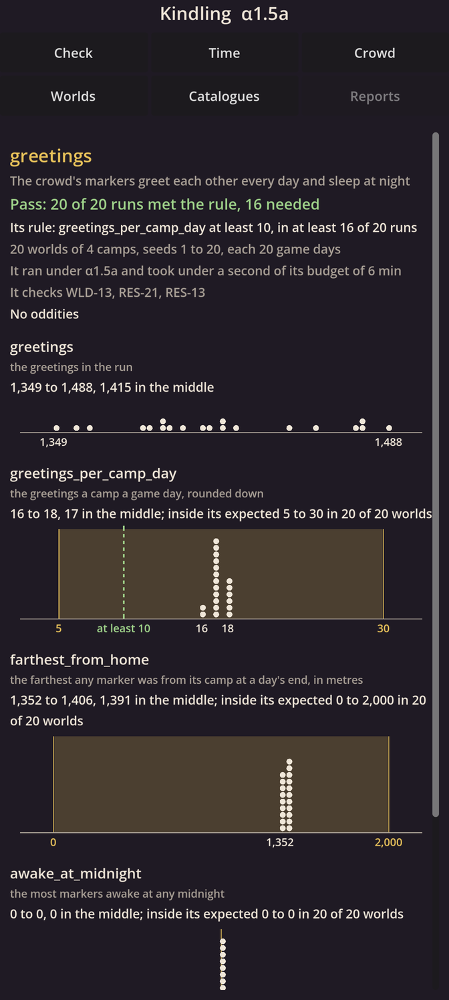
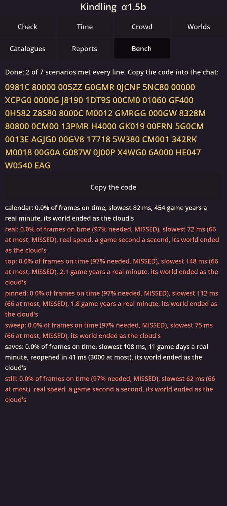

# M1 Foundations: the report

M1 is built: eleven steps in five alphas, delivered as 20101 to 20502 between 5 and 6 October 2026.
It is the plumbing the whole game stands on. There is no game to play yet: what you can see are its working parts, each on a page of the app.
This report is for your review (`RES-06`, `RES-22`): accept it, or send it back with what is wrong.

## In short

- **The same bits everywhere.** Your phone and the cloud compute exactly the same numbers, chances and worlds, and every check proves it again (`RES-05`).
- **A world that keeps.** A crowd of 10,000 markers lives on its own thread, saved every 30 seconds, and opens again exactly where it was, even after a crash, an update or a move to another phone.
- **Tests stated before they run.** Scenes say in advance what they check and how they pass, run many worlds at once in the cloud, and report on a page of the app.
- **A benchmark of one tap.** Your phone's numbers come back as one code, read in the cloud. They are the one thing this report still lacks: please run it (below).

## What was added, and what you can try

Each page of the app is one part of the foundations.

| Page | What it shows | Step |
|---|---|---|
| **Check** | The phone computing the same bits as the cloud: maths, chance, the torus, units, a small world, islands; the catalogue's files; saves and free space; the screen's rate and the heat forecast. Every line green means your phone agrees with the cloud. | α1.1a–α1.4b |
| **Time** | The calendar: 60-day years in four seasons, at any speed from real time to as fast as the phone can, with the speed it really runs at. | α1.2a |
| **Catalogues** | Everything the game knows, read from plain text files with their checks: today only the demonstration's markers and the tuning. | α1.2b |
| **Crowd** | 400 camps of 25 markers walking, resting, meeting, greeting and sleeping, drawn exactly where the world has them, at any speed; tap a camp to call it home. | α1.3a–α1.4a |
| **Worlds** | Several worlds kept, switched, renamed, deleted, exported to a file and imported; a warning before the phone is full. | α1.4b |
| **Reports** | The cloud's last test scene: its rule, its result, a chart for each measure, and the world it ran, which opens on your phone exactly as it ended. | α1.5a |
| **Bench** | The phone benchmark: seven scenarios, about 17 minutes, ending in a code. | α1.5b |

Underneath, in the simulation library (C++, the same code on phone and cloud):
- numbers with correctly rounded maths, a world that wraps round like a torus, units and durations, and chance drawn by key so it never depends on order;
- entities with ids never reused, one event queue, activities that always end, and islands that give exactly the one-core result on any number of cores;
- catalogues read exactly from text, with their checks and planted faults, and sources with fingerprints;
- saves that write only your commands at once, a journal, snapshots off the screen's thread, damage refused, updates that carry old worlds on, history that thins after 25 game years;
- scenes, runs, checkpoints, the repeat check, reports; and the benchmark.

## The tests, and where they ran

All ran in the cloud sessions where M1 was built (`SCP-15`): one container with 4 cores (Intel Xeon at 2.1 GHz) and 15 GB of memory, nothing else. M1 took about 12 hours of session time, from 5 October at 20:00 to 6 October at 08:00 (UTC). The whole check, `tools/check.sh`, takes about 5 to 15 minutes of the 4 cores, depending on what its caches can skip, and every step had to pass it before it was delivered (`PRC-10`).

- **104 C++ test cases** (94 for the simulation, 10 for the app's own C++), with thousands of checks inside them; **31 tests of the app**, its pages run headless in Godot; **37 tests of the tools**.
- The simulation is built **seven ways** and tested in each: with two compilers, one of them with a checker for undefined behaviour; with a thread checker; two ways for the phone's processor, run under an emulator, where its numbers must match the cloud's bit for bit; and twice more with the order of equal keys shuffled, so no result depends on it.
- **Every new test was made to fail once** on purpose, by a fault planted in the code it guards, so none passes by accident.
- **The repeat check**, in every check: a scene and the 10,000-marker world each run twice, once on one core and once on four with a stop and restart in between, and must end identical to the byte.
- **The greetings scene** runs 20 worlds of the crowd for 20 game days each, and passes when at least 16 meet its rule. Its report, with a chart for each measure, is on the Reports page (picture above).
- **The benchmark in the cloud**, a hundred times faster than on the phone: every one of its seven worlds ended exactly as the cloud's own run of it.
- **The pace** (`RES-07`) and **something to watch** (`RES-25`) need a game with people; they start with M5.

## Your phone's numbers

Not here yet: they come from the benchmark. Please:
1. install 20502, unplug the phone, turn on flight mode and let it cool;
2. open **Bench**, tap **Run**, and leave it about 17 minutes;
3. tap **Copy the code** and paste it into the chat.

I'll read it and add the numbers here: frames on time while the camera tours, the slowest frame, the speed held at top speed with the world pinned and not, the crowd's drawing time, the heat and battery, the save's pause, the export and the reopening.

What the cloud measured meanwhile, for comparison:

| Measure | In the cloud | Budget |
|---|---|---|
| An event of the crowd, with its handler | 0.56 µs on one core | 1–4% of a core at `TIM-07`'s speeds |
| Top speed, 10,000 markers | about 2 game days a real second, every frame on time | as fast as the phone can, at held speed |
| Drawing 10,000 markers | 0.8 to 1 ms of a frame | about 0.26 ms hoped for |
| A save's pause | 3 to 5 ms, the rest off the screen's thread | tens of milliseconds |
| Opening a world | 25 ms in the benchmark's run | 3 seconds |
| A save of the crowd | about 240 KB | within `PLT-10`'s storage |

## Moments, oddities and surprises

- **Islands were slower, not faster.** Running the crowd on four cores in islands gives exactly the one-core result, as designed, but takes nearly four times as long: the markers' events are too light to share. The crowd stays on one core; islands wait for people's minds (M6), whose events weigh more.
- **A race found by its own test.** In α1.5a the test that plants faults in a run found memory corruption: two threads used the same store of files at once. It is fixed (the keeper now does all of a world's reading and writing), and a thread checker now runs in every check, so a race like it cannot come back unseen.
- **History is bigger than estimated.** A record of the history takes 68 bytes as written, so a crowd's world grows about 31 MB a game year. It is capped by thinning after 25 game years; the real fix, compressing each year as it closes and smaller records, is planned for M5, when people's lives fill the history.
- **Godot's frame cap on Android** was set before the screen existed, so the phone ran at 120 Hz; setting it again after two frames fixed it.
- **The benchmark found nothing odd in the cloud:** all seven worlds matched. Your phone's run is the real test.

## The principles

Each principle's check, as it came out for M1 (`PRN-16`). Most need people, crafts or a story, which M1 does not have yet.

| Principle | Its check in M1 |
|---|---|
| `PRN-01` The world is the only teacher | Not yet testable: no discoveries or minds. |
| `PRN-02` Believable over exact | Nothing built whose detail you cannot see or read: every part has a page. |
| `PRN-07` Generic blueprints | Not yet testable: no blueprints. The catalogue's checks that will enforce it exist (`MAT-17`). |
| `PRN-05` Plausible numbers | The catalogue tests pass, with planted faults; every claim here is backed by a test that can fail (`RES-01`). |
| `PRN-12` Speed up time, never bend the rules | Held: the same world gives the same result at every speed and on any number of cores; test switches exist only in the cloud's test builds, and a check keeps them out of the app. |
| `PRN-17` History at a watchable pace | Not yet testable: no pace tests before people (M5). |
| `PRN-03` You are nature | Not yet testable: no powers. Your one command, calling a camp home, is a test command of the demonstration. |
| `PRN-04` If the game knows it, you can see it | Held for what exists: every part has a page, and the self-check shows the hidden ones. |
| `PRN-10` Nothing is faked | Held: the crowd is drawn exactly where the world has each marker, tested at 1,780 moments. |
| `PRN-13` Every choice can be explained | Not yet testable: no choices. |
| `PRN-06` Language models describe, never decide | Held: no language model in the game. |
| `PRN-15` History is saved, not re-run | Held: the history is written as it happens and read back, never re-run; after a crash only what came after the last save is worked out again, checked against what was written. |
| `PRN-11` Time slows, the screen stays smooth | Held in the cloud: every frame on time at top speed, and a test shows the heat guard slowing time as the forecast nears throttling. Your benchmark is the real test. |
| `PRN-09` Build in steps you can try | Held: every alpha ended with a build to install, and every task names its items. |
| `PRN-14` Modular by design | Held: each part was added on top of the last; earlier parts were extended, and none had to be rewritten. |

## Risks

- **The phone's numbers are still unknown** for this code: the benchmark measures them.
- **The crowd's drawing** took 0.8 to 1 ms a frame in the cloud against 0.26 ms hoped for; fine for 10,000 markers, but to watch as figures replace squares in M2.
- **History size**: compression and smaller records are needed by M5.
- **Islands** must prove faster once events are heavy (M6); until then one core runs the world, with the same results.
- **Content for later stages** (`RSK-25`): the catalogue, saves and scenes were built for the whole game's kinds of content, not only the markers; none of it needed changing to take the demonstration in.

## The independent review

One independent reviewer, given only M1's changes, its plan as it stood when M1 began, and the items it claims, checked the whole milestone and judged its screens as a pixel artist and art director would.

*(Its findings, and what was done about each, follow here once it has run.)*

## What needs your judgement

1. **Run the benchmark** and paste its code into the chat.
2. **Accept M1, or send it back** with what looks wrong (`RES-22`).
3. **What comes next.** The plan proposes the vertical slice before M2: one band at a cliff camp through a day, at the art book's look, built on these foundations, as the bar for the rest. You asked me to start M2's research, the graphics engine, with the question of the best way for Claude to make models, textures, shaders and meshes. Both can be first: the slice needs the same answers. Which do you want first?
4. **This report as a page on your phone** (`RES-06`): publishing it as a page stops my work until you allow it, so it stays in the repository for now. Say if you want it published.
5. **Once, if not yet done:** register the package `dev.kindling.app` and the release certificate's fingerprint in your developer account, and make `main` the default branch on GitHub.
