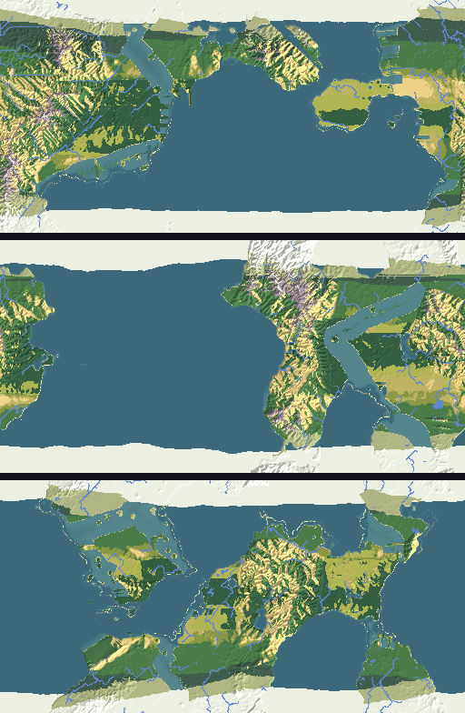
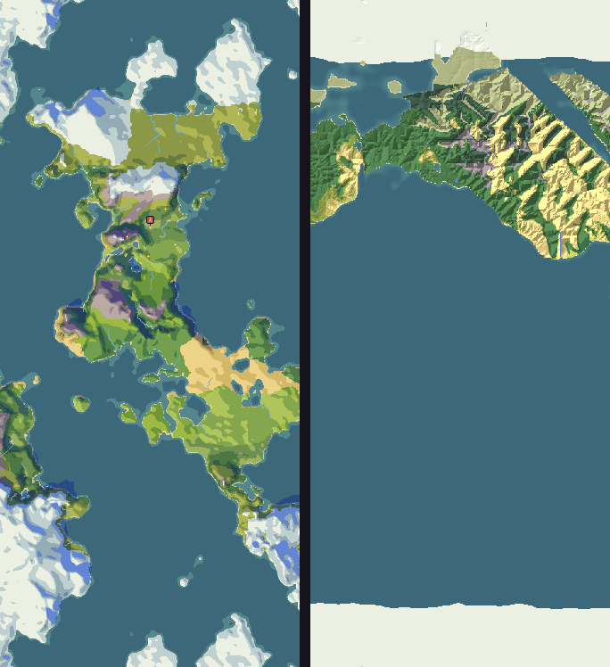

# Kindling α0.5a: P7 World generation

## What is new

- **P7 World generation.** How long does "New world" take on your phone (`WLD-11`)? P7 makes worlds the way the game will, every stage in a first, simple form, in the order of real causes (`WLD-09`):
  - plates that drift and meet, raising ranges and lines of volcanoes along their edges, and the rock each place is made of;
  - rivers cutting their valleys as the land rises, every river reaching the sea or a lake;
  - climate from latitude, height and the winds, with rain shadows behind mountains; then plants, soils, caves, and flint, clay and copper where the rocks put them, and the herds;
  - 20 rough candidates, each judged for a start region with caves, water, food and stone that flakes, and for everything the ages need, with its reasons; the best 4 made again in full, and the best 3 offered (`WLD-10`, `WLD-24`);
  - then the first one settled for 10 years with no people (`WLD-08`).
- **In the cloud:** three worlds in about 17 seconds on four cores, and settling about 10 more. The aim is about 3 minutes and 1 more. Your phone decides.
- **Your P5 and P6 runs both pass.** Your phone's chip gives exactly the cloud's results, even for P6's thousand minds after 3,546 game days, bit for bit. A thousand minds held 6.0 game years a real minute, six times the minimum, and the phone stayed cool.
- **The checks are quicker:** about 20 seconds when nothing changed, and under a minute for a typical change.

## What to try

1. Tap **Download and install** at the top of this page. It installs over the build you have.
2. Open **P7 World generation** and tap **Make**. The three maps appear first, then it settles the first world. Paste the line it copies into your reply.
3. If you haven't yet, α0.3a's look: open **P3 The kit**, tap **Hour** for dusk and night, and pinch in on the figures; open **P2 A full scene**; and say what reads well and what doesn't.

## What is rough

- **The maps are a first pass.** Climate belts run in straight lines, and the sea ice's edge follows latitude. The world map's look comes with P8 The zoom and in production.
- **Some parts are stand-ins:** settling's rules for plants, water and herds, and there are no glaciers or ocean currents yet. They have about the cost of the real ones, for the timing.
- **From before:** fire's pace rests on dreams (`RSK-01`), and the art book's 5° dusk sun throws long stripes across every screen.

## Questions for you

1. **Is half enough?** Every discovery window is now half as long. Faster still, or right? Halving also touches what is tied to the old years, which I left for you to decide: the pace tests' runs to Years 60, 150 and 500 (`RES-07`), culture's windows (`CUL-33`), and the people counts at Years 400 and 500 (`BIO-04`).
2. **The sharp-stone test.** It still asks for flakes within 5 years; I propose 3, to match (`RES-03`). At the tuned values it passes either way. OK?
3. **Dusk.** The sun at dusk stays at the art book's 5°. Keep it?

## IDs delivered

None for good: P7 is a prototype, thrown away once it has answered.
Its question is about `WLD-11`, `WLD-08`, `WLD-09`, `WLD-10` and `WLD-24`.

## Links

- APK: https://github.com/gunsandsalvi/Project-Nature/raw/ccr-13ab6fef-fspju6/dist/kindling.apk
- Note: https://claude.ai/artifact/GBackmSHJPak61yAd6we4d
