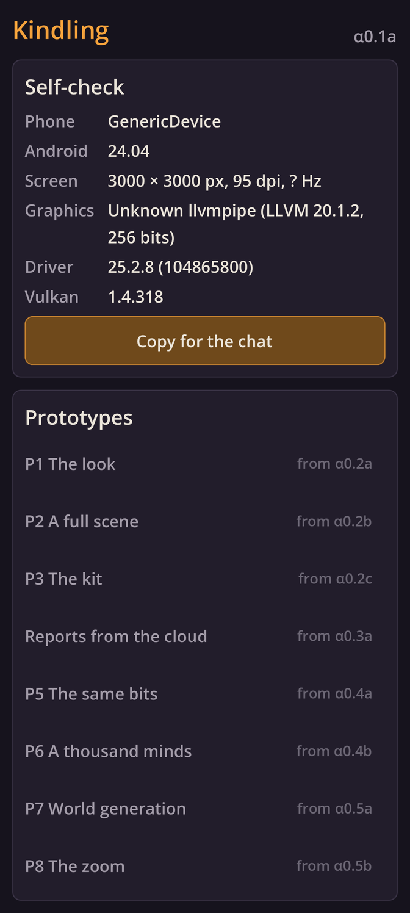
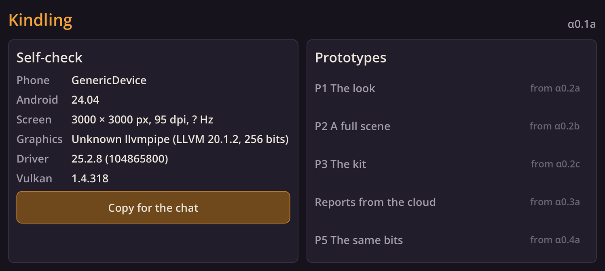

# Kindling α0.1a: The workshop

## What is new

- Kindling starts again on the new stack: Godot draws it now, and the old app with its test views is gone (git keeps it).
- The app opens on a self-check: its version, your phone's model and Android version, the screen's size, density and refresh rate, and the graphics chip with its driver and Vulkan versions.
- **Copy for the chat** copies all of that in one line.
- Below it is the menu of the prototypes to come, each with the step that brings it; the first, P1 The look, comes next in α0.2a.
- Turn the phone and the screen turns with it: in landscape the menu moves beside the self-check.
- Behind the scenes, three commands now do the work: one sets up a fresh cloud session, one runs every check, and one builds, signs and checks the APK.

The self-check as the cloud draws it, in portrait and in landscape:

## What to try

1. Tap **Download and install** at the top of this page. It installs over the old Kindling.
2. Open Kindling: the self-check shows α0.1a, your phone's model and its graphics driver.
3. Tap **Copy for the chat** and paste the line into your reply: it tells me which driver the prototypes will run on.
4. Turn the phone, with auto-rotate on: the screen follows, and the menu moves beside the self-check.
5. Turn on flight mode and open it again: it works the same, since it never uses the network.

## What is rough

- The pictures above come from the cloud's software graphics, so they show a computer's facts, not your phone's.
- The driver's version is decoded the way Vulkan packs versions; some makers pack theirs differently, so the line also carries the raw number, which I can decode.
- The text uses Godot's own font for now; the pixel font comes with the interface prototype (P12, α0.7a).
- The menu's entries are not buttons yet: each becomes one when its prototype arrives.
- The self-check only reports for now; its few seconds of checks (the same results, a save and reopen) come with P5, α0.4a.
- The app hides the status bar; swipe down from the top edge to see it.

## IDs delivered

`PLT-01` (part: built for your phone alone, arm64 only, with the self-check), `PLT-03` (part: no network permission), `PLT-06` (part: installs over the old app, as `dev.kindling.app` with the release key), `PRC-10` (part: the checks rebuilt for Godot and C++), `PRC-11` (part: one command builds, signs and checks the APK), `PRC-12` (part: the coverage check for C++, GDScript and data).

## Links

- APK: https://github.com/gunsandsalvi/Project-Nature/raw/ccr-13ab6fef-fspju6/dist/kindling.apk
- Note: https://claude.ai/artifact/GBackmSHJPak61yAd6we4d
