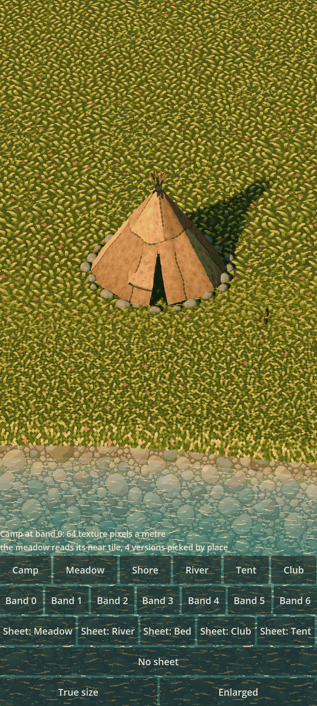
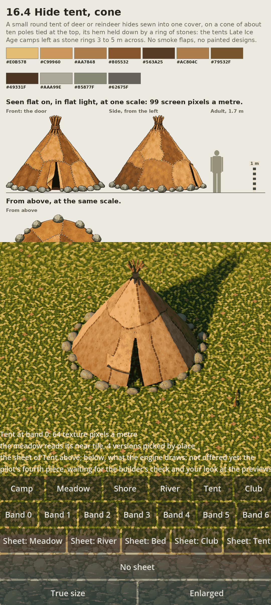

# Kindling α2.3a: The pilot, four pieces of the camp on your phone

The first look at the graphics engine's own drawing: the meadow, the river, the club and the hide tent, each taken from its signed-off sheet to your phone, drawn the way the game will draw them, and shown beside the sheet they came from. Say yes or no to each piece.

## What is new

- **The Pilot page:** a stand-in area, a square of meadow with a river across it and a camp on the north bank. Pick a place (**Camp, Meadow, Shore, River, Tent, Club**) and a zoom band (**Band 0 to 6**); each band shows a texture pixel 2 screen pixels wide, as the game will. **Enlarged** shows one at 8.
- **A sheet above, the engine below:** the **Sheet** buttons put a piece's signed-off picture in the top 40% of the screen, and what the engine draws of it underneath, at true size or enlarged.
- **The meadow,** the art lane's own: a near tile, a middle one and a far one, each in four versions picked by place so no piece sits on a grid, blending as you zoom.
- **The river,** the art lane's own bed and marks: clear water that takes the bed's colour as light is lost in it, marks and glints that step ten times a second in whole texture pixels, and a bright line one texture pixel wide where water meets land.
- **The club and the hide tent,** the art lane's own parts: eleven sewn hides, ten poles lashed where they cross, a door flap and a ring of 24 stones; and the club, a stick with a knob.
- **The light,** late afternoon: a warm low sun and a cool sky's fill, so lit planes are golden and shade is cool; contact shade at the stones' feet and under the tent's hem, a lit edge on the parts, and a shadow that softens with distance.
- **The Lab** (every material as the phone shows it, with loading time and texture memory) and **the Kit page** (every part and recipe) are on the phone too.
- **In the cloud,** the Pilot page is drawn at every band and checked: each band reads the tile that serves it, a cell's border is as quiet as any texture pixel edge, the marks step in whole pixels, and the hollow under the tent is darker than open ground and never black.

## What to try

1. Install the APK over 30202. Your worlds carry on.
2. Open **Pilot**. It starts at the **Camp**, band 0: look at the tent, the stones and the club on the meadow, and the river below.
3. Tap **Band 1** to **Band 6**: the meadow's tiles change as you zoom out. Tap **Enlarged**, then a band, to see single texture pixels.
4. Tap **Sheet: Meadow**, **Sheet: River**, **Sheet: Club** and **Sheet: Tent** in turn, and compare each sheet with what the engine draws below it. Use **Shore** and **River** for the water, **Tent** and **Club** for the camp's pieces.
5. Say yes or no to each of the four pieces: the meadow, the river, the club, the hide tent. If no, say what is wrong and where.

## What is rough

- The meadow is one even carpet over the whole area: no patches of taller grass, no worn ground round the tent, no bare earth. The art lane's earth and the patch picture come next.
- The shore is a plain strip of stones between grass and water, and the water is one colour model for every depth.
- The area is a stand-in made by code: a flat square with a straight-banked river, no cliff, no plants, no people.
- Each piece's record still says "not offered yet" (the Lab lists them as held back): that is the art lane's own word, kept until you have looked at them here.
- The light is the pilot's own, set for the camp: the Look, Compare and Calibrate pages keep the older light.

## IDs delivered

- `PRE-20`: the meadow's and the hides' colours by design, read through the ladder's levels.
- `PRE-22`: texture pixels that stay crisp squares as you zoom through the seven bands.
- `PRE-23`: the ground, from a tile in four versions of each size.
- `PRE-26`: the river's bed, its depth tint, marks, glints and shore line.
- `PRE-21` and `PRE-30`: contact shade, the lit edge and the warm late afternoon.
- `PRE-46`: the club and the hide tent, put together from the kit's parts.
- `PLT-04`: the Pilot, Lab and Kit pages on the phone.

## Links

- APK: https://github.com/gunsandsalvi/Project-Nature/raw/ccr-13ab6fef-fspju6/dist/kindling.apk
- This note: https://github.com/gunsandsalvi/Project-Nature/blob/ccr-13ab6fef-fspju6/dist/NOTE.md
- The plan for M2: https://github.com/gunsandsalvi/Project-Nature/blob/ccr-13ab6fef-fspju6/IMPLEMENTATION.md
