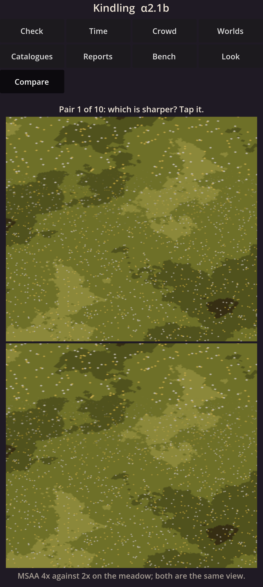
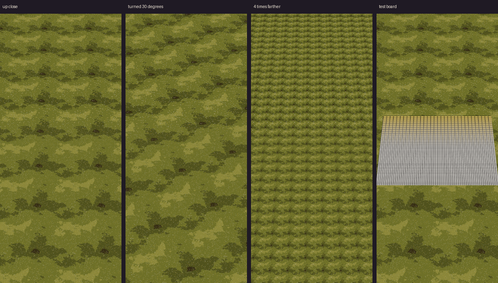

# Kindling α2.1b: The look's checks

The second step of the graphics engine (M2): the checks that guard the feeling, written once in C++ for the cloud and your phone; the loop that draws and checks the look in the cloud; and your first blind test.

## What is new

- **Compare.** A new **Compare** page asks ten times "which is sharper?": one view of the meadow drawn two ways, one above the other, the better way on top or below by chance.
  Tap the sharper picture. After ten it shows a short code to send me, and whether the difference showed: eight or more right means it does.
  This first test compares MSAA 4× with 2×.
- **The same measures on your phone.** The self-check runs a new **look** suite: the look's measures on pictures made by chance. Its digest must match the cloud's, as it already does on every chip the cloud builds for.
- **In the cloud,** with nothing new to see on the phone:
  - the target card: your chosen pictures measured into goals and bands for nine moments, from late afternoon to the cave; every picture you chose passes, all green but the painted-over night's commonest colour;
  - the drawing run: one Godot run draws the fixed views, their material and object pictures, and the camera's pan, turn and pinch, then checks them against the card, against their golden pictures (exact, or FLIP's verdict side by side on a lettered grid) and for shimmer;
  - NVIDIA's FLIP, vendored with its licence, giving its own published result on its test pair.
- Check now says why the graphics headroom is missing, such as "not offered by this phone".

The shimmer check works as planned: on a pan, the test board read nearest-pixel flickers on 25% of its pixels a frame and is flagged, while the meadow read with our smooth pixels flickers on none. The scripted pan, turn and pinch pass at 0.0%, 0.4% and 0.0%, against a line of 2%.

## What to try

1. Install the APK over 30101. Your worlds carry on.
2. Open **Check**: the new **look** suite should pass, matching the cloud.
3. Open **Compare** and take the blind test: ten pairs, tapping the sharper picture each time. Send me the code it shows.
   The two ways differ only in MSAA, which smooths the edges of shapes, and this meadow is flat, so I expect you not to see a difference: about 5 of 10 right.

## What is rough

- The views are still the stand-in meadow and test board; the real ground, light and camp come in the next steps.
- Read with our smooth pixels, the test board shimmers on 2.0% of its pixels a frame, right at the 2% line, where the meadow shows none. Its crisp black lines are the worst case; I will watch it as the real ground comes.
- The four golden pictures are the first set, of stand-ins; any later change to them comes to you for your OK.
- The card flags the stand-in meadow red on most of its numbers, as it should: it is flat and plain.
- The blind test shows still pictures only; moving clips come if a saving ever needs them.

## IDs delivered

- `PRE-01`: the target card, FLIP and the blind test.
- `PRE-20`: the card's colour statistics.
- `PRE-22`: the shimmer check, following the camera's motion exactly over flat ground.
- `PRE-28`: people's salience from the object picture, ready for the first people.
- `PRE-30`: the levels of a dark gradient, ready for the first nights.
- `PRE-31`: the drawing run, its golden pictures and its lettered grid.
- `PLT-04`: the same measures on your phone as in the cloud.

## Links

- APK: https://github.com/gunsandsalvi/Project-Nature/raw/ccr-13ab6fef-fspju6/dist/kindling.apk
- This note: https://github.com/gunsandsalvi/Project-Nature/blob/ccr-13ab6fef-fspju6/dist/NOTE.md
- The plan for M2: https://github.com/gunsandsalvi/Project-Nature/blob/ccr-13ab6fef-fspju6/IMPLEMENTATION.md
