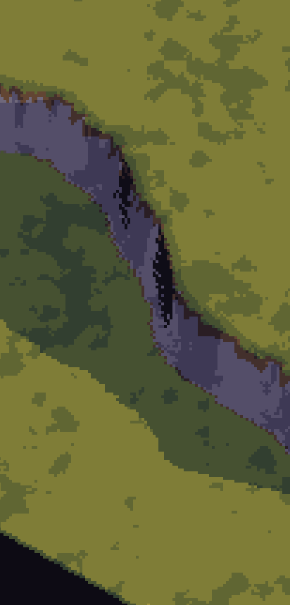

# Kindling α01b: The valley

## What is new
- A 256 m piece of hilly land fills the screen as pixel art: grass and bare earth in stepped greens and browns, a pale rock cliff crossing it with scree at its foot, the light low and warm from the west at dusk, and real shadows behind the bumps and the cliff.
- The land is made the way the world will be made: the shaped noise from the terrain pre-test, ported and checked to give exactly the same ground on the phone, in the browser and on the build computer.
- You move the camera with your fingers: drag and the land moves under your finger (let go while moving and it glides to a stop), twist two fingers to turn, pinch to come close or see the whole piece, and double-tap then drag with one thumb to zoom.
- Pixels stay put while you pan: the picture moves by whole pixels, checked pixel for pixel in the browser inside the piece of land and across its middle, and over 520 pans in a row across the whole piece.

After the review: stones and grass tufts now show everywhere (they had vanished from three quarters of the land, the scree at the start among them), and grass, earth, rock and scree meet along smooth, natural edges instead of a brown sawtooth.

## What to try
1. Tap the APK button: Android updates Kindling over α01a (no uninstall). Open it.
2. A piece of hilly ground fills the screen: grass and earth in stepped colours, a pale rock cliff crossing it with scree at its foot, the light low and warm from one side, shadows behind the bumps and the cliff.
3. Drag: the land moves under your finger, crisp, without shimmer. Let go while moving and it glides to a stop.
4. Twist two fingers: the land turns, then settles. Pinch out to come close until single stones show on the ground; pinch in to see the whole piece.
5. Double-tap and drag down with one thumb: it zooms in; drag up: it zooms out.
6. Turn the phone: the same view, the same pixel size.
7. Touch the top strip as before: it shows the version and frame rate, and a tap on it steps the colours through dawn, day and night.
8. Open the web link: the same in the browser; a mouse drags, but only a touch screen twists and pinches.

## What is rough
- The cliff's steep face shows dark vertical streaks: outlines on a face that the ground's mesh can only approximate. Cliffs become proper faces, with overhangs and caves, in α02c.
- Turning and zooming still make some pixels flicker: in the browser's count, about 16% of the ground's pixels change each frame while turning slowly at the camp zoom, and 22% while zooming; panning makes none. You choose one of the fixes at the end of Stage 1 (α07e).
- The scree at the cliff's foot takes the cliff's colours, so from far off it is hard to tell from the rock; the mockup draws it darker.
- In the browser a frame takes 0.36 ms of drawing, up from α01a's 0.16 ms, for the ground and its shadows: still far inside the budget.
- The sun stands still at dusk until the clock arrives in α03a; the strip's colour steps change the colours, not the sun.
- The land ends at the edge of the piece, and zooming out stops before the valley view, which needs the island (α02a).
- The gesture thresholds are the drawing pre-test's; if anything feels too eager or too slow, say which.

## IDs delivered
In part: `PRE-02`, `PRE-03`, `PRE-20`, `PRE-21`, `PRE-22`, `PRE-30`, `PRE-33`, `PRE-34`, `PLT-02`, `WLD-12`, `WLD-01`, `TIM-16`.

## Links
- APK: [kindling.apk](https://github.com/gunsandsalvi/Project-Nature/raw/ccr-13ab6fef-fspju6/dist/kindling.apk) (677 KB, version a01b, code 1012, release key)
- Web: [Kindling alpha](https://claude.ai/artifact/NmypTQyKQUAFZs18TNJELH)
- Phone check: [Kindling phone check](https://claude.ai/artifact/RZuafpPi6Hdmu9o9nu5dHi)
