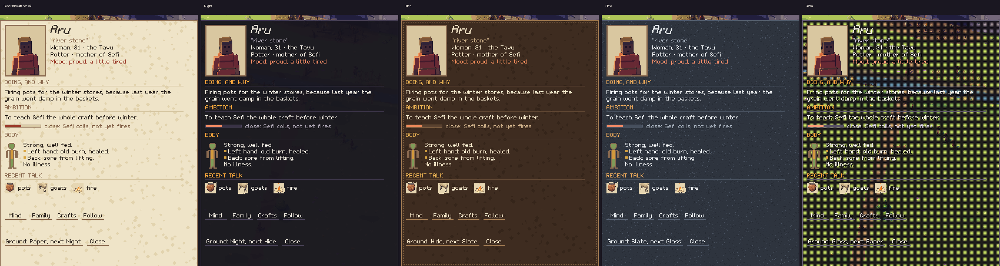
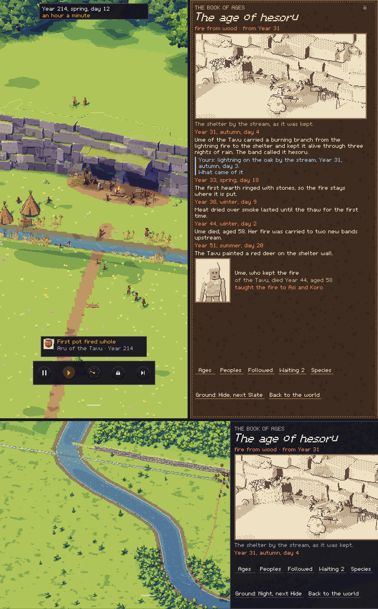

# Kindling α0.7a: P12 The interface

## What is new

- **P12, the interface, for your phone.** The question: do thumb reach, gestures and crisp pixel text work both ways up on your phone (`PRE-32` to `PRE-35`, `PLT-02`)?
  - **A stand-in world:** the art book's seven zoom stops, from one person to the globe, painted upright and now also sideways. Pinch, or double-tap and drag with one thumb, to move between them; the speed of time follows, as in the game.
  - **The interface the art book draws:** after any touch, the date, the speed and the time controls (pause, play, the dial, the lock, skip), fading after a few seconds; a live moment; the handle at the foot for the views; Aru's card; and the book of ages, open at the age of hesoru.
  - **Five grounds for the card and the book, as you asked:** the art book's paper, Night, Hide, Slate and Glass. "Ground" at the foot of each panel changes it.
  - **Crisp:** the whole screen is drawn in art pixels and enlarged by a whole number, 3 screen pixels an art pixel on your phone's setting. The fonts are the art book's own, built from where they are designed.
- **Checked in the cloud** (`test/interface_test.gd`):
  - **One gesture reader:** taps, slow taps, two taps, drags, a flick, a long press and drawing after it, a double tap dragged up and down, pinches with a slight turn, a twist with a slight spread, the handle tapped and swiped. None was read as another.
  - **Every control is at least 48 dp and 8 dp from the next, and upright in the bottom third,** on your phone's screen and the full panel, both ways up, with each panel open.
- **What the rules changed from the art book's plates** (in the notes for production): its buttons are about 25 dp, so the time controls spread wider; the live moment and the book's tabs come down within a thumb's reach; and the time controls wait while a panel is open.

## What to try

1. Tap **Download and install** at the top of this page. It installs over the build you have.
2. Open **P12 The interface**.
3. **Touch the world:** the date, the speed and the time controls appear, then fade. Try pause, play, the dial (pick a speed), the lock and skip.
4. **Zoom:** pinch, or double-tap and drag up or down with one thumb. The picture and the speed change stop by stop.
5. **Tap the camp, or the live moment,** to open Aru's card. Tap **Ground** at its foot to see each of the five.
6. **Tap the little handle at the foot, or swipe up from it,** for the views; **Book of ages** opens the book, which scrolls when you drag it.
7. **Turn the phone:** everything stays, laid out sideways.
8. **Long-press** for your powers there (a stand-in). **Menu**, in the views, goes back to the app's menu.
9. Tell me which ground you prefer, and anything hard to reach or read.

## What is rough

- **A stand-in world:** pictures, not the 3D world; a tap on the camp always opens Aru's card, and a twist only turns the heading shown.
- **Most links lead nowhere yet:** Mind, Family, Crafts, Follow, the other tabs, Worlds and Settings say "comes with production".
- **Sideways, the card is short:** it scrolls, and a line can show cut at its foot.

## Questions for you

1. Which ground for the card and the book: Paper, Night, Hide, Slate or Glass?
2. Is the reading text big enough? Its capitals are about 1.4 mm on your phone; it could go up to twice the size.
3. You said we'd think about P13, the writer, later: shall I go on to P14, sound, meanwhile?

## IDs delivered

None for good: P12 is a prototype, thrown away once it has answered.
Its question is about `PRE-32`, `PRE-33`, `PRE-34`, `PRE-35` and `PLT-02`.

## Links

- APK: https://github.com/gunsandsalvi/Project-Nature/raw/ccr-13ab6fef-fspju6/dist/kindling.apk
- Note: https://claude.ai/artifact/GBackmSHJPak61yAd6we4d
- Notes for production: https://github.com/gunsandsalvi/Project-Nature/blob/ccr-13ab6fef-fspju6/NOTES.md
