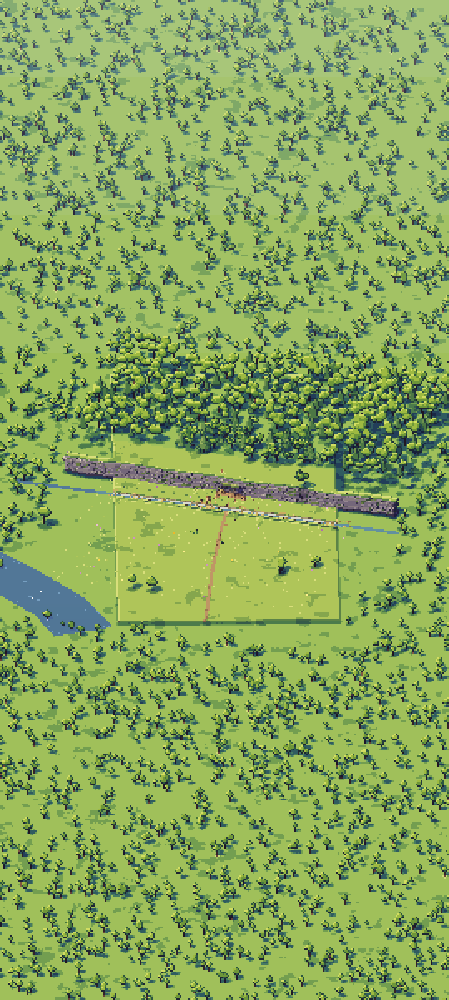

# Kindling α0.2b: P2 A full scene

## What is new

**This is α0.2b's third build,** after your second try:
- **Light and shadows fixed:** the figures, tents and trees I added were missing from the outline data that outline C reads, so C darkened each of them whole. Every shape now has its copy there. Up close, figures by the fires glow warm, tents are lit on their fire side, and at noon everything is shaded and casts its shadow.
- **Camp zoom fixed:** the bottom of the view was empty, tree shadows stopped partway up, and dark squares lay across the forest floor. The camera now stands far enough back, and the shadows reach across the whole view.
- **Measure fixed:** the view now turns while it runs, and the screen keeps showing "Measuring…" and then the line, until you touch it. Before, the frame-rate line wrote over both within a second.
- From the second build: outline C without its flicker, the "ease" crawl fix, and lighter trees at camp zoom.

What P2 is: P1's close camp, alive, at night. Thirty stand-in figures walk and work round three fires and two tents. **Fire light** switches between our fire light and Godot's built-in lights. **View** zooms out to 12,000 trees. **Measure** takes about 90 seconds and copies one line for the chat.

## What to try

1. Tap **Download and install** at the top of this page. It installs over the build you have.
2. Open Kindling, tap **P2 A full scene**, then **Measure**, and don't touch the screen for about 90 seconds: the view turns, and the screen says "Measuring 1 of 3" and so on. When it shows the line, it's also copied: paste it into your reply.
3. Pan and turn round the fires: the figures near them should glow warm, and the outlines should hold still as the view moves.

## What is rough

- **Your first build's numbers** (4 October): the camp at night cost 6.1 ms a frame at 120 frames a second, every frame on time, so it fits the 8 ms aim. The forest took 17.8 ms with 65% of frames on time, hence the lighter trees. The phone's heat forecast went from 0.56 to 0.59 of the way to slowing itself, so no heat trouble.
- **Stand-ins:** the figures are plain blocks without faces, and the trees simple shapes; the real shapes come with P3, the kit (α0.2c).
- **The forest's edge:** the art book's scene sits in the middle on its own ground, so a faint square shows round it at camp zoom.
- **Godot's lights** don't step like the art book's colours; they are there only to compare.

## IDs delivered

None for good: P2 is a prototype, thrown away once it has answered.
Its question is about `PRE-27`, `PRE-28`, `PRE-30`, `PRE-44`, `MAT-18`, `PLT-01` and `PLT-04`.

## Links

- APK: https://github.com/gunsandsalvi/Project-Nature/raw/ccr-13ab6fef-fspju6/dist/kindling.apk
- Note: https://claude.ai/artifact/GBackmSHJPak61yAd6we4d
