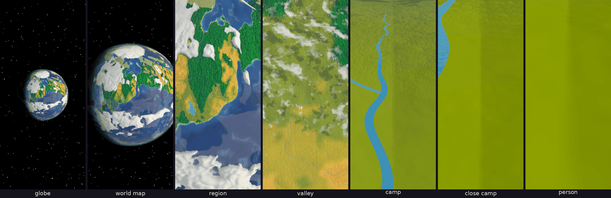
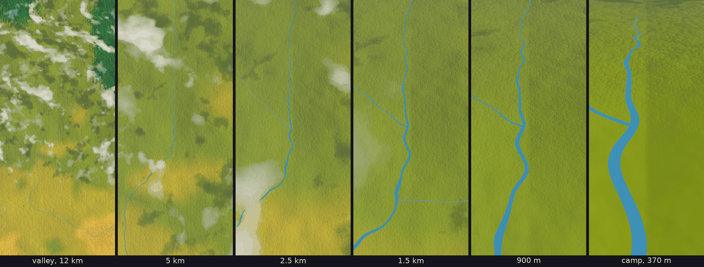
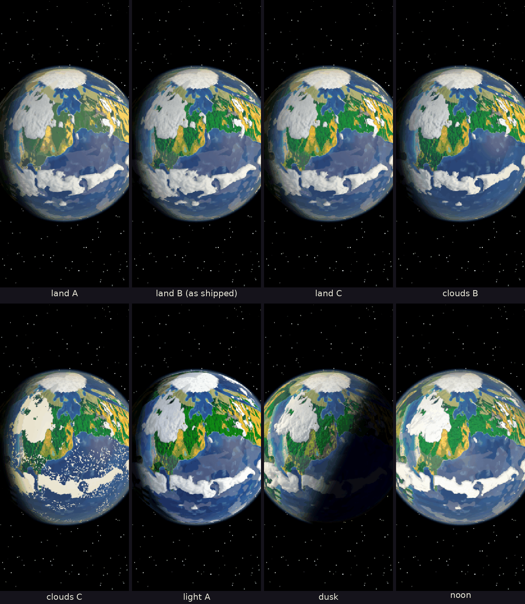

# Kindling α0.5d: P8 The zoom, second round, fixed

## What is new

- **The fixes you asked for.** α0.5c stopped on your phone as the world was made, and its buttons ran off the screen.
  - **The zoom now starts in stages,** the weather, then the ground, then the sky, and notes each one before it starts it. If the phone stops it again, the next start tells you at which stage, and opens in a light mode: no clouds, and the land and sea without their finest detail. Tap **Clouds off** to try the full zoom again. I could not run it on your phone, so I could not see which part stopped it; this way the next try tells us.
  - **The volumetric clouds have a shader of their own,** made only when you choose them, and the weather is drawn every fourth frame, so the start asks much less of the phone.
  - **The buttons** show a short name and a letter, such as "Clouds A", and keep clear of the phone's bars; what the letter means shows at the top when you tap it.
- **Your OK on the two proposals** is in the project file: pixels that grow from 2 to 6 with the zoom (`PRE-22`), and the land vivid and lit by the sun (`PRE-29`).
- **P8's second round, from space down to the valley,** after your verdict and the planet you showed me. This round makes the look from the globe to the valley as good as I can, in variants for you to choose; the camp and closer come in the next round, so they still show only grass and a river.
  - **A planet at every scale.** The world stays a sphere all the way down and never unrolls; near the ground it is shown at its true size.
  - **Smooth levels.** The ground is one tree of pieces, each melting into its coarser parent as you zoom out, so nothing pops; only the pieces the camera can see are drawn.
  - **Clouds from the climate.** A weather picture of the whole world, made on the phone: rain belts that follow the sun through the seasons, storms that swirl, winds that carry the clouds east in the middle latitudes and west in the tropics. Small fair-weather clouds over warm land, which the descent passes among, cast their shadows on the ground.
  - **The sea by its depth:** deep navy far out, open blue, turquoise shallows along the coasts, with currents drifting across it.
  - **The land textured with what can be seen from space:** forests as clumps of crowns lit on the sun's side at every zoom, grassland, deserts, rock, snow and polar ice; hills shaded; warm sunlight and blue shade.
  - **Smaller pixels up close:** about 2 screen pixels at the person, growing to 6 at the globe, small things blending into them as you zoom out.
  - **The descent ends by a river** near the start region, so the close stops show water, and rivers no longer vanish as you close in.
- **Why the cloud's pictures took 8 minutes:** the ground's memory freed pieces it was about to use, so a deep zoom kept asking for them again; fixed. Only pieces in view are drawn now: 25 at the person, where there were 989.

## What to try

1. Tap **Download and install** at the top of this page. It installs over the build you have.
2. Open **P8 The zoom**. It makes P7's world first, about 10 seconds, then shows the globe in the morning light.
3. Pinch from the globe down to the valley and back, and drag to look around. The buttons switch each variant; try them at the globe, the world map, the region and the valley, and tell me which you like for each:
   - **Pixels:** A the art book's fixed 4; B from 2 up close to 6 at the globe, in whole steps; C the same, smoothly, small things blended.
   - **Land:** A the art book's map colours; B vivid and textured, lit by the sun; C vivid, in clean steps of light.
   - **Water:** A the art book's bands; B deep and shallow, with currents; C B with waves at the shore.
   - **Clouds:** A volumetric; B volumetric, in the art book's clean steps; C the art book's flat clouds.
   - **Light:** A the air only as a glow at the rim; B the air's haze over the land too.
   - **Path:** A straight down from the valley; B a flight that tilts toward the horizon.
   - **Time:** A morning; B noon; C dusk; D night; E the live hour, moving.
4. Then tap **Measure** and leave the screen alone for about 45 seconds: it pinches from the globe to a person and back by itself. Paste the line it copies into your reply.

## What is rough

- **The camp, close camp and person** show only grass and the river: their trees, tufts and the camp come in the next round.
- **The polar ice** is a plain cap, and the lands just below it are squeezed, as a world on a sphere must be.
- **The phone's cost is untested:** the clouds are the dearest part. If Measure shows late frames, pixels B costs less than C, and I will make the clouds cheaper.
- **Still weaker than I want** at these stops: the clouds' edges from far off are smooth rather than lumpy; the valley's grassland is plain; a river can run dead straight for a short way where it joins another.

## Questions for you

1. Does it start now? If it opens in the light mode, tell me the stage it names.
2. For each of the seven buttons, which variant do you like, and what would you change?

## IDs delivered

None for good: P8 is a prototype, thrown away once it has answered.
Its question is about `PRE-03`, `PRE-29`, `WLD-02`, `TIM-01` and `PRE-22`.

## Links

- APK: https://github.com/gunsandsalvi/Project-Nature/raw/ccr-13ab6fef-fspju6/dist/kindling.apk
- Note: https://claude.ai/artifact/GBackmSHJPak61yAd6we4d
