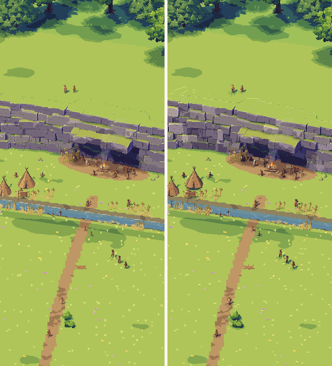
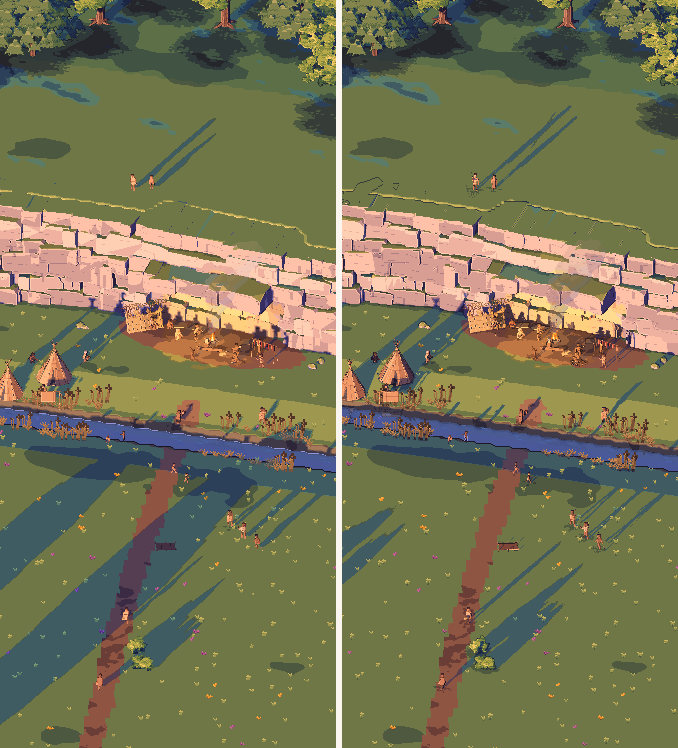
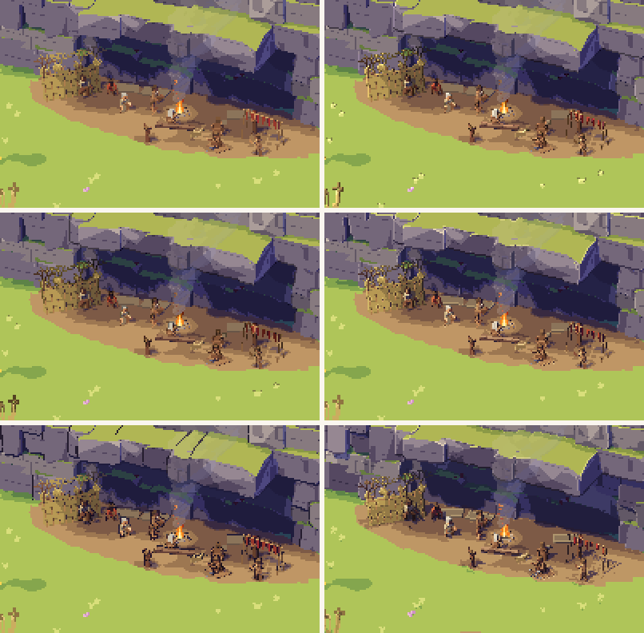
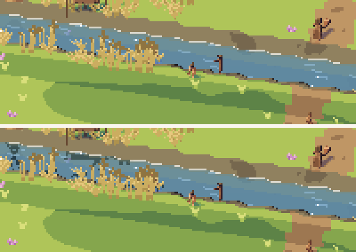

# Kindling α0.2a: P1 The look

## What is new

**This is α0.2a's second build,** after your first try:
- **Gestures work:** one finger pans, two fingers turn and pinch to zoom. In the first build no touch reached the view at all, so it couldn't turn.
- **Measure adds three runs at 120 frames a second:** none, C, and C with the mirror. At 120 each frame has only 8.3 ms, so the graphics chip can't hide its cost by slowing down. Measure now takes about 90 seconds, and its line also gives the picture's size and the screen's rate.
- **Outline C**, which you chose, is what P1 opens with; the switch stays.
- The self-check shows Android as its API level: 37 is Android 17.

What P1 is:
- The first prototype, **P1 The look**, asks one question: can Godot draw the art book's look on your phone fast enough, and which way of drawing outlines and which fix for crawling pixels should the game use?
- Tap it in the menu and Godot draws the art book's close camp, from the same scene the art book was painted from: the cliff, the camp under the overhang, the stream and the meadow.
  - Light falls in clean steps, with hard sun shadows, purple-blue shade, haze in the distance, the fire's glow and the hearth's smoke, at noon or at dusk.
- **Outline** switches between five ways of drawing the dark outlines and the bright sunlit edges:
  - **none**;
  - **A**: rebuilt from each pixel's depth, with lit edges;
  - **B**: from depth alone, outlines but no lit edges;
  - **C**: from a second small picture of each pixel's facing and depth, the art book's own way;
  - **D**: each shape drawn again slightly larger behind itself, so outlines run round shapes only.
- **Mirror** shows what stands above the stream reflected in it. Either way the stream is clear water: the bed shows in the shallows, deeper water darkens in steps, and a bright line marks the shore.
- **Crawl fix** switches between four ways of keeping pixels from shimmering as you turn and zoom:
  - **free**: the view locks to whole pixels as it pans, and turns and zooms freely;
  - **steps**: turns in steps of 15° and zooms in steps of 1.25 times;
  - **ease**: turns and zooms freely, then eases to the nearest step when you lift your fingers;
  - **rest**: moves smoothly, and locks to whole pixels only when it stops.
- The line above the buttons shows the frames a second and the graphics time as you go.

Godot's pictures below come from the cloud, drawn in software by the same renderer your phone uses, at the art book's size. Each sits beside the art book's picture.

## What to try

1. Tap **Download and install** at the top of this page. It installs over the first build.
2. Open Kindling, tap **P1 The look** and drag with one finger: if the view moves, you have the new build.
3. Tap **Measure** and don't touch the screen for about 90 seconds while the view moves by itself. When it shows "Copied for the chat", paste the line into your reply.
4. Tap **Crawl fix** to go through free, steps, ease and rest. With each, turn with two fingers and pinch to zoom, watching the cliff's and the shelter's edges for pixels that shimmer or crawl.
5. Tell me which crawl fix you prefer, and anything that looks wrong; a screenshot (power and volume down) helps.

## What is rough

- **Your phone's numbers from the first build** (4 October): every way, with and without the mirror, held 60 frames a second, with 99–100% of frames on time, at 9.5 to 10.4 ms of graphics time a frame on average. The ways differ by under a millisecond, so the chip probably slows its clock when it has time to spare; the runs at 120 show the real cost. P1 passes if a frame costs under about 8 ms.
- **Your screen runs at 1080 × 2404,** below its full 1344 × 2992, so P1 shows about four fifths of these pictures' view each way. I've kept it so, as I suggested; say if you'd rather switch the phone to full resolution.
- **The cloud's times mean little:** it draws in software, at about 300 ms a frame, so they only compare the ways: against no outlines, A and B cost about the same, D about a tenth more and C about a third more, and the mirror adds about a quarter.
- **How close it is:** 87% of the pixels at noon and 76% at dusk are within 3 levels of 255 of the art book's, too little to see. Most of the rest are shadows, outlines and edges a pixel apart, and one thing more:
  - at dusk, the long shadows across the meadow's lower left are cast by trees beyond the art book's frame, added round the scene so that you can pan; the art book has no trees there.
- **Nothing moves:** the people, the fire and the smoke stand still; life comes with later prototypes.
- **The scene ends:** it reaches about 50 m beyond the art book's frame, so pan far and the land stops.
- **Measure skips each run's first second,** so a pause while it switches ways doesn't count.
- **Plain controls:** Godot's own font and plain buttons; the art book's interface comes with P12 (α0.7a).

## IDs delivered

None for good: P1 is a prototype, thrown away once it has answered.
Its question is about `PRE-01`, `PRE-02`, `PRE-20`, `PRE-21`, `PRE-22`, `PRE-26`, `PRE-30`, `PRE-31`, `PLT-04` and `VIS-14`.
Your Measure lines and your choices go into the architecture (A4.1, A4.2): the outline way, C, is already there, and the crawl fix follows.

## Links

- APK: https://github.com/gunsandsalvi/Project-Nature/raw/ccr-13ab6fef-fspju6/dist/kindling.apk
- Note: https://claude.ai/artifact/GBackmSHJPak61yAd6we4d
