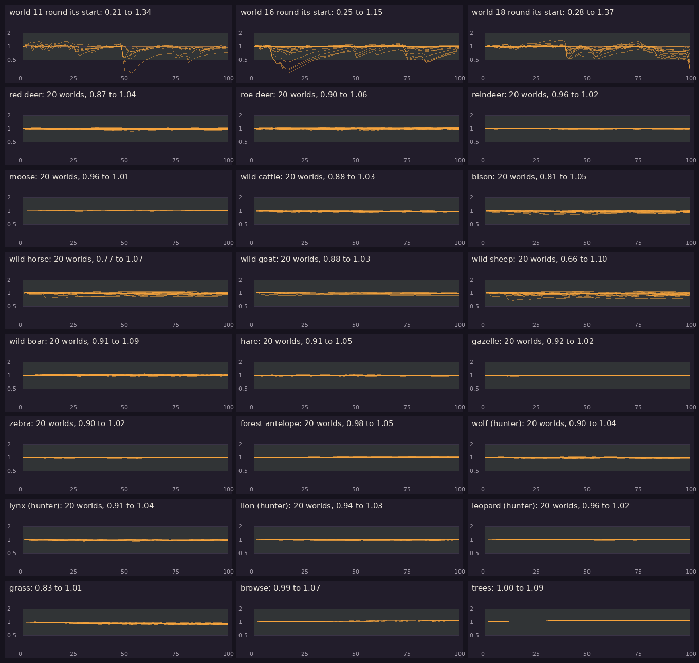
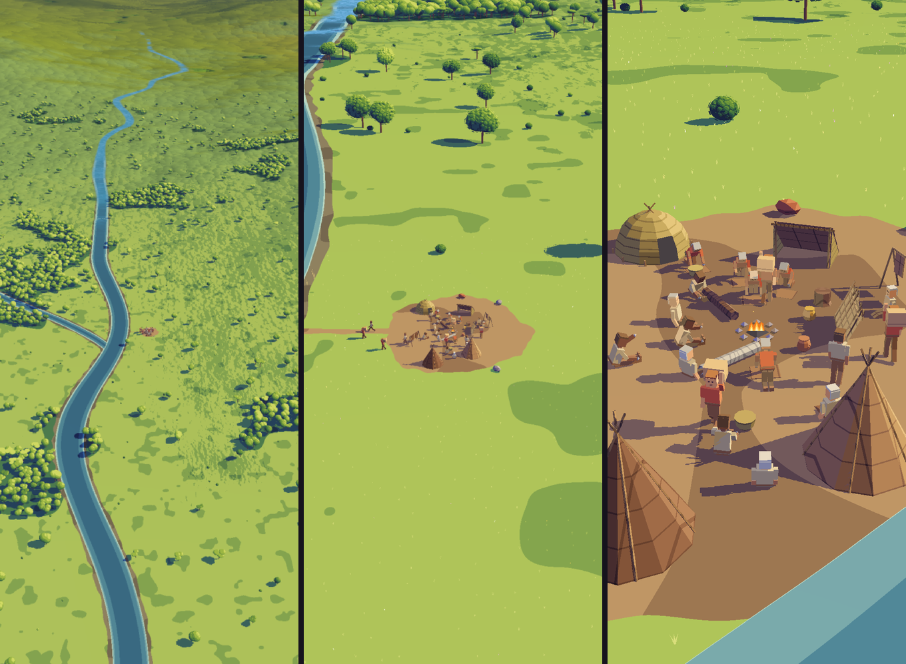

# Kindling α0.6a: P9 Ecology, and P8's camp

## What is new

- **P9 Ecology answers yes.** The question: do the numbers of plants and animals stay believable for 100 years with nobody in the world?
  - **How:** 20 of P7's worlds, each run 30 years into its present-day state, settled 10 years, then 100 more with nobody in it, in steps of five game days. 14 plant eaters live in every biome, from hares to wild cattle, at a sixth of Earth's numbers for their size. 4 hunters, wolves, lynx, lions and leopards, have room in proportion to the weight of their prey.
  - **Driven by the weather:** each region has its own wet or dry year and hard or mild winter, with patterns shared over several hundred km and, some years, by the whole world. Animals lose condition when they cannot reach enough food under the snow or in a drought, die first of hunger in a hard winter, and breed as their condition lets them. Hunters take the weak most easily.
  - **The result:** in all 20 worlds every species stayed between 0.66 and 1.10 of its settled number for the 100 years, and in every biome it lived in; grass, bushes and trees held too; and there were 82 to 99 big plant eaters for each hunter, where the project file asks 50 to 200 (`WLD-18`). The world's totals hold because its regions' bad years fall at different times: round each world's start region, numbers crashed in droughts and hard winters to as little as a fifth, boomed to over twice in good years, and took 10 to 20 years to mend.
  - **The first runs failed, and taught something:** at first nothing moved, every species within 2% of its total, because a game winter cost the animals almost nothing; then wild sheep in 3 of 20 worlds crashed in a drought and stayed down, because my dry country's plants grew as if they were a wet meadow short of rain. Now a game winter costs what a real one does, dry country's plants live on less water, and young animals leave crowded land for emptier land next door.
  - The charts are on the app's Reports page, below P4's.
- **P8's camp and closer,** in the zoom: trees that cast the sun's shadows, the camp built from the kit by the river, its fire drawn pixel by pixel and lighting what stands round it, the band at work, and small plants up close. As you said, this is as far as pre-production takes it.
- **Notes for production:** your observations of 5 October (the ground drawn as what covers it, every asset crisp) and mine against the art book are in `NOTES.md`, so production takes them up.

## What to try

1. Tap **Download and install** at the top of this page. It installs over the build you have.
2. Open **Reports from the cloud** and scroll past P4 to **P9 Ecology**: a chart for each species and each kind of plant, one line a world.
3. If you like, open **P8 The zoom**, pinch down to the camp, then tap **Measure** and leave the screen alone for about 45 seconds. Paste the line it copies into your reply.

## What is rough

- **P9 is a model on the world's cells,** about 4 km across, with counts that can hold a fraction of an animal; production runs it on 1 km cells with herds, as `WLD-32` says.
- **Hunters are always well fed:** at these numbers prey is never scarce enough to starve them, so their numbers follow their prey's rather than swinging on their own.
- **Mild country barely moves:** in forests with mild winters numbers stay within a few per cent. Hunters that can starve, and cycles like the hare's and the lynx's, are left for production, in the notes for production.
- **Fish, birds and bears are not in P9:** they need rivers, seas and seasons of their own.
- **P8's camp** lacks what the notes for production list: outlines, smoke, grass at the close camp, the ground drawn as its cover.

## Questions for you

1. Is P9's answer enough to move on to P10, culture from causes?

## IDs delivered

None for good: P9 is a prototype, thrown away once it has answered.
Its question is about `WLD-18`, `WLD-30`, `WLD-31` and `WLD-32`.

## Links

- APK: https://github.com/gunsandsalvi/Project-Nature/raw/ccr-13ab6fef-fspju6/dist/kindling.apk
- Note: https://claude.ai/artifact/GBackmSHJPak61yAd6we4d
- Notes for production: https://github.com/gunsandsalvi/Project-Nature/blob/ccr-13ab6fef-fspju6/NOTES.md
