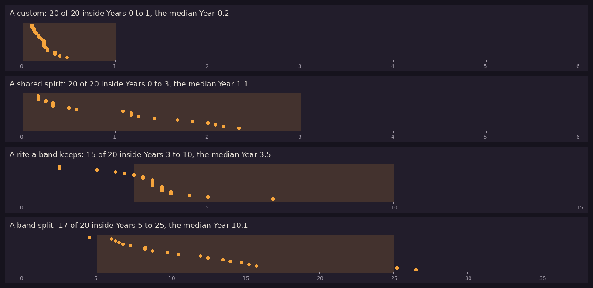

# Kindling α0.6b: P10 Culture from causes

## What is new

- **P10 answers yes.** The question: do customs, a spirit, a rite and a band split arise inside their windows (`CUL-33`), each from its own cause?
  - **How:** three bands of 22 to 30 people in families, run 100 years in each of 20 worlds. They hunt, eat, meet storms, fall ill, are born and die, marry at the summer gathering, and talk each evening.
  - **Beliefs from coincidences, with the project file's own numbers (`MND-05`):** after something strong happens, people link it to the most unusual thing just before it; later events strengthen or weaken the link, and talk passes it on. Lightning or a sudden death can leave a belief in an unseen being; grief and dreams make the dead live on.
  - **The result:** each came inside its window in at least half the worlds, and every one traces back to the events behind it:
    - **a custom** in all 20, in the first year, from the first big kills: who the meat is shared with;
    - **a shared spirit** in all 20, by Year 3: most often a being in the storm after lightning struck a camp, otherwise a dead person living on;
    - **a rite a band keeps** in 15 of 20, in Years 3 to 10, most often the band's way with its dead, sometimes an act it credits for good hunts, such as singing before a hunt; 5 came a little early;
    - **a band split** in 17 of 20, in Years 5 to 25, when a band grew past 40 and the families thinking least of the leader left.
  - **World 1's story,** on the Reports page, tells each first from its events, such as: three deaths, each laid under stones; the band names its custom; a year later, burial under stones is a rite at the grave.
- **What failed first, and taught something** (in the notes for production):
  - A belief told again and again grew stronger at every telling, so every told belief lived forever. Now hearing it lends what the teller's conviction lends, and no more.
  - The project file's numbers let a pointless act before a common success keep itself once believed. Only those an outcome befalls link it (a good hunt its hunters), so the band comes to credit it slowly, through talk.
  - Hunters died ten times too often, flooding the bands with sudden deaths.

## What to try

1. Tap **Download and install** at the top of this page. It installs over the build you have.
2. Open **Reports from the cloud** and scroll to **P10 Culture from causes**: when each first came in each world, and world 1's story.

## What is rough

- **Only four of `CUL-33`'s firsts were tried:** customs, spirits, rites and splits. Myths, festivals, feuds, new peoples, raids and chiefs need the later prototypes and production.
- **Three of the twelve customs:** how the dead are treated, who shares a big kill, where couples live; the bands meet the others too rarely in 100 years to answer them.
- **Simple minds:** no needs beyond being born, eating and dying, and no gatherings beyond each summer's marriages.

## Questions for you

1. `CUL-33` gives customs no window. P10 found every world's first custom in its first year: shall it read "First custom a band names: within 1"? It is listed under Proposals awaiting confirmation.
2. Shall I go on to P11, the director, which also runs in the cloud?

## IDs delivered

None for good: P10 is a prototype, thrown away once it has answered.
Its question is about `CUL-33`, `CUL-05`, `CUL-06`, `CUL-30` and `CUL-34`.

## Links

- APK: https://github.com/gunsandsalvi/Project-Nature/raw/ccr-13ab6fef-fspju6/dist/kindling.apk
- Note: https://claude.ai/artifact/GBackmSHJPak61yAd6we4d
- Notes for production: https://github.com/gunsandsalvi/Project-Nature/blob/ccr-13ab6fef-fspju6/NOTES.md
