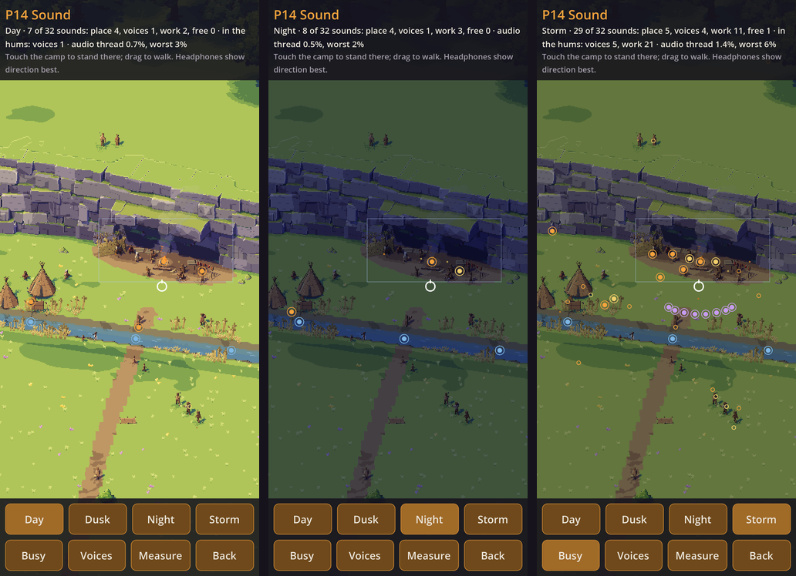

# Kindling α0.7c: P14 Sound

## What is new

- **P14, sound, for your ears.** The question: do 32 sounds at once, with distance, a cave's echo and the murmur of talk, play without breaks on your phone (`SND-01`, `SND-03`, `SND-08`, `SND-11`, `SND-12`)?
  - **The close camp as a map you walk on:** touch it to stand there, drag to walk. Everything in it sounds from its place: knapping and scraping, wood chopped, the fire, talk, children, walkers, two dogs, birds in the wood, a wolf far off, the stream, wind, rain and thunder. Sounds are quieter and duller far away; the cliff muffles what is on its other side; under the rock shelter they echo.
  - **Four hours:** day, dusk, night and a storm, each with its own sounds. Dusk is `SND-01`'s own example: a knapper by the fire, a hide scraped, children round the hearth, the murmur of talk.
  - **Busy:** everyone at once, with eight stand-in drummers for the music share. The phone plays 32 sounds at most, in `SND-01`'s shares; when a share is full, its quietest sounds join its hum.
  - **The murmur:** talk strung from the syllables of a stand-in language, spoken once in the cloud by two open voices, a woman's and a man's, and shifted on the phone for age, build and feeling (`SND-03`). **Voices** plays a child, a woman, a man and an old man, then anger and grief, one by one.
  - **Made by code:** the base sounds as the screen opens, each play a little different (`SND-06`); the fire and the wind made live as they play.
  - **Measure:** everyone at once in a storm for a minute; it times the audio thread and copies a line for the chat.
- **The reel** (`SND-12`), recorded in the cloud: a tour of the camp by day, dusk, night and storm, with the voices one by one and everyone at once. It plays below.
- **Checked in the cloud** (`prototypes/sound/tests`, `test/sound_test.gd`):
  - every `SND-06` rule: harder is brighter, bigger deeper and longer, wetter duller; 20 flint strikes in a row all differ; loops join without a click;
  - a child's talk higher than a woman's, hers than a man's, his than an old man's; anger quicker, louder and higher, grief slower, softer and lower;
  - never more than 32 sounds under any load, each share within its most, the rest in hums;
  - the cliff muffles what is above it, and the camp is heard;
  - with 32 sounds, the mix takes about 3% of the audio thread's time in the cloud, 9% at worst. Your phone's number is Measure's.

## What to try

1. Tap **Download and install** at the top of this page. It installs over the build you have.
2. Play the reel above, once on the speaker and once with headphones.
3. Open **P14 Sound** and wait a moment while it makes the camp's sounds.
4. With headphones, **drag the white ring round the camp:** past the stream, under the rock shelter (its echo), up above the cliff (the camp below goes muffled).
5. Try **Day**, **Dusk**, **Night** and **Storm**, and **Busy** for everyone at once.
6. Tap **Voices:** can you tell the child, the woman, the man and the old man apart, and the anger from the grief?
7. Tap **Measure**, leave the phone for a minute, then paste the line into the chat.

## What is rough

- **The voices are stand-ins:** two open voices of the Piper speech engine, in the public domain and CC0. The game's is the one you choose by ear later (`SND-03`). The language is a stand-in too.
- **Made by code where the game will use recordings:** the birds, the dogs, the wolf, and the children's laughs, calls, cries and screams.
- **The drummers stand in for music,** which comes with `SND-02`.
- **A picture, not the 3D world:** sounds don't follow figures' movements (`SND-07`), and the cliff's muffling is drawn by hand where the game will test the land.
- **No bass lift for the phone's speaker yet** (`SND-06`'s last step).
- **Measure asks for more than a camp would,** on purpose, so all 32 places stay full.

## Questions for you

1. Does the camp sound alive? What sounds wrong or harsh, on the speaker or on headphones?
2. Can you tell a child, a woman, a man and an old man apart, and anger from grief? Does it sound like talk but never like words?
3. Measure's line, please.
4. Still open: which ground for P12's card and book (Paper, Night, Hide, Slate or Glass); whether its reading text is big enough; and P8's Measure line.
5. Next: P13, the writer, or straight on to α0.8a, what the prototypes found?

## IDs delivered

None for good: P14 is a prototype, thrown away once it has answered.
Its question is about `SND-01`, `SND-03`, `SND-08`, `SND-11` and `SND-12`.

## Links

- APK: https://github.com/gunsandsalvi/Project-Nature/raw/ccr-13ab6fef-fspju6/dist/kindling.apk
- Note: https://claude.ai/artifact/GBackmSHJPak61yAd6we4d
- Notes for production: https://github.com/gunsandsalvi/Project-Nature/blob/ccr-13ab6fef-fspju6/NOTES.md
