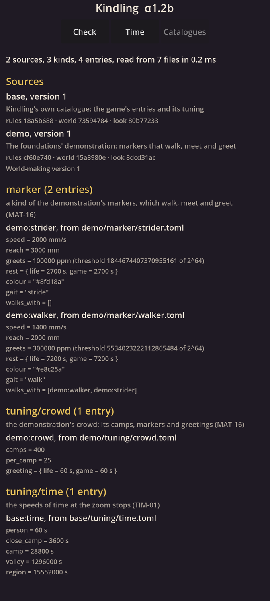
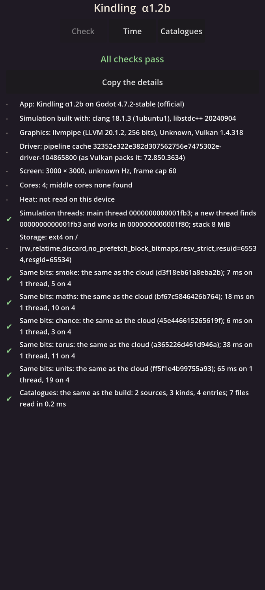

# Kindling α1.2b: Catalogues and tuning

## What is new

- **Content as data.** Everything the game will know (kinds of stone, plants, animals, blueprints) will live in small text files in the TOML format, one entry a file, each in a source: `base` for the game, `demo` for what only the foundations show. This step builds the machinery; the first entries are the demonstration's two kinds of marker, its crowd, and the speeds of time.
- **Read exactly, the same on every machine.** No decimal numbers are stored: "1.4 m/s", "30%" or "1 in 10" are read into whole millimetres a second and exact chances, so the phone's reading can never differ from the cloud's. Every mistake in a file is named at its file, line and column, from a misspelt unit to a link to an entry that does not exist, a length of time that breaks the game year's rule, or a name listed twice.
- **Checks on the whole catalogue.** Beyond each file, checks run over everything at once. The first one holds values to the real order of things (`MAT-05`): a list in `checks/` says a strider is faster than a walker, so a strider written slower is refused at its place in the list. Each check was proved by a planted fault that it caught.
- **Sources and fingerprints.** Each source has a version, the sources it needs, and three fingerprints: of what changes the rules, the land and the look. A new entry changes no other entry's fingerprint, and a renamed entry is still found by its old name, so old saves keep working.
- **On your phone.** The build copies the files into the app with a list of their fingerprints; the phone reads them through the simulation itself and checks it gets the same answers as the cloud.
- **A new page, Catalogues:** every source, kind and entry the phone loaded, with each value in the units the simulation holds it.
- **The Time page's speeds** now come from the tuning file rather than being written into the page.

## What to try

1. Install the APK from the link below. It installs over α1.2a.
2. Open **Kindling**. The **Check** page should end with a green line: **Catalogues: the same as the build**.
3. Tap **Catalogues** at the top and scroll through the two sources and their entries.
4. On **Time**, the buttons now read "Real", "1 hour a minute", "8 hours a minute", "1 season a minute", "3 years a minute" and "Top", taken from the tuning file. Please send me how many game years a real minute **Top** reaches, if you haven't yet.
5. Copy the Check page's details into the chat when you can.

## What is rough

- The catalogue holds only the demonstration's markers and two tuning files; the game's own entries arrive with the milestones that need them.
- The Catalogues page is plain text, and shows chances with their exact inner numbers, which look long.
- This note was not republished as a page, as you asked: it lives in the repository (link below).

## IDs delivered

- `MAT-13`: the catalogues in TOML, read exactly into whole base units, one description of each kind for loading, checking, fingerprinting and showing; on the phone through the simulation itself.
- `MAT-14`: sources with versions and requirements; adding an entry changes no other's fingerprint; renames keep old names readable; each entry's chance keyed by its name.
- `MAT-17`: the checks on the whole catalogue, each proved by a planted fault, run before anything joins.
- `MAT-05`: values held to the real order of things, from lists in `checks/`.
- `TIM-18`: every duration held to the game year's rule as it loads.
- `TIM-01`: the zoom stops' speeds read from the tuning file.

## Links

- APK: https://github.com/gunsandsalvi/Project-Nature/raw/ccr-13ab6fef-fspju6/dist/kindling.apk
- This note: https://github.com/gunsandsalvi/Project-Nature/blob/ccr-13ab6fef-fspju6/dist/NOTE.md
- The plan for M1: https://github.com/gunsandsalvi/Project-Nature/blob/ccr-13ab6fef-fspju6/IMPLEMENTATION.md
- The research behind it: https://github.com/gunsandsalvi/Project-Nature/blob/ccr-13ab6fef-fspju6/research/18-foundations.md
