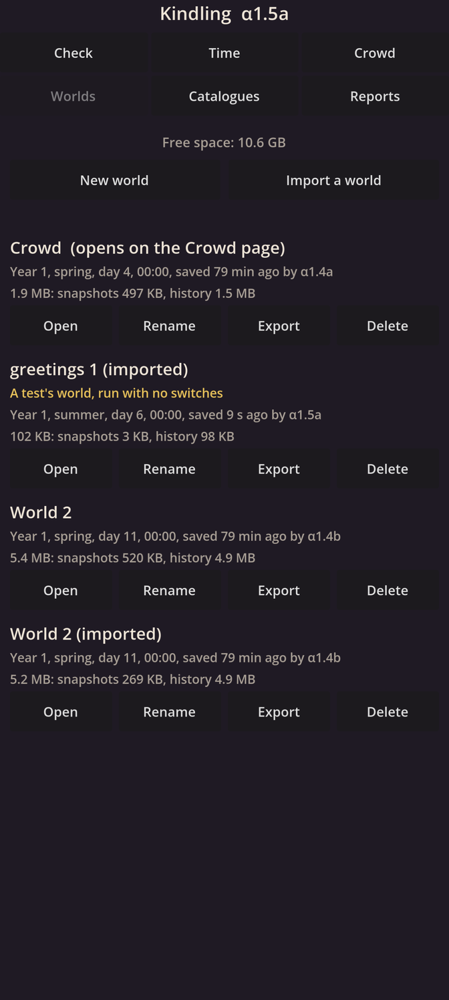

# Kindling α1.5a: Scenes and runs

## What is new

- **Reports.** A new **Reports** page shows the cloud's last scene report: what the scene checks, its rule, and whether it passed ("Pass: 20 of 20 runs met the rule, 16 needed"); how it was set up and how long it took; and, for each thing it measures, its range over the runs, such as "inside its expected 5 to 30 in 20 of 20 worlds", with a chart: each run a dot, the expected range shaded, the rule's line dashed. **Show all 20 runs** lists every run.
- **The test world it ran.** The report brings one of its worlds. **Open run 1's world** adds it to your worlds and opens it on the Crowd page exactly as it ended in the cloud. The Worlds and Crowd pages mark it as a test's world.
- **Scenes in the cloud.** Each test is now a scene: a small file stating, before it first runs, what it checks, its seeds, how many worlds it runs, for how long, its time limits, and its pass rule in exact numbers. The cloud runs its worlds many at once, each in its own process. A rule that fails on its 20 worlds runs 20 more on new seeds and is judged on all 40.
- **Oddities are flagged.** Anything outside a scene's expected ranges, or breaking a rule it must never break, is flagged, and so is a crash, a run that hangs, memory that keeps growing, or a save that will not open again. A test plants one of each, and the checks must find all six.
- **Test switches stay in the cloud.** Switches that turn something off, or plant a fault, exist only in the cloud's test builds. A check makes sure the app never has them.
- **The repeat check.** Every check now runs one scene and the 10,000-marker world twice: once on one core, and once on four with a stop and a restart in between. Both must end identical, to the byte.
- **Two rows of pages.** The page buttons are now two rows of three, to make room for Reports.

## What to try

1. Install the APK from the link below. It installs over α1.4b, and your worlds carry on.
2. Open **Reports** and read the greetings scene's report. Scroll through its four charts, then tap **Show all 20 runs**.
3. Tap **Open run 1's world**: the Crowd page opens the cloud's test world, 20 game days in, with "A test's world" under its name. Let it run.
4. Open **Worlds**: the test world is listed, marked in yellow as a test's world.
5. Open **Check**: every line should be green.

## What is rough

- The Reports page shows only the scenes the build ran. Reports of longer runs, made in the background, come later.
- The charts show each measure's range over the runs, not how it changed over time.
- The measures go by their names in the scene file, such as greetings_per_camp_day, with a plain line under each.
- Running the crowd on four cores in islands is slower than on one, because its events are so light; the crowd stays on one core, and islands wait for people's minds (M6).

## IDs delivered

- `RES-21`: scenes stated in files and run in the cloud, many at once.
- `RES-09`: each scene states, before it first runs, what it checks, its world, seeds, runs, game time, time limit, budget and pass rule in exact numbers.
- `RES-13`: a rule counts the runs that meet it; one that fails is judged again on 40 runs; fewer than 20 count only as provisional.
- `RES-10`: test switches only in the cloud's test builds, recorded in the world and the report.
- `RES-12`: oddities flagged: expected ranges, rules never to break, crashes, hangs, growing memory, and saves that will not open again.
- `PLT-05`: runs keep checkpoints and resume exactly; a test's world opens on the phone as it ended, marked as one.
- `RES-05`: the repeat check: one scene and one benchmark world, on one core and on four with a stop between, end identical.
- `RES-06`: a scene's report as a page, with its ranges and charts.
- `PRC-10`: the scenes and the repeat check run before any work joins.

## Links

- APK: https://github.com/gunsandsalvi/Project-Nature/raw/ccr-13ab6fef-fspju6/dist/kindling.apk
- This note: https://github.com/gunsandsalvi/Project-Nature/blob/ccr-13ab6fef-fspju6/dist/NOTE.md
- The plan for M1: https://github.com/gunsandsalvi/Project-Nature/blob/ccr-13ab6fef-fspju6/IMPLEMENTATION.md
- How scenes and reports work: https://github.com/gunsandsalvi/Project-Nature/blob/ccr-13ab6fef-fspju6/ARCHITECTURE.md
