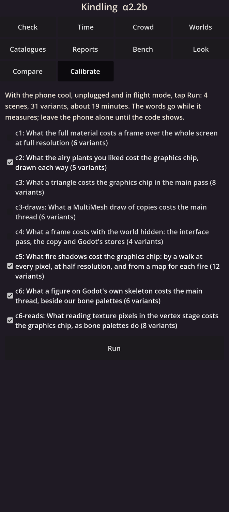
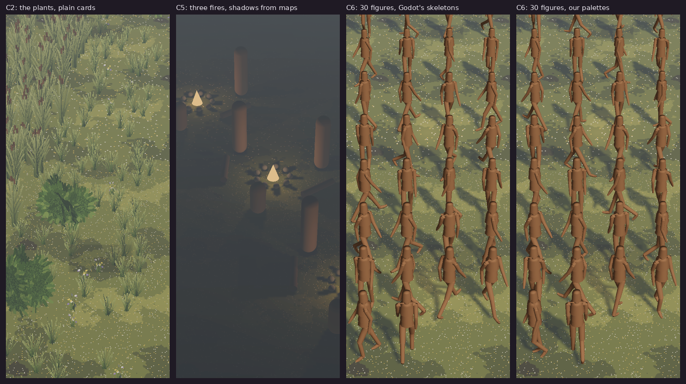

# Kindling α2.2b: Calibration, leaves, fires and figures

The fourth step of the graphics engine (M2): your phone measures the three costs that decide how the camp is drawn, each decision written down before it runs. The airy plants you liked, shadows from fires, and many people who bend at the joints.

## What is new

- **Four new scenes on Calibrate,** ticked for you: one tap runs them in about 19 minutes and ends with one code. α2.2a's four stay on the page, unticked.
- **C2, the plants:** the camp's grass, reeds, bushes and flowers at the density you liked, about 850 of them on your screen, drawn four ways that should look alike: plain cut-out cards, cards cut close to their leaves, solid middles with cut-out edges, and close-cut cards with smoothed edges (alpha to coverage); and the bare ground, to take off.
- **C5, fire shadows:** 1, 3 and 5 fires at night, each with people, logs and hearth stones around it. Their shadows four ways: none; traced at every pixel; traced at half resolution; and from a small shadow map for each fire.
- **C6, figures:** 30, 100 and 300 stand-in people walking, each bent at 24 joints 10 times a second, drawn two ways: on Godot's own skeletons, one draw a person; and on our bone palettes, all of them in one draw. In the cloud, the palettes put every point of a figure within 2 mm of where Godot's skeletons put it.
- **C6, reads:** what it costs the graphics chip to look up a palette's numbers for every point: 100,000 and a million points, reading 0, 1, 3 or 12 numbers each.
- **The decisions, stated now:**
  - C2: the cheapest way you cannot tell from plain cards becomes the default; if it still costs over 1.5 ms, I build the leaf pre-pass (α2.2c). Smoothed edges join only if your blind test cannot tell them from plain cards.
  - C5: a shadow map for each fire becomes the way, unless your blind test sees a difference from the traced shadows; over 0.4 ms, only the nearest fires cast shadows.
  - C6: the main thread's time for each person on Godot's skeletons sets how many of the nearest may use them within 1.0 ms: all 100 at the close camp if 10 µs or less, 40 at 25, 20 at 50, 10 at 100; everyone else uses palettes.
  - C6's reads: a million points reading 12 numbers within 1.0 ms keeps four bones a point for close people; within 3.0 ms, two; over that, one.
- **In the cloud,** every scene is drawn on the software driver: each way draws exactly the plants, fires, people and points its file states, the ways meant to look alike draw the same picture, and the code reads back.

## What to try

1. Install the APK over 30201. Your worlds carry on.
2. Let the phone cool, unplug it, and turn on flight mode.
3. Open **Calibrate**: the four new scenes are ticked. Tap **Run** and leave the phone alone for about 19 minutes: plants, fires at night, walking people, then a screen of dots.
4. When the code shows, tap **Copy the code** and send it to me.
5. If you have not run 30201's calibration yet: let the phone cool again, tick only C1, C3, C3-draws and C4, and run them (about 15 minutes); send that code too.
6. Then open **Compare** and take two blind tests, **Leaf edges** and **Fire shadows**, and send each code.

## What is rough

- The people are wooden stand-ins: about 1,500 triangles each, as real people will have, but no faces, hair or clothes, and they walk on the spot.
- At the closest zoom, 300 people stand very close together; only their cost matters here.
- The light is still α2.2a's stand-in light, and the cloud's software driver times nothing true: only your phone gives the numbers.

## IDs delivered

- `PRE-46`: C2, the airy plants drawn four ways, and the Leaf edges blind test.
- `PRE-30`: C5, fire shadows drawn four ways, and the Fire shadows blind test.
- `PRE-27`: C6, people on Godot's skeletons and on our bone palettes, shown alike in the cloud, and reads in the vertex stage.
- `PLT-04`: the four scenes, picked for this step, and one code holding the scenes that ran.

## Links

- APK: https://github.com/gunsandsalvi/Project-Nature/raw/ccr-13ab6fef-fspju6/dist/kindling.apk
- This note: https://github.com/gunsandsalvi/Project-Nature/blob/ccr-13ab6fef-fspju6/dist/NOTE.md
- The plan for M2: https://github.com/gunsandsalvi/Project-Nature/blob/ccr-13ab6fef-fspju6/IMPLEMENTATION.md
