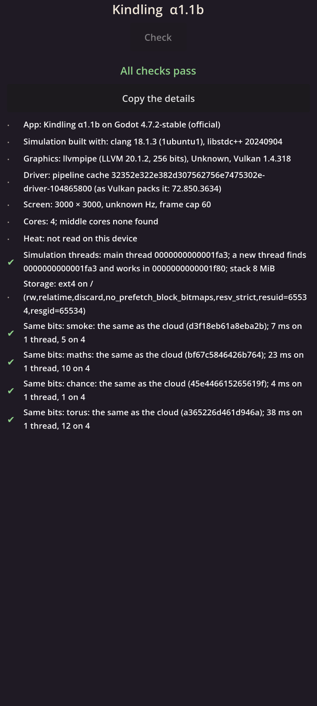

# Kindling α1.1b: Numbers and chance

## What is new

- **The numbers everything else will compute with,** the same to the last bit in the cloud and on your phone:
  - **Maths that rounds correctly:** 18 maths functions (powers, logarithms, the sine and its kin, and more) from CORE-MATH, a research library that gives each answer as the one exactly right number, so no two machines can disagree. In the cloud each was held to MPFR, the reference library for this, on 3.8 million answers: every bit agreed.
  - **Places on the world:** whole centimetres on the 2,000 by 1,000 km world that wraps both ways, with the way between two places and its length exact to the centimetre.
  - **Angles as turns,** so a quarter turn is exactly a quarter turn, and its sine exactly 1.
  - **Chance by key:** every random number comes from what it is for (the world, who, when and why), so it is the same whatever order things happen in and on however many threads, and a new kind of chance never changes another.
- **The banned list, enforced:** the cloud now reads the code itself and refuses the thirteen things that make phones and computers disagree, each refusal naming what to use instead (for example the phone's own sine, or a sort that leaves ties to chance).
- **Two more trial builds:** your phone's compiler builds the proofs twice more with its sorting shuffled at random, and the answers must not move. All twelve runs in the cloud now agree.
- **On your phone,** the self-check has three new lines: maths, chance and torus (the world's geometry), each saying whether your phone's answer is exactly the cloud's and how long it took on one thread and on four.

## What to try

1. Tap **Download and install** at the top of this page. It installs over α1.1a.
2. Open **Kindling**. It opens on its **Check** page.
3. Look at the four **Same bits** lines: smoke, maths, chance and torus. Each should be green and say "the same as the cloud".
4. Tap **Copy the details** and paste them into the chat. I still need your phone's own lines (its driver, cores, heat, storage and screen rate), and now the times of the new lines too.

## What is rough

- There is still only one page. Next comes the clock and the calendar (α1.2a).
- The times are from the first run after the app opens, before the phone settles; the benchmark at the end of the foundations measures properly.
- Your phone's details from α1.1a have not arrived yet, so whether the screen now runs at 60 Hz is still unconfirmed.

## IDs delivered

- `RES-05`: correctly rounded maths, exact places and angles, the one checked conversion from fractions to whole numbers, and the banned list, with the same bits on every build in the cloud and on your phone.
- `TIM-16`: chance keyed by what it is for, so adding a new kind of draw never changes another.
- `WLD-01`: the world's wrapping, in exact whole centimetres.
- `PLT-01`: the proofs on the simulation's own threads, one and four.
- `PRC-10`: the banned list and the two shuffled builds join the checks.

## Links

- APK: https://github.com/gunsandsalvi/Project-Nature/raw/ccr-13ab6fef-fspju6/dist/kindling.apk
- Note: https://claude.ai/artifact/GBackmSHJPak61yAd6we4d
- The plan for M1: https://github.com/gunsandsalvi/Project-Nature/blob/ccr-13ab6fef-fspju6/IMPLEMENTATION.md
- The research behind it: https://github.com/gunsandsalvi/Project-Nature/blob/ccr-13ab6fef-fspju6/research/18-foundations.md
- What pre-production taught: https://github.com/gunsandsalvi/Project-Nature/blob/ccr-13ab6fef-fspju6/LESSONS.md
