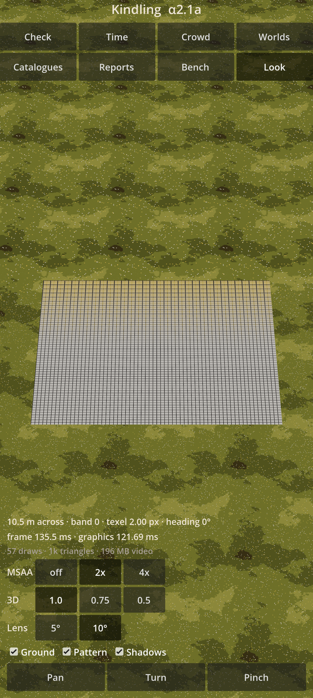
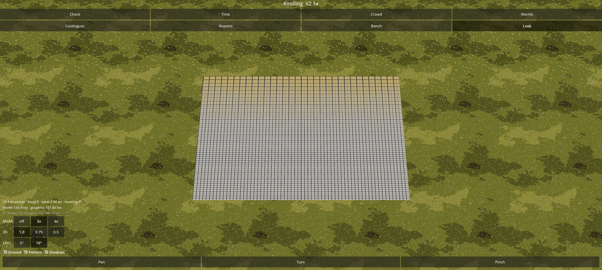

# Kindling α2.1a: The picture and the bench

The first step of the graphics engine (M2): the world drawn at your screen's full resolution, a camera you can move, textures with levels of our own, the phone's new readings, and probes of every graphics feature the look will lean on.

## What is new

- **Look.** A new **Look** page draws a pixel-art meadow in real 3D at the closest zoom, straight into the screen at its full resolution with 2× MSAA, the page's controls over it.
  A test board in the middle names the texture level being read by its colour: white is the closest level, yellow the next, then green, cyan, blue.
- **The camera.** Drag to move, pinch to zoom, twist two fingers to turn, or tap and then drag down with one thumb to zoom in.
  - The ground under your fingers stays under them; a twist starts only after 10°, so a pinch never turns the view.
  - When you lift your fingers it settles on 5° turns and 1.25× zoom steps.
  - Turning the phone keeps the view, the zoom and the texture pixels' size.
- **Switches.** MSAA off, 2× or 4×; the 3D at full, 0.75 or half scale; the lens 5° or 10° across; the ground, the board and shadows on or off; and three scripted camera moves: **Pan**, **Turn** and **Pinch**. They change only the drawing, never a world.
- **Readings** under the picture: the frame time and the graphics chip's time; draws, triangles and video memory; the chip's headroom; the power drawn from the battery; and the heat forecast against your phone's own light-throttling level.
- **Probes.** On its first start, the self-check tries each graphics feature the look will rely on, drawing a little with each: MSAA at full resolution, two ways of reading textures, texture arrays with levels of our own, smoothed cut-out edges, the driver's shading rates, bone weights in instanced drawing, and Godot's GPU particles, which are expected to fail.
  Each probe is noted before it runs, so if one closes the app, the next start names it and skips it.
- **The heat guard** now slows time a little below your phone's own light-throttling level, which it reads from the phone, instead of at a fixed guess; a missing heat reading no longer counts as a cool phone.
- **The bench's code** carries the new readings (its layout 3).

The meadow and the board are stand-ins made by code. The art lane is preparing the real materials for the camp (meadow, earth, gravel and river bed, limestone, hide, bark and poles, brush, hearth stones, ash), each with its levels and a sheet for your yes or no.

Measured in the cloud's picture, a texture pixel on the board is 2.0 screen pixels wide and 1.2 tall: the 37° tilt squeezes it to about 0.6 of its width, as planned, and by its area it is 1.6, inside the line of 1.5 to 3.

## What to try

1. Install the APK over 20502. Your worlds carry on.
2. Open **Check**: it now lists the probes, the shading rates, the graphics headroom and your phone's heat thresholds.
   If the app closes while the probes run, open it again: Check names the probe that closed it. Godot's GPU particles may do so once; that is expected.
3. Tap **Copy the details** and paste them into the chat: the probes, shading rates and thresholds are what the next steps are planned around.
4. Open **Look**: drag, pinch and twist the meadow; flip the switches and watch the graphics time; try **Pan**, **Turn** and **Pinch**.
5. Turn the phone sideways and back: the view should stay as it was.

## What is rough

- The meadow is a flat stand-in under Godot's plain light; the real light, the real materials and the camp come in the next steps.
- The tilt flattens texture pixels top to bottom; your eye judges that against the pictures you liked at first light.
- The power rails are not read: Android gives them only to Java callbacks, which the app does not have yet, so power is the battery's current times its voltage.
- Godot's release build times only the whole picture, not each pass, so each part's cost will come from switching it off in turn, as the calibration scenes do.

## IDs delivered

- `PRE-01`, `PRE-02`: the 3D world at the screen's full resolution with 2× MSAA, wearing pixel-art textures.
- `PRE-22`: textures with levels of our own, read by one sampling function: crisp texture pixels with edges smoothed over one screen pixel, each zoom band's level picked by the texture pixel's size on screen.
- `PRE-33`, `PLT-02`: the camera's gestures, and turning the phone.
- `PLT-04`: the new readings, the bench code's layout 3, and the heat guard at the phone's own level.
- `VIS-14`: the probes of the phone's graphics features.

## Links

- APK: https://github.com/gunsandsalvi/Project-Nature/raw/ccr-13ab6fef-fspju6/dist/kindling.apk
- This note: https://github.com/gunsandsalvi/Project-Nature/blob/ccr-13ab6fef-fspju6/dist/NOTE.md
- The plan for M2: https://github.com/gunsandsalvi/Project-Nature/blob/ccr-13ab6fef-fspju6/IMPLEMENTATION.md
