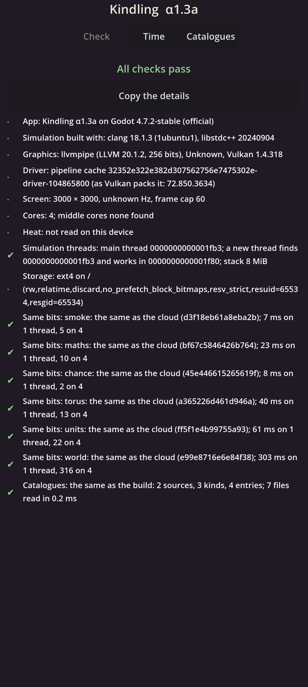

# Kindling α1.3a: Entities and events

## What is new

- **The world's clockwork.** Everything in the world will be an entity with an id that is never used twice, and all work happens at events on one queue, in an order fixed by each event's moment, its owner and its owner's count. So the world runs exactly the same on your phone and in the cloud, however its run is cut up.
- **A first crowd.** Until people exist, the demonstration's markers stand in: 25 to a camp, camps scattered by keyed chance over a square 20 km across. Each marker walks to a place up to a kilometre from its camp, rests, walks again, and sleeps from dusk to dawn. Every walk is an activity with a start, an end and a way, ending at its own event.
- **Daylight.** A first layer of the world: one event at each dawn and dusk.
- **Digests of everything.** At every game midnight the world can digest its clock, its queue, every component of every entity in id order, and its systems. A check scrambles the entities' internal order before every batch, and the digests must not move; they did not.
- **Fast enough.** The full crowd of 10,000 markers ran 60 game days, 14.4 million events, in 8 seconds on one cloud core.
- **On your phone,** the self-check now runs a small world of 1,000 markers for 30 game days, and its digest must equal the cloud's.

## What to try

1. Install the APK from the link below. It installs over α1.2b.
2. Open **Kindling**. The **Check** page should show a green line **Same bits: world: the same as the cloud**, with how long the small world took on one thread and on four.
3. Copy the Check page's details into the chat, so I can see the phone's times.

## What is rough

- You can't see the crowd yet: it walks only inside the simulation. Drawing it on your phone is α1.3c.
- The world runs on one core. Running it on four cores with exactly the same result comes in α1.3b, along with markers that meet and greet.
- The world on the phone is still small and short; the full crowd comes with its page.

## IDs delivered

- `TIM-17`: work at events in one fixed order, activities with a start, an end and a way, each ending at its event, and an effect on another owner landing at least a second later.
- `TIM-16`: the world run one event at a time is the reference, and its digests do not depend on how the run is cut.
- `RES-05`: the same bits everywhere: the world's digest equal on all five builds, on one thread and four, and on your phone; nothing depends on the entities' internal order.
- `MAT-13`: each marker made from its catalogue entry.

## Links

- APK: https://github.com/gunsandsalvi/Project-Nature/raw/ccr-13ab6fef-fspju6/dist/kindling.apk
- This note: https://github.com/gunsandsalvi/Project-Nature/blob/ccr-13ab6fef-fspju6/dist/NOTE.md
- The plan for M1: https://github.com/gunsandsalvi/Project-Nature/blob/ccr-13ab6fef-fspju6/IMPLEMENTATION.md
- The research behind it: https://github.com/gunsandsalvi/Project-Nature/blob/ccr-13ab6fef-fspju6/research/18-foundations.md
