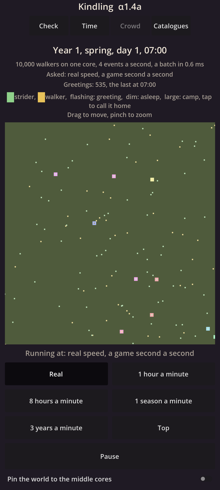
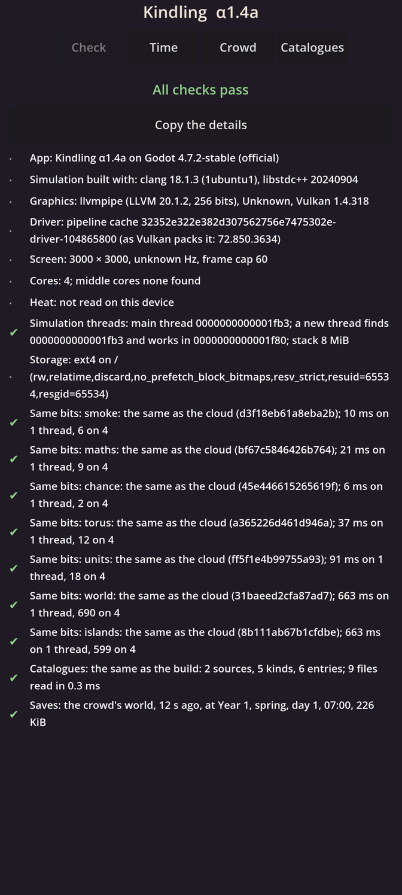

# Kindling α1.4a: Saves and the journal

## What is new

- **The crowd's world is kept on your phone.** It is saved every 30 seconds, and again whenever the app leaves the screen. Close the app, swipe it away or restart the phone: the Crowd page opens the same world, where it was.
- **Your commands come first.** Tap a camp to call it home: its 25 markers stop what they are doing and walk back. The command is written to the phone's storage, and made safe, before it acts.
- **Nothing is lost after a crash.** Only the last save and your commands are kept; everything after the save is worked out again, exactly. As the world catches up, each greeting it remakes is checked against the one written before, and a difference would be reported as a bug.
- **Damage is refused.** A save that is cut short, has one changed bit, or ends in zeros is moved aside and never opened; the save before it is used.
- **Tested hard in the cloud.** A world was killed at 100 random moments, as Android kills apps. Each time it opened again and carried on, and it ended exactly like a world never killed. A fake disk also cut the power between every two writes, and every file was always either the old one or the new one.
- **Small and quick.** A save of the 10,000 markers is about 240 KB. In the cloud it takes 3 ms to copy and 3 ms to compress, off the screen's thread.
- **The self-check** shows when the crowd's world was last saved, and at what moment of its time.

## What to try

1. Install the APK from the link below. It installs over α1.3c.
2. Open **Check**: every line should be green. **Same bits: world** and **Same bits: islands** have new numbers, since commands are now part of the world.
3. Open **Crowd**, pinch in on a camp (a large square), and tap it. Its markers walk home, and the counters say "Camp N called home".
4. Swipe the app away from your recent apps while they walk, and open it again. The world should be where you left it, the camp still walking home.
5. Open **Check** again: the **Saves** line says how long ago it was saved.

## What is rough

- Your phone keeps one world, the crowd's. Several worlds, export and import come in the next step, α1.4b.
- After a crash, the page shows "Catching up" for a moment while the world remakes what it lost. After a normal close there is nothing to catch up.
- A saved world opens only with the same version of the rules; opening old saves in new versions also comes in α1.4b.

## IDs delivered

- `TIM-05`: the world closes and reopens exactly where it was.
- `PLT-07`: saves every 30 seconds and on leaving the screen; commands safe before they act; a crash or kill loses nothing; damaged files refused.
- `PLT-10`: history kept in a file for each game year, as it happens.
- `RES-05`: a reopened world carries on exactly as one never closed, checked on every build.

## Links

- APK: https://github.com/gunsandsalvi/Project-Nature/raw/ccr-13ab6fef-fspju6/dist/kindling.apk
- This note: https://github.com/gunsandsalvi/Project-Nature/blob/ccr-13ab6fef-fspju6/dist/NOTE.md
- The plan for M1: https://github.com/gunsandsalvi/Project-Nature/blob/ccr-13ab6fef-fspju6/IMPLEMENTATION.md
- How saves work: https://github.com/gunsandsalvi/Project-Nature/blob/ccr-13ab6fef-fspju6/ARCHITECTURE.md
