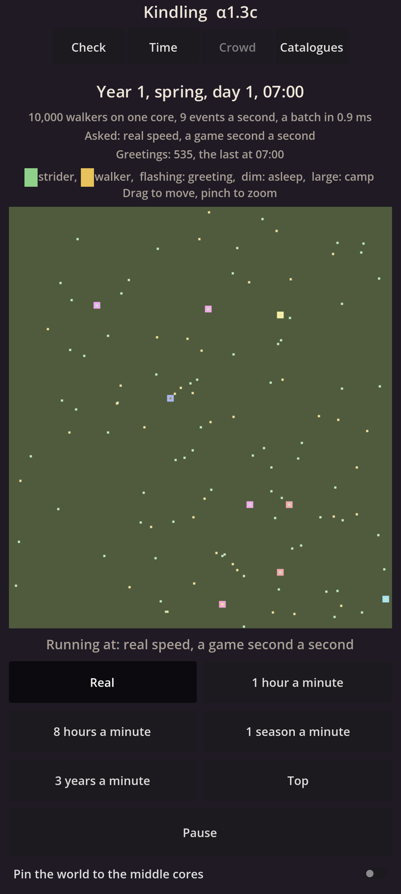

# Kindling α1.3c: The crowd on your phone

## What is new

- **A Crowd page.** 400 camps of 25 markers, 10,000 in all, walk, rest, meet, greet and sleep on the simulation's own thread, and your phone draws them from the newest copy of the world it has, at any speed.
- **Exactly where the world has them.** The world runs up to a quarter of a second ahead of the screen. So the screen also gets each marker's recent walks, and draws every marker exactly where the world has it at each game second, gliding in between. A test checks this for every marker at 1,780 moments, with the world running half an hour ahead.
- **A livelier crowd.** Markers now rest for different lengths of time and wake at different moments after dawn, so the crowd no longer moves in waves.
- **What you see.** Markers are coloured by their kind, as the catalogue sets: green for striders, yellow for walkers. A marker flashes while it greets, is dimmed while it sleeps, and the ground darkens at night. Camps are the larger squares, each in its own colour.
- **Speed and heat.** The Time page's speeds, now shared by both pages. At top speed the screen asks for a little less than your phone can do, so it glides behind the world rather than catching it. In the cloud, top speed holds about 2.3 game days a second, some 600,000 events a second, with every frame on time.
  Every 2 seconds the page reads your phone's heat forecast. If heat nears the point where the phone slows itself, time slows first. Full speed comes back slowly, after a calm minute.
- **Pinning,** a switch that keeps the simulation on your phone's middle cores, for the benchmark to compare later.

## What to try

1. Install the APK from the link below. It installs over α1.3b.
2. Open **Kindling**, then **Check**: the lines should all be green, with **Same bits: world** and **Same bits: islands** as in the cloud.
   Their numbers changed with the livelier crowd.
3. Open **Crowd**. It opens at 7 in the morning, at real speed.
   - Pinch to zoom in on a camp: at real speed, markers walk at a walker's pace.
   - Drag to move around. Pinch out to see the whole crowd.
4. Try every speed, and **Top**. The line under the counters says the speed you asked for, and **Running at** the speed you really get.
5. Send me what the counters say at **Top**, and whether the movement looks smooth.

## What is rough

- The markers are plain squares on flat ground. The real look comes with the graphics engine (M2).
- At **real speed** in the morning, most markers are resting, so few move at once. Faster speeds show more.
- The heat line appears only when heat slows time, so you may never see it.
- The drawing takes about 0.8 ms of each frame in the cloud; your phone's figure comes with the benchmark (α1.5b).

## IDs delivered

- `WLD-13`: the world runs ahead of the screen, and the screen still shows exactly the world's state at its own time.
- `PLT-01`: the simulation runs on its own thread, with the heat governor and the switch to pin it to the middle cores.
- `TIM-01`: the zoom stops' speeds and top, with the speed you get shown beside the speed you asked for.
- `TIM-10`: at real speed, a game minute takes a real minute.

## Links

- APK: https://github.com/gunsandsalvi/Project-Nature/raw/ccr-13ab6fef-fspju6/dist/kindling.apk
- This note: https://github.com/gunsandsalvi/Project-Nature/blob/ccr-13ab6fef-fspju6/dist/NOTE.md
- The plan for M1: https://github.com/gunsandsalvi/Project-Nature/blob/ccr-13ab6fef-fspju6/IMPLEMENTATION.md
- How the screen follows the world: https://github.com/gunsandsalvi/Project-Nature/blob/ccr-13ab6fef-fspju6/ARCHITECTURE.md
