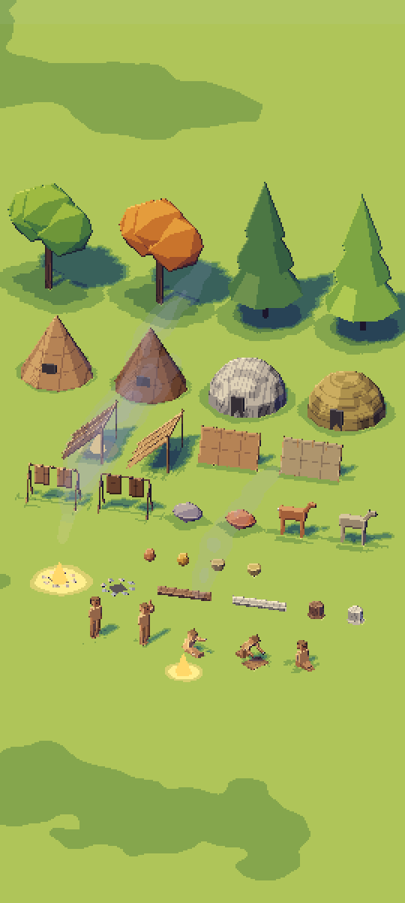
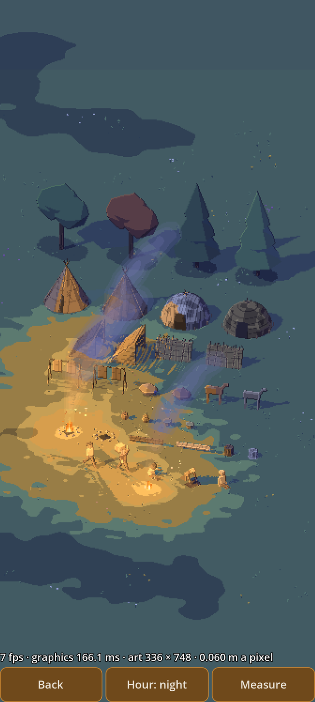
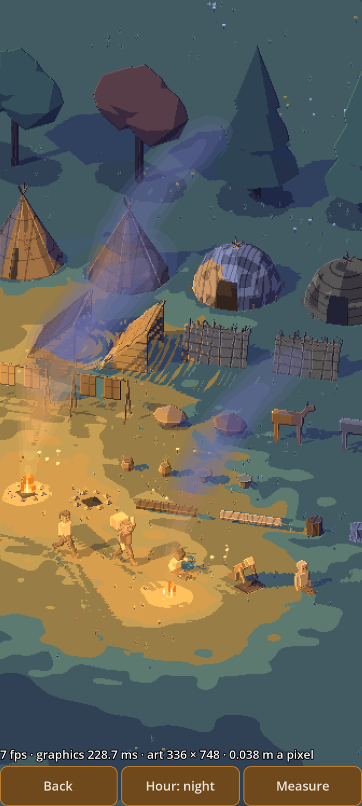
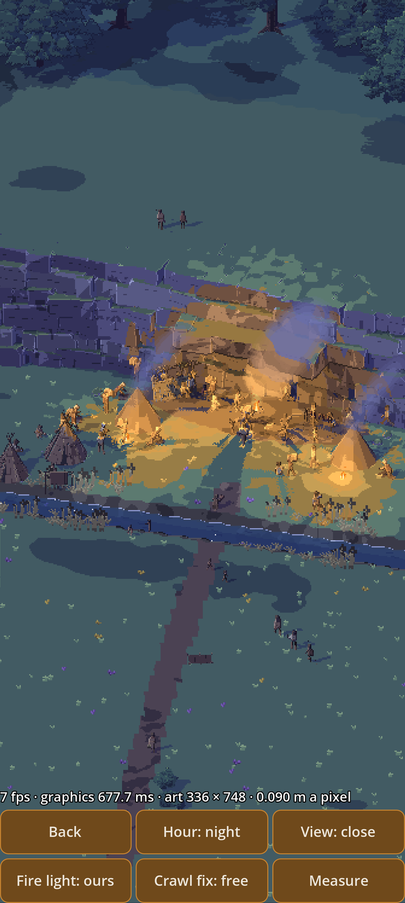
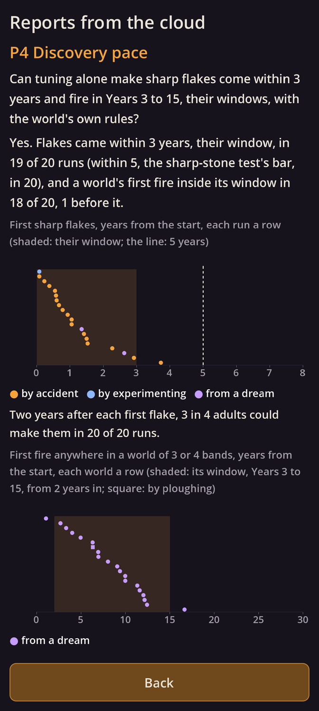

# Kindling α0.4b: P5 The same bits and P6 A thousand minds, with the faster discoveries for your look

## What is new

- **P5 The same bits.** A world must end the same on your phone and in the cloud, on one core or four, so a world replays exactly and the cloud's tests speak for your phone (`RES-05`, `TIM-16`). P5 tries it in C++, the game's own language, with a toy world:
  - 4,096 walkers, each acting at its own moments; every chance they take is fixed by who takes it, when and why, never by what came before;
  - our own sine, cosine, exponent, logarithm and power, so no chip's maths library can differ in a last digit;
  - in the cloud, its 30 days end with the same fingerprint on the cloud's chip and on your phone's kind of chip (imitated by an emulator), on one thread and on four.
- **The app now carries C++.** P5's screen runs the very code the cloud ran, on your phone's own chip, and sets its fingerprints beside the cloud's.
- **P6 A thousand minds.** Can your phone keep a game year a real minute with a thousand people (`TIM-07`)? P6 tries it with simple minds in C++:
  - 1,000 people in 40 bands, each with nine needs (hunger, thirst, rest, warmth and the rest) running down at their own rates;
  - 50 things to do, each scored by what it does for the needs, the person's nature, the hour, the effort and the distance; the top three reasons are kept, as the person card will show them (`PRN-13`);
  - talk that passes on places, opinions of others and news, and paths found in levels across rough land, rock, thickets and a river with fords;
  - in the cloud: about 7 game years a real minute on one core and 12 on four, against a target of at least 1 and a hope of 2 to 3; one thread and four, and your phone's kind of chip, end every day the same.
  - Your phone decides: its cores are slower than the cloud's, and they slow further as they warm, so P6 runs for 10 minutes and counts only the last 8.
- **Everything from α0.3a is still here for your look:** every discovery window halved, P4 Discovery pace, and your P3 comments fixed (below).

## What to try

1. Tap **Download and install** at the top of this page. It installs over the build you have.
2. Open **P5 The same bits** and tap **Run**. It takes a few seconds; it copies one line. Paste it into your reply.
3. Open **P6 A thousand minds**, tap **Run** and put the phone down for about 10 minutes; the screen stays on. It copies one line at the end. Paste it into your reply.
4. If you haven't yet, α0.3a's tries:
   - open **P3 The kit**, tap **Hour** for dusk and night, turn the sheet with two fingers and pinch in on the figures;
   - open **P2 A full scene** and look at the people by the fires and the smoke;
   - open **Reports from the cloud** and scroll through P4's runs;
   - in P3, tap **Measure**, don't touch the screen for about 40 seconds, and paste the line it copies.
5. Say what reads well and what doesn't.

## What α0.3a changed

- **Faster discoveries, as you asked:** every discovery window is halved. Sharp flakes come within Years 1–3 and fire in Years 3–15; clothing and huts 5–20, pottery 30–75, tame dogs 40–75, herding 60–125, villages 50–150, farming 100–175, copper 150–250.
- **P4 Discovery pace says yes:** with only the world's own rules and no dates set anywhere, sharp flakes came within 3 years in 19 of 20 runs, and a world's first fire in Years 3–15 in 18 of 20; no setting holds the pace on a knife's edge.
- **Your P3 comments, fixed:** wider amber firelight and flickering flames, grey daytime smoke, gentler turns, figures in their own clothes with a pose at every step, a carrier's bundle on the back, packed windbreaks and coursed lean-tos, and P2's people from the kit.

## What is rough

- **P5 checks a toy world, not the game's.** The game's world gets the same checks from its first step (A3.4).
- **Your phone is the real test of P5:** the cloud's emulator imitates your phone's kind of chip, not its exact one.
- **P6's minds are simple:** no bodies, no feelings, no plans of several steps; a full mind costs more. Four cores run them less than twice as fast as one, since a third of the work must happen in order.
- **Fire's pace rests on dreams.** In P4 every world's first fire began with a dream's hunch; the game will be tuned again with all its blueprints, and the risk stays open until then (`RSK-01`).
- **Dusk:** the art book's 5° sun throws long stripes across every screen.

## Questions for you

1. **Is half enough?** Every discovery window is now half as long. Faster still, or right? Halving also touches what is tied to the old years, which I left as they were for you to decide: the pace tests' runs to Years 60, 150 and 500 (`RES-07`), culture's windows (`CUL-33`), and the people counts at Years 400 and 500 (`BIO-04`).
2. **The sharp-stone test.** It still asks for flakes within 5 years; I propose 3, to match (`RES-03`). At the tuned values it passes either way. OK?
3. **Dusk.** The sun at dusk stays at the art book's 5°. Keep it?
4. **Heat.** P2's Measure runs about 90 seconds at your word, but the plan's heat run is 10 minutes. P6's run in this build lasts 10 minutes and records the phone's heat: is that enough?

## IDs delivered

None for good: P5 and P6 are prototypes, thrown away once they have answered.
P5's question is about `RES-05` and `TIM-16`; P6's about `TIM-07`, `MND-15`, `MND-09`, `MND-14` and `TIM-17`.

## Links

- APK: https://github.com/gunsandsalvi/Project-Nature/raw/ccr-13ab6fef-fspju6/dist/kindling.apk
- Note: https://claude.ai/artifact/GBackmSHJPak61yAd6we4d
