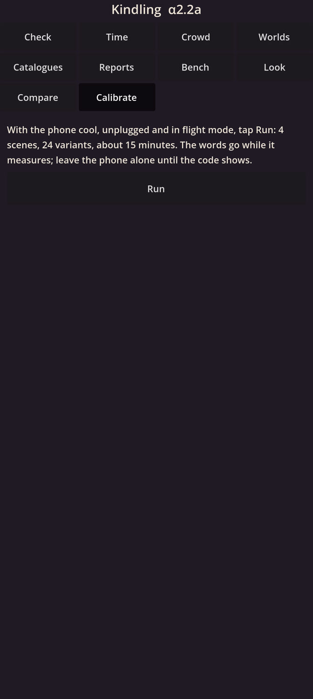
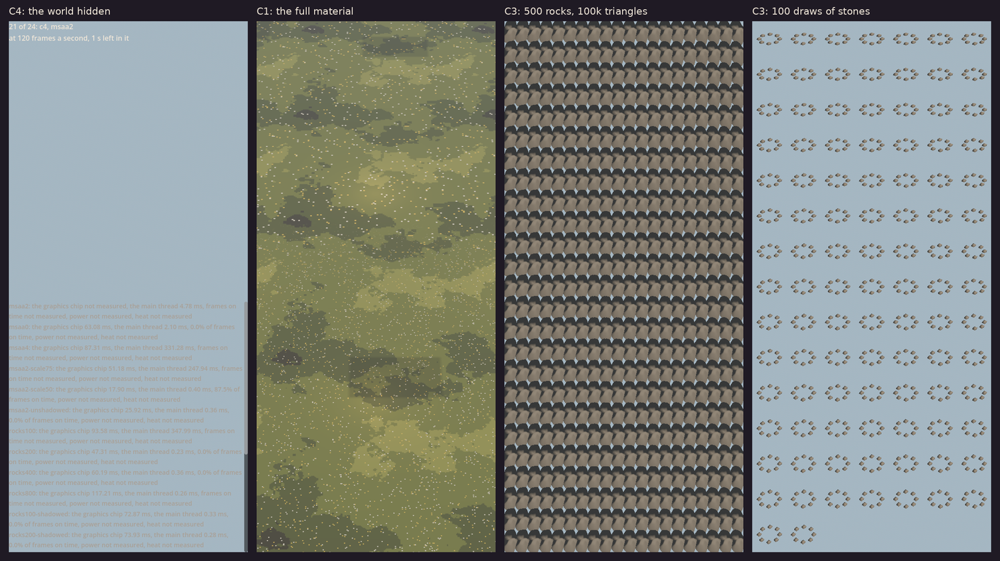

# Kindling α2.2a: Calibration, the first numbers

The third step of the graphics engine (M2): your phone measures what only it can, each number's decision written down before it runs. What an empty frame costs; what the full ground material costs over the whole screen at full resolution; and what a triangle and a draw cost.

## What is new

- **Calibrate.** A new **Calibrate** page runs four calibration scenes one after another with one tap, in about 15 minutes, and ends with one code to send me.
  Each scene tries a few ways of drawing the same thing: 24 in all.
  Each way is drawn for 3 seconds to settle, timed for 10 seconds at up to 120 frames a second, then watched for 20 seconds at 60 for smoothness, power and heat.
- **The four scenes:**
  - **C4, the empty frame:** the world hidden, with the interface over it and without, MSAA off and 2×.
  - **C1, the full material:** a meadow filling the screen, lit by the first version of the shared light: sun, sky and bounce, a soft sun shadow, the openness and contact maps, haze, four fires in every square of the light grid, and the colour table. MSAA off, 2× and 4×, the 3D at full, three quarters and half resolution, and once without the sun's shadow.
  - **C3, triangles:** 500 rocks at 100, 200, 400 and 800 thousand triangles, with the sun's shadow and without.
  - **C3, draws:** 100, 300 and 1,000 draws of small stones, in two passes and in three.
- **The decisions, stated now:**
  - C4 over 2.0 ms: look first at the interface pass and Godot's stores.
  - C1 at most 2.5 ms: full resolution everywhere; 2.5 to 4.0 ms: I build the shading-rate patch for you to judge (α2.2c); over 4.0 ms: simplify the material first.
  - C3 at most 4 ns a triangle: the triangle line rises to 0.6 million a frame; 4 to 6 ns: it stays at 0.4 million; over 6 ns: 0.3 million, with leaves kept as cards or the leaf pre-pass.
  - 300 draws at most 3.0 ms of the main thread: keep about 300 draws; over: gather each form's copies into one buffer.
- **In the cloud,** every scene is drawn on the software driver, each way drawing exactly the triangles and draws its file states, and the code reads back.

## What to try

1. Install the APK over 30102. Your worlds carry on.
2. Let the phone cool, unplug it, and turn on flight mode.
3. Open **Calibrate** and tap **Run**. Leave the phone alone for about 15 minutes: the screen shows the sky, a meadow, rocks and rings of stones in turn, and the words disappear while it measures.
4. When the code shows, tap **Copy the code** and send it to me. Under it, each scene's number and the decision it makes.

Still welcome: your blind test's code from **Compare**, if you have not sent it yet.

## What is rough

- The light's numbers are stand-ins: the meadow is lit for its cost, not yet for its look.
- The cloud's software driver times nothing true, so only your phone gives the numbers.
- Found while building: Godot's stock material goes dark once the sun's shadow has been drawn, at least on the cloud's driver. Our own light stays right, so every part of the world will use it.

## IDs delivered

- `PLT-04`: the calibration runner, its scenes, and one code that reads back in the cloud.
- `PRE-01`: C4 and C1, the fixed cost and the full material at full resolution.
- `PRE-30`: the first version of the shared light.
- `RES-09`: every scene's line and decision stated in its file before its first run.

## Links

- APK: https://github.com/gunsandsalvi/Project-Nature/raw/ccr-13ab6fef-fspju6/dist/kindling.apk
- This note: https://github.com/gunsandsalvi/Project-Nature/blob/ccr-13ab6fef-fspju6/dist/NOTE.md
- The plan for M2: https://github.com/gunsandsalvi/Project-Nature/blob/ccr-13ab6fef-fspju6/IMPLEMENTATION.md
