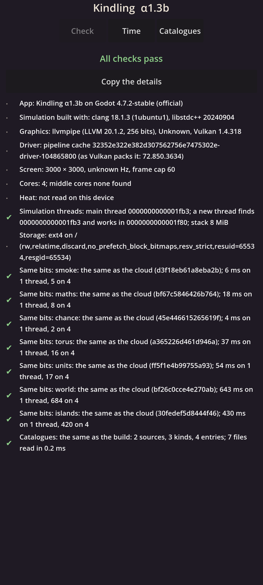

# Kindling α1.3b: Activities and islands

## What is new

- **Activities that can be cut short.** Anything a marker does can be interrupted and keeps what it reached: a walker stopped halfway stands halfway along its way. Something that builds up will give its share.
- **Meeting and greeting.** When a marker arrives, it may greet someone within a couple of metres at that very second, worked out from where everyone's walk has taken them. The call lands a second later, as every effect on someone else does: the other stops what it is doing, and the two greet for a minute. Some walks now lead back to the camp, where markers gather, so greetings are common there.
- **History.** Each greeting is written into the world's history, the first thing the history holds.
- **Islands.** The world can now run on several cores. Game time is cut into short windows; in each, the markers that could possibly touch each other join one island, and islands run side by side. The result is exactly the same as running one event at a time: a test checks it with windows of 1, 5 and 15 minutes on one to four threads, stopped at random moments, and a planted rule that peeks at another island is caught.
- **An honest result.** For this crowd, islands cost more than they save, since each marker's step takes about a microsecond, so the crowd runs on one core. Islands are kept for heavier work later, such as people's minds.
- **On your phone,** the self-check runs the islands on its four cores and checks they give the same world as one core.

## What to try

1. Install the APK from the link below. It installs over α1.3a.
2. Open **Kindling**. The **Check** page should show two green lines, **Same bits: world** and **Same bits: islands**, each the same as the cloud.
3. Copy the Check page's details into the chat, so I can see your phone's times.

## What is rough

- You still can't see the crowd: drawing it on your phone is the next step, α1.3c.
- The islands make the crowd slower, not faster. They will earn their keep when the simulation's work grows heavier.

## IDs delivered

- `TIM-17`: activities cut short keep what they reached; a call lands a second later; meetings found from everyone's ways at the exact second.
- `RES-05`: islands give the one-core result on any number of threads, on every build and on your phone.
- `WLD-13`: the world runs the same whatever window or speed it is driven at, paused anywhere.
- `PLT-01`: the simulation can spread over the phone's cores.

## Links

- APK: https://github.com/gunsandsalvi/Project-Nature/raw/ccr-13ab6fef-fspju6/dist/kindling.apk
- This note: https://github.com/gunsandsalvi/Project-Nature/blob/ccr-13ab6fef-fspju6/dist/NOTE.md
- The plan for M1: https://github.com/gunsandsalvi/Project-Nature/blob/ccr-13ab6fef-fspju6/IMPLEMENTATION.md
- How islands work, and what they cost: https://github.com/gunsandsalvi/Project-Nature/blob/ccr-13ab6fef-fspju6/ARCHITECTURE.md
