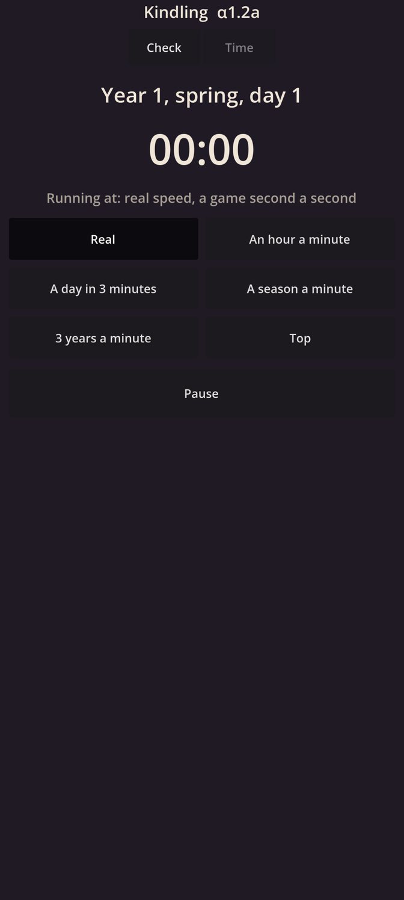

# Kindling α1.2a: The clock and the calendar

## What is new

- **Game time.** The world now has a clock: whole game seconds from Year 1, spring, day 1, in the 60-day year of four 15-day seasons. Any moment reads as a date, "Year 112, autumn, day 6", and a place in the other half of the world adds its own season: "Year 140, winter (their summer), day 3".
- **Durations with two lengths.** Every length of time the catalogues will hold keeps its length in life and in the game, and a check holds the two to the game year's rule: up to about two weeks they are equal; from a month on, the game length is about a sixth; between, anything from about a sixth up to the real length. Smoked meat's three months as 15 game days passes; three months as 30 game days is refused, with the reason.
- **The world on its own thread.** It works toward a goal a quarter of a real second ahead of what you see, and sleeps when it gets there.
- **The speed loop.** The screen's time follows the speed you choose but never runs ahead of the world: when the world can't keep up, time slows rather than the screen stuttering, and the speed shown is the one actually drawn. Pausing stops within a quarter of a second, on exactly the world's state.
- **A new page, Time:** the date and hour, the six speeds of the zoom stops from real speed to top, pause and play, and the speed it really runs at. Until the real world exists, a stand-in does a fixed amount of work for each game hour, so top speed shows what your phone can do.

## What to try

1. Tap **Download and install** at the top of this page. It installs over α1.1b.
2. Open **Kindling**, then tap **Time** at the top.
3. At **Real**, watch the clock: a game minute should take a real minute.
4. Try each speed. "Running at" should match it: 1 game hour a real minute, then 8 game hours (a day in three minutes), 1 game season, and 3 game years a real minute.
5. Tap **Top** and read how many game years a real minute your phone manages. Please send me that number.
6. Tap **Pause**: the clock should stop at once, and **Play** carries on.
7. The **Check** page is still there; copy its details into the chat when you can.

## What is rough

- There is no world yet: the stand-in only counts hours. The world's entities and events come in α1.3.
- At **Top** one core works flat out, so leaving it there warms the phone. The guard that slows time before the phone heats comes with the phone's measurements later in M1.
- The buttons and the look are plain; the game's own look comes with the graphics engine (M2).
- The speeds are written into the page for now; they move to the tuning files in the next step (α1.2b).

## IDs delivered

- `TIM-14`: dates as year, season and day, and the other half's season beside them.
- `TIM-18`: the 60-day year, and durations with two lengths held to its rule.
- `TIM-01`: the speeds of the zoom stops, with the speed shown always the real one.
- `TIM-10`: at real speed a game minute takes a real minute.
- `PLT-01`: the world on its own thread, with its own stack, a lower priority and the standard number mode.

## Links

- APK: https://github.com/gunsandsalvi/Project-Nature/raw/ccr-13ab6fef-fspju6/dist/kindling.apk
- Note: https://claude.ai/artifact/GBackmSHJPak61yAd6we4d
- The plan for M1: https://github.com/gunsandsalvi/Project-Nature/blob/ccr-13ab6fef-fspju6/IMPLEMENTATION.md
- The research behind it: https://github.com/gunsandsalvi/Project-Nature/blob/ccr-13ab6fef-fspju6/research/18-foundations.md
- What pre-production taught: https://github.com/gunsandsalvi/Project-Nature/blob/ccr-13ab6fef-fspju6/LESSONS.md
