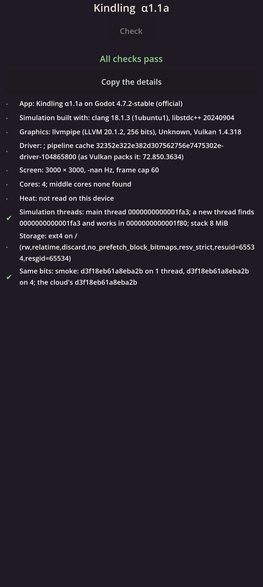

# Kindling α1.1a: The workshop

## What is new

- **Production has begun.** Pre-production is closed: its lessons are kept in `LESSONS.md`, and its code is gone. This is the first build of the real game, written fresh, starting from the foundations (M1). The plan for all of M1 is eleven steps in five alphas, each ending with a build like this one.
- **For now the app is one page: its self-check.** It runs every time the app opens, and each line turns green when it holds, amber when it is worth a look, and red when it fails:
  - the app's and Godot's versions, and the compiler the simulation was built with;
  - your graphics chip and its driver;
  - the screen: its size and refresh rate. The aim is 60 Hz, which saves battery; the old builds left your screen at 120. The line is amber if it is not 60;
  - the cores and their top speeds, and which four are the middle ones the simulation may use;
  - the heat: how far the phone is from slowing itself down, now and 10 seconds ahead;
  - the simulation's own threads: each starts in the standard number mode and with room to work;
  - how the phone's storage is set up, which matters for saving worlds later;
  - **the same bits:** a first test calculation, run on one thread and on four, against the answer the cloud worked out and put in the app.
- **Behind it, in the cloud:** every change is now built five ways: with the cloud's two compilers, with an arm64 compiler, and with your phone's own compiler running in an emulator. All of them must give exactly the same answer, on one thread and on four. The checks also read the compiled code for the two traps that research found change answers between phones and computers.

## What to try

1. Tap **Download and install** at the top of this page. It installs over the prototype app.
2. Open **Kindling**. It opens on its **Check** page.
3. Read the top line: **All checks pass** in green, or how many fail in red.
4. Look at the **Screen** line: 60 Hz is the aim.
5. Tap **Copy the details** and paste them into the chat, even if everything is green: I need your phone's own lines (its driver, cores, heat, storage and screen rate).

## What is rough

- There is only one page. The next steps add the calendar, the catalogues, a crowd of 10,000 walkers, saves and a benchmark.
- The look is plain, with Godot's default font. The game's own look comes with the graphics engine (M2).
- The heat forecast needs a few readings before it can look ahead, so at first it may show the same number as now, or "nan".
- If the Screen line is amber (still 120 Hz), the next build tries Android's own way of asking for 60.

## IDs delivered

- `PLT-01`: the simulation on its own threads, each in the standard number mode with an 8 MiB stack, and the phone's cores read to find the middle four.
- `PLT-03`: the app asks for no permissions and needs no network.
- `PLT-06`: the build installs over the last one, signed with your key.
- `RES-05`: the same bits, checked on five builds in the cloud and on your phone.
- `PRC-10`: the checks before anything joins: five builds, the same-bits comparison, and the scans of the compiled code.

## Links

- APK: https://github.com/gunsandsalvi/Project-Nature/raw/ccr-13ab6fef-fspju6/dist/kindling.apk
- Note: https://claude.ai/artifact/GBackmSHJPak61yAd6we4d
- The plan for M1: https://github.com/gunsandsalvi/Project-Nature/blob/ccr-13ab6fef-fspju6/IMPLEMENTATION.md
- The research behind it: https://github.com/gunsandsalvi/Project-Nature/blob/ccr-13ab6fef-fspju6/research/18-foundations.md
- What pre-production taught: https://github.com/gunsandsalvi/Project-Nature/blob/ccr-13ab6fef-fspju6/LESSONS.md
