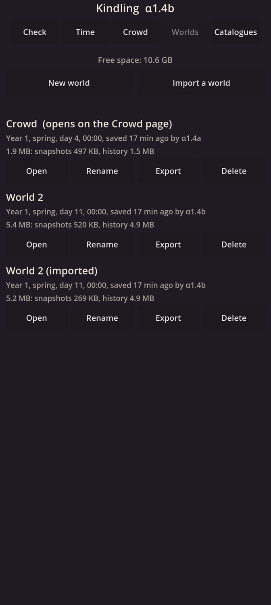
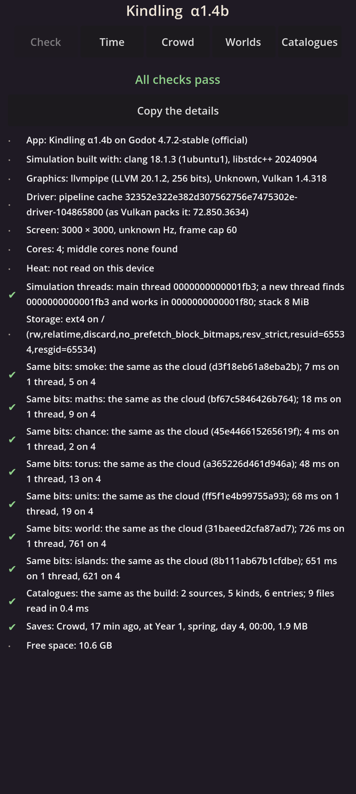

# Kindling α1.4b: Worlds, export and updates

## What is new

- **Several worlds.** A new **Worlds** page lists every world on your phone: its name, the moment of its time it was saved at, how long ago and by which version, and its size in all and by part. Make a new one, open one on the Crowd page, rename it, or delete it: Delete asks for a second tap, and the game never deletes a world by itself.
- **Switching keeps each world exactly.** Opening another world saves the one you leave, and each opens again exactly where it was.
- **Export and import.** Export writes a world to one `.kindling` file through Android's file picker, so you can keep it anywhere or move it to another phone; Import reads one back as a copy, named "(imported)". The file is checked part by part as it arrives: one changed byte, or a file cut short, is refused with words naming the damage, and leaves nothing behind.
- **Your α1.4a world carries on.** This is a **small update**: the crowd's world you kept in α1.4a opens and carries on under the new version. The last save α1.4a made is kept aside until the world has run an hour under α1.4b, then removed.
- **Old saves stay readable.** Each save now records the version that made it and the rules it was made by. A future big update, one that changes how worlds are made, will not run an older world, but will still read its history.
- **History thins with age.** Every event is kept for 25 game years; older years keep only what lasts, such as your commands. A test runs a world for 30 years to check it.
- **A warning before the phone is full.** Each save checks the free space. Below 1 GB the Crowd page and the self-check warn you and point you to Worlds, where each world's size shows.

## What to try

1. Install the APK from the link below. It installs over α1.4a.
2. Open **Crowd**: the world you had in α1.4a is there, carrying on, with a line saying an earlier version saved it.
3. Open **Worlds** and tap **New world** twice. Open each in turn with **Open**, watch a while, and switch back: each is where you left it.
4. On one world tap **Export** and save the file, then tap **Import a world** and pick that file: a copy appears, named "(imported)". Open it: it is the same world.
5. Delete the copy: tap **Delete**, then tap it again.
6. Open **Check**: every line should be green. **Saves** names the world the Crowd page opens; **Free space** shows what is left.

## What is rough

- Export and import run on the screen's thread, a few megabytes a frame: fine for these small worlds, and moved off it before worlds grow large.
- The Worlds page shows sizes but not yet how each part grows with time; the benchmark in α1.5b measures that on your phone.
- The save kept from before an update is a safety copy only: the app does not yet offer to go back to it.
- The crowd writes every greeting into its history: about 31 MB a game year. Older years thin away after 25 game years, so a crowd's world stays under about 800 MB, reached after about 11 minutes at top speed. The Worlds page shows each world's size.

## IDs delivered

- `TIM-08`: several worlds kept on the phone, switched exactly, each with its seed and the version of its making rules.
- `PLT-08`: export to a file and import, a damaged file refused with a message.
- `PLT-09`: each save records its versions and migrations; α1.4a's worlds open and carry on after this small update, the last save kept aside an hour; a corpus of each alpha's worlds is opened by every build.
- `PLT-10`: history thinned after 25 years by a fixed rule; each world's size by part; free space checked at each save, with a warning.

## Links

- APK: https://github.com/gunsandsalvi/Project-Nature/raw/ccr-13ab6fef-fspju6/dist/kindling.apk
- This note: https://github.com/gunsandsalvi/Project-Nature/blob/ccr-13ab6fef-fspju6/dist/NOTE.md
- The plan for M1: https://github.com/gunsandsalvi/Project-Nature/blob/ccr-13ab6fef-fspju6/IMPLEMENTATION.md
- How worlds and saves work: https://github.com/gunsandsalvi/Project-Nature/blob/ccr-13ab6fef-fspju6/ARCHITECTURE.md
