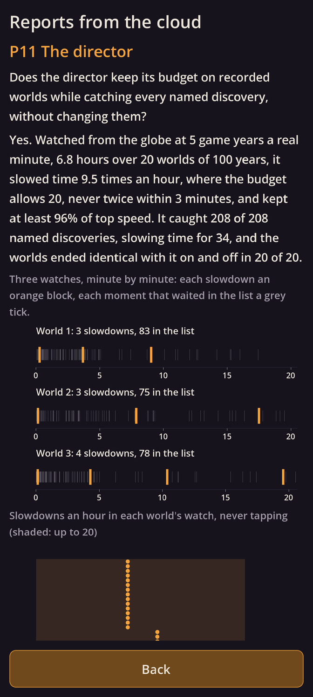

# Kindling α0.6c: P11 The director

## What is new

- **P11 answers yes.** The question: does the director keep its budget on recorded worlds while catching every named discovery, without changing them (`TIM-02`, `TIM-03`, `PRE-39`)?
  - **How:** 20 test worlds, each P10's valley of three bands with P4's discovery in three bands of their own beside it, run 100 years. Both models now write down everything as it happens: who did what, when.
  - **The recognisers** read only that log and spot what is worth telling: firsts anywhere and for each people, named discoveries, crafts lost with their last holder and found again, a band losing its last fire, the births and deaths of three people followed from the start, and feuds. Half-finished patterns are signs of what may come: a hunch tried again, a storm over a camp, one you follow hurt or ill.
  - **The director** slows time for what passes the bar, if its one budget allows: at most once every 3 minutes, never more than a fifth of the time, 10 seconds if you don't tap. Everything else waits in the list.
  - **The result,** watching from the globe at 5 game years a minute, 6.8 hours in all:
    - it slowed time **9.5 times an hour**, never twice within 3 minutes, and kept at least 96% of top speed (90% if you tap every live moment);
    - it caught **all 208 named discoveries**, slowing time for 34, and all 60 deaths of those followed, slowing for 16;
    - **every world ended identical** with the director on and off; a careless host that let it touch a world was caught; and no code path runs from it into a world.
- **What it taught** (in the notes for production):
  - **Signs rarely come true here:** a hunch tried again led to its discovery 3 times in a thousand, a storm to lightning at the camp 13 in a thousand. Scored as if they always came true, signs took four slowdowns in five, and almost none came true. So they are scored by how often they come true, and here they never slowed time.
  - **The list fills fast:** about 200 moments an hour at the globe, two thirds in a world's first 20 years, when everything is a first. Production must gather repeats and rank the list.
  - **The first minutes matter:** a watch now opens "rested", so its first slowdown goes to a major moment, the world's first sharp flake, not a custom named seconds before it.
  - **Ages and the pace:** with the pace halved twice, fire comes within 8 years of the first flakes, so the project file's 20 years between ages means no world ever has an age of fire, its own example. A change is proposed (below).

## What to try

1. Tap **Download and install** at the top of this page. It installs over the build you have.
2. Open **Reports from the cloud** and scroll to **P11 The director**: three watches minute by minute, the budget in every world, what was found and what slowed time, and world 1's slowdowns.

## What is rough

- **Two of `TIM-02`'s five signs were not tried:** a predator stalking and hostile groups in sight need animals and peoples these worlds don't have.
- **The scores, the bar and the rest after each slowdown** are my stand-ins, for tuning with you.
- **Python, not the game's C++:** a prototype, thrown away once its answer is written down.

## Questions for you

1. `PRE-39` says an age lasts at least 20 years. With the pace you chose, fire comes within 8 years of the first flakes, so there could never be an "age of fire". Shall every step of the arc (flakes, fire, clothing, huts, pottery and the rest) always begin its own age, keeping the 20 years only for new peoples and wars? It is listed under Proposals awaiting confirmation.
2. Still open from P10: shall `CUL-33` read "First custom a band names: within 1"?
3. Next is P12, the interface, on your phone: shall I go on?

## IDs delivered

None for good: P11 is a prototype, thrown away once it has answered.
Its question is about `TIM-02`, `TIM-03` and `PRE-39`.

## Links

- APK: https://github.com/gunsandsalvi/Project-Nature/raw/ccr-13ab6fef-fspju6/dist/kindling.apk
- Note: https://claude.ai/artifact/GBackmSHJPak61yAd6we4d
- Notes for production: https://github.com/gunsandsalvi/Project-Nature/blob/ccr-13ab6fef-fspju6/NOTES.md
