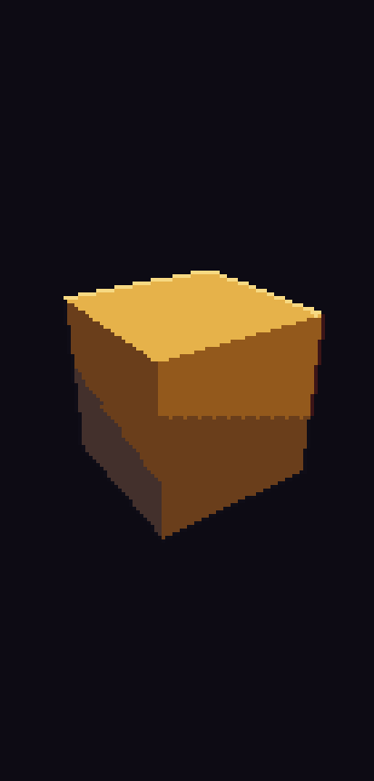

# Kindling α01a: Pixel art

## What is new
- The cube is now pixel art: drawn at a quarter of the screen's resolution in the game's own palette and enlarged with hard edges, so each pixel you see is a 4 × 4 block, in portrait and in landscape.
- Its faces step through a few shades of gold, with a narrow speckled band only where two shades meet, a dark one-pixel outline round it and a bright one-pixel rim on the edge the sun catches.
- The colours, the ladders of shades and the light tables now come from the game's data, the first catalogue. Before anything joins the main version, a check confirms every entry is complete, numbered for good and linked to what it serves.
- Touch anywhere: a strip at the top shows the version, the frame rate and the milliseconds a frame takes, in the game's own pixel font, then dissolves after three seconds. Tap the strip to step the colours through dawn, day and night.

## What to try
1. Tap the APK button: Android offers to update Kindling over the last alpha (no uninstall). Update and open it.
2. The cube looks like pixel art: chunky square pixels, gold faces in a few shades with a narrow speckled band where two shades meet, a dark outline, and a bright one-pixel rim on the top edge.
3. Touch anywhere: a strip at the top shows `Kindling a01a ...` with the frame rate (about 120 Hz) and the milliseconds a frame takes; it fades after 3 seconds.
4. Tap the strip four times: the colours shift to dawn, day and night, then back to dusk.
5. Turn the phone: the pixels keep exactly their size; nothing restarts.
6. Open the web link: the same, in the browser.

## What is rough
- Android still warns when you install from the browser. That is normal for any app from outside the Play Store and needs nothing from you.
- The font is drawn in-house at 7 pixels. You choose between it and a 9-pixel font at the Stage 2 contact sheet.
- On a computer screen the browser's pixels are bigger than the phone's, so the strip's text looks large there; on the phone it fits one or two lines.
- The milliseconds shown are the processor's time for a frame; the graphics chip's time joins later.
- Still only the cube: the valley comes in α01b.

## Your α00b results
Recorded from your messages: you uninstalled and reinstalled once, so every alpha from now on installs over the last. You registered the release key's fingerprint and the package `dev.kindling.app` in your hobbyist Android Developer Console account, and it accepted the EC key, so the RSA fallback is not needed.

## IDs delivered
In part: `MAT-13`, `MAT-17`, `PRN-17`, `PLT-09`, `PRE-01`, `PRE-20`, `PRE-21`, `PRE-22`, `PRE-30`, `PRE-32`, `PLT-02`.

## Links
- APK: [kindling.apk](https://github.com/gunsandsalvi/Project-Nature/raw/ccr-13ab6fef-fspju6/dist/kindling.apk) (629 KB, version a01a, code 1011, release key)
- Web: [Kindling alpha](https://claude.ai/artifact/NmypTQyKQUAFZs18TNJELH)
- Phone check: [Kindling phone check](https://claude.ai/artifact/RZuafpPi6Hdmu9o9nu5dHi)
